# PHP代码审计WCMS11-先知社区

> **来源**: https://xz.aliyun.com/news/17342  
> **文章ID**: 17342

---

# 环境搭建

项目地址：<https://gitee.com/wcms/WCMS>

我这里采用小皮面板搭建，源码下载到本地后，小皮面板配置信息

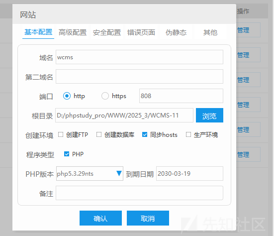

确认，然后访问/install.php文件跟着流程搭建即可

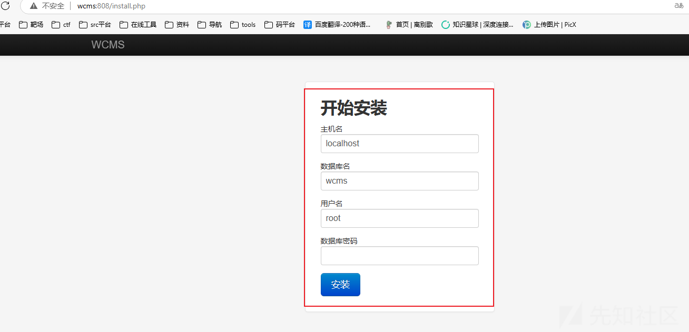

这里我没找打项目密码，然后加密方法我懒得去找了，提供个解决方案

注册个新账户，然后在数据库中把groupid的值改成1

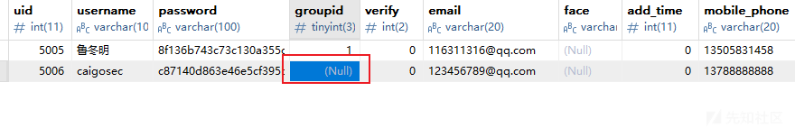 然后就可以正常登录了

# 代码审计

## 路由分析

查看入口文件index.php,前面都是配置信息

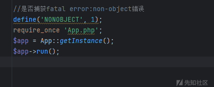

关注app实例这一块，跟到App.php

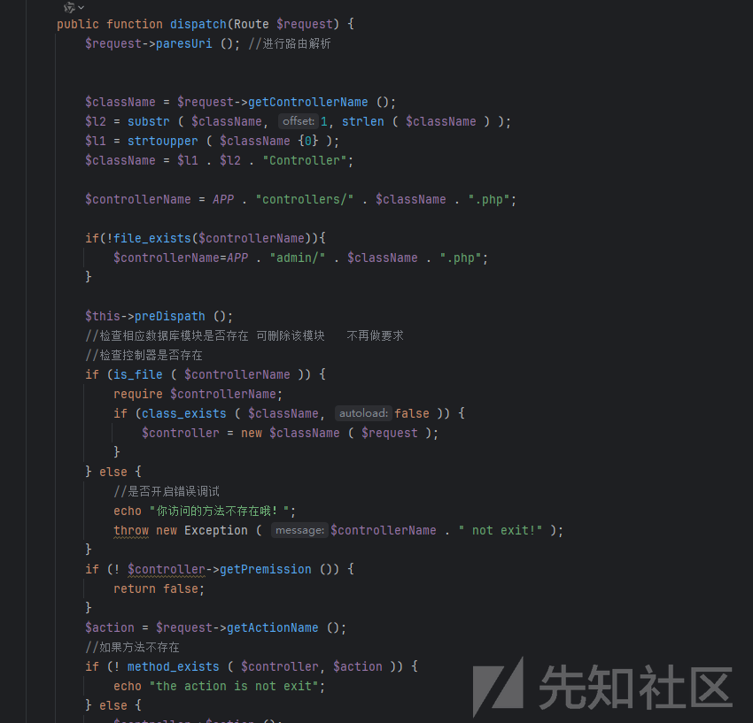

路由解析的方法，这里先判断controllers目录下是否存在对应访问文件，然后判断Admin目录下的是否存在访问文件

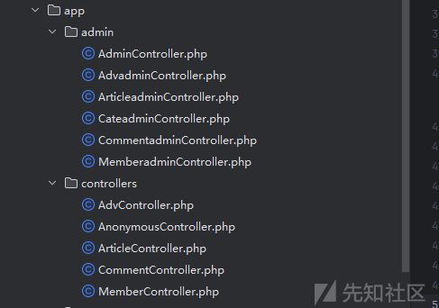

对应方法，然后结合功能点访问的数据包，就能大概知道对应功能点代码如何构造路由触发了

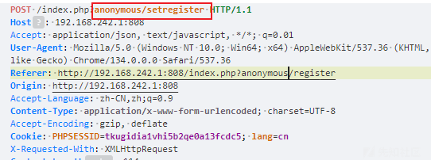

## 鉴权分析

看下网站后台权限校验逻辑

对应文件：app/admin/AdminController.php

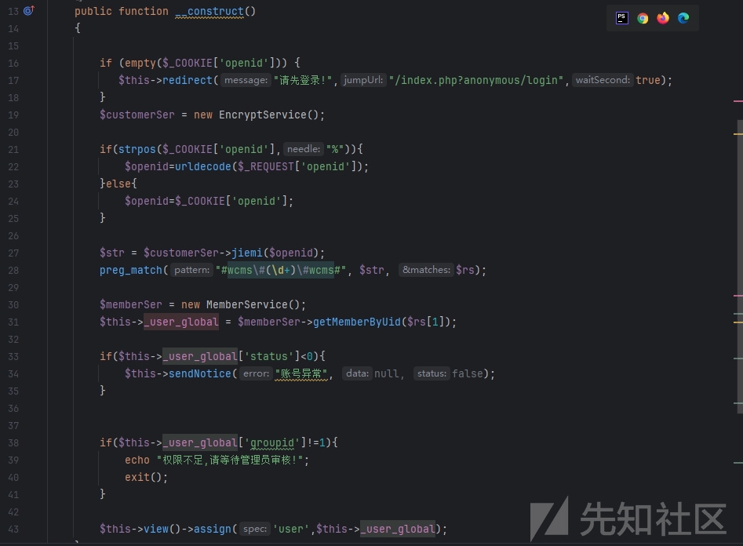

可以看到主要是校验COOKIE中的openid字段，有几个校验

1、判断是否存在openid字段，不存在返回到登录接口

2、通过openid获取用户信息判断status字段是否为大于0

3、判断groupid字段的值是否为1

那么这里我们要关注的点就是openid能否伪造，抓个登入数据包看下openid的生成逻辑

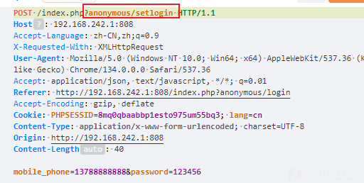

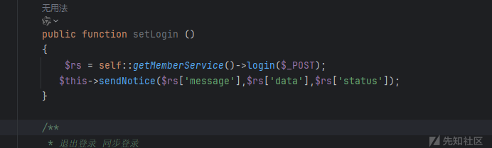

跟进login方法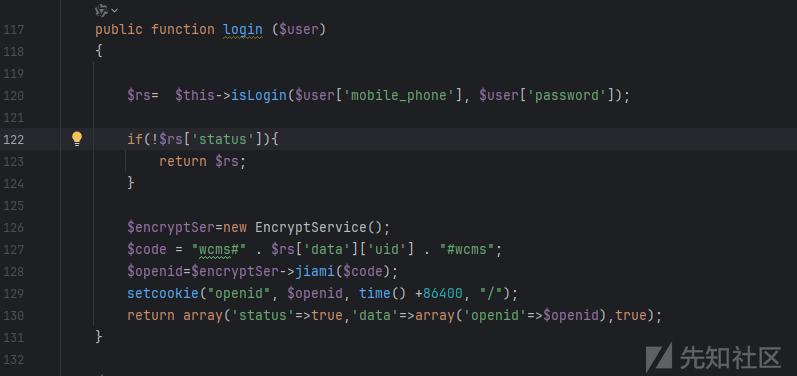

这里通过isLogin方法操作我们传入的**mobile\_phone**和**password**，跟进方法

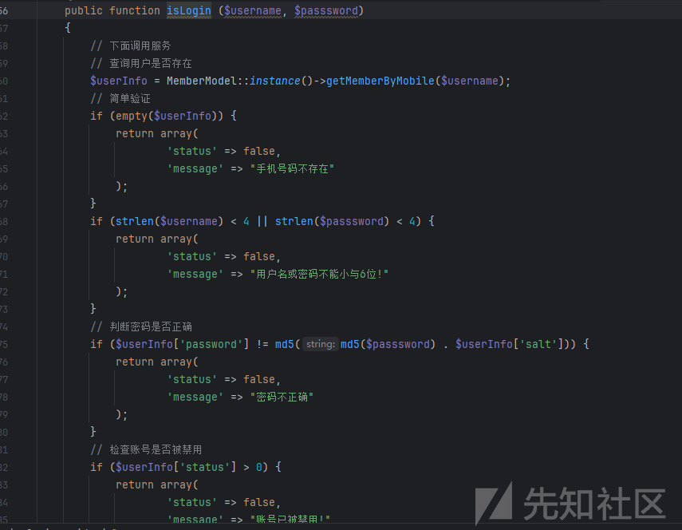

这里就是通过我们传入的数据带入数据库查询，然后返回数据，我们回到前面openid生成的那块代码

```
$encryptSer=new EncryptService();
$code = "wcms#" . $rs['data']['uid'] . "#wcms";
$openid=$encryptSer->jiami($code);
setcookie("openid", $openid, time() +86400, "/");
return array('status'=>true,'data'=>array('openid'=>$openid),true);
}
```

这里除了uid还有个data，这个是获取的用户数据，uid还能尝试遍历，data没法获取，那么这里没办法伪造openid

## 任意文件上传RCE

全局搜索upload类似关键词

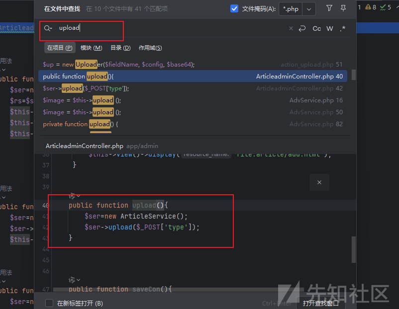

找到个upload方法，看下里面是咋处理的

```
public function upload ($type)
{
    // 调用thumb方法处理上传的文件，并获取处理后的文件信息
    $file = $this->thumb($_FILES['upload'], 'image');
    
    // 根据$type参数决定返回值的格式
    if ($type) {
        // 如果$type为真，返回JSON格式的文件信息
        echo json_encode($file);
        return;
    }
    
    // 获取CKEditor的回调函数编号
    $callback = $_REQUEST["CKEditorFuncNum"];
    
    // 构建并输出用于CKEditor的JavaScript调用，以在编辑器中显示上传的文件信息
    echo "<script type='text/javascript'>window.parent.CKEDITOR.tools.callFunction($callback,'" .
        $file['message'] . "','');</script>";
}
```

跟进**thumb**方法

```
    public function thumb ($files, $dir = "thumb")
    {
        $imagetrans = new Image();
        return $imagetrans->upload($files, $dir,false);
    }
```

这里dir是有默认值的，继续跟进upload方法

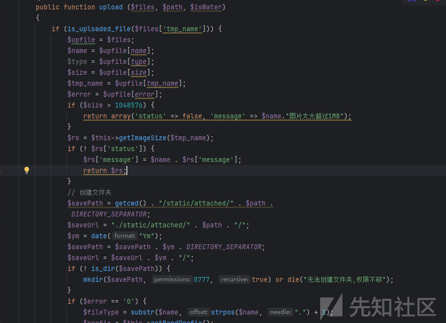

前面都是正常接受文件内容的代码，我们的重点在文件后缀是否可控，文件内容是否有检测

```
// 如果没有错误发生（错误代码为'0'），则执行文件上传逻辑
if ($error == '0') {
    // 提取文件类型，从文件名中获取从第一个点之后的部分
    $fileType = substr($name, strpos($name, ".") + 1);
    
    // 获取一个随机的前缀，用于生成唯一的文件名
    $prefix = $this->getRandPrefix();
    
    // 生成新的文件名，结合日期、随机前缀和文件类型，以确保唯一性和按日期排序
    $newName = date("YmdHi") . $prefix . "." . $fileType;
    
    // 拼接保存路径和新文件名，得到完整的文件路径
    $filepath = $savePath . $newName;
    
    // 将临时上传的文件移动到指定的路径，完成文件上传
    move_uploaded_file($tmp_name, $filepath);
}
```

这里通过substr获取上传的文件后缀，然后拼接随机前缀生成新的文件名，最后通过move\_uploaded\_file方法上传文件，那么这里是存在任意文件上传的，因为文件后缀我们可控，也没文件内容检测

**漏洞验证**

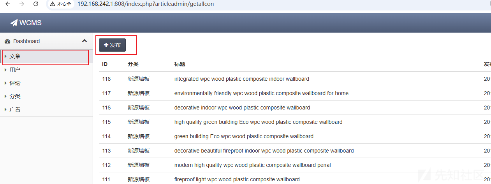

在编辑器的图片上传功能点

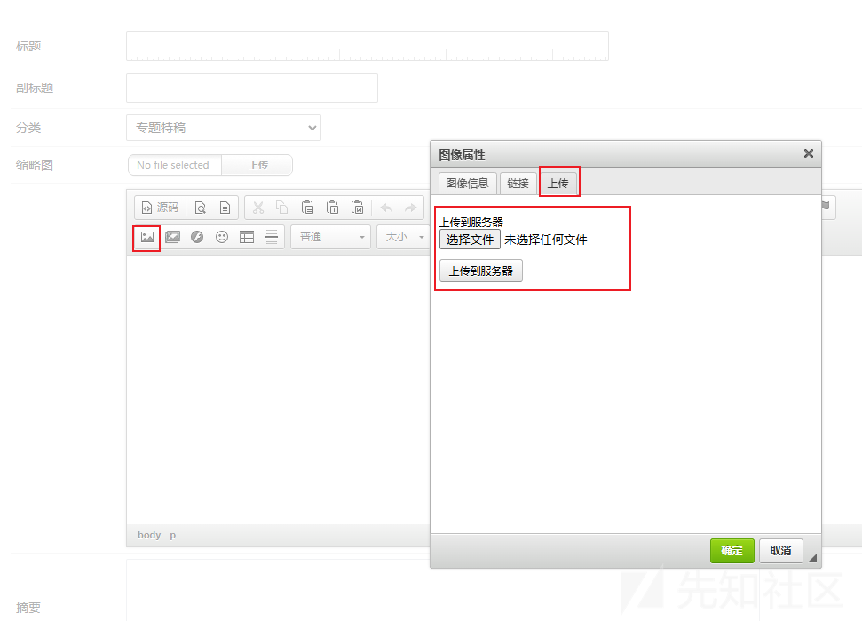

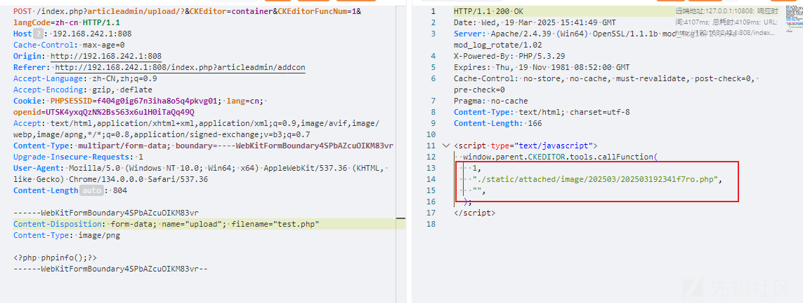  
 拼接访问

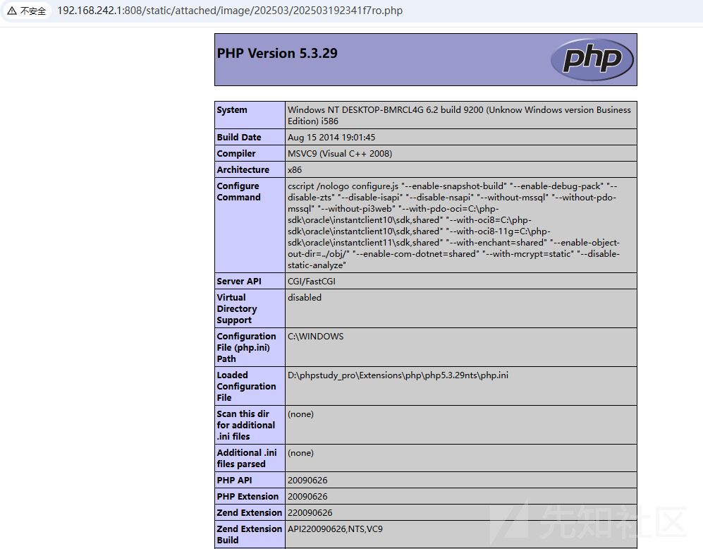

成功执行代码

## 存储型XSS

XSS优先寻找前台能写的功能点

漏洞在账户注册

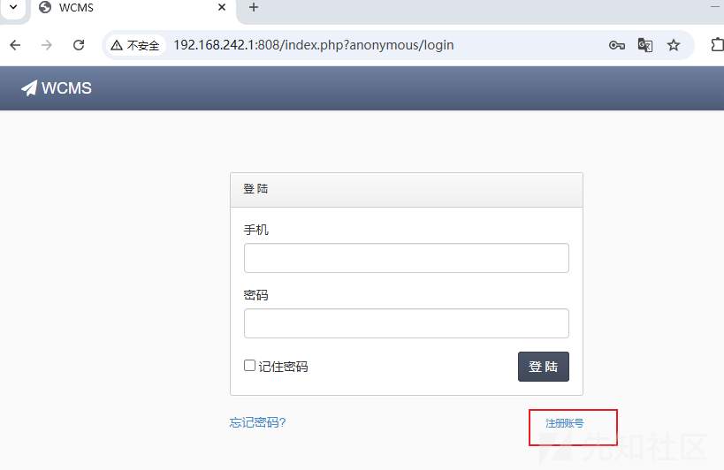

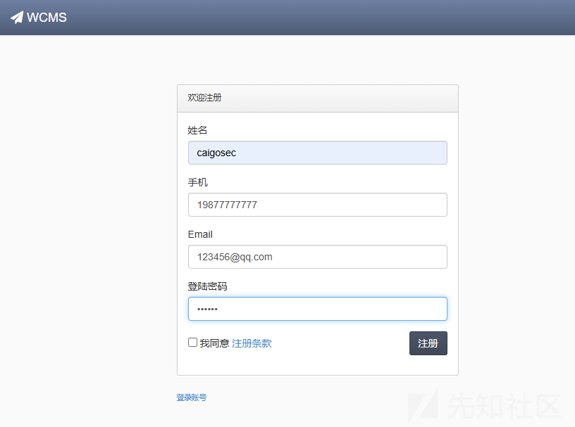

抓包，修改用户名为XSS\_poc,因为用户名会在后台显示

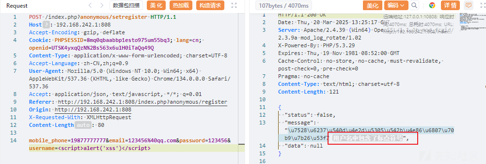

这里看到有检测，感觉回显信息全局搜索定位到代码或者根据路由定位也行

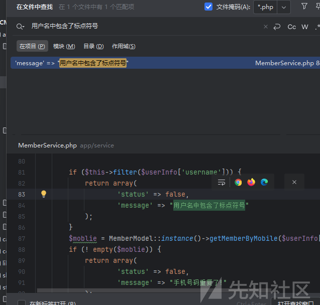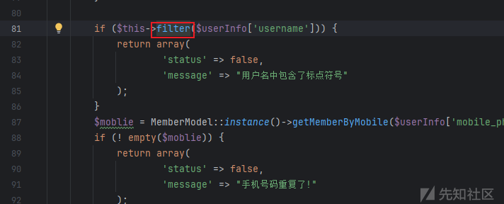

这里有个filter(过滤)方法跟进下

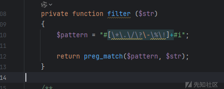

这里使用正则表达式 `#[\*\.\/\?\-\%\!]+#i` 来过滤以下字符：`*`, `.`, `/`, `?`, `-`, `%`, `!`

那么我们的poc就得不包含这些字符

绕过POC：``

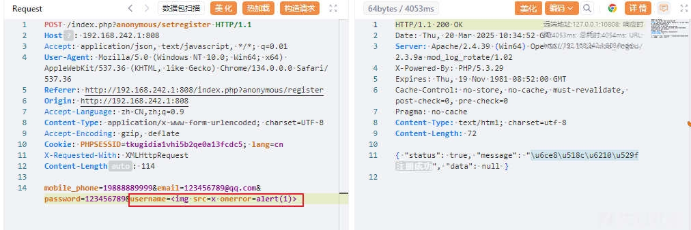

模拟管理员在后台用户功能点触发js代码

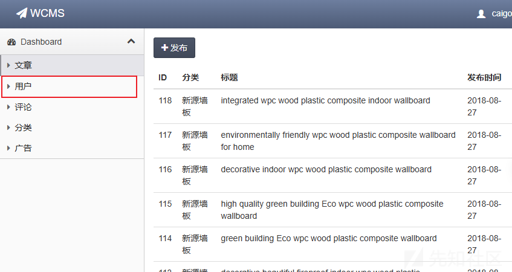

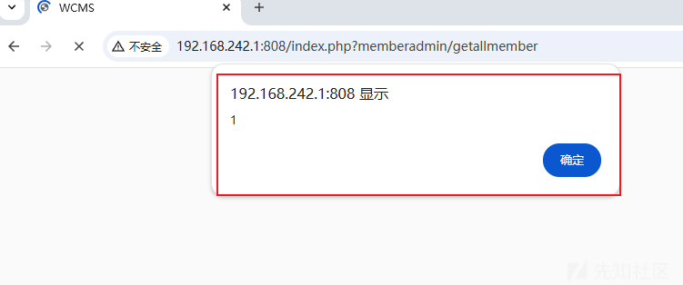
