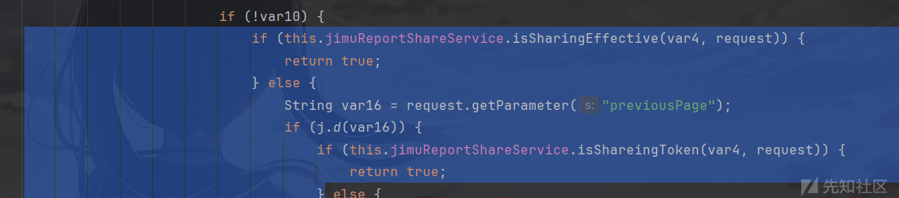
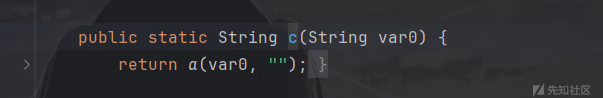
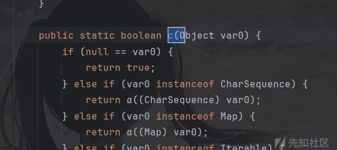
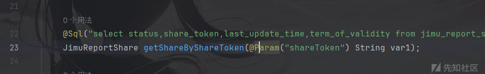
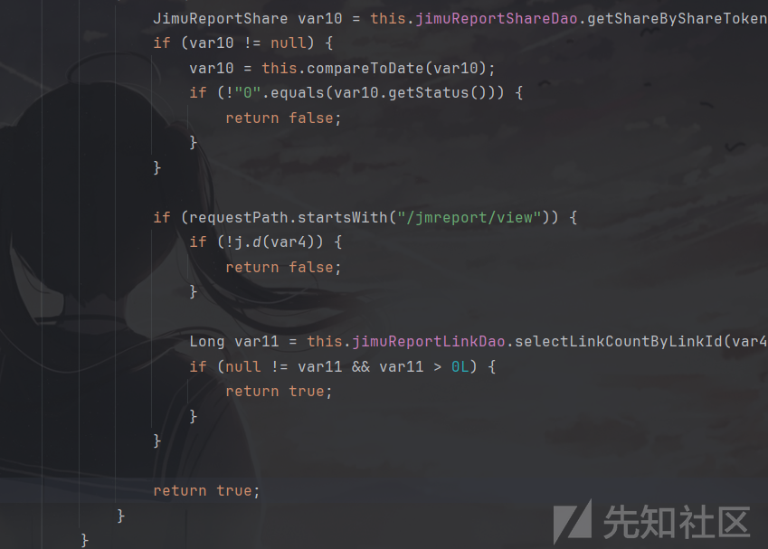
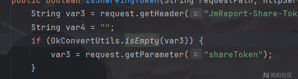
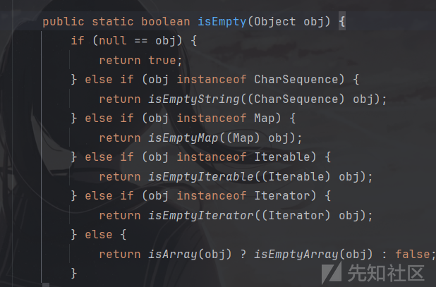
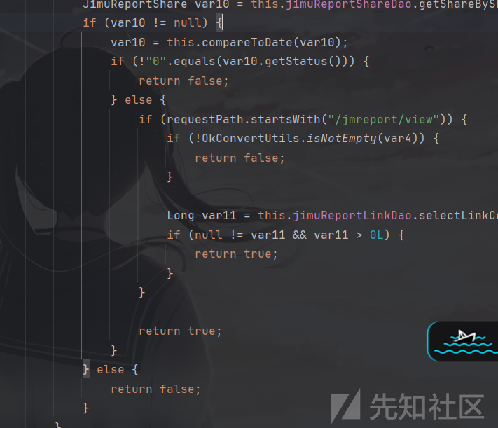

# Jimureport1.7.8越权漏洞代码分析及修复代码分析(CVE-2024-44893)-先知社区

> **来源**: https://xz.aliyun.com/news/17344  
> **文章ID**: 17344

---

# 漏洞代码分析及漏洞成因

## 漏洞成因

拦截器中对于Token验证的代码中存在逻辑漏洞。

## 漏洞代码分析

首先，这个项目使用了Spring MVC的拦截器。

可以找到拦截器的代码段位于这个项目的jimureport-spring-boot-starter.jar中的`org.jeecg.modules.jmreport.config.firewall.interceptor.JimuReportTokenInterceptor`包。

以下是preHandle拦截器的代码

```
    public boolean preHandle(HttpServletRequest request, HttpServletResponse response, Object handler) throws Exception {
        if (!(handler instanceof HandlerMethod)) {
            return true;
        } else {
            String var4 = d.i(request.getRequestURI().substring(request.getContextPath().length()));
            log.debug("JimuReportInterceptor check requestPath = " + var4);
            int var5 = 500;
            if (n.a(var4)) {
                log.error("请注意，请求地址有xss攻击风险！" + var4);
                this.backError(response, "请求地址有xss攻击风险!", var5);
                return false;
            } else {
                String var6 = this.jmBaseConfig.getCustomPrePath();
                log.debug("customPrePath: {}", var6);
                if (j.d(var6) && !var6.startsWith("/")) {
                    var6 = "/" + var6;
                }

                request.setAttribute("customPrePath", var6);
                HandlerMethod var7 = (HandlerMethod)handler;
                Method var8 = var7.getMethod();
                if (var4.contains("/jmreport/shareView/")) {
                    return true;
                } else {
                    JimuNoLoginRequired var9 = (JimuNoLoginRequired)var8.getAnnotation(JimuNoLoginRequired.class);
                    if (j.d(var9)) {
                        return true;
                    } else {
                        boolean var10 = false;

                        try {
                            var10 = this.verifyToken(request);
                        } catch (Exception var14) {
                        }

                        if (!var10) {
                            if (this.jimuReportShareService.isSharingEffective(var4, request)) {
                                return true;
                            } else {
                                String var16 = request.getParameter("previousPage");
                                if (j.d(var16)) {
                                    if (this.jimuReportShareService.isShareingToken(var4, request)) {
                                        return true;
                                    } else {
                                        log.error("分享链接失效或分享token不匹配(" + request.getMethod() + ")：" + var4);
                                        this.backError(response, "分享链接失效或分享token不匹配，禁止钻取!", var5);
                                        return false;
                                    }
                                } else {
                                    log.error("Token校验失败！请求无权限(" + request.getMethod() + ")：" + var4);
                                    this.backError(response, "Token校验失败，无权限访问！", var5);
                                    return false;
                                }
                            }
                        } else {
                            b var15 = (b)var8.getAnnotation(b.class);
                            if (var15 != null) {
                                String[] var11 = var15.a();
                                String[] var12 = this.jimuTokenClient.getRoles(request);
                                if (var12 == null || var12.length == 0) {
                                    log.error("此接口需要角色权限，请联系管理员！请求无权限(" + request.getMethod() + ")：" + var4);
                                    if ("/jmreport/loadTableData".equals(var4)) {
                                        var5 = GEN_TEST_DATA_CODE;
                                    }

                                    this.backError(response, NO_PERMISSION_PROMPT_MSG, var5);
                                    return false;
                                }

                                boolean var13 = Arrays.stream(var12).anyMatch((code) -> {
                                    return j.a(code, var11);
                                });
                                if (!var13) {
                                    log.error("此接口需要角色权限，请联系管理员！请求无权限(" + request.getMethod() + ")：" + var4);
                                    if ("/jmreport/loadTableData".equals(var4)) {
                                        var5 = GEN_TEST_DATA_CODE;
                                    }

                                    this.backError(response, NO_PERMISSION_PROMPT_MSG, var5);
                                    return false;
                                }
                            }

                            return true;
                        }
                    }
                }
            }
        }
    }
```

漏洞代码位于为下面这段



其中var10为检查用户是否登录的检测结果，如果没有登录就会进入下面的代码中。

其中`isSharingEffective`是用于判断时间是否过期的代码，我们当前处于未登录状态，所以主要看else后面的代码段。

首先从get中获取previousPage这个参数，并通过j.d这个方法进行校验。

```
    public static String d(String var0) {
        byte var1 = 3;
        if (var0.length() < var1) {
            return var0.toLowerCase();
        } else {
            StringBuilder var2 = new StringBuilder(var0);
            int var3 = 0;

            for(int var4 = 2; var4 < var0.length(); ++var4) {
                if (Character.isUpperCase(var0.charAt(var4))) {
                    var2.insert(var4 + var3, "_");
                    ++var3;
                }
            }

            return var2.toString().toLowerCase();
        }
    }
```

j.d方法的这段代码主要用于字符串分割，小于3个长度的字符会转化为小写直接输出，大于3个长度的字符就会检测大写字符并加入`_`进行分割。

所以只需要previousPage参数不为空即可。

然后跟进到isShareingToken方法。

这个方法位于`org.jeecg.modules.jmreport.desreport.service.a.f`中

代码如下：

```
    public boolean isShareingToken(String requestPath, HttpServletRequest request) {
        String var3 = request.getHeader("JmReport-Share-Token");
        String var4 = "";
        if (j.c(var3)) {
            var3 = request.getParameter("shareToken");
        }

        String var5 = request.getParameter("jmLink");
        if (j.d(var5)) {
            try {
                byte[] var6 = Base64Utils.decodeFromString(var5);
                String var7 = new String(var6);
                String[] var8 = var7.split("\|\|");
                if (ArrayUtils.isNotEmpty(var8) && var8.length == 2) {
                    var3 = var8[0];
                    var4 = var8[1];
                }
            } catch (IllegalArgumentException var9) {
                a.error("解密失败：" + var9.getMessage());
                a.error(var9.getMessage(), var9);
                return false;
            }
        }

        if (j.c(var3)) {
            return false;
        } else {
            JimuReportShare var10 = this.jimuReportShareDao.getShareByShareToken(var3);
            if (var10 != null) {
                var10 = this.compareToDate(var10);
                if (!"0".equals(var10.getStatus())) {
                    return false;
                }
            }

            if (requestPath.startsWith("/jmreport/view")) {
                if (!j.d(var4)) {
                    return false;
                }

                Long var11 = this.jimuReportLinkDao.selectLinkCountByLinkId(var4);
                if (null != var11 && var11 > 0L) {
                    return true;
                }
            }

            return true;
        }
    }
```

可以看到代码中先获取http头为`JmReport-Share-Token`的字符串，正常逻辑来说会判断其是否存在，如果不存在就获取名字为`shareToken`的参数。

但是在j函数中，有俩个.c方法，一个接收值类型为字符串，另一个为Object。



而var3类型就为String类型，所以会优先调用c(String var0)这个方法。

这样漏洞就产生了，当JmReport-Share-Token有参数时，其也会获取shareToken的值，并赋值给var3参数，造成参数覆盖。

并且当shareToken赋值为空时，并不会触发`return false`，会继续进入到else中，从而走到`getShareByShareToken`方法，



这个方法用于查询数据库中是否存在 shareToken。

如果shareToken查找结果为空，也就是var10为null时，由于没有对var10=null的处理方法，并且这个函数默认返回true，从而达到权限绕过的漏洞



# 漏洞修复代码分析

可以下载一个1.8.0的代码进行对比，看看厂家是如何修复这个漏洞的。

首先，他更改了j函数中的c方法，改为了`OkConvertUtils.isEmpty`



点进去看源码，其实可以发现这个方法的代码很眼熟，就是原来j函数中的接收Object参数类型的c方法。



然后，再往下看，可以看到下面的代码对`var10=null`的情况进行了处理，当`var10=null`时，使用了else将其返回值更改为false。


