# 一个简单的AsyncRAT样本分析-先知社区

> **来源**: https://xz.aliyun.com/news/17359  
> **文章ID**: 17359

---

### 样本介绍

AsyncRAT是一种开源的远程访问木马（RAT），主要用于远程控制Windows设备。它支持加密通信，具备屏幕监控、键盘记录、文件管理等功能。攻击者通常利用钓鱼邮件、恶意宏或软件漏洞传播 AsyncRAT。一旦感染，受害者的设备可能会被用于数据窃取、远程操控甚至加入僵尸网络。由于其开源特性，AsyncRAT 易于修改，使其难以被安全软件检测。

​

### 代码分析

样本首先会进行初始化，初始化设定了其自定义加密算法的key，并且采用其自定义加密算法解密外联主机、端口等信息

加密算法的key是经base64编码的clFxcHJwbUJWSEtHY2ROUXpoNHV6clBMeDVqenpWYmk=，解码结果为rQqprpmBVHKGcdNQzh4uzrPLx5jzzVbi

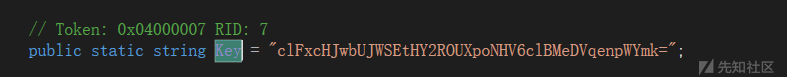

初始化首先计算出待使用的key，如下图

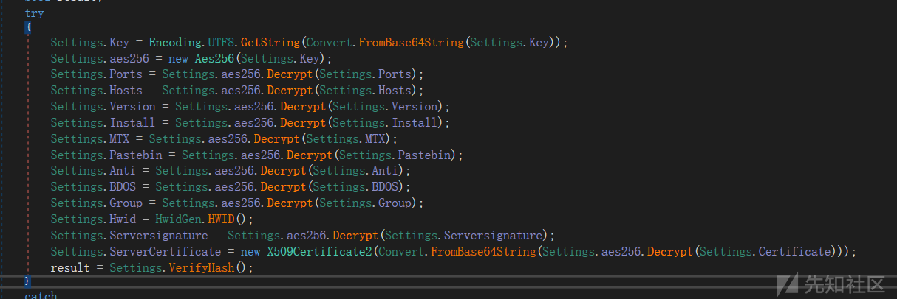

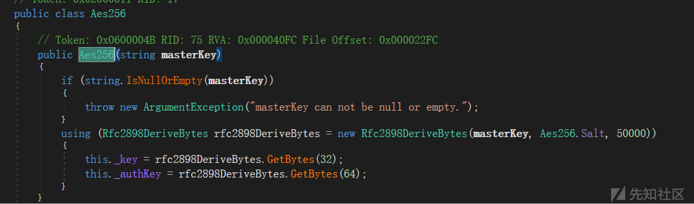

根据代码生成key

```
Key: B3-F5-8F-F4-75-8C-DF-60-EB-60-C7-BF-79-DD-28-64-FC-F3-3B-D9-64-11-7A-19-68-D5-38-97-E8-97-2D-A5
Auth Key: A8-82-15-69-E1-D7-F1-B6-3B-9C-0D-C9-AE-D7-2F-AB-D9-F4-7B-DD-B1-F2-26-FA-3B-A6-1F-60-5E-13-DF-2C-75-7D-0D-0C-C2-0C-6C-18-6F-E6-5E-F5-D7-87-8E-79-BB-E1-21-69-74-AB-EE-A3-70-39-BC-BF-3C-AF-0C-0D
port：6606,7707,8808
host: 
217.195.197.70
version: 0.5.7B
Install: true
MTX: AsyncMutex_6SI8OkPnk  //互斥量
pastebin: null
Anti: false
BDOS: false
Group: Default
Serversignature: 
TvyAaAPI9VBHF9C8W8CktFsbzjgaOmew9+QqS9CpQu5QJ5k22VBWc7Evme+iswPPcCfar1+PNUnehCxZH0a+GEJ12vbDzBsIVvW5MUqWrk8aWyJxgpOzpqEZ4fLWblMKAioyOkizmuQv/TQD9XmqzDUhzY9cUK7lCJW2J5JnTiovLPoavhC3mGLMGwyPlTHeTAnveaslW2dcM1vMpxEsC8Y+PJlqePmVmHHTY5NV2hKJzZ5Adet0ajZuLyRPm3egKgANA81IWBgt2DlPFQqqzcRP8b+mLgsbRRGjkMz7VxB6JVRO0pS2Qes8kddPYMHTUCT8w50rUq+U3cSlRvQge5shQM4gBOiOmSPgJnXa4EU3CEgucR3SvG8XnC7TL59CzVS+WFF6E3JfCew8xKvN/Wew9Ab9oOdAPzNF8c/Y7QCtNk/s8qt9nZz8DRlz2H3TVty2D7asqCPq1XrpzM6k+8PMqGrsgcbCbnFxQGBnly+19Dkl79jbyuaBGF4O1k2ykhnafZShzqWqs587bq/IKEi6U5uZ0NIJ3IUFN4FvVxq9lIQSzScE51I0QEmdgg23bjuBDHXEyOb8x6yZL3ApXlJ5+4CBgrwrvVk4WEgEn7gtnIV1K1Mh/X7slDg2FTG8SwCj4Dh7jFKhB7BrsrJ9O8l02x1vW0tBsoG6vHaLQUE=
ServerCertificate未解码创建对象
MIIE8jCCAtqgAwIBAgIQAIH/RL7rToDM8oB94SKIlTANBgkqhkiG9w0BAQ0FADAaMRgwFgYDVQQDDA9Bc3luY1JBVCBTZXJ2ZXIwIBcNMjIwNTE2MTg0ODI1WhgPOTk5OTEyMzEyMzU5NTlaMBoxGDAWBgNVBAMMD0FzeW5jUkFUIFNlcnZlcjCCAiIwDQYJKoZIhvcNAQEBBQADggIPADCCAgoCggIBAKEgd/u72GX/79lmwBLbwWhbi7gkNSqhnI4gbyIuxYPO3BUaDLj7vtYJe8WE2N2DA9e21ruGCPU6OmHnuQUjbFWrEdQc69Xcyq8ZbPGQjXuYFWYw0pqiN3aPaXwTe90SMGXkXx0cJ8kdfXHVSVIkcBz76QfHvLwOUVvC3QexrUzRjdS09KOQv+Y9wqelqnriXH8sBtSKkriBSAdVIy2ixQuNKh8NXWRcwVTTZL6UmBNdcdb/oH3NahdZbqtpEKMM5Q+PHX0drtioeIHRWNuq7cQP+sMQxwyTUqL+kCvwE8oMJqEY6UFHW6eAQLZH8em94N0vvILePWDQWFUXL5wreDzxkAX0RvgQtwMuvhfr1I8guP7ubcGuXg1LAwZQe4RObNj4r2vcwrcLLy1oKZZiB5G4kQlLjUR0Ca45KUOrWMwkJ9lU7kV+rRfLk5dar2HrHBDg7KDCF50EZg1GwJUdJSF1UQs+O7KXFeaUtSbaTq6kh9EiwpFDlu4WIjE9C0BFqwH4rO2Ysomi1jGBZA/McHyb2J5MmkOmqUmR0nazAUQJN3EHsZXvD2g4nd+QT6YnwFoy/iPrH8RvEvrM2k1q5E3FIt3xb0A4iFsDLoWwGu4nQ8zYK9wzAheYBBmzA4vT4MVZ/ki1vmlC9axzOJ6o9BHPCeXvQK0Ab8g3f1ePNXS5AgMBAAGjMjAwMB0GA1UdDgQWBBRJGUkV8Iqw647aOnyg4/jDRVHtozAPBgNVHRMBAf8EBTADAQH/MA0GCSqGSIb3DQEBDQUAA4ICAQCM+jYJ05hntCq5wbGRzR7HgrQSaTQDIMcn3vveqHKYtADO8Puvw3r60UHWfaaYJFyeLscAQ36VU0RsWkhlEGZKccDRn3rmviuF8sdE5prLB+01kH8I+K5vSZ+RWJZNPaz0szSvBuWqwSvOUg1QahfN22MJGd65mzkOTkX3w5QFGjfXDtB/ieeyTQ3pwPLMnWGfPHgHcK43N3tMPJp+aqEpURzo8sIK8xvlN8zkwrmEmvnEOdIpXiBhGMdywlqyhE3nQZapbzjwzROmcQKtx9ZEy1F8q3eR9QI/uPBOg388rnIbZCR7I7wq5YiZDlImU0cGgXuPWw2xAzX1xnnBqFivi6UdeMtN0GGwmPV9KzVitIFP4mQJrl67JGt0/ltrkwfpANN60FZmP31CNMsYL+zKF1FlpNcLuoEmx5A1Qdc6uqPt5EyTsbG/qv0HPFocl7OObYXsJ/hEq0tKODQmQWJmGjb4rlXvb51WVfozxKQORiJkVD+Huem5bEZ7O3jTorMBBWtr/wjvcojNR1YssrjWku6XXmm8tSEVIWrsMi+UcPE3+zoSGOHIIzSDTSMK7dFUJM6aKF+NZHG5HsrrBmKyALfjpzw0ZOPnt7ASg4sIO8fb3kpCeqPdpPudei27p1ufkXtEA2ZZfWcIzKm5g46M6w6WP1Izzgd9saV6bPBSow==
```

样本经过初始化后，将创建互斥量AsyncMutex\_6SI8OkPnk。

样本具有反分析功能，一旦检测到当前环境是分析环境，程序将终止，如下图所示。

Environment.FailFast 是 .NET 提供的立即终止应用程序的方法，它会绕过 try-catch和 finally块，直接终止进程，并可以记录错误信息或转储调试信息。

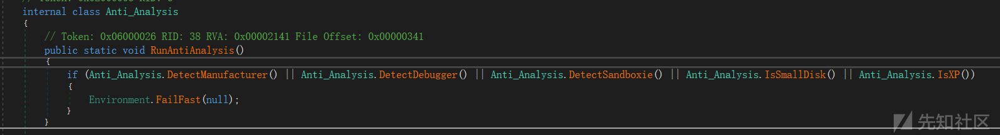

上图所示反分析的函数代码如下：

检测当前主机是否为虚拟机环境（若为虚拟机环境，则model查询结果将显示对应虚拟机产品名称）

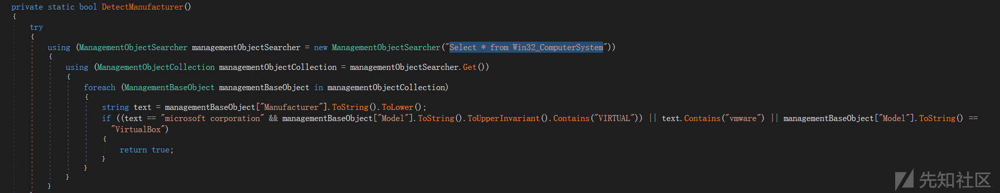

检测当前进程是否被调试

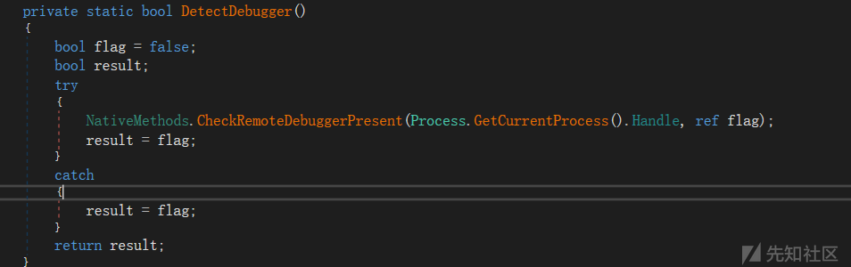

检测当前进程是否运行在沙箱环境中

SbieDll.dll 是 Sandboxie（沙盒软件）的核心动态链接库之一，主要用于进程隔离和环境虚拟化。

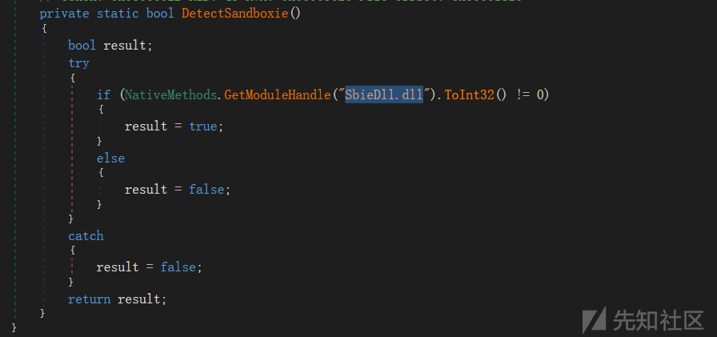

检测当前运行环境的内存大小，若为小内存则代表是虚拟环境，61000000000L约为57GB

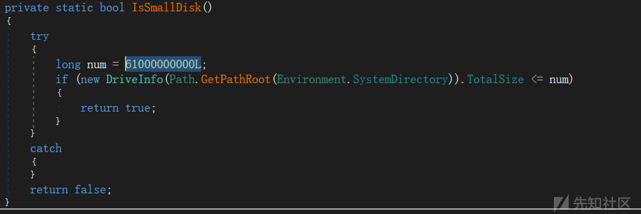

判断当前操作系统是否是WIN XP

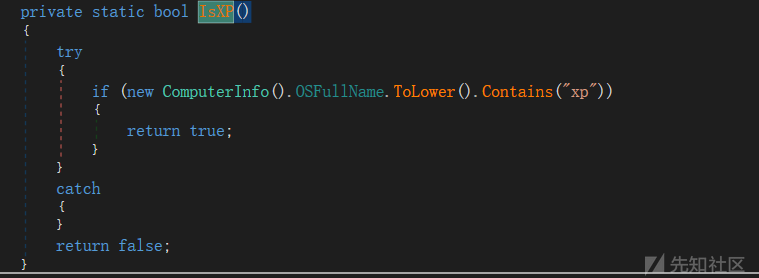

反分析检测通过后，程序才会开始安装。

安装路径为%AppData%Runtime Broker.exe。

当样本检测到当前用户是Administrator时，样本将创建一个隐藏进程，通过cmd创建计划任务，用户登录时程序将启动。

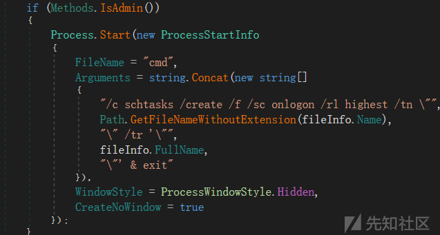

随后样本将在指定路径创建文件，将当前进程的文件内容写入文件，关闭scocket连接，创建临时文件bat，随后隐藏执行bat，bat文件将启动程序。

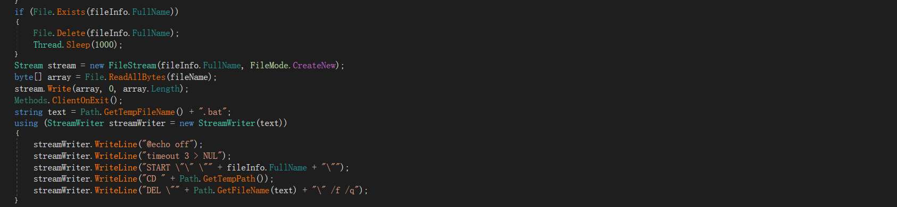

持久化措施，使用RtlSetProcessIsCritical在进程退出时触发蓝屏。

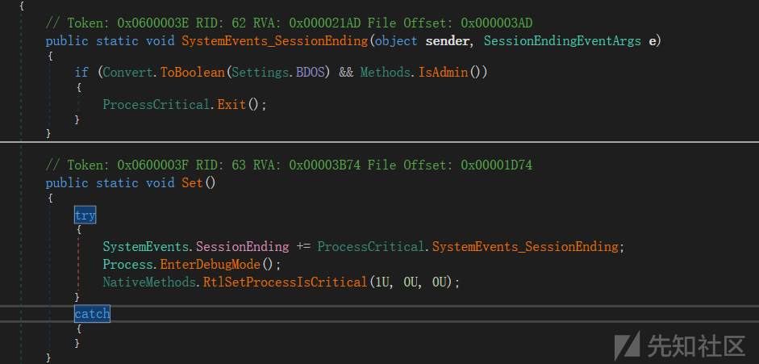

使用SetThreadExecutionState防止系统休眠、屏幕关闭、进入待机状态。

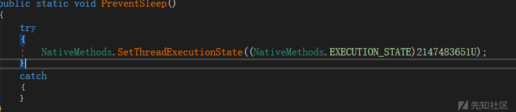

常见的 EXECUTION\_STATE 值

|  |  |  |
| --- | --- | --- |
| **值** | **十六进制** | **作用** |
| ES\_SYSTEM\_REQUIRED | 0x00000001 | 防止系统进入睡眠 |
| ES\_DISPLAY\_REQUIRED | 0x00000002 | 防止关闭显示器 |
| ES\_USER\_PRESENT | 0x00000004 | 指示用户当前活跃 |
| ES\_CONTINUOUS | 0x80000000 | 持续生效，直到下次调用 |

2147483651U == 0x80000003 == ES\_SYSTEM\_REQUIRED | ES\_DISPLAY\_REQUIRED | ES\_CONTINUOUS

创建TCP连接，创建加密通信。

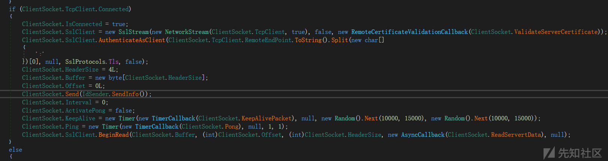

### IOCs

```
217.195.197.70
79068b82bcf0786b6af1b7cc96de1bf4e1a66b0d95e7e72ed1b1054443f6c5e3
```
