# NetSupport RAT远控样本分析-先知社区

> **来源**: https://xz.aliyun.com/news/17367  
> **文章ID**: 17367

---

# 前言概述

NetSupport Manager最初是20年前用于远程技术支持的正版软件，该工具允许文件传输、支持聊天、库存管理和远程访问，虽然它是合法软件，但近年来威胁行为者一直将其用作远程访问木马(RAT)，最引人注目的2020年通过大规模COVID-19网络钓鱼活动传播。 NetSupport RAT的交付机制包括欺诈性更新、驱动下载、利用恶意软件加载器(例如GhostPulse)以及各种形式的网络钓鱼活动。

​

多年来，威胁者一直在将合法软件用于非法或恶意目的，威胁者已将该软件重新用作远程访问木马(RAT)，以渗透系统并将其用作后续攻击的起点，NetSupport Manager的修改版本的名称被称为NetSupport Manager RAT。

​

从威胁情报平台监控到一个样本，会下载NetSupport RAT远控，对该样本进行了一些分析，发现有点意思，分享出来供大家参考学习，样本相关信息，如下所示：

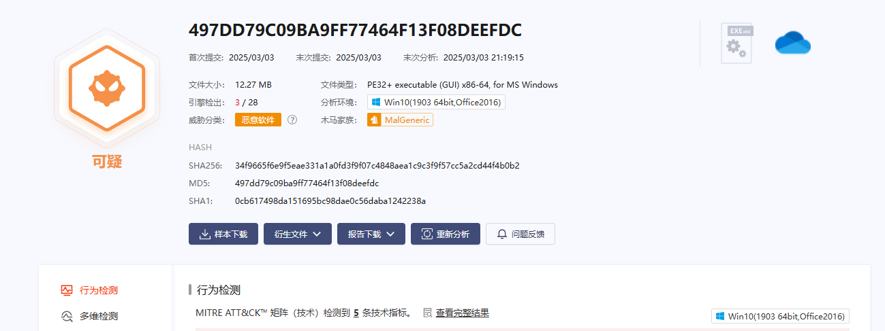

# 样本分析

1.初始样本采用Python语言编写，然后打包成EXE程序，如下所示：

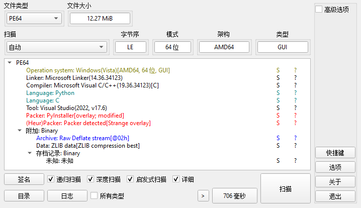

2.对样本进行反编译，如下所示：

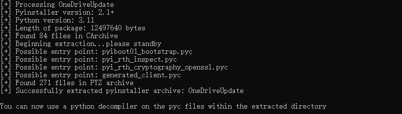

3.获取到核心pyc文件，如下所示：

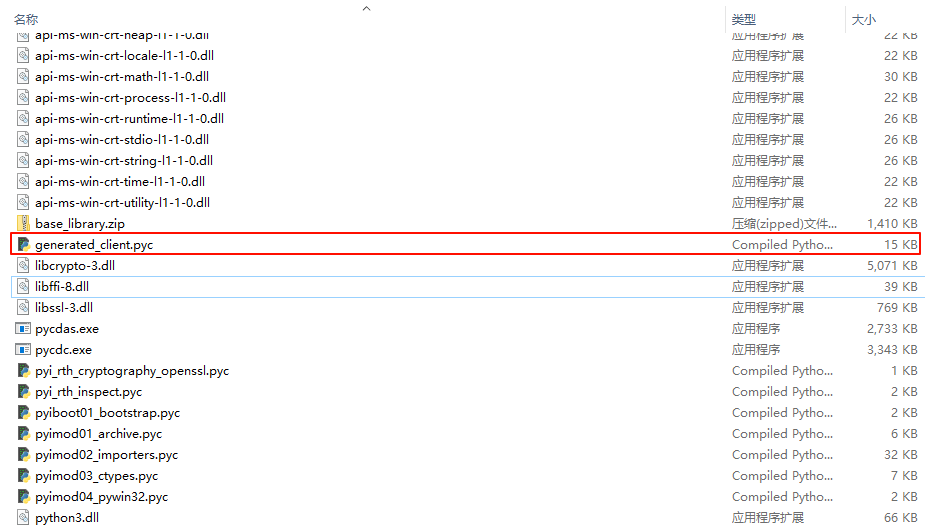

4.对核心pdc文件进行反编译，获取到部分源代码，里面有些函数反编译失败了，如下所示：

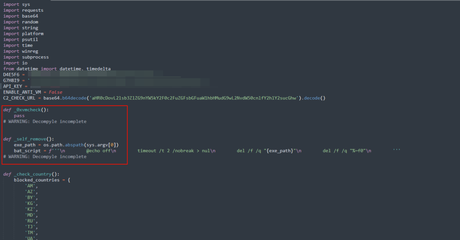

5.反编译出python字节码文件，对字节码文件进行分析，可以发现通过检查相关虚拟机的主机名、系统相关文件、进程、CPU、MAC物理地址、注册表等信息，进行反虚拟机对抗，如下所示：

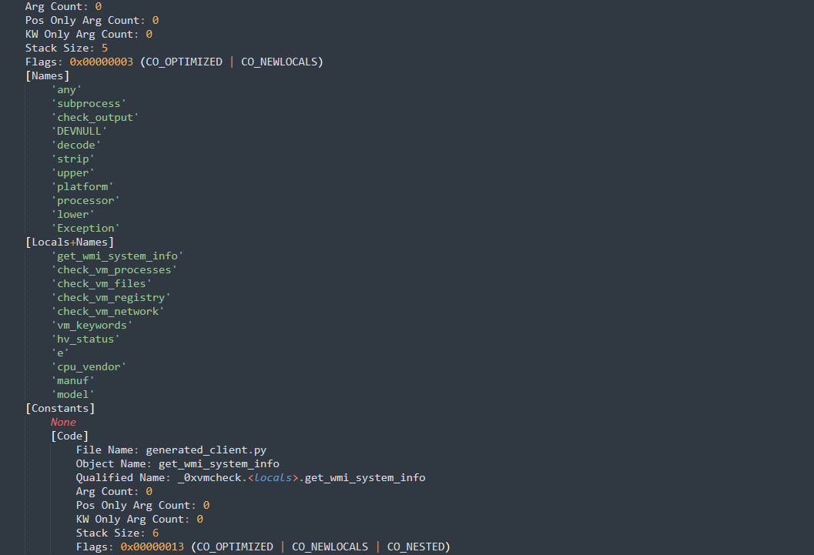

6.检测相关进程，对抗虚拟机执行，如下所示：

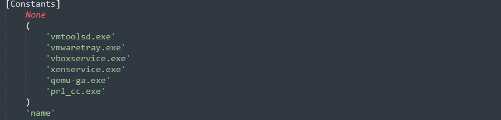

7.检测虚拟机的相关文件，对抗虚拟机指行，如下所示：

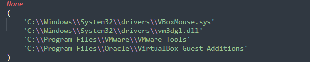

8.检测虚拟机相关的注册表信息，对抗虚拟机执行，如下所示：

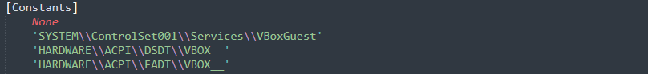

9.检测虚拟机的MAC物理地址信息，对抗虚拟机执行，如下所示：

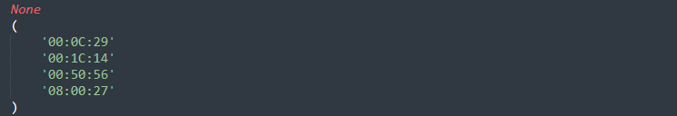

10.自删除，如下所示：

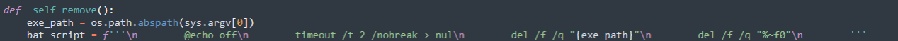

11.通过IP查询网站，查询主机的IP地址对应的国家，除排指定的国家，如下所示：

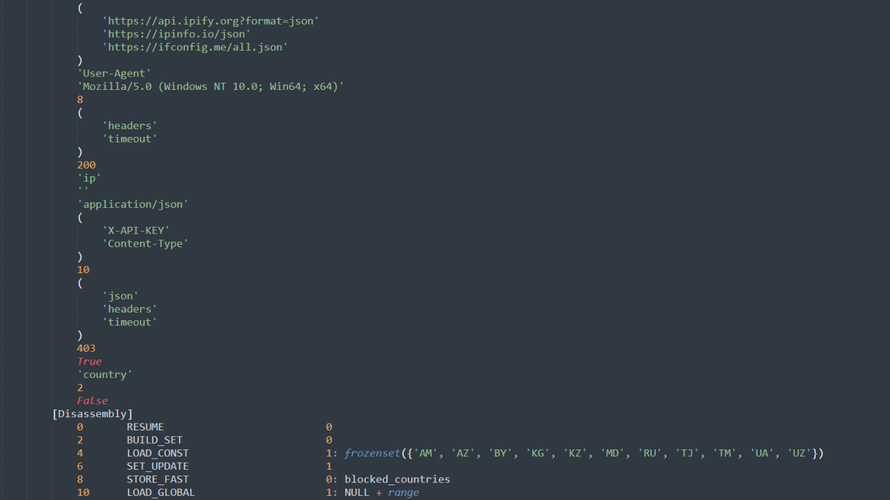

12.设置自启动注册表项，如下所示：

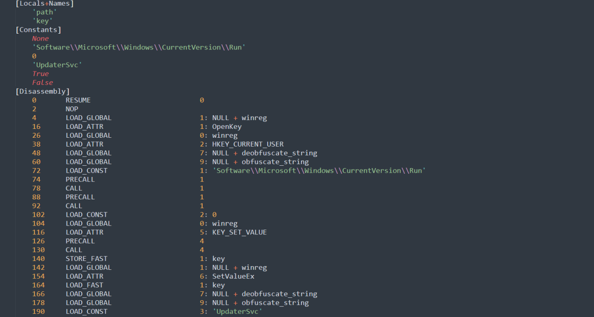

13.从远程服务器上下载NetSupport RAT远控并加载执行，如下所示：

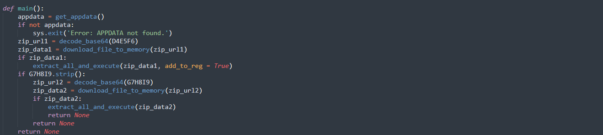

14.远程服务器URL，解密出来，如下所示：

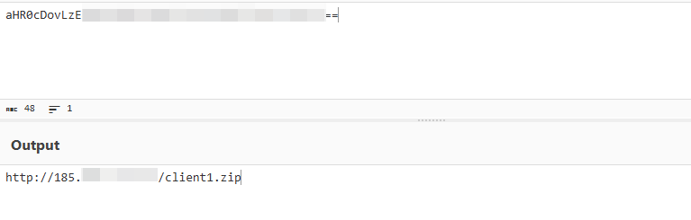

15.下载的NetSupport RAT远控，如下所示：

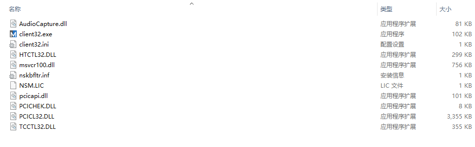

16.配置信息内容，如下所示：

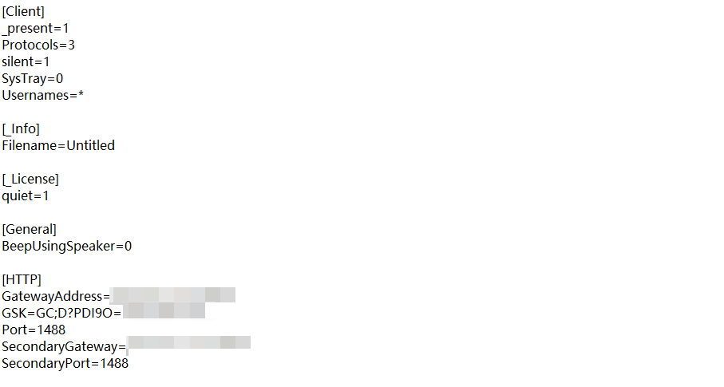

​

# 总结结尾

黑客组织利用各种恶意软件进行的各种攻击活动已经无处不在，防不胜防，很多系统可能已经被感染了各种恶意软件，全球各地每天都在发生各种恶意软件攻击活动，黑客组织一直在持续更新自己的攻击样本以及攻击技术，不断有企业被攻击，这些黑客组织从来没有停止过攻击活动，非常活跃，新的恶意软件层出不穷，旧的恶意软件又不断更新，需要时刻警惕，可能一不小心就被安装了某个恶意软件。
