# IoT安全透视：D-Link DWR-932B固件全面逆向分析-先知社区

> **来源**: https://xz.aliyun.com/news/17368  
> **文章ID**: 17368

---

# 一、引言

**文章目的**  
本文深入剖析D-Link DWR-932B路由器的固件安全，揭示可能导致攻击者未经授权访问和控制设备的严重漏洞，包括硬编码凭据、弱根密码以及管理与更新机制中的关键缺陷，如未认证的远程命令执行和不安全的固件更新协议。研究采用静态与动态分析相结合的方法，并通过逆向工程定位问题。本文可能存在一些不足，请大家斧正！此分析提醒人们在不断扩展的IoT生态系统中，强化安全实践的重要性，适合安全爱好者、网络管理员及关注家庭网络安全的人士。

**文章简介大纲**：  
**一、引言**  
**二、基础知识：固件分析入门**  
**三、基础知识：网络安全协议与 IoT 设备**  
**四、固件获取与初始访问：固件文件解包**（核心1）  
**五、敏感配置文件分析：寻找信息泄露**  
**六、弱密码破解：存在Root弱密码爆破问题**  
**七、使用 Firmwalker：扫描进行信息搜集**（核心2）  
**八、逆向分析存在风险的二进制程序**（核心3）  
**九、参考资料**

**IoT 设备的普及与固件安全的重要性**  
随着物联网（IoT）设备的快速增长，智能家居设备、路由器和摄像头等设备已成为我们日常生活的一部分。研究表明，这些设备的安全性直接关系到用户隐私和网络安全，因为固件是设备的核心软件，包含了操作系统的配置和功能。如果固件存在漏洞，攻击者可能远程控制设备，窃取数据或发起网络攻击。因此，固件安全分析成为保护 IoT 设备的关键。

**D-Link DWR-932B 路由器的简介及其在 IoT 中的应用**  
D-Link DWR-932B 是一款支持 4G LTE 的便携式路由器，广泛用于家庭网络、小型办公室和移动场景。它通过提供无线网络连接，支持多个设备同时联网，是 IoT 生态系统中的重要节点。它的固件管理了网络配置、Wi-Fi 连接和远程管理功能，因此成为安全研究的重要目标。

# 二、基础知识：固件分析入门

## 什么是固件及其作用

固件（Firmware）是存储在设备硬件中的软件，控制嵌入式设备的基本功能，如路由器的 Wi-Fi 连接和网络设置。研究表明，固件安全直接影响 IoT 设备的安全性，如果存在漏洞，攻击者可能远程控制设备或窃取数据。

## 常见的固件格式及其解包工具

常见的固件格式包括 ZIP（用于分发）和 YAFFS2（用于闪存文件系统）。解包工具如：

* binwalk：识别和提取文件系统，示例命令为 binwalk -e firmware.bin ([Binwalk GitHub](https://github.com/ReFirmLabs/binwalk))。
* unyaffs：解包 YAFFS2 文件系统，示例为 unyaffs image.yaffs2 ([Unyaffs GitHub](https://github.com/alfonsorivero/unyaffs))。
* 其他工具如 unsquashfs 用于 SquashFS 文件系统。

## 固件分析的基本流程

固件分析的流程包括：

1. **获取固件**：从官方网站下载，如 D-Link 路由器的固件。
2. **解包固件**：使用上述工具提取文件系统。
3. **静态分析**：检查敏感文件如 .conf 和 /etc/shadow，逆向分析危险二进制程序。

## 常用工具介绍

常用工具包括：

* **IDA Pro**：逆向工程二进制文件 ([IDA Pro 官网](https://www.hex-rays.com/products/ida/))。
* **firmwalker**：扫描固件中的敏感文件和漏洞：[craigz28/firmwalker: Script for searching the extracted firmware file system for goodies!](https://github.com/craigz28/firmwalker)

# 三、基础知识：网络安全协议与 IoT 设备

网络安全协议是物联网（IoT）设备通信的核心，它们确保设备之间能够安全、高效地交换数据。以下是对几种常见网络协议（UPnP、FOTA、SSH、SSL/TLS）的简介，这些协议在 IoT 设备中广泛使用，了解它们的作用有助于提升设备的安全性。

## UPnP（通用即插即用）

* **简介**：UPnP 是一种网络协议，主要用于设备自动发现和配置网络服务。它在家庭网络中尤为常见，例如路由器、智能电视和其他 IoT 设备通过 UPnP 实现无缝连接和通信。UPnP 的设计目标是简化设备的联网过程，无需用户手动配置。
* **作用**：在 IoT 设备中，UPnP 允许设备快速加入网络并与其他设备交互，例如通过路由器自动开放端口以支持远程访问或媒体流传输。

## FOTA（固件空中升级）

* **简介**：FOTA 是一种通过网络远程更新设备固件的技术，是 IoT 设备维护和安全更新的关键机制。它允许制造商在设备部署后推送补丁或功能改进，而无需物理接触设备。
* **作用**：FOTA 确保 IoT 设备能够及时修复安全漏洞或提升性能，例如智能家居设备通过 FOTA 获取最新的安全更新以抵御新兴威胁。

## SSH（安全外壳协议）

* **简介**：SSH 是一种加密协议，提供安全的远程登录和文件传输功能。它最初设计用于服务器管理，但在 IoT 设备中也被广泛用于远程管理和调试，例如访问智能设备的命令行界面。
* **作用**：在 IoT 场景中，SSH 为开发者或管理员提供了一种安全的途径来监控和维护设备，尤其是在设备分布于不同地理位置时。

## SSL/TLS（安全套接层/传输层安全）

* **简介**：SSL/TLS 是用于加密网络通信的协议，广泛应用于保护数据传输的安全性。在 IoT 设备中，SSL/TLS 常用于 HTTPS 请求、API 通信或设备与云端之间的数据交换，确保数据在传输过程中不被窃听或篡改。
* **作用**：SSL/TLS 为 IoT 设备提供端到端的通信安全，例如智能摄像头通过 TLS 加密上传视频流，防止未经授权的访问。

# 四、固件获取与初始访问：固件文件解包

**固件下载地址**：<https://ftp.dlink.de/dwr/dwr-932/archive/driver_software/DWR-932_fw_revb_202eu_ALL_multi_20150119.zip>  
**固件解压缩**：[PLC\_1earn/1earn/Security/IOT/固件安全/实验/Dlink\_DWR-932B路由器固件分析.md at master · dbshow/PLC\_1earn](https://github.com/dbshow/PLC_1earn/blob/master/1earn/Security/IOT/%E5%9B%BA%E4%BB%B6%E5%AE%89%E5%85%A8/%E5%AE%9E%E9%AA%8C/Dlink_DWR-932B%E8%B7%AF%E7%94%B1%E5%99%A8%E5%9B%BA%E4%BB%B6%E5%88%86%E6%9E%90.md)

## 破解固件压缩包密码

解压和binwalk发现存在问题，无法将目标固件提取，所以大概率存在密码：

```
┌──(kali㉿kali)-[/mnt/hgfs/VMShare/IOT/DWR-932]
└─$ unzip DWR-932_B1_02.02EU.zip 
Archive:  DWR-932_B1_02.02EU.zip
warning [DWR-932_B1_02.02EU.zip]:  64 extra bytes at beginning or within zipfile
  (attempting to process anyway)
[DWR-932_B1_02.02EU.zip] 02.02EU password: 
password incorrect--reenter: 
password incorrect--reenter: 
   skipping: 02.02EU                 incorrect password
[DWR-932_B1_02.02EU.zip] 2K-cksum.txt password: 
   skipping: 2K-cksum.txt            incorrect password
   skipping: 2K-mdm-image-boot-mdm9625.img  incorrect password
   skipping: 2K-mdm-image-mdm9625.yaffs2  incorrect password
   skipping: 2K-mdm-recovery-image-boot-mdm9625.img  incorrect password
   skipping: 2K-mdm-recovery-image-mdm9625.yaffs2  incorrect password
   skipping: 2K-mdm9625-usr-image.usrfs.yaffs2  incorrect password
   skipping: appsboot.mbn            incorrect password
   skipping: mba.mbn                 incorrect password
   skipping: qdsp6sw.mbn             incorrect password
   skipping: rpm.mbn                 incorrect password
   skipping: sbl1.mbn                incorrect password
   skipping: tz.mbn                  incorrect password
   skipping: wdt.mbn                 incorrect password
```

爆破失败格式不正确:

```
┌──(kali㉿kali)-[/mnt/hgfs/VMShare/IOT/DWR-932]
└─$ fcrackzip  -u -v -b  DWR-932_B1_02.02EU.zip                                         
found id beba4000, 'DWR-932_B1_02.02EU.zip' is not a zipfile ver 2.xx, skipping
no usable files found
                                                                                                                                                                       
┌──(kali㉿kali)-[/mnt/hgfs/VMShare/IOT/DWR-932]
└─$ file DWR-932_B1_02.02EU.zip                
DWR-932_B1_02.02EU.zip: data
```

修复压缩包：

```
zip -FF DWR-932_B1_02.02EU.zip --out fixed.zip
```

继续爆破：

```
 fcrackzip  -u -v -b  fixed.zip
```

解压密码是：beUT9Z

## 开始解析压缩包内的文件

```
┌──(kali㉿kali)-[/mnt/hgfs/VMShare/IOT/DWR-932]
└─$ sudo apt install unyaffs
```

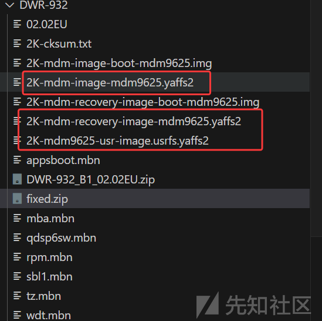

```
2K-mdm-image-boot-mdm9625.img        # 引导镜像（Bootloader相关）
2K-mdm-image-mdm9625.yaffs2          # YAFFS2格式文件系统（可能是根文件系统）
2K-mdm9625-usr-image.usrfs.yaffs2    # 用户空间文件系统（关键配置和程序）
2K-mdm-recovery-image-mdm9625.yaffs2 # 恢复模式镜像（可能包含修复工具）
appsboot.mbn                          # 应用处理器引导加载程序（类似ABOOT）
sbl1.mbn                              # 次级引导加载程序（高通平台关键启动组件）
rpm.mbn                               # 资源与电源管理分区
tz.mbn                                # TrustZone安全分区
DWR-932_B1_02.02EU.zip               # 固件升级包（可能包含完整系统镜像）
```

发现2K-mdm-image-mdm9625.yaffs2 是根文件系统直接开始分析！

```
┌──(kali㉿kali)-[/mnt/hgfs/VMShare/IOT/DWR-932]
└─$ unyaffs 2K-mdm-image-mdm9625.yaffs2 yaffs2-root/
Can't create symlink sdcard: Operation not supported
```

在 `mnt/hgfs/VMShare/IOT/DWR-932/yaffs2-root/`（共享文件夹）下解压，而 **VMware 共享文件夹 (HGFS)** **不支持符号链接**。

```
┌──(kali㉿kali)-[/mnt/hgfs/VMShare/IOT/DWR-932]
└─$ sudo unyaffs 2K-mdm-image-mdm9625.yaffs2 ~/IOT/DWR-932/yaffs2-root/
```

成功解压出来目录：  
 

# 五、敏感配置文件分析：寻找信息泄露

## 配置文件信息泄露

首先查找路径下的所有.conf文件，.conf文件大多都是配置文件,将所有的配置文件都集合起来审计：

```
┌──(kali㉿kali)-[~/IOT/DWR-932/yaffs2-root]
└─$ sudo find . -name '*.conf' -type f -print0 | xargs -0 cat > new_text.txt
```

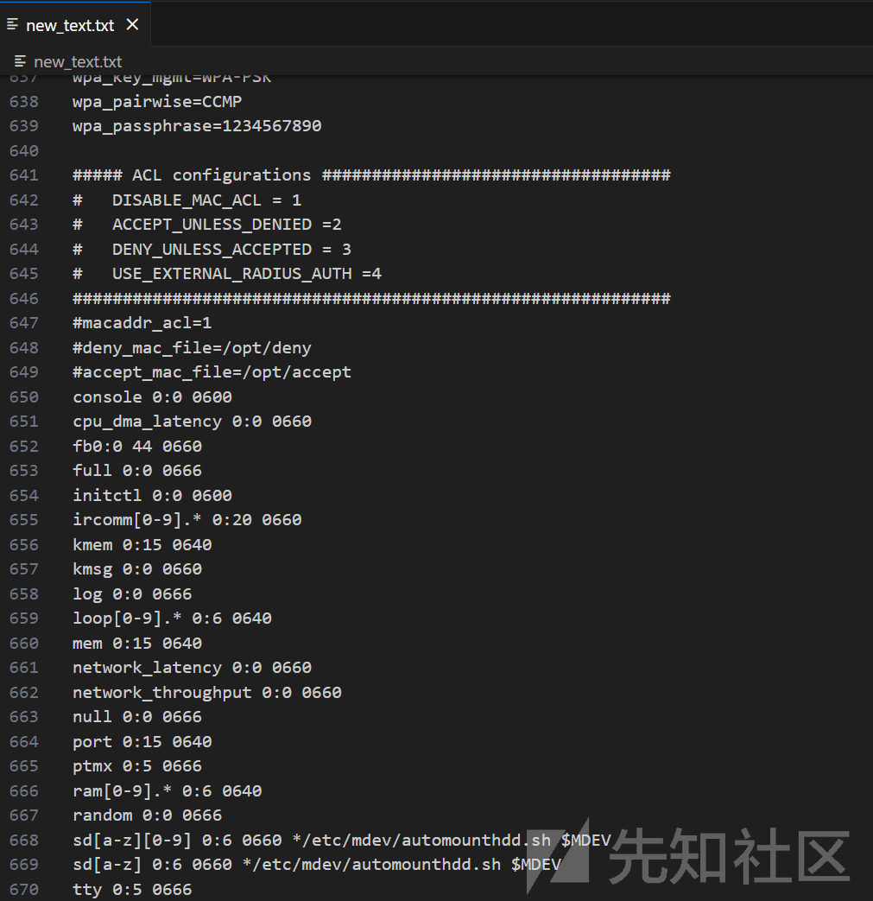  
可以寻找到非常多的数据泄露和安全隐患：  
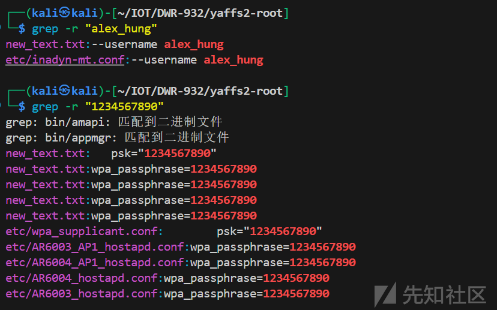

## 分析配置文件识别安全风险

**1. Wi-Fi SSID 和密码**  
文件中包含多个 Wi-Fi 配置，包括 **SSID 和 WPA-PSK 密码**：

```
ssid="QSoftAP"
wpa_passphrase=1234567890
```

```
ssid=QSoftAP1
wpa_passphrase=1234567890
```

**风险**：任何人都可以用这些凭据连接你的 Wi-Fi 网络，进行未授权访问或中间人攻击。  
**建议**：**立即更改 Wi-Fi 密码**、避免在明文文件中存储密码，可以使用 **WPA-Enterprise** 认证。

**2. 设备管理密码**  
在 `inadyn` 配置中，存在硬编码的**用户名和密码**：

```
--username alex_hung
--password 641021
```

**风险**：可能是 **动态 DNS（DDNS）** 账户的凭据，允许攻击者控制远程主机名、可能被用于访问某些管理接口。  
**建议**：**立即更改该账号的密码**。不要在明文文件中存储账号密码，改用**环境变量**或**加密存储**。

**3. 可能的内部网络信息**  
文件中包含多个**内网 IP 地址**：

```
#publish-dns-servers=192.168.50.1, 192.168.50.2
listening_ip=192.168.10.109/24
allow 1024-65535 192.168.0.0/24 1024-65535
```

**风险**：这些 IP 可能是 **内部服务器、网关或 IoT 设备**，攻击者可以利用这些信息构建攻击路径。可能用于内部网络的端口转发（UPnP 配置）。

**建议**：**不要暴露内部 IP**，避免直接放入配置文件。确保防火墙配置妥当，限制未授权访问。

**4. D-Bus 配置泄露**  
部分 `D-Bus` 配置中，可能导致未授权访问：

```
<allow send_destination="*" eavesdrop="true"/>
<allow eavesdrop="true"/>
<allow own="*"/>
```

**风险**：可能允许**任意进程监听和控制 D-Bus**，攻击者可利用此漏洞获取敏感信息或远程控制设备。  
**建议**：**限制允许的 D-Bus 访问权限**，避免 `allow="*"` 类型的配置。

**5.** `UPnP` **配置暴露**  
文件中包含 `UPnP`（通用即插即用）配置：

```
enable_upnp=yes
enable_natpmp=yes
secure_mode=no
```

**风险**：`secure_mode=no` 可能允许**外部设备修改路由规则**，导致端口转发被滥用。  
**建议**：**关闭 UPnP**，除非明确需要:`enable_upnp=no`

**6. 可能的硬编码 SSH 配置**  
文件中包含某些 `/dev` 设备的权限设置：

```
console 0:0 0600 
network_latency 0:0 0660 
network_throughput 0:0 0660 
```

**风险**：如果这些设置与 SSH 配置有关，可能导致远程用户**未授权访问设备控制台**。  
**建议**：**检查 SSH 配置**，确保只有授权用户可访问。风险评估及缓解建议（如更改密码、禁用 UPnP）。

# 六、弱密码破解：存在Root弱密码爆破问题

`/etc/shadow` 文件的格式与加密方式（MD5、SHA-256、SHA-512）。爆破shadow文件从而获得Root用户密码：  
教程：[破解shadow密码 - 小阿辉谈安全 - 博客园](https://www.cnblogs.com/hgschool/p/17070890.html)  
#shadow密码爆破  
当我们通过任意文件下载或者目录穿越下载或者读取到/etc/shadow文件时，可以对shadow中加密的密码进行爆破获取明文密码。

shadow文件加密的密码具有固定格式：

```
$id$salt$encrypted
```

* id：表示加密算法，1 代表 MD5，5 代表 SHA-256，6 代表 SHA-512。
* salt：表示密码学中的 Salt，由系统随机生成 。
* encrypted：表示密码的 hash。

冒号后面的数值是一些日期和密码修改间隔天数的信息，可以不用管，以上述示例中 root 账号为例：

```
┌──(kali㉿kali)-[~/IOT/DWR-932/yaffs2-root]
└─$ cat ~/IOT/DWR-932/yaffs2-root/etc/shadow 
root:aRDiHrJ0OkehM:16270:0:99999:7:::
daemon:*:16270:0:99999:7:::
bin:*:16270:0:99999:7:::
sys:*:16270:0:99999:7:::
sync:*:16270:0:99999:7:::
games:*:16270:0:99999:7:::
man:*:16270:0:99999:7:::
lp:*:16270:0:99999:7:::
mail:*:16270:0:99999:7:::
news:*:16270:0:99999:7:::
uucp:*:16270:0:99999:7:::
proxy:*:16270:0:99999:7:::
www-data:*:16270:0:99999:7:::
backup:*:16270:0:99999:7:::
list:*:16270:0:99999:7:::
irc:*:16270:0:99999:7:::
gnats:*:16270:0:99999:7:::
diag:*:16270:0:99999:7:::
nobody:*:16270:0:99999:7:::
messagebus:!:16270:0:99999:7:::
avahi:!:16270:0:99999:7:::
                                   
```

工具安装：[john-Linux密码爆破工具](866479b142e5863a5704305d13db1ae2)

```
sudo apt install john
```

配置爆破字典,使用kali自带的工具：  
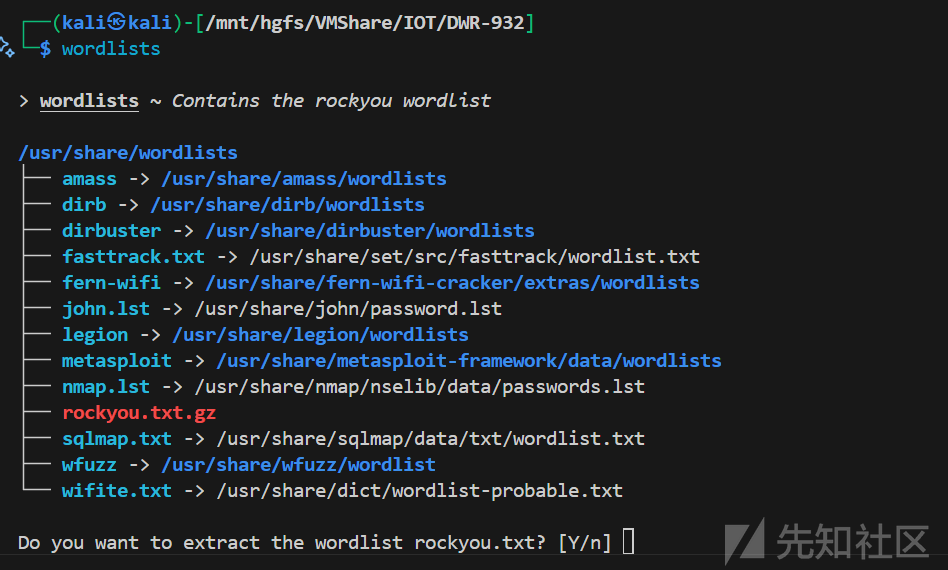

[密码字典生成与Crunch工具-CSDN博客](https://blog.csdn.net/zegeai/article/details/122660540)

```
gzip -d /usr/share/wordlists/rockyou.txt.gz		#-d 将压缩文件解压
ll /usr/share/wordlists/rockyou.txt		#显示当前目录下文件详细信息
```

直接开始爆破：

```
┌──(kali㉿kali)-[/mnt/hgfs/VMShare/IOT/DWR-932]
└─$ cat ~/IOT/DWR-932/yaffs2-root/etc/shadow| grep root | cut -d: -f2 > root.hash    

┌──(kali㉿kali)-[/mnt/hgfs/VMShare/IOT/DWR-932]
└─$ cat root.hash 
aRDiHrJ0OkehM


┌──(kali㉿kali)-[/mnt/hgfs/VMShare/IOT/DWR-932]
└─$  john --wordlist=/usr/share/wordlists/rockyou.txt root.hash
Using default input encoding: UTF-8
Loaded 1 password hash (descrypt, traditional crypt(3) [DES 128/128 AVX])
Will run 4 OpenMP threads
Press 'q' or Ctrl-C to abort, almost any other key for status
1234             (?)     
1g 0:00:00:00 DONE (2025-03-21 02:40) 33.33g/s 819200p/s 819200c/s 819200C/s 123456..112203
Use the "--show" option to display all of the cracked passwords reliably
Session completed. 
```

成功爆破出root的密码为1234！

# 七、使用 Firmwalker：扫描进行信息搜集

该脚本主要用于扫描固件解包后的文件系统，从中查找各种敏感信息和潜在的安全隐患，例如密码文件、哈希值、SSL/SSH相关文件、数据库文件、脚本、二进制文件、IP 地址、URL 和电子邮件等。通过将扫描结果输出到一个指定文件中（默认为 firmwalker.txt），方便后续的安全分析和漏洞挖掘。  
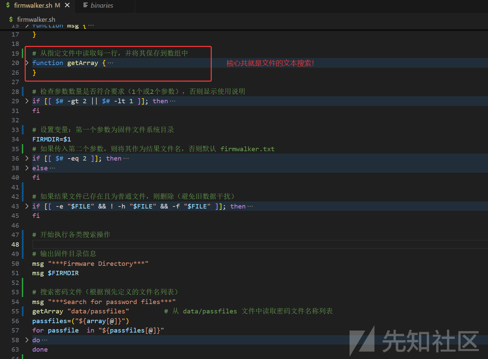  
如果需要拓展查找文件的多样性就可以手动在在下列文件中添加各种文件类型的关键字：

```
└─$ tree /home/kali/tools/firmwalker/data
/home/kali/tools/firmwalker/data
├── binaries
├── dbfiles
├── files
├── passfiles
├── patterns
├── sshfiles
├── sslfiles
└── webservers
```

这些关键词或文件名进行搜索。具体作用如下：

* **binaries**：存放固件中可能存在的重要二进制文件（如系统工具、调试程序等）的名称列表，帮助定位系统中关键可执行文件。
* **dbfiles**：记录数据库相关文件的名称（如数据库配置文件、数据存储文件等），用于查找可能泄露数据库信息的文件。
* **files**：通用文件列表，包含其他可能包含敏感信息或配置的文件名称，作为补充搜索目标。
* **passfiles**：列举常见的存放密码或认证信息的文件名称（例如密码文件、用户凭据文件等），用于检测是否存在密码泄露。
* **patterns**：预设搜索模式或正则表达式列表，工具会利用这些模式在固件文件内容中搜索敏感信息（如密码、API 密钥等）。
* **sshfiles**：存放与 SSH 相关的文件名称，如 SSH 配置、私钥、公钥文件等，用于识别可能存在的 SSH 安全隐患。
* **sslfiles**：列出与 SSL/TLS 相关的文件（如 .pem、.crt 证书文件等），便于查找证书及其相关信息，并可能进一步通过 Shodan 等工具检测这些证书在互联网中的暴露情况。
* **webservers**：记录与 Web 服务器相关的文件名称（例如 Web 服务的配置文件或默认页面等），帮助定位固件中 Web 服务的相关组件和潜在信息。

直接开始脚本分析:  
直接将提取出来的信息丢给AI去分析，固件中存在的关键安全问题包括：

* 敏感账户和密码文件泄露，易被暴力破解。
* SSL/SSH 密钥及证书文件未做妥善保护，可能导致通信中间人攻击和远程入侵。
* 大量配置文件和脚本中可能存在硬编码的敏感信息或弱口令。
* 内部网络信息暴露，为横向移动攻击提供线索。
* 服务和二进制文件未加固，存在利用已知漏洞的风险。

也可以单独筛选出其中关键的二进制文件：  
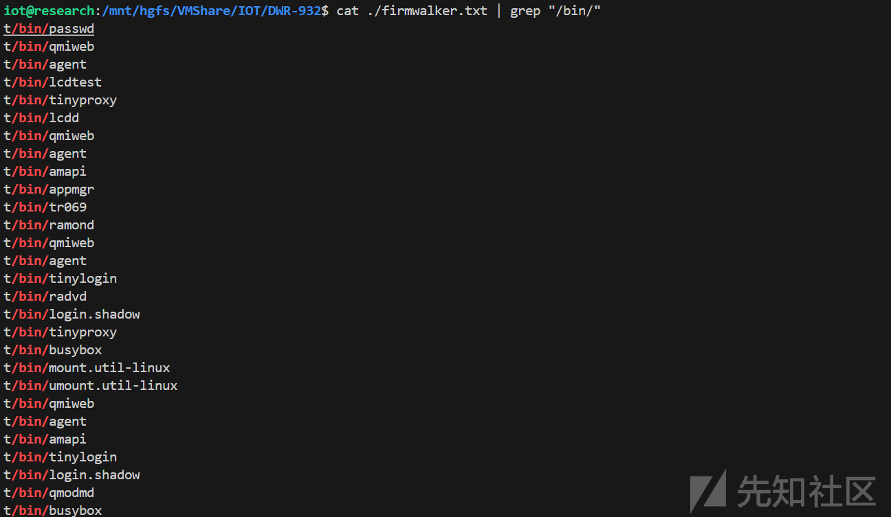

# 八、逆向分析存在风险的二进制程序

分析完敏感的配置文件后，我们接下来需要对存在风险的二进制程序进行深入分析。这些程序通常是设备功能的核心，包含关键的业务逻辑和网络通信功能，因此可能隐藏着高危漏洞。以下是我们分析的思路和方法。

## 定位关键二进制文件

为了找到值得关注的二进制文件，我们可以使用 firmwalker 工具快速扫描固件，识别出与网络服务、安全认证和系统管理相关的重要文件。以下是一些常见的、需要重点分析的二进制文件：  
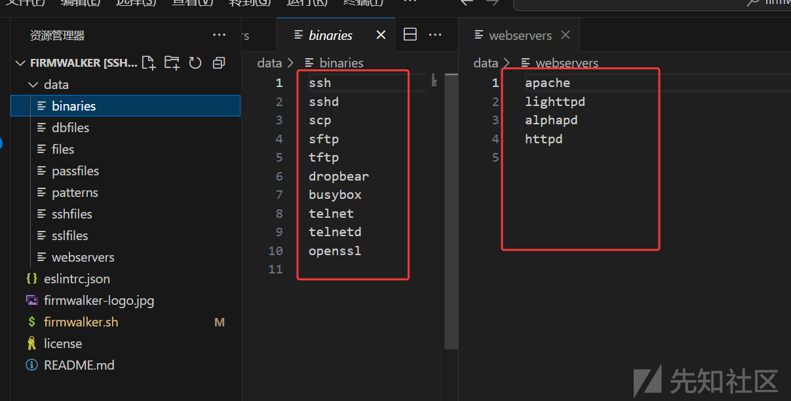

* **远程访问和文件传输相关**：

* ssh：安全壳协议客户端
* sshd：SSH 服务端
* scp：安全文件拷贝
* sftp：安全文件传输协议
* tftp：简单文件传输协议
* dropbear：轻量级 SSH 服务器和客户端

* **多功能工具**：

* busybox：嵌入式系统中常见的多功能工具集

* **远程终端服务**：

* telnet：远程登录客户端
* telnetd：Telnet 服务端

* **加密和安全通信**：

* openssl：开源加密库和工具

* **Web 服务器**：

* apache：Apache HTTP 服务器
* lighttpd：轻量级 Web 服务器
* alphapd：嵌入式设备中常见的 Web 服务
* httpd：通用 HTTP 服务器

这些文件通常与设备的核心功能密切相关，是潜在漏洞的集中区域，因此需要优先分析。

**检查自启动脚本**  
为了确定哪些二进制文件在设备启动时被执行，我们可以分析 /etc/init.d/ 目录下的自启动脚本。这些脚本是路由器服务启动的关键，包含了启动命令和参数，能够帮助我们定位核心服务程序。

例如，可以通过以下命令提取所有自启动脚本的内容到一个文件进行分析：

```
┌──(kali㉿kali)-[~/IOT/DWR-932/yaffs2-root]
└─$ find etc/init.d/* -type f -print0 | xargs -0 cat > new_text.txt
```

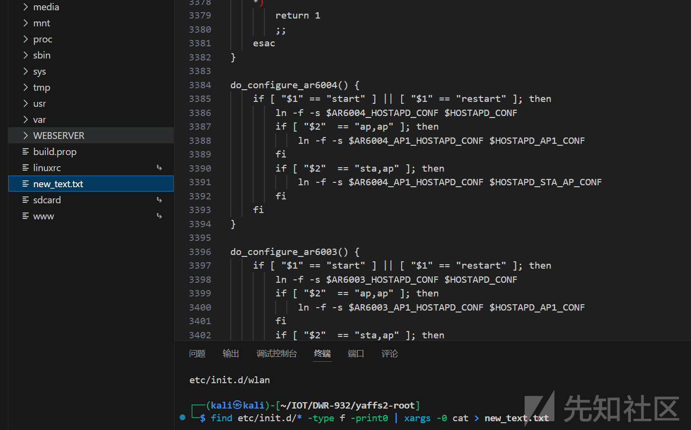  
生成的 new\_text.txt 文件包含了 init.d 目录下所有脚本的合集。通过分析这个文件，我们可以找出被启动的二进制文件、Web 服务及其对应的启动命令。例如，一个名为 start\_appmgr 的脚本引起了我们的注意，因为 “mgr” 通常暗示这是一个主控程序（manager）。从中我们可能发现以下关键程序：

* /bin/appmgr：主管理守护进程，负责设备管理和 Web 接口。
* /sbin/fotad：FOTA 更新守护进程，负责固件在线升级。

这些被自启动脚本调用的文件是我们分析的重点目标。

## /bin/appmgr：主管理守护进程

/bin/appmgr 是路由器的核心管理程序，可能包含 Web 服务、远程管理等功能模块。分析时，我们需要关注以下风险点：

* **未经身份验证的远程命令执行**：检查程序是否允许通过网络接口（如 UDP 端口）直接执行命令，而无需身份验证。这类漏洞可能导致攻击者远程控制设备。
* **默认凭据**：分析代码中是否硬编码了默认的管理员账号和密码，这些凭据可能被攻击者利用。
* **硬编码 WPS PIN**：WPS PIN 是 Wi-Fi 保护设置的认证码，如果程序中存在硬编码的 PIN，可能导致 Wi-Fi 网络被轻易破解。
* **UPnP 安全问题**：通过分析 /var/miniupnpd.conf 配置文件，发现 UPnP 服务关闭了安全模式（secure\_mode=no），这可能允许未经授权的外部设备请求端口转发，暴露内部网络服务。

#### 发现未授权远程命令执行漏洞

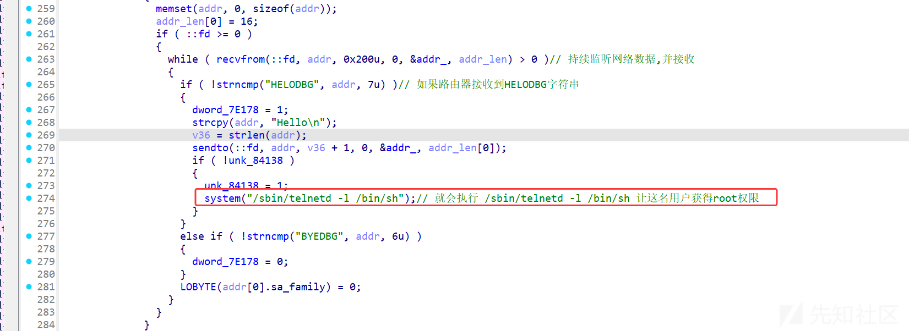这个漏洞是一个 **未授权远程命令执行漏洞**（Unauthenticated Remote Command Execution Vulnerability），具体表现为目标设备（如路由器）上运行的程序通过 UDP 协议监听特定端口（如 `0.0.0.0:39889`），并接受特定的控制命令（如 `HELODBG`），触发执行高危操作。

我们可以继续逆向分析一下如何获知其绑定的端口号和ip地址的：  
普及常见的C语言的网络相关的API函数:

|  |  |  |
| --- | --- | --- |
| 函数名 | 参数示例/关键参数 | 功能描述 |
| **socket** | `socket(1, 2, 0)`（Unix域数据报） | 创建套接字，支持不同协议族（如Unix域或IPv4）和类型（如数据报）。 |
| **bind** | `bind(fd, addr, 0x6Eu)`（Unix域） | 将套接字绑定到指定地址（文件路径或IP/端口）。 |
| **connect** | `connect(fd, addr, 0x6Eu)` | 尝试连接Unix域套接字（若已存在）。 |
| **recvfrom** | `recvfrom(::fd, addr, 0x200u, 0, &addr_, addr_len)` | 接收数据报（UDP或Unix域），获取发送方地址。 |
| **sendto** | `sendto(::fd, addr, v36 + 1, 0, &addr_, addr_len[0])` | 发送数据报到指定地址（如响应调试命令）。 |
| **select** | `select(sig + 1, &readfds_, 0, 0, &timeout)` | 多路复用监听文件描述符（套接字、信号等）的活动状态。 |
| **fcntl** | `fcntl(fd, 2, 1)`（设置阻塞模式） | 0x800)`（非阻塞） |
| **unlink** | `unlink(addr[0].sa_data)` | 删除Unix域套接字文件（清理旧套接字）。 |
| **access** | `access("/var/usock", 0)` | 检查文件/目录是否存在（用于验证套接字路径或配置目录）。 |
| **close** | `close(::fd)` | 关闭套接字或文件描述符。 |
| **strerror** | `strerror(errnum)` | 将错误码转换为错误描述字符串（用于调试网络错误）。 |
| **recv** | `recv(fd, ::ptr, 0x101Cu, 16448)` | 从套接字接收数据（可能用于Unix域流套接字，但代码中未明确）。 |
|  |  |  |
|  |  |  |
|  |  |  |

我们可以继续逆向分析这个ip和端口是如何发现的，直接寻找bind函数：

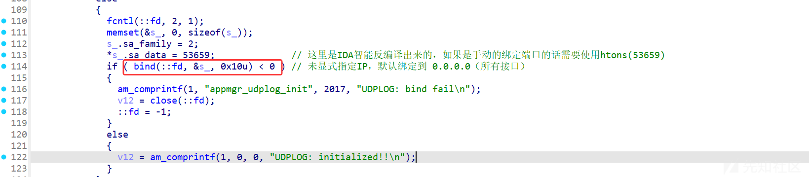

**作用**：创建一个UNIX域数据报套接字，绑定到本地路径`/var/usock/appmgr.us`，用于本地进程间通信（非网络通信），但是**不涉及IP和端口**。  
这段代码用于初始化一个UDP日志系统，设置套接字为非阻塞模式，并绑定到指定的端口（53659）和所有网络接口（0.0.0.0）。

继续向后看就可以发现这个后门漏洞在持续的监听0.0.0.0:39889，来检测是否需要开启后门服务，即执行 /sbin/telnetd -l /bin/sh 让这名用户获得root权限：

```
if ( targetfd >= 0 )
{
  while ( recvfrom(targetfd, addr, 0x200u, 0, &addr_, addr_len) > 0 )// 持续监听网络数据,并接收
  {
    if ( !strncmp("HELODBG", addr, 7u) )// 如果路由器接收到HELODBG字符串
    {
      dword_7E178 = 1;
      strcpy(addr, "Hello
");
      v36 = strlen(addr);
      sendto(targetfd, addr, v36 + 1, 0, &addr_, addr_len[0]);
      if ( !unk_84138 )
      {
        unk_84138 = 1;
        system("/sbin/telnetd -l /bin/sh");// 就会执行 /sbin/telnetd -l /bin/sh 让这名用户获得root权限
      }
    }
    else if ( !strncmp("BYEDBG", addr, 6u) )
    {
      dword_7E178 = 0;
    }
    LOBYTE(addr[0].sa_family) = 0;
  }
}
```

#### 发现默认凭证漏洞

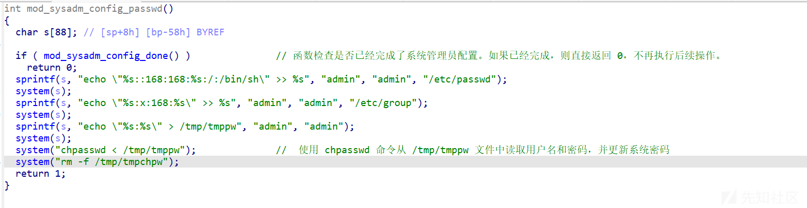  
这个函数发现如果没有配置管理员的话就直接创建一个默认管理员账户，账号密码默认为admin，admin！

`chpasswd` 是一个 Linux 命令，用于批量更新用户密码。它从标准输入或文件中读取用户名和密码对（格式为 `用户名:密码`），并自动更新系统中相应用户的密码。

#### 发现默认 WPS PIN 码

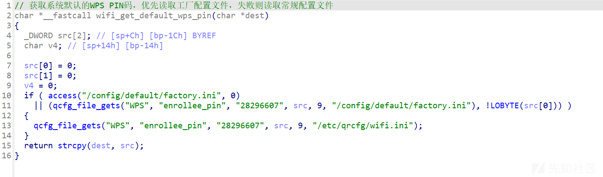  
默认配置下，该路由器 WPS 系统的 PIN 码永远都是 `28296607` 因为这个 PIN 码是硬编码在 `/bin/appmgr` 程序中  
扩展说明： WPS PIN是Wi-Fi Protected Setup的认证码，该实现常用于路由器等网络设备，通过分级配置策略保证设备在出厂设置和用户自定义配置间灵活切换。

#### 发现路由器存在UPnP 安全问题

根据前面firmwalker收集的信息我们可以很快定位到这个款路由器存在**UPnP**服务：  
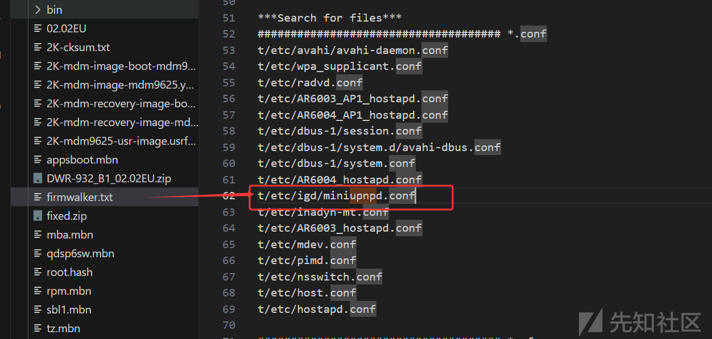

UPnP（通用即插即用）协议用于设备自动发现和配置网络服务，其子协议IGD（Internet网关设备）允许内网设备请求路由器动态添加端口转发规则，以简化NAT穿透过程。  
[UPnP协议 - Charon·1937 - 博客园](https://www.cnblogs.com/charon1937/p/13712152.html)

UPnP 并不安全，因为存在许多安全问题！想象一下：您正在打开端口以允许传入的外部设备与您的设备建立连接并绕过 NAT 防火墙。这会将您的计算机或任何其他设备公开暴露给不需要的连接甚至黑客。

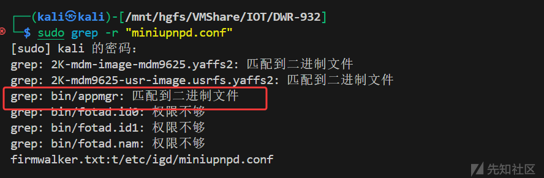  
我们可以根据UPnP的配置文件是由谁生成的来查找目标程序的位置，来寻找相关漏洞！  
继续分析`/bin/appmgr`中存在的配置UPnP的功能！  
直接查找`/var/miniupnpd.conf`字符串的引用发现并没有数据！  
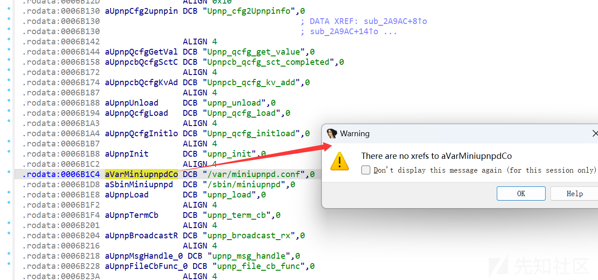

我们可以往上看可以发现 aUpnpCfg2upnpin 有被引用的痕迹，直接查看调用发现剩下的字符串是通过偏移来计算的所以直接锁定目标位置！  
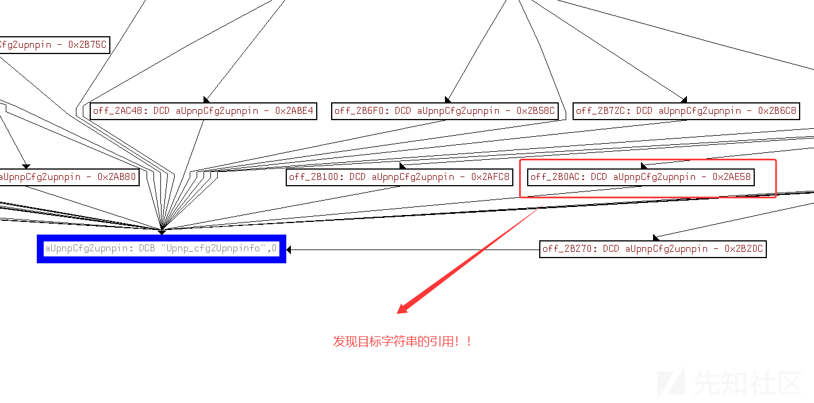

直接锁定目标！  
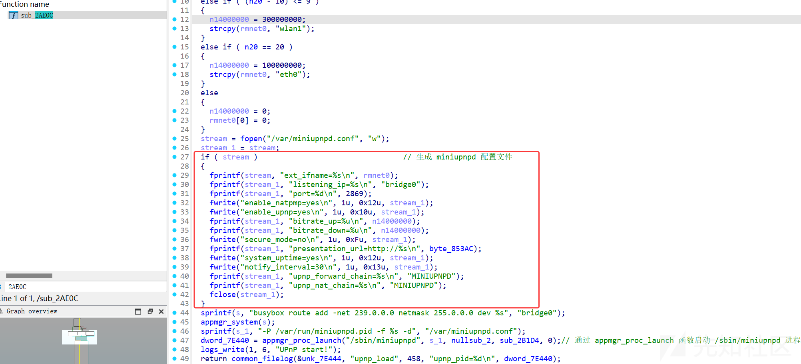  
该函数的主要作用是配置并启动一个 UPnP（通用即插即用）守护进程 miniupnpd，以支持网络设备的自动发现和端口映射。  
我们可以通过逆向发现`/var/miniupnpd.conf`配置文件的内容;

```
ext_ifname=rmnet0
listening_ip=bridge0
port=2869
enable_natpmp=yes
enable_upnp=yes
bitrate_up=14000000
bitrate_down=14000000
secure_mode=no     #关闭了安全模式
presentation_url=http://192.168.1.1
system_uptime=yes
notify_interval=30
upnp_forward_chain=MINIUPNPD
upnp_nat_chain=MINIUPNPD
```

配置文件中设置了 secure\_mode=no，明确关闭了安全模式。关闭安全模式可能允许未经授权的 UPnP 请求通过，使设备更容易受到外部攻击。攻击者可能利用 UPnP 协议执行未经授权的操作。

## /sbin/fotad：FOTA 更新守护进程

/sbin/fotad 负责与服务器通信并下载固件更新，是设备固件升级的关键组件。分析时，我们需要关注：

* **硬编码凭据**：检查程序中是否使用了固定的认证信息（如用户名、密码或 API 密钥），这些信息可能被攻击者截获并利用。
* **不安全更新机制**：分析固件下载和验证流程，检查是否存在未加密传输、中间人攻击或固件篡改的风险。

根据前面firmwalker收集的信息我们可以很快定位到这个款路由器的固件更新程序：  
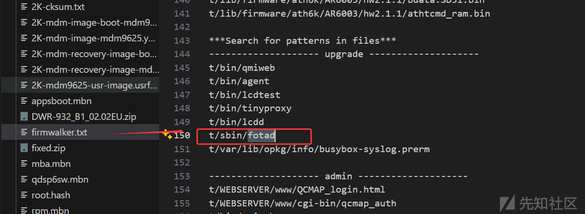

“fotad” 是路由器中用于固件在线升级（FOTA, Firmware Over-The-Air）的守护进程，其主要职责是与 FOTA 服务器建立通信并进行固件更新。  
详细信息：[FOTA升级简介-CSDN博客](https://blog.csdn.net/weixin_42913061/article/details/118363867)

#### 逆向分析固件更新过程中的程序处理

直接开始对fotad进行逆向分析：  
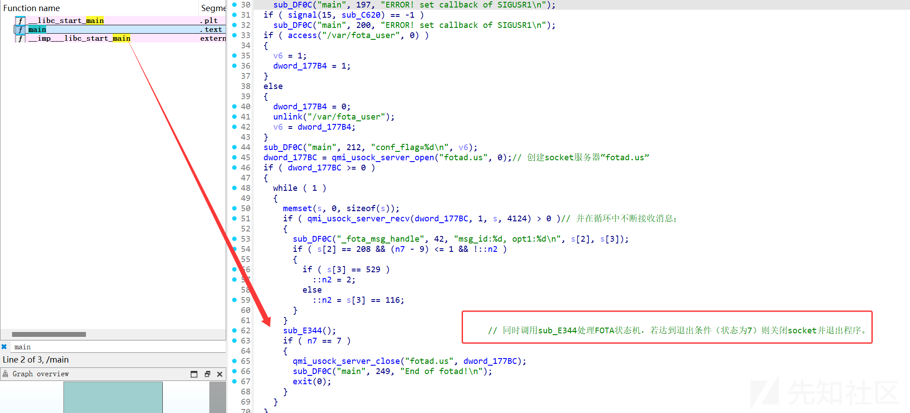  
main函数的主要功能：

* **读取配置文件路径**：如果程序参数个数为2，则从参数中获取配置文件路径，否则使用默认的`/var/fota/fotad.conf`。
* **打印版本信息**：输出FOTA客户端和守护进程的版本信息。
* **切换目录和初始化环境**：切换到根目录、关闭标准输入，并初始化数据缓存。
* **检测配置文件**：调用`sub_E038`检查配置文件，若未找到则退出。
* **信号注册**：设置SIGUSR1和SIGTERM的信号处理回调。
* **检测并处理特定文件**：判断`/var/fota_user`文件的存在，设置标志并在必要时删除。

#网络协议逆向  
找到关键处理函数！sub\_E344()，该函数使用`switch`语句，根据全局变量`n7`（当前FOTA状态）的不同值进入不同处理分支，所以继续！  
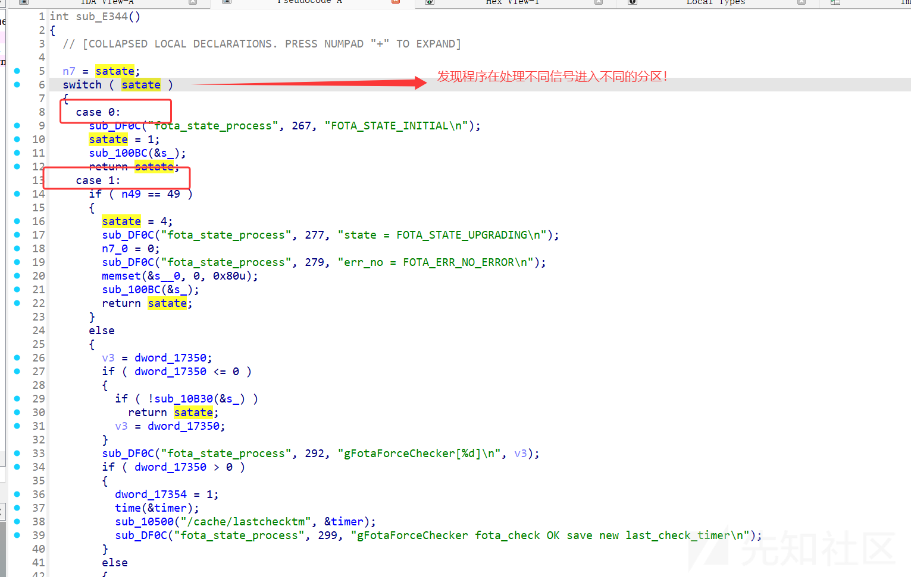  
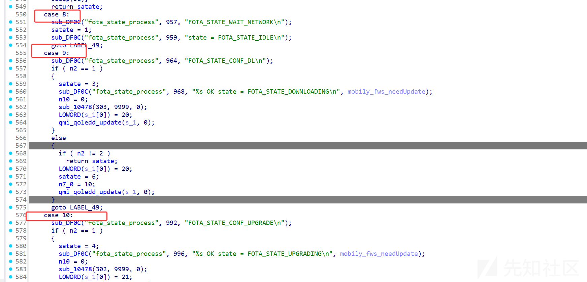  
可以阅读一下这个函数的不同状态的功能来寻找存在的漏洞！一共有十种不同的状态机，可以阅读一下他们的功能，并且进行漏洞分析！

该函数使用`switch`语句，根据全局变量`n7`（当前FOTA状态）的不同值进入不同处理分支：

* **状态0（初始状态）**：初始化后进入下一状态。
* **状态1（空闲/等待状态）**：检测是否满足升级条件，如检测到某条件满足则转为升级状态；否则执行版本检查、更新最后检查时间等操作，并根据网络状态决定是否进入检查固件信息状态。
* **状态2（检查固件信息）**：检查是否有新的固件版本，若有则决定进入下载状态或重试；否则根据网络情况进入空闲或停止状态。
* **状态3（下载固件）**：在此阶段进行固件的下载操作，包括断点续传、重试机制以及下载失败处理。
* **状态4（正在升级）**：固件升级操作被触发，状态进入升级阶段。
* **状态5（升级完成）**：升级完成后，根据是否为守护进程模式或单次模式，分别进入空闲或退出状态。
* **状态6（中止/失败）**：在出现错误或中止条件时进入停止状态，并执行相应清理操作。
* **状态8、9、10（等待网络、确认下载、确认升级）**：分别处理等待网络、确认下载信息以及确认升级指令，并调用相应的界面更新和提示函数。

#### 发现硬编码凭证漏洞

该部分存在网络下载服务，可以从官方服务器下载更新固件，那我们就可以查看这个下载固件的服务是否存在安全问题：  
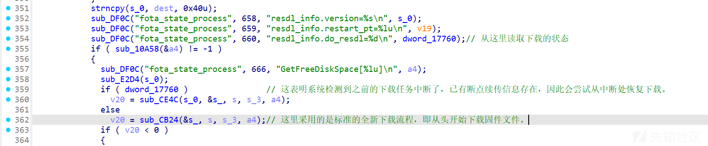  
下面找到的两个函数分别是下载固件的函数，可以进一步分析，分析sub\_CB24函数可以很快发现身份认证信息来源于base64\_CAAC：  
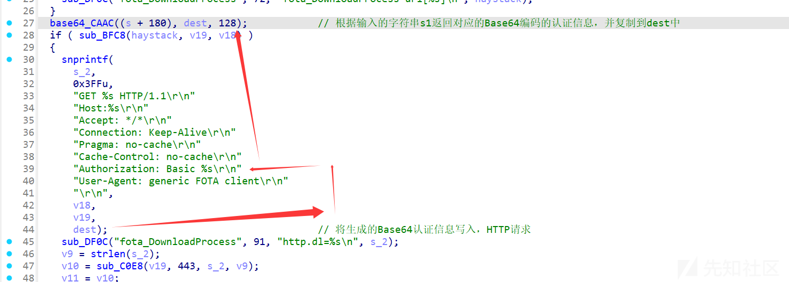  
进一步分析base64\_CAAC函数：

```
char *__fastcall base64_CAAC(const char *s1, char *dest, int n128)
{
  const char *cWRwZTpxZHBl; // r1 根据输入的字符串s1放回对应的Base64编码的认证信息，并复制到dest中

  if ( !strcmp(s1, "qdpc") )
  {
    strncpy(dest, "cWRwYzpxZHBj", n128 - 1);
    return dest;
  }
  else
  {
    if ( !strcmp(s1, "qdpe") )
      cWRwZTpxZHBl = "cWRwZTpxZHBl";
    else
      cWRwZTpxZHBl = "cWRwOnFkcA==";
    strncpy(dest, cWRwZTpxZHBl, n128 - 1);
    return dest;
  }
}
```

可以很快得到如下通信时的凭证，存在严重的安全隐患：

```
cWRwYzpxZHBj        qdpc:qdpc
cWRwZTpxZHBl        qdpe:qdpe
cWRwOnFkcA==        qdp:qdp
```

由于凭证数据直接硬编码在 fotad 中，且仅经过 Base64 编码（实际上并未加密，只是简单的编码），攻击者可以利用逆向工程工具（如 IDA Pro）轻易还原出这些认证数据，从而造成如下危害：

1. **伪造合法设备**  
   攻击者可以利用获取的凭证伪造合法的路由器或设备，与 FOTA 服务器建立通信。这可能允许攻击者获取或篡改固件更新。
2. **固件更新劫持**  
   利用硬编码凭证，攻击者可以在 FOTA 更新流程中注入恶意固件，达到远程执行恶意代码、控制设备甚至破坏整个网络的目的。
3. **中间人攻击（MITM）**  
   如果凭证泄露，攻击者可冒充 FOTA 服务器进行中间人攻击，拦截、修改或阻止更新过程，从而对路由器进行远程控制或信息窃取。

总之，该漏洞使得攻击者能够绕过身份认证机制，直接利用硬编码的凭证对固件更新流程进行操控，从而引发设备安全、网络安全和后续攻击风险。

# 九、参考资料

* [D-Link DWR-932B 固件下载页面](https://ftp.dlink.de/dwr/dwr-932/archive/driver_software/DWR-932_fw_revb_202eu_ALL_multi_20150119.zip)
* [PLC\_1earn/1earn/Security/IOT/固件安全/实验/Dlink\_DWR-932B路由器固件分析.md at master · dbshow/PLC\_1earn](https://github.com/dbshow/PLC_1earn/blob/master/1earn/Security/IOT/%E5%9B%BA%E4%BB%B6%E5%AE%89%E5%85%A8/%E5%AE%9E%E9%AA%8C/Dlink_DWR-932B%E8%B7%AF%E7%94%B1%E5%99%A8%E5%9B%BA%E4%BB%B6%E5%88%86%E6%9E%90.md)
* [从0到1：固件分析\_固件 分析-CSDN博客](https://blog.csdn.net/GKD2019/article/details/145749634)
* [破解shadow密码 - 小阿辉谈安全 - 博客园](https://www.cnblogs.com/hgschool/p/17070890.html)
