# 记一次bottle框架的渲染标识符挖掘-先知社区

> **来源**: https://xz.aliyun.com/news/17379  
> **文章ID**: 17379

---

# 记一次bottle框架的渲染标识符挖掘

### 前言

最近打了一个nctf的题，题目源代码是一个pydash原型链污染以及一个模板渲染的操作，这里简单给出一些源代码：

```
from typing import Optional

import pydash
import bottle

__forbidden_name__=[
    "bottle"
]
__forbidden_name__.extend(dir(globals()["__builtins__"]))

def setval(name:str, path:str, value:str)-> Optional[bool]:
    obj=globals()[name]
    try:
        pydash.set_(obj,path,value)
    except:
        return False
    return True

@bottle.post('/setValue')
def set_value():
    name = bottle.request.query.get('name')
    path=bottle.request.json.get('path')
    if not isinstance(path,str):
        return "no"
    if len(name)>6 or len(path)>32:
        return "no"
    value=bottle.request.json.get('value')
    return "yes" if setval(name, path, value) else "no"

@bottle.get('/render')
def render_template():
    path=bottle.request.query.get('path')
    if len(path)>10:
        return "hacker"
    blacklist=["{","}",".","%","<",">","_"] 
    for c in path:
        if c in blacklist:
            return "hacker"
    return bottle.template(path)
bottle.run(host='127.0.0.1', port=5000)
```

删掉了一些waf，具体代码加了waf的代码可以查看nctf2024的ez\_dash\_revenge。

这里本地下载pydash的版本为5.1.2即可。

从代码中可以看出，这里的setValue路由是存在原型链污染的，然后这里的render路由是存在ssti漏洞的。但是这里的render路由是过滤了{和}的，结合到之前python原型链污染学的污染jiaja2标识符，这里自然而然就想到了挖掘这个点来进行利用。

下面来看一下怎么挖掘。

### 挖掘分析

在代码中可以将模板渲染的代码的waf给去掉，再精简一下代码，可以得到如下内容：

```
from typing import Optional

import pydash
import bottle

def setval(name:str, path:str, value:str)-> Optional[bool]:
    obj=globals()[name]
    try:
        pydash.set_(obj,path,value)
    except:
        return False
    return True

@bottle.post('/setValue')
def set_value():
    name = bottle.request.query.get('name')
    path=bottle.request.json.get('path')
    value=bottle.request.json.get('value')
    return "yes" if setval(name, path, value) else "no"

@bottle.get('/render')
def render_template():
    path=bottle.request.query.get('path')
    return bottle.template(path)
bottle.run(host='127.0.0.1', port=5000)
```

现在就用这个代码来进行一下演示。

可以先看一下这里的正常的模板渲染效果：

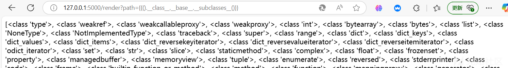

其实就是和正常学的flask框架的ssti漏洞是一样的。

这里需要知道一个知识点，翻看[bottle官方文档](https://www.osgeo.cn/bottle/stpl.html)，可以知道这里是bottle框架是可以在模板中嵌入python代码的：

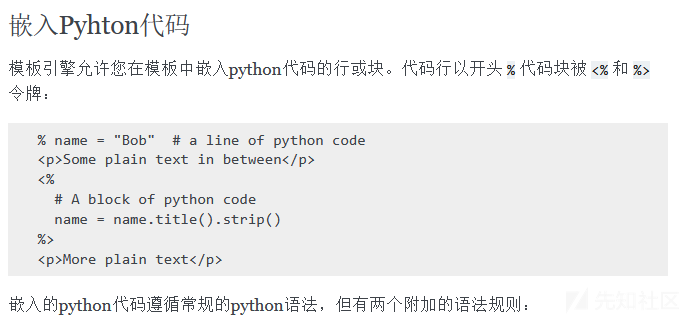

具体的利用可以看GHCTF2025的Message in a Bottle。这里提到了%和<%与%>几个标识符，这里就是可以执行python代码，所以同样是存在漏洞的，具体看nctf2024的ez\_dash非预期题解。

既然这里都说了是挖掘模板渲染标识符的，先说一下我的**基本想法**，既然题目中过滤了{}，那么这里是否可以进行尝试污染标识符为[[]]，从而来进行ssti漏洞利用。

想要污染，那么肯定是需要先找到在bottle框架中的标识符的定义，问了一下gpt，如下：

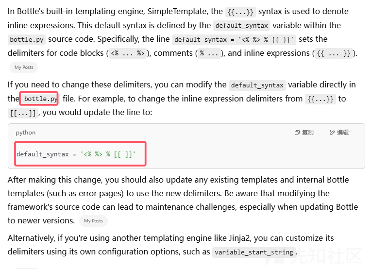

这里我们可以知道了是定位在bottle.py文件中，跟随一下，发现确实如上所述：

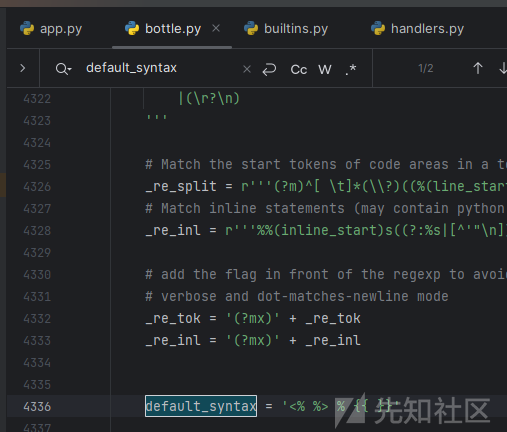

并且可以知道是定义在StplParser类中的。

那么其实在这里就可以进行一次简单的利用了，位置以及地方都找到了，需要先找到这个类，如果name没过滤bottle的话，其实直接如下就能找到：

```
import bottle
print(bottle.StplParser.default_syntax)
```

但是是没法的，这里就只能使用\_\_loader或\_\_spec\_\_来找sys模块再加载这个类了，结合题目中导入了pydash这个模块，经测试如下就可以找到指定变量：

```
import bottle
import pydash
print(pydash.__spec__.__init__.__globals__['sys'].modules['bottle'].StplParser.default_syntax)
print(pydash.__loader__.__init__.__globals__['sys'].modules['bottle'].StplParser.default_syntax)
```

那么这里其实就已经可以尝试来改变一下这个变量的值了，在这里我是想当然地直接修改，为了方便查看，这里简单改一点源码：

```
from typing import Optional

import pydash
import bottle

def setval(name:str, path:str, value:str)-> Optional[bool]:
    obj=globals()[name]
    try:
        pydash.set_(obj,path,value)
        print(pydash.__spec__.__init__.__globals__['sys'].modules['bottle'].StplParser.default_syntax)
    except:
        return False
    return True

@bottle.post('/setValue')
def set_value():
    name = bottle.request.query.get('name')
    path=bottle.request.json.get('path')
    value=bottle.request.json.get('value')
    return "yes" if setval(name, path, value) else "no"

@bottle.get('/render')
def render_template():
    path=bottle.request.query.get('path')
    return bottle.template(path)
bottle.run(host='127.0.0.1', port=5000)
```

pydash污染的话就如下传参就行了：

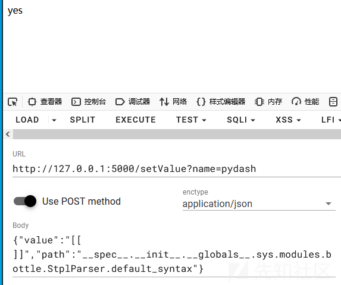

在控制台可以看到成功污染掉：

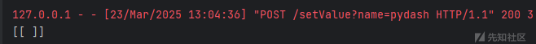

再尝试进行模板渲染：

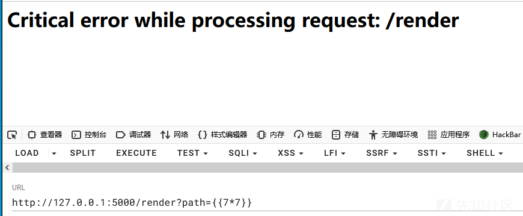

报错了，并且在控制台上也是标明了报错点：

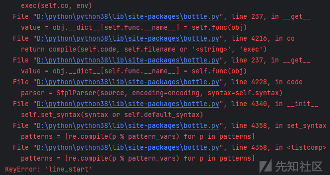

其实这里的报错点非常重要，但是最开始挖的时候没注意到，还是纪录一下最开始的流程，到时候回过来看这里也就比较好理解了。

————————

所以还是需要调试一下过程，目的还是寻找模板渲染的点。在bottle.template处打一个断点，然后传参{{7\*7}}来进行调试分析：

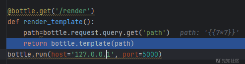

跟进这个templates()函数：

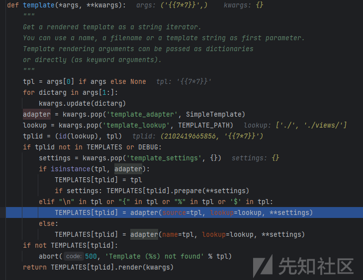

然后符合那个elif条件，这里应该是尝试获取到模板，继续往下调试，会进入到模板引擎类的初始化：

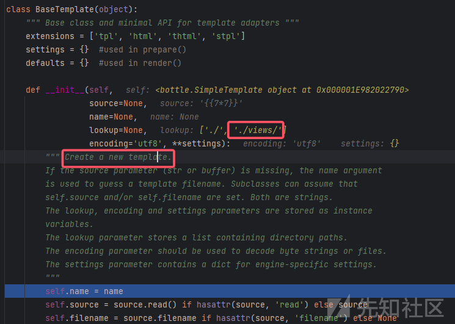

翻看bottle官方文档，可以知道是符合的：

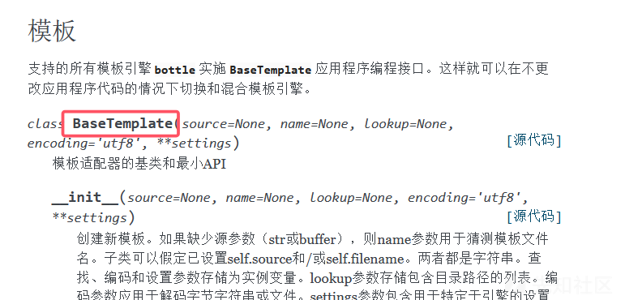

同时从代码逻辑中也是能看出来的，adapter值的定义就是将其定义为了SimpleTemplate类，而BaseTemplate类是SimpleTemplate类的父类：

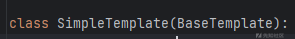

所以一切都是合乎道理的。

再看前面调试分析部分，注意看这个类的注释，也标注出来了，可以这个类就是用来获取到相关模板的，然后看lookup形参的传递，指向的是./views/，也就是在这个目录下寻找以tpl、html等为后缀的文件，但是很明显我这里是并没有传参文件名，也就是并没有渲染到一个文件中，所以这里的值为None，我这里的源代码逻辑就是直接渲染然后回显到前端，继续调试，然后会调用到prepare()函数：

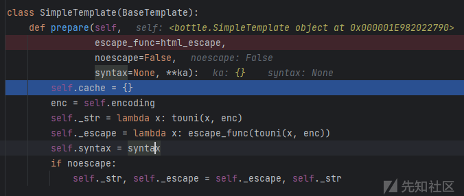

这里跟完也没啥，不用太管，上面的操作大概就是寻找模板。

回到template()函数的调用，然后就会调用到模板的render()来渲染:

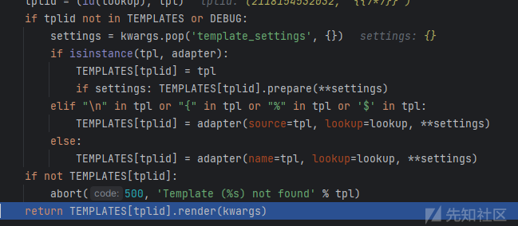

跟进一下，然后会调用execute()方法：

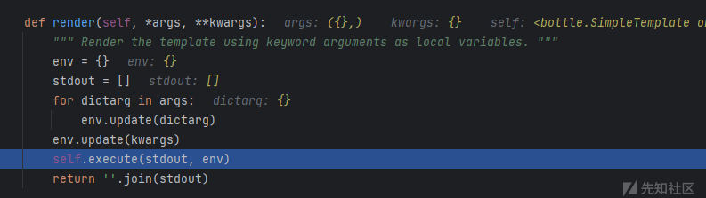

跟进这个方法：

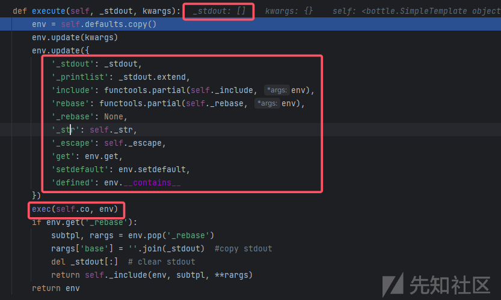

可以看到这里是进行了环境的定义，也就是一些bottle框架自带的模板函数，可以看一下官方文档，也有如下说明：

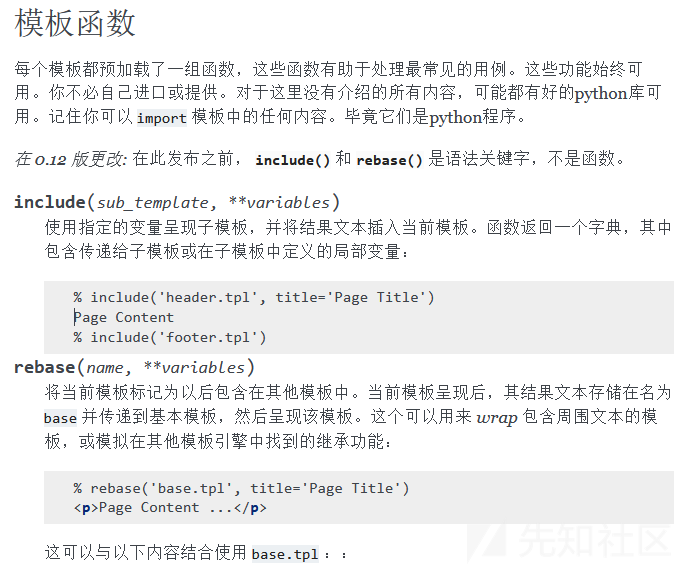

再回到调试，这一部分的重点都已经在图中标注出来了，当定义完了模板函数，然后会调用exec()函数，这个函数非常有说法，当调用了这个exec()函数结束后，我们可以看到如下内容：

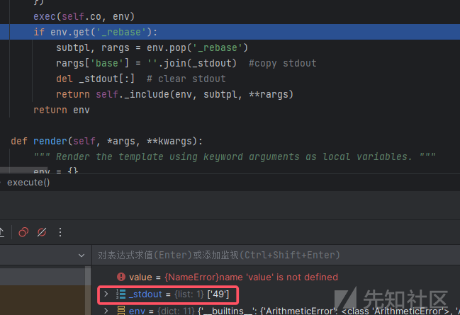

变量\_stdout变成了渲染后的49，那么这里肯定是与这个exec()函数有关了，在这个exec()函数中，是调用了self.co和env，可以看一下变量的定义：

* env：

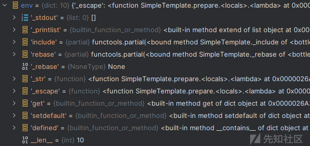

没啥好利用的。

* self.co：

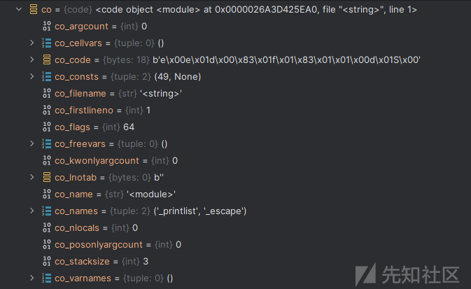

可以看到主要的点还是在这个self.co变量中，但是在前面的代码中是没有看到哪里有对这个变量的定义的，直接跟进一下，发现是通过方法来获取的：

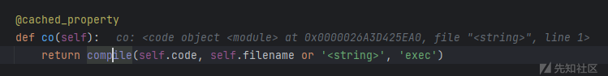

这里利用到了@cached\_property装饰器，这个装饰器用于将类的方法转换为一个属性，就是看成一个运行后返回的值就是一个属性。

然后可以看到这里调用了self.code，这个变量的定义同样是一个方法来动态定义的：

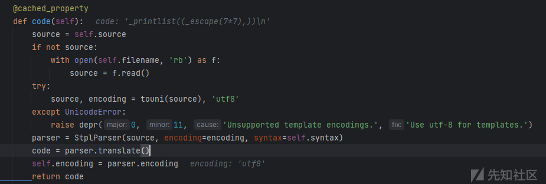

我们现在在exec()以及co()方法处打断点调试一下。会先进入cached\_property类的初始：

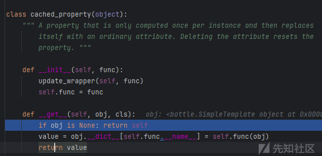

不用管，没啥用，到下一步，会调用到code()方法，这里都获取self.code的值了，那么肯定会调用这个方法的呀：

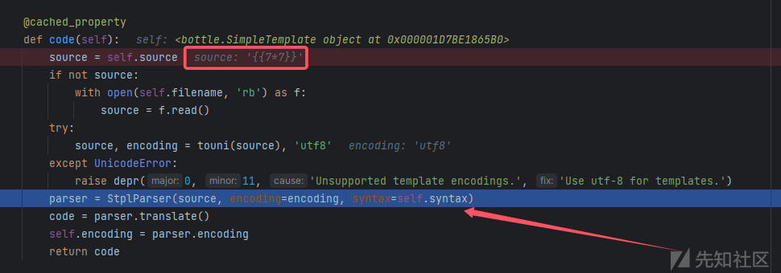

可以看到这里是有初始化StplParser类的，这个类就是我们前面找到的定义标识符变量的类，跟进一下：

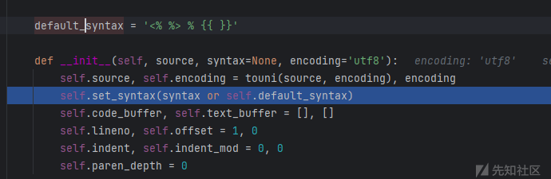

然后跟进这个set\_syntax()方法：

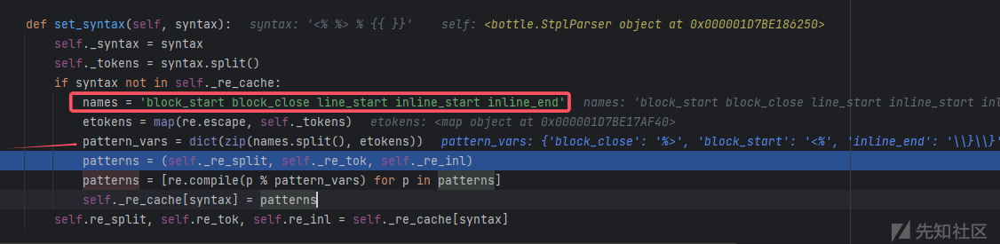

重点也标注出来了，在这里可以看到定义了几个names，其实我刚开始挖找标识符定义的时候就注意到了这个，但是当时没看懂在干嘛。在这里就可以看出来了，在调用了names.split()所在代码后，可以看到此时的变量的定义变成了如下:

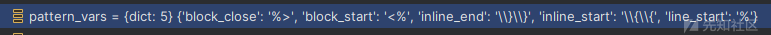

block\_start、block\_close、inline\_end、inline\_start等，这样一匹配下来，就可以知道这里就是代表的标识符分割，那么我这里在污染值时应该也是需要符合这个逻辑的，尝试一下，那么语句就需要修改为：

```
{"value":"<% %> % [[ ]]","path":"__spec__.__init__.__globals__.sys.modules.bottle.StplParser.default_syntax"}
```

具体效果如下，污染：

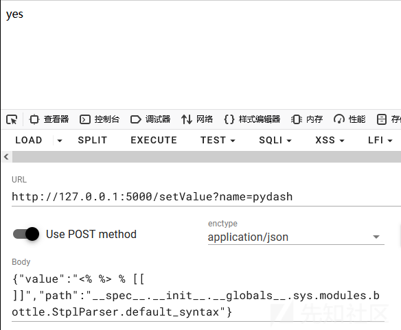

可以看到控制台污染成功：

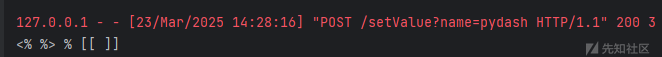

然后再进行ssti：

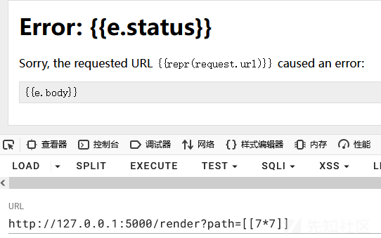

发现报错了，但是看控制台的报错：

```
File "D:\clx\app.py", line 25, in render_template
    return bottle.template(path)
  File "D:\python\python38\lib\site-packages\bottle.py", line 4493, in template
    TEMPLATES[tplid] = adapter(name=tpl, lookup=lookup, **settings)
  File "D:\python\python38\lib\site-packages\bottle.py", line 4078, in __init__
    raise TemplateError('Template %s not found.' % repr(name))
bottle.TemplateError: Template '[[7*7]]' not found.
```

大概就可以知道是因为templates()函数进入到了else语句中：

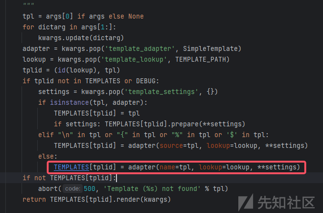

导致并没有按照我们原先的走，但是在这里，注意看elif语句，可以看到这里时调用的or，然后还存在一个$，只要传的参数有这个符号，据可以按照原先预计的走了，那么就需要如下传参：

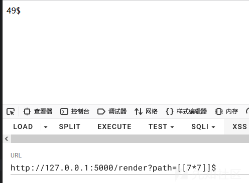

成功进行ssti ，可以利用。

再回看原先的报错，就是因为我直接将所有的值全改成只有[[ ]]，导致了匹配不均，报错KeyError。

——————

大概就是这样了，也许else语句中还可以利用，但这里就不多说了。

参考文章：

<https://tttang.com/archive/1876/#toc__got_first_request>
