# PolarCTF 春季个人挑战赛 re全解-先知社区

> **来源**: https://xz.aliyun.com/news/17383  
> **文章ID**: 17383

---

## 解码器

运行后输出一段字符：

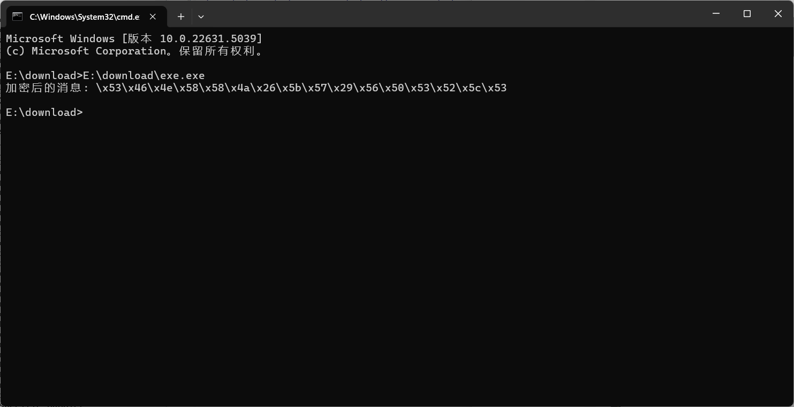

ida打开，发现就是把”SELUTE TO LEGEND“加密了

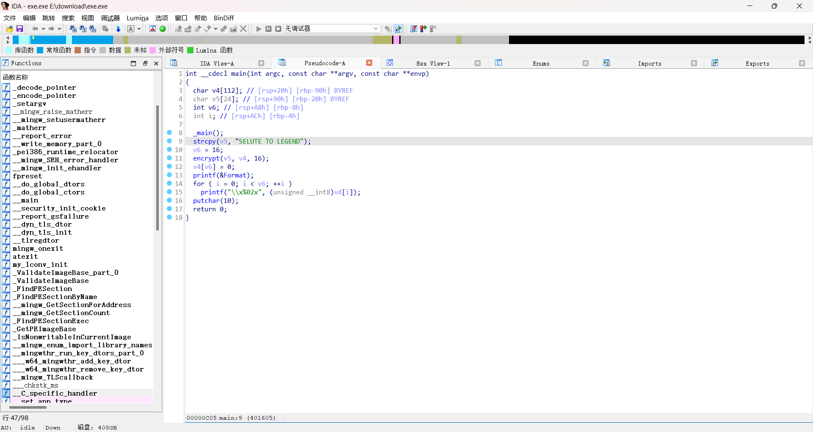

直接提交flag没用，试试md5加密后的，提交成功。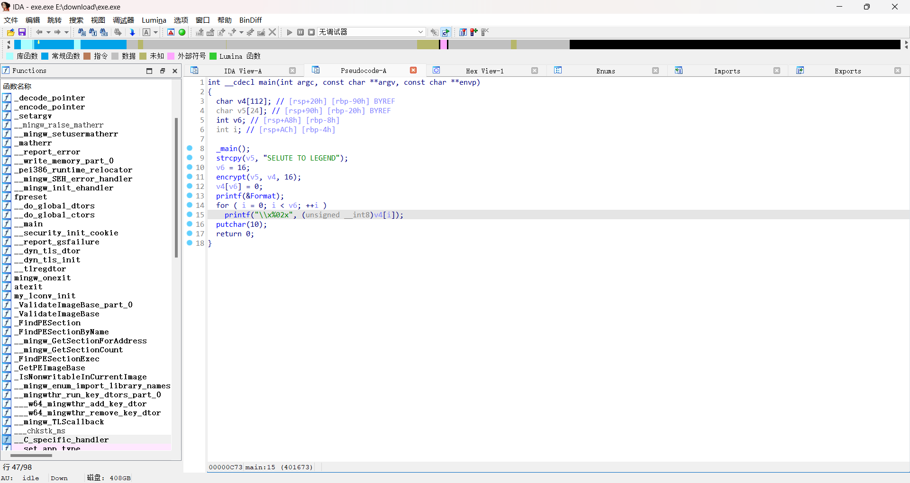

## reserve\_fib

先看hint：

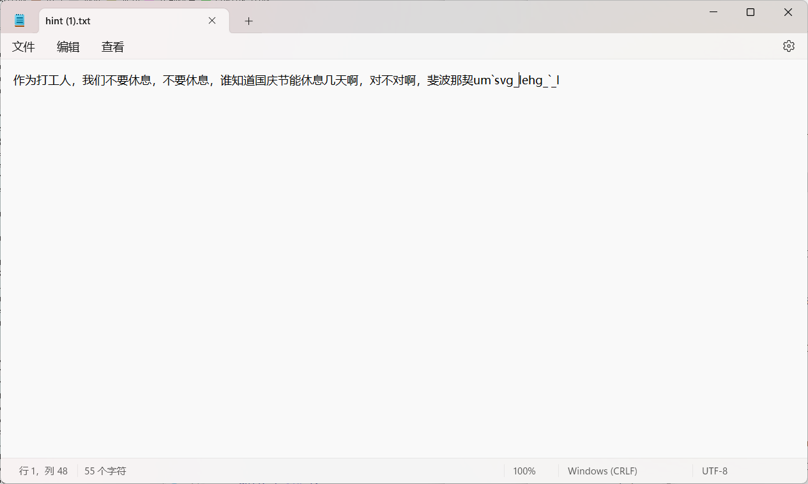

可以感受到不想加班的怨气，同时注意到斐波那契后面有一段字串，运行程序，要输入flag和一个数字，输入后将flag加密了，判断这串字符为密文。

ida打开：

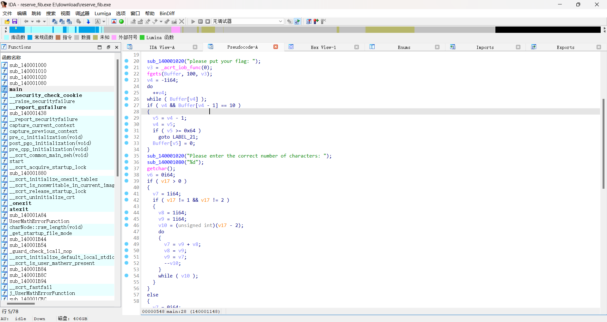

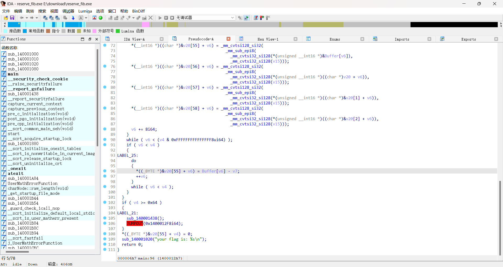

动调后发现只在\*((\_BYTE \*)&v20[55] + v6) = Buffer[v6] - v7;对明文进行了加密，直接爆破就行。

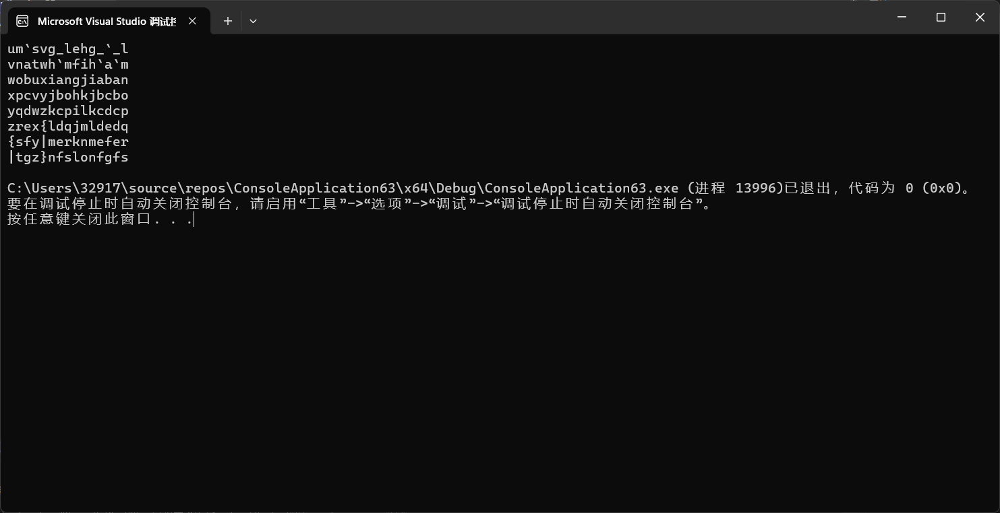

得到明文：wobuxiangjiaban，MD5加密后提交。

```
#include <iostream>

int main()
{
    char flag[] = "um`svg_lehg_`_l";
    char flagg[15];
    int a = 0;
    for (int j = 0; j <8; j++) {
        for (int i = 0; i < 15; i++) {
            flagg[i] = flag[i] + a;
            printf("%c", flagg[i]);
        }
        printf("
");
        a++;
    }
}
```

#### Snake 2025

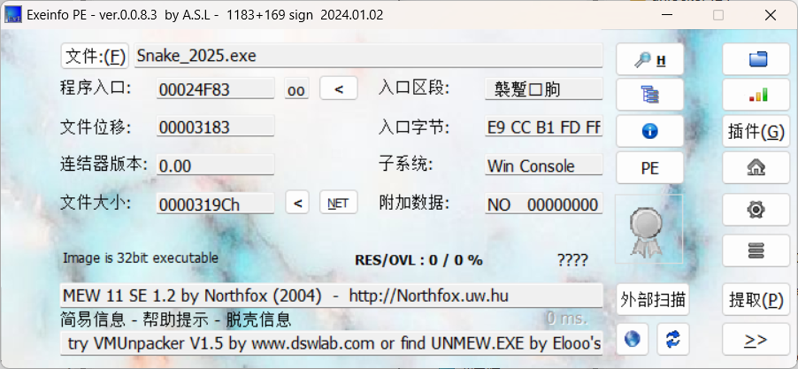

查壳发现加壳，在网上没找到脱壳机，在吾爱破解里面了解到可以用esp定律脱，用x32脱

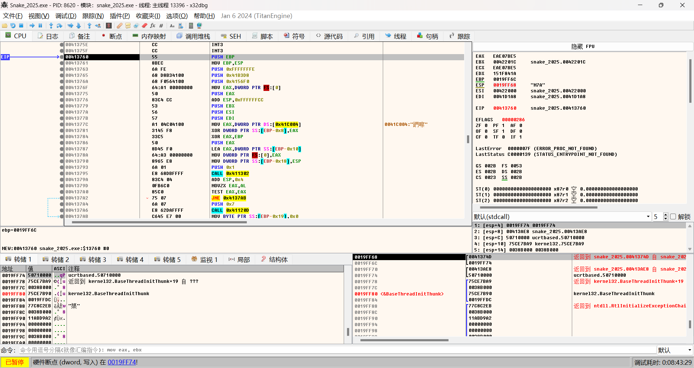

找到OEP

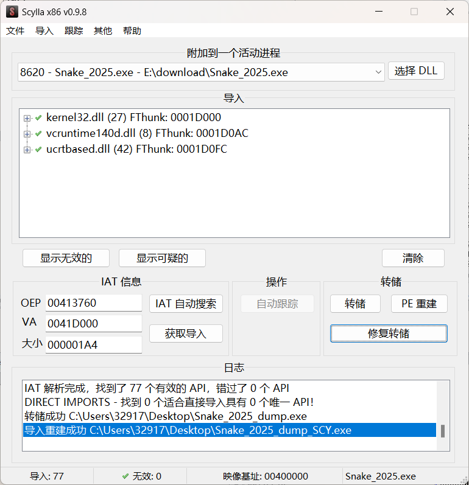

转储后修复转储

程序运行起来就是一个贪吃蛇游戏，ida打开，直接看字串，发现有flag相关的字串，分析后发现只要吃到2025分就可以拿flag

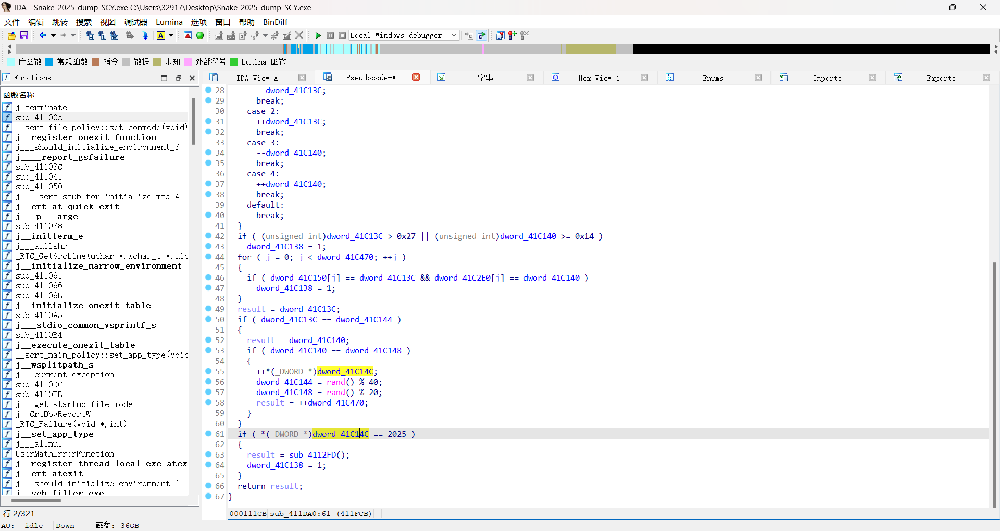

ida动调改数据：

得到flag：

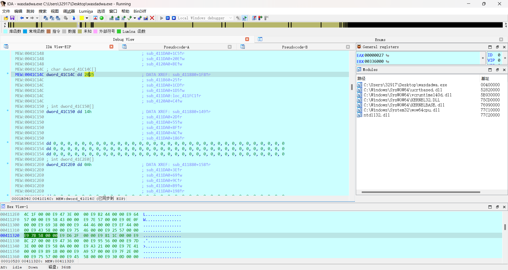

## image-20250323173408275.pngaomo

下载下来是一个解压程序，解压后给了一堆txt文件，图片还有一个程序，运行后要输入东西，拿ida打开发现是python打包的程序，直接pyinstxtractor解包：

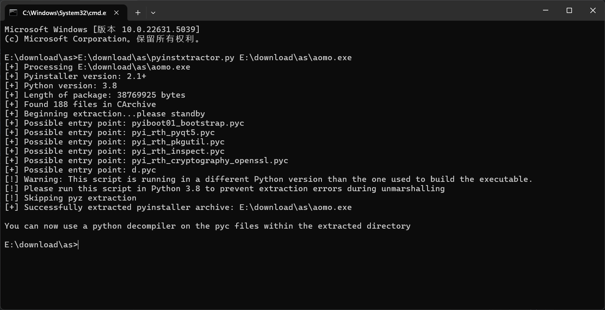

再解pyc：

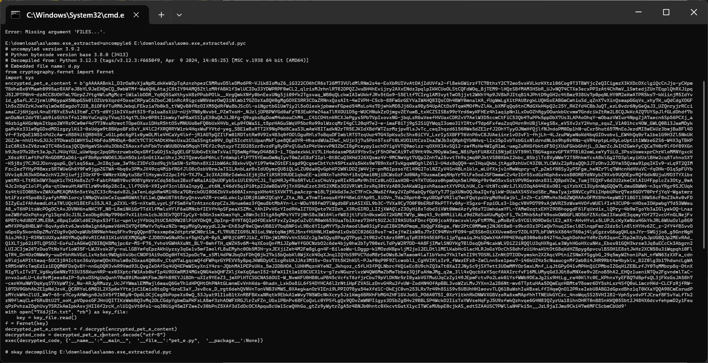

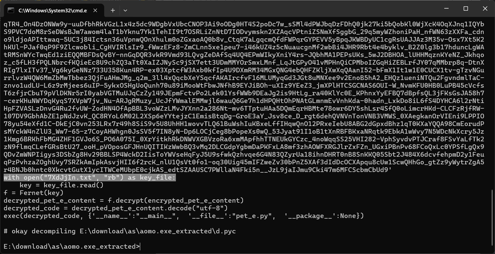

发现使用了cryptography的Fernet模块进行对称加密，使用了7XdJjIn.txt作为密钥，将程序源码加密了。

```
from cryptography.fernet import Fernet
text = b'gAAAAABnk1_D3rOa0vXjaNpRLdkKeWZpTqAznzhpezC5MRuvD5leDMo6PR-VJik8IoMuZ6_iG322CO6hCR6sT26M73VUldMlRNm2s4e-EoXbRUIVvAtDAjIdUVfa2-fl8ekGWirzfTC7BthxY2C72wo5vxKVLkrKXtz106Cog9T3TBWYjcZeQICigmzX3KXDcDXclgiQcCnJjo-yCKpm78dheBx0YMawh0995ar8XAFeJ8bYL9JeEHQeCQ_9wbWTMf-Wa6QHLAtajC8tIY94AMQ5ZtlzMRfABK1f3wlUCIDu33YDWPRPF0wCL2_qlrisMJrhnlR782DPQZJvuBH4hEvijry2AXxENdz2pqlpIKKCUoOLStCQFdWOq_BjTEM9-lHQzSBfMAM3HSbR_UJvNQ74CTXe3ecxPP3zAt4ChRmV_1SmtedjZUnTEqplQhRXJipqJ5IJPTP0h4-dzACC8UOHTmL7GrpZJYtg4WluMgMcz-1WialbDDR_Yq0Q5SaKthysK8zPPubPOlk__KrgQmkXNfy0bnEexUNgSji09fk2Tgsvaq_WB0qQLckwIAIwUkkfJRv5tGo9-S5Eltf7CIrg1AM3vytTwO5jjxt2WKhY4p9JV8kPJItqB14JPhtD9gGH2c4tBmz938Us7p0pqNLHY0M2eKwATPR5ks7-kKiinjM5IdYvid_g5afLJCJjrmlUM6ypaK5NbpGSk0lOZUrbXqrdfOoxeCRPyaC6ZboCJ01nRcA9igcsWNVderOwQ3iNlmb17GZOzXa8QK0gMgGOXESRR3COaZRNnxQzsAIt-4wIVPH-C5cb-88FmGrGEYVaIWAHQ8IQsCOh4BWY0mnalKA_fUgWmLgXitPAU8rgkLUQKGxEABGmCwhiuSd_qZnX7vXinQsmapGGqVs_xhy7K_uQdCdgXDGFlh5xZDVZrKJvmYqlmOe8Ewgdo7J28_8iOF6fTuRM6JebqLFEkzia7b0k5_tYWQvB0fRzOIXM5QdRfWu8bJScOl-oiNgrtbG1Um7iy2l5oOiexkjpbmwxFGped54MsLo4s7DjwhkMD5Jj6Oxa9By54UpACtDs9TqwKMOfMvZlAk_bXMFqQq6tnCMdGXkH4pQ2c25Y_RKZfd4CBbJuQT_ezL0vdr6NyGeQaJ3_UZQnryjrRCciamaCJj6HjgsL4nuEfBYxE5vAi3tmF_CYS-d0Yj1bIVXsdt5I5-Fp1ua8sXiU-nUjh7N0yNvvbt_PZm7xoH-_NJzljDPBPWYGd0aFz783EuKfwZ4aaTlRXOU1D5g-WUCHNukZzOjmgvZEYuwB_txKCZSISBs99rYrd6wyKFHEz4h1aqipNn1LxOoOZhRgyOOunkbUcvmw7GndcikZtRm2L8CQJkKcAZQ7UYSpJlfGLdDhdf7banDuNot2dr78lab9isGUtkTfo120bYuCngUyTVuq314gt7LSkr0P8tI1kmkyTmP8aKSSIyEX0uQAJiJBfg-Q9xgbsBgDomM4ukouChM4__C41CD4tnKRCXJePgys5Pb7VpIxovxNG-jbqLsR6uVeefHVUaxCDRZvV7AelW3D5ccmCtFiC53Qb47uPPk5ppDbX7Us3LAPAoOhqY-mObazVWIur4NpgZjA7aecn6Sp56PCXj_a46zbigAKGrWpkItbpo2WYRs9Cw0mf4d773NvaRrwotTOpeOXux1DHsR5htOSvMNUUoBeFQ0bUxK4Vb_eLp9fOWaSi_t8prHAGuSWqVP5brRo99olWzcqMrI4gCl20qH7e2-e-imaF0iTj9gS2SiQYWqqI3omo31YIRtvf7dp6FxfwuZzqO4rn9nUBjlKegSBx_eVSXv2xY2Hvnp_squZ_V1A01hcx4OW_GWLQ0Bi3JawMDykgaRvKz331w9gGDxdMD1zgzylKi3-0sUdgw9t8BKpoBFz8xY_K4lC2fXRQRRYW1rk4HqxWuFYVtd-yeg_SBE1wBxRTT2X9NqP0d8CauS3LmAwV8ITadkN2rTR5EJKIdXBdfWTZsrMzjpvRlsJvTc_ceqIhqzd6156RWe5dZE1rfJ2OhYTyyOJNmHfQjlfNJndoPM0Dp1hN-uCxr5hut657MnEoJezdMI5wEkUz3bwjBu8Fl4DVf-F3rQoE1N5InPd2cAw-xR884itQR845V_vG1Lp6c6gP1x0ymDLMleVHCaVy4lkf-jR1AG7pQZIlFm01RDTstRw9V92x4B3q0fODlOguRHls7oBquDFImblRTS7zqUur47G43pKsuScShx0iCYV_LxrIySXBFF76VnP6vC8JUAeiinr1vD3vF1-fhjLh-4LJzuPWywNoKd4bqGIOvobvi_EW4hQq0rTa1be1G9H3Zl5NkUK2GZJe-nhU14vGJUJc37DkwsDiWHYSuI4bFdu5MHOqA-0dCt7CT3C4ADtKHecUxu2COaSSngte09V_OgE5IcdtUlUpanMkFlpe8QEaOYR-HhavdWUaZDeC_kUjr3j7u5Prn5TssFt0LKUO1UtCzoIkaZWJb3sQRphQYbNHvq-l1x25pIvb7sbGixNldrndNLbs9hp9rRNz-qVR4rptpLnOyLoUptit1WWzeGZS6-W4X3gTBKP1zC6Ri5xZV6zvw2TC48kSsajQCQbHgmVSkvKu3ObbZ5AoxxfuhFbk7rxWUUBOVm5MqqhTPEf2c9qtuyrTZ3D28Szr8vzdFgRyDPxQlGu5zP4rUevvPN3ZbCI8gPceypy1uchOYigVVTQ9molzz-qOXHX3AvSQ12-zwfMsHe4WIgR1mL-uwgZuRKGfbktdF5OjXUuFGkbGhHjL_OJmrZcJkIHZGwkfyCQCa7H0r9lfOf89XGnb9JbzD7k28rt3eJpJlJ4UqYGU_uUwHpgc2pqGRnzruwbxOqxGRfIuGOjSs2gQELGFSUbGvEtXmTxVaiTQ5mNgfHwyD4AB63-1_TOpdezkkLVi7L1Ho6dasmPBAX9YbvSvjF5hDPmCAi9TvE9Ht49kJ9OyWaSmq_N8iPptFUABXZi5NjpEiVT59HlTBG4agozvGF7A778l02omLxwYy7iLO_3PssUowexprChrKloMMNYgxcK_X6szRXlmftPsFRnGD8M2aD6i-grF8bRprKWO6SJGxH5OzinSnGt1XacUhxjJ42TQzwvGoP6hLcTr6mkplflPT75YEmuOmNqIyvT0mZzE8zF2Ipl-BtBCuQ3KHd326XQsmz4V-9MCNwVgt7UQp2Znh7a25vvtTh9sjmq0PJktVS80XbkI2kbc_0SbjlTc8VyWWe72T5RhkmYcxA8klGg2TD3plwyiKUzlBHw2cq8TxhnoSX7-K5j8sj7CJH2JOxnvgupG_QrlsqS6as_JnI8qjuw_3w76cZ3DfcDzd9qjhSmSN-SrRbhx8Xi21bW6Ac3BxkvVQvYi97w4wZGtEFisgd9QcgoeCbtYch45PtxaVq5kKs9m7B9nXsf3vKgqwWDghlZ6l2-U4dx8qQQ4-enIHquQkbLjtAgp9zhUxC43Z0LYLCWUxZ2pRzaQQh2JTzOhv2JOYw35Qzma91pqIKIv9-xLq9T2QIMFzcZez7YHyP98mxz5RTWUeGh6Y9Fw9jgpZGTWA-4bq6v3PMxJX49cq4MibfRGfJlO8cOsbV0rwJaTSILAnbLarBvIdUOymzQU8iQLvLZU0daKQvGphKP2WNlDDZjW4Vjr-pnM6IpzosYEl49G2TolNZZyV4Sn4BLn1kln_wLUfXxjv1nMwWqpry-q7_pZmSf08Sy2yPSFgw_heNZr7lq7WHcnHdHVuVC-fqOHk-D1qSpFUYbUVviq0J63kKDAw2chV2JHjiufjjIOrXF9-VWNrrXGNytuSBrT1HsymvX22pcIfU-7XJ7x_3c3XA28BrIdwko1Ej6jDzTiRSR39UDE1qbuEE-aiKNXnTuhPKhfi8sQAwi0NjiBCWsGzFJd0NAyTOusmaEwqRHpYr7GlFe5odJSFDmmwCZv4rIGf5SxdGzHGph6xvosB0DRB7dNVybZ9Xvb9UQOEpvRQf6dkNUjuU9D3TYXibxymtMX-LTtREkOWY3qqK1cTH1Ho8sZc7-FabtPAW8Y0vc9O8YgHrrxCdq565us2BxcFmRaiAiQkUDFybSxiUlE9UYCJi_TqU4RJyfRo5RTvLCxsC4uVzyeRIxRSoMr9h3tCz0LnO2asKOB-c4TKTUGozo0hpmOqn5mlP0Kgf9r9wO5xvSstVPVRGerdnz831JQ8pdVZw_TumjTEQXFv6d2U2zkeCKlAIUfFpplcZs3Oty_0wA4Jc2nbgC1olPly0a-qtUweuHtAWTElrW9v06p28cIs_llf7GV6-X9Iydf3cnlBXaInpyQ__dt6N_t46dV5qiPi0tp22dwBDaV9jTnXGHuEzot3HS2XMEo3O2VRlWt3rxRq30tVzAB9JoAKaW2gzxhRaoaotXYVPULhUK_Cs-UtNTcsWr1JlXUIOqA644E6xO01-qiYzbXC13Uy6nWgGQQw7LdmuGBWW6-n3qsYRgr9SJCUqkXs4ttUIO0B5vvZWAXuMEAQMA5n5xtVqZC33cRnadv82LjaTenLdgkRw4M14Bca7GRrckOUI0O6ZbVXv660AIxnngsKHo4tSXVKT7LpaAczp-m18L7jKkGd3eJcC7FnCkJNu6ZfAwy2VZpP6abQyfGpYy7J7jpXUNoOQJbaIQxfglkW-DUaAXS4SVsdSBr_MmaTyajrBNVCcyPXiIHpbUPkrQ7ez6GOY70PrfjYqV-WgatmrzbtiFzzz4SpoBbIyafyhMNh1orcylNNpQVaUeCeIqumRGWAtTdl1wLQWwU8T6t8ryQnsvu4ZR-rcwGLokc1yiDBj0iWKZQCqhY_Zta_R6_e7nmT1eoqu6Y9f4BeLGYAp9S_5iOVn_7da28prh0-kyU8OpFVRIlq7wcFQqtpsUrgMd9oEwjbl_InZh-CzSMMxHx5kGZWQRAAvOFMX84n4epW82TiBGT130WS6cF0oZ3kAv0vFD5IZyEuIfAhAemdLdtaTNlUQcH18EtFs35JL43_pZXXL-9S-nXtw8LvyrLjFfSm8fwTrAtznc6rpCZsJ6nuw6mz3fQmu8btMbAYn-Lc-WDuY08fmD7lWgdbBFzbASIXEL9b3C-7VXa9Cy7O0F0bERbFRkPTTfv0Ay-XSgxo-FzpiOLs3-1bgcV0VPD799xAjWVRZ5zWxw4VOfvWUElfIx43CUP0-nHOseIOKpwbgY7d53WWeuA8_vT6HPitsWcPOgOCtAvJDVNH6naNKCYF_N8-L8miNKiGr7TdXlfMmlxHYlF6aGMNcbfIEVfh4pSFpeaXSZMn_YAhIPvVGcYIodRHaIZTDXQoto7KIDzh_X3RcGIRD_LIZjXWAQlzZ3OyHi8sTdbd3iVWt0WmdAzfy96s7IUmhdamYFL-YAMwOzqtxEHYZ9O8hopgdF6lFqUrdix_lQPry-4b9mTgoYb3aIGlyekOQ-LnazseZWBfoDxPqhxyfg1Sqrd3cJ15LIeoDbg0UNp7996n7vX1itnk1cbJ63Ek7QDT2yCyX-b5Gn3swXbmsYqh_x8Wn3c3ItgA5qMPsYVTVjNhS8u3W164lxfW83jtlFU3n0kswGGT2KGMETW7p_Wmq43_9c0RMiilALz9dZRdSuKUuMgQcFi_7kIMhb5AsFK9ookOWBGFLND5GfZ5XcGmI3XwuKE3qqmyYOf272vcUfnGLNejFv6P87c4dUBD7JMLEBA_dBpqIuGKld6E2hpx53fTic-upnlvjYfbUq3tUC5AO9W28lPiKYDkQ9_DpInp-8Y9T6QIpOfDEsktFrxZy2epCuZvDlM0mK653UuaTbiXnez73Hft5UZJc3I9ASU5xFDncfQO0jcoA9zwcxvklnyFtM7Mq_pMoBrEv5YCGl9D9DeGclE2_mXt-AHvHYvLx5LUPJLcKyXwNzu4GkYkJRL6WUuOzlp8G9wMfXPPp8HBLWf-8qvAydktv6Jwvb0w1gh6ApmeV6H4IK7Qf8MwYv7q4azNZb-mgyMVgOywyydL2Jw-Eh83qF0eCQwvUBB1V7bqBNPivL9Bc6YIipMYY7pJrAwodlBw03iyFzuEIBKIMdPmqm_XbQgFX6kgw_fWr2PtC0MMwmj2NJ6tBw8-s9kxO3z3P1wQk7nuq2Secl0ZlnqpFmrJ2dz5cln8ltHYHv6ZC_z-2fY4fBSvvOuGpsDy5konbDpZMuYZUg9xQdOvpWUb5N9Neh4eq5Fhv9rgQQpnB7esxmp6w2dtptrWCN0ri1m_fL7RUBZIG95LN3ioL9WztqNmjMSJ5nxfHUHNLHIm0nd1xOxGCC026G1RvoT-wIejYwZisW8sJ7rIC94MVnfFO94-pE5S6nOiXXUvem8nr7ZOL437LbFUWtkX864n760aj4lyEgzzvG6ugQKLqsJYr-SWGjjo6_g5GnrNgH5isJ4h3j-R3RW1UUXyaA0DYMuQq0VvRICA631K1oVUEXMQGgN-ZJD8OVwGNuR5csf5gHZyR-0y5_WPBjC6M7J1bZ_4TDnjW1MRVvVnSSGZc2g3mSQyq8PayQ7PypL2t9B2vCt6rz5RMlqTpR39545E6PSc1jp7goaiqJHsSQwkX4AfPP4E9dg0300e0z842T4oJughDohkrYdRrZb92qonCJSp2m3UybJpUGBQJp2MEvRAd_Q1XLTjp62i9TLQPSOZ-EofuZsAGKwQZ0IBQKBMqjpc6r-MS-F76_YvhoVGWHAXuNt_BL7-0whfTH_qWZK5v6M-4qXEosQnfMiJZpNwYfGOCNzbO2c6de4bjy0hw2bTy700erLTdPyW2R7DD-4A8FjIMwlSNOYKg7BlDsqQbPNcakWLVDiZ2iRQQlU3qHXRgaLe3WyhHGoHXcuNKs_Ebox01GQH3krsw3Jq8uECcCk3Abgrn2LUIJC3jm267zDuo7tNsYuf1oW35F-LWJXvsk2Fy-nuLlGBYwfqEpzAKhUyzsy3qGe1v5mfImolfL8uEMyhc0Ob5M3H-yxJEXjiZeh4M2Fm8gLgn4F-BilaoWu-LDggp-k1MOzdKBpvljM2jo12ELDtl1MElKabHcGlacHLRJoGsYOcChS8dhfzUiHnaKUtOtG8qKdHZBpyg6pvculBSOH1E8stJkHz2XCN58u3iWqpqhi0FlqTR4_On4DzONWw9y-uuDfbhRkVGzL1x4z5dc9WDgbVxUbcCNOP3Ai9oODg0HT4S2poDc7w_sSMl4dPWJbqDzFDhQ0jk27ki5bQobKl0WjXcK4OqXJnq1IQYbS9PVC7doM8rSeDWsBJm7awom4laT1bYknu7Yk1TehII9t7OSRLiZnNtD7IODvymskn2XZAqcVPtniZSNmXfSggbG_29q5myWZhoniPaH_nfWN63zXXFa_cdno9ldjoAPIttwaq-5UC3j84Ictsn36uVpnwQOnXhulm0oZGxaoAQ0b8v_CtqK7aLgqcmQfdFWPqrGYPEVV5yBpqJKWBDyUC1cgRsUAJJAz3M35v-Osx7Xt5K2hKUl-PJaf0qP9F9Zlcwobli_CgHVIRlsIr9_fWwzEFz8-ZmCLnn5xe1peu7-i46kUZ4z5cNuaucgnMf2wbBi4JHR9Rbt4e4byklv_B2Z0lg3b17hduncLgWAtRMSnWYcTwqEd1ziEQQMBFDsQvBY-nnGqDQR3vkR9Vmd93LQvgZeDAfSq4UQ4EPmWIkyXniY4rs-JQbhMA1PEPsUKs_5wJ2DBHOA_lUHHMqznKYeNZ_Jkhqoz_c5fLH3fPQLNbrcfKQieEc8U9chZQ3aTt0XaIZJNySc9jSX7ett3UDmMMYOrSmxLMnf_LqJtGPyO41vMPHnQiCPMboIZGqHiZEBLrfJY07qMMbrp8q-DtnXRIg7lxITv37_Vg6kyGeNNz733U358Kun4RP-ex03XptcfW3Axb0kfIp4U9DXmRM34MGxQNG4ebQHFZKljXwXqQAanI52-bFmX1It1w1E0CUCX1tv-gTzvNGurrlvzW4QW6MmZbMwTbbez3QjFuAHmJMg_q2m_3ll4xQqcbXeYSqcfAKAIrcfvF16MLUMyqGd3JGt8uMNXee9v2EnoB5hA2_EHQz1ueniNTQu2FgvndmlTaC-znvo1udLU-L6z9rMjees6uIP-5ykxOSHgUoQunh70u89iMooWtFbwJNfhB9EYJiBOh-uXIz9YEeZ3_jmXPlHTCSGCNAS6OUI-W_NvmKFU0HB0LuPB45cVcfsT6zfjrCbuT9pVlDKNr5rI0yabVGTMuUJqCzZy149JEpmFctvPo2Lek01YsfWWb9DEaJg2is9HtLg_ra40KlYc0E_KPhnxYyEFBQ7dBpfsQL3jFKsGsJA58h7-cerKHuNWYDqKyqS7XVpW7jv_Nu-ARJgRMuzy_UcJfYWmalEMMwjl6wauQ6Ge7h1dHPQHtOhPNAtGLmnmEvVnhKda-0hadn_LxkDo8iL6fS4DYHCA6l2rNtiHpFZVASLzDnvG4Ru2fvUW-ZodHN4OfApBBL3voWZzLMvJYXnn2a286Nt-mv6TTptuHAa5DQmEqrHBMte78owr6DY5shLsr4SfQ0oLimcrHKd-CLCFzRjfRW-107DV9GbhAbZE1pNdJzvK_QC8RYoL6M02L2XSp6eYYtejzC1EmisBtqDg-GroE3aY_Jsv8ce_D_rgt6dehQVNVnTonVNB3VMWS_0XAegkanOrVIEni9LPPIO78yu54eXfd1C-DkEjC0vn253LRx7r49h8SiS9v5U8UhHH1wovvTLQ61BuWshIuKBxeLffIHqwQnO12PRxeIebU8ABG2dGpxdBhz1qT0KXaYQQA98CmEorudPsMYckW4nZlU3_Ww7-65-z7CoyAHWhgn0JsSV5f7IN8yN-Dp6LOCjCeg8bPopeXs0wQ_53Jyat91I1oB1tXnRBFBKxaNRqtk9EbkA1wWvy7N5WDcNkXcry5Jz1Kmg6BRKhFbMG4ZHF1GVJo6S_PO6A075I_0XrYitkhRkDNWVXGBVzoRa6xmMApfhhTTNEUkGYCzc_4noWqqSS25VHI282-VphSyvdvPTJCraf8FSvYaLfTk2zN9flmqCLefGRsBtU27_ooH_pVOposGFJHnUQITIKzWwbBQ3vMq2DLCGdpYgbmDaPKFxLA8mf3zhAOWFXRGJlrZxFZn_UGxiPBnPv68FCoQxLc0YPSfLgQx9QDvZmWNPIigys3DSbZg8Hv29BBLSP4WckD2IisToYWVseHqFyJ5U9sfwkQzhvqe6G4N83QZyrUa18ihnDHRT0nB8SnKKQ05Sbt2J484X6dcvfehpmD2y1FeuqPzPvhzaZOghUvy7SRZkAmIpkAsvjHII6f2rcK_nlU1QsVt0fo1-oq30Uig45mIFZweZv30bPnZ5XAf3dIdDcOCXApqu8cUw1ScwQHhGo_gtZz9yWytrZgA5r4BNJb0hntc0XkcvtGutX1ycITWCeMUbpE0cjkAS_edtSZAAUSC7PWllaN4Fki5n__JzL9jaIJmu9Cki47m6MFCScbmCbUd9'
#进行加密

with open('E:\download\as\7XdJjIn.txt', "rb") as key_file:
    key = key_file.read()
f = Fernet(key)
decrypted_text = f.decrypt(text)
print(decrypted_text)
```

解密后得到了桌宠的源码:

```
from PyQt5.QtGui import QPixmap, QPainter, QImage
from PyQt5.QtCore import Qt, QTimer, QPoint
from PyQt5.QtWidgets import QWidget, QLabel, QApplication, QLineEdit, QPushButton, QVBoxLayout
import os
import random
import base64
import hashlib

class DesktopPet(QWidget):
    tool_name = '桌面宠物'

    def __init__(self, parent=None, **kwargs):
        super(DesktopPet, self).__init__(parent)
        self.initUI()

    def initUI(self):
        self.setWindowFlags(Qt.FramelessWindowHint | Qt.WindowStaysOnTopHint | Qt.SubWindow)
        self.setAttribute(Qt.WA_TranslucentBackground, True)
        self.setAutoFillBackground(False)
        self.resize(300, 300)

        self.actions = {
            'shetou': ['aomo_6.png', 'aomo_5.png', 'aomo_4.png', 'aomo_3.png', 'aomo_2.png', 'aomo_1.png', 
                      'aomo_1.png']*10 + ['aomo_2.png', 'aomo_3.png', 'aomo_4.png', 'aomo_5.png', 'aomo_6.png'],
            'hello': ['aomo_11.png', 'aomo_12.png', 'aomo_13.png', 'aomo_14.png', 'aomo_15.png', 'aomo_16.png',
                     'aomo_17.png', 'aomo_18.png', 'aomo_19.png', 'aomo_20.png', 'aomo_21.png', 'aomo_22.png',
                     'aomo_23.png', 'aomo_24.png', 'aomo_25.png', 'aomo_26.png', 'aomo_27.png', 'aomo_28.png',
                     'aomo_29.png', 'aomo_30.png', 'aomo_31.png', 'aomo_32.png', 'aomo_33.png', 'aomo_34.png',
                     'aomo_35.png', 'aomo_36.png', 'aomo_37.png', 'aomo_38.png', 'aomo_16.png', 'aomo_15.png',
                     'aomo_14.png', 'aomo_13.png', 'aomo_12.png', 'aomo_11.png'],
            'ele': ['aomo_114.png', 'aomo_115.png', 'aomo_116.png', 'aomo_117.png', 'aomo_118.png',
                   'aomo_119.png', 'aomo_120.png', 'aomo_121.png', 'aomo_122.png', 'aomo_122.png', 'aomo_123.png',
                   'aomo_124.png', 'aomo_125.png', 'aomo_126.png', 'aomo_127.png', 'aomo_128.png', 'aomo_129.png',
                   'aomo_130.png', 'aomo_131.png', 'aomo_132.png', 'aomo_133.png', 'aomo_134.png', 'aomo_135.png',
                   'aomo_136.png', 'aomo_137.png', 'aomo_138.png', 'aomo_139.png', 'aomo_140.png', 'aomo_141.png',
                   'aomo_142.png', 'aomo_143.png', 'aomo_144.png', 'aomo_145.png', 'aomo_146.png', 'aomo_147.png',
                   'aomo_148.png', 'aomo_149.png', 'aomo_150.png', 'aomo_151.png', 'aomo_151.png', 'aomo_153.png',
                   'aomo_154.png', 'aomo_155.png', 'aomo_156.png', 'aomo_157.png'],
            'flag': ['aomo_drag_start_1.png', 'aomo_drag_start_2.png', 'aomo_drag_start_3.png',
                    'aomo_drag_start_4.png', 'aomo_drag_start_5.png', 'aomo_drag_start_6.png',
                    'aomo_drag_start_7.png', 'aomo_drag_start_8.png', 'aomo_drag_start_9.png',
                    'aomo_drag_start_10.png', "aomo_drop_7.png", "aomo_drop_8.png", "aomo_drop_9.png",
                    "aomo_drop_1.png", "aomo_drop_2.png", "aomo_drop_10.png", "aomo_drop_11.png",
                    "aomo_drop_12.png", "aomo_drop_13.png", "aomo_drop_14.png", "aomo_drop_15.png",
                    "aomo_drop_16.png", "aomo_drop_4.png", "aomo_drop_5.png", "aomo_drop_6.png"]
        }
        self.action_keys = list(self.actions.keys())
        self.random_actions = ['shetou', 'hello', 'ele']
        self.pet_images = self.loadPetImages()

        self.image_label = QLabel(self)
        self.initImage()

        self.chat_input = QLineEdit(self)
        self.chat_input.setFixedWidth(350)
        self.chat_button = QPushButton("发送", self)
        self.chat_button.setFixedWidth(350)
        self.chat_button.clicked.connect(self.handleChat)

        self.layout = QVBoxLayout()
        self.layout.addWidget(self.image_label)
        self.layout.addWidget(self.chat_input)
        self.layout.addWidget(self.chat_button)
        self.setLayout(self.layout)

        self.timer = QTimer(self)
        self.timer.timeout.connect(self.updateImage)
        self.action_timer = QTimer(self)
        self.action_timer.timeout.connect(self.switchAction)
        self.action_timer.start(8000)

    def initImage(self):
        image_path = os.path.join("images", 'aomo_40.png')
        image = self.loadImage(image_path)
        if image:
            self.image_label.setPixmap(QPixmap.fromImage(image))

    def loadImage(self, imagepath):
        image = QImage()
        if not image.load(imagepath):
            print(f"无法加载图像: {imagepath}")
            return None
        return image

    def loadPetImages(self):
        pet_images = {}
        for action, frames in self.actions.items():
            pet_images[action] = [self.loadImage(os.path.join("images", frame)) for frame in frames]
        return pet_images

    def updateImage(self):
        action_frames = self.pet_images[self.action_keys[self.current_action]]
        self.index += 1
        if self.index < len(action_frames):
            self.image_label.setPixmap(QPixmap.fromImage(action_frames[self.index]))
        else:
            self.initImage()
            self.timer.stop()

    def switchAction(self):
        self.current_action = self.action_keys.index(random.choice(self.random_actions))
        self.index = 0
        self.updateImage()
        self.timer.start(50)

    def handleChat(self):
        user_message = self.chat_input.text()
        if user_message == "糖果":
            self.current_action = self.action_keys.index('flag')
            self.index = 0
            self.updateImage()
            self.timer.start(50)
            self.chat_input.clear()
            encoded_candy = base64.b64encode('糖果'.encode())
            md5_hash = hashlib.md5(encoded_candy).hexdigest()
            encrypted_flag = f"flag{{{md5_hash}}}"
            self.chat_input.setPlaceholderText(encrypted_flag)
        else:
            responses = ["奥姆？", "奥姆奥姆。", "奥姆！", "奥？姆？", 
                        "奥姆，奥姆奥姆，奥姆，奥姆奥姆。", "flagflagflagflagflagflag"]
            pet_response = random.choice(responses)
            self.chat_input.clear()
            self.chat_input.setPlaceholderText(pet_response)

    def mousePressEvent(self, event):
        if event.button() == Qt.LeftButton:
            self.mouse_dragging = True
            self.drag_position = event.globalPos() - self.frameGeometry().topLeft()
            event.accept()

    def mouseMoveEvent(self, event):
        if self.mouse_dragging:
            self.move(event.globalPos() - self.drag_position)
            event.accept()

    def mouseReleaseEvent(self, event):
        if event.button() == Qt.LeftButton:
            self.mouse_dragging = False
            event.accept()

    # Initialize attributes
    def __getattr__(self, name):
        if name == 'current_action':
            return 0
        if name == 'index':
            return 0
        if name == 'mouse_dragging':
            return False
        if name == 'drag_position':
            return QPoint()
        raise AttributeError(f"'{self.__class__.__name__}' object has no attribute '{name}'")

if __name__ == '__main__':
    import sys
    app = QApplication(sys.argv)
    pet = DesktopPet()
    pet.show()
    sys.exit(app.exec_())
```

分析可得，当我们输入“糖果”的时候会输出flag。

flag:flag{e013db5722b4f71a8d374a2cbe6b8d9d}

#### ReverseGame

安卓逆向，用雷电模拟器。

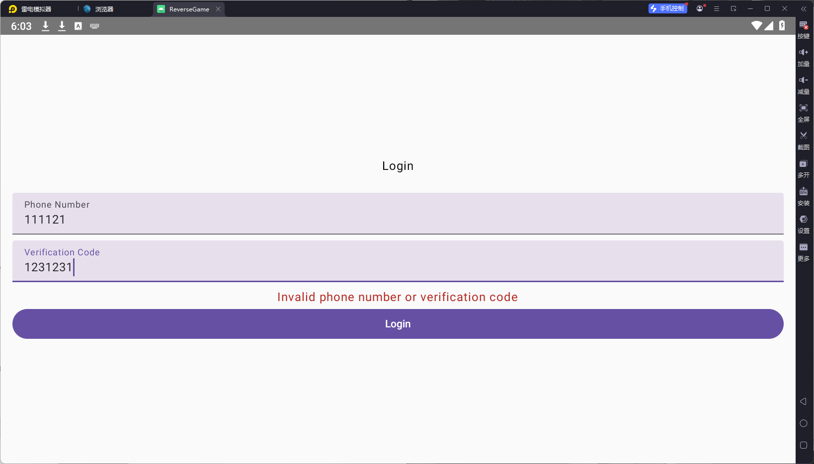

随便输点东西，报错了，拿mt管理器搜一下字串

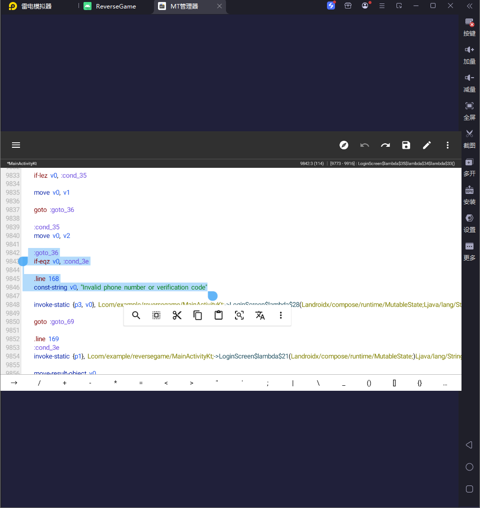

发现存在判断，跳转，在下面还发现了登录成功的字串，故将判断和跳转删掉，重新安装，直接点击登录：

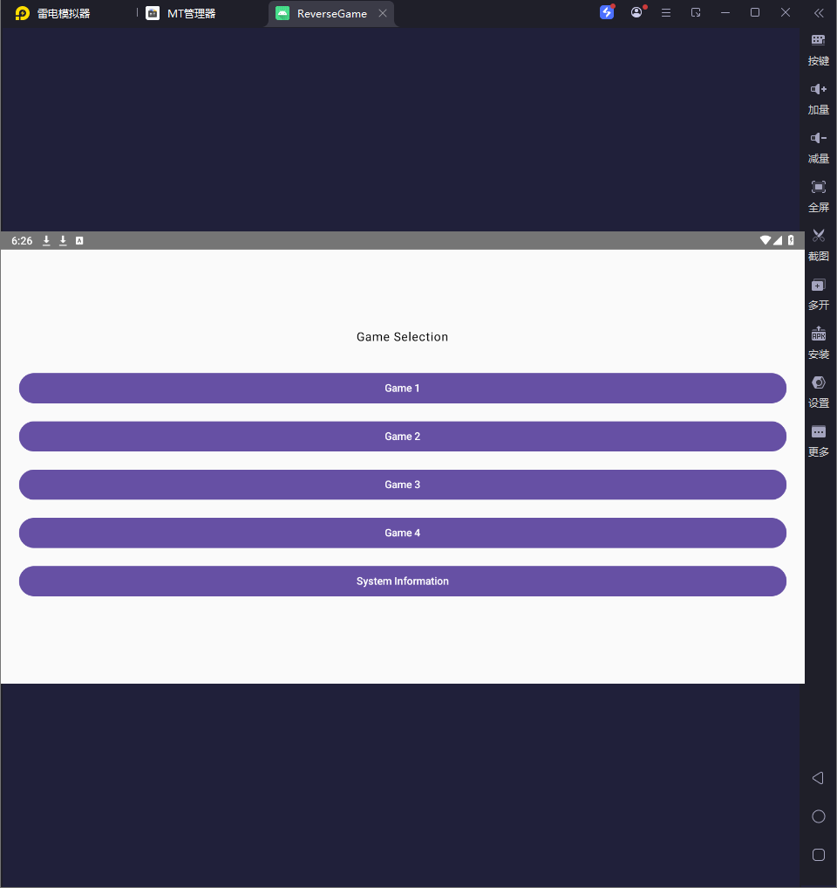

进入到了游戏选择界面

用jadx打开：


可以看到四个MainActivity，在MainActivityKt里面发现有flag的痕迹

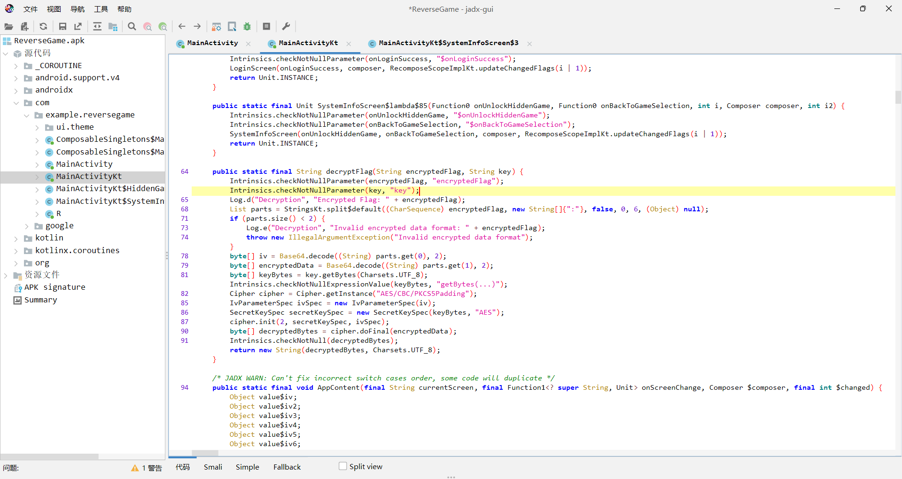

还有一个hiddengame值得关注

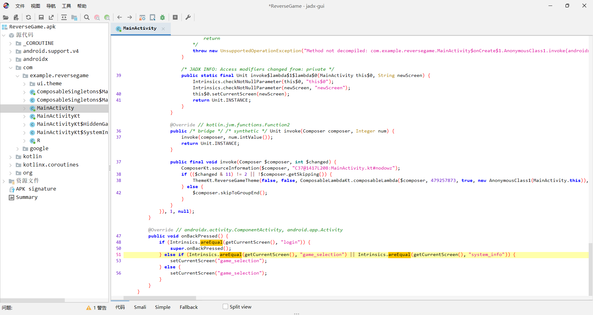

搜索有关hiddengame的内容，找到一个判断


重点看

```
if (SystemInfoScreen$lambda$72(clickCount$delegate) >= 10 && !SystemInfoScreen$lambda$75(isHiddenGameUnlocked$delegate)) {
            SystemInfoScreen$lambda$76(isHiddenGameUnlocked$delegate, true);
            SystemInfoScreen$lambda$79(showDialog$delegate, true);
            onUnlockHiddenGame.invoke();
        }

```

这段代码

大概意思是点击系统信息10次后解锁hiddengame，点击后的确解锁了hiddengame

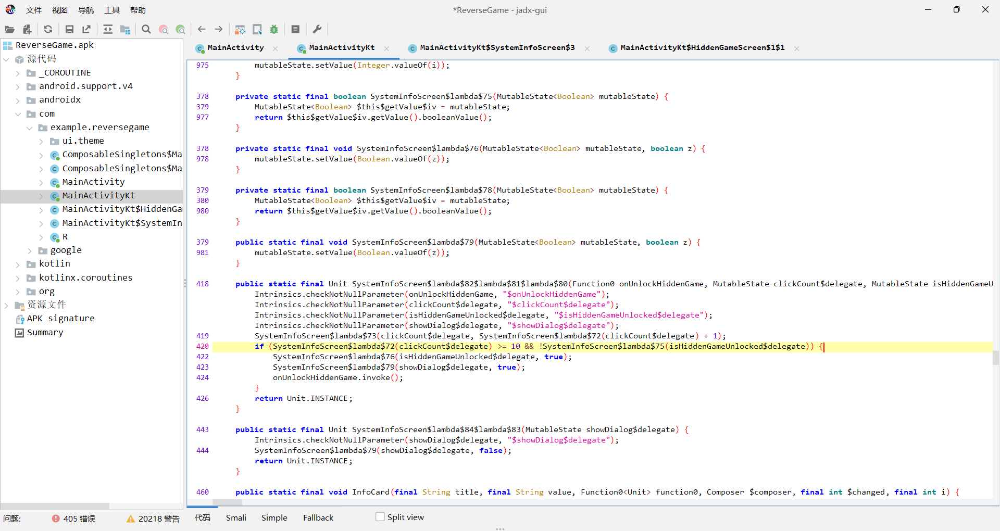

进入后发现要点击按钮的次数达到2025.2025

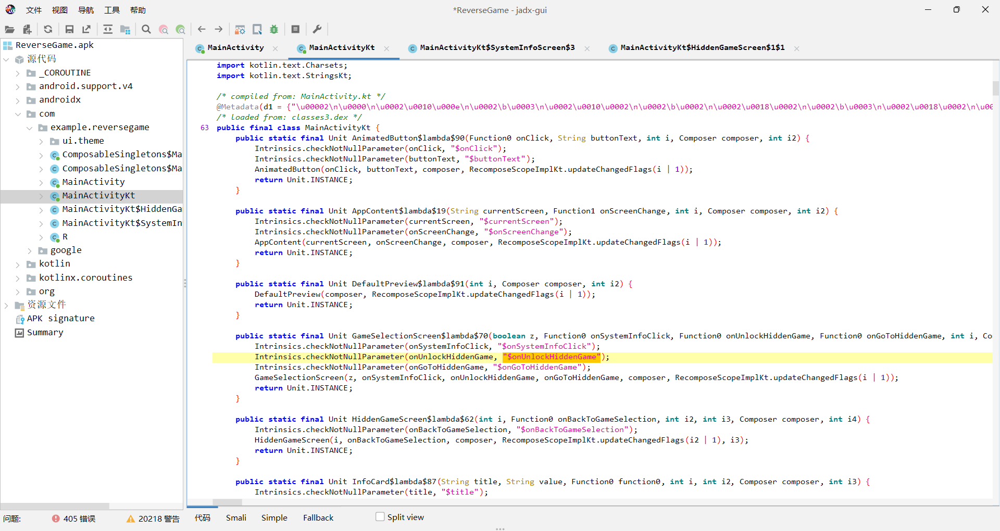


显然不可能做到，所以拿mt改一下判断逻辑

得到flag的密钥

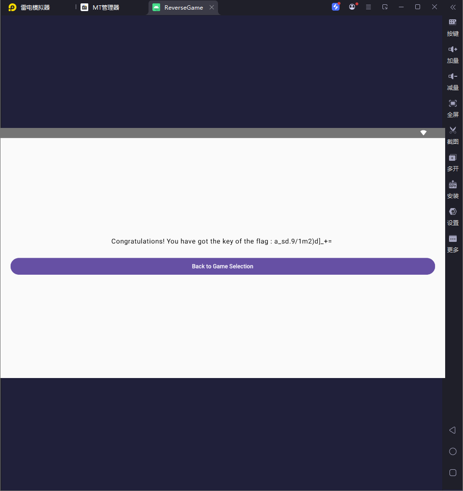

然后我们找到flag解密的逻辑那里

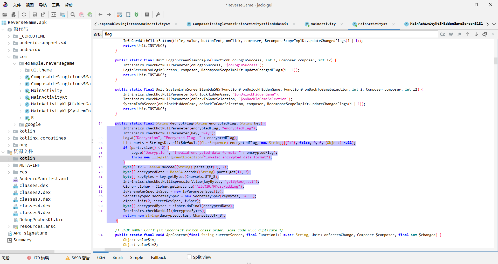

可以发现，对传入的密文做了一个分割处理，将：前面的作为iv，后面的作为密文

密文

```
ii5pccS1mAt2A0kpVV64zA==:C8Vw3Xoy7DYBbhHawxOVqIeqmZvSRchgcrvZygwEgDIS99DDCeXYFqysLSLJ4g3Q
```

丢给在线网站解一下：

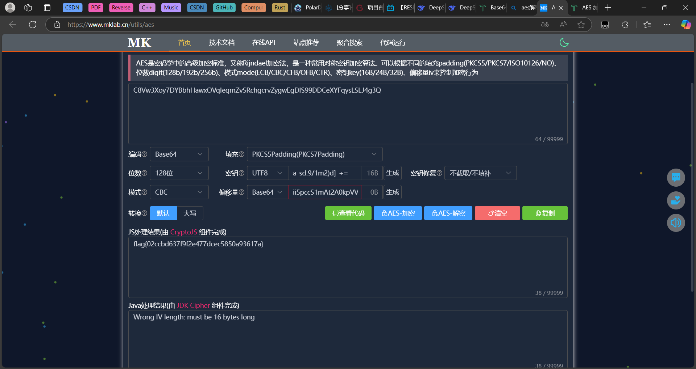

得到flag：flag{02ccbd637f9f2e477dcec5850a93617a}

#### openwrt

拿binwalk提取一下，进入/lib/apk/packages文件夹，查看list文件，发现有一个自定义的包的路径，把那个脚本提取到与文件相同的路径下，运行，得到flag：flag{38f15cee4cdb204de5ca6a9373b73603}
