# 近期使用法国内政部车辆信息文件为诱饵的攻击事件分析-先知社区

> **来源**: https://xz.aliyun.com/news/17389  
> **文章ID**: 17389

---

#### 概述

近日，笔者发现一起以法国内政部出具的车辆信息文件为诱饵的恶意活动，该攻击利用网络钓鱼手段，诱导受害者执行恶意批处理脚本，进而部署隐秘的远控木马以实现对目标系统的长期控制。

#### 样本信息

|  |  |
| --- | --- |
| **文件名** | **Hash** |
| CE-209-DZ.rar | e784921ed2316b55e46d88df40833452ce1b6a9340f13f408c5383e9590561e2 |
| Vehicule.pdf.lnk | caecc8a151e9cd3f5e09cd11c35e03f376b949c7dee4d19f409a98835b5709ec |
| paris.bat | 06d3b0cf749a63b5816295c170a9332879196a46541612637cd05d94172cabe6 |

##### 样本分析

###### LNK文件

LNK文件的主要功能是打开PDF，并运行BAT文件

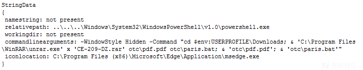

PDF文件内容如下：

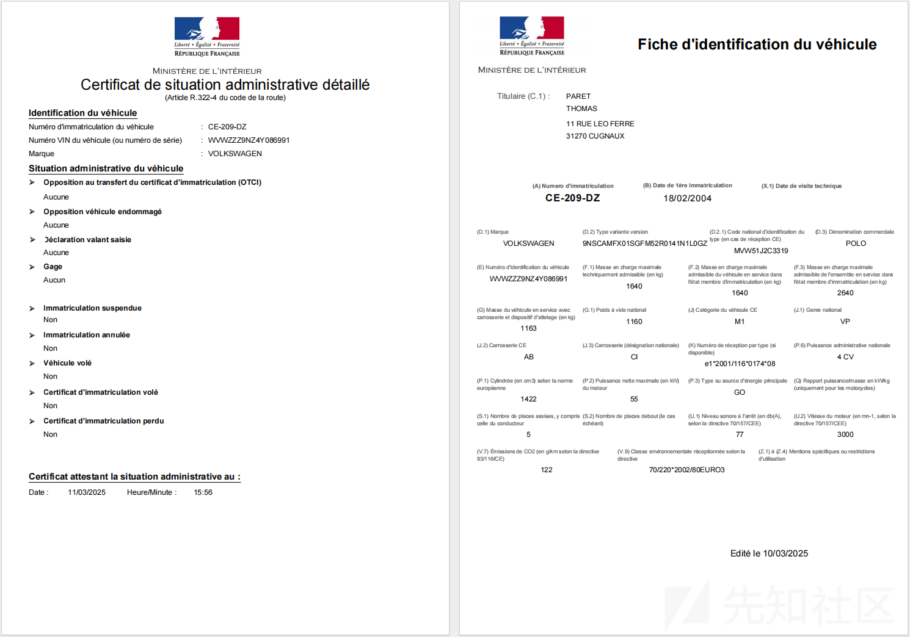

###### BAT文件

BAT文件大小超过6M，且经过混淆处理，其主要依靠无用变量（由 %…%）和字符替换填充代码。命令字符串由数百个预定义变量构建，解析后执行下一阶段的有效负载

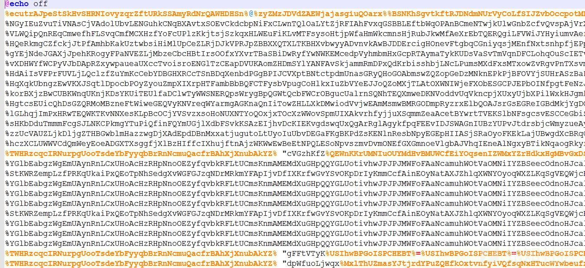

BAT文件运行后会删除自身，并执行Powershell指令，其主要功能如下：

1. 读取 `${SamplePath}\paris.bat` 文件内容

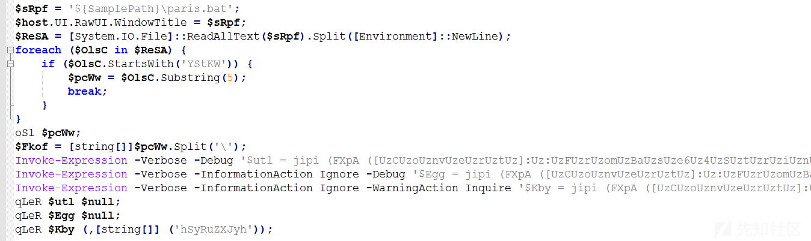

2. 查找以 `YStKW` 开头的行，并提取部分内容

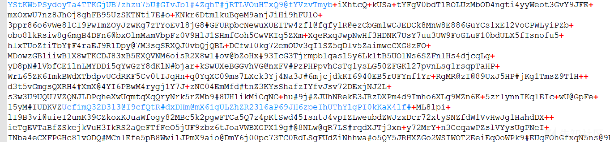

3. 调用 `oSl` 函数，将数据写入注册表

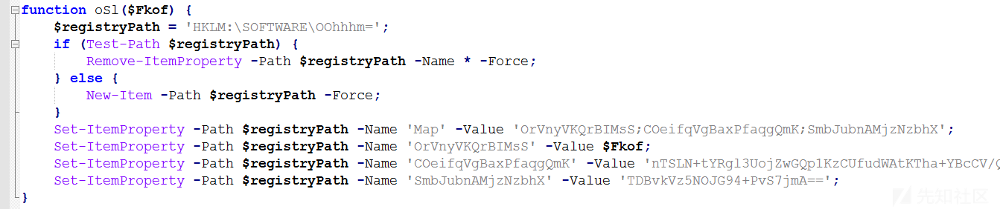

4. 调用 `FXpA` 和 `jipi` 函数，对提取的内容进行解密和处理

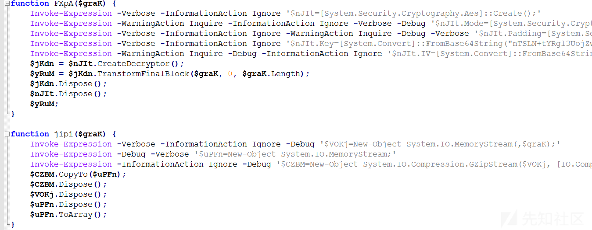

5. 调用 `qLeR` 函数，加载字节数组作为 .NET 程序集并调用其入口点

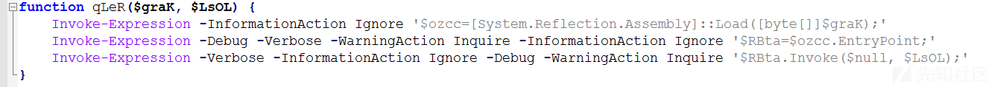

按照脚本逻辑编写解密脚本如下：

```
import base64
import gzip
from Crypto.Cipher import AES
from Crypto.Util.Padding import unpad
import io

def FXpA(graK):
    key = base64.b64decode("nTSLN+tYRgl3UojZwGQp1KzCUfudWAtKTha+YBcCV/Q=")
    iv = base64.b64decode("TDBvkVz5NOJG94+PvS7jmA==")
    cipher = AES.new(key, AES.MODE_CBC, iv)
    decrypted_data = cipher.decrypt(graK)
    return unpad(decrypted_data, AES.block_size)

def jipi(graK):
    with gzip.GzipFile(fileobj=io.BytesIO(graK), mode='rb') as gz:
        decompressed_data = gz.read()
    return decompressed_data

def main():
    sRpf = r'${SamplePath}\paris.bat'
    with open(sRpf, 'r') as file:
        ReSA = file.read().splitlines()
    pcWw = None
    for line in ReSA:
        if line.startswith('YStKW'):
            pcWw = line[5:]
            break
    if pcWw:
        Fkof = pcWw.split('\')
        utl = jipi(FXpA(base64.b64decode(Fkof[0].replace("#", "/").replace("@", "A"))))
        Egg = jipi(FXpA(base64.b64decode(Fkof[1].replace("#", "/").replace("@", "A"))))
        Kby = jipi(FXpA(base64.b64decode(Fkof[2].replace("#", "/").replace("@", "A"))))
        with open('utl_decrypted.bin', 'wb') as f:
            f.write(utl)
        with open('Egg_decrypted.bin', 'wb') as f:
            f.write(Egg)
        with open('Kby_decrypted.bin', 'wb') as f:
            f.write(Kby)

if __name__ == "__main__":
    main()
```

解密出三个带有混淆的.NET文件

|  |  |
| --- | --- |
| **Hash** | **文件名** |
| 6c7d7e73b19a8606dae359d9a37eadb3b0a197f15c4c80d8fe062e605825e03f | As.exe |
| 35a0cdb36f4d33b3f2e441712f42e23bc12c7208cdc34bd66408d3065dbba6fc | PzoDJ |
| 35a0cdb36f4d33b3f2e441712f42e23bc12c7208cdc34bd66408d3065dbba6fc | Test.exe |

###### PzoDJ分析

样本运行后，将在内存解密出一段Powershell指令

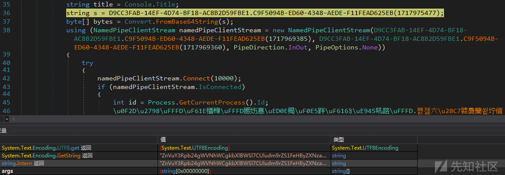

该Powershell指令的主要功能与第一阶段Powershell脚本功能类似，依然是：1. 获取数据；2. 解密并解压缩数据；3. 加载并执行解密后的程序集。

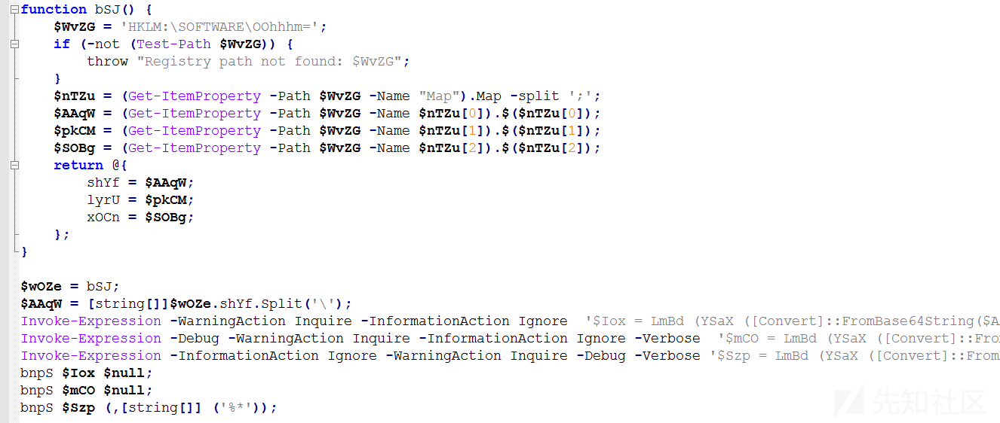

与第一阶段脚本不同的是，第一阶段的脚本主要从BAT文件中读取带解密数据，并写入注册表，第二阶段脚本则直接从注册表中读取待解密数据。如此往复可实现持久化驻留主机。

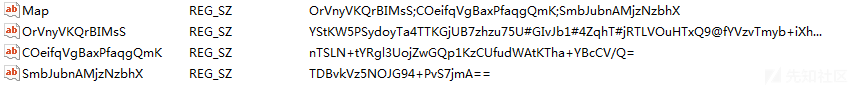

**C9F5094B-ED60-4348-AEDE-F11FEAD625EB()函数分析**

该函数为解密函数，接收int类型整数，并根据该数计算偏移，随后取内存数据，最后进行异或解密。

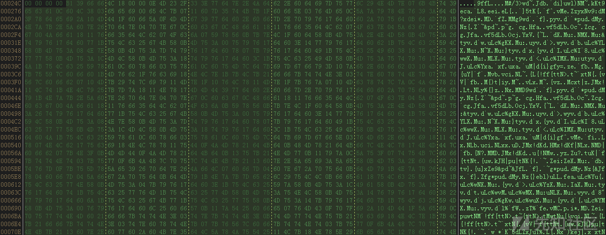

编写解密脚本如下

```
import struct
from ctypes import c_int32

def decrypt_string(data: bytes, ids: list[int]) -> list[str]:
    results = []
    for id in ids:
        if id >> 31:
            results.append("")
            continue

        base_offset = struct.unpack_from("<I", data, 0)[0] 
        offset = id ^ base_offset

        str_length = struct.unpack_from("<I", data, offset)[0]
        enc_bytes = bytearray(data[offset + 8:offset + 8 + str_length]) 

        key = struct.unpack_from("<I", data, offset + 4)[0] 
        key_bytes = [(key >> (8 * i)) & 0xFF for i in range(4)] 

        num = len(enc_bytes) - 1
        j = 0
        while j < num:
            enc_bytes[j] ^= enc_bytes[num]
            enc_bytes[num] ^= (enc_bytes[j] ^ key_bytes[j % 4])
            enc_bytes[j] ^= enc_bytes[num]
            j += 1
            num -= 1

        if len(enc_bytes) % 2 != 0:
            enc_bytes[len(enc_bytes) // 2] ^= key_bytes[0]

        try:
            result = enc_bytes.decode("utf-8")
        except UnicodeDecodeError:
            result = enc_bytes.hex()
        results.append(result)
    return results

file_path = 'class1_0_data.bin'
with open(file_path, 'rb') as f:
    data = f.read() 

ids = [1717975477, 1717969385, 1717969360, 1717969348, 1717969212, 1717969172, 1717969156, 1717969271, 1717969258, 1717969216, 1717969229, 1717969081, 1717969061, 1717969145, 1717969113]
print(decrypt_string(data, ids))

```

运行结果如下

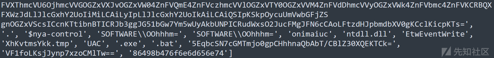

代入解密结果，继续分析C#代码，其核心功能模块如下

1. 读取解密后的 Base64 PowerShell 指令并存入环境变量 onimaiuc，之后将从环境变量中加载恶意指令

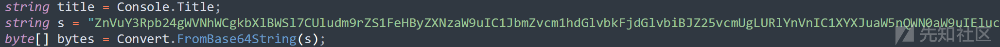

2. 通过命名管道 $nya-control 进行通信

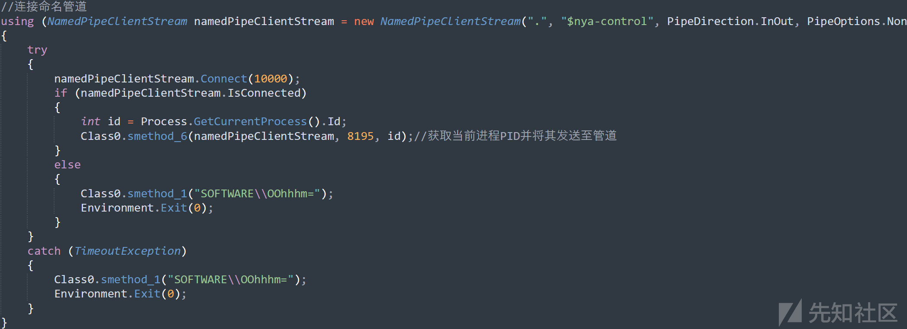

连接成功后，程序将调用 smethod\_6()，向命名管道发送 controlCode=8195 和当前进程 ID

若连接失败，则调用 smethod\_1() 删除注册表项，并退出程序

3. 反检测机制：禁用 ETW 日志

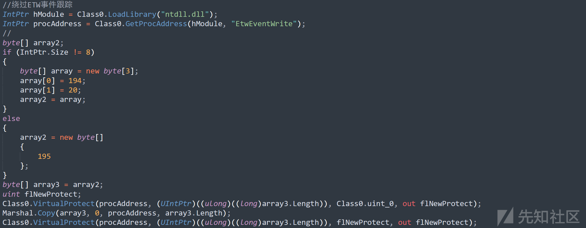

加载 ntdll.dll，获取 EtwEventWrite 的地址，接着修改 EtwEventWrite 的内存保护权限，使其可写。随后覆盖 EtwEventWrite 指令：

* 在 x86 平台：写入 C2 14，RET 14h（返回并清理 20 字节的参数）。
* 在 x64 平台：写入 C3，RET 指令。

这个修改 使 EtwEventWrite 直接返回，不执行任何事件日志写入，从而 绕过 Windows 日志检测。

4. 从资源文件提取可执行文件并执行

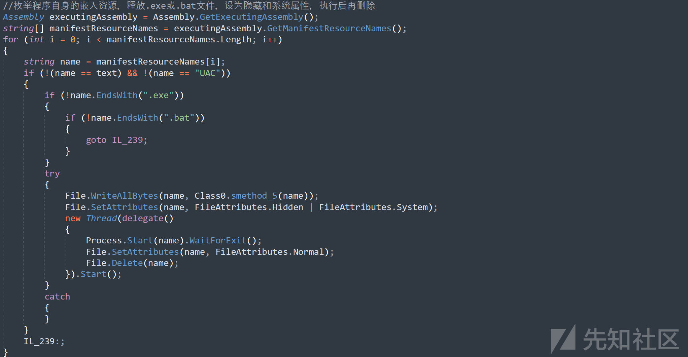

5. 解析并执行 XhKvtmsYkk.tmp

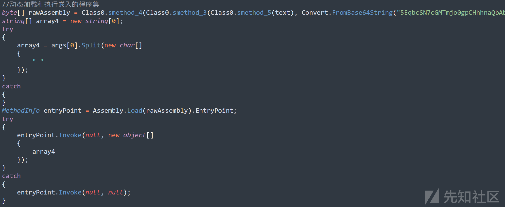

使用与此前脚本相同的方式，使用 AES CBC 解密，其中密钥和 IV 是 Base64 编码的固定值，再进行 GZip 解压，最后将解密后的数据作为 .NET 程序 加载进内存并执行。

###### XhKvtmsYkk.tmp

样本采用了多种加密方式

1. 与PzoDJ相同，使用了自定义的对称加密算法。

该算法结合了异或操作和简单的字节交换。从数据中提取的一个 32 位整数作为 key，并将其拆分为 4 个字节。接着从字节数组的两端向中间遍历，交换字节并进行异或操作。如果字节数组长度为奇数，中间字节单独与密钥的第一个字节进行异或操作。

使用该算法可解密出一部分数据如下

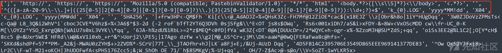

2. 采用了魔改的Base64编码
3. 使用 AES-256-CBC 进行加解密，并通过 HMAC-SHA256 校验验证数据的完整性

这部分数据解密以自定义加密算法解密后的结果作为输入，可以看到解密出的结果包含样本C2：176.65.141.58:4782

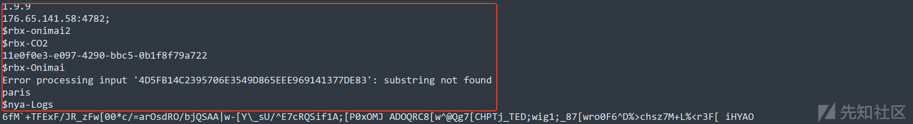

程序最开始主要就在解密这部分字符串

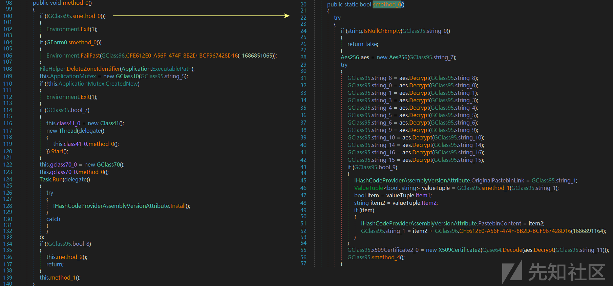

随着初始化完成，并通过与C2连接之后，将接收指令执行远控功能

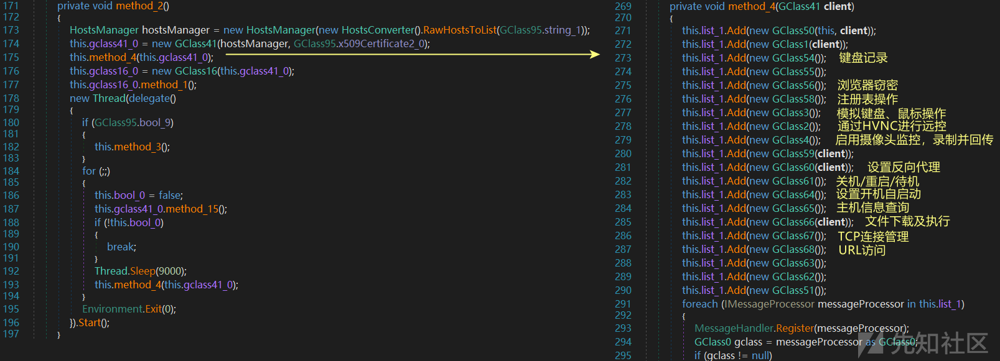

包括键盘记录

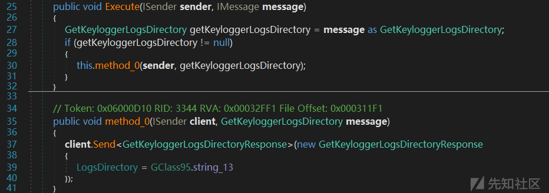

Brave-Browser、Google Chrome、Opera、Microsoft、Yandex、Firefox等浏览器窃密

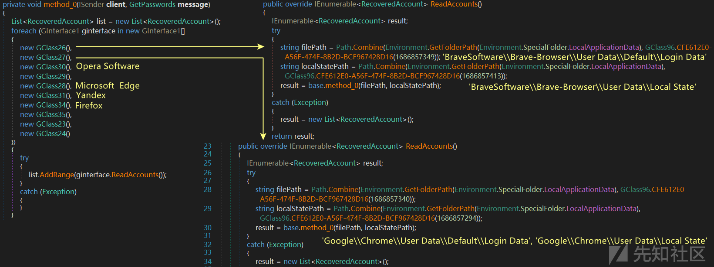

解密出的一些字符串

['Opera Software\\Opera Stable\\Login Data', 'Opera Software\\Opera Stable\\Local State']

['Opera Software\\Opera GX Stable\\Login Data', 'Opera Software\\Opera GX Stable\\Local State']

['Microsoft\\Edge\\User Data\\Default\\Login Data', 'Microsoft\\Edge\\User Data\\Local State']

['Yandex\\YandexBrowser\\User Data\\Default\\Ya Passman Data', 'Yandex\\YandexBrowser\\User Data\\Local State']

['Mozilla\\Firefox\\Profiles', 'signons.sqlite', 'logins.json', 'moz\_logins', 'hostname', 'encryptedUsername', 'encryptedPassword', 'logins', 'encryptedUsername', 'encryptedPassword', 'hostname']

['Host', 'Port', ':', 'User', 'Pass']

['SOFTWARE\\\\Martin Prikryl\\\\WinSCP 2\\\\Sessions', 'HostName', '', 'UserName', '', 'Password', '', 'PublicKeyFile', '', ':', 'PortNumber', '22', '[PRIVATE KEY LOCATION: "{0}"]']

创建、删除、重命名等注册表操作

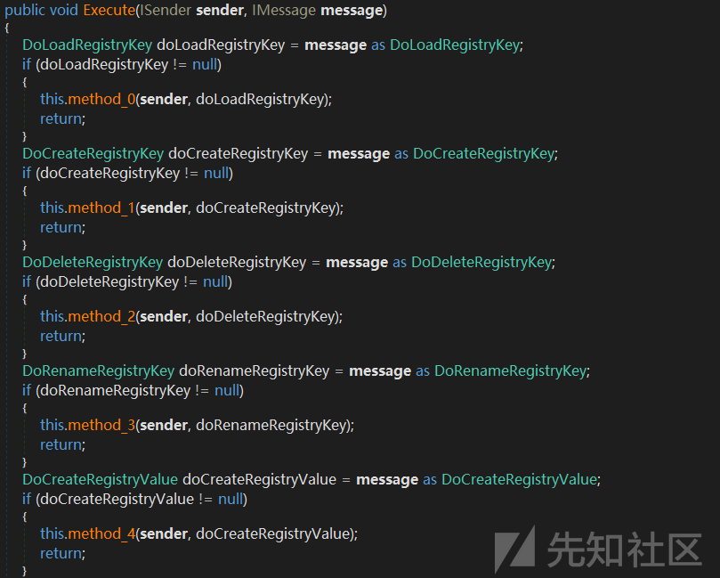

模拟鼠标键盘操作

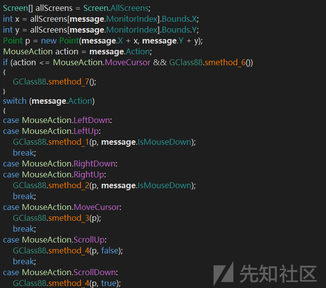

通过HVNC进行远控

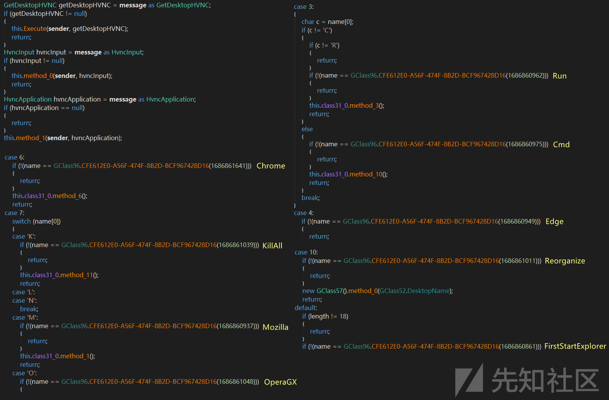

启动摄像头，捕获画面并将录制内容回传至C2

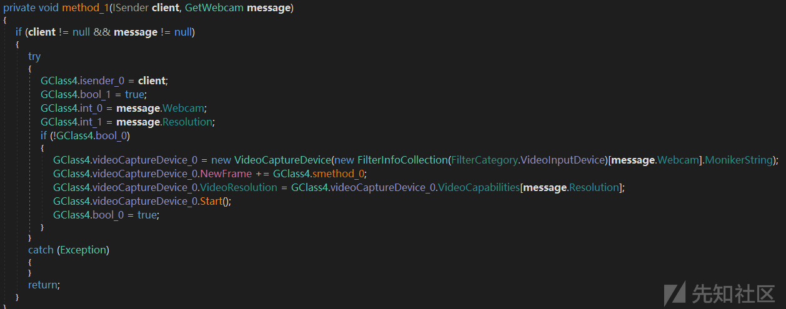

设置反向代理

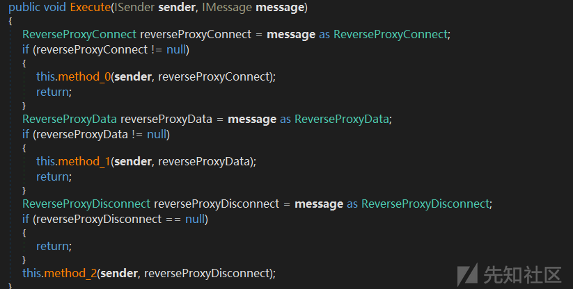

根据指令执行关机、重启或待机

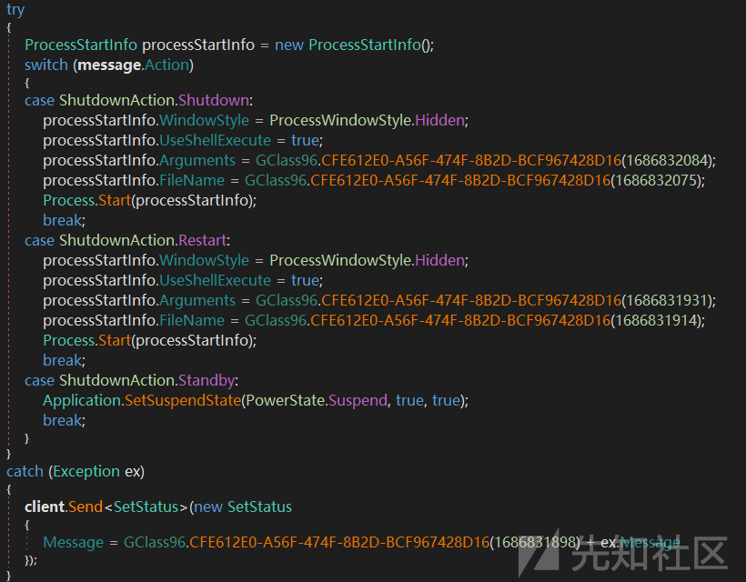

管理开机自启动项，包括获取开机自启动项列表、添加新的开机自启动项和移除已存在的开机自启动项

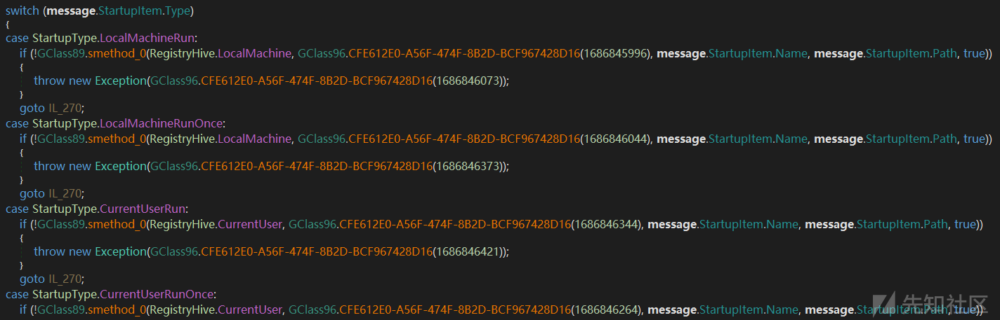

解密出的字符串包括

'SOFTWARE\\Microsoft\\Windows\\CurrentVersion\\Run', 'SOFTWARE\\Microsoft\\Windows\\CurrentVersion\\RunOnce', 'SOFTWARE\\Microsoft\\Windows\\CurrentVersion\\Run', 'SOFTWARE\\Microsoft\\Windows\\CurrentVersion\\RunOnce', 'SOFTWARE\\WOW6432Node\\Microsoft\\Windows\\CurrentVersion\\Run', 'SOFTWARE\\WOW6432Node\\Microsoft\\Windows\\CurrentVersion\\RunOnce', 'desktop.ini', 'Getting Autostart Items failed: ', 'SOFTWARE\\Microsoft\\Windows\\CurrentVersion\\Run', 'Could not add value', 'SOFTWARE\\Microsoft\\Windows\\CurrentVersion\\RunOnce', 'Could not add value', 'SOFTWARE\\Microsoft\\Windows\\CurrentVersion\\Run', 'Could not add value', 'SOFTWARE\\Microsoft\\Windows\\CurrentVersion\\RunOnce', 'Could not add value', '.url', '[InternetShortcut]', 'URL=file:///', 'IconIndex=0', 'IconFile=', 'SOFTWARE\\WOW6432Node\\Microsoft\\Windows\\CurrentVersion\\RunOnce', 'Could not add value', 'SOFTWARE\\WOW6432Node\\Microsoft\\Windows\\CurrentVersion\\Run', 'Could not add value', 'Adding Autostart Item failed: ', 'SOFTWARE\\Microsoft\\Windows\\CurrentVersion\\Run', 'Could not remove value', 'SOFTWARE\\Microsoft\\Windows\\CurrentVersion\\RunOnce', 'Could not remove value', 'SOFTWARE\\Microsoft\\Windows\\CurrentVersion\\Run', 'Could not remove value', 'SOFTWARE\\Microsoft\\Windows\\CurrentVersion\\RunOnce', 'Could not remove value', 'File does not exist', 'SOFTWARE\\WOW6432Node\\Microsoft\\Windows\\CurrentVersion\\Run', 'Could not remove value', 'SOFTWARE\\WOW6432Node\\Microsoft\\Windows\\CurrentVersion\\RunOnce', 'Could not remove value', 'Removing Autostart Item failed: '

查询主机信息硬件配置如：CPU、RAM、GPU，系统信息如：用户名、主机名、域名、磁盘名、系统目录路径，网络信息如：Mac地址、局域网地址、广域网地址、ASN、ISP，安全信息如：反病毒软件、防火墙信息，以及其他信息如：时区、所在国家。

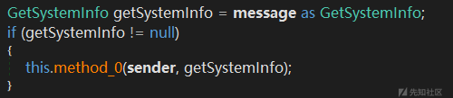

解密出的字符串包括

'-', '-', 'Processor (CPU)', 'Memory (RAM)', '{0} MB', 'Video Card (GPU)', 'Username', 'PC Name', 'Domain Name', 'Host Name', 'System Drive', 'System Directory', 'Uptime', 'MAC Address', 'LAN IP Address', 'WAN IP Address', 'ASN', 'ISP', 'Antivirus', 'Firewall', 'Time Zone', 'Country'

文件下载及执行，启动或结束指定进程

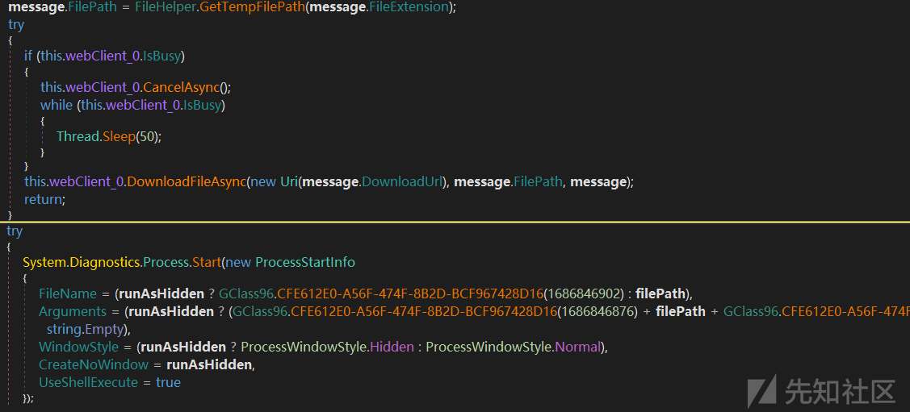

获取当前的TCP连接列表或关闭指定的TCP连接

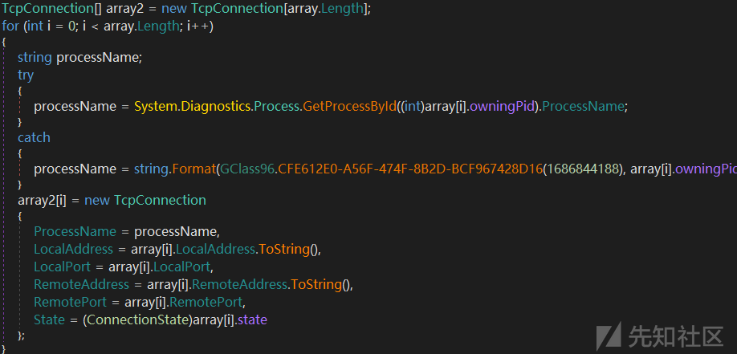

使用浏览器访问URL或发送 HTTP 请求

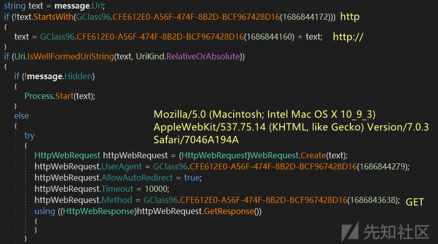

##### 总结

远控木马是一种恶意软件，它能让攻击者在用户不知情的情况下远程控制用户的电脑，从而窃取隐私、控制摄像头和麦克风、篡改系统设置、盗取数据，甚至发动网络攻击或部署勒索软件，危害极大。而钓鱼邮件是传播远控木马的常见手段，攻击者通过伪装成合法邮件诱骗用户点击恶意链接或下载附件。

要防范钓鱼邮件，大家要提高安全意识，不轻易点击不明链接或下载附件，仔细检查邮件来源，使用安全软件进行防护，启用双因素认证，验证链接和附件的安全性，及时报告可疑邮件，并定期备份重要数据。只有这样，才能有效降低被远控木马攻击的风险，保护好自己的信息安全。
