# frida分析ollvm字符串混淆-先知社区

> **来源**: https://xz.aliyun.com/news/17394  
> **文章ID**: 17394

---

### 前言

apk：

链接: <https://pan.baidu.com/s/1zTCqXvG9PHxOQAqfoJS-1g?pwd=ttmm> 提取码: ttmm

​

这三个app demo java层逻辑是一致的，so进行了不同的ollvm字符串混淆。

​

可以看到初始界面中间一开始有一段欢迎字符串，每次点击sign1按钮都会更新出类似于hash的字符串

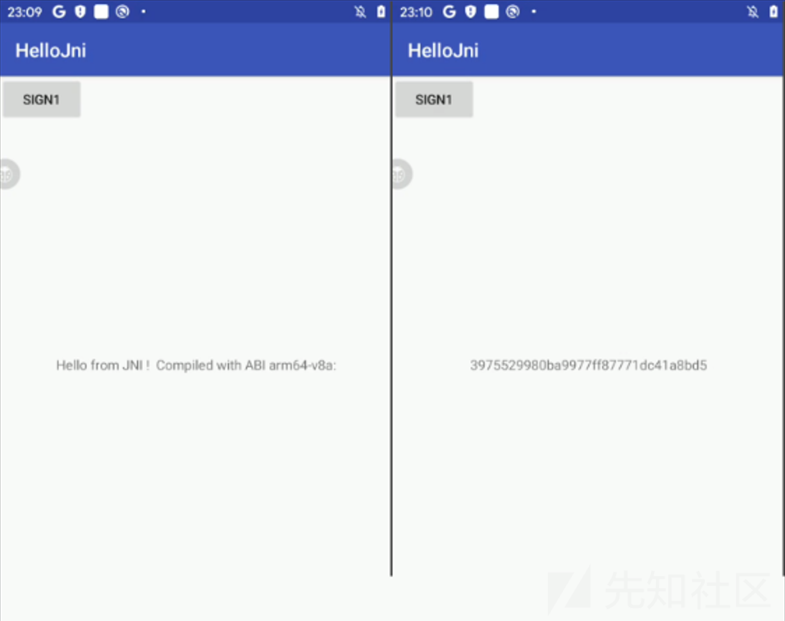

下面通过分析初始字符串和hash字符串来学习使用frida分析ollvm字符串混淆这一手段

### java层

欢迎字串和hash字串分别是通过stringFromJNI和sign1函数生成的，这两个都是jni函数

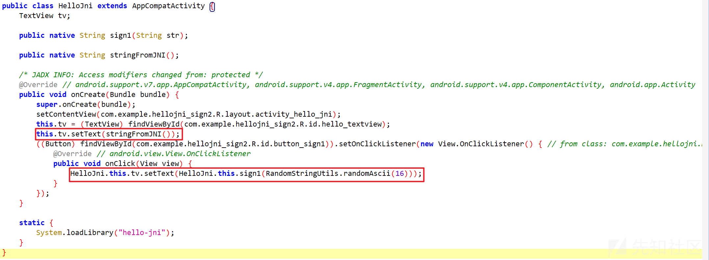

于是转战so层

​

### so层

反编译hello-jni库，在导出表搜索stringFromJNI和sign1，发现只能搜到stringFromJNI这个函数，说明前者是静态注册的，后者是动态注册的。

```
function hook_RegisterNatives() {
    var symbols = Module.enumerateSymbolsSync("libart.so");
    var addrRegisterNatives = null;
    for (var i = 0; i < symbols.length; i++) {
        var symbol = symbols[i];
        //_ZN3art3JNI15RegisterNativesEP7_JNIEnvP7_jclassPK15JNINativeMethodi
        if (symbol.name.indexOf("art") >= 0 &&
                symbol.name.indexOf("JNI") >= 0 &&
                symbol.name.indexOf("RegisterNatives") >= 0 &&
                symbol.name.indexOf("CheckJNI") < 0) {
            addrRegisterNatives = symbol.address;
            console.log("RegisterNatives is at ", symbol.address, symbol.name);
        }
    }
    if (addrRegisterNatives != null) {
        Interceptor.attach(addrRegisterNatives, {
            onEnter: function (args) {
                console.log("[RegisterNatives] method_count:", args[3]);
                var env = args[0];
                var java_class = args[1];
                var class_name = Java.vm.tryGetEnv().getClassName(java_class);
                //console.log(class_name);
                var methods_ptr = ptr(args[2]);
                var method_count = parseInt(args[3]);
                for (var i = 0; i < method_count; i++) {
                    var name_ptr = Memory.readPointer(methods_ptr.add(i * Process.pointerSize * 3));
                    var sig_ptr = Memory.readPointer(methods_ptr.add(i * Process.pointerSize * 3 + Process.pointerSize));
                    var fnPtr_ptr = Memory.readPointer(methods_ptr.add(i * Process.pointerSize * 3 + Process.pointerSize * 2));
                    var name = Memory.readCString(name_ptr);
                    var sig = Memory.readCString(sig_ptr);
                    var find_module = Process.findModuleByAddress(fnPtr_ptr);
                    console.log("[RegisterNatives] java_class:", class_name, "name:", name, "sig:", sig, "fnPtr:", fnPtr_ptr, "module_name:", find_module.name, "module_base:", find_module.base, "offset:", ptr(fnPtr_ptr).sub(find_module.base));
                }
            }
        });
    }
}
```

hellojni\_2.0.0和hellojni\_2.0.1偏移一样都是e76c，hellojni\_2.0.2的则是6e4c

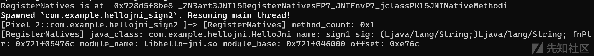

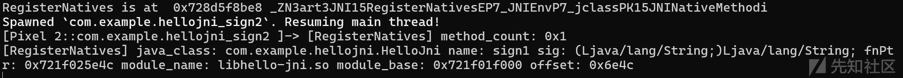

​

#### version0 -初始化时解密 有datadiv

下面是对hellojni\_2.0.0.apk的hello-jni库的分析。

##### stringFromJNI

stringFromJNI函数，这是是直接把stru\_37010指向内容转成UTF-8编码的字符串返回给Java层

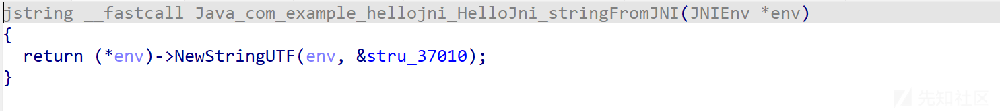

看看stru\_37010指向内容，可以看到stru\_37010以64位双字对形式定义，其初始值可能是要返回给Java层字符串的原始数据。众多以byte\_开头的变量，每个占一个字节，用于程序计算或存储。通过DATA XREF注释可知，这些数据在程序多处被引用，可能参与像datadiv\_decode8846988481537047047函数这样的复杂数据处理流程，推测涉及数据解码等操作

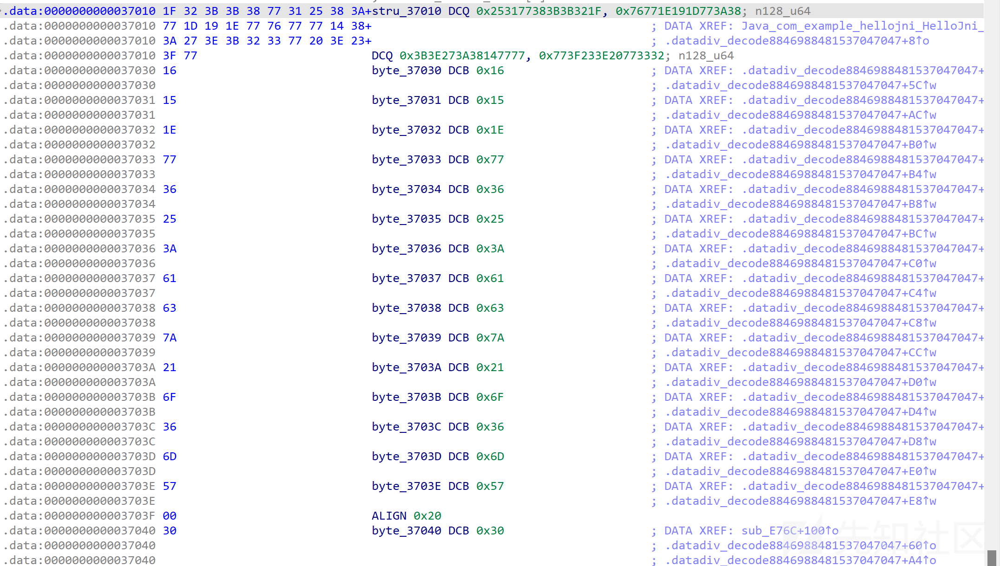

下面在导出表搜索一下datadiv\_decode

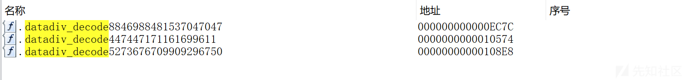

可以看到里面对字符串的每一位进行了异或操作

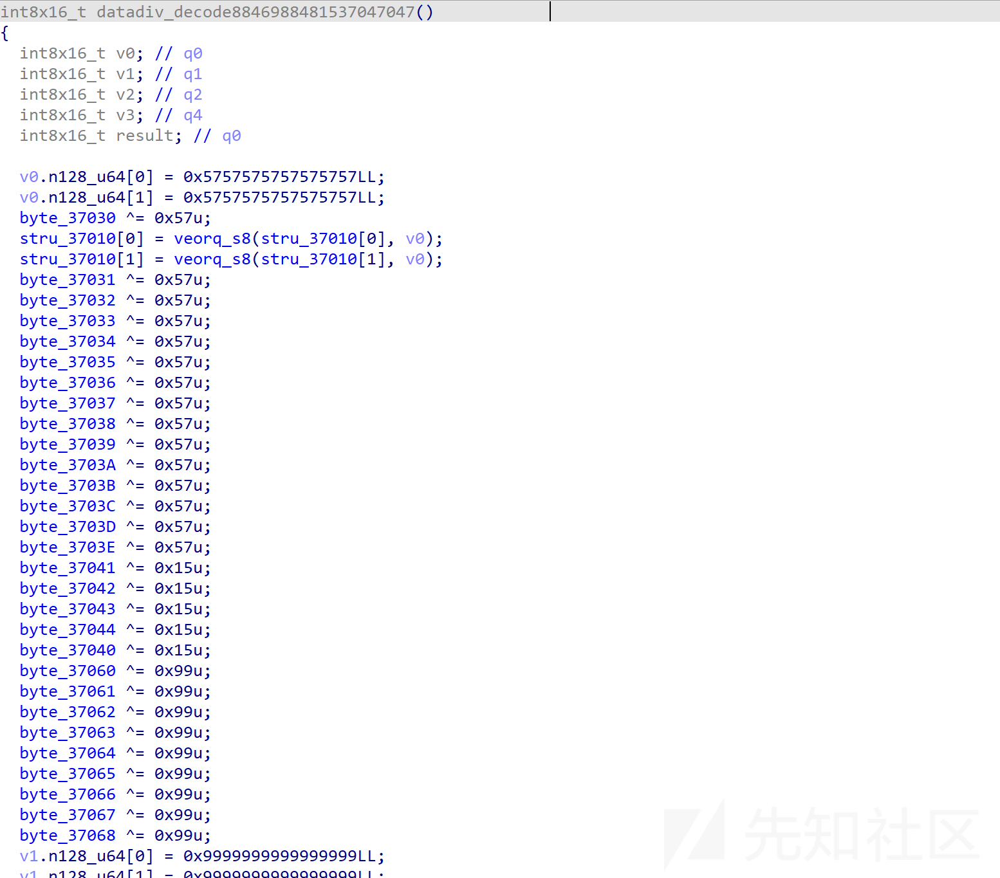

这种手动还原比较麻烦,，因此可以通过frida从内存中dump出解码后的字符串来辅助分析

​

so中函数的加载时机分为.init\_array和jni\_onload这两个点

先来看看是不是在.init\_array中加载的

快捷键ctrl+s然后选择跳转到.init\_array段

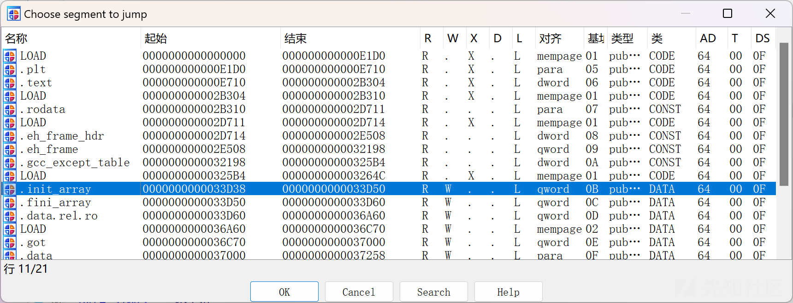

可以看到这三个decode函数都是在.init\_array中加载的

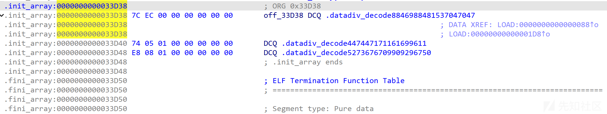

​

所以直接hook 37010就行了

```
function print_str(addr){
    var base = Module.findBaseAddress("libhello-jni.so");
    if(base){
        var addr_str = base.add(addr);
        console.log("addr ",addr_str,"  add_str",ptr(addr_str).readCString());
    }
}
```

​

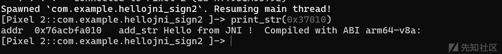

##### sign1

sign1的最后会被v19存储到s返回出来

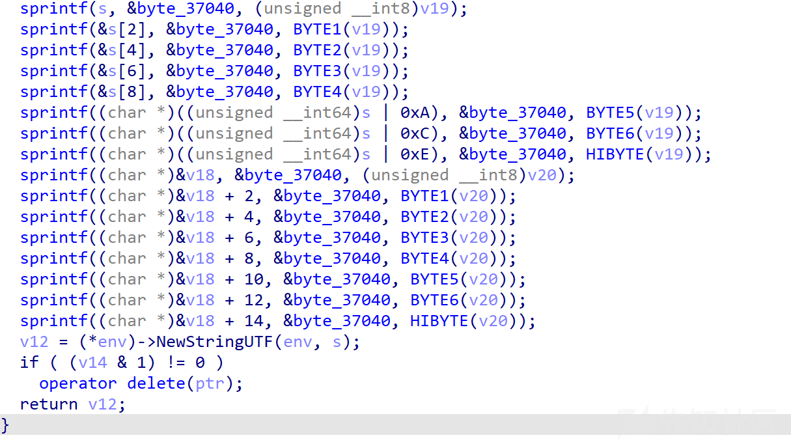

进入37040同样可以看到datadiv\_decode函数

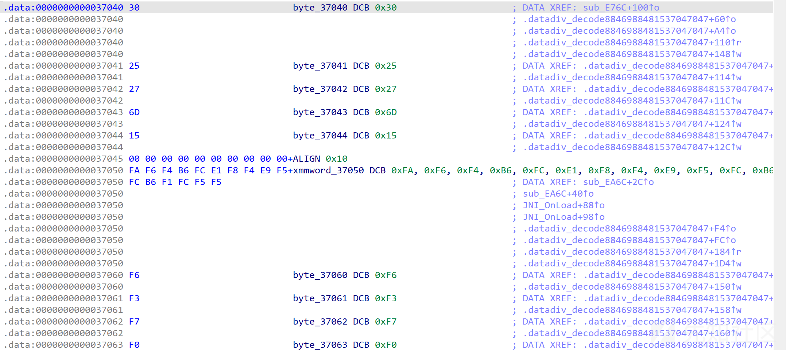

这里同样可以dump出来

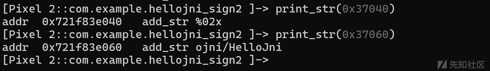

总结一下，导出表中出现.datadiv\_decode就是ollvm字符串混淆的特征

​

​

#### version1 -初始化时解密 无datadiv

下面分析hellojni\_2.0.1.apk的hello-jni库

这回从stringFromJNI里的37010进入没发现datadiv-decode这个函数了，导出表里同样也没有，但是发现了类似于std\_\_string\_\_\_4921590060622252445这样的交叉引用

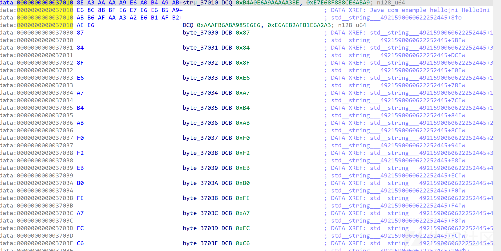

进入一看，发现这个就是前面的datadiv-decode函数

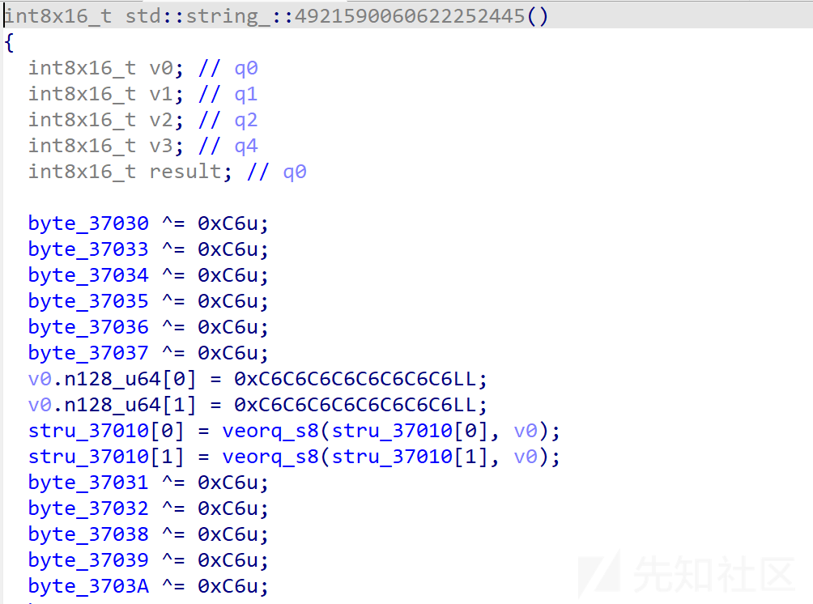

并且在加载时机是在.init\_array中

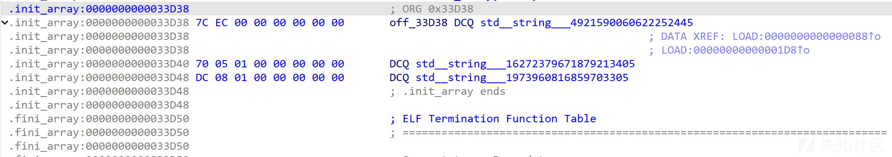

下面直接跟前面一样打印字符串就行了

​

总结：这里无法在导出表中看到ollvm字符串混淆的特征，但是都是在.init\_array里面加载。这种情况只有在64位才有出现

​

​

#### version2-运行时解密

下面分析hellojni\_2.0.0.apk的hello-jni

发现.init\_array这里已经没有前面的解密函数的影子，

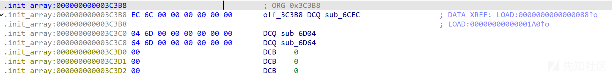

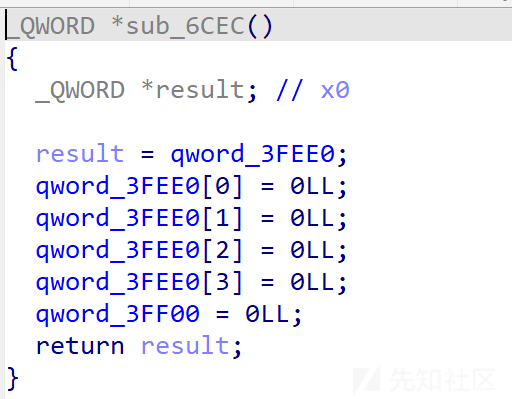

##### stringFromJNI

回到stringFromJNI

可以看到这里会把3E160数组转成java字符串返回出来，这个byte\_22E80[i + 21 + -18 \* (i / 0x12)] ^ byte\_22E80[i + 39]应该就是在解码

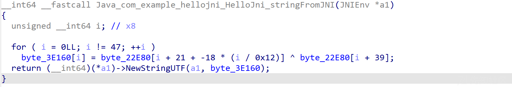

这个byte\_22E80是个映射表

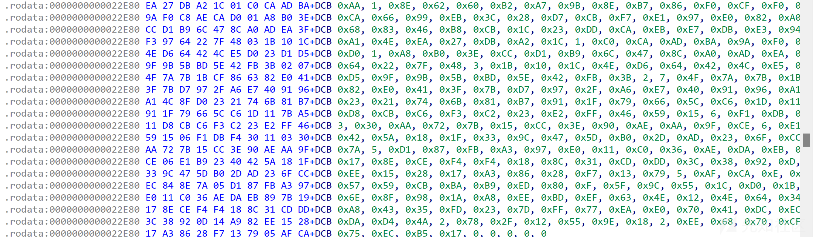

打印一下0x3E160，可以看到就是欢迎字符串

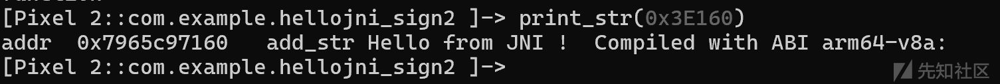

##### sign1

这里跟前面的sign1有了变化，看了一番，同时也对里面的一些函数hook了一下，感觉解密的代码并没有写在这里

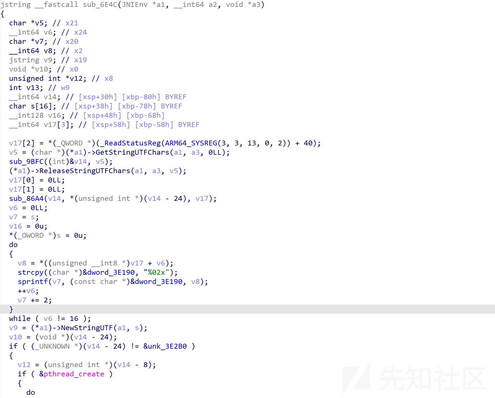

于是查看jni\_onload

可以看到又出现了映射表，所以这里是在jni\_onload中解密字符串的

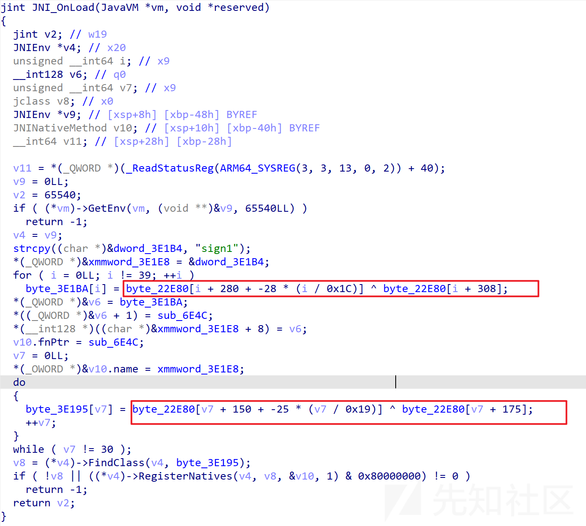

hook一下对应地址可以发现打印出了明文

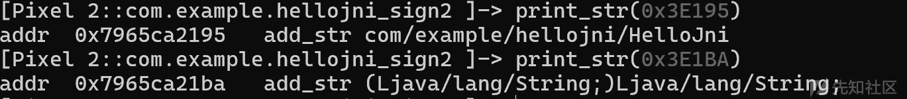

​
