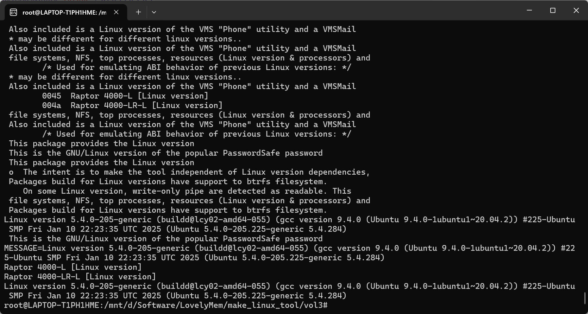
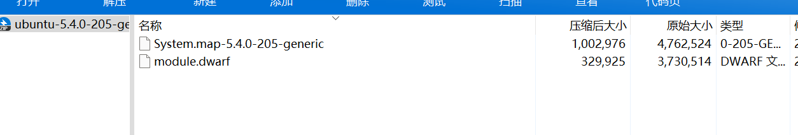
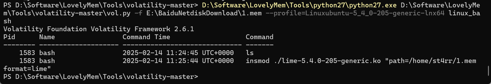
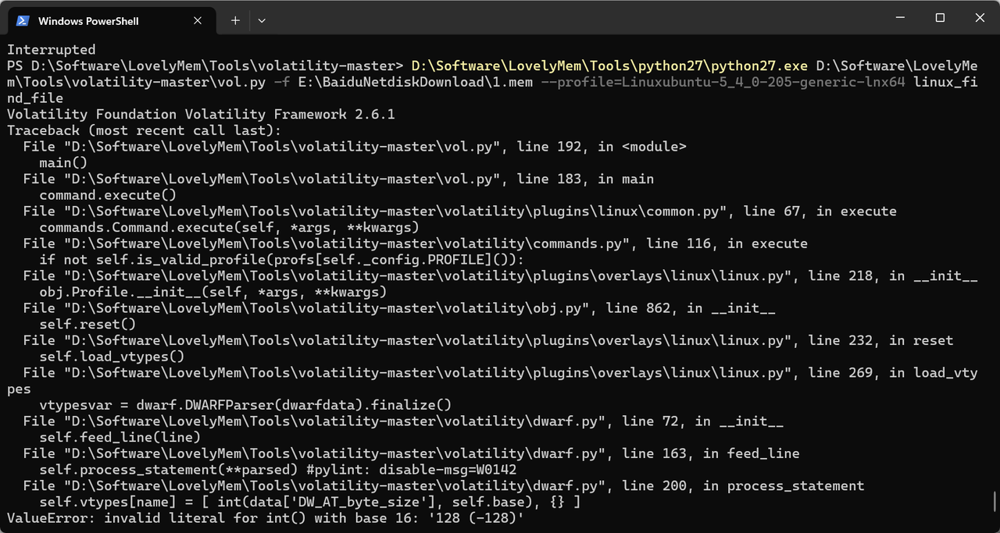

# Volatility2 Profile && Volatility3 Symbol 制作及获取-先知社区

> **来源**: https://xz.aliyun.com/news/17397  
> **文章ID**: 17397

---

## Volatility3 Symbol

### Volatility3 获取Banner

```
python3 vol.py -f <内存文件> banners.Banners
```

示例：

```
C:\Users\Admin>D:\Software\LovelyMem\Tools\python3\python.exe D:\Software\LovelyMem\Tools\volatility3\vol.py -f E:\BaiduNetdiskDownload\1.mem banners.Banners
Volatility 3 Framework 2.8.0
Progress:  100.00               PDB scanning finished
Offset  Banner

0x213a001a0     Linux version 5.4.0-205-generic (buildd@lcy02-amd64-055) (gcc version 9.4.0 (Ubuntu 9.4.0-1ubuntu1~20.04.2)) #225-Ubuntu SMP Fri Jan 10 22:23:35 UTC 2025 (Ubuntu 5.4.0-205.225-generic 5.4.284)
0x2155a0e54     Linux version 5.4.0-205-generic (buildd@lcy02-amd64-055) (gcc version 9.4.0 (Ubuntu 9.4.0-1ubuntu1~20.04.2)) #225-Ubuntu SMP Fri Jan 10 22:23:35 UTC 2025 (Ubuntu 5.4.0-205.225-generic 5.4.284)
0x23fec9390     Linux version 5.4.0-205-generic (buildd@lcy02-amd64-055) (gcc version 9.4.0 (Ubuntu 9.4.0-1ubuntu1~20.04.2)) #225-Ubuntu SMP Fri Jan 10 22:23:35 UTC 2025 (Ubuntu 5.4.0-205.225-generic 5.4.284)
```

### Volatility3 Symbol 制作

官方文档：<https://volatility3.readthedocs.io/en/latest/symbol-tables.html>

Linux and Mac symbol tables can be generated from a DWARF file using a tool called [dwarf2json](https://github.com/volatilityfoundation/dwarf2json). Currently a kernel with debugging symbols is the only suitable means for recovering all the information required by most Volatility plugins. Note that in most linux distributions, the standard kernel is stripped of debugging information and the kernel with debugging information is stored in a package that must be acquired separately.

Linux和Mac符号表可以使用名为dwarf2json的工具从DWARF文件生成。 当前，对于的大部分Volatility插件带有调试符号的内核是恢复所需的所有信息的唯一合适方法。请注意，在大多数linux发行版中，标准内核剥离了调试信息，带有调试信息的内核存储在必须单独获取的包中。

Once a kernel with debugging symbols/appropriate DWARF file has been located, [dwarf2json](https://github.com/volatilityfoundation/dwarf2json) will convert it into an appropriate JSON file. Example code for automatically creating a JSON from URLs for the kernel debugging package and the package containing the System.map, can be found in [stock-linux-json.py](https://github.com/volatilityfoundation/volatility3/blob/develop/development/stock-linux-json.py) . The System.map file is recommended for completeness, but a kernel with debugging information often contains the same symbol offsets within the DWARF data, which dwarf2json can extract into the JSON ISF file.

找到带有调试符号/适当DWARF文件的内核后，dwarf2json会将其转换为 适当的JSON文件。从内核调试包的url自动创建JSON的示例代码 包含系统的包。Map，可以在stock-linux-json.py中找到。 这个系统。为了完整起见，建议使用Map文件，但是带有调试信息的内核通常包含相同的Map文件 DWARF数据中的符号偏移量，dwarf2json可以将其提取到JSON ISF文件中。

#### Ubuntu (手动制作)

```
# 下载dwarf2json工具 - 该工具用于将DWARF调试信息转换为Volatility可用的JSON符号文件
wget https://github.com/volatilityfoundation/dwarf2json/releases/download/v0.9.0/dwarf2json-linux-amd64

# 下载Ubuntu 20.04 Docker镜像作为构建环境
docker pull ubuntu:20.04

# 下载Ubuntu 20.04系统的5.4.0-205内核调试符号包
# https://launchpad.net/ubuntu/在此处获取其他版本内核
wget https://launchpadlibrarian.net/769817990/linux-image-unsigned-5.4.0-205-generic-dbgsym_5.4.0-205.225_amd64.ddeb

# 启动Ubuntu容器并挂载当前目录
# -it: 交互式终端
# --rm: 退出后自动删除容器
# -v $PWD:/volatility: 将当前目录挂载到容器内的/volatility目录
docker run -it --rm -v $PWD:/volatility ubuntu:20.04 /bin/bash

# 进入挂载的工作目录
cd volatility

# 安装下载的内核调试符号包
dpkg -i linux-image-unsigned-5.4.0-205-generic-dbgsym_5.4.0-205.225_amd64.ddeb

# 使用dwarf2json工具从调试符号生成Volatility3可用的JSON符号文件
# --elf: 指定输入文件为ELF格式
# 输出重定向到JSON文件
./dwarf2json-linux-amd64 linux --elf /usr/lib/debug/boot/vmlinux-5.4.0-205-generic > linux-image-5.4.0-205-generic.json

# 退出Docker容器
exit

# 将生成的符号文件复制到Volatility3框架的符号目录
# 这样Volatility3就能识别并分析对应内核版本的内存转储文件
cp linux-image-5.4.0-205-generic.json /mnt/d/Software/LovelyMem/Tools/volatility3/volatility3/framework/symbols/linux
```

#### Ubuntu Dockerfile

```
FROM ubuntu:20.04

WORKDIR /volatility

RUN apt-get update && apt-get install -y wget dpkg python3 zip unzip

# 下载dwarf2json工具
RUN wget https://github.com/volatilityfoundation/dwarf2json/releases/download/v0.9.0/dwarf2json-linux-amd64 \
    && chmod +x dwarf2json-linux-amd64

# 下载内核调试符号
RUN wget https://launchpadlibrarian.net/769817990/linux-image-unsigned-5.4.0-205-generic-dbgsym_5.4.0-205.225_amd64.ddeb

RUN dpkg -i linux-image-unsigned-5.4.0-205-generic-dbgsym_5.4.0-205.225_amd64.ddeb

# 生成符号表JSON文件
RUN ./dwarf2json-linux-amd64 linux --elf /usr/lib/debug/boot/vmlinux-5.4.0-205-generic > linux-image-5.4.0-205-generic.json

RUN zip linux-image-5.4.0-205-generic.zip linux-image-5.4.0-205-generic.json

CMD ["/bin/bash"]
```

### Volatility3 Symbol 下载

在Github上找到了一个Vol3符号表的仓库，顺便分享一下，以下是Readme

https://github.com/leludo84/vol3-linux-profiles

The goal of this project is to build and provide all possible Volatility3 profiles for the main Linux distributions in x86\_64 version only.

这个项目的目标是为x86\_64版本的主要Linux发行版构建并提供所有可能的Volatility3配置文件。

This project contains all kernel versions including security updates.

此项目包含所有内核版本，包括安全更新。

⚠️ Ubuntu 20, 22 and 24 do not provide old packages in their repository (the last 15 or 20 kernels). We haven't profile older than this project. Use https://github.com/p0dalirius/volatility3-symbols for old symbols.

⚠️ Ubuntu 20,22和24在其存储库中不提供旧的包（最近的15或20个内核）。我们没有比这个项目更早的侧写。旧的符号使用https://github.com/p0dalirius/volatility3-symbols。

## Volatility2 Profile

### Volatility2 获取Banner

推荐使用Volatility 3的banners.Banners进行获取，或使用strings命令

```
strings mem | grep -i 'Linux version' | uniq
```

但，内存文件大的情况下，strings提取可能有点慢（



### Volatility2 Profile 制作 (Docker)

参考

http://www.s1mh0.cn/blog/index.php/2023/12/20/linux\_ncqz/

https://github.com/CTF-Archives/profile-builder

[Misc-Forensics - ⚡Lunatic BLOG⚡ (goodlunatic.github.io)](https://goodlunatic.github.io/posts/761da51/#%E5%88%B6%E4%BD%9C--profilevol2--%E7%9A%84%E8%AF%A6%E7%BB%86%E8%BF%87%E7%A8%8B)

因为专门装一台虚拟机去构建Profile太麻烦了，使用docker进行构建，下方是参考Lunatic师傅的Debian构建模板做出修改制作的两个Ubuntu内核Profile构建模板以及修改的Debian模板

​

一个profile的结构如下：其实一共就两个文件

/Boot/System.map-xxxxx-xxxxx

volatility/tools/linux/module.dwarf

这里以Linux version 5.4.0-205-generic (buildd@lcy02-amd64-055) (gcc version 9.4.0 (Ubuntu 9.4.0-1ubuntu1~20.04.2)) #225-Ubuntu SMP Fri Jan 10 22:23:35 UTC 2025 (Ubuntu 5.4.0-205.225-generic 5.4.284) 这个内核为例，使用apt安装dwartdump

​

Dockerfile中使用的docker-entrypoint.sh和tools.zip可以从https://github.com/More678/Docker-ProfileMaker-vol2/tree/main/Ubuntu-apt-dwarfdump获取

#### Ubuntu\_apt\_dwarfdump

```
FROM ubuntu:20.04

ENV TZ=Asia/Shanghai
ENV DEBIAN_FRONTEND=noninteractive
ENV UBUNTU_FRONTEND=noninteractive

COPY ./service/docker-entrypoint.sh /docker-entrypoint.sh
COPY ./src/ /src/

# 注意gcc版本
RUN sed -i 's/archive.ubuntu.com/mirrors.ustc.edu.cn/g' /etc/apt/sources.list \
    && sed -i 's/security.ubuntu.com/mirrors.ustc.edu.cn/g' /etc/apt/sources.list \
        && apt update --no-install-recommends\
    && apt install -y openssh-server gcc-10 dwarfdump build-essential unzip wget\
    && chmod +x /docker-entrypoint.sh \
    && mkdir /app \
    && sed -i 's/\#PermitRootLogin prohibit-password/PermitRootLogin yes/g' /etc/ssh/sshd_config \
    && sed -i 's/\#PasswordAuthentication yes/PasswordAuthentication yes/g' /etc/ssh/sshd_config \
    && echo 'root:root' | chpasswd \
    && systemctl enable ssh \
    && service ssh start

# 例：
# linux-image-xxxx.deb
# 修改linux-image-unsigned-5.4.0-205-generic_5.4.0-205.225_amd64.deb中
# unsigned-5.4.0-205-generic_5.4.0-205.225_amd64的部分
# 可参阅下方链接查找指定版本
# https://mirrors.ustc.edu.cn/ubuntu/pool/main/l/linux/
RUN wget https://mirrors.ustc.edu.cn/ubuntu/pool/main/l/linux/linux-image-unsigned-5.4.0-205-generic_5.4.0-205.225_amd64.deb -P /src/ \
    && wget https://mirrors.ustc.edu.cn/ubuntu/pool/main/l/linux/linux-headers-5.4.0-205-generic_5.4.0-205.225_amd64.deb -P /src/ \
    && wget https://mirrors.ustc.edu.cn/ubuntu/pool/main/l/linux/linux-headers-5.4.0-205_5.4.0-205.225_all.deb -P /src/ \
    && wget https://mirrors.ustc.edu.cn/ubuntu/pool/main/l/linux/linux-modules-5.4.0-205-generic_5.4.0-205.225_amd64.deb -P /src/

WORKDIR /src

# 解压Volatility/tool
# 安装需要的内核文件
# 重新--fix-broken，防止部分软件包存在问题
RUN unzip tool.zip && apt-get update && apt-get install -y kmod linux-base initramfs-tools
RUN dpkg -i linux-headers-5.4.0-205_5.4.0-205.225_all.deb \
    && dpkg -i linux-headers-5.4.0-205-generic_5.4.0-205.225_amd64.deb \
    && dpkg -i linux-modules-5.4.0-205-generic_5.4.0-205.225_amd64.deb \
    && dpkg -i linux-image-unsigned-5.4.0-205-generic_5.4.0-205.225_amd64.deb \
    && apt --fix-broken install -y


RUN ls -la /lib/modules/5.4.0-205-generic/ \
    && mkdir -p /lib/modules/5.4.0-205-amd64/ \
    && ln -sf /usr/src/linux-headers-5.4.0-205-generic /lib/modules/5.4.0-205-amd64/build


WORKDIR /src/linux

# 制作dwarf文件，并与System.map一同放置到/app目录下
RUN echo 'MODULE_LICENSE("GPL");' >> module.c && \
    sed -i 's/$(shell uname -r)/5.4.0-205-generic/g' Makefile && \
    make && \
    mv module.dwarf /app && \
    cp /boot/System.map* /app

WORKDIR /app

# 打包
RUN zip ubuntu-5.4.0-205-generic.zip *

CMD ["/bin/bash"]
```

#### Ubuntu\_build\_dwarfdump

部分情况下，由于apt安装的dwarfdump版本过于老旧，制作的dwarf文件可能无法被Volatility识别，这时候需要从<https://www.prevanders.net/dwarf.html>获取源码进行构建

https://github.com/More678/Docker-ProfileMaker-vol2/tree/main/Ubuntu-build-dwarfdump

参见下方Tips

```
FROM ubuntu:20.04

ENV TZ=Asia/Shanghai
ENV DEBIAN_FRONTEND=noninteractive
ENV UBUNTU_FRONTEND=noninteractive

COPY ./service/docker-entrypoint.sh /docker-entrypoint.sh
COPY ./src/ /src/

RUN sed -i 's/archive.ubuntu.com/mirrors.ustc.edu.cn/g' /etc/apt/sources.list \
    && sed -i 's/security.ubuntu.com/mirrors.ustc.edu.cn/g' /etc/apt/sources.list \
        && apt update --no-install-recommends\
    && apt install -y openssh-server gcc-10 build-essential unzip zip wget\ 
    # dwarfdump
    && chmod +x /docker-entrypoint.sh \
    && mkdir /app \
    && sed -i 's/\#PermitRootLogin prohibit-password/PermitRootLogin yes/g' /etc/ssh/sshd_config \
    && sed -i 's/\#PasswordAuthentication yes/PasswordAuthentication yes/g' /etc/ssh/sshd_config \
    && echo 'root:root' | chpasswd \
    && systemctl enable ssh \
    && service ssh start


# https://mirrors.ustc.edu.cn/ubuntu/pool/main/l/linux/
RUN wget https://mirrors.ustc.edu.cn/ubuntu/pool/main/l/linux/linux-image-unsigned-5.4.0-205-generic_5.4.0-205.225_amd64.deb -P /src/ \
    && wget https://mirrors.ustc.edu.cn/ubuntu/pool/main/l/linux/linux-headers-5.4.0-205-generic_5.4.0-205.225_amd64.deb -P /src/ \
    && wget https://mirrors.ustc.edu.cn/ubuntu/pool/main/l/linux/linux-headers-5.4.0-205_5.4.0-205.225_all.deb -P /src/ \
    && wget https://mirrors.ustc.edu.cn/ubuntu/pool/main/l/linux/linux-modules-5.4.0-205-generic_5.4.0-205.225_amd64.deb -P /src/

WORKDIR /src

RUN unzip tool.zip && apt-get update && apt-get install -y kmod linux-base initramfs-tools libelf1
RUN dpkg -i linux-headers-5.4.0-205_5.4.0-205.225_all.deb \
    && dpkg -i linux-headers-5.4.0-205-generic_5.4.0-205.225_amd64.deb \
    && dpkg -i linux-modules-5.4.0-205-generic_5.4.0-205.225_amd64.deb \
    && dpkg -i linux-image-unsigned-5.4.0-205-generic_5.4.0-205.225_amd64.deb \
    && apt --fix-broken install -y

RUN ls -la /lib/modules/5.4.0-205-generic/ \
    && mkdir -p /lib/modules/5.4.0-205-amd64/ \
    && ln -sf /usr/src/linux-headers-5.4.0-205-generic /lib/modules/5.4.0-205-amd64/build

# 增加通过源码构建dwarfdump
RUN wget https://www.prevanders.net/libdwarf-0.6.0.tar.xz -P /src/ && \
    tar -xf libdwarf-0.6.0.tar.xz && \
    cd libdwarf-0.6.0/ && \
    mkdir build && \
    cd build/ && \
    ../configure && \
    make -j16 && make install && \
    sed -i 's/\/usr\/local\/bin\/dwarfdump/dwarfdump/g' Makefile
    # ln -s /usr/local/bin/dwarfdump /usr/bin
    # dwarfdump -V > /app/dwarfdump_version

WORKDIR /src/linux

RUN echo 'MODULE_LICENSE("GPL");' >> module.c && \
    sed -i 's/$(shell uname -r)/5.4.0-205-generic/g' Makefile && \
    make && \
    mv module.dwarf /app && \
    cp /boot/System.map* /app

WORKDIR /app

RUN zip ubuntu-5.4.0-205-generic.zip *

CMD ["/bin/bash"]
```



#### Debian\_apt\_dwarfdump

基于Lunatic师傅的模板进行少量修改，增加了直接打包为zip，并且修改为了aliyun源（不知道为什么我从中科大源拉的时候回缺几个包）

```
FROM debian:11.8

ENV TZ=Asia/Shanghai
ENV DEBIAN_FRONTEND=noninteractive
ENV UBUNTU_FRONTEND=noninteractive

COPY ./service/docker-entrypoint.sh /docker-entrypoint.sh
COPY ./src/ /src/

RUN sed -i 's/deb.debian.org/mirrors.aliyun.com/g' /etc/apt/sources.list \
    && sed -i 's/security.debian.org/mirrors.aliyun.com/g' /etc/apt/sources.list \
    && apt update --no-install-recommends \
    && apt install -y openssh-server linux-kbuild-5.10 gcc-10 dwarfdump build-essential unzip zip wget linux-compiler-gcc-10-x86 \
    && apt --fix-broken install -y \
    && chmod +x /docker-entrypoint.sh \
    && mkdir /app \
    && sed -i 's/\#PermitRootLogin prohibit-password/PermitRootLogin yes/g' /etc/ssh/sshd_config \
    && sed -i 's/\#PasswordAuthentication yes/PasswordAuthentication yes/g' /etc/ssh/sshd_config \
    && echo 'root:root' | chpasswd \
    && systemctl enable ssh \
    && service ssh start

WORKDIR /src

# https://debian.sipwise.com/debian-security/pool/main/l/linux/
RUN wget https://debian.sipwise.com/debian-security/pool/main/l/linux/linux-headers-5.10.0-21-amd64_5.10.162-1_amd64.deb -P /src/ \
    && wget https://debian.sipwise.com/debian-security/pool/main/l/linux/linux-headers-5.10.0-21-common_5.10.162-1_all.deb -P /src/ \
    && wget https://debian.sipwise.com/debian-security/pool/main/l/linux/linux-image-5.10.0-21-amd64-dbg_5.10.162-1_amd64.deb -P /src/ \
    && wget https://debian.sipwise.com/debian-security/pool/main/l/linux/linux-image-5.10.0-21-amd64-unsigned_5.10.162-1_amd64.deb -P /src/

RUN unzip tool.zip \
    && dpkg -i linux-headers-5.10.0-21-common_5.10.162-1_all.deb \
    && dpkg -i linux-image-5.10.0-21-amd64-dbg_5.10.162-1_amd64.deb \
        && dpkg -i linux-headers-5.10.0-21-amd64_5.10.162-1_amd64.deb
        
RUN apt --fix-broken install \
    && apt install -y kmod linux-base initramfs-tools \
        && dpkg -i linux-image-5.10.0-21-amd64-unsigned_5.10.162-1_amd64.deb \
        && apt --fix-broken install -y \
        && dpkg -i linux-image-5.10.0-21-amd64-unsigned_5.10.162-1_amd64.deb

WORKDIR /src/linux

RUN echo 'MODULE_LICENSE("GPL");' >> module.c && \
    sed -i 's/$(shell uname -r)/5.10.0-21-amd64/g' Makefile && \
    make && \
    mv module.dwarf /app && \
    cp /boot/System.map* /app

WORKDIR /app

RUN zip debian-5.10.0-21-amd64.zip *

CMD ["/bin/bash"]
```

#### 启动容器获取Profile，并添加到Volatility中

Docker Image制作完成后，启动容器，将容器内8000端口进行映射，进入/app目录，查看Profile是否成功构建，启动http.server，访问http下载文件，将zip文件放到~/volatility/volatility/plugins/overlays/linux/路径下即可

Linux使用 vol.py --info | grep Profile | grep Linux 命令查看 profile 是否成功加载

Windows使用 vol.py --info | findstr "Profile" | findstr "Linux" 命令查看 profile 是否成功加载

如果在放到指定文件夹后，--info没有找到添加的Profile，注意Profile放置位置是否正确

```
docker build --tag profile:v1 . 
docker run -it -p 7080:8000 profile:v1 bash
cd /app
python3 -m http.server
```

#### Volatility 2 Linux 插件

```
linux_apihooks             - 检查用户层API钩子
linux_arp                  - 打印ARP表
linux_aslr_shift           - 自动检测Linux ASLR偏移
linux_banner               - 打印Linux标语信息
linux_bash                 - 从bash进程内存中恢复bash历史记录
linux_bash_env             - 恢复进程的动态环境变量
linux_bash_hash            - 从bash进程内存中恢复bash哈希表
linux_check_afinfo         - 验证网络协议的操作函数指针
linux_check_creds          - 检查是否有进程共享凭证结构
linux_check_evt_arm        - 检查异常向量表以查找系统调用表钩子
linux_check_fop            - 检查文件操作结构是否被rootkit修改
linux_check_idt            - 检查IDT是否被修改
linux_check_inline_kernel  - 检查内联内核钩子
linux_check_modules        - 将模块列表与sysfs信息进行比较（如果可用）
linux_check_syscall        - 检查系统调用表是否被修改
linux_check_syscall_arm    - 检查系统调用表是否被修改
linux_check_tty            - 检查tty设备是否有钩子
linux_cpuinfo              - 打印每个活动处理器的信息
linux_dentry_cache         - 从目录项缓存中收集文件
linux_dmesg                - 收集dmesg缓冲区内容
linux_dump_map             - 将选定的内存映射写入磁盘
linux_dynamic_env          - 恢复进程的动态环境变量
linux_elfs                 - 在进程映射中查找ELF二进制文件
linux_enumerate_files      - 列出文件系统缓存引用的文件
linux_find_file            - 列出并从内存中恢复文件
linux_getcwd               - 列出每个进程的当前工作目录
linux_hidden_modules       - 扫描内存以查找隐藏的内核模块
linux_ifconfig             - 收集活动接口信息
linux_info_regs            - 类似于GDB中的'info registers'，打印所有寄存器
linux_iomem                - 提供类似于/proc/iomem的输出
linux_kernel_opened_files  - 列出从内核内部打开的文件
linux_keyboard_notifiers   - 解析键盘通知调用链
linux_ldrmodules           - 比较proc maps输出与libdl库列表
linux_library_list         - 列出加载到进程中的库
linux_librarydump          - 将进程内存中的共享库转储到磁盘
linux_list_raw             - 列出具有混杂模式套接字的应用程序
linux_lsmod                - 收集已加载的内核模块
linux_lsof                 - 列出文件描述符及其路径
linux_malfind              - 查找可疑的进程映射
linux_memmap               - 转储Linux任务的内存映射
linux_moddump              - 提取已加载的内核模块
linux_mount                - 收集已挂载的文件系统/设备
linux_mount_cache          - 从kmem_cache收集已挂载的文件系统/设备
linux_netfilter            - 列出Netfilter钩子
linux_netscan              - 扫描网络连接结构
linux_netstat              - 列出打开的套接字
linux_pidhashtable         - 通过PID哈希表枚举进程
linux_pkt_queues           - 将每个进程的数据包队列写入磁盘
linux_plthook              - 扫描ELF二进制文件的PLT，查找指向非NEEDED镜像的钩子
linux_proc_maps            - 收集进程内存映射
linux_proc_maps_rb         - 通过映射红黑树收集Linux进程映射
linux_procdump             - 将进程的可执行镜像转储到磁盘
linux_process_hollow       - 检查进程镂空的迹象
linux_psaux                - 收集进程及其完整命令行和启动时间
linux_psenv                - 收集进程及其静态环境变量
linux_pslist               - 通过遍历task_struct->task列表收集活动任务
linux_pslist_cache         - 从kmem_cache收集任务
linux_psscan               - 扫描物理内存以查找进程
linux_pstree               - 显示进程之间的父/子关系
linux_psxview              - 通过各种进程列表查找隐藏的进程
linux_recover_filesystem   - 从内存中恢复整个缓存的文件系统
linux_route_cache          - 从内存中恢复路由缓存
linux_sk_buff_cache        - 从sk_buff kmem_cache中恢复数据包
linux_slabinfo             - 模拟运行中机器上的/proc/slabinfo
linux_strings              - 将物理偏移与虚拟地址匹配（可能需要一段时间，非常详细）
linux_threads              - 打印进程的线程
linux_tmpfs                - 从内存中恢复tmpfs文件系统
linux_truecrypt_passphrase - 恢复缓存的Truecrypt密码
linux_vma_cache            - 从vm_area_struct缓存中收集VMAs
linux_volshell             - 内存镜像中的shell
linux_yarascan             - Linux内存镜像中的shell
```

#### 测试是否能够成功使用

```
python2 vol.py -f <内存文件> --profile=<--info看到的profile名称> <需要使用的插件>
```

例：



#### Tips

* 如果Profile无法读取，dwarfdump报错，尝试更换dwarfdump版本 (最好是在系统内核更新的时间之后) https://www.prevanders.net/dwarf.html https://xz.aliyun.com/news/14100

* 示例：

* 内核：Linux version 5.4.0-205-generic (buildd@lcy02-amd64-055) (gcc version 9.4.0 (Ubuntu 9.4.0-1ubuntu1~20.04.2)) #225-Ubuntu SMP Fri Jan 10 22:23:35 UTC 2025 (Ubuntu 5.4.0-205.225-generic 5.4.284)
* 使用的dwaftdump为apt安装Ubuntu\_build\_dwarfdump制作Profile，该问题得到解决
* 使用上文的Ubuntu-apt-dwarfdump

* 使用的Vol2不是最新版本可能会报错，参见https://github.com/volatilityfoundation/volatility/issues/638

* 示例：

* 内核：Linux version 5.4.0-205-generic (buildd@lcy02-amd64-055) (gcc version 9.4.0 (Ubuntu 9.4.0-1ubuntu1~20.04.2)) #225-Ubuntu SMP Fri Jan 10 22:23:35 UTC 2025 (Ubuntu 5.4.0-205.225-generic 5.4.284)
* 使用Volatility版本非最新版本
* 翻阅陈橘墨师傅的文章可知，此问题是 Volatility2 对于新版 dwarfdump 生成的 dwarf 文件的支持性不佳所导致的。   
  https://treasure-house.randark.site/blog/2023-10-25-MemoryForensic-Test
* 此问题已经在https://github.com/volatilityfoundation/volatility/pull/854中被解决  
  ![J687H6}3V%~~~)PAK]WLR6P.png](images/img_17397_004.png)
