# 深入剖析路由器FOTA固件升级流程：从解包到逆向分析-先知社区

> **来源**: https://xz.aliyun.com/news/17402  
> **文章ID**: 17402

---

# 一、引言

## **FOTA技术在物联网设备中的重要性**

Firmware Over-The-Air（FOTA）技术是物联网（IoT）设备维护和管理的关键手段之一。随着智能设备的广泛部署，传统的手动固件升级方式已难以满足大规模、远程管理的需求。FOTA通过无线方式远程更新固件，使设备能够修复漏洞、优化性能、增强安全性并提供新功能，而无需用户手动干预或返回服务中心。其主要优势包括：

* **远程管理**：厂商可批量推送升级，降低维护成本。
* **安全性**：修补安全漏洞，防止设备受到攻击。
* **稳定性**：修复Bug、优化系统，提升设备运行效率。
* **节省成本**：减少人工维护成本，提升设备生命周期。  
  FOTA技术在智能家居、工业物联网（IIoT）、路由器、嵌入式系统等领域得到了广泛应用。特别是在路由器等网络设备中，FOTA不仅能修复软件缺陷，还能提高网络协议的兼容性，增强安全性，防止网络攻击。

## **DWR-932路由器及其固件升级机制**

DWR-932是一款广泛应用的便携式4G LTE路由器，支持多种网络模式，主要用于移动网络共享。其FOTA升级机制是嵌入式系统中典型的无线固件升级方案，涵盖了：

1. **固件包获取**：通过FTP或HTTP下载固件压缩包。
2. **解压与校验**：使用加密校验机制验证固件完整性。
3. **进程管理**：由`fotad`守护进程控制FOTA升级，并与`appmgr`进程交互。
4. **固件刷写**：利用`prefota`程序调用MTD工具`flash_erase`和`nandwrite`完成固件写入。
5. **重启与验证**：升级完成后触发设备重启，并通过Bootloader检查固件状态。

逆向分析后绘制的FOTA更新流程图：  
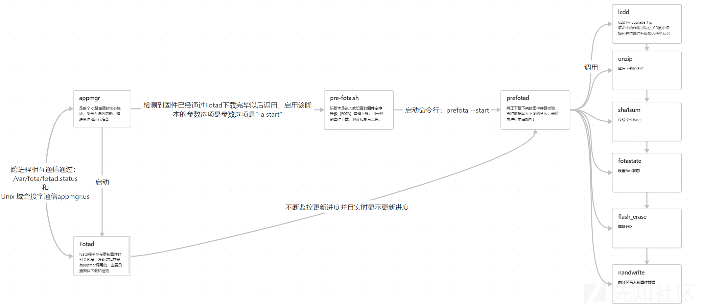

DWR-932的FOTA机制具有一定的安全设计，如固件校验和分区保护，但仍然存在潜在漏洞，值得深入研究。

## **研究目标**

本文的主要目标是：

* **揭示FOTA固件升级的完整流程**：通过逆向分析，探索从固件下载、解包、校验到刷写的详细过程。
* **研究进程间通信机制**：分析`fotad`、`appmgr`、`prefota`等关键组件如何协同工作。
* **分析固件升级的安全性**：查找可能的安全风险，如未加密通信、硬编码密码、权限控制问题等，详见另一篇文章《IoT安全透视：D-Link DWR-932B固件全面逆向分析》
* **积累嵌入式系统逆向经验**：通过实战学习`IDA Pro`、`unyaffs`等工具的使用，提升对路由器固件的分析能力。

最终，希望本文能为物联网设备FOTA机制的安全性研究提供借鉴，并为嵌入式安全研究者提供实用的分析思路和工具使用技巧。

# 二、基础知识

## 2.1 FOTA技术概述

**FOTA的定义**：FOTA（Firmware Over-The-Air），即**固件无线升级**，是一种通过无线通信网络远程更新嵌入式设备固件的软件技术，常用于物联网设备、智能家居设备、汽车电子等领域。

## 2.2 嵌入式固件结构

嵌入式系统固件一般包含以下几个部分：

1. **Bootloader（引导程序）**：

* 负责设备启动和固件加载，如U-Boot、LK（Little Kernel）。
* 在FOTA升级中，Bootloader也负责检测和加载新固件。

2. **系统映像（Kernel + RootFS）**：

* **Kernel（内核）**：操作系统核心，如Linux内核。
* **RootFS（根文件系统）**：包括应用程序、驱动程序、配置文件等。

3. **用户文件系统（User FS）**：

* 存放用户数据和应用配置文件，通常不会在FOTA升级时被覆盖。
* 常见格式：ext4、YAFFS2、UBIFS。

**常见固件文件格式：**

* **YAFFS2（Yet Another Flash File System 2）**

* 主要用于NAND Flash设备，支持掉电保护和坏块管理。
* FOTA升级时，通常解包YAFFS2格式的固件进行分析。

* **UBI/UBIFS**

* 适用于大容量NAND Flash，提供更好的磨损均衡。
* 许多现代嵌入式设备采用UBIFS作为用户文件系统。

* **SquashFS**

* 只读压缩文件系统，节省存储空间，常用于嵌入式Linux系统。

## 2.4 Unix域套接字与进程间通信（IPC）

### **Unix域套接字的基本概念**

Unix域套接字（Unix Domain Socket, UDS）是一种**本地进程间通信（IPC）机制**，类似于TCP/IP套接字，但仅限于本机通信。相比于管道和消息队列，Unix域套接字性能更高，适用于嵌入式系统中的进程交互。

### **Unix域套接字的常见用法**

* **数据传输**：FOTA进程可以通过Unix套接字传递下载进度和升级状态。
* **控制指令**：appmgr可通过Unix套接字向fotad发送启动/停止升级的命令。

### **FOTA中的典型应用**

在DWR-932路由器中，FOTA使用了Unix域套接字`/var/usock/appmgr.us`进行通信：

1. `fotad` **监听** `appmgr.us`

```
    __Unix________________ = qmi_usock_server_open("fotad.us", 0);
    while (1) {
        memset(s, 0, sizeof(s));
        if (qmi_usock_server_recv(__Unix________________, 1, s, 4124) > 0) {
            Log_Message_DF0C("_fota_msg_handle", "msg_id:%d", s[2]);
        }
    }
```

2. `appmgr` **发送指令**

```
    appmgr_msg_broadcast_inner(7, 0, 0);
```

3. `fotad` **解析命令并执行**

```
    if (s[2] == 208) {
        if (s[3] == 529) {
            ::n2 = 2;
        }
    }
```

# 三、固件解包与初步分析

## 3.1 固件获取与解包

**固件下载地址**：<https://ftp.dlink.de/dwr/dwr-932/archive/driver_software/DWR-932_fw_revb_202eu_ALL_multi_20150119.zip>  
**固件解压缩**：[PLC\_1earn/1earn/Security/IOT/固件安全/实验/Dlink\_DWR-932B路由器固件分析.md at master · dbshow/PLC\_1earn](https://github.com/dbshow/PLC_1earn/blob/master/1earn/Security/IOT/%E5%9B%BA%E4%BB%B6%E5%AE%89%E5%85%A8/%E5%AE%9E%E9%AA%8C/Dlink_DWR-932B%E8%B7%AF%E7%94%B1%E5%99%A8%E5%9B%BA%E4%BB%B6%E5%88%86%E6%9E%90.md)

手动解压发现压缩包被加密了：  
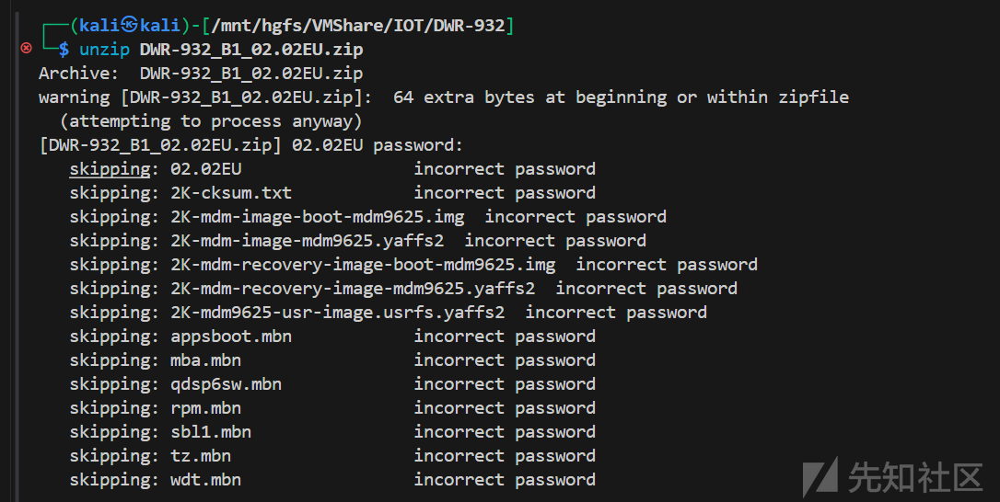

### 方法一;通过fcrackzip进行压缩包密码爆破：

```
 fcrackzip  -u -v -b  fixed.zip
```

解压密码是：beUT9Z

### 方法二:通过逆向分析锁定解压密码：

由于下载的固件是可以被路由器下载并且解压更新的所以程序中一定会将压缩包的压缩密码进行硬编码，所以直接搜索程序中那个地方使用unzip进行解压的时候使用了密码参数就可以锁定了：  
  
直接将prefota拖入IDA查找字符串就可以锁定！  
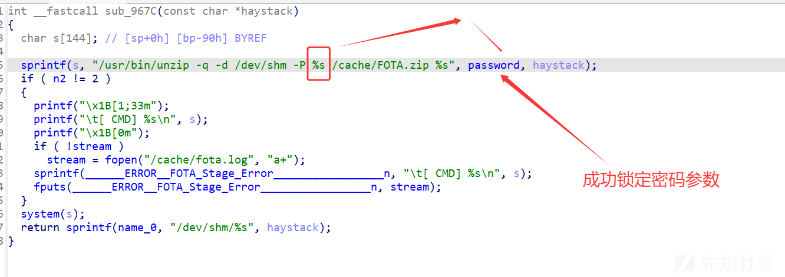  
直接使用交叉引用很快就会发现密码所来自的字段是model\_name：  
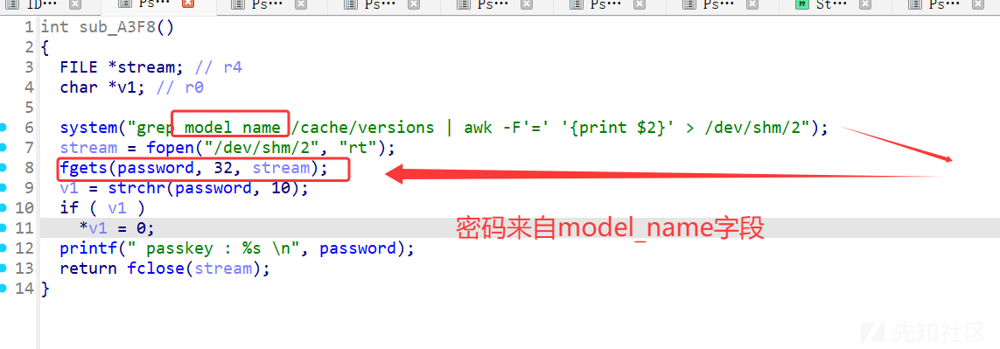

```
┌──(kali㉿kali)-[~/IOT/DWR-932]
└─$ grep -r "model_name"   
```

直接字符串搜索就可以锁定目标！  
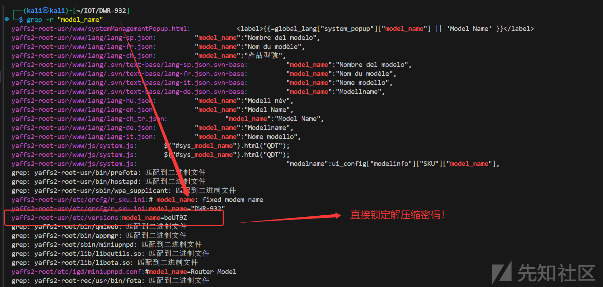  
发现文件大部分都是yaffs直接安装工具进行解压：

```
┌──(kali㉿kali)-[/mnt/hgfs/VMShare/IOT/DWR-932]
└─$ sudo apt install unyaffs
┌──(kali㉿kali)-[/mnt/hgfs/VMShare/IOT/DWR-932]
└─$ sudo unyaffs 2K-mdm-image-mdm9625.yaffs2 ~/IOT/DWR-932/yaffs2-root/
```

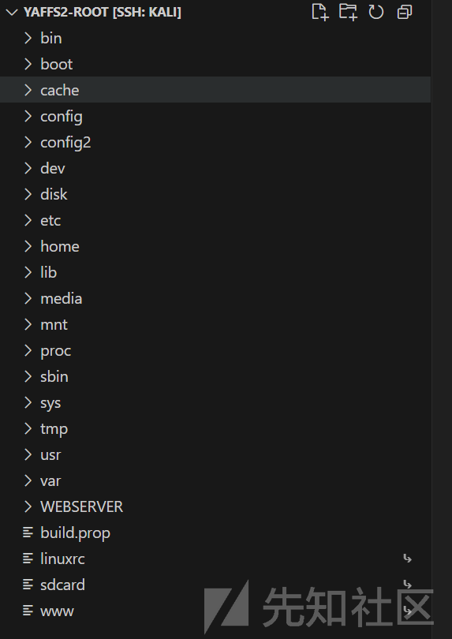

## 3.2 文件系统结构概览

解包出来非常多的文件系统，每个都需要查看，因为不同的文件系统都放置再不同的分区：  
在逆向分析的过程中一开始只查看了2K-mdm-image-mdm9625.yaffs2这个文件系统导致文件不全，浪费了很多时间.

```
┌──(kali㉿kali)-[/mnt/hgfs/VMShare/IOT/DWR-932]
└─$ ls
02.02EU                            2K-mdm-image-boot-mdm9625.img           2K-mdm-recovery-image-mdm9625.yaffs2  DWR-932_B1_02.02EU.zip  mba.mbn      root.hash  tz.mbn
2K-cksum.txt                       2K-mdm-image-mdm9625.yaffs2             appsboot.mbn                          firmwalker.txt          new          rpm.mbn    wdt.mbn
2K-mdm9625-usr-image.usrfs.yaffs2  2K-mdm-recovery-image-boot-mdm9625.img  bin                                   fixed.zip               qdsp6sw.mbn  sbl1.mbn
```

下面对这些以“2K-”开头的文件做个说明，重点解释它们在固件中的作用：

* **2K-mdm-image-mdm9625.yaffs2**  
  这是主固件映像文件，通常包含了调制解调器（modem）系统的核心文件和程序。在逆向 fotad 时发现它调用了 pre-fota.sh 脚本，但该脚本实际上不在这个映像里，而是在用户文件系统映像中。
* **2K-mdm9625-usr-image.usrfs.yaffs2**  
  这是用户文件系统映像，主要存放运行时的配置、脚本和额外的工具（比如 pre-fota.sh 脚本）。这种划分通常是为了区分系统核心和用户/配置数据，使固件升级或恢复时能有不同的处理方式。
* **2K-mdm-image-boot-mdm9625.img 与 2K-mdm-recovery-image-boot-mdm9625.img**  
  这两个文件分别为正常启动和恢复模式下的 bootloader 映像，它们负责在设备开机时加载相应的固件映像。
* **2K-mdm-recovery-image-mdm9625.yaffs2**  
  这是专门用于恢复模式的固件映像，提供一套备用的系统环境，以便在主系统出现问题时进行修复或恢复操作。
* **2K-cksum.txt**  
  这个文件一般用于记录上述固件映像文件的校验和，方便在升级或恢复过程中验证文件完整性，确保固件数据未被破坏或篡改。

总结来说，所有以“2K-”开头的文件都是固件包的重要组成部分，分别负责启动、运行、恢复以及数据完整性校验。仔细看发现 pre-fota.sh 脚本在用户文件系统映像（2K-mdm9625-usr-image.usrfs.yaffs2）中，而在系统映像（2K-mdm-image-mdm9625.yaffs2）中调用该脚本，正体现了固件设计中将核心系统和用户数据分离管理的思想。

# 四、FOTA流程逆向分析

有fota相关知识可知，在加上init里面的shell脚本和字符串upgrade,可以锁定/sbin/fotad程序被用于FOTA固件更新！  
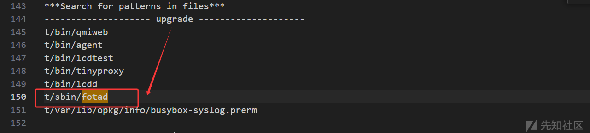

## 4.1 程序入口点分析

start函数与\_libc\_start\_main的调用逻辑。

```
// positive sp value has been detected, the output may be wrong!
void __noreturn start(void (*rtld_fini)(void), int a2, int a3, int a4, ...)
{
  int argc; // [sp-4h] [bp-4h]
  va_list va; // [sp+0h] [bp+0h] BYREF

  va_start(va, a4);
  _libc_start_main(main, argc, va, init, nullsub_1, rtld_fini, va);
  abort();
}
```

这个函数是程序的入口点（`start`），负责初始化程序并调用 `main` 函数。

* `rtld_fini`：指向运行时链接器（RTLD）清理函数的指针，在程序退出时调用。
* `_libc_start_main`：C库的入口函数，负责初始化程序并调用 `main` 函数。其参数包括：

* `main`：程序的主函数。
* `argc`：命令行参数的数量。
* `va`：命令行参数的值（通过 `va_list` 传递）。
* `init`：程序初始化函数（在 `main` 之前调用）。
* `nullsub_1`：可能是一个空函数或占位符。
* `rtld_fini`：运行时链接器（RTLD）的清理函数（在程序退出时调用）。
* `va`：其他参数。

分析一下init初始化函数进行的操作：  
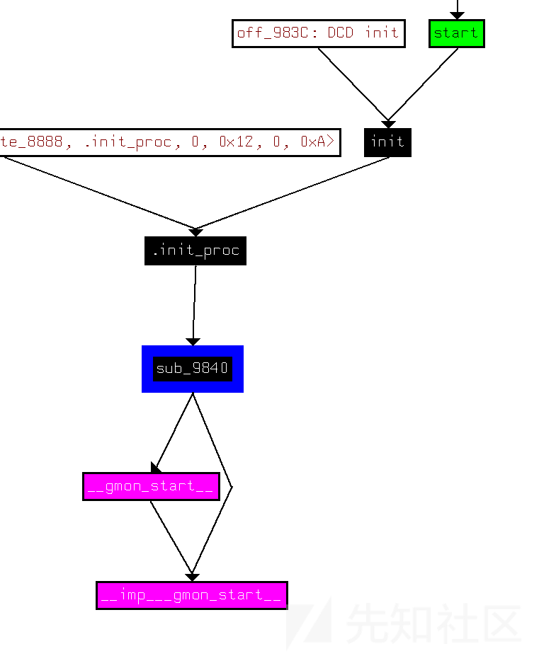

初始化函数（sub\_9840）与性能监控（gmon）的关系。

```
void *sub_9840()
{
  void *result; // r0

  result = &loc_D94C;
  if ( &__gmon_start__ )
    return _gmon_start__();
  return result;
}
```

**在程序启动时，根据是否启用性能分析（gmon）动态选择执行性能分析初始化或默认初始化代码**。

这里的初始化函数是：loc\_D94C  
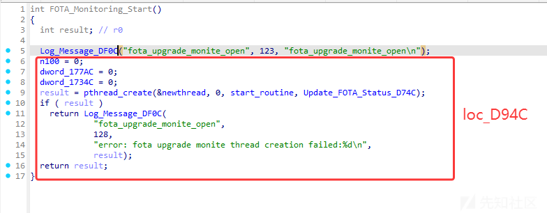  
**启动FOTA监控线程，用于固件升级状态的实时监控，若线程创建失败则记录错误日志**。

```
result = pthread_create(&newthread, 0, start_routine, Update_FOTA_Status_D74C);
```

**实时监控FOTA固件升级状态，从** `/proc/fota/info` **文件中读取升级进度和版本号，并通过回调函数** `Update_FOTA_Status_D74C` **上报状态信息**。

## 4.2 主函数（main）逻辑剖析

```
int __fastcall main(int n2, char **a2, char **a3)
{
  const char *_var_fota_fotad.conf; // r1
  int v6; // r3
  _WORD s[2062]; // [sp+Ch] [bp-1074h] BYREF
  char s_1[88]; // [sp+1028h] [bp-58h] BYREF

  memset(s_1, 0, 0x40u);
  if ( n2 == 2 )                                // 处理命令行参数：若传入参数为2，使用自定义配置文件路径
    _var_fota_fotad.conf = a2[1];
  else
    _var_fota_fotad.conf = "/var/fota/fotad.conf";
  strncpy(s_1, _var_fota_fotad.conf, 0x3Fu);
  puts("FOTA client generic version 1.0");
  Log_Message_DF0C("main", 141, "FOTA daemon version:%s
", "0.0.2");
  if ( chdir("/") < 0 )
  {
    Log_Message_DF0C("main", 176, "EXIT_FAILURE 3
");
    exit(1);
  }
  close(0);
  Log_Message_DF0C("main", 186, "FOTA daemon version:%s
", "0.0.2");
  memset(&s_, 0, 0x258u);
  if ( sub_E038(s_1) == -1 )
  {
    Log_Message_DF0C("main", 192, "FOTA daemon: no config file
");
    exit(0);
  }
  if ( signal(10, handler) == -1 )
    Log_Message_DF0C("main", 197, "ERROR! set callback of SIGUSR1
");
  if ( signal(15, sub_C620) == -1 )
    Log_Message_DF0C("main", 200, "ERROR! set callback of SIGUSR1
");
  if ( access("/var/fota_user", 0) )
  {
    v6 = 1;
    dword_177B4 = 1;
  }
  else
  {
    dword_177B4 = 0;
    unlink("/var/fota_user");
    v6 = dword_177B4;
  }
  Log_Message_DF0C("main", 212, "conf_flag=%d
", v6);
  __Unix________________ = qmi_usock_server_open("fotad.us", 0);//  创建Unix域套接字服务器，用于接收控制命令
  if ( __Unix________________ >= 0 )
  {
    while ( 1 )
    {
      memset(s, 0, sizeof(s));
      if ( qmi_usock_server_recv(__Unix________________, 1, s, 4124) > 0 )
      {
        Log_Message_DF0C("_fota_msg_handle", 42, "msg_id:%d, opt1:%d
", s[2], s[3]);
        if ( s[2] == 208 && (n7 - 9) <= 1 && !::n2 )
        {
          if ( s[3] == 529 )
            ::n2 = 2;
          else
            ::n2 = s[3] == 116;
        }
      }
      sub_E344();                               // 消息处理函数（如解析命令、执行升级）
      if ( n7 == 7 )                            // 退出条件：接收到特定信号（如n7=7）
      {
        qmi_usock_server_close("fotad.us", __Unix________________);
        Log_Message_DF0C("main", 249, "End of fotad!
");
        exit(0);
      }
    }
  }
  Log_Message_DF0C("main", 219, "%s: uscok_create fail
", "main");
  return -1;
}
```

该函数是**FOTA守护进程的主函数**，负责初始化配置、监听控制命令，并根据接收到的命令执行固件升级操作。  
`sub_E344`：消息处理函数，负责解析命令和执行升级操作，需分析其实现以了解核心升级逻辑。

```
int sub_E344()
{
    // 必要的状态变量声明
    int n7;           // 当前状态
    int n7_0;         // 错误代码
    int n10;          // 重试计数
    int n10_0;        // 下载重试计数
    int n2;           // 用户确认状态
    char s_[128];     // FOTA状态结构体
    char dest[128];   // 目标版本信息
    char s[128];      // 下载URL或路径
    char s_3[128];    // 文件路径
    char s_0[80];     // 恢复下载信息

    switch (n7)
    {
    case 0: // 初始化状态
        // 功能：初始化FOTA进程并切换到空闲状态
        Log_Message_DF0C("fota_state_process", 267, "FOTA_STATE_INITIAL
");
        n7 = 1; // 切换到空闲状态
        update_fota_progress_status(&s_); // 更新进度状态
        return n7;

    case 1: // 空闲待命状态
        // 功能：等待升级指令或检查固件更新
        if (n49 == 49) // 检查是否收到升级指令
        {
            n7 = 4; // 切换到升级状态
            Log_Message_DF0C("fota_state_process", 277, "state = FOTA_STATE_UPGRADING
");
            n7_0 = 0; // 错误代码清零
            Log_Message_DF0C("fota_state_process", 279, "err_no = FOTA_ERR_NO_ERROR
");
            memset(&s__0, 0, 0x80u); // 清空恢复信息
            update_fota_progress_status(&s_);
            return n7;
        }
        else // 检查固件更新
        {
...
        }

    case 2: // 固件信息检查状态
...

    case 3: // 固件下载状态
...

    case 4: // 固件升级状态
        // 功能：执行固件升级操作
        Log_Message_DF0C("fota_state_process", 842, "FOTA_STATE_UPGRADING
");
        update_fota_percentage(1); // 更新进度为1%
        Log_Message_DF0C("fota_state_process", 847, "FOTA_STATE_UPGRADING[%s]
", name_0);
        update_lcd_and_handle_file(302, 0, 0); // 更新LCD显示
        n7 = 5; // 切换到完成状态
        Log_Message_DF0C("fota_state_process", 897, "fota_update_process OK state = FOTA_STATE_FINISH
");
        update_fota_progress_status(&s_);
        sleep(3); // 等待3秒
        return n7;

    case 5: // 完成状态
        // 功能：升级完成后的处理
        Log_Message_DF0C("fota_state_process", 909, "FOTA_STATE_FINISH
");
        if (s_ == 1) // 守护进程模式
        {
            n7 = 1; // 切换到空闲状态
            Log_Message_DF0C("fota_state_process", 918, "FOTA_DAEMON_MODE state = FOTA_STATE_IDLE
");
            if (dword_17704 == 1) // 强制升级完成
            {
                time(&timer_); // 获取当前时间
                update_shared_memory_status(&s_); // 更新共享内存状态
            }
        }
        else // 单次模式
        {
            n7 = 7; // 切换到退出状态
            Log_Message_DF0C("fota_state_process", 931, "FOTA_SINGLE_MODE state = FOTA_STATE_EXIT
");
        }
        update_fota_progress_status(&s_);
        return n7;

    case 6: // 终止状态
...
    case 8: // 等待网络状态
...

    case 9: // 配置下载状态
..

    case 10: // 配置升级状态
...

    default:
        return n7; // 默认返回当前状态
    }
}
```

sub\_E344 函数是FOTA（Firmware Over-The-Air，固件无线升级）更新过程中的核心状态管理函数，通过状态机机制（switch 语句）协调和管理固件升级的各个阶段。

* **case 4: 固件升级状态**

* **作用**：执行固件安装。
* **操作**：更新进度为1%，记录日志，更新LCD显示，完成后切换到完成状态（n7 = 5），并等待3秒。

* **case 5: 完成状态**

* **作用**：处理升级完成后的后续步骤。
* **操作**：根据模式（守护进程或单次）切换到空闲（n7 = 1）或退出状态（n7 = 7），并更新共享内存状态。

继续逆向分析如何才能找到固件下载完成后如何对固件进行操作的函数，可以继续看下这个函数：

```
int __fastcall update_fota_progress_status(const char *s_1)
{
...

  update_shared_memory_status(s_1);
  s_3 = fopen("/var/fota/fotad.status", "wb+");
  s_2 = s_3;
  if ( !s_3 )
    return 0;
  sub_FA64(s_3, 1);
  memset(s, 0, sizeof(s));
  sprintf(s, "%s=%i
", "FOTA_PROCESS_WORK_STATUS", *s_1);
  n = strlen(s);
  fwrite(s, 1u, n, s_2);
  memset(s, 0, sizeof(s));
  sprintf(s, "%s=%i
", "FOTA_PROCESS_STATE", *(s_1 + 2));
  n_1 = strlen(s);
  fwrite(s, 1u, n_1, s_2);
  memset(s, 0, sizeof(s));
  sprintf(s, "%s=%i
", "FOTA_PROCESS_ERROR", *(s_1 + 107));
  n_2 = strlen(s);
  fwrite(s, 1u, n_2, s_2);
  memset(s, 0, sizeof(s));
  n_3 = strlen(off_17168[*(s_1 + 107)]);        // "no error."
  memcpy((s_1 + 432), off_17168[*(s_1 + 107)], n_3);// "no error."
  sprintf(s, "%s=%s
", "FOTA_PROCESS_ERROR_MSG", s_1 + 432);
  n_4 = strlen(s);
  fwrite(s, 1u, n_4, s_2);
  memset(s, 0, sizeof(s));
  sprintf(s, "%s=%i
", "FOTA_PROCESS_DW_PERCENT", *(s_1 + 141));
  n_5 = strlen(s);
  fwrite(s, 1u, n_5, s_2);
  memset(s, 0, sizeof(s));
  sprintf(s, "%s=%i
", "FOTA_PROCESS_UP_PERCENT", *(s_1 + 142));
  n_6 = strlen(s);
  fwrite(s, 1u, n_6, s_2);
  memset(s, 0, sizeof(s));
  sprintf(s, "%s=%i
", "FOTA_FILE_TYPE", *(s_1 + 145));
...
  memcpy(dest, src, sizeof(dest));
  qmi_usock_msg_sendto(0, 76, v23, 92, 196, "appmgr.us");
  return 1;
}
```

该函数的主要功能是**记录并上报FOTA（固件无线升级）过程中的状态信息**，具体包括工作状态、错误码、下载/上传进度等，并将这些信息写入状态文件后通过消息机制发送给应用管理器。其核心操作可分解为：

1. **状态文件记录**：打开`/var/fota/fotad.status`文件，将FOTA进程的工作状态（如错误信息、进度百分比等）以键值对形式写入文件
2. **状态数据通信**：通过`qmi_usock_msg_sendto`向"appmgr.us"发送包含状态数据的消息，实现进程间通信

我们可以发现程序通过进程通信与其他程序进行交互来完成整个升级过程，可以根据`/var/fota/fotad.status`文件，或者appmgr.us来寻找目标，找到之后就可以开始逆向分析快进程交互管理模块appmgr：  
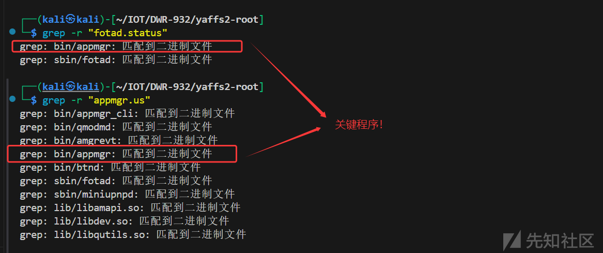

# 五、跨进程交互与模块管理

## 5.1 主控程序（appmgr）的角色

直接将bin/appmgr拖入IDA中！  
直接阅读这整个main函数的代码：

```
int __fastcall main(int argc, const char **argv, const char **envp)
{
  // [COLLAPSED LOCAL DECLARATIONS. PRESS NUMPAD "+" TO EXPAND]

  sig = 0;                                      //  模块1：初始化和清理
  if ( !access("/etc/rc0.d/K80qmuxd", 0) && !access("/etc/qdt_rc0clean.sh", 0) )
  {
    am_comprintf(1, 0, 0, "APPMGR: RC_CLEAN!!!
");
    system("chmod +x /etc/qdt_rc0clean.sh");
    system("/etc/qdt_rc0clean.sh");
  }
....
  pthread_mutex_init(&mutex_, 0);               // 初始化互斥锁 
  if ( time(0) <= 1293839999 )                  // 检查系统时间是否正确，若不正确则重置时间 
  {
    am_comprintf(1, 0, 0, "APPMGR: TimeSkew...DoTimeReset!!!!
");
    system("date -s 2012.01.01-00:00:00");
  }
  s = fopen("/proc/sys/net/unix/max_dgram_qlen", "wt");
  if ( s )
  {
    fwrite("20", 1u, 2u, s);
    fclose(s);
  }

  // ;0x2 -> SOCK_DGRAM                       //模块2：套接字和信号处理
  fd = socket(1, 2, 0);
  if ( fd <= 0 )
  {
    gAM_usock_fd = -1;
  }
  else
  {
    addr[0].sa_family = 1;
    sprintf(addr[0].sa_data, "%s/%s", "/var/usock", "appmgr.us");//  创建 unix 域套接字 
    if ( bind(fd, addr, 0x6Eu) >= 0 )
      goto LABEL_20;
    if ( connect(fd, addr, 0x6Eu) )
    {
      if ( unlink(addr[0].sa_data) < 0 )
      {
        am_comprintf(1, "appmgr_uscok_create", 1628, "Error removing old socket
");
        gAM_usock_fd = -3;
      }
      else
      {
        if ( bind(fd, addr, 0x6Eu) >= 0 )   
        {
...
          am_comprintf(1, 0, 0, "UDPLOG: init(%d)...
", fd);
          if ( fd < 0 )
          {
            v12 = am_comprintf(1, "appmgr_udplog_init", 2026, "UDPLOG: sockopen fail
");
          }
          else
          {
...
          }

        //模块3：模块初始化和启动
          appmgr_shm_init(v12);                 // 初始化共享内存
          am_comprintf(1, 0, 0, "APPMGR: Init...
");
          am_comprintf(1, 0, 0, "APPMGR: AMAPI init...
");
          v13 = uiIPC_lib_init("appmgr", 0, 15);// 初始化IPC库
          v14 = appmgr_proc_initialize(v13);
          cfgs_init(v14);
          v15 = &dword_82AC0;
          while ( 1 )
          {
            v17 = v15[1];
            ++v15;
            v16 = v17;
            if ( !v17 )
              break;
            if ( *(v16 + 4) )
            {
              am_comprintf(1, 0, 0, "APPMGR: init mod[%d]
", *v16);
              (*(v16 + 4))(0);//调用模块初始化函数
            }
          }
          v18 = am_comprintf(1, 0, 0, "APPMGR: Daemon Startup...
");
          appmgr_daemon_startup(v18);           // 启动守护进程
          am_comprintf(1, 0, 0, "APPMGR: Startup...
");
          v19 = &dword_82AC0;
          while ( 1 )
          {
            v21 = v19[1];
            ++v19;
            v20 = v21;
            if ( !v21 )
              break;
            if ( *(v20 + 8) )
            {
              am_comprintf(1, 0, 0, "APPMGR: startup mod[%d]
", *v20);
              (*(v20 + 8))(0);//调用模块启动函数
            }
          }
          am_comprintf(1, 0, 0, "APPMGR: Ready...
");
          appmgr_msg_broadcast_inner(7, 0, 0);
          am_comprintf(1, 0, 0, "APPMGR: WorkingLoop...
");// 开始主工作循环
          dword_7E180 = 0;
          appmgr_msg_broadcast_inner(79, 0, 0);
          //模块4：主工作循环
          ptr = malloc(0x2000u);

                errnum = *_errno_location();
                v38 = strerror(errnum);
                am_comprintf(1, 0, 0, "APPMGR: wait error(%d,%s)
", errnum, v38);
              }
              else
              {
                sub_116F8();
                dword_8413C = time(0);
              }
....
}
```

简化以后的伪代码：

* **模块1**：负责程序的初始设置，包括清理旧文件、创建目录、保存进程ID、初始化互斥锁和校正系统时间。
* **模块2**：创建并管理UNIX域套接字和UDP套接字，设置信号处理和qfmon初始化。
* **模块3**：初始化共享内存、IPC库、进程管理和配置，并逐一启动各个模块。
* **模块4**：主循环使用select监控文件描述符，处理UDP数据、qfmon事件和进程事件，同时执行看门狗检查。
* **模块5**：处理程序关闭逻辑，包括广播消息、销毁资源、关闭套接字和清理内存。

我们需要重点关心的模块是模块3：可以去看看具体的伪代码：  
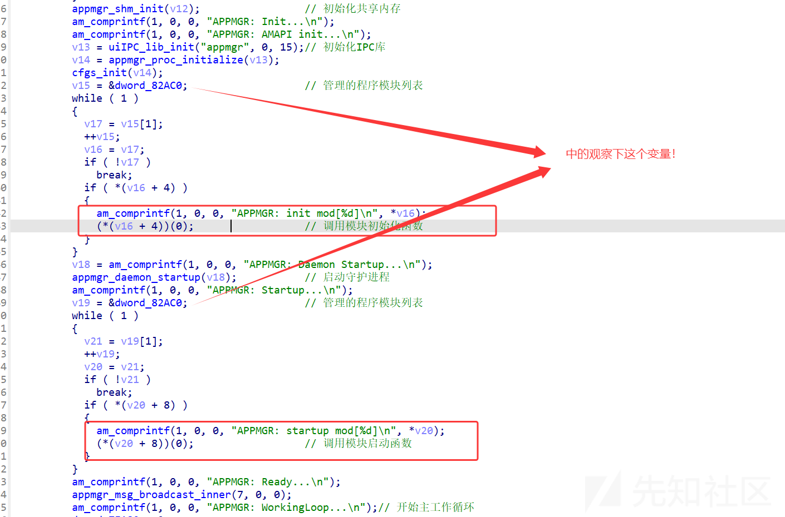  
这段代码是应用程序管理器（appmgr）的核心初始化部分，负责系统的启动、模块管理和运行准备。  
我们可以根据变量去查看一下他具体管理了哪一些程序！  
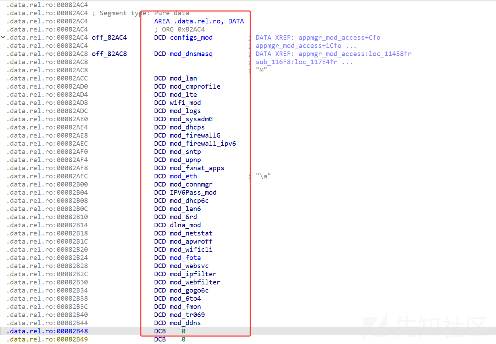  
模块列表定义在.data.rel.ro:00082AC4至.data.rel.ro:00082B48，包括以下功能模块：

* configs\_mod：配置模块
* mod\_dnsmasq：DNS和DHCP服务
* mod\_lan：局域网管理
* mod\_cmprofile：连接管理配置文件
* mod\_lte：LTE网络管理
* wifi\_mod：WiFi管理
* mod\_logs：日志管理
* mod\_sysadmG：系统管理
* mod\_dhcps：DHCP服务器
* mod\_firewallG：防火墙
* mod\_firewall\_ipv6：IPv6防火墙
* mod\_sntp：网络时间协议
* mod\_upnp：通用即插即用
* mod\_fwnat\_apps：防火墙NAT应用
* mod\_eth：以太网管理
* mod\_connmgr：连接管理器
* IPV6Pass\_mod：IPv6穿透
* mod\_dhcp6c：DHCPv6客户端
* mod\_lan6：IPv6局域网管理
* mod\_6rd：6rd隧道
* dlna\_mod：DLNA媒体服务
* mod\_netstat：网络状态监控
* mod\_apwroff：AP电源管理
* mod\_wificli：WiFi客户端
* mod\_fota：固件在线升级
* mod\_websvc：Web服务
* mod\_ipfilter：IP过滤
* mod\_webfilter：Web过滤
* mod\_gogo6c：gogo6客户端
* mod\_6to4：6to4隧道
* mod\_fmon：文件监控
* mod\_tr069：TR-069远程管理
* mod\_ddns：动态DNS

我们主要是分析mod\_fota：固件在线升级模块的功能继续查看！  
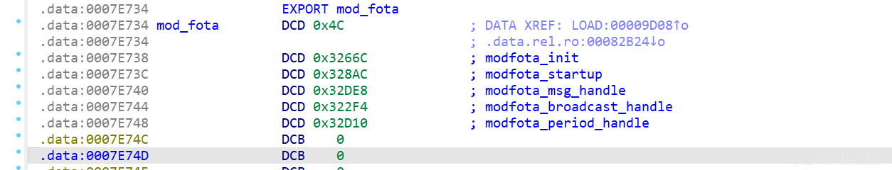

## 5.2 fotad与appmgr的交互

数据接收（recv）与消息处理（appmgr\_ev\_process）和modfota\_msg\_handle函数的FOTA命令处理逻辑。

发现关键部分：

```
            ptr = ptr;
            n27 = recv(fd, ptr, 0x101Cu, 16448);// 从文件描述符 fd 中接收数据，数据存储到 ptr 指向的内存中，最多接收 0x101C 字节（4140字节），返回实际接收的字节数。
...
          am_comprintf(2, "main", 959, "APPMGR: MSG-Proc[%hu->%hu] Start[%u]
", v43, v44, v45);
          v46 = ptr[2];
          if ( ((v46 - 193) << 16) <= 0x10000 ) //  代码的核心部分是处理传入的消息。首先，它通过 v46 判断消息的类型或ID
          {
            appmgr_ev_process(ptr);             // 然后决定是直接调用事件处理函数 appmgr_ev_process(ptr) 处理该消息
          }
          else
          {
            v47 = &dword_82AC0;                 // 还是通过查找一个函数表来动态选择消息处理函数。
            do
            {
              v49 = v47[1];
              ++v47;
              v48 = v49;
              if ( !v49 )
              {
                am_comprintf(
                  1,
                  "appmgr_msg_process",
                  1437,
                  "APPMGR: dst(%hd) msg_handle(id=%hu) not found
",
                  ptr[1],
                  v46);
                goto LABEL_108;
              }
            }
            while ( !v48[3] || *v48 != ptr[1] );
            appmgr_flog("MsgHdl:[%hu->%hu] Op1[%hu] In
", *ptr, ptr[1], ptr[3]);
            (v48[3])(ptr, ptr + 14, ptr[5]);    // 执行找到的消息处理函数，传入指针和消息的相关数据。
            appmgr_flog("MsgHdl:[%hu->%hu] Op1[%hu] Out
", *ptr, ptr[1], ptr[3]);
```

根据前面逆向分析的结果我们可以知道网络数据传输被被绑定到了Unix 域套接字 `fd` 中：

```
fd = socket(1, 2, 0);  // 创建套接字
sprintf(addr[0].sa_data, "%s/%s", "/var/usock", "appmgr.us");  // 设置套接字地址
bind(fd, addr, 0x6Eu);  // 绑定套接字到指定的路径
```

**Unix 域套接字（Unix Domain Socket）连接：** 根据代码的上下文，在之前的代码部分，程序通过 `socket` 和 `bind` 创建了一个 Unix 域套接字，套接字路径为 `/var/usock/appmgr.us`。如果套接字没有被占用，它会被绑定并用于进程间通信（IPC）。

`n27 = recv(fd, ptr, 0x101Cu, 16448);` 这一行从 Unix 域套接字 `fd` 中接收最多 4140 字节的数据，并将接收到的数据存储到 `ptr` 中。数据来源于其他进程通过同一套接字发送的消息，用于进程间通信（IPC）。

这里又回到了fotad运行时候会将运行的数据传入appmgr.us文件中，通过该文件实现了进程通信！  
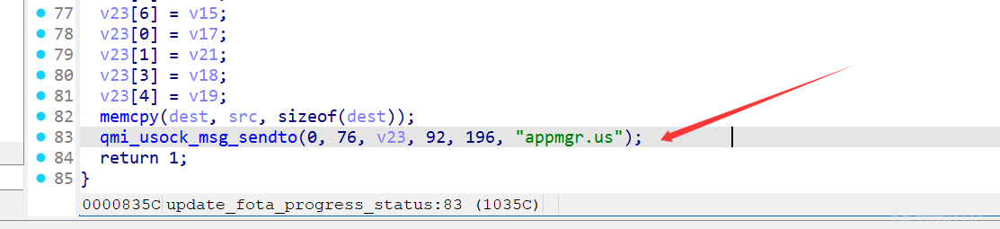  
现在找到了将appmgr程序发现他是该路由器的一个主控程序，并且找到了appmgr与fotad进程的跨进程通信的交互代码，由此可以继续分析出固件是如何更新的！

根据这个代码我们可以找到会被主动调用的fotad的主要功能：

```
(v48[3])(ptr, ptr + 14, ptr[5]);    // 执行找到的消息处理函数，传入指针和消息的相关数据。
```

发现会调用模块表中某一模块的第4个值：  
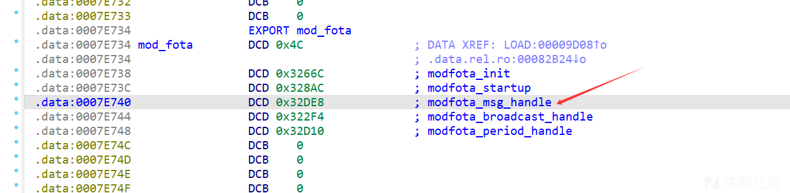

该函数 `modfota_msg_handle` 主要处理与 FOTA（固件空中升级）相关的消息。根据接收到的消息 ID，它会根据不同的情况执行不同的操作，例如获取固件升级状态、执行固件升级、准备升级、获取磁盘空间等。它还与系统状态进行交互，记录日志，并向其他模块或进程发送回馈。  
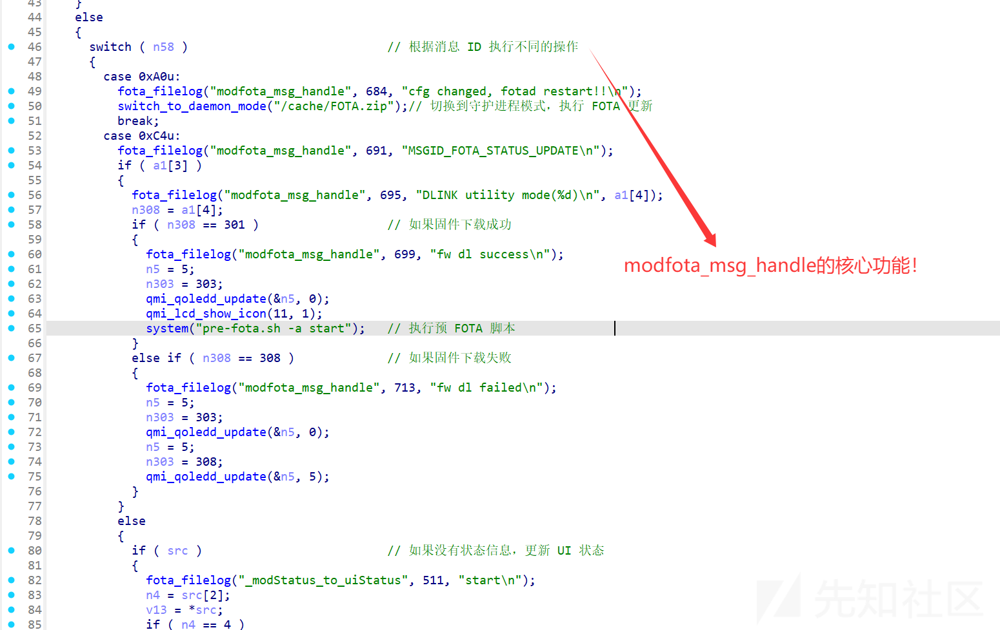

接下来就可以继续了！

# 六、固件升级执行流程

## 6.1 前置脚本：pre-fota.sh

参数解析与模式切换（prepare/start）和调用prefota执行升级准备与触发。  
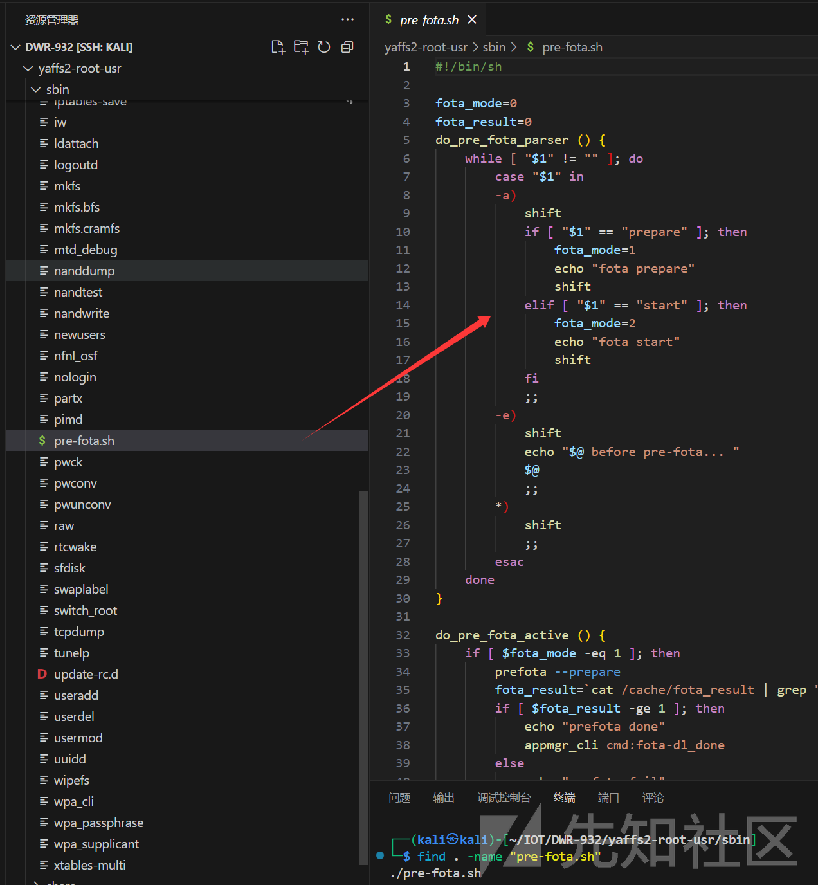  
pre-fota.sh脚本的内容：

```
#!/bin/sh  # 指定使用 `/bin/sh` 作为解释器

# 初始化 FOTA（Firmware Over-The-Air，固件空中升级）模式和结果变量
fota_mode=0    # FOTA 模式，默认为 0
fota_result=0  # FOTA 结果，默认为 0

# 解析 FOTA 相关的命令行参数
do_pre_fota_parser () {
    while [ "$1" != "" ]; do  # 遍历所有传入的参数
        case "$1" in
        -a)  # 处理 `-a` 选项
            shift  # 移动到下一个参数
            if [ "$1" == "prepare" ]; then  # `-a prepare` 表示准备 FOTA
                fota_mode=1
                echo "fota prepare"
                shift  # 跳过当前参数
            elif [ "$1" == "start" ]; then  # `-a start` 表示开始 FOTA
                fota_mode=2
                echo "fota start"
                shift  # 跳过当前参数
            fi
            ;;
        -e)  # 处理 `-e` 选项，执行额外命令
            shift
            echo "$@ before pre-fota... "  # 打印执行的命令
            $@  # 运行传入的命令
            ;;
        *)  # 忽略其他参数
            shift
            ;;
        esac
    done
}

# 执行 FOTA 相关操作
do_pre_fota_active () {
    if [ $fota_mode -eq 1 ]; then  # 如果 FOTA 模式为 1（prepare）
        prefota --prepare  # 执行 `prefota` 命令，进行 FOTA 预处理
        # 检查 `/cache/fota_result` 是否包含 "SUCCESS"
        fota_result=`cat /cache/fota_result | grep "SUCCESS" | wc -l`
        if [ $fota_result -ge 1 ]; then  # 如果成功标志存在
            echo "prefota done"
            appmgr_cli cmd:fota-dl_done  # 通知应用管理器 FOTA 下载完成
        else
            echo "prefota fail"
            appmgr_cli cmd:fota-dl_fail  # 通知应用管理器 FOTA 下载失败
        fi
    elif [ $fota_mode -eq 2 ]; then  # 如果 FOTA 模式为 2（start）
        prefota --start  # 启动 FOTA 更新
    else
        prefota  # 默认执行 `prefota`
    fi
}

# 解析传入的参数
do_pre_fota_parser $@

# 执行 FOTA 相关操作
do_pre_fota_active
```

1. **功能定位**  
   该脚本是嵌入式设备的**固件空中升级（FOTA）管理工具**，用于控制固件下载、验证和刷写流程。
2. **核心操作**  
   支持两种关键参数：

* `-a prepare`：**预下载固件**并验证（检查`/cache/fota_result`中的`SUCCESS`标志），通过`appmgr_cli`通知应用管理器结果；
* `-a start`：**触发固件升级**（调用`prefota --start`），完成固件写入和设备重启。

3. **设计特性**  
   通过事件驱动机制（如`fota_mode`状态变量）分离准备与执行阶段，确保升级流程可控；内置日志输出（如`prefota done/fail`）便于调试。

当脚本以 `-a start` 参数启动时，`do_pre_fota_parser` 函数通过 `case` 语句匹配 `-a` 选项，并将 `fota_mode` 设置为 `2`  
调用 `do_pre_fota_active` 函数，根据 `fota_mode=2` 执行以下操作：

```
prefota --start # 启动固件升级核心流程
```

## 6.2 核心升级程序：prefota

prefota --start的逆向分析和调用flash\_erase和nandwrite完成固件刷写。  
将prefota拖入IDA后可以很快得到需要的数据：

```
int __fastcall main(int a1, const char **a2, char **a3)
{
  // [COLLAPSED LOCAL DECLARATIONS. PRESS NUMPAD "+" TO EXPAND]

  v4 = a2;
  s1 = basename(*a2);
  system("clear");
  if ( !strcmp(s1, "prefota") )
  {
    printf("ACTION : prefota!! %s
", "09:19:13");
    dword_CB04 = 0;
  }
  if ( !strcmp(s1, "fota") )
  {
    printf("ACTION : fota !! %s
", "09:19:13");
    dword_CB04 = 1;
  }
  if ( a1 > 1 )
  {
    v6 = 1;
    do
    {
      s1_1 = v4[1];
      ++v4;
      v8 = strcmp(s1_1, "--prepare") == 0;
      s1_2 = s1_1;
      if ( v8 )
      {
        n2 = 1;
      }
      else if ( !strcmp(s1_2, "--start") )
      {
        n2 = 2;
      }
      ++v6;
    }
    while ( v6 != a1 );
  }
  v10 = sub_97E8();                             // 获取 MTD 设备的 OOB（Out-of-Band）大小
  v11 = sub_A018(v10);                          // 获取 prod_id，提取 prod_id 并打印
  v12 = sub_A3F8(v11);                          // 提取 model_name 并打印，获取更新固件的压缩包密码
  v13 = sub_A248(v12);                          // 关闭 CPU 的省电模式，强制保持高性能。
  system_(v13);                                 // 获取 FOTA.zip 内容列表，"/usr/bin/zipinfo -1 /cache/FOTA.zip > /dev/shm/3"
  v14 = sub_881C();                             // 解压文件并且获得2K-cksum.txt文件中的校验信息
  v15 = v14;
  if ( v14 )
  {
    printf("get_cksum rCode = %d
", v14);
    goto LABEL_22;
  }
  if ( dword_CB04 )
  {
LABEL_16:
    v16 = sub_A3B4(v14);                        // 此函数用于在固件升级（FOTA）过程中控制 OLED 显示屏的交互与升级进程，通过屏幕反馈升级状态，并在设备初始化失败时触发备用错误处理逻辑。
    v15 = sub_9CAC(v16);                        // 由于dword_CB04是0，将固件更新包里面的文件全部加载更新
                                                // 函数的作用是根据当前阶段（主升级或预升级）更新特定的文件（如 appsboot.mbn 或 mdm-recovery-image），并验证解压后的文件完整性，执行闪存写入操作并记录日志。
    v17 = printf("rCode = %d
", v15);
    if ( dword_CB04 == 1 )
      sub_A468(v17);                            // 该函数的作用是删除 /cache/bmp 目录及其内容，并在 /cache/tmp 目录存在时删除该目录。
    if ( !v15 )
      goto LABEL_19;
LABEL_22:
    sub_9290(v15);                              // 该函数是固件升级（FOTA）的异常处理模块，在预升级或主升级阶段发生错误时，记录详细错误日志、标记升级失败状态（FAILED），并强制重启设备以恢复系统安全状态。
    return 0;
  }
  if ( n2 != 2 )
  {
    v14 = sub_A4C4();                           // 此函数用于按日期归档固件升级日志文件（/cache/fota.log ），防止日志覆盖丢失，便于后续问题追踪。
    goto LABEL_16;
  }
LABEL_19:
  sub_8AD0();                                   // 此函数是固件升级（FOTA）的最终阶段控制器，根据升级状态（dword_CB04）执行日志记录、状态标记与设备重启操作，确保升级流程闭环。
  return 0;
}
```

该代码是FOTA（固件无线更新）的主控制程序，根据命令行参数（`prefota`/`fota`和`--prepare`/`--start`）控制固件更新的预升级（Pre-FOTA）和主升级（FOTA）流程.

### **FOTA流程全貌**

通过分析上述函数，可还原FOTA更新的核心流程：

1. **预升级（Pre-FOTA）**：

* 目标：验证固件包兼容性，避免主分区损坏。
* 操作：仅更新非关键分区（如`mdm-recovery-image`），不覆盖主引导程序。

2. **主升级（FOTA）**：

* 目标：完成最终固件更新。
* 操作：写入关键分区（如`aboot`），触发重启后由Bootloader验证新固件。

3. **异常处理**：

* 若主升级失败，通过`sub_9290`清理脏数据，并依赖Bootloader的备份分区恢复系统。

### **详细深入FOTA更新流程**

#### **1.**`sub_9CAC`**（核心升级执行函数）**

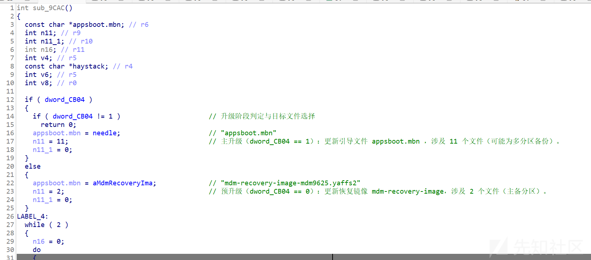

* **作用**：根据`dword_CB04`标志（0=预升级，1=主升级），选择性地将固件包中的文件（如`appsboot.mbn`，或文件系统mdm-recovery-image ）写入目标分区，并执行闪存操作和日志记录。
* **关键流程**：

* **分区映射**：确定写入目标（如`aboot`分区对应`appsboot.mbn` ）。
* **闪存写入**：调用底层接口（如MTD驱动）将解压后的固件镜像写入存储设备。
* **完整性验证**：在写入后二次校验文件哈希，确保无传输或写入错误。

* **分析价值**：该函数直接关联固件更新的核心硬件操作（如分区覆盖），其错误处理逻辑可能导致设备变砖或启动失败。

更加详细的解析：

```
int sub_9CAC()
{
...

  if ( dword_CB04 )
  {
    if ( dword_CB04 != 1 )                      // 升级阶段判定与目标文件选择
      return 0;
    appsboot.mbn = needle;                      // "appsboot.mbn"
    n11 = 11;                                   // 主升级（dword_CB04 == 1）：更新引导文件 appsboot.mbn ，涉及 11 个文件（可能为多分区备份）。
    n11_1 = 0;
  }
  else
  {
    appsboot.mbn = aMdmRecoveryIma;             // "mdm-recovery-image-mdm9625.yaffs2"
    n11 = 2;                                    // 预升级（dword_CB04 == 0）：更新恢复镜像 mdm-recovery-image，涉及 2 个文件（主备分区）。
    n11_1 = 0;
  }
LABEL_4:
  while ( 2 )
  {
    n16 = 0;
    do
    {
      v4 = n16 << 7;
      haystack = &check_sum + 0x80 * n16++;
      if ( strstr(haystack, appsboot.mbn) )     // 检查当前条目是否包含目标文件名
      {
...
        sub_967C(haystack);                     // 从压缩包内解压出文件指定文件，每次循环解压一个
...
        v6 = (sub_9750)(&check_sum + v4);       // 通过sha1sum教育解压出来的文件hash值是否正确
...
        v6 = sub_9BE0(haystack);                // 该函数的作用是根据给定的文件名查找对应的分区，并执行闪存擦除和写入操作，同时记录日志。
       ....
    return 0;
  }
}
```

该函数 `sub_9CAC` 是 **FOTA升级的核心执行模块**，根据全局标志 `dword_CB04` 区分 **预升级（Pre-FOTA）** 和 **主升级（FOTA）** 阶段，完成固件文件的解压、哈希校验与分区写入操作，确保关键组件（如引导程序或恢复镜像）的安全更新。

#### **2.**`sub_9868`**(升级中固件文件写入闪存（MTD设备）的核心模块)**

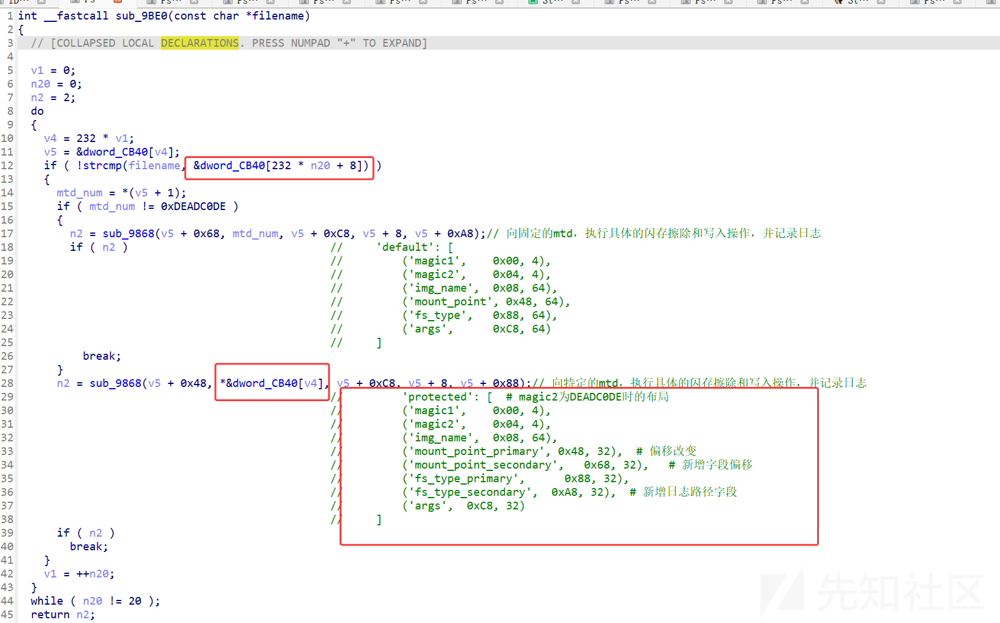  
该函数 `sub_9BE0` 是 **FOTA升级中固件文件写入闪存（MTD设备）的核心模块**，根据文件名匹配预定义的分区配置表（结构体），调用底层接口完成 **闪存擦除与写入操作**，并支持 **多分区保护模式**（如A/B分区冗余设计）和 **日志记录**，确保固件正确刷入目标硬件分区。

##### sub\_9868函数的精简操作

```
int __fastcall sub_9868(
    const char *partition_name,
    int mtd_num,
    const char *mount_options,
    const char *fs_state,
    const char *log_path)
{
  char command[128]; 
  char s_1[128]; 
  char s[96]; 
 
  // 1. 生成分区擦除命令（如 flash_erase /dev/mtd3 0 0）
  sprintf(command, "flash_erase /dev/mtd%d 0 0", mtd_num);
 
  // 2. 生成镜像写入命令（根据参数选择不同模式）
  if (!strcmp(mount_options, "-a -S")) {
    // 安全模式（带校验参数和块数 n64）
    sprintf(s_1, "nandwrite -q %s %d /dev/mtd%d /dev/shm/%s", 
            mount_options, n64, mtd_num, fs_state);
  } else {
    // 普通模式（仅传递挂载选项）
    sprintf(s_1, "nandwrite -q %s /dev/mtd%d /dev/shm/%s", 
            mount_options, mtd_num, fs_state);
  }
 
  // 3. 生成状态更新命令（如 fotastate set /cache/fota_status）
  sprintf(s, "fotastate set %s", log_path);
 
  // 4. 执行命令序列 
  system(s);        // 设置升级状态 
  system(command);  // 擦除目标MTD分区 
  system(s_1);      // 将/dev/shm下的临时文件写入分区 
 
  return 0;
}
```

1. **命令生成逻辑**

* **擦除命令**：`flash_erase /dev/mtdX 0 0`

* `X`为`mtd_num`指定的分区编号，`0 0`表示擦除整个分区。

* **写入命令**：`nandwrite`参数差异

* **安全模式** (`-a -S`)：附加块数`n64`（可能用于ECC校验或预留空间）。
* **普通模式**：直接写入解压到`/dev/shm`的固件文件（如`appsboot.mbn` ）。

2. **执行顺序**

* **状态标记** → **分区擦除** → **数据写入**，确保原子性操作：

* 若擦除后写入失败，设备可通过Bootloader检测到未完成状态并触发回滚。

3. **关键路径依赖**

* `/dev/shm/`为内存临时目录，避免因突然断电导致半写入状态的文件残留。
* `fotastate`为自定义状态管理工具，用于标记升级进度（如`SUCCESS`/`FAILED`）。

##### 逆向分析预定义的分区配置表（结构体）

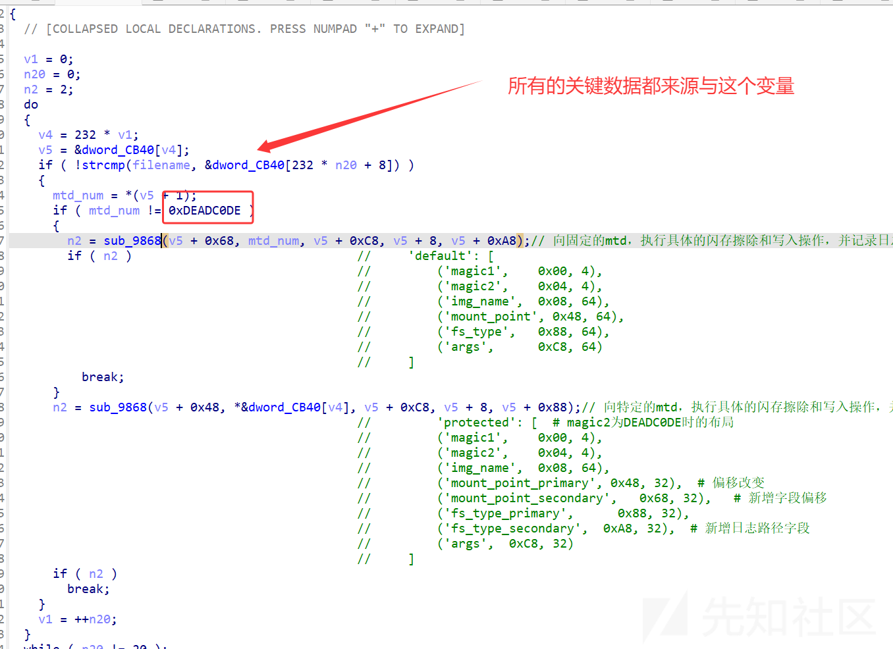  
我们也可以直接进入去查看：  
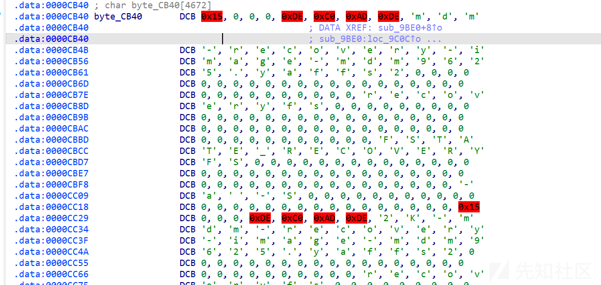  
直接根据前面的偏移可以逆向分析出这个结构体的数据，使用idapython打印出来：

```
import idc
import idautils
import idaapi
import json
from collections import OrderedDict

# 基本结构体参数
ENTRY_SIZE = 232
MAGIC2_PROTECTED = 0xDEADC0DE

# 两种结构体布局配置
FIELD_CONFIGS = {
    'default': [
        ('magic1',    0x00, 4),
        ('magic2',    0x04, 4),
        ('img_name',  0x08, 64),
        ('mount_point', 0x48, 64),
        ('fs_type',   0x88, 64),
        ('args',      0xC8, 64)
    ],
    'protected': [  # magic2为DEADC0DE时的布局
        ('magic1',    0x00, 4),
        ('magic2',    0x04, 4),
        ('img_name',  0x08, 64),
        ('mount_point_primary', 0x48, 32),  # 偏移改变
        ('mount_point_secondary',   0x68, 32),   # 新增字段偏移
        ('fs_type_primary',      0x88, 32),
        ('fs_type_secondary',  0xA8, 32),  # 新增日志路径字段
        ('args',  0xC8, 32)
    ]
}

def get_field_config(entry_ea):
    """根据magic2值选择结构体布局"""
    magic2 = idc.get_wide_dword(entry_ea + 0x04)
    return FIELD_CONFIGS['protected'] if magic2 != MAGIC2_PROTECTED else FIELD_CONFIGS['default']

def extract_c_string(ea, max_len):
    """从指定地址提取C风格字符串"""
    string_bytes = bytearray()
    for _ in range(max_len):
        b = idc.get_wide_byte(ea)
        if b == 0:
            break
        string_bytes.append(b)
        ea += 1
    return string_bytes.decode('latin-1', errors='replace')

def parse_entry(entry_ea):
    """动态解析条目数据"""
    entry = OrderedDict()
    config = get_field_config(entry_ea)  # 根据magic2选择布局
    
    for field in config:
        name, offset, size = field
        # 特殊处理数值型字段
        if name in ['magic1', 'magic2']:
            value = idc.get_wide_dword(entry_ea + offset)
            entry[name] = f"0x{value:08X}"
        else:
            # 字符串字段提取
            entry[name] = extract_c_string(entry_ea + offset, size).strip()
    
    return entry

def main():
    # 定位数据结构起始地址
    start_ea = idc.get_name_ea_simple("byte_CB40")
    if start_ea == idaapi.BADADDR:
        print("Error: byte_CB40 not found!")
        return
    
    # 遍历条目
    entries = []
    for i in range(20):
        entry_ea = start_ea + i * ENTRY_SIZE
        if not idaapi.is_mapped(entry_ea):
            break
            
        entries.append(parse_entry(entry_ea))
    
    # 格式化输出
    print("Parsed entries:")
    print(json.dumps(entries, indent=2, ensure_ascii=False))

if __name__ == "__main__":
    main()
```

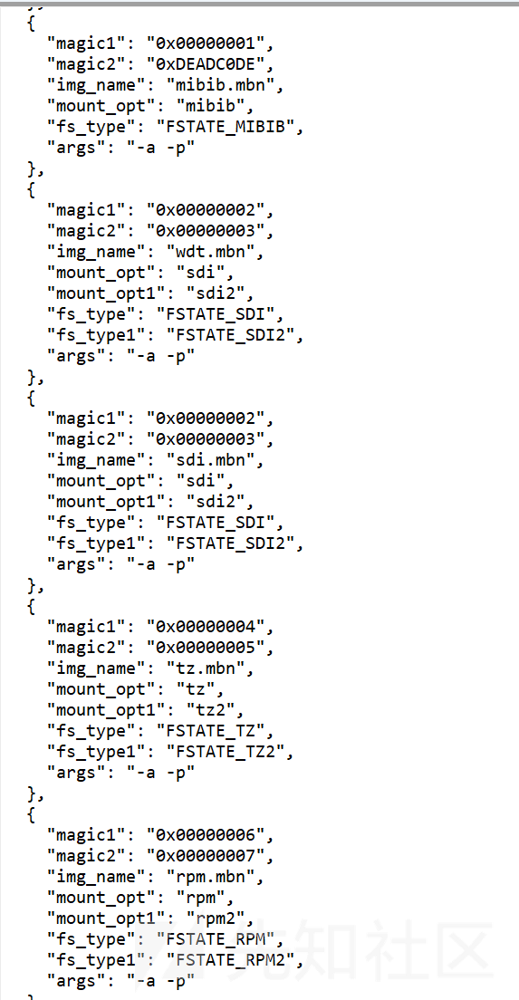

## 6.3 LCD控制与事件处理

lcdd程序的事件队列与固件升级命令和数据结构（byte\_CB40）的动态解析。  
**最后发现固件更新命令还调用了一个程序：** `system("lcdd fw-upgrade 1 &")` 执行并启动固件升级。  
继续寻找：  
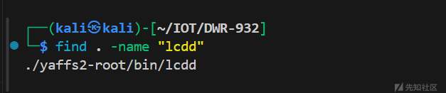  
OK接下来就是继续的逆向分析了！  
这部分的逆向也比较简单  
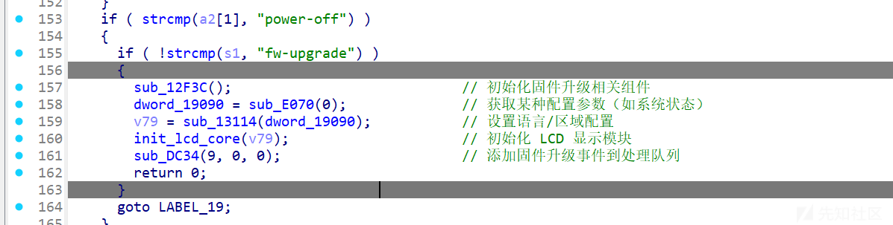  
继续往内部看：  
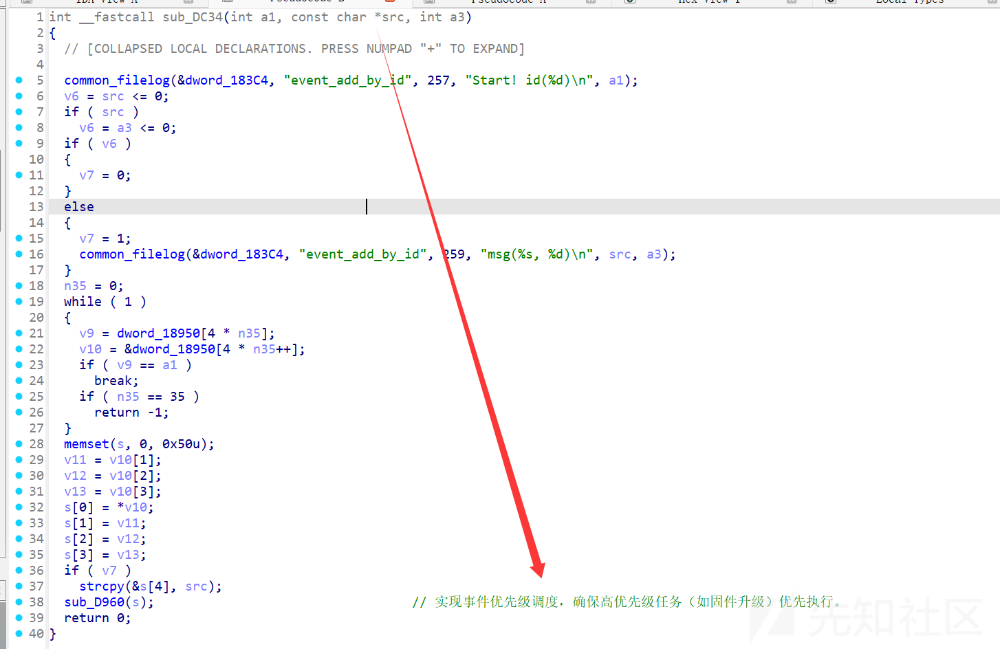

```
      if ( !strcmp(s1, "fw-upgrade") )
      {
        sub_12F3C();                            // 初始化固件升级相关组件 
        dword_19090 = sub_E070(0);              // 获取某种配置参数（如系统状态）
        v79 = sub_13114(dword_19090);           // 设置语言/区域配置 
        init_lcd_core(v79);                     // 初始化 LCD 显示模块 
        sub_DC34(9, 0, 0);                      // 添加固件升级事件到处理队列 
        return 0;
      }
```

该代码段是嵌入式系统中典型的“命令响应-事件驱动”设计，适用于路由器、IoT 设备等需固件升级的场景。

# 七、技术总结与发现

## 7.1 FOTA流程全貌

FOTA（Firmware Over-the-Air）固件升级流程主要涉及从固件下载到刷写的完整链路，整体可分为以下几个阶段：

1. **固件下载阶段**：

* `fotad` 作为 FOTA 进程的核心组件，负责管理下载任务，包括从服务器获取固件、验证完整性，并存储到本地。
* 下载进度和状态信息通过 `/var/fota/fotad.status` 文件及 `appmgr.us` Unix 域套接字传输。

2. **预处理阶段**：

* `appmgr` 发现固件下载完成后，调用 `pre-fota.sh` 脚本，使用 `-a start` 选项启动。
* `pre-fota.sh` 主要完成 FOTA 过程的初始化，包括创建工作目录和校验文件完整性。
* 运行 `prefota --start` 命令，准备刷写固件。

3. **刷写准备阶段**：

* `prefotad` 负责解压已下载的固件，解析必要的数据，并校验签名。
* 主要执行以下任务：

* `unzip`：解压固件包。
* `sha1sum`：校验文件完整性。
* `fotastate`：更新 FOTA 进程状态。
* `flash_erase`：擦除目标分区，准备刷写。
* `nandwrite`：将固件数据写入 NAND 分区。
* `lcdd fw-upgrade 1 &`：执行 LCD 屏幕升级。

4. **刷写及重启阶段**：

* `nandwrite` 完成固件刷写后，设备会根据 `fotad` 状态决定是否重启。
* 在系统重启后，新的固件版本生效。

## 7.2 关键组件间的协作机制

整个 FOTA 升级过程中，多个核心组件相互协作，共同完成下载、验证、刷写及状态更新：

* `fotad`**（下载管理）**：

* 负责固件下载任务，提供跨进程通信接口，通知 `appmgr` 进入刷写阶段。

* `appmgr`**（流程控制）**：

* 作为 IoT 设备的应用管理核心，负责启动 `pre-fota.sh`，控制 `prefotad` 的执行，并确保刷写流程顺利进行。

* `prefotad`**（固件处理）**：

* 负责固件的解压、验证、擦除和写入操作。
* 调用 `unzip`、`sha1sum`、`fotastate`、`flash_erase`、`nandwrite` 等关键工具完成数据处理。

* `lcdd`**（屏幕升级）**：

* 通过 `lcdd fw-upgrade 1 &` 命令实现 LCD 屏幕固件的独立升级。  
  通过以上组件的协作，FOTA 机制可以实现自动化、可靠的固件升级，确保设备能够平稳过渡到新版本。  
  

# 八、附录

在进行FOTA（Firmware Over-the-Air）固件升级逆向分析时，以下参考资料可能对您有所帮助：

1. [车联网安全概述与TBOX固件逆向分析](https://blog.csdn.net/weixin_44933408/article/details/136566626)：该文章讨论了车联网安全问题，特别是ECU固件可能面临的逆向分析和篡改风险。
2. [一步一步实现STM32-FOTA系列教程之BIN文件解包C语言实现](https://blog.csdn.net/weixin_37127273/article/details/84726766)：该教程详细讲解了如何在STM32上实现网络远程升级固件的IAP程序，包括BIN文件解包的C语言实现。
3. [新能源汽车上的FOTA固件远程升级系统及其升级方法](https://patents.google.com/patent/WO2021008184A1/zh)：这篇专利文献介绍了一种基于T-BOX对车辆ECU实现端到端升级的FOTA系统，详细描述了系统架构和升级流程。
4. [汽车电子网络安全标准化白皮书](https://www.tc260.org.cn/file/qcdz.pdf)：该白皮书讨论了汽车电子网络安全标准化的现状和趋势，包括FOTA升级过程中的安全技术和防护措施。
5. [软固件升级概述](https://doc.hcs.huawei.com/zh-cn/usermanual/iotda/iotda_02_0062.html)：华为的在线资料平台提供了关于固件升级（FOTA）的概述，介绍了通过OTA方式对设备进行固件升级的基本概念和流程。
6. [AN13460 - SBL及SFW工程的FOTA设计](https://www.nxp.com/docs/zh/application-note/AN13460.pdf)：这篇应用笔记介绍了恩智浦推出的面向MCU的安全固件升级项目，包括SBL和SFW的设计框架以及FOTA功能的实现。
7. [二万五千字解读汽车软件OTA](https://www.uml.org.cn/car/202107301.asp)：该文章深入解析了汽车软件OTA的概念、分类、技术实现和应用案例，对理解FOTA在汽车领域的应用具有参考价值。
8. [How to make Firmware Updates over LoRaWAN Possible](https://arxiv.org/abs/2002.08735)：这篇论文探讨了在LoRaWAN网络中实现固件空中升级（FUOTA）的可能性，分析了相关挑战和解决方案。
9. [Enhancing AUTOSAR-Based Firmware Over-the-Air Updates in the Automotive Industry with a Practical Implementation on a Steering System](https://arxiv.org/abs/2503.05839)：该论文介绍了在汽车行业中基于AUTOSAR的FOTA更新的增强方法，并在转向系统上进行了实际实现。
