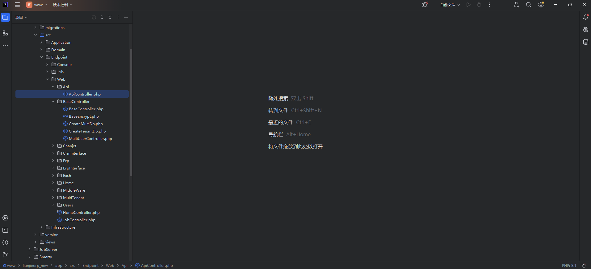
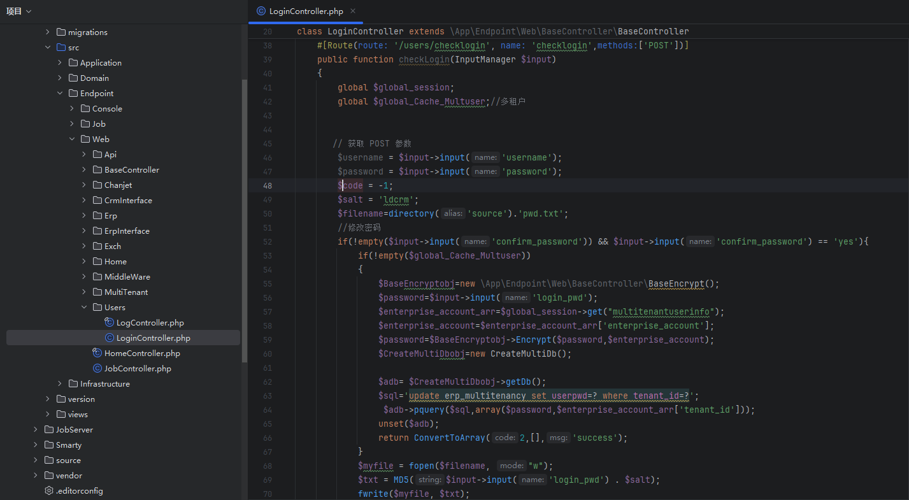
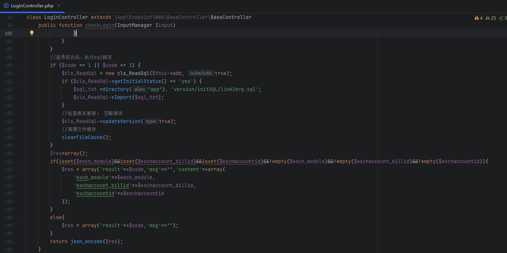
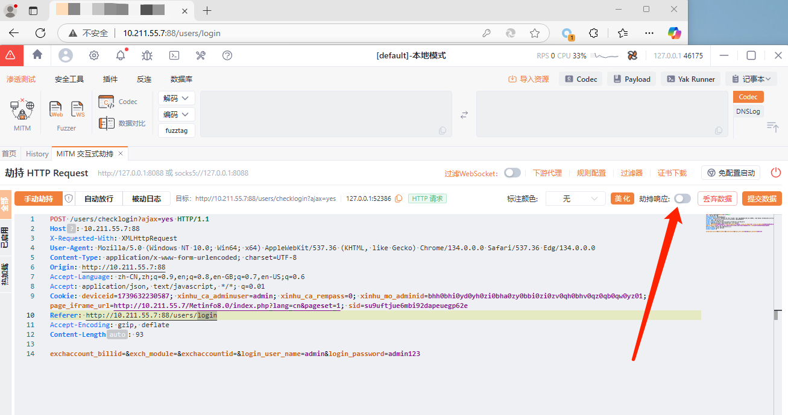
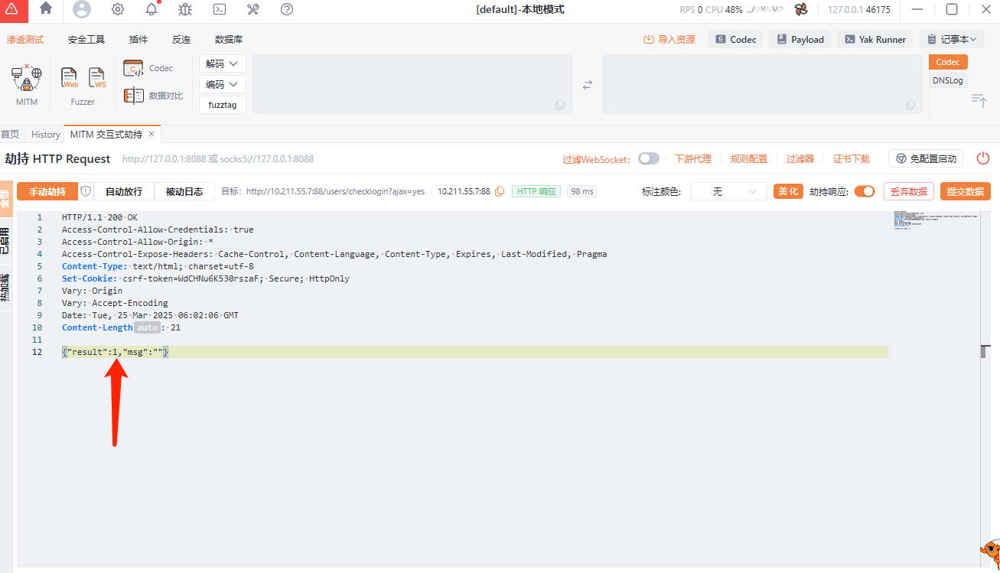
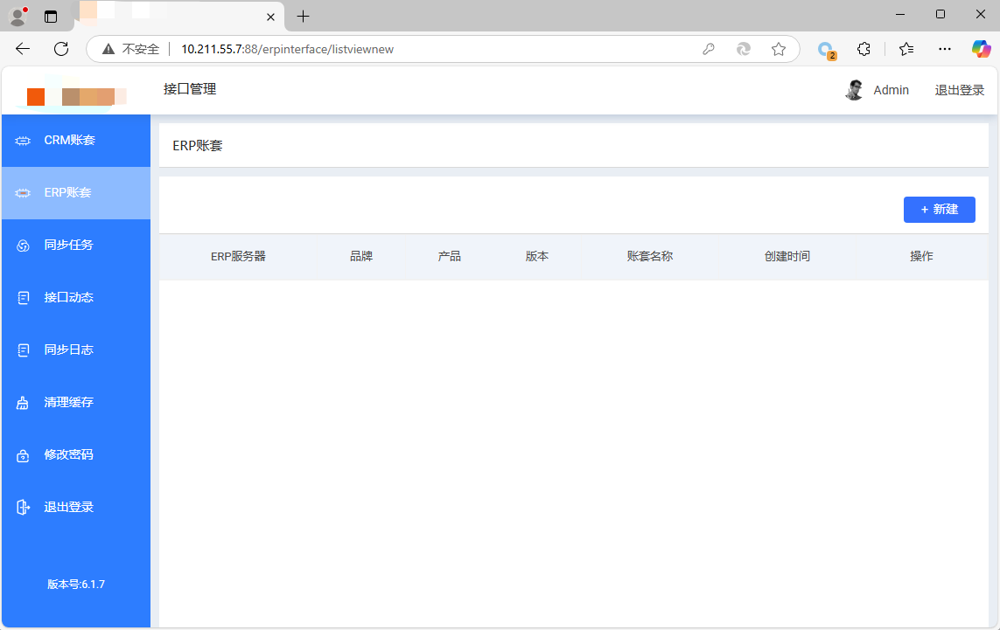

# 一次逻辑漏洞的代码审计(0day-通杀)-先知社区

> **来源**: https://xz.aliyun.com/news/17407  
> **文章ID**: 17407

---

## 一、漏洞详情

此漏洞可以绕过登录限制，直接进入后台。

​

## 二、代码分析



源码很明显的是框架结构。

漏洞文件在

lianjieerp\_new/app/src/Endpoint/Web/Users/LoginController.php文件下



```
#[Route(route: '/users/checklogin', name: 'checklogin',methods:['POST'])]
    public function checkLogin(InputManager $input)
    {
        global $global_session;
        global $global_Cache_Multuser;//多租户


       // 获取 POST 参数
        $username = $input->input('username');
        $password = $input->input('password');
        $code = -1;
        $salt = 'ldcrm';
        $filename=directory('source').'pwd.txt';
```

首先定义了这个函数的调用路由为/users/checklogin，接收参数为POST传参，之后获取username和password，虽有定义code参数为-1。

```
if(!empty($input->input('confirm_password')) && $input->input('confirm_password') == 'yes'){
            if(!empty($global_Cache_Multuser))
            {
                $BaseEncryptobj=new \App\Endpoint\Web\BaseController\BaseEncrypt();
                $password=$input->input('login_pwd');
                $enterprise_account_arr=$global_session->get("multitenantuserinfo");
                $enterprise_account=$enterprise_account_arr['enterprise_account'];
                $password=$BaseEncryptobj->Encrypt($password,$enterprise_account);
                $CreateMultiDbobj=new CreateMultiDb();


                $adb= $CreateMultiDbobj->getDb();
                $sql='update erp_multitenancy set userpwd=? where tenant_id=?';
                 $adb->pquery($sql,array($password,$enterprise_account_arr['tenant_id']));
                unset($adb);
                return ConvertToArray(2,[],'success');
            }
            $myfile = fopen($filename, "w");
            $txt = MD5($input->input('login_pwd') . $salt);
            fwrite($myfile, $txt);
            fclose($myfile);
            $code = 1;
        }
        //登录
        else {
            //session有效
            if ($global_session->get('username')) {
                $code = 1;
            } else {
                $user_name =$input->input('login_user_name');
                $password  =$input->input('login_password');
                $exch_module=$input->input('exch_module');
                $exchaccount_billid=$input->input('exchaccount_billid');
                $exchaccountid=$input->input('exchaccountid');
                $filename = directory('source').'pwd.txt';
                if (file_exists($filename)) {
                    //重置过密码
                    $myfile = fopen($filename, "r");
                    $md5_pwd = fread($myfile, filesize($filename));
                    if ($md5_pwd == MD5($password . $salt)) {
                        $code = 1;
                        //  注册登陆成功的 admin 变量，并赋值 true
                        $global_session->set('username',$user_name);
                        //@edit:zhaosk @Date: 2024/7/16 @reason:变量未使用,注释掉
                        /* $filename = 'reg.txt';
                        if (file_exists($filename)) {
                            $myfile = fopen($filename, "r");
                            $data = json_decode(fread($myfile, filesize($filename)));
                        }*/
                    }
                } else {
                    //未重置过密码
                    $code = 3;
                    $global_session->set('username',$user_name);
                }
            }
        }
```

首先就是判断confirm\_password是不是为空，这里我们使其为空走到else语句中，如果session有效，那么就让code为1，或者是你登录的账号密码正确，然后code为1。

```
if ($md5_pwd == MD5($password . $salt)) {
    $code = 1;
```

继续往下走



很明显能看到了，当code等于1或者code等于3的时候，进去后台，但是这个code参数并不是我们的可控点，怎么去更改呢。

## 没错就是去劫持登录响应包，然后去更改code的值。 三、漏洞复现





改为1或者3，放包即可进入后台。



​

​

​
