# 2025-软件系统安全攻防半决赛Wp-先知社区

> **来源**: https://xz.aliyun.com/news/17408  
> **文章ID**: 17408

---

## pwn

patch，evilpatch工具通防

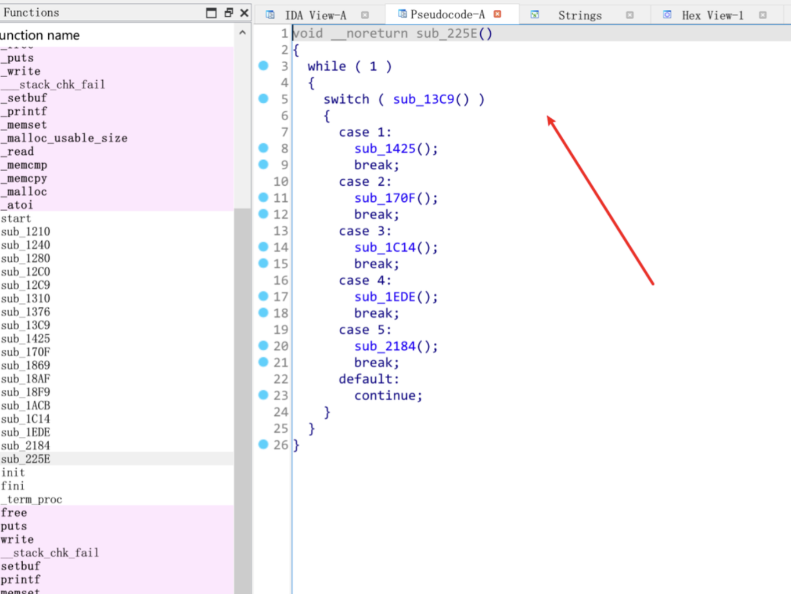

## Misc 取证1

要求是去找证书模版名字和序列号

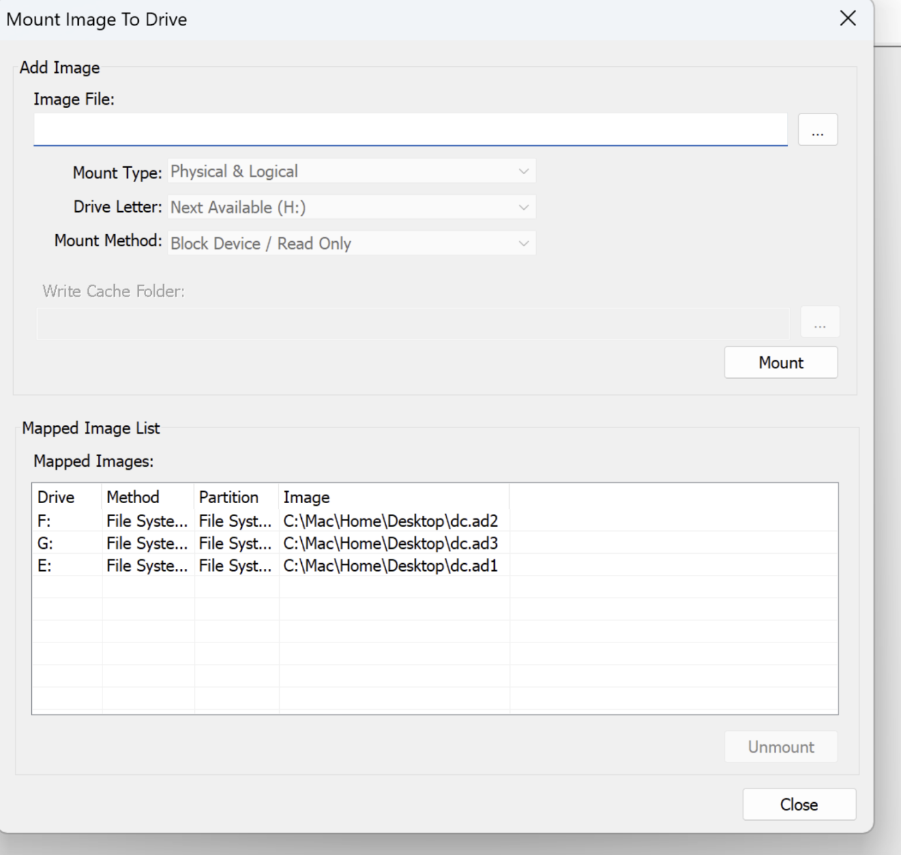

先挂载镜像，然后去翻文件翻到一个

​

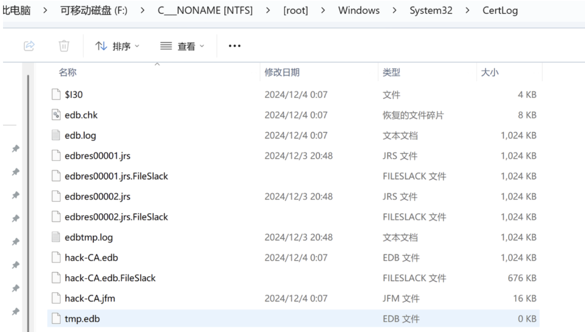

​

翻到这个hack-CA的ebp文件，然后用主办方给的工具打开这个文件

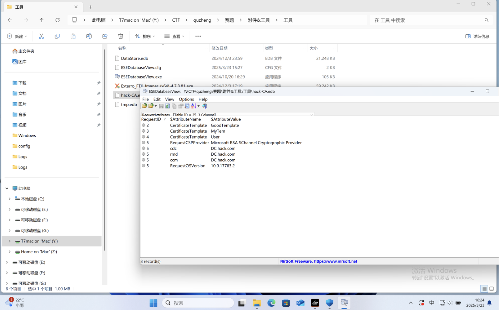

这边找到三个template的名字然后继续翻

​

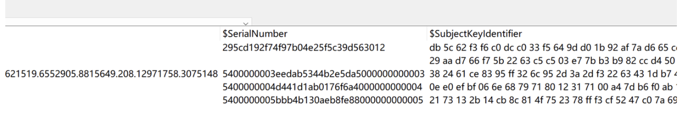

找到几个序列号，直接排列组合交上的

```
MyTem-5400000003eedab5344b2e5da5000000000003
```

## Misc 取证2

要求找到恶意的文件，去找到 system32目录下的winevt日志找到了denfender的日志直接打开看，翻到一个程序，交上就过了

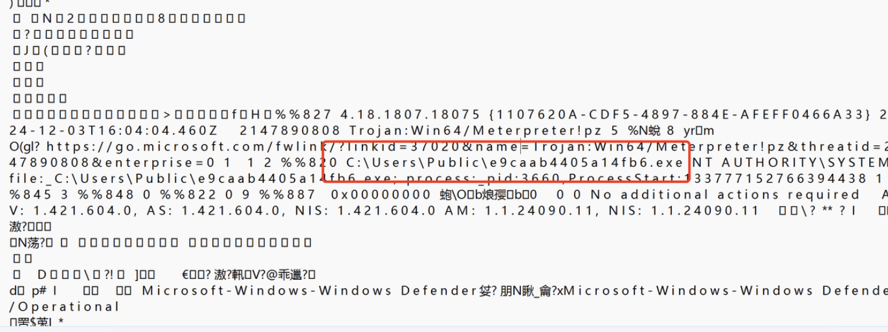

## Misc 取证3

没做出来 但是马上 时间原因

john和administrator的明文密码 在john

E:\C\_\_\_NONAME [NTFS]root]\Users\john\AppData\Roaming\Microsoft\Windows\PowerShell\PSReadLine

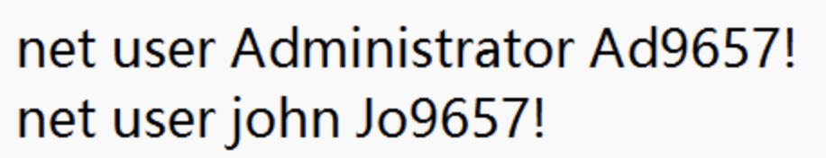

ip没找对 找了个192.168.17.128 在日志里 好像还有个192.168.17.1

## Misc 取证4

把sysytem32下的日志拷贝过去

`C:\Users\Anonymous\Desktop\Logs\Security.evtx` ，放上日志分析工具

```
LogParser.exe -i:EVT "SELECT * FROM 'Security.evtx' WHERE EventID=4624"
```

查到日志

```
C:\Users\Anonymous\Desktop\Logs\Security.evtx 7210 2024-12-04 00:06:11 2024-12-04 00:06:11 4728 8 Success Audit event 13826 The name for category 13826 in Source "Microsoft-Windows-Security-Auditing" cannot be found. The local computer may not have the necessary registry information or message DLL files to display messages from a remote computer Microsoft-Windows-Security-Auditing CN=James,CN=Users,DC=hack,DC=com|S-1-5-21-1507239155-486581747-1996177333-3193|Domain Admins|HACK|S-1-5-21-1507239155-486581747-1996177333-512|S-1-5-21-1507239155-486581747-1996177333-500|Administrator|HACK|0xadb1d4|- DC.hack.com <NULL> The description for Event ID 4728 in Source "Microsoft-Windows-Security-Auditing" cannot be found. The local computer may not have the necessary registry information or message DLL files to display messages from a remote computer <NULL>
```

发现用户和组maintainer-james,还缺密码，先去找system32目录下找ntds.dit爆出用户hash再去爆破明文密码

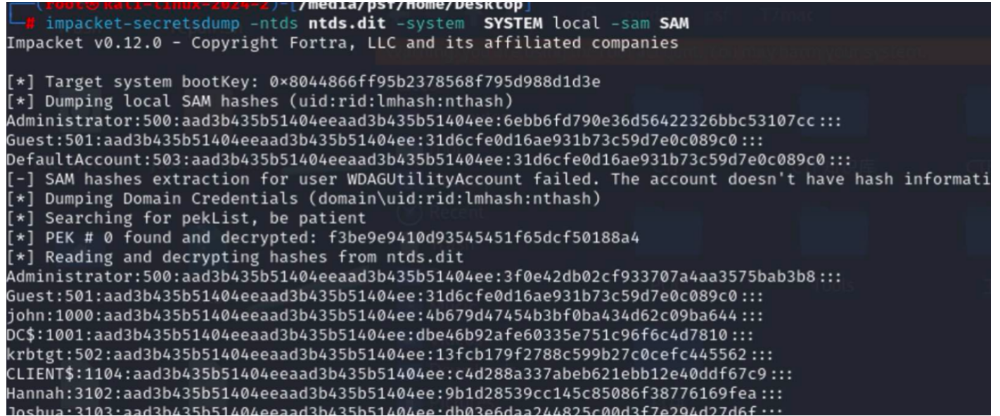

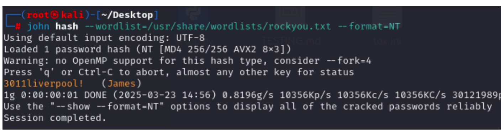

`maintainer-james-3011liverpool!`

## Misc 5G消息—TLS

刚开始用科来，但是看不到ipv6的数据包

用wireshark，看到sip

里边有一句话 和sslkeylog

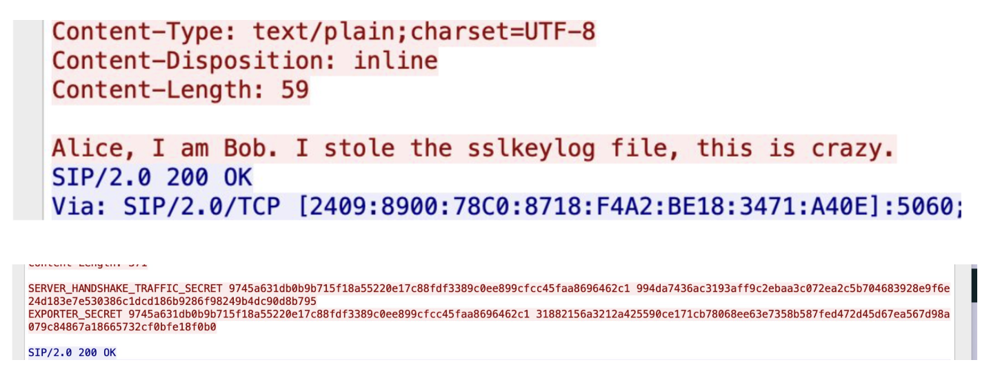

有三个sslkeylog 全部复制下来保存

用sslkeylog解密

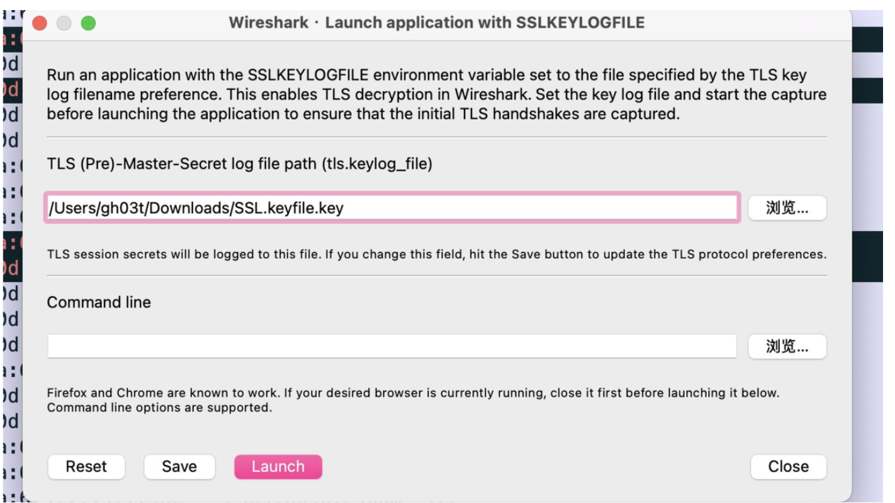

里边两个HTTP流，一个图片，导出数据流就是图片

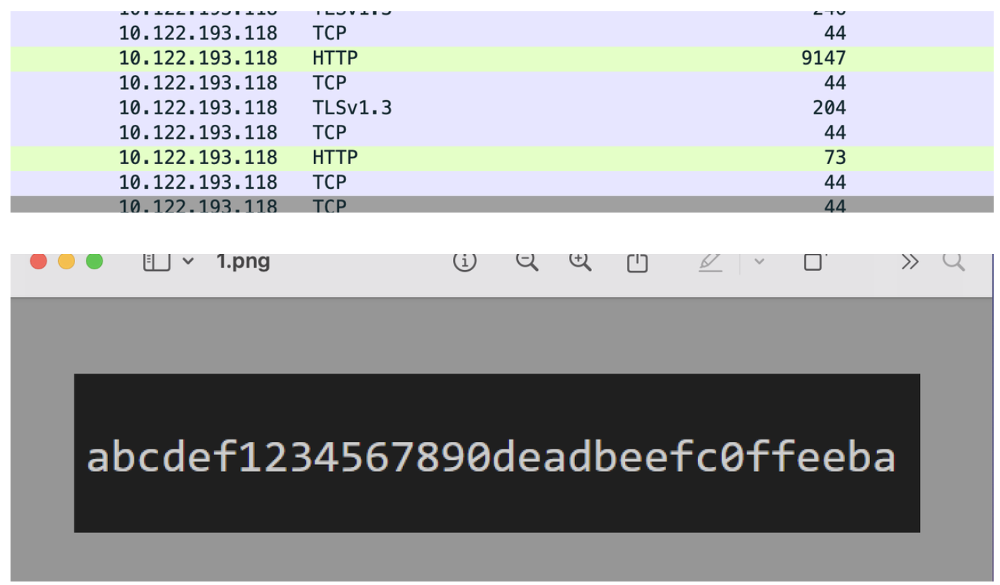

web 一个没出，也不会修，赛后问的其他师傅，他们说直接把flag删除就能patch成功。
