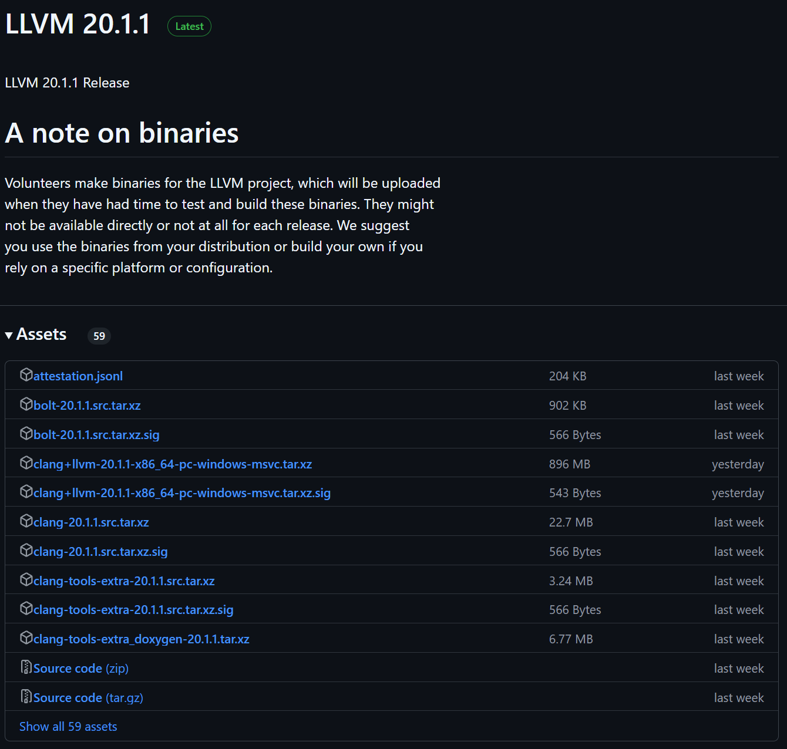
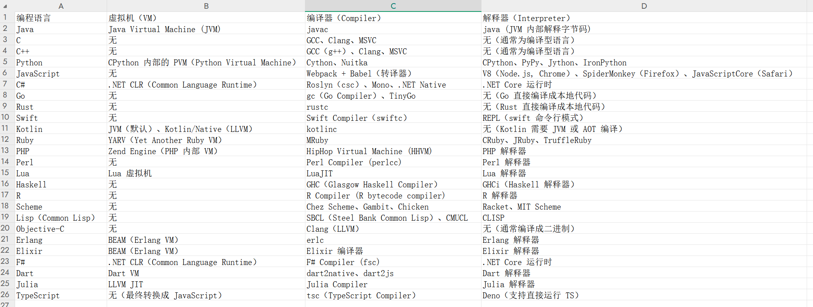

# LLVM：现代编译器框架与恶意代码分析-先知社区

> **来源**: https://xz.aliyun.com/news/17433  
> **文章ID**: 17433

---

# LLVM：现代编译器框架与恶意代码分析

## 什么是LLVM？

LLVM（Low-Level Virtual Machine）是一套用于构建编译器的框架，它不仅仅是一个编译器后端，更是一个模块化、可扩展的编译器基础设施，广泛应用于：

* Clang（C/C++/Objective-C编译器）
* Rust
* Swift
* Julia
* WebAssembly
* Fuchsia OS等编程语言和系统中

​

​

目前最新版本为20.1.1



## 什么是LLVM IR？

LLVM IR（Intermediate Representation，中间表示）是LLVM编译器架构的核心，它是介于源代码和目标机器码之间的抽象表示。相比于传统的三地址代码（TAC）或字节码，LLVM IR：

* 层次更高
* 具备更强的优化能力
* 支持静态（AOT）和即时编译（JIT）

### LLVM IR主要特性

1. 基于SSA（Static Single Assignment）：每个变量只被赋值一次，利于优化
2. 强类型静态IR：所有数据都有明确的类型，如i32、float、ptr
3. 平台无关：可以被转换为不同的架构（x86、ARM、RISC-V）
4. 支持高度优化：可以通过LLVM Pass进行常量折叠、死代码消除、循环优化等

> 当前最新版本：20.1.1（本文使用LLVM-20.1.1-win64.exe）

## LLVM的核心特性

* **模块化架构**：前端、优化器、后端解耦，可支持多种语言
* **中间表示（LLVM IR）**：高度优化、可跨平台
* **静态和JIT编译支持**：同时适用于Ahead-of-Time（AOT）和Just-In-Time（JIT）
* **强大的优化能力**：SSA形式、中间代码优化、目标代码优化等

## LLVM的架构与工作流程

LLVM的编译流程分为三个阶段：

### 1. 前端（Frontend）

作用：把源代码转换为LLVM IR（中间表示）

常见前端：

* Clang（C/C++/Objective-C）
* Rustc（Rust编译器）
* Swiftc（Swift编译器）
* mlir（用于机器学习、AI计算）

### 2. 中端（IR及优化层）

LLVM IR是LLVM处理的核心：

* 基于SSA（Static Single Assignment），便于优化
* 三地址代码（Three-address code）形式，易于转换为目标代码

**LLVM IR代码示例（计算a + b）**：

```
define i32 @add(i32 %a, i32 %b) {
entry:
  %sum = add i32 %a, %b
  ret i32 %sum
}
```

### 3. 优化层（Optimizer）

LLVM提供了一系列强大的优化Pass，可以对IR进行优化：

#### 代码优化

* 常量传播（Constant Propagation）
* 死代码删除（Dead Code Elimination, DCE）
* 循环展开（Loop Unrolling）
* 循环不变代码外提（LICM, Loop-Invariant Code Motion）

#### 机器无关优化

* 全局值编号（GVN, Global Value Numbering）
* 冗余加载消除（Load Elimination）
* 寄存器分配优化

#### 机器相关优化

* 指令选择（Instruction Selection）
* 寄存器分配（Register Allocation）
* 指令调度（Instruction Scheduling）

**如何查看LLVM Pass？**

```
opt -O2 -S input.ll -o output.ll
```

### 4. 后端（Backend）

优化后的IR需要转换为机器码（Machine Code），后端负责：

* 指令选择（Instruction Selection）
* 寄存器分配（Register Allocation）
* 目标代码生成（Code Emission）

LLVM提供多个后端：

1. x86、ARM、RISC-V
2. SPARC、PowerPC、MIPS
3. WebAssembly（WASM）

**将IR转换为x86汇编**：

```
llc -march=x86 input.ll -o output.s
```

## LLVM IR代码示例

**C代码**：

```
int add(int a, int b) {
    return a + b;
}
```

**对应的LLVM IR代码**（使用`clang -S -emit-llvm`生成）：

```
define i32 @add(i32 %a, i32 %b) {
entry:
  %sum = add i32 %a, %b
  ret i32 %sum
}
```

代码解析：

* `define i32 @add(i32 %a, i32 %b)`：定义一个返回i32（32位整数）的函数add，参数%a和%b
* `%sum = add i32 %a, %b`：使用LLVM IR的add指令执行加法
* `ret i32 %sum`：返回sum的值

LLVM IR的基本格式类似汇编语言，但它是寄存器级中间代码，比机器码更可读，同时支持高层优化。

## SSA（Static Single Assignment）详解

LLVM IR的一个核心特性是SSA形式，即每个变量只赋值一次。

### SSA代码示例

**C代码**：

```
int foo(int x) {
    int y;
    if (x > 0)
        y = x * 2;
    else
        y = x + 10;
    return y;
}
```

**转换为LLVM IR**：

```
define i32 @foo(i32 %x) {
entry:
  %cmp = icmp sgt i32 %x, 0
  br i1 %cmp, label %true_block, label %false_block

true_block:
  %y1 = mul i32 %x, 2
  br label %merge

false_block:
  %y2 = add i32 %x, 10
  br label %merge

merge:
  %y = phi i32 [%y1, %true_block], [%y2, %false_block]
  ret i32 %y
}
```

### phi指令：处理控制流

LLVM IR使用phi指令来合并多个路径的变量：

```
%y = phi i32 [%y1, %true_block], [%y2, %false_block]
```

phi指令根据控制流的来源，选择正确的值。

**SSA的好处**：

* 自动消除冗余计算（如公共子表达式消除CSE）
* 更容易做数据流分析（如死代码消除）
* 优化寄存器分配（避免多个变量共享同一寄存器）

## LLVM IR指令集

### 1. 算术与逻辑指令

|  |  |
| --- | --- |
| 指令 | 说明 |
| add | 整数加法 |
| sub | 整数减法 |
| mul | 整数乘法 |
| sdiv | 有符号整数除法 |
| udiv | 无符号整数除法 |
| and | 位与 |
| or | 位或 |
| xor | 位异或 |
| shl | 左移 |
| lshr | 逻辑右移 |
| ashr | 算术右移 |

**示例（a = b \* 4 + 1）**：

```
%tmp1 = mul i32 %b, 4
%a = add i32 %tmp1, 1
```

### 2. 内存指令

|  |  |
| --- | --- |
| 指令 | 说明 |
| alloca | 在栈上分配内存 |
| load | 从内存读取数据 |
| store | 向内存写入数据 |

**示例（局部变量分配）**：

```
%ptr = alloca i32
store i32 42, i32* %ptr
%val = load i32, i32* %ptr
```

### 3. 控制流指令

|  |  |
| --- | --- |
| 指令 | 说明 |
| br | 无条件跳转 |
| br i1 | 条件跳转 |
| switch | 多分支跳转 |
| ret | 返回 |

**示例（if语句）**：

```
%cmp = icmp eq i32 %x, 0
br i1 %cmp, label %if_true, label %if_false
```

### 4. 类型转换指令

|  |  |
| --- | --- |
| 指令 | 说明 |
| zext | 零扩展（如i8 -> i32） |
| sext | 符号扩展（如i8 -> i32） |
| trunc | 截断（如i32 -> i8） |
| bitcast | 直接类型转换（如float\* -> i32\*） |

**示例（int转float）**：

```
%f = sitofp i32 %a to float
```

## LLVM IR的优化

LLVM IR的主要优势在于其优化能力，包括：

* 常量折叠（Constant Folding）
* 死代码消除（Dead Code Elimination, DCE）
* 循环不变代码外提（LICM）
* 公共子表达式消除（CSE）
* 冗余加载消除（Load Elimination）

**优化前**：

```
%a = add i32 2, 3
ret i32 %a
```

**优化后**：

```
ret i32 5
```

## 恶意代码混淆与反混淆

混淆（Obfuscation）是恶意软件开发者用来隐藏代码意图并对抗逆向工程的常见技术。LLVM允许开发者编写自定义Pass，以插入无用指令、控制流平坦化、虚拟化代码等方式混淆代码。

### 1. 插入垃圾代码

**LLVM IR可以添加无意义的计算**：

```
define i32 @add(i32 %a, i32 %b) {
entry:
  %sum = add i32 %a, %b
  %junk1 = mul i32 %sum, 1  ; 无意义运算
  %junk2 = xor i32 %junk1, 0
  ret i32 %sum
}
```

**目的**：

* 增加IR代码长度，让逆向分析更加困难
* 让二进制代码分析工具（如IDA Pro）难以识别真实逻辑

### 2. 控制流平坦化（Control Flow Flattening）

控制流平坦化将if-else语句、循环等结构变成伪状态机，扰乱控制流：

```
switch i32 %obfuscated, label %case1 [
  i32 0, label %case2
  i32 1, label %case3
]
```

**目的**：

* 让CFG（控制流图）变得复杂，干扰逆向工程师

### 3. 代码虚拟化（Code Virtualization）

LLVM允许使用自定义解释器执行代码，类似VMProtect：

* 真实指令变成LLVM解释器的伪指令
* 逆向工程需要先还原虚拟机逻辑

## LLVM IR逆向与反混淆

虽然LLVM IR可以被用于代码混淆，但同样可以用于反混淆和恶意代码分析。

### 1. 反混淆Pass

LLVM提供了opt工具，可以通过删除无用Pass还原原始代码：

```
opt -mem2reg -simplifycfg -instcombine -S obfuscated.ll -o deobfuscated.ll
```

* `-mem2reg`：消除冗余内存访问，还原变量
* `-simplifycfg`：还原控制流
* `-instcombine`：合并冗余计算

### 2. 逆向工程恶意IR

许多WebAssembly（WASM）恶意软件使用LLVM IR进行优化，分析.wasm IR可以：

* 发现隐藏的Shellcode
* 逆向混淆代码
* 提取关键逻辑

## LLVM Sanitizer：检测编译级漏洞

LLVM提供了多种安全工具，可以检测缓冲区溢出、Use-After-Free、整数溢出等漏洞。

### 使用ASan检测缓冲区溢出

```
clang -fsanitize=address -O2 -g exploit.c -o exploit
```

**示例漏洞代码**：

```
char buffer[10];
buffer[15] = 'A';  // 越界写入
```

**ASan运行结果**：

```
AddressSanitizer: heap-buffer-overflow on address 0x602000000010
```

ASan在漏洞挖掘、CTF竞赛中非常实用。

## JIT Shellcode注入

LLVM JIT可以用于生成动态Shellcode，在渗透测试中很有用。

### 通过LLVM JIT生成Shellcode

```
ExecutionEngine *EE = EngineBuilder(std::move(M)).create();
void (*func)() = (void (*)())EE->getFunctionAddress("malicious_code");
func();  // 执行Shellcode
```

**攻击方式**：

* 动态加载Shellcode（bypass静态检测）
* 结合ROP进行无文件攻击
* 躲避基于签名的恶意软件检测

## LLVM Pass级别的Rootkit

在内核层面，LLVM可以用于编写Rootkit：

* 劫持内核函数：修改Linux sys\_call\_table
* 插入隐藏指令：在IR级别修改关键代码
* 实现UEFI Rootkit：LLVM IR直接Hook UEFI引导加载程序

## 漏洞类型

### 内存安全漏洞

* 缓冲区溢出：IR生成或优化阶段边界检查缺失
* 释放后使用（UAF）：Pass管理或JIT编译中的对象生命周期问题

### 整数溢出

优化过程中算术处理错误（如-O3激进优化引入问题）

### 逻辑漏洞

* 错误的优化：优化Pass导致语义变化（如删除必要的安全检查）
* 未定义行为（UB）利用：编译器对UB的不可预测处理可能被攻击者操纵

### 后端代码生成漏洞

* 错误指令选择：目标架构（如x86、ARM）特定代码生成缺陷
* 寄存器分配问题：敏感数据泄露或执行流劫持

### IR验证缺陷

* 恶意IR文件：解析未验证的IR可能导致编译器崩溃或任意代码执行

### 工具链漏洞

* lli（JIT执行引擎）：动态编译时的内存破坏
* libFuzzer逃逸：模糊测试工具自身的安全问题

## 历史高危漏洞案例

* **CVE-2020-15837**

* 类型：堆缓冲区溢出（Clang的CFG生成）
* 影响：通过特制C++代码实现代码执行

* **CVE-2021-42574（"Trojan Source"）**

* 类型：Unicode双向字符混淆（影响LLVM前端代码解析）
* 影响：源代码视觉欺骗，可能导致后门植入

* **CVE-2022-23529**

* 类型：LLVM IR验证不充分导致越界访问
* 影响：处理恶意IR文件时崩溃或RCE

* **CVE-2023-32460（Swift编译器漏洞）**

* 类型：LLVM后端优化错误移除了必要的内存屏障
* 影响：多线程程序数据竞争

## 安全建议

### 加固编译环境

* 使用`-fno-strict-aliasing`等标志避免危险的优化
* 对第三方IR文件进行沙箱验证

### 静态分析与模糊测试

* 用`clang -fsanitize=address,undefined`检测内存/UB问题
* 对LLVM Pass使用LibFuzzer进行覆盖测试

### 监控异常行为

* 检查编译器生成的二进制文件是否包含意外指令（如int3断点）

​

​

以下是个人整理的各大编程语言的虚拟机、编译器或解释器

## 编程语言编译器/虚拟机分类

### 按编程范式分类

* **面向对象（OOP）**：Java（JVM）、C#（.NET CLR）、Python（CPython）、Ruby（YARV）
* **函数式（FP）**：Haskell（GHC）、Erlang（BEAM）、Elixir（BEAM）、Lisp（SBCL）
* **命令式（Imperative）**：C（GCC）、C++（Clang）
* **逻辑编程（Logic Programming）**：Prolog（SWI-Prolog）、Mercury（Mercury Compiler）

### 按执行方式分类

* **编译型语言（Compiled）**：C（GCC）、Rust（rustc）、Go（gc）
* **解释型语言（Interpreted）**：Python（CPython）、JavaScript（V8）、Ruby（CRuby）
* **混合型（既有编译又有解释）**：Java（javac + JVM）、C#（Roslyn + .NET CLR）、Python（PyPy JIT）、Lua（LuaJIT）

## 编译方式

不同的编程语言有不同的编译方式，影响其性能、移植性和使用场景。

### 传统编译（AOT - Ahead-of-Time）

在代码执行前，将源代码编译成目标机器代码：

* C、C++、Rust、Go采用AOT编译，生成可执行文件

### 即时编译（JIT - Just-in-Time）

在程序运行时，将字节码或中间代码转换为机器码：

* Java（HotSpot JIT）、.NET（JIT Compiler）、Python（PyPy JIT）、Lua（LuaJIT）采用JIT编译，提高执行速度

### 字节码解释执行

代码先被编译为中间字节码，再由解释器执行：

* Python（CPython）、Java（JVM）、C#（.NET CLR）、Ruby（YARV）

## 编译器技术

编译器的核心功能涉及多个阶段：

1. 词法分析（Lexing）
2. 语法分析（Parsing）
3. 中间代码生成（IR）
4. 优化（Optimization）
5. 代码生成（Code Generation）

不同编译器有不同优化策略：

* **LLVM**：提供高度优化的IR（中间表示），被Clang、Rust、Swift、Julia采用
* **GCC**：经典C/C++编译器，强调优化和跨平台能力
* **JIT编译器**：运行时优化，典型代表有HotSpot（Java）、Mono（.NET）、PyPy（Python）

## 主流虚拟机架构

虚拟机的设计直接影响代码的执行效率、跨平台能力和安全性。

### 主要虚拟机

* **JVM（Java Virtual Machine）**：执行Java字节码，可运行Kotlin、Scala、Groovy
* **.NET CLR（Common Language Runtime）**：运行C#、F#、VB.NET
* **BEAM（Erlang VM）**：高度并发，适用于分布式系统
* **CPython VM（Python Virtual Machine）**：解释执行Python字节码（.pyc文件）

### 虚拟机优化

* **垃圾回收（GC）**：JVM（G1、ZGC）、.NET CLR（GC）、BEAM（Process GC）
* **即时编译（JIT）**：HotSpot（JVM）、Mono（.NET）、LuaJIT
* **动态优化（Profile-guided Optimization, PGO）**：LLVM、GCC、PyPy

## 解释器的设计哲学

解释器通常有三种实现方式：

1. **纯解释（Pure Interpretation）**：逐行读取和执行代码，如Python（CPython）、Ruby（CRuby）
2. **字节码解释（Bytecode Interpretation）**：先编译成字节码，再由虚拟机执行，如Python（PVM）、JVM
3. **混合解释（Hybrid）**：结合JIT编译，如PyPy（JIT编译Python代码）

### 不同解释器之间的对比

* **Python**：

* CPython（慢，但兼容性好）
* PyPy（快，JIT支持）
* Jython（运行在JVM上）

* **JavaScript**：

* V8（高效JIT，Chrome/Node.js）
* SpiderMonkey（Firefox）
* JavaScriptCore（Safari）

## 相关工具与生态

除了核心编译器和解释器，还有许多周边工具：

* **字节码分析工具**：javap（Java）、ILSpy（.NET）、dis（Python）
* **性能优化工具**：perf（Linux）、Valgrind、JIT Profiler（Java）
* **静态分析工具**：Clang Static Analyzer、Pylint、SonarQube

​


