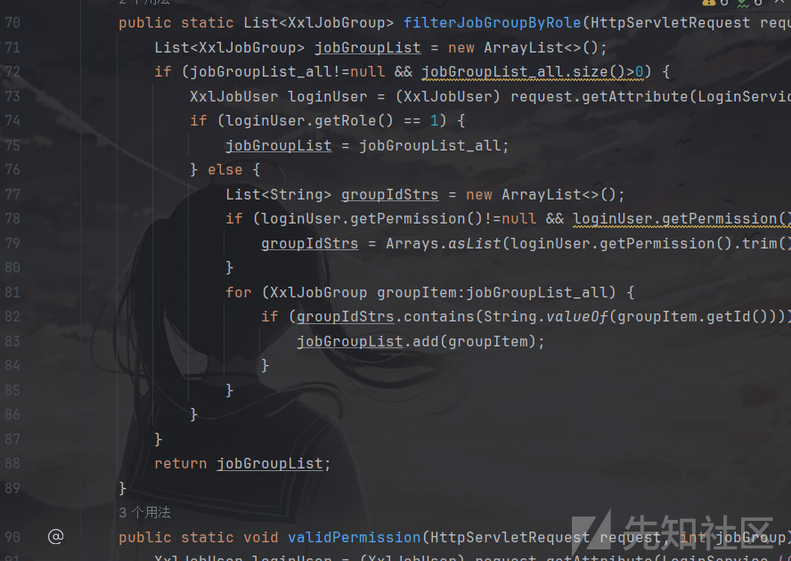
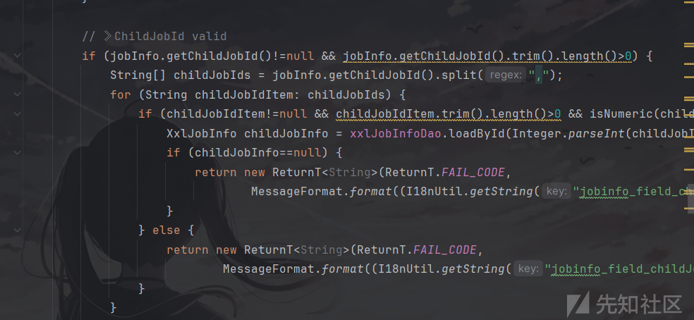
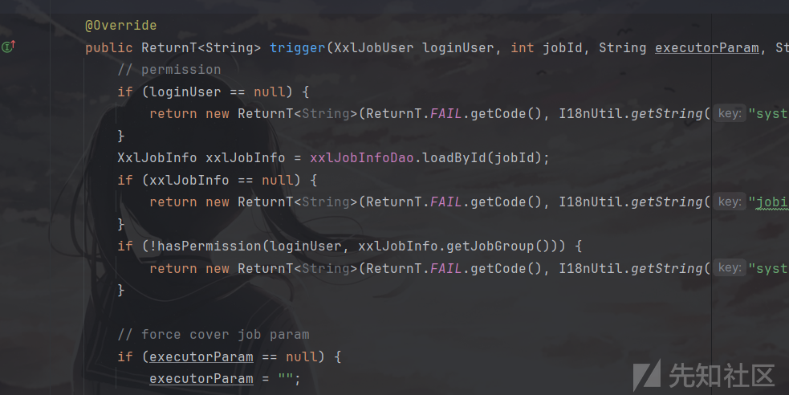
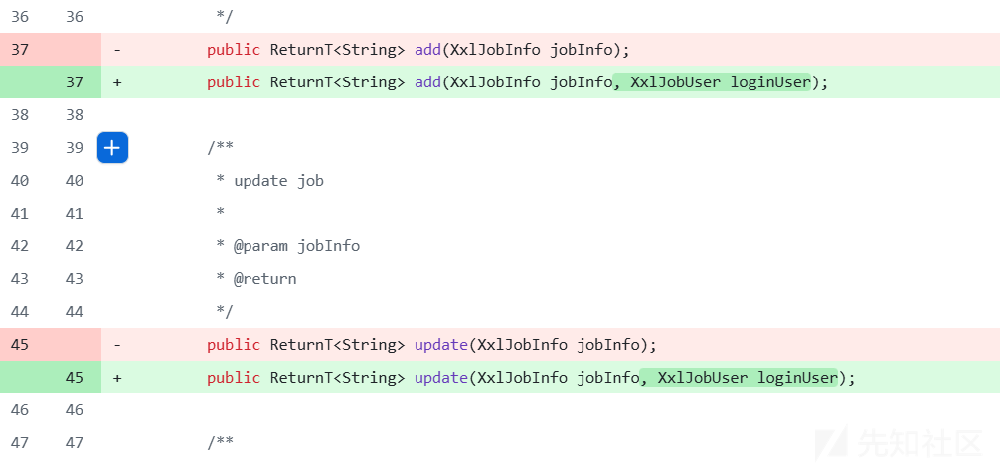
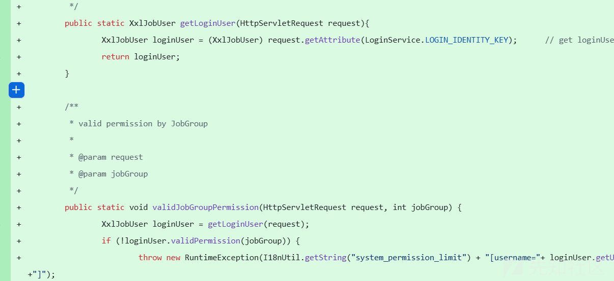
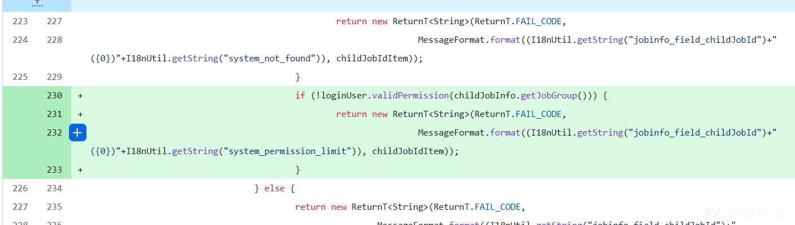

# xxl-job子任务越权漏洞代码分析及修复代码分析(CVE-2024-42681)-先知社区

> **来源**: https://xz.aliyun.com/news/17435  
> **文章ID**: 17435

---

# 漏洞介绍

在xxl-job中，普通用户本应该只能查看和执行他们分配到的执行程序上的任务，并且无法查看与执行未分配到的执行程序的任务。但在2.4.1版本中，普通用户可以通过在执行程序 A 上创建任务并使用子任务 ID，从而执行管理员权限才能执行的执行程序 B 上的子任务。

# 漏洞代码分析

首先，因为是执行时触发的，所以可以直接找到`com.xxl.job.admin.controller.JonInfoController`这个控制执行程序的类。

看到其中的权限控制部分



```
public static List<XxlJobGroup> filterJobGroupByRole(HttpServletRequest request, List<XxlJobGroup> jobGroupList_all){
    // 创建一个空的列表，用于存储过滤后的组
    List<XxlJobGroup> jobGroupList = new ArrayList<>();
    
    // 如果传入的列表不为空且大小大于0
    if (jobGroupList_all != null && jobGroupList_all.size() > 0) {
        
        // 获取当前登录用户对象，存储在请求的属性中，LOGIN_IDENTITY_KEY 是常量表示用户身份信息
        XxlJobUser loginUser = (XxlJobUser) request.getAttribute(LoginService.LOGIN_IDENTITY_KEY);
        
        // 检查用户角色，如果角色是 1，则表示是管理员，管理员可以看到所有组
        if (loginUser.getRole() == 1) {
            // 如果是管理员，直接返回所有的组
            jobGroupList = jobGroupList_all;
        } else {
            // 如果不是管理员，创建一个列表用于存储用户拥有权限的组 ID
            List<String> groupIdStrs = new ArrayList<>();
            
            // 如果用户的权限字符串不为空，解析出权限字符串并分割为一个列表
            if (loginUser.getPermission() != null && loginUser.getPermission().trim().length() > 0) {
                // 将权限字符串（以逗号分隔）转换为列表
                groupIdStrs = Arrays.asList(loginUser.getPermission().trim().split(","));
            }
            
            // 遍历所有的组列表
            for (XxlJobGroup groupItem : jobGroupList_all) {
                // 如果当前组的 ID 存在于用户的权限列表中，则加入到返回的列表中
                if (groupIdStrs.contains(String.valueOf(groupItem.getId()))) {
                    jobGroupList.add(groupItem);
                }
            }
        }
    }
    
    // 返回过滤后的组列表
    return jobGroupList;
}
```

其中`filterJobGroupByRole`方法，如果登录为管理员则返回所有执行器，如果不为管理员，则判断用户权限，从而返回相应权限的执行器。

```
public static void validPermission(HttpServletRequest request, int jobGroup) {
    // 从请求对象中获取当前登录的用户
    XxlJobUser loginUser = (XxlJobUser) request.getAttribute(LoginService.LOGIN_IDENTITY_KEY);
    
    // 调用 loginUser 的 validPermission 方法来验证用户是否有权限访问指定的组
    if (!loginUser.validPermission(jobGroup)) {
        // 如果用户没有权限，抛出运行时异常，并将错误信息拼接上用户名
        throw new RuntimeException(I18nUtil.getString("system_permission_limit") + "[username=" + loginUser.getUsername() + "]");
    }
}
```

第二个方法为`validPermission`方法，主要用于验证用户是否有权限进行运行。

检查过后，其实可以发现并没有什么特别明显的漏洞，说明权限绕过的问题并不是出现在这段检查用户权限的代码中。

然后进入处理子任务id的代码段去进行检查，这段代码位于`com.xxl.job.admin.service.impl.XxlJobServiceImpl`类中，这个类主要是用于子任务的整个生命周期管理和调度控制。



看到处理子任务id的代码段,add和updata之间是一样的

```
        if (jobInfo.getChildJobId()!=null && jobInfo.getChildJobId().trim().length()>0) {
            String[] childJobIds = jobInfo.getChildJobId().split(",");
            for (String childJobIdItem: childJobIds) {
                if (childJobIdItem!=null && childJobIdItem.trim().length()>0 && isNumeric(childJobIdItem)) {
                    XxlJobInfo childJobInfo = xxlJobInfoDao.loadById(Integer.parseInt(childJobIdItem));
                    if (childJobInfo==null) {
                        return new ReturnT<String>(ReturnT.FAIL_CODE,
                                MessageFormat.format((I18nUtil.getString("jobinfo_field_childJobId")+"({0})"+I18nUtil.getString("system_not_found")), childJobIdItem));
                    }
                } else {
                    return new ReturnT<String>(ReturnT.FAIL_CODE,
                            MessageFormat.format((I18nUtil.getString("jobinfo_field_childJobId")+"({0})"+I18nUtil.getString("system_unvalid")), childJobIdItem));
                }
            }
```

这段代码是对子任务id进行的检测， 具体来说，它是验证子作业ID是否有效，并且检查每个子作业ID是否存在。其实可以发现，这段代码中并没有对当前用户是否对子任务有操作权限的验证，所以任何用户都可以添加任何一个任务组中的子任务，从而造成漏洞。

因为这段代码是在add以及updata中的，所以在添加的时候，如果有一个普通用户，其只对任务A有权限进行执行操作，而任务B中拥有一个子任务2，则这个普通用户可以在进行添加操作时，添加子任务2，因为没有对子任务id进行权限验证，这时，普通用户所添加的任务不仅有自身的子任务2同时也添加上了任务B中的子任务2。

现在，我们再查看执行时的代码有没有对子任务的权限进行检测，如果没有那就会同时执行任务A与任务B中的子任务2。

执行代码位于trigger方法中



```
    public ReturnT<String> trigger(XxlJobUser loginUser, int jobId, String executorParam, String addressList) {
        // permission
        if (loginUser == null) {
            return new ReturnT<String>(ReturnT.FAIL.getCode(), I18nUtil.getString("system_permission_limit"));
        }
        XxlJobInfo xxlJobInfo = xxlJobInfoDao.loadById(jobId);
        if (xxlJobInfo == null) {
            return new ReturnT<String>(ReturnT.FAIL.getCode(), I18nUtil.getString("jobinfo_glue_jobid_unvalid"));
        }
        if (!hasPermission(loginUser, xxlJobInfo.getJobGroup())) {
            return new ReturnT<String>(ReturnT.FAIL.getCode(), I18nUtil.getString("system_permission_limit"));
        }

        // force cover job param
        if (executorParam == null) {
            executorParam = "";
        }

        JobTriggerPoolHelper.trigger(jobId, TriggerTypeEnum.MANUAL, -1, null, executorParam, addressList);
        return ReturnT.SUCCESS;
    }
```

这段代码中，只对用户与任务组的id之间的权限进行了检测，并没有对用户与子任务之间的权限进行检查，也没有判断子任务是否为目标执行的任务组中的子任务。

综上所属，该漏洞成因为在添加子任务时，没有对用户是否可以对子任务的执行进行权限检测，并且在执行过程中也没有对子任务进行是否有执行权限进行检查，从而导致在运行当前用户的任务组中子任务的同时，也对其他没有权限的任务组中的相同id的子任务进行了执行，从而造成越权漏洞。

# 修复代码分析



可以看到，作者在修复时对add接口与update接口都添加了LoginUser参数，这个参数是用于判断当前用户的参数。

也就是将鉴权的代码分出了一个部分，让其返回user。



然后，又在add与update中对子任务的验证过程中，添加了对于用户是否有对目标子任务有操作权限的验证。



```

                     if (!loginUser.validPermission(childJobInfo.getJobGroup())) {
                         return new ReturnT<String>(ReturnT.FAIL_CODE,
                                 MessageFormat.format((I18nUtil.getString("jobinfo_field_childJobId")+"({0})"+I18nUtil.getString("system_permission_limit")), childJobIdItem));
                     }
```

有了这段代码，就不会将没有操作权限的子任务加入到有权限的任务组中，造成越权行为了。
