# PB-CMS v2.0代码审计-先知社区

> **来源**: https://xz.aliyun.com/news/17443  
> **文章ID**: 17443

---

**0x01**

瀑布内容管理系统，采用SpringBoot + Apache Shiro + Mybatis Plus + Thymeleaf 实现的内容管理系统(附带权限管理)，是搭建博客、网站的不二之选。致力于开发最精简、实用的CMS管理系统，适合搭建博客、企业网站等，持续开发中。

​

**0x02**项目地址

https://gitee.com/LinZhaoguan/pb-cms

​

**0x03** **声明**

此分享主要用于交流学习，请勿用于非法用途，否则一切后果自付。

​

**0x04**项目启动

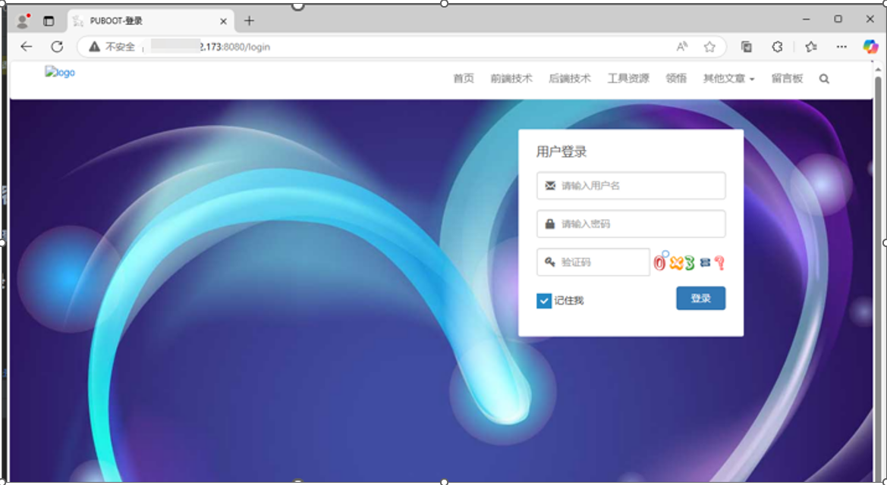

2、修改本地文件上传的路径：

在上传管理中的云存储配置中修改为本地存储

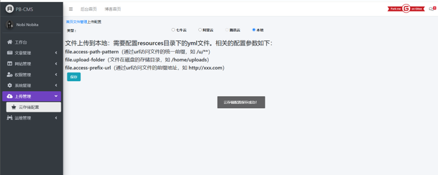

配置文件中修改路径为你指定上传路径

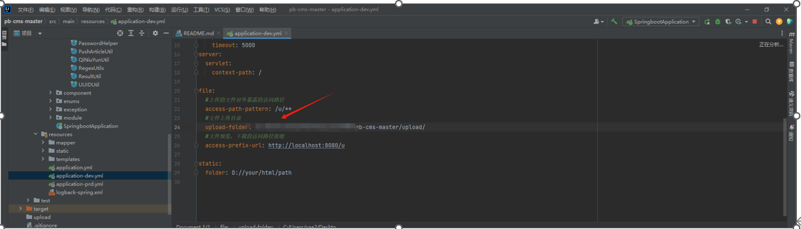

这边点保存

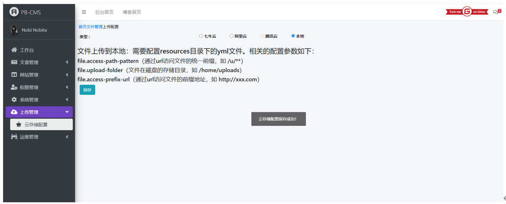

**0x05**漏洞复现：

1、任意文件上传

漏洞文件路径

src/main/java/com/puboot/module/admin/controller/UploadController.java

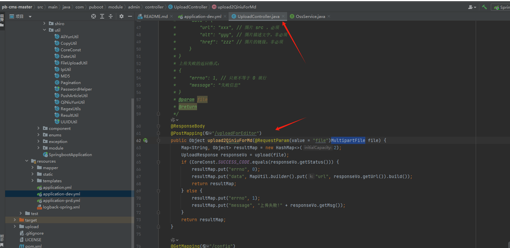

可以看代码，调用 upload 方法上传文件，然后判断返回状态码是否为200，是的话就上传成功，否则失败

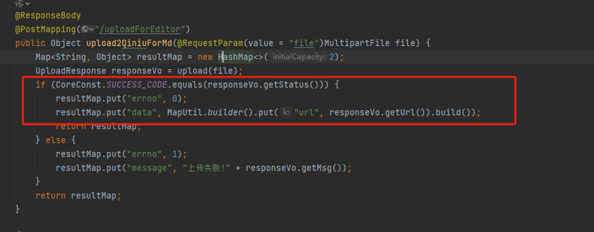

再来跟进下upload方法，可以看到调用ossService.upload(file)方法将文件上传

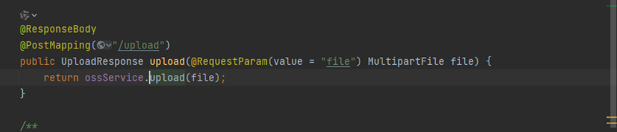

跟进upload方法

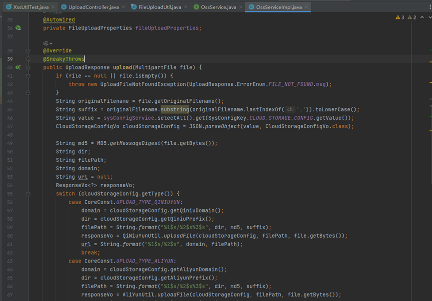

我们看到switch分支，我们是本地存储，直接看到UPLOAD\_TYPE\_LOCAL，跟进uploadLocal方法

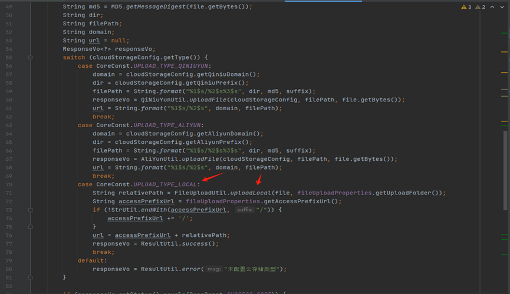

可以看到，获取原文件名前缀、时间戳和原文件后缀，无任何过滤，直接使用 FileCopyUtils.copy将文件字节内容写入到目标文件中

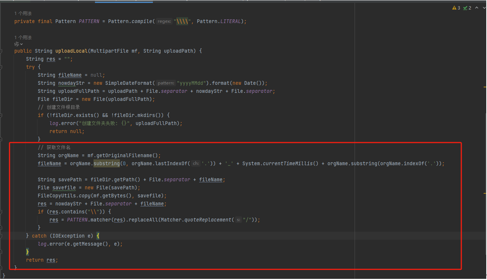

我们试着传JSP

找到后台功能点，进行上传捉包

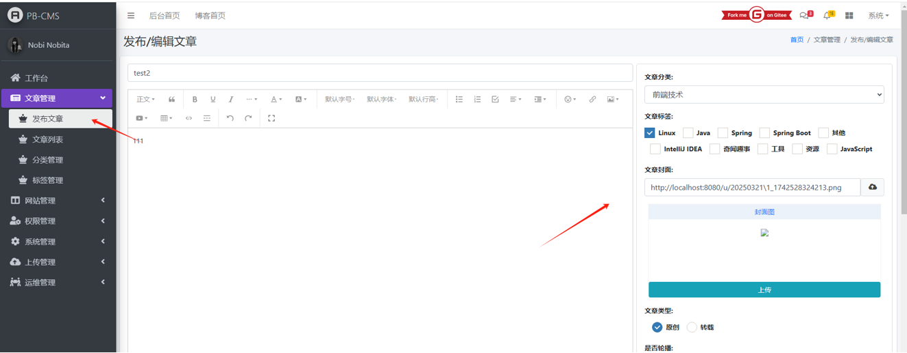

​

数据包如下

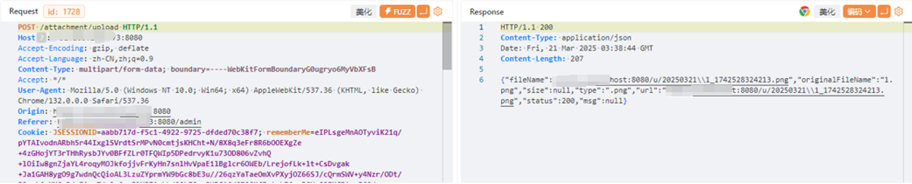

由于没找到对应的功能点，请求路由改为/uploadForEditor，进行发包

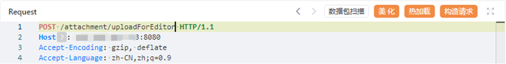

后缀改为jsp，可以发现上传成功

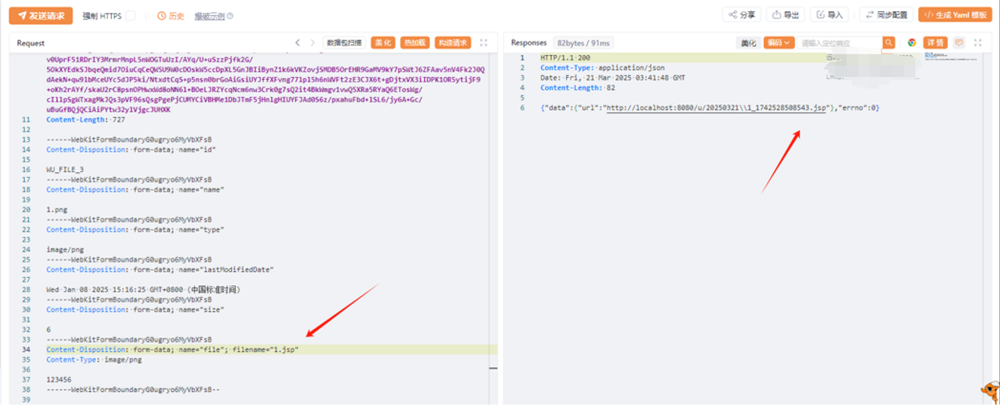

直接访问变成下载了

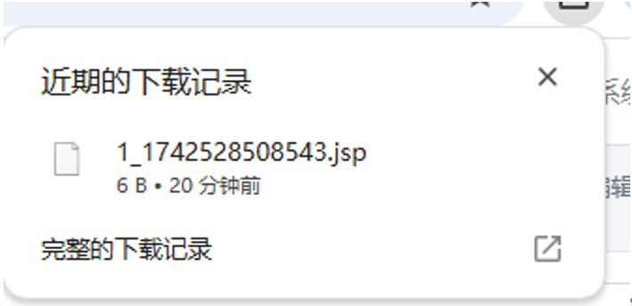

因为这个框架为Springboot框架，springboot框架一般不引用依赖的话不解析jsp文件，但是该系统使用的模板框架为thymeleaf 3.0.15，该版本的模板存在模板注入漏洞，该上传点可以直接上传任意文件后缀以及穿目录，所以我们可以将恶意模板直接上传到 thymeleaf的模板目录中替换掉原本的 404.html 模板，实际位于 target/classes/templates/error/404.html

​

我们来测试下：

这个版本的模板注入的payload需要进行绕过，payload如下

​

[[${T(ch.qos.logback.core.util.OptionHelper).instantiateByClassName("org.springframework.expression.spel.standard.SpelExpressionParser","".getClass().getSuperclass(),T(ch.qos.logback.core.util.OptionHelper).getClassLoader()).parseExpression("T(java.lang.String).forName('java.lang.Runtime').getRuntime().exec('calc')").getValue()}]]

​

插入到404.html上，保存然后重新运行项目

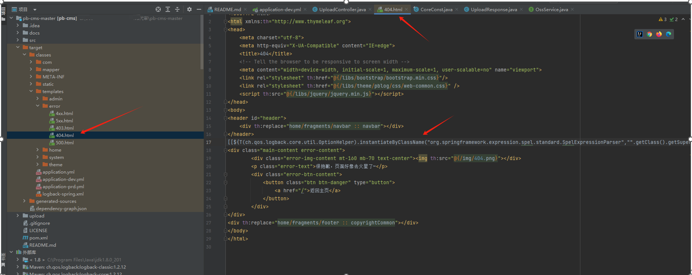

访问不存在的地址，弹计算器了

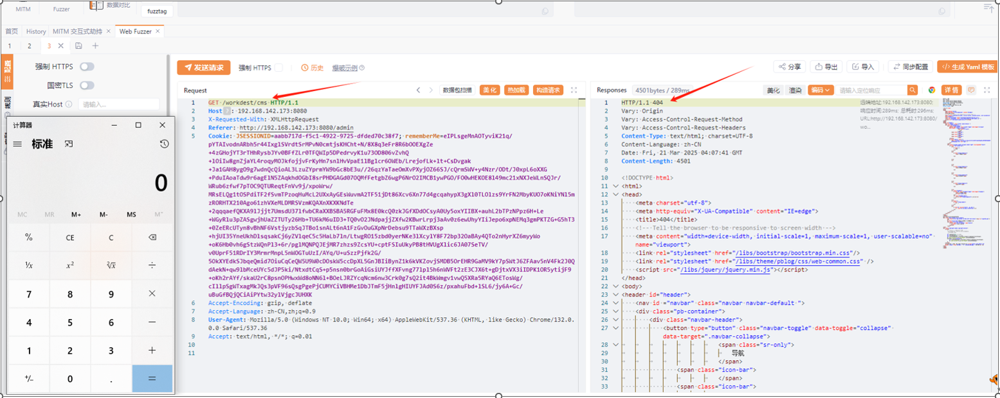

那现在直接进行测试，但是发现没法指定目录进行跨越

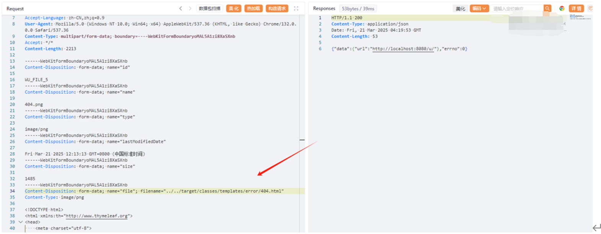

2、存储xss

基于上述任意文件上传，直接上传html

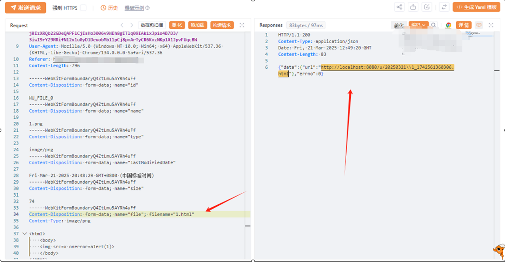

访问

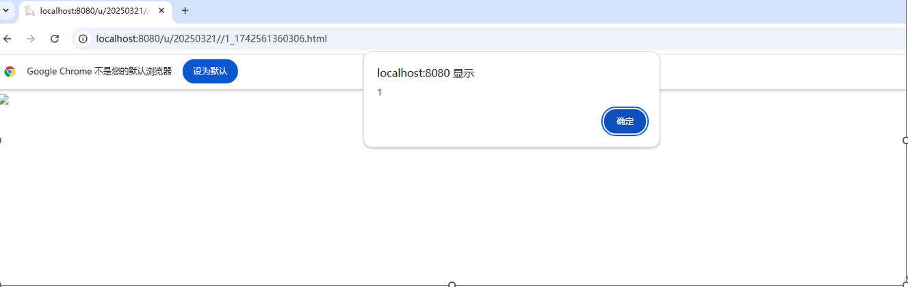

3、Csrf

代码中没有csrf的防护

新增用户管理处-用户管理-新增用户处

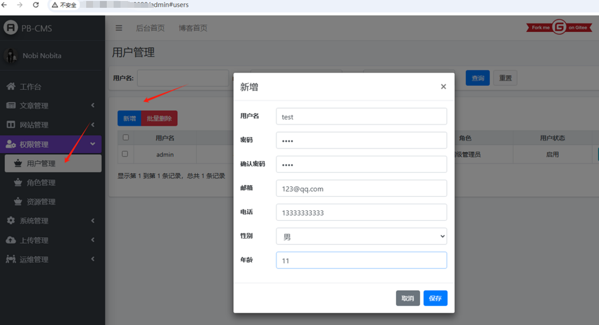

抓包如下

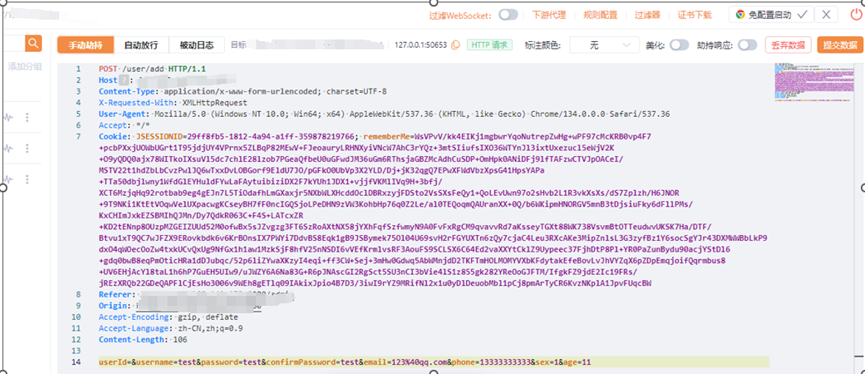

生成csrf\_poc

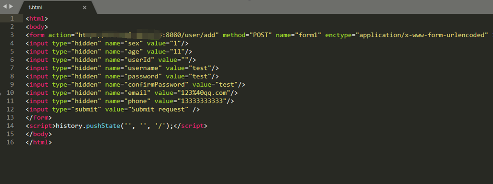

访问poc，成功添加

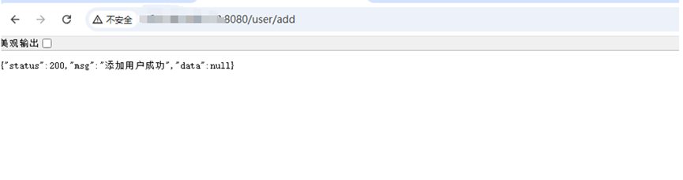

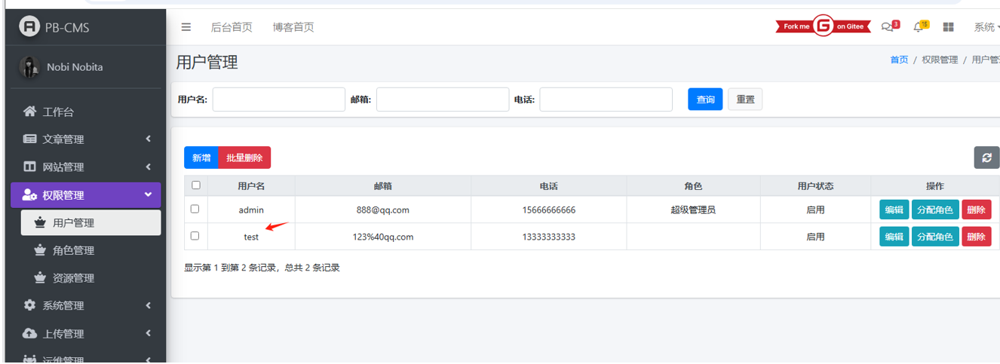
